## Overview

For our ME 102B final project, we designed and built a **cable-actuated air hockey robot**. The robot occupies one half of a standard air hockey table. Four BLDC motors mounted at the corners each drive a tensioned cable that meets at a center mallet, so the mallet's 2D position is controlled by differentially spooling/unspooling each cable. An overhead camera streams puck position and velocity into an Extended Kalman Filter (EKF), which feeds a naive MPC strategy: the robot either **defends** (blocking incoming shots by predicting puck intercept) or **attacks** (planning a quintic-spline trajectory to strike the puck toward the opponent's goal).

The project was deliberately chosen for the technical depth it forces across mechanical design, electronics, real-time control, computer vision, and motion planning — and because hitting a puck with a robot is fun.

---

## The Opportunity

Reflex-training methods for elite athletes are usually repetitive — catching falling objects, pressing buttons on light cues, and similar drills. A high-performance air hockey robot offers a more engaging alternative and removes the need for a human training partner. Hobbyist air hockey robots exist, but none achieve the shot velocity or precision needed to challenge elite athletes. Beyond training, the robot is also a fun standalone recreational platform.

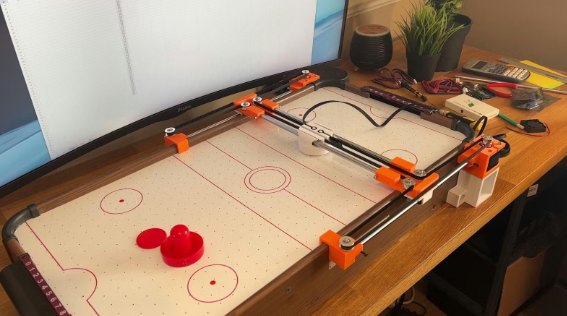
*Figure 1: An existing CoreXY-gantry air hockey robot (credit: zeroshot).*

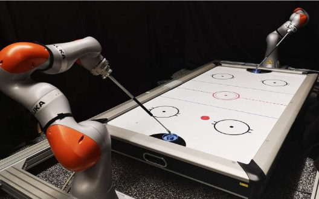
*Figure 2: Air hockey played using robot arms (credit: Puze Liu et al., [arxiv.org/abs/2107.06140](https://arxiv.org/abs/2107.06140)).*

We chose a **cable-driven parallel topology** instead of either of the above: it avoids the bulk and inertia of a CoreXY gantry and the cost/calibration burden of two robot arms, while still covering the full half-table workspace at high speed.

---

## High-Level Strategy

The robot occupies one half of the table. Four corner-mounted BLDC motors each drive a cable spool; all four cables converge on the mallet at the center. Rapid differential spooling repositions the mallet across the 2D workspace. The control loop runs at the Jetson Nano (host) and the moteus controllers (per-motor closed loop), connected over CAN. An overhead USB camera (UVC) streams puck state to an EKF, which drives the MPC strategy stack.

### Initial vs. Achieved Specifications

| Spec | Target | Achieved |
| :--- | :--- | :--- |
| Mallet strike speed | 6 m/s | 800 mm/s (tuning-limited) |
| Puck speed | 3.5 m/s | ~750 mm/s measured |
| Positioning accuracy | ±3 mm | ±3 mm on move-to-position; consistent transient tracking, unquantified |
| Simulation correlation | Predicted shot paths score in real life | Real-time tracking works; correlation not quantitatively measured |
| Drive system | 4× BLDC with belt reduction | 4× BLDC, 1:1 transmission |
| Sensing | Camera + motor encoders | Single overhead camera + encoders, fused via EKF |
| Control strategy | RL agent for mallet placement | Naive MPC with quintic-spline trajectories (RL did not tune in time) |

The largest gap was strike velocity: tuning the cable-drive loop above ~800 mm/s exposed cable-slack and tension-tracking issues that we never fully resolved in the project window.

---

## Integrated Physical Device

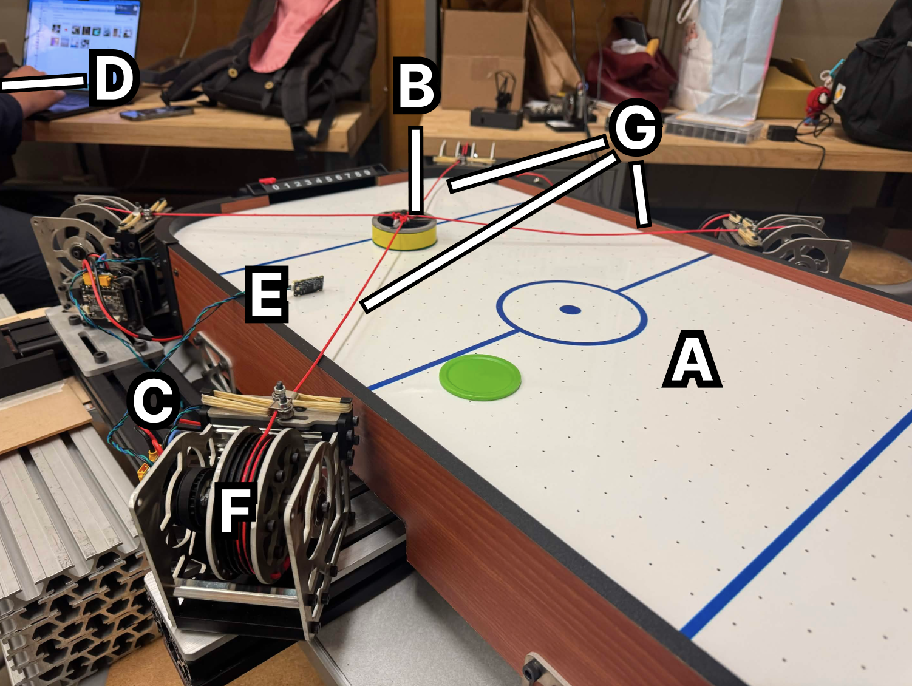
*Figure 3: Full integrated robot.*

| Label | Component |
| :---: | :--- |
| A | Air hockey table (COTS) |
| B | Mallet (sheet-metal + 3D-printed) |
| C | 80/20 aluminum-extrusion frame |
| D | Camera mounting subassembly (overhead, off-frame) |
| E | Mounting plate with rubber feet (×4) |
| F | Corner assemblies (×4) |
| G | Bungee cables (tension preload) |

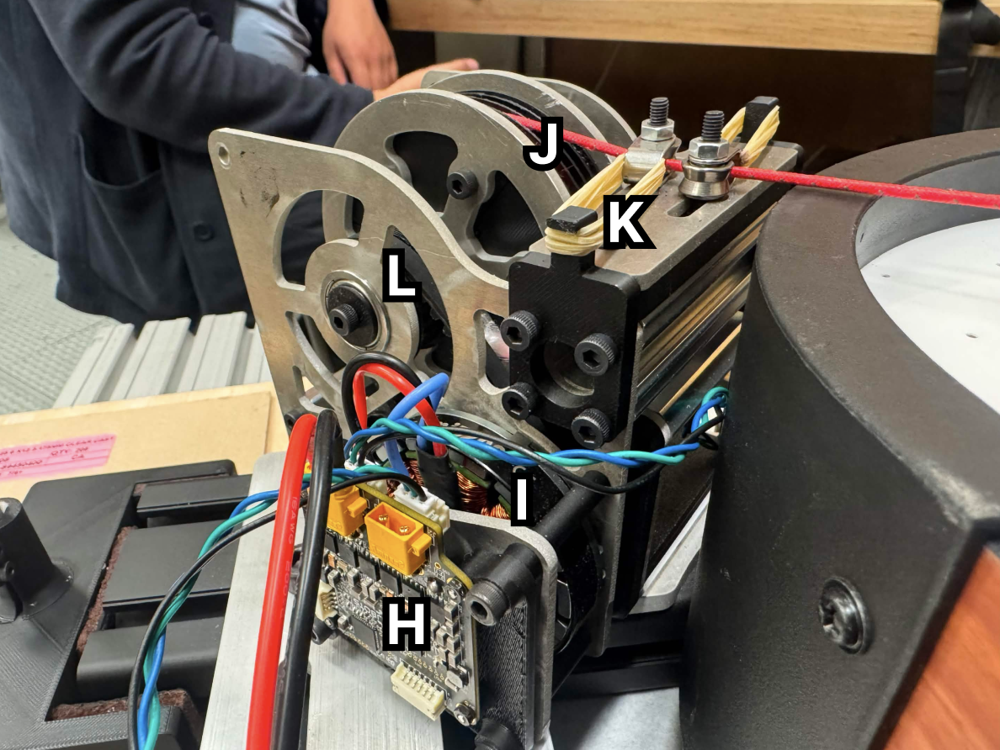
*Figure 4: A single corner module.*

| Label | Component |
| :---: | :--- |
| H | Encoder (moteus r4.11 onboard) |
| I | Motor (MJ5208 BLDC) |
| J | Spool |
| K | Tensioner |
| L | Pulley |

---

## Function-Critical Calculations

### Speed Requirement

Primary target: a mallet speed of 6 m/s, chosen to produce a puck speed of ~3.5 m/s — fast enough that a human opponent cannot reliably react, given an average human reaction time of 250 ms and a table length of 40 inches.

### Motor and Transmission Selection

Each corner motor drives a cable spool through a 1:1 belt (20-tooth to 20-tooth pulley). Required spool RPM for the target mallet speed:

$$
N_\text{spool} = \frac{V_\text{des}}{\pi \cdot d_\text{spool}/1000} \cdot 60 = \frac{6}{\pi \cdot 0.075} \cdot 60 \approx 7894\ \text{rpm}
$$

Motor maximum no-load RPM at supply voltage:

$$
N_\text{max} = K_V \cdot V_\text{PSU} = 330 \cdot 24 = 7920\ \text{rpm}
$$

Since $N_\text{max} \geq N_\text{spool}$, the motor can hit the target mallet speed at 1:1 — no gear reduction required.

### Torque Validation

With mallet mass 0.5 kg, target acceleration 15 m/s², and 10 N cable pretension:

$$
F_\text{acc} = m \cdot a = 0.5 \cdot 15 = 7.5\ \text{N}
$$

$$
F_\text{total} = (F_\text{acc} + F_\text{pre}) \cdot SF = (7.5 + 10) \cdot 2 = 35\ \text{N}
$$

Required motor torque:

$$
T_\text{req} = F_\text{total} \cdot r_\text{spool} = 35 \cdot 0.03725 = 1.31\ \text{Nm}
$$

The MJ5208 has a peak torque of 1.7 Nm — sufficient with margin.

### Bearing Loads

With a 1:1 belt drive and a 180° wrap angle, the circumferential force on the pulley is:

$$
F_c = \frac{2 T_\text{spool}}{d_\text{pulley}} = \frac{2 \cdot 1.3125}{0.0127} \approx 206.7\ \text{N}
$$

By inspection of the spool FBD, the resulting bearing loads are less than this transmission force. Standard flanged bearings are sufficient.

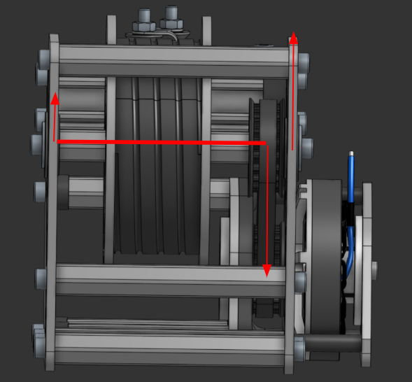
*Figure 5: Bearing free-body diagram.*

---

## Electronics and State Machine

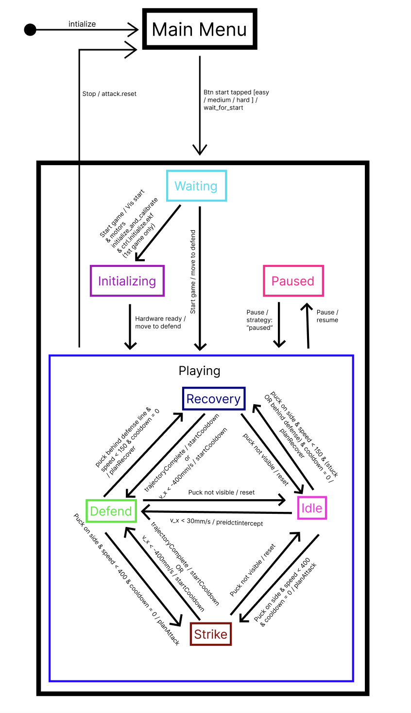
*Figure 6: Control state machine — idle, calibrating, defending, attacking, recovering.*

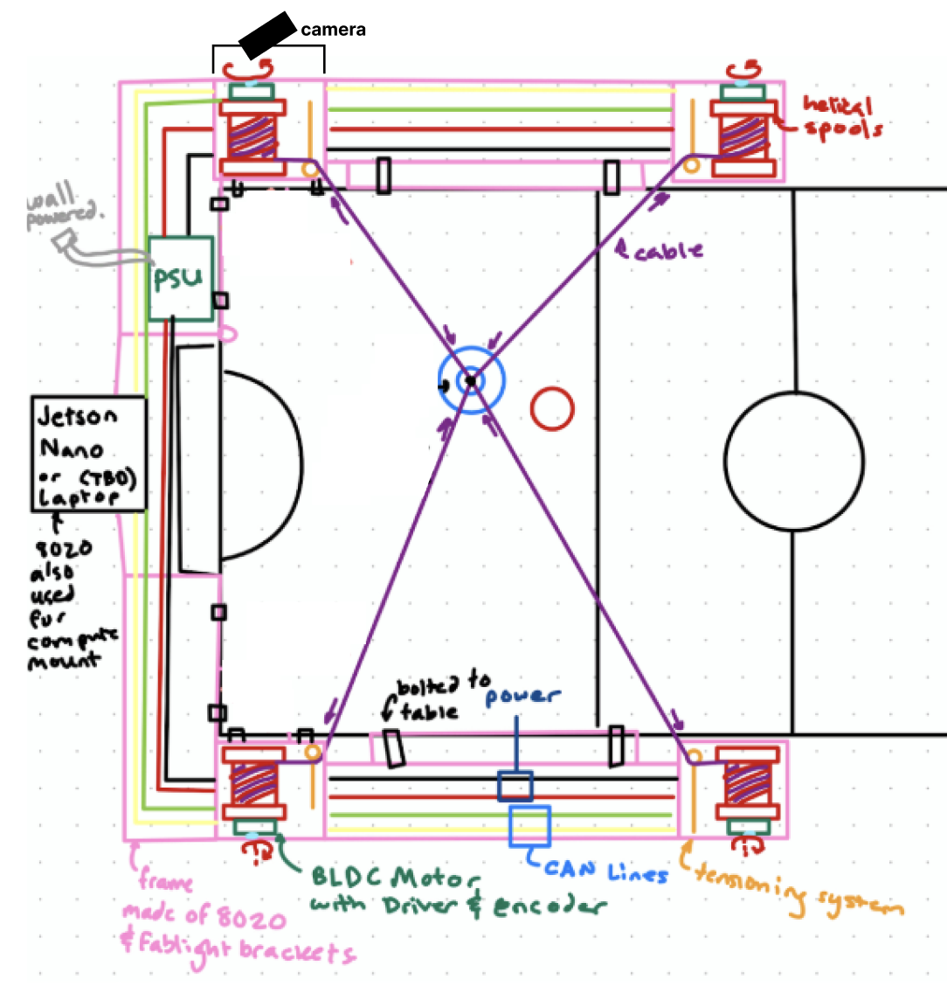
*Figure 7: Power and signal distribution. 24 V from RSP-750-24 PSU → power distribution block → four moteus r4.11 controllers over CAN; Jetson Nano hosts the camera and runs the planning stack.*

---

## Software Architecture

The host (Jetson Nano) runs the high-level planner in Python; the moteus controllers run the inner closed-loop on each motor. Communication between layers is asynchronous and non-blocking:

- **Vision** — OpenCV camera capture → homography to table coordinates → parallax correction for mallet height → puck detection.
- **State estimation** — EKF with a constant-velocity model fuses camera observations into mallet/puck state.
- **Planning** — Inverse kinematics from mallet XY to four spool encoder positions; quintic-spline trajectories interpolated between current and target state.
- **Control** — Encoder velocity commands streamed to the four moteus controllers over CAN; closed-loop torque control runs on the moteus boards.
- **HMI** — Auxiliary microcontroller drives a TFT screen showing live puck/mallet positions and predicted trajectories, fed by a JSON-over-UART protocol.

### Inverse and Forward Kinematics

```python
def xy_to_enc(pos):
    """Inverse kinematics: mallet XY (mm) -> encoder positions (rev)."""
    lengths_mm = np.linalg.norm(CORNERS - pos, axis=1)
    return SIGNS * lengths_mm / SPOOL_CIRC_MM

def enc_to_xy(enc):
    """Least-squares forward kinematics: encoder readings -> mallet XY (mm)."""
    lengths_mm = np.abs(enc * SIGNS) * SPOOL_CIRC_MM
    x0, y0 = CORNERS[0]
    l0 = lengths_mm[0]
    A, b = [], []
    for i in [1, 2, 3]:
        xi, yi = CORNERS[i]
        li = lengths_mm[i]
        A.append([2 * (xi - x0), 2 * (yi - y0)])
        b.append((l0**2 - li**2) + (xi**2 - x0**2) + (yi**2 - y0**2))
    return np.linalg.lstsq(np.array(A), np.array(b), rcond=None)[0]
```

Inverse kinematics is closed-form. Forward kinematics is over-determined (four cable lengths, two DoF), so we solve a least-squares trilateration anchored on the first corner.

### Cable-Drive Jacobian

```python
def xy_vel_to_enc_vel(pos_xy, vel_xy):
    """Cartesian velocity (mm/s) -> encoder velocity (rev/s)."""
    diff  = CORNERS - pos_xy
    norms = np.linalg.norm(diff, axis=1, keepdims=True)
    unit  = diff / np.maximum(norms, 1e-9)
    dl_dt = unit @ vel_xy
    return SIGNS * dl_dt / SPOOL_CIRC_MM
```

This maps a desired Cartesian mallet velocity into the four spool velocities. The unit vectors from mallet to each corner form the Jacobian rows; the spool circumference converts mm/s → rev/s.

### EKF for Mallet State Estimation

```python
def predict(self, dt):
    """Predict state forward using constant-velocity model."""
    F = np.array([
        [1, 0, dt, 0],
        [0, 1, 0, dt],
        [0, 0, 1,  0],
        [0, 0, 0,  1],
    ], dtype=float)
    self.x = F @ self.x
    self.P = F @ self.P @ F.T + self.Q * dt

def update(self, z):
    """Update state with camera measurement z = [x_mm, y_mm]."""
    z = np.asarray(z, dtype=float)
    y = z - self.H @ self.x
    S = self.H @ self.P @ self.H.T + self.R
    K = self.P @ self.H.T @ np.linalg.inv(S)
    self.x = self.x + K @ y
    self.P = (np.eye(4) - K @ self.H) @ self.P
```

The state vector is $[x,\ y,\ \dot{x},\ \dot{y}]$. Process noise $Q$ scales with $dt$ so the filter remains stable across variable camera frame intervals; measurement noise $R$ was tuned from the per-pixel scatter of static-puck observations.

### Quintic-Spline Trajectory Generation

```python
def get_quintic_coeffs_norm(p0, v0, a0, p1, v1, a1, dt):
    """Quintic spline coefficients for tau in [0, 1]."""
    v0_n, v1_n = v0 * dt, v1 * dt
    a0_n, a1_n = a0 * dt**2, a1 * dt**2
    c0, c1, c2 = p0, v0_n, a0_n / 2.0
    b_p = p1 - (c0 + c1 + c2)
    b_v = v1_n - (c1 + 2*c2)
    b_a = a1_n - 2*c2
    c3 =  10*b_p - 4*b_v + 0.5*b_a
    c4 = -15*b_p + 7*b_v - b_a
    c5 =  6*b_p - 3*b_v + 0.5*b_a
    return (c0, c1, c2, c3, c4, c5)
```

Quintic gives us continuous position, velocity, *and* acceleration at both boundary points. The control loop samples the spline forward and pushes Cartesian setpoints through the Jacobian into encoder-velocity commands.

### Vision: Homography and Parallax Correction

```python
def get_real_world_coords(px, py, H):
    pixel_vector = np.array([[[px, py]]], dtype="float32")
    world_vector = cv.perspectiveTransform(pixel_vector, H)
    return world_vector[0][0][0], world_vector[0][0][1]

def correct_parallax_error(tracked_x, tracked_y):
    scale_factor = (CAMERA_HEIGHT_MM - MALLET_HEIGHT_MM) / CAMERA_HEIGHT_MM
    return tracked_x * scale_factor, tracked_y * scale_factor
```

The mallet sits well above the table surface, so its centroid as seen by the overhead camera does *not* project to its true ground-plane position. The parallax correction scales the homography output by the camera/mallet height ratio.

### Puck Wall-Bounce Prediction

```python
def predict_puck_trajectory(pos, vel, dt, num_steps):
    """Simulate puck trajectory with wall bounces."""
    x, y = float(pos[0]), float(pos[1])
    vx, vy = float(vel[0]), float(vel[1])
    trajectory = []
    for _ in range(num_steps):
        x += vx * dt
        y += vy * dt
        if y < PUCK_Y_MIN:
            y = 2 * PUCK_Y_MIN - y
            vy = -vy
        elif y > PUCK_Y_MAX:
            y = 2 * PUCK_Y_MAX - y
            vy = -vy
        trajectory.append((x, y))
    return trajectory
```

We propagate forward in time with elastic side-wall reflections (no energy loss model, intentionally — empirically the puck loses ~10% per bounce, but the planner re-plans every frame so the systematic error never accumulates).

### Non-Blocking UART Protocol (HMI side)

```cpp
void broadcastMessage(const char *json)
{
    Serial.println(json);
}

void checkSerialIncoming()
{
    static char buf[1024];
    static int buflen = 0;

    while (Serial.available())
    {
        int c = Serial.read();
        if (c < 0) break;

        if (c == '\n' || c == '\r')
        {
            if (buflen > 0)
            {
                buf[buflen] = '\0';
                if (buf[0] == '{')
                    processIncomingMessage(buf);
                buflen = 0;
            }
        }
        else if (buflen < (int)sizeof(buf) - 1)
        {
            buf[buflen++] = (char)c;
        }
        else { buflen = 0; }
    }
}
```

Line-delimited JSON in, line-delimited JSON out. The UART read loop never blocks — partial lines accumulate in a static buffer, complete lines hand off to `processIncomingMessage`, and over-length lines are discarded.

### TFT Coordinate Mapping

```cpp
int16_t mmToPxX(float x_mm)
{
    float pad = 20.0f;
    return TABLE_PX_X + (int16_t)((x_mm - (TBL_X_MIN - pad)) /
           ((TBL_X_MAX + pad) - (TBL_X_MIN - pad)) * TABLE_PX_W);
}

int16_t mmToPxY(float y_mm)
{
    float pad = 20.0f;
    return TABLE_PX_Y + (int16_t)(((TBL_Y_MAX + pad) - y_mm) /
           ((TBL_Y_MAX + pad) - (TBL_Y_MIN - pad)) * TABLE_PX_H);
}
```

### Flicker-Free Dynamic Rendering

```cpp
void eraseAllDynamic()
{
    if (prevPuckPX >= 0)
        tft.fillCircle(prevPuckPX, prevPuckPY, 8, TFT_BLACK);
    if (prevMalletPX >= 0)
        tft.fillCircle(prevMalletPX, prevMalletPY, 10, TFT_BLACK);
    redrawTableLines();
}

void drawAllDynamic()
{
    if (puckValid)
    {
        int16_t px = mmToPxX(puckX);
        int16_t py = mmToPxY(puckY);
        tft.fillCircle(px, py, 6, COL_PUCK);
        tft.drawCircle(px, py, 7, 0x0400);
        prevPuckPX = px;
        prevPuckPY = py;
    }
    // ... [mallet and trajectory drawing]
}
```

Erase-old-then-draw-new pattern in two phases. The whole TFT is never cleared; only the dirty regions get blanked, so we avoid the perceived flicker of `tft.fillScreen()`-per-frame.

### JSON State Parsing

```cpp
void processIncomingMessage(const char *buf) {
    char type[16] = "";
    jsonString(buf, "type", type, sizeof(type));

    if (strcmp(type, "state") == 0) {
        puckX = jsonFloat(buf, "px", puckX);
        puckY = jsonFloat(buf, "py", puckY);
        puckValid = (jsonFloat(buf, "pv", 0) > 0.5f);
        malletX = jsonFloat(buf, "mx", malletX);
        malletY = jsonFloat(buf, "my", malletY);
        malletValid = (jsonFloat(buf, "mv", 0) > 0.5f);
        jsonString(buf, "strategy", strategy, sizeof(strategy));
        trajLen = jsonFloatArray(buf, "traj", trajX, trajY, MAX_TRAJ_PTS);

        if (currentScreen == SCREEN_GAME && !goalBannerActive() && !winnerActive)
            updateGameView();
    }
    // ... [score and goal parsing]
}
```

Hand-written non-allocating JSON helpers — no Arduino-side dynamic memory, no ArduinoJson dependency.

The full FSM and game-control code lives on GitHub: [`https://github.com/thomaszyu/me102b`](https://github.com/thomaszyu/me102b).

---

## Reflection

### What Worked Well

Our team kept strong CAD progress across all subsystems and executed manufacturing efficiently — the table was finished well ahead of schedule. Nearly everything worked first try, which is a testament to how thoroughly we planned before cutting parts. The one minor hiccup was a delay on the safety shields due to broken 3D printers, but it didn't impact the overall timeline. We structured the workflow so simulation and computer-vision development ran in parallel with physical manufacturing, which meant the software side was never bottlenecked waiting on hardware.

### What We Would Change

We would not change much. The main thing we'd add is a **strict code freeze before demos** — on showcase day we had a last-minute merge conflict resolved incorrectly that deleted parts of our code; in hindsight an easy fix, but a stressful one in the moment.

The other change is a **better cable tension detection and maintenance system**. This was the primary source of our control error and the reason we could not run the motors at higher speeds. A mechanical system to detect cable slack and ensure correct spool/unspool behavior at all times would have unlocked much higher mallet velocities. Even without it, the robot was quite good in the end.

---

## Photo, Video, and Document Gallery

### CAD Renderings

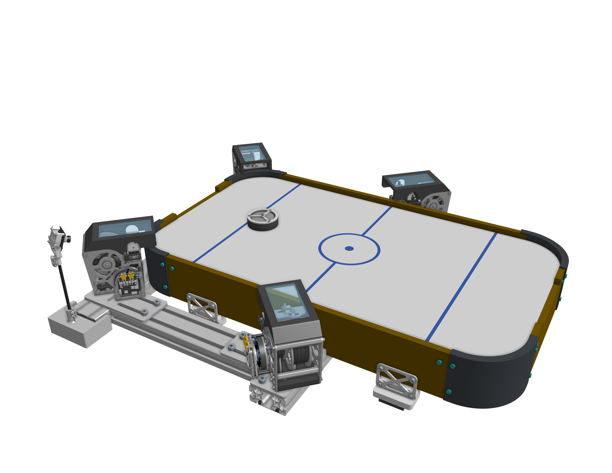
*Figure 8: Full robot — rendered CAD model of the integrated system.*

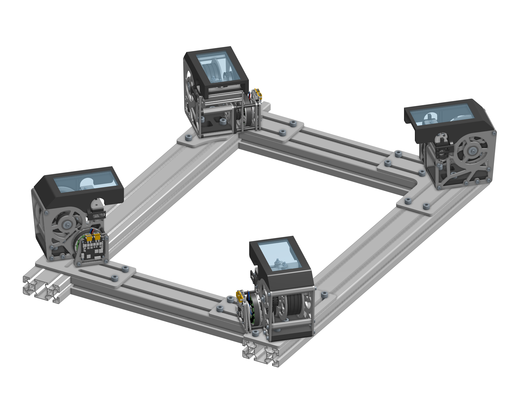
*Figure 9: 80/20 aluminum-extrusion frame — rendered CAD model.*

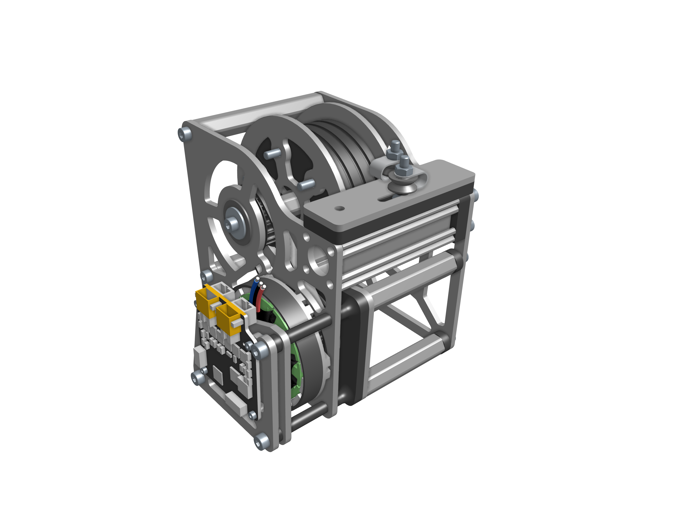
*Figure 10: Corner assembly — isometric CAD view (motor, spool, tensioner, pulley).*

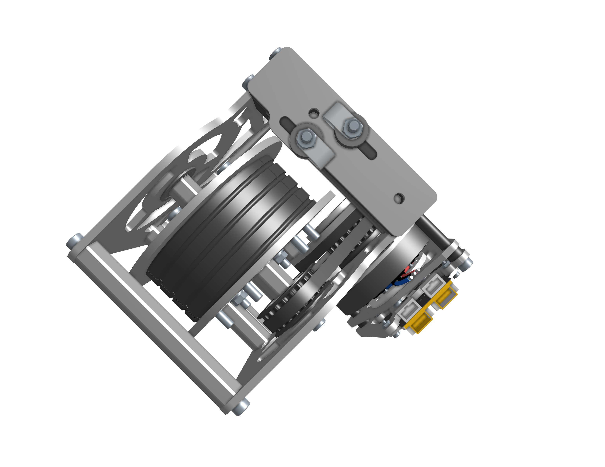
*Figure 11: Corner assembly — top CAD view.*

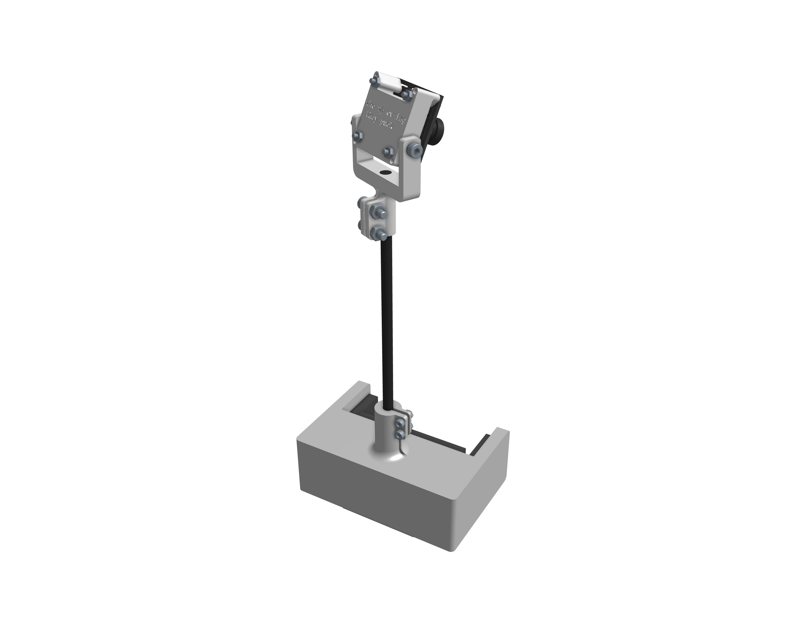
*Figure 12: Overhead camera mounting subassembly — CAD view 1.*

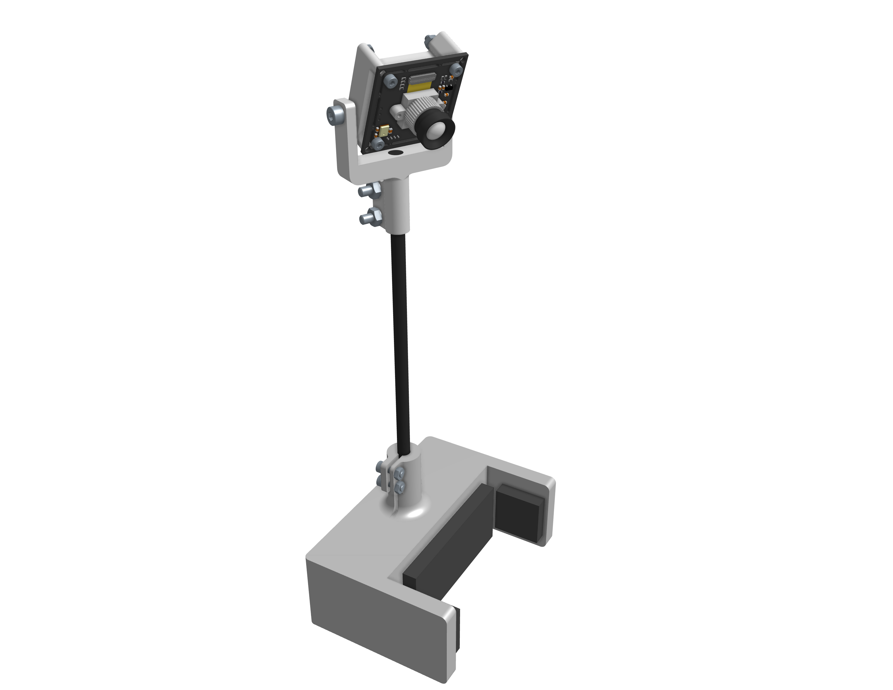
*Figure 13: Overhead camera mounting subassembly — CAD view 2.*

### Videos

<video width="100%" controls muted playsinline preload="metadata">
  <source src="images/playing_against_robot.mp4" type="video/mp4">
  Your browser does not support the video tag.
</video>
<p style="text-align: center; font-style: italic; color: var(--secondary);">Playing against the robot — full gameplay demo.</p>

<video width="100%" controls muted playsinline preload="metadata">
  <source src="images/motor_homing.mp4" type="video/mp4">
  Your browser does not support the video tag.
</video>
<p style="text-align: center; font-style: italic; color: var(--secondary);">Motor homing sequence at startup.</p>

<video width="100%" controls muted playsinline preload="metadata">
  <source src="images/corner_assembly_moving.mp4" type="video/mp4">
  Your browser does not support the video tag.
</video>
<p style="text-align: center; font-style: italic; color: var(--secondary);">Corner assembly — spool, pulley, and cable in motion.</p>

<video width="100%" controls muted playsinline preload="metadata">
  <source src="images/camera_feed_and_image_rectification.mp4" type="video/mp4">
  Your browser does not support the video tag.
</video>
<p style="text-align: center; font-style: italic; color: var(--secondary);">Overhead camera feed with homography rectification into table coordinates.</p>

<video width="100%" controls muted playsinline preload="metadata">
  <source src="images/debug_screen_with_trajectory_andpuck_detection.mp4" type="video/mp4">
  Your browser does not support the video tag.
</video>
<p style="text-align: center; font-style: italic; color: var(--secondary);">Debug view — puck detection with the predicted puck-trajectory overlay.</p>

<video width="100%" controls muted playsinline preload="metadata">
  <source src="images/LCD_screen.mp4" type="video/mp4">
  Your browser does not support the video tag.
</video>
<p style="text-align: center; font-style: italic; color: var(--secondary);">TFT HMI screen showing live game state — puck, mallet, and planned trajectory.</p>

### Project Documents

- [Project Pitch Slides (PDF)](/me102b/ME102B_Project_Pitch_Slides.pdf) — initial pitch
- [Teaming and Pitch Activities (PDF)](/me102b/ME102B_Teaming_and_Pitch_Activities.pdf) — team formation deck
- [Shop Consultation Pitch Slides (PDF)](/me102b/Shop_Consultation_Pitch_Slides.pdf) — manufacturing review
- [P3 CAD Review (PDF)](/me102b/P3_CAD.pdf) — full CAD package
- [P4B Design Refinement (PDF)](/me102b/P4B_Design_Refinement.pdf) — design iteration
- [P4B Bill of Materials (PDF)](/me102b/P4B_BoM.pdf) — full BOM
- [Software Design (PDF)](/me102b/Software_Design.pdf) — software architecture deck

---

## Bill of Materials (Summary)

Full BOM is in the linked [P4B BoM PDF](/me102b/P4B_BoM.pdf). Highlights:

| Sub-assembly | Notable Items | Cost |
| :--- | :--- | ---: |
| Table & frame | COTS air-hockey table, 80/20 extrusion, sheet-metal mallet | ~$135 |
| Corner assemblies (×4) | MJ5208 BLDC, moteus r4.11, 12 mm REX shafts, flanged bearings | ~$200 |
| Tensioners | GoBilda pulley brackets and extrusion | ~$80 |
| Electronics | RSP-750-24 PSU, power distribution block, CAN cables, Jetson Nano | ~$520 |
| Vision | 2× USB 2.0 UVC camera modules | ~$36 |
| Hardware (fasteners) | M2 / M3 / M4 / M6 / M8 SHCS, nuts, washers | ~$135 |
| **Total** | | **~$1,108** |

---

## Acknowledgments

Thanks to the ME 102B instructors and shop staff for fifteen weeks of guidance, and to the open-source maintainers behind [moteus](https://github.com/mjbots/moteus), [OpenCV](https://opencv.org/), and the [Jetson Nano](https://developer.nvidia.com/embedded/jetson-nano) ecosystem. **Thomas Yu, Athul Krishnan, Eric Yamaguchi, and Larry Hui** contributed across all sub-systems; this was a four-way collaborative build.
