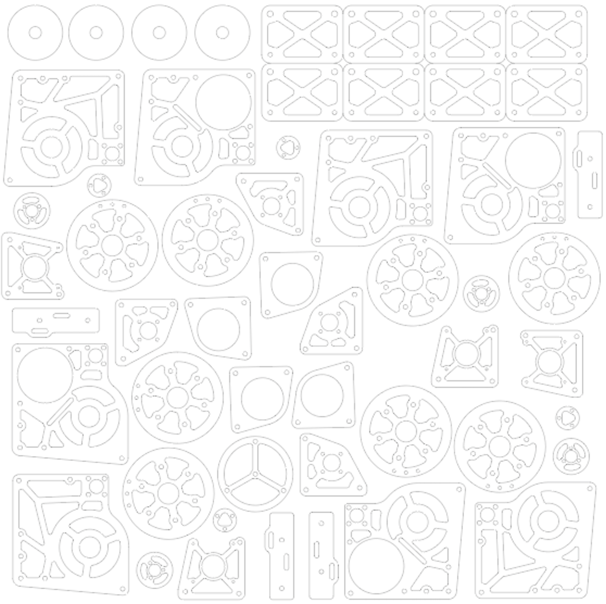
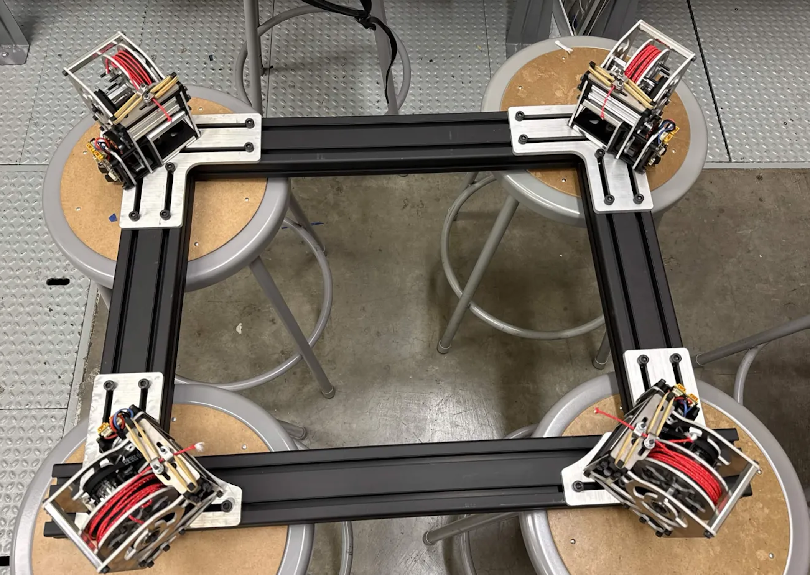
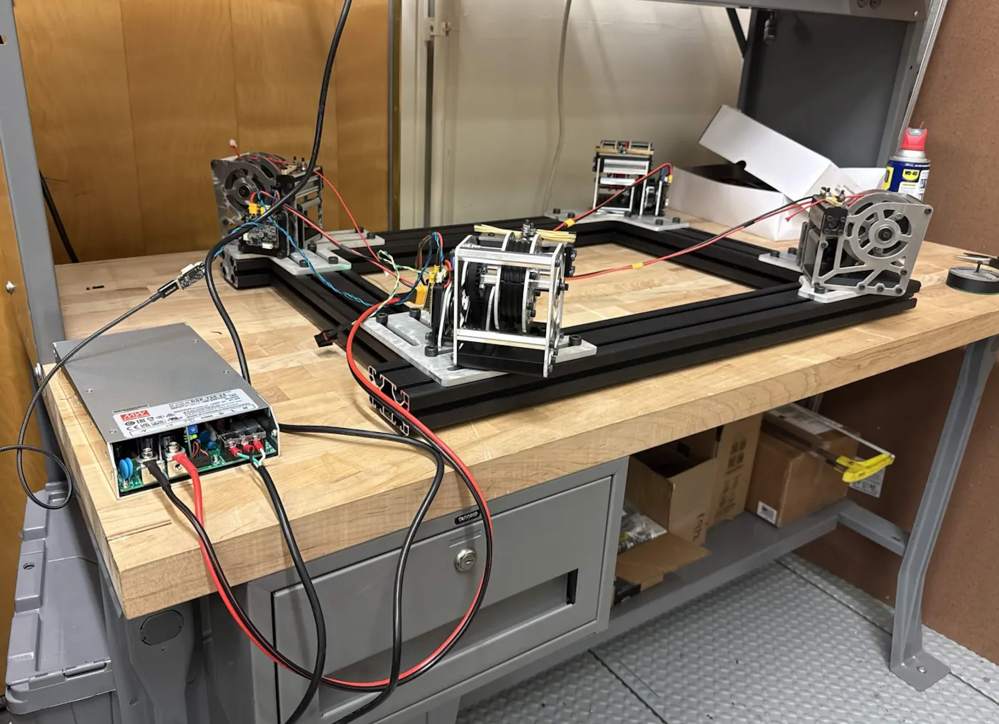
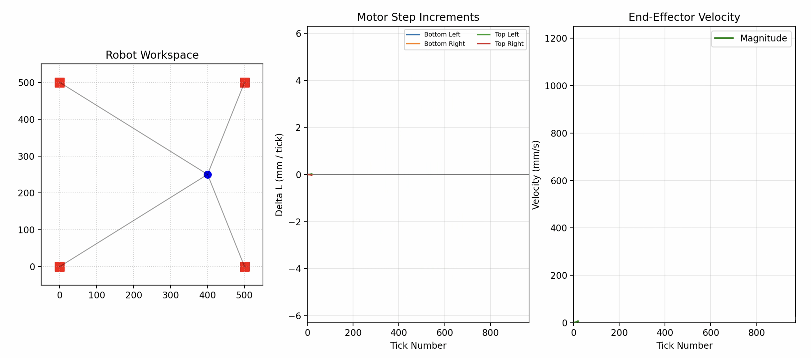
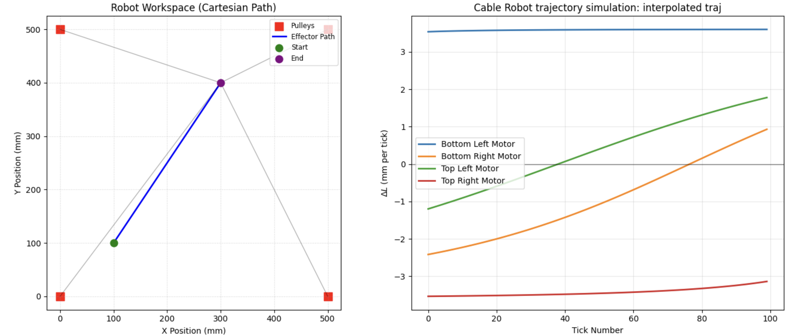
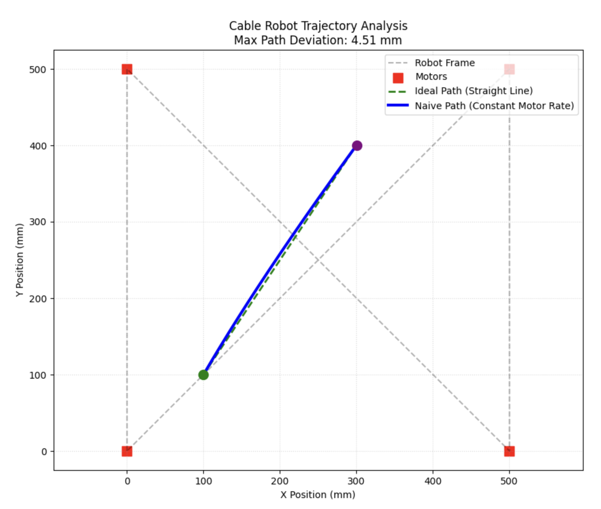

<link rel="stylesheet" href="/me102b/air_hockey_viz.css">
<script defer src="/me102b/air_hockey_viz.js"></script>

## Overview

For our ME 102B final project, we designed and built a **cable-actuated air hockey robot**. The robot occupies one half of a standard air hockey table. Four BLDC motors mounted at the corners each drive a tensioned cable that meets at a center mallet, so the mallet's 2D position is controlled by differentially spooling/unspooling each cable. An overhead camera tracks both the puck and the mallet. The mallet position goes through an Extended Kalman Filter (EKF), and the puck state goes through a fast filter and a wall-bounce predictor. Both feed a naive MPC strategy: every 10 ms the robot re-decides whether to **defend** (block an incoming shot at its predicted intercept) or **attack** (plan a quintic-spline trajectory that strikes the puck toward the opponent's goal).

The project was deliberately chosen for the technical depth it forces across mechanical design, electronics, real-time control, computer vision, and motion planning — and because hitting a puck with a robot is fun.

This page walks through the whole pipeline in the order data flows through it: **camera → vision → state estimation → prediction and planning → cable kinematics → motor control**. Most sections have a live animation that runs the same algorithm, geometry, and constants as the robot code.

---

## The Opportunity

Reflex-training methods for elite athletes are usually repetitive — catching falling objects, pressing buttons on light cues, and similar drills. A high-performance air hockey robot offers a more engaging alternative and removes the need for a human training partner. Hobbyist air hockey robots exist, but none achieve the shot velocity or precision needed to challenge elite athletes. Beyond training, the robot is also a fun standalone recreational platform.


*Figure 1: An existing CoreXY-gantry air hockey robot (credit: zeroshot).*


*Figure 2: Air hockey played using robot arms (credit: Puze Liu et al., [arxiv.org/abs/2107.06140](https://arxiv.org/abs/2107.06140)).*

We chose a **cable-driven parallel topology** instead of either of the above: it avoids the bulk and inertia of a CoreXY gantry and the cost/calibration burden of two robot arms, while still covering the full half-table workspace at high speed.

---

## High-Level Strategy

The robot occupies one half of the table. Four corner-mounted BLDC motors each drive a cable spool; all four cables converge on the mallet at the center. Rapid differential spooling repositions the mallet across the 2D workspace. The high-level loop runs in Python on the host (Jetson Nano), and each moteus controller closes its own motor loop, connected over CAN. An overhead USB camera (UVC) provides the only absolute measurement of where the puck and mallet are.

### Initial vs. Achieved Specifications

| Spec | Target | Achieved |
| :--- | :--- | :--- |
| Mallet strike speed | 6 m/s | 800 mm/s (tuning-limited) |
| Puck speed | 3.5 m/s | ~750 mm/s measured |
| Positioning accuracy | ±3 mm | ±3 mm on move-to-position; consistent transient tracking, unquantified |
| Simulation correlation | Predicted shot paths score in real life | Real-time tracking works; correlation not quantitatively measured |
| Drive system | 4× BLDC with belt reduction | 4× BLDC, 1:1 transmission |
| Sensing | Camera + motor encoders | Single overhead camera + encoders, fused via EKF |
| Control strategy | RL agent for mallet placement | Naive MPC with quintic-spline trajectories on hardware (RL did not tune in time; Q-learning and PPO agents were later trained in simulation, see [below](#reinforcement-learning-in-simulation)) |

The largest gap was strike velocity: tuning the cable-drive loop above ~800 mm/s exposed cable-slack and tension-tracking issues that we never fully resolved in the project window.

---

## Integrated Physical Device


*Figure 3: Full integrated robot.*

| Label | Component |
| :---: | :--- |
| A | Air hockey table (COTS) |
| B | Mallet (sheet-metal + 3D-printed) |
| C | 80/20 aluminum-extrusion frame |
| D | Camera mounting subassembly (overhead, off-frame) |
| E | Mounting plate with rubber feet (×4) |
| F | Corner assemblies (×4) |
| G | Bungee cables (tension preload) |


*Figure 4: A single corner module.*

| Label | Component |
| :---: | :--- |
| H | Encoder (moteus r4.11 onboard) |
| I | Motor (MJ5208 BLDC) |
| J | Spool |
| K | Tensioner |
| L | Pulley |

### Fabrication

The corner modules are stacks of waterjet-cut aluminum plates: motor mounts, spool flanges, and side frames, all lightened with pockets. The whole set of plates nests onto one sheet.


*Figure 5: Waterjet layout for every plate in the four corner modules.*


*Figure 6: The 80/20 base with all four corner modules mounted and spooled with cable, before the table went on.*

---

## Function-Critical Calculations

These are the sizing calculations from the design phase. Each one was re-checked against the final geometry in `config.py`. Where the original hand calculation used a simplification, a more complete model follows it.

### Speed Requirement

Primary target: a mallet speed of 6 m/s, chosen to produce a puck speed of ~3.5 m/s. That is fast enough that a human opponent cannot reliably react. Over a 40 in (1.016 m) table, the puck's travel time is

$$
t_\text{cross} = \frac{L_\text{table}}{v_\text{puck}} = \frac{1.016}{3.5} \approx 0.29\ \text{s}
$$

which is only about 40 ms longer than an average human reaction time of 250 ms, leaving almost no time to move once the reaction is complete.

**Mallet-to-puck speed.** Treating the hit as an instantaneous impact along the contact normal $\hat{\mathbf n}$, conservation of momentum with restitution $e$ gives the puck's post-impact speed for a puck initially at rest:

$$
v_p^+ = (1 + e)\,\frac{m_m}{m_m + m_p}\,\big(\mathbf v_m \cdot \hat{\mathbf n}\big) \;\approx\; (1 + e)\, v_m \cos\varphi \qquad (m_p \ll m_m)
$$

where $\varphi$ is the angle between the mallet velocity and the contact normal. For a head-on hit with $e \approx 0.7$ (the value used in our simulator), the puck leaves at about $1.7\,v_m$. The 3.5 : 6 target ratio of 0.58 is therefore conservative: it still holds for glancing hits up to $\varphi = \arccos(0.58/1.7) \approx 70°$. On hardware we measured roughly 750 mm/s of puck speed from 800 mm/s strikes, a ratio of about 0.94. That is below the head-on ideal, which is consistent with off-center contacts and with cable compliance lowering the mallet's effective mass at impact.

### Motor and Transmission Selection

Each corner motor drives a cable spool through a 1:1 belt (20-tooth to 20-tooth pulley). How fast must a spool turn? Each cable's rate is the projection of the mallet velocity onto that cable (see [the Jacobian](#velocity-jacobian-and-cable-tension)), so no cable ever moves faster than the mallet:

$$
\lvert \dot L_i \rvert = \lvert \hat{\mathbf u}_i^\top \dot{\mathbf m} \rvert \le \lVert \dot{\mathbf m} \rVert
$$

The worst case is a move straight along one cable, which requires

$$
N_\text{spool} = \frac{V_\text{des}}{\pi \cdot d_\text{spool}} \cdot 60 = \frac{6}{\pi \cdot 0.075} \cdot 60 \approx 1528\ \text{rpm}
$$

Motor maximum no-load RPM at supply voltage:

$$
N_\text{max} = K_V \cdot V_\text{PSU} = 330 \cdot 24 = 7920\ \text{rpm}
$$

Since $N_\text{max} \geq N_\text{spool}$ with a wide margin, the motor can hit the target mallet speed at 1:1. No gear reduction is required, which keeps the reflected inertia low.

**Voltage headroom under load.** The no-load figure ignores the voltage consumed by current through the winding. Using a first-order DC model of the motor, the torque constant follows from $K_V$:

$$
K_t = \frac{60}{2\pi K_V} = \frac{60}{2\pi \cdot 330} = 0.0289\ \text{N}{\cdot}\text{m/A}
$$

At the required torque of 1.31 N·m (next section), the motor draws $I = T/K_t \approx 45$ A. At the required spool speed $\omega = 160$ rad/s, the back-EMF is $K_t \omega \approx 4.6$ V, so the bus has 19.4 V of headroom. The design remains speed-feasible at full torque as long as the winding resistance satisfies $I R_\text{phase} < 19.4$ V, i.e. $R_\text{phase} < 0.43\ \Omega$. This is a simplified model that ignores the field-oriented-control details, but it shows the 24 V bus is not the binding constraint.

### Torque Validation

With mallet mass 0.5 kg, target acceleration 15 m/s², and 10 N cable pretension:

$$
F_\text{acc} = m \cdot a = 0.5 \cdot 15 = 7.5\ \text{N}
$$

$$
F_\text{total} = (F_\text{acc} + F_\text{pre}) \cdot SF = (7.5 + 10) \cdot 2 = 35\ \text{N}
$$

Required motor torque, with the 75 mm spool ($r_\text{spool} = 37.5$ mm):

$$
T_\text{req} = F_\text{total} \cdot r_\text{spool} = 35 \cdot 0.0375 = 1.3125\ \text{Nm}
$$

The MJ5208 has a peak torque of 1.7 Nm — sufficient with margin.

This estimate neglects the torque that goes into spinning up the rotor and spool themselves. Including it, each motor must supply

$$
\tau_i = r_\text{spool}\, t_i + \frac{J_\text{rot}}{r_\text{spool}}\, \ddot L_i
$$

where $J_\text{rot}$ is the combined rotor, pulley, and spool inertia and $t_i$ is the cable tension. We did not measure $J_\text{rot}$, so the numbers on this page cover the cable term only.

### Four-Cable Tension Distribution

The hand calculation above treats the mallet as if a single cable pulls it. In reality all four cables pull at once, at angles that change across the workspace. With $\mathbf e_i = (\mathbf c_i - \mathbf m)/\lVert \mathbf c_i - \mathbf m \rVert$ the unit vector from the mallet toward corner $i$, Newton's law on the mallet is

$$
\sum_{i=1}^{4} t_i\, \mathbf e_i = -J(\mathbf m)^\top \mathbf t = m_m\, \mathbf a, \qquad t_\text{min} \le t_i \le t_\text{max}
$$

The lower bound keeps every cable taut. The upper bound is the motor limit, $t_\text{max} = T_\text{peak}/r_\text{spool} = 1.7/0.0375 = 45.3$ N. That gives two equations in four unknowns, which leaves a two-dimensional family of solutions. We pick the one with the smallest peak tension by solving a small linear program at each mallet position $\mathbf m$ and each acceleration direction:

$$
t^\star(\mathbf m, \mathbf a) = \min_{\mathbf t}\; \max_i t_i \quad \text{s.t.} \quad -J(\mathbf m)^\top \mathbf t = m_m \mathbf a, \;\; \mathbf t \succeq t_\text{min}\mathbf 1
$$

It is only two-dimensional after eliminating two tensions, so we solve it exactly by enumerating vertices. The results for $\lVert \mathbf a \rVert = 15$ m/s² and $t_\text{min} = 10$ N, using the real corner positions:

| Location | Worst-case $t^\star$ over all directions | With $SF = 2$ | Motor torque |
| :--- | ---: | ---: | ---: |
| Hand calculation (single cable) | 17.5 N | 35 N | 1.31 N·m |
| Workspace center | 19.1 N | 38.3 N | 1.44 N·m |
| Top edge, $\mathbf m = (-311, 195)$ mm, accelerating in $+y$ | 61.9 N | 124 N | 4.64 N·m |

At the center, the hand calculation is close: the LP needs only 9% more tension, and the motor still has margin. Near the edges it is not close. At the top edge, cables 1 and 2 are nearly horizontal, so pulling the mallet upward takes large cable tension just to produce a small vertical component. Meanwhile, the 10 N preload in the lower cables has to be overcome on top of that.

Flipping the question around gives a map of what the drive can actually do. For each point, we search for the largest acceleration $a_\text{iso}$ that stays feasible in *every* direction under the peak-torque limit:

<div class="ahr-fig">
<svg viewBox="0 0 900 470" role="img" aria-label="Map of guaranteed mallet acceleration over the workspace">
<defs><marker id="acc-arr" viewBox="0 0 10 10" refX="9" refY="5" markerUnits="userSpaceOnUse" markerWidth="8" markerHeight="8" orient="auto"><path d="M0,0 L10,5 L0,10 z" fill="currentColor"/></marker></defs>
<path d="M380 73.7 H72.6 V175 M72.6 283.8 V394 H380" fill="none" stroke="currentColor" stroke-width="1.5" opacity="0.5"/>
<rect x="107.1" y="378.2" width="7.20" height="7.26" fill="#ee9c5a"/>
<rect x="113.9" y="378.2" width="7.20" height="7.26" fill="#e78d4d"/>
<rect x="120.7" y="378.2" width="7.20" height="7.26" fill="#e18143"/>
<rect x="127.5" y="378.2" width="7.20" height="7.26" fill="#dd793c"/>
<rect x="134.3" y="378.2" width="7.20" height="7.26" fill="#da7337"/>
<rect x="141.1" y="378.2" width="7.20" height="7.26" fill="#d96f34"/>
<rect x="147.9" y="378.2" width="7.20" height="7.26" fill="#d86e32"/>
<rect x="154.7" y="378.2" width="7.20" height="7.26" fill="#d86e32"/>
<rect x="161.5" y="378.2" width="7.20" height="7.26" fill="#d86f34"/>
<rect x="168.3" y="378.2" width="7.20" height="7.26" fill="#d96f34"/>
<rect x="175.1" y="378.2" width="7.20" height="7.26" fill="#d97034"/>
<rect x="181.9" y="378.2" width="7.20" height="7.26" fill="#da7236"/>
<rect x="188.7" y="378.2" width="7.20" height="7.26" fill="#db7538"/>
<rect x="195.5" y="378.2" width="7.20" height="7.26" fill="#dd793c"/>
<rect x="202.4" y="378.2" width="7.20" height="7.26" fill="#e07e41"/>
<rect x="209.2" y="378.2" width="7.20" height="7.26" fill="#e38547"/>
<rect x="216" y="378.2" width="7.20" height="7.26" fill="#e78d4d"/>
<rect x="222.8" y="378.2" width="7.20" height="7.26" fill="#ec9655"/>
<rect x="229.6" y="378.2" width="7.20" height="7.26" fill="#f1a15f"/>
<rect x="236.4" y="378.2" width="7.20" height="7.26" fill="#f7ad69"/>
<rect x="243.2" y="378.2" width="7.20" height="7.26" fill="#dbeafe"/>
<rect x="250" y="378.2" width="7.20" height="7.26" fill="#d1e5fe"/>
<rect x="256.8" y="378.2" width="7.20" height="7.26" fill="#c7dffd"/>
<rect x="263.6" y="378.2" width="7.20" height="7.26" fill="#bcd8fd"/>
<rect x="270.4" y="378.2" width="7.20" height="7.26" fill="#afd1fd"/>
<rect x="277.2" y="378.2" width="7.20" height="7.26" fill="#a1cafc"/>
<rect x="284" y="378.2" width="7.20" height="7.26" fill="#92c1fc"/>
<rect x="290.8" y="378.2" width="7.20" height="7.26" fill="#82b8fb"/>
<rect x="107.1" y="371.3" width="7.20" height="7.26" fill="#bedafd"/>
<rect x="113.9" y="371.3" width="7.20" height="7.26" fill="#c9e0fd"/>
<rect x="120.7" y="371.3" width="7.20" height="7.26" fill="#d1e5fe"/>
<rect x="127.5" y="371.3" width="7.20" height="7.26" fill="#d8e8fe"/>
<rect x="134.3" y="371.3" width="7.20" height="7.26" fill="#fcb771"/>
<rect x="141.1" y="371.3" width="7.20" height="7.26" fill="#f9b16d"/>
<rect x="147.9" y="371.3" width="7.20" height="7.26" fill="#f7ae6a"/>
<rect x="154.7" y="371.3" width="7.20" height="7.26" fill="#f6ad68"/>
<rect x="161.5" y="371.3" width="7.20" height="7.26" fill="#f7ad69"/>
<rect x="168.3" y="371.3" width="7.20" height="7.26" fill="#f7ad69"/>
<rect x="175.1" y="371.3" width="7.20" height="7.26" fill="#f6ac68"/>
<rect x="181.9" y="371.3" width="7.20" height="7.26" fill="#f6ac68"/>
<rect x="188.7" y="371.3" width="7.20" height="7.26" fill="#f7ae6a"/>
<rect x="195.5" y="371.3" width="7.20" height="7.26" fill="#f9b16c"/>
<rect x="202.4" y="371.3" width="7.20" height="7.26" fill="#fbb570"/>
<rect x="209.2" y="371.3" width="7.20" height="7.26" fill="#daeafe"/>
<rect x="216" y="371.3" width="7.20" height="7.26" fill="#d6e7fe"/>
<rect x="222.8" y="371.3" width="7.20" height="7.26" fill="#d1e4fe"/>
<rect x="229.6" y="371.3" width="7.20" height="7.26" fill="#cbe1fd"/>
<rect x="236.4" y="371.3" width="7.20" height="7.26" fill="#c4ddfd"/>
<rect x="243.2" y="371.3" width="7.20" height="7.26" fill="#bcd9fd"/>
<rect x="250" y="371.3" width="7.20" height="7.26" fill="#b3d4fd"/>
<rect x="256.8" y="371.3" width="7.20" height="7.26" fill="#aacefc"/>
<rect x="263.6" y="371.3" width="7.20" height="7.26" fill="#9fc8fc"/>
<rect x="270.4" y="371.3" width="7.20" height="7.26" fill="#93c2fc"/>
<rect x="277.2" y="371.3" width="7.20" height="7.26" fill="#87bbfb"/>
<rect x="284" y="371.3" width="7.20" height="7.26" fill="#79b3fb"/>
<rect x="290.8" y="371.3" width="7.20" height="7.26" fill="#70aefb"/>
<rect x="107.1" y="364.4" width="7.20" height="7.26" fill="#96c3fc"/>
<rect x="113.9" y="364.4" width="7.20" height="7.26" fill="#a1cafc"/>
<rect x="120.7" y="364.4" width="7.20" height="7.26" fill="#aacffc"/>
<rect x="127.5" y="364.4" width="7.20" height="7.26" fill="#b2d3fd"/>
<rect x="134.3" y="364.4" width="7.20" height="7.26" fill="#b7d6fd"/>
<rect x="141.1" y="364.4" width="7.20" height="7.26" fill="#bbd8fd"/>
<rect x="147.9" y="364.4" width="7.20" height="7.26" fill="#bedafd"/>
<rect x="154.7" y="364.4" width="7.20" height="7.26" fill="#c0dbfd"/>
<rect x="161.5" y="364.4" width="7.20" height="7.26" fill="#c0dbfd"/>
<rect x="168.3" y="364.4" width="7.20" height="7.26" fill="#bfdafd"/>
<rect x="175.1" y="364.4" width="7.20" height="7.26" fill="#c1dbfd"/>
<rect x="181.9" y="364.4" width="7.20" height="7.26" fill="#c2dcfd"/>
<rect x="188.7" y="364.4" width="7.20" height="7.26" fill="#c1dcfd"/>
<rect x="195.5" y="364.4" width="7.20" height="7.26" fill="#c0dbfd"/>
<rect x="202.4" y="364.4" width="7.20" height="7.26" fill="#bedafd"/>
<rect x="209.2" y="364.4" width="7.20" height="7.26" fill="#bcd8fd"/>
<rect x="216" y="364.4" width="7.20" height="7.26" fill="#b8d6fd"/>
<rect x="222.8" y="364.4" width="7.20" height="7.26" fill="#b3d4fd"/>
<rect x="229.6" y="364.4" width="7.20" height="7.26" fill="#aed1fd"/>
<rect x="236.4" y="364.4" width="7.20" height="7.26" fill="#a8cdfc"/>
<rect x="243.2" y="364.4" width="7.20" height="7.26" fill="#a1c9fc"/>
<rect x="250" y="364.4" width="7.20" height="7.26" fill="#99c5fc"/>
<rect x="256.8" y="364.4" width="7.20" height="7.26" fill="#90c0fc"/>
<rect x="263.6" y="364.4" width="7.20" height="7.26" fill="#86bafb"/>
<rect x="270.4" y="364.4" width="7.20" height="7.26" fill="#7bb4fb"/>
<rect x="277.2" y="364.4" width="7.20" height="7.26" fill="#70aefb"/>
<rect x="284" y="364.4" width="7.20" height="7.26" fill="#68a9fa"/>
<rect x="290.8" y="364.4" width="7.20" height="7.26" fill="#7db5fb"/>
<rect x="107.1" y="357.6" width="7.20" height="7.26" fill="#75b1fb"/>
<rect x="113.9" y="357.6" width="7.20" height="7.26" fill="#80b7fb"/>
<rect x="120.7" y="357.6" width="7.20" height="7.26" fill="#89bcfb"/>
<rect x="127.5" y="357.6" width="7.20" height="7.26" fill="#90c0fc"/>
<rect x="134.3" y="357.6" width="7.20" height="7.26" fill="#96c3fc"/>
<rect x="141.1" y="357.6" width="7.20" height="7.26" fill="#9ac6fc"/>
<rect x="147.9" y="357.6" width="7.20" height="7.26" fill="#9ec8fc"/>
<rect x="154.7" y="357.6" width="7.20" height="7.26" fill="#9fc9fc"/>
<rect x="161.5" y="357.6" width="7.20" height="7.26" fill="#a0c9fc"/>
<rect x="168.3" y="357.6" width="7.20" height="7.26" fill="#9fc9fc"/>
<rect x="175.1" y="357.6" width="7.20" height="7.26" fill="#a1c9fc"/>
<rect x="181.9" y="357.6" width="7.20" height="7.26" fill="#a2cafc"/>
<rect x="188.7" y="357.6" width="7.20" height="7.26" fill="#a3cafc"/>
<rect x="195.5" y="357.6" width="7.20" height="7.26" fill="#a2cafc"/>
<rect x="202.4" y="357.6" width="7.20" height="7.26" fill="#a1cafc"/>
<rect x="209.2" y="357.6" width="7.20" height="7.26" fill="#9fc8fc"/>
<rect x="216" y="357.6" width="7.20" height="7.26" fill="#9cc7fc"/>
<rect x="222.8" y="357.6" width="7.20" height="7.26" fill="#98c4fc"/>
<rect x="229.6" y="357.6" width="7.20" height="7.26" fill="#93c2fc"/>
<rect x="236.4" y="357.6" width="7.20" height="7.26" fill="#8ebffb"/>
<rect x="243.2" y="357.6" width="7.20" height="7.26" fill="#88bbfb"/>
<rect x="250" y="357.6" width="7.20" height="7.26" fill="#80b7fb"/>
<rect x="256.8" y="357.6" width="7.20" height="7.26" fill="#79b3fb"/>
<rect x="263.6" y="357.6" width="7.20" height="7.26" fill="#70aefb"/>
<rect x="270.4" y="357.6" width="7.20" height="7.26" fill="#67a9fa"/>
<rect x="277.2" y="357.6" width="7.20" height="7.26" fill="#60a5fa"/>
<rect x="284" y="357.6" width="7.20" height="7.26" fill="#73b0fb"/>
<rect x="290.8" y="357.6" width="7.20" height="7.26" fill="#89bcfb"/>
<rect x="107.1" y="350.7" width="7.20" height="7.26" fill="#5da0f6"/>
<rect x="113.9" y="350.7" width="7.20" height="7.26" fill="#64a7fa"/>
<rect x="120.7" y="350.7" width="7.20" height="7.26" fill="#6cacfa"/>
<rect x="127.5" y="350.7" width="7.20" height="7.26" fill="#73b0fb"/>
<rect x="134.3" y="350.7" width="7.20" height="7.26" fill="#79b3fb"/>
<rect x="141.1" y="350.7" width="7.20" height="7.26" fill="#7db5fb"/>
<rect x="147.9" y="350.7" width="7.20" height="7.26" fill="#80b7fb"/>
<rect x="154.7" y="350.7" width="7.20" height="7.26" fill="#82b8fb"/>
<rect x="161.5" y="350.7" width="7.20" height="7.26" fill="#83b9fb"/>
<rect x="168.3" y="350.7" width="7.20" height="7.26" fill="#82b8fb"/>
<rect x="175.1" y="350.7" width="7.20" height="7.26" fill="#83b9fb"/>
<rect x="181.9" y="350.7" width="7.20" height="7.26" fill="#85bafb"/>
<rect x="188.7" y="350.7" width="7.20" height="7.26" fill="#87bbfb"/>
<rect x="195.5" y="350.7" width="7.20" height="7.26" fill="#87bbfb"/>
<rect x="202.4" y="350.7" width="7.20" height="7.26" fill="#86bafb"/>
<rect x="209.2" y="350.7" width="7.20" height="7.26" fill="#85bafb"/>
<rect x="216" y="350.7" width="7.20" height="7.26" fill="#83b8fb"/>
<rect x="222.8" y="350.7" width="7.20" height="7.26" fill="#7fb7fb"/>
<rect x="229.6" y="350.7" width="7.20" height="7.26" fill="#7bb4fb"/>
<rect x="236.4" y="350.7" width="7.20" height="7.26" fill="#77b2fb"/>
<rect x="243.2" y="350.7" width="7.20" height="7.26" fill="#71affb"/>
<rect x="250" y="350.7" width="7.20" height="7.26" fill="#6babfa"/>
<rect x="256.8" y="350.7" width="7.20" height="7.26" fill="#64a7fa"/>
<rect x="263.6" y="350.7" width="7.20" height="7.26" fill="#5ea2f8"/>
<rect x="270.4" y="350.7" width="7.20" height="7.26" fill="#5b9ef5"/>
<rect x="277.2" y="350.7" width="7.20" height="7.26" fill="#69aafa"/>
<rect x="284" y="350.7" width="7.20" height="7.26" fill="#7db5fb"/>
<rect x="290.8" y="350.7" width="7.20" height="7.26" fill="#94c2fc"/>
<rect x="107.1" y="343.9" width="7.20" height="7.26" fill="#518fe9"/>
<rect x="113.9" y="343.9" width="7.20" height="7.26" fill="#5695ee"/>
<rect x="120.7" y="343.9" width="7.20" height="7.26" fill="#5a9bf3"/>
<rect x="127.5" y="343.9" width="7.20" height="7.26" fill="#5da1f7"/>
<rect x="134.3" y="343.9" width="7.20" height="7.26" fill="#60a5fa"/>
<rect x="141.1" y="343.9" width="7.20" height="7.26" fill="#64a7fa"/>
<rect x="147.9" y="343.9" width="7.20" height="7.26" fill="#66a9fa"/>
<rect x="154.7" y="343.9" width="7.20" height="7.26" fill="#68aafa"/>
<rect x="161.5" y="343.9" width="7.20" height="7.26" fill="#69aafa"/>
<rect x="168.3" y="343.9" width="7.20" height="7.26" fill="#68aafa"/>
<rect x="175.1" y="343.9" width="7.20" height="7.26" fill="#68a9fa"/>
<rect x="181.9" y="343.9" width="7.20" height="7.26" fill="#6babfa"/>
<rect x="188.7" y="343.9" width="7.20" height="7.26" fill="#6dacfa"/>
<rect x="195.5" y="343.9" width="7.20" height="7.26" fill="#6eadfa"/>
<rect x="202.4" y="343.9" width="7.20" height="7.26" fill="#6eadfa"/>
<rect x="209.2" y="343.9" width="7.20" height="7.26" fill="#6dacfa"/>
<rect x="216" y="343.9" width="7.20" height="7.26" fill="#6babfa"/>
<rect x="222.8" y="343.9" width="7.20" height="7.26" fill="#69aafa"/>
<rect x="229.6" y="343.9" width="7.20" height="7.26" fill="#66a8fa"/>
<rect x="236.4" y="343.9" width="7.20" height="7.26" fill="#62a6fa"/>
<rect x="243.2" y="343.9" width="7.20" height="7.26" fill="#5fa3f8"/>
<rect x="250" y="343.9" width="7.20" height="7.26" fill="#5c9ff5"/>
<rect x="256.8" y="343.9" width="7.20" height="7.26" fill="#599af2"/>
<rect x="263.6" y="343.9" width="7.20" height="7.26" fill="#5797f0"/>
<rect x="270.4" y="343.9" width="7.20" height="7.26" fill="#60a4f9"/>
<rect x="277.2" y="343.9" width="7.20" height="7.26" fill="#72affb"/>
<rect x="284" y="343.9" width="7.20" height="7.26" fill="#87bbfb"/>
<rect x="290.8" y="343.9" width="7.20" height="7.26" fill="#9ec8fc"/>
<rect x="107.1" y="337" width="7.20" height="7.26" fill="#5798f0"/>
<rect x="113.9" y="337" width="7.20" height="7.26" fill="#4d87e4"/>
<rect x="120.7" y="337" width="7.20" height="7.26" fill="#4f8be7"/>
<rect x="127.5" y="337" width="7.20" height="7.26" fill="#5290ea"/>
<rect x="134.3" y="337" width="7.20" height="7.26" fill="#5493ed"/>
<rect x="141.1" y="337" width="7.20" height="7.26" fill="#5696ef"/>
<rect x="147.9" y="337" width="7.20" height="7.26" fill="#5798f0"/>
<rect x="154.7" y="337" width="7.20" height="7.26" fill="#5899f1"/>
<rect x="161.5" y="337" width="7.20" height="7.26" fill="#5899f1"/>
<rect x="168.3" y="337" width="7.20" height="7.26" fill="#5899f1"/>
<rect x="175.1" y="337" width="7.20" height="7.26" fill="#5798f0"/>
<rect x="181.9" y="337" width="7.20" height="7.26" fill="#599af2"/>
<rect x="188.7" y="337" width="7.20" height="7.26" fill="#5a9cf4"/>
<rect x="195.5" y="337" width="7.20" height="7.26" fill="#5b9ef5"/>
<rect x="202.4" y="337" width="7.20" height="7.26" fill="#5c9ef5"/>
<rect x="209.2" y="337" width="7.20" height="7.26" fill="#5c9ef5"/>
<rect x="216" y="337" width="7.20" height="7.26" fill="#5b9df4"/>
<rect x="222.8" y="337" width="7.20" height="7.26" fill="#5a9cf3"/>
<rect x="229.6" y="337" width="7.20" height="7.26" fill="#599af2"/>
<rect x="236.4" y="337" width="7.20" height="7.26" fill="#5798f0"/>
<rect x="243.2" y="337" width="7.20" height="7.26" fill="#5595ee"/>
<rect x="250" y="337" width="7.20" height="7.26" fill="#5391eb"/>
<rect x="256.8" y="337" width="7.20" height="7.26" fill="#5290ea"/>
<rect x="263.6" y="337" width="7.20" height="7.26" fill="#5a9cf3"/>
<rect x="270.4" y="337" width="7.20" height="7.26" fill="#66a9fa"/>
<rect x="277.2" y="337" width="7.20" height="7.26" fill="#7ab3fb"/>
<rect x="284" y="337" width="7.20" height="7.26" fill="#8fbffc"/>
<rect x="290.8" y="337" width="7.20" height="7.26" fill="#a7cdfc"/>
<rect x="107.1" y="330.1" width="7.20" height="7.26" fill="#5da1f7"/>
<rect x="113.9" y="330.1" width="7.20" height="7.26" fill="#528fea"/>
<rect x="120.7" y="330.1" width="7.20" height="7.26" fill="#4880df"/>
<rect x="127.5" y="330.1" width="7.20" height="7.26" fill="#4982e0"/>
<rect x="134.3" y="330.1" width="7.20" height="7.26" fill="#4b84e2"/>
<rect x="141.1" y="330.1" width="7.20" height="7.26" fill="#4c86e3"/>
<rect x="147.9" y="330.1" width="7.20" height="7.26" fill="#4d88e4"/>
<rect x="154.7" y="330.1" width="7.20" height="7.26" fill="#4d89e5"/>
<rect x="161.5" y="330.1" width="7.20" height="7.26" fill="#4d89e5"/>
<rect x="168.3" y="330.1" width="7.20" height="7.26" fill="#4d88e4"/>
<rect x="175.1" y="330.1" width="7.20" height="7.26" fill="#4c87e3"/>
<rect x="181.9" y="330.1" width="7.20" height="7.26" fill="#4d89e5"/>
<rect x="188.7" y="330.1" width="7.20" height="7.26" fill="#4f8be7"/>
<rect x="195.5" y="330.1" width="7.20" height="7.26" fill="#508de8"/>
<rect x="202.4" y="330.1" width="7.20" height="7.26" fill="#518ee9"/>
<rect x="209.2" y="330.1" width="7.20" height="7.26" fill="#518ee9"/>
<rect x="216" y="330.1" width="7.20" height="7.26" fill="#518ee9"/>
<rect x="222.8" y="330.1" width="7.20" height="7.26" fill="#518de9"/>
<rect x="229.6" y="330.1" width="7.20" height="7.26" fill="#508ce8"/>
<rect x="236.4" y="330.1" width="7.20" height="7.26" fill="#4f8ae6"/>
<rect x="243.2" y="330.1" width="7.20" height="7.26" fill="#4d88e4"/>
<rect x="250" y="330.1" width="7.20" height="7.26" fill="#4d88e5"/>
<rect x="256.8" y="330.1" width="7.20" height="7.26" fill="#5594ed"/>
<rect x="263.6" y="330.1" width="7.20" height="7.26" fill="#5da1f7"/>
<rect x="270.4" y="330.1" width="7.20" height="7.26" fill="#6dacfa"/>
<rect x="277.2" y="330.1" width="7.20" height="7.26" fill="#81b7fb"/>
<rect x="284" y="330.1" width="7.20" height="7.26" fill="#97c4fc"/>
<rect x="290.8" y="330.1" width="7.20" height="7.26" fill="#afd1fd"/>
<rect x="107.1" y="323.3" width="7.20" height="7.26" fill="#66a8fa"/>
<rect x="113.9" y="323.3" width="7.20" height="7.26" fill="#5797f0"/>
<rect x="120.7" y="323.3" width="7.20" height="7.26" fill="#4c87e4"/>
<rect x="127.5" y="323.3" width="7.20" height="7.26" fill="#4379d9"/>
<rect x="134.3" y="323.3" width="7.20" height="7.26" fill="#4378d9"/>
<rect x="141.1" y="323.3" width="7.20" height="7.26" fill="#4379da"/>
<rect x="147.9" y="323.3" width="7.20" height="7.26" fill="#447ada"/>
<rect x="154.7" y="323.3" width="7.20" height="7.26" fill="#447ada"/>
<rect x="161.5" y="323.3" width="7.20" height="7.26" fill="#447ada"/>
<rect x="168.3" y="323.3" width="7.20" height="7.26" fill="#4379d9"/>
<rect x="175.1" y="323.3" width="7.20" height="7.26" fill="#4278d8"/>
<rect x="181.9" y="323.3" width="7.20" height="7.26" fill="#4379d9"/>
<rect x="188.7" y="323.3" width="7.20" height="7.26" fill="#457cdb"/>
<rect x="195.5" y="323.3" width="7.20" height="7.26" fill="#477edd"/>
<rect x="202.4" y="323.3" width="7.20" height="7.26" fill="#4880de"/>
<rect x="209.2" y="323.3" width="7.20" height="7.26" fill="#4881df"/>
<rect x="216" y="323.3" width="7.20" height="7.26" fill="#4881df"/>
<rect x="222.8" y="323.3" width="7.20" height="7.26" fill="#4881df"/>
<rect x="229.6" y="323.3" width="7.20" height="7.26" fill="#4880de"/>
<rect x="236.4" y="323.3" width="7.20" height="7.26" fill="#477fde"/>
<rect x="243.2" y="323.3" width="7.20" height="7.26" fill="#4881df"/>
<rect x="250" y="323.3" width="7.20" height="7.26" fill="#4f8ce7"/>
<rect x="256.8" y="323.3" width="7.20" height="7.26" fill="#5798f0"/>
<rect x="263.6" y="323.3" width="7.20" height="7.26" fill="#60a5fa"/>
<rect x="270.4" y="323.3" width="7.20" height="7.26" fill="#73b0fb"/>
<rect x="277.2" y="323.3" width="7.20" height="7.26" fill="#87bbfb"/>
<rect x="284" y="323.3" width="7.20" height="7.26" fill="#9ec8fc"/>
<rect x="290.8" y="323.3" width="7.20" height="7.26" fill="#b6d5fd"/>
<rect x="107.1" y="316.4" width="7.20" height="7.26" fill="#6faefb"/>
<rect x="113.9" y="316.4" width="7.20" height="7.26" fill="#5b9ef5"/>
<rect x="120.7" y="316.4" width="7.20" height="7.26" fill="#508de8"/>
<rect x="127.5" y="316.4" width="7.20" height="7.26" fill="#477edd"/>
<rect x="134.3" y="316.4" width="7.20" height="7.26" fill="#3e71d4"/>
<rect x="141.1" y="316.4" width="7.20" height="7.26" fill="#3c6fd2"/>
<rect x="147.9" y="316.4" width="7.20" height="7.26" fill="#3d6fd2"/>
<rect x="154.7" y="316.4" width="7.20" height="7.26" fill="#3c6fd2"/>
<rect x="161.5" y="316.4" width="7.20" height="7.26" fill="#3c6ed1"/>
<rect x="168.3" y="316.4" width="7.20" height="7.26" fill="#3b6dd0"/>
<rect x="175.1" y="316.4" width="7.20" height="7.26" fill="#3a6bcf"/>
<rect x="181.9" y="316.4" width="7.20" height="7.26" fill="#3a6bcf"/>
<rect x="188.7" y="316.4" width="7.20" height="7.26" fill="#3c6ed2"/>
<rect x="195.5" y="316.4" width="7.20" height="7.26" fill="#3e71d3"/>
<rect x="202.4" y="316.4" width="7.20" height="7.26" fill="#3f73d5"/>
<rect x="209.2" y="316.4" width="7.20" height="7.26" fill="#4074d6"/>
<rect x="216" y="316.4" width="7.20" height="7.26" fill="#4175d6"/>
<rect x="222.8" y="316.4" width="7.20" height="7.26" fill="#4175d7"/>
<rect x="229.6" y="316.4" width="7.20" height="7.26" fill="#4175d7"/>
<rect x="236.4" y="316.4" width="7.20" height="7.26" fill="#4379d9"/>
<rect x="243.2" y="316.4" width="7.20" height="7.26" fill="#4a83e1"/>
<rect x="250" y="316.4" width="7.20" height="7.26" fill="#518ee9"/>
<rect x="256.8" y="316.4" width="7.20" height="7.26" fill="#5a9bf3"/>
<rect x="263.6" y="316.4" width="7.20" height="7.26" fill="#65a8fa"/>
<rect x="270.4" y="316.4" width="7.20" height="7.26" fill="#78b3fb"/>
<rect x="277.2" y="316.4" width="7.20" height="7.26" fill="#8dbefb"/>
<rect x="284" y="316.4" width="7.20" height="7.26" fill="#a4cbfc"/>
<rect x="290.8" y="316.4" width="7.20" height="7.26" fill="#bcd9fd"/>
<rect x="107.1" y="309.6" width="7.20" height="7.26" fill="#78b2fb"/>
<rect x="113.9" y="309.6" width="7.20" height="7.26" fill="#5fa4f9"/>
<rect x="120.7" y="309.6" width="7.20" height="7.26" fill="#5492ec"/>
<rect x="127.5" y="309.6" width="7.20" height="7.26" fill="#4a83e0"/>
<rect x="134.3" y="309.6" width="7.20" height="7.26" fill="#4175d6"/>
<rect x="141.1" y="309.6" width="7.20" height="7.26" fill="#3969ce"/>
<rect x="147.9" y="309.6" width="7.20" height="7.26" fill="#3665cb"/>
<rect x="154.7" y="309.6" width="7.20" height="7.26" fill="#3664ca"/>
<rect x="161.5" y="309.6" width="7.20" height="7.26" fill="#3563c9"/>
<rect x="168.3" y="309.6" width="7.20" height="7.26" fill="#3462c8"/>
<rect x="175.1" y="309.6" width="7.20" height="7.26" fill="#3360c6"/>
<rect x="181.9" y="309.6" width="7.20" height="7.26" fill="#325fc6"/>
<rect x="188.7" y="309.6" width="7.20" height="7.26" fill="#3563c9"/>
<rect x="195.5" y="309.6" width="7.20" height="7.26" fill="#3766cb"/>
<rect x="202.4" y="309.6" width="7.20" height="7.26" fill="#3868cd"/>
<rect x="209.2" y="309.6" width="7.20" height="7.26" fill="#396ace"/>
<rect x="216" y="309.6" width="7.20" height="7.26" fill="#3a6bcf"/>
<rect x="222.8" y="309.6" width="7.20" height="7.26" fill="#3b6ccf"/>
<rect x="229.6" y="309.6" width="7.20" height="7.26" fill="#3e71d3"/>
<rect x="236.4" y="309.6" width="7.20" height="7.26" fill="#447ada"/>
<rect x="243.2" y="309.6" width="7.20" height="7.26" fill="#4b85e2"/>
<rect x="250" y="309.6" width="7.20" height="7.26" fill="#5391eb"/>
<rect x="256.8" y="309.6" width="7.20" height="7.26" fill="#5c9ef5"/>
<rect x="263.6" y="309.6" width="7.20" height="7.26" fill="#69aafa"/>
<rect x="270.4" y="309.6" width="7.20" height="7.26" fill="#7db5fb"/>
<rect x="277.2" y="309.6" width="7.20" height="7.26" fill="#92c1fc"/>
<rect x="284" y="309.6" width="7.20" height="7.26" fill="#a9cefc"/>
<rect x="290.8" y="309.6" width="7.20" height="7.26" fill="#c2dcfd"/>
<rect x="107.1" y="302.7" width="7.20" height="7.26" fill="#7fb7fb"/>
<rect x="113.9" y="302.7" width="7.20" height="7.26" fill="#66a8fa"/>
<rect x="120.7" y="302.7" width="7.20" height="7.26" fill="#5797f0"/>
<rect x="127.5" y="302.7" width="7.20" height="7.26" fill="#4c87e4"/>
<rect x="134.3" y="302.7" width="7.20" height="7.26" fill="#4378d9"/>
<rect x="141.1" y="302.7" width="7.20" height="7.26" fill="#3b6cd0"/>
<rect x="147.9" y="302.7" width="7.20" height="7.26" fill="#3461c8"/>
<rect x="154.7" y="302.7" width="7.20" height="7.26" fill="#305cc4"/>
<rect x="161.5" y="302.7" width="7.20" height="7.26" fill="#2f5ac3"/>
<rect x="168.3" y="302.7" width="7.20" height="7.26" fill="#2e58c1"/>
<rect x="175.1" y="302.7" width="7.20" height="7.26" fill="#2c56bf"/>
<rect x="181.9" y="302.7" width="7.20" height="7.26" fill="#2c55bf"/>
<rect x="188.7" y="302.7" width="7.20" height="7.26" fill="#2e59c1"/>
<rect x="195.5" y="302.7" width="7.20" height="7.26" fill="#305cc4"/>
<rect x="202.4" y="302.7" width="7.20" height="7.26" fill="#325ec6"/>
<rect x="209.2" y="302.7" width="7.20" height="7.26" fill="#3360c7"/>
<rect x="216" y="302.7" width="7.20" height="7.26" fill="#3462c8"/>
<rect x="222.8" y="302.7" width="7.20" height="7.26" fill="#3868cd"/>
<rect x="229.6" y="302.7" width="7.20" height="7.26" fill="#3e71d4"/>
<rect x="236.4" y="302.7" width="7.20" height="7.26" fill="#457cdb"/>
<rect x="243.2" y="302.7" width="7.20" height="7.26" fill="#4c87e4"/>
<rect x="250" y="302.7" width="7.20" height="7.26" fill="#5493ed"/>
<rect x="256.8" y="302.7" width="7.20" height="7.26" fill="#5da1f7"/>
<rect x="263.6" y="302.7" width="7.20" height="7.26" fill="#6dacfa"/>
<rect x="270.4" y="302.7" width="7.20" height="7.26" fill="#81b7fb"/>
<rect x="277.2" y="302.7" width="7.20" height="7.26" fill="#96c3fc"/>
<rect x="284" y="302.7" width="7.20" height="7.26" fill="#add0fd"/>
<rect x="290.8" y="302.7" width="7.20" height="7.26" fill="#c6defd"/>
<rect x="107.1" y="295.8" width="7.20" height="7.26" fill="#86bafb"/>
<rect x="113.9" y="295.8" width="7.20" height="7.26" fill="#6cabfa"/>
<rect x="120.7" y="295.8" width="7.20" height="7.26" fill="#5a9bf3"/>
<rect x="127.5" y="295.8" width="7.20" height="7.26" fill="#4f8ae6"/>
<rect x="134.3" y="295.8" width="7.20" height="7.26" fill="#457bdb"/>
<rect x="141.1" y="295.8" width="7.20" height="7.26" fill="#3c6ed1"/>
<rect x="147.9" y="295.8" width="7.20" height="7.26" fill="#3563c9"/>
<rect x="154.7" y="295.8" width="7.20" height="7.26" fill="#2e59c1"/>
<rect x="161.5" y="295.8" width="7.20" height="7.26" fill="#2b53bd"/>
<rect x="168.3" y="295.8" width="7.20" height="7.26" fill="#2951bb"/>
<rect x="175.1" y="295.8" width="7.20" height="7.26" fill="#274eb9"/>
<rect x="181.9" y="295.8" width="7.20" height="7.26" fill="#264cb8"/>
<rect x="188.7" y="295.8" width="7.20" height="7.26" fill="#2950bb"/>
<rect x="195.5" y="295.8" width="7.20" height="7.26" fill="#2b53bd"/>
<rect x="202.4" y="295.8" width="7.20" height="7.26" fill="#2d56c0"/>
<rect x="209.2" y="295.8" width="7.20" height="7.26" fill="#2e59c1"/>
<rect x="216" y="295.8" width="7.20" height="7.26" fill="#3360c7"/>
<rect x="222.8" y="295.8" width="7.20" height="7.26" fill="#3868cd"/>
<rect x="229.6" y="295.8" width="7.20" height="7.26" fill="#3f72d4"/>
<rect x="236.4" y="295.8" width="7.20" height="7.26" fill="#467ddc"/>
<rect x="243.2" y="295.8" width="7.20" height="7.26" fill="#4d88e5"/>
<rect x="250" y="295.8" width="7.20" height="7.26" fill="#5695ee"/>
<rect x="256.8" y="295.8" width="7.20" height="7.26" fill="#5fa3f8"/>
<rect x="263.6" y="295.8" width="7.20" height="7.26" fill="#70aefb"/>
<rect x="270.4" y="295.8" width="7.20" height="7.26" fill="#84b9fb"/>
<rect x="277.2" y="295.8" width="7.20" height="7.26" fill="#9ac5fc"/>
<rect x="284" y="295.8" width="7.20" height="7.26" fill="#b1d2fd"/>
<rect x="290.8" y="295.8" width="7.20" height="7.26" fill="#cae1fd"/>
<rect x="107.1" y="289" width="7.20" height="7.26" fill="#8bbdfb"/>
<rect x="113.9" y="289" width="7.20" height="7.26" fill="#70aefb"/>
<rect x="120.7" y="289" width="7.20" height="7.26" fill="#5c9ff6"/>
<rect x="127.5" y="289" width="7.20" height="7.26" fill="#518de9"/>
<rect x="134.3" y="289" width="7.20" height="7.26" fill="#467edd"/>
<rect x="141.1" y="289" width="7.20" height="7.26" fill="#3d70d3"/>
<rect x="147.9" y="289" width="7.20" height="7.26" fill="#3664ca"/>
<rect x="154.7" y="289" width="7.20" height="7.26" fill="#2f5ac2"/>
<rect x="161.5" y="289" width="7.20" height="7.26" fill="#2950bb"/>
<rect x="168.3" y="289" width="7.20" height="7.26" fill="#254ab7"/>
<rect x="175.1" y="289" width="7.20" height="7.26" fill="#2347b5"/>
<rect x="181.9" y="289" width="7.20" height="7.26" fill="#2145b3"/>
<rect x="188.7" y="289" width="7.20" height="7.26" fill="#2449b6"/>
<rect x="195.5" y="289" width="7.20" height="7.26" fill="#264cb8"/>
<rect x="202.4" y="289" width="7.20" height="7.26" fill="#2850bb"/>
<rect x="209.2" y="289" width="7.20" height="7.26" fill="#2d57c0"/>
<rect x="216" y="289" width="7.20" height="7.26" fill="#335fc6"/>
<rect x="222.8" y="289" width="7.20" height="7.26" fill="#3868cd"/>
<rect x="229.6" y="289" width="7.20" height="7.26" fill="#3f72d4"/>
<rect x="236.4" y="289" width="7.20" height="7.26" fill="#467ddd"/>
<rect x="243.2" y="289" width="7.20" height="7.26" fill="#4e89e5"/>
<rect x="250" y="289" width="7.20" height="7.26" fill="#5696ef"/>
<rect x="256.8" y="289" width="7.20" height="7.26" fill="#60a5fa"/>
<rect x="263.6" y="289" width="7.20" height="7.26" fill="#72affb"/>
<rect x="270.4" y="289" width="7.20" height="7.26" fill="#87bbfb"/>
<rect x="277.2" y="289" width="7.20" height="7.26" fill="#9dc7fc"/>
<rect x="284" y="289" width="7.20" height="7.26" fill="#b4d4fd"/>
<rect x="290.8" y="289" width="7.20" height="7.26" fill="#cde2fe"/>
<rect x="107.1" y="282.1" width="7.20" height="7.26" fill="#8fc0fc"/>
<rect x="113.9" y="282.1" width="7.20" height="7.26" fill="#75b1fb"/>
<rect x="120.7" y="282.1" width="7.20" height="7.26" fill="#5ea2f8"/>
<rect x="127.5" y="282.1" width="7.20" height="7.26" fill="#5290ea"/>
<rect x="134.3" y="282.1" width="7.20" height="7.26" fill="#4880de"/>
<rect x="141.1" y="282.1" width="7.20" height="7.26" fill="#3e72d4"/>
<rect x="147.9" y="282.1" width="7.20" height="7.26" fill="#3665cb"/>
<rect x="154.7" y="282.1" width="7.20" height="7.26" fill="#2f5ac2"/>
<rect x="161.5" y="282.1" width="7.20" height="7.26" fill="#2950bb"/>
<rect x="168.3" y="282.1" width="7.20" height="7.26" fill="#2348b5"/>
<rect x="175.1" y="282.1" width="7.20" height="7.26" fill="#1f42b0"/>
<rect x="181.9" y="282.1" width="7.20" height="7.26" fill="#1e40af"/>
<rect x="188.7" y="282.1" width="7.20" height="7.26" fill="#2043b1"/>
<rect x="195.5" y="282.1" width="7.20" height="7.26" fill="#2347b5"/>
<rect x="202.4" y="282.1" width="7.20" height="7.26" fill="#274fba"/>
<rect x="209.2" y="282.1" width="7.20" height="7.26" fill="#2d56c0"/>
<rect x="216" y="282.1" width="7.20" height="7.26" fill="#325fc6"/>
<rect x="222.8" y="282.1" width="7.20" height="7.26" fill="#3868cd"/>
<rect x="229.6" y="282.1" width="7.20" height="7.26" fill="#3f73d5"/>
<rect x="236.4" y="282.1" width="7.20" height="7.26" fill="#467edd"/>
<rect x="243.2" y="282.1" width="7.20" height="7.26" fill="#4e8ae6"/>
<rect x="250" y="282.1" width="7.20" height="7.26" fill="#5797f0"/>
<rect x="256.8" y="282.1" width="7.20" height="7.26" fill="#61a6fa"/>
<rect x="263.6" y="282.1" width="7.20" height="7.26" fill="#74b0fb"/>
<rect x="270.4" y="282.1" width="7.20" height="7.26" fill="#89bcfb"/>
<rect x="277.2" y="282.1" width="7.20" height="7.26" fill="#9fc8fc"/>
<rect x="284" y="282.1" width="7.20" height="7.26" fill="#b7d6fd"/>
<rect x="290.8" y="282.1" width="7.20" height="7.26" fill="#d0e4fe"/>
<rect x="107.1" y="275.3" width="7.20" height="7.26" fill="#93c2fc"/>
<rect x="113.9" y="275.3" width="7.20" height="7.26" fill="#78b2fb"/>
<rect x="120.7" y="275.3" width="7.20" height="7.26" fill="#5fa4f9"/>
<rect x="127.5" y="275.3" width="7.20" height="7.26" fill="#5492ec"/>
<rect x="134.3" y="275.3" width="7.20" height="7.26" fill="#4981e0"/>
<rect x="141.1" y="275.3" width="7.20" height="7.26" fill="#3f73d5"/>
<rect x="147.9" y="275.3" width="7.20" height="7.26" fill="#3766cb"/>
<rect x="154.7" y="275.3" width="7.20" height="7.26" fill="#2f5ac3"/>
<rect x="161.5" y="275.3" width="7.20" height="7.26" fill="#2950bb"/>
<rect x="168.3" y="275.3" width="7.20" height="7.26" fill="#2347b4"/>
<rect x="175.1" y="275.3" width="7.20" height="7.26" fill="#1e40af"/>
<rect x="181.9" y="275.3" width="7.20" height="7.26" fill="#1e40af"/>
<rect x="188.7" y="275.3" width="7.20" height="7.26" fill="#1e40af"/>
<rect x="195.5" y="275.3" width="7.20" height="7.26" fill="#2246b3"/>
<rect x="202.4" y="275.3" width="7.20" height="7.26" fill="#274db9"/>
<rect x="209.2" y="275.3" width="7.20" height="7.26" fill="#2c55bf"/>
<rect x="216" y="275.3" width="7.20" height="7.26" fill="#325ec5"/>
<rect x="222.8" y="275.3" width="7.20" height="7.26" fill="#3868cc"/>
<rect x="229.6" y="275.3" width="7.20" height="7.26" fill="#3f72d4"/>
<rect x="236.4" y="275.3" width="7.20" height="7.26" fill="#467edd"/>
<rect x="243.2" y="275.3" width="7.20" height="7.26" fill="#4f8ae6"/>
<rect x="250" y="275.3" width="7.20" height="7.26" fill="#5798f0"/>
<rect x="256.8" y="275.3" width="7.20" height="7.26" fill="#62a6fa"/>
<rect x="263.6" y="275.3" width="7.20" height="7.26" fill="#76b1fb"/>
<rect x="270.4" y="275.3" width="7.20" height="7.26" fill="#8abdfb"/>
<rect x="277.2" y="275.3" width="7.20" height="7.26" fill="#a1c9fc"/>
<rect x="284" y="275.3" width="7.20" height="7.26" fill="#b9d7fd"/>
<rect x="290.8" y="275.3" width="7.20" height="7.26" fill="#d2e5fe"/>
<rect x="107.1" y="268.4" width="7.20" height="7.26" fill="#95c3fc"/>
<rect x="113.9" y="268.4" width="7.20" height="7.26" fill="#7ab4fb"/>
<rect x="120.7" y="268.4" width="7.20" height="7.26" fill="#61a6fa"/>
<rect x="127.5" y="268.4" width="7.20" height="7.26" fill="#5493ed"/>
<rect x="134.3" y="268.4" width="7.20" height="7.26" fill="#4982e0"/>
<rect x="141.1" y="268.4" width="7.20" height="7.26" fill="#4073d5"/>
<rect x="147.9" y="268.4" width="7.20" height="7.26" fill="#3766cb"/>
<rect x="154.7" y="268.4" width="7.20" height="7.26" fill="#2f5ac2"/>
<rect x="161.5" y="268.4" width="7.20" height="7.26" fill="#2850bb"/>
<rect x="168.3" y="268.4" width="7.20" height="7.26" fill="#2247b4"/>
<rect x="175.1" y="268.4" width="7.20" height="7.26" fill="#1e40af"/>
<rect x="181.9" y="268.4" width="7.20" height="7.26" fill="#1e40af"/>
<rect x="188.7" y="268.4" width="7.20" height="7.26" fill="#1e40af"/>
<rect x="195.5" y="268.4" width="7.20" height="7.26" fill="#2144b2"/>
<rect x="202.4" y="268.4" width="7.20" height="7.26" fill="#264cb8"/>
<rect x="209.2" y="268.4" width="7.20" height="7.26" fill="#2b54be"/>
<rect x="216" y="268.4" width="7.20" height="7.26" fill="#315dc5"/>
<rect x="222.8" y="268.4" width="7.20" height="7.26" fill="#3767cc"/>
<rect x="229.6" y="268.4" width="7.20" height="7.26" fill="#3e72d4"/>
<rect x="236.4" y="268.4" width="7.20" height="7.26" fill="#467ddd"/>
<rect x="243.2" y="268.4" width="7.20" height="7.26" fill="#4f8ae6"/>
<rect x="250" y="268.4" width="7.20" height="7.26" fill="#5898f0"/>
<rect x="256.8" y="268.4" width="7.20" height="7.26" fill="#63a6fa"/>
<rect x="263.6" y="268.4" width="7.20" height="7.26" fill="#76b2fb"/>
<rect x="270.4" y="268.4" width="7.20" height="7.26" fill="#8bbdfb"/>
<rect x="277.2" y="268.4" width="7.20" height="7.26" fill="#a2cafc"/>
<rect x="284" y="268.4" width="7.20" height="7.26" fill="#bad7fd"/>
<rect x="290.8" y="268.4" width="7.20" height="7.26" fill="#d3e6fe"/>
<rect x="107.1" y="261.5" width="7.20" height="7.26" fill="#97c4fc"/>
<rect x="113.9" y="261.5" width="7.20" height="7.26" fill="#7cb4fb"/>
<rect x="120.7" y="261.5" width="7.20" height="7.26" fill="#62a6fa"/>
<rect x="127.5" y="261.5" width="7.20" height="7.26" fill="#5594ed"/>
<rect x="134.3" y="261.5" width="7.20" height="7.26" fill="#4a83e1"/>
<rect x="141.1" y="261.5" width="7.20" height="7.26" fill="#4073d5"/>
<rect x="147.9" y="261.5" width="7.20" height="7.26" fill="#3766cb"/>
<rect x="154.7" y="261.5" width="7.20" height="7.26" fill="#2f5ac2"/>
<rect x="161.5" y="261.5" width="7.20" height="7.26" fill="#284fba"/>
<rect x="168.3" y="261.5" width="7.20" height="7.26" fill="#2145b3"/>
<rect x="175.1" y="261.5" width="7.20" height="7.26" fill="#1e40af"/>
<rect x="181.9" y="261.5" width="7.20" height="7.26" fill="#1e40af"/>
<rect x="188.7" y="261.5" width="7.20" height="7.26" fill="#1e40af"/>
<rect x="195.5" y="261.5" width="7.20" height="7.26" fill="#2042b1"/>
<rect x="202.4" y="261.5" width="7.20" height="7.26" fill="#254ab6"/>
<rect x="209.2" y="261.5" width="7.20" height="7.26" fill="#2a53bd"/>
<rect x="216" y="261.5" width="7.20" height="7.26" fill="#305cc4"/>
<rect x="222.8" y="261.5" width="7.20" height="7.26" fill="#3766cb"/>
<rect x="229.6" y="261.5" width="7.20" height="7.26" fill="#3e71d3"/>
<rect x="236.4" y="261.5" width="7.20" height="7.26" fill="#467ddc"/>
<rect x="243.2" y="261.5" width="7.20" height="7.26" fill="#4e8ae6"/>
<rect x="250" y="261.5" width="7.20" height="7.26" fill="#5798f0"/>
<rect x="256.8" y="261.5" width="7.20" height="7.26" fill="#63a6fa"/>
<rect x="263.6" y="261.5" width="7.20" height="7.26" fill="#76b2fb"/>
<rect x="270.4" y="261.5" width="7.20" height="7.26" fill="#8cbefb"/>
<rect x="277.2" y="261.5" width="7.20" height="7.26" fill="#a3cafc"/>
<rect x="284" y="261.5" width="7.20" height="7.26" fill="#bbd8fd"/>
<rect x="290.8" y="261.5" width="7.20" height="7.26" fill="#d4e6fe"/>
<rect x="107.1" y="254.7" width="7.20" height="7.26" fill="#98c4fc"/>
<rect x="113.9" y="254.7" width="7.20" height="7.26" fill="#7cb5fb"/>
<rect x="120.7" y="254.7" width="7.20" height="7.26" fill="#63a7fa"/>
<rect x="127.5" y="254.7" width="7.20" height="7.26" fill="#5594ed"/>
<rect x="134.3" y="254.7" width="7.20" height="7.26" fill="#4a83e1"/>
<rect x="141.1" y="254.7" width="7.20" height="7.26" fill="#3f73d5"/>
<rect x="147.9" y="254.7" width="7.20" height="7.26" fill="#3665cb"/>
<rect x="154.7" y="254.7" width="7.20" height="7.26" fill="#2e59c1"/>
<rect x="161.5" y="254.7" width="7.20" height="7.26" fill="#274eb9"/>
<rect x="168.3" y="254.7" width="7.20" height="7.26" fill="#2144b2"/>
<rect x="175.1" y="254.7" width="7.20" height="7.26" fill="#1e40af"/>
<rect x="181.9" y="254.7" width="7.20" height="7.26" fill="#1e40af"/>
<rect x="188.7" y="254.7" width="7.20" height="7.26" fill="#1e40af"/>
<rect x="195.5" y="254.7" width="7.20" height="7.26" fill="#1e40af"/>
<rect x="202.4" y="254.7" width="7.20" height="7.26" fill="#2348b5"/>
<rect x="209.2" y="254.7" width="7.20" height="7.26" fill="#2951bb"/>
<rect x="216" y="254.7" width="7.20" height="7.26" fill="#2f5ac2"/>
<rect x="222.8" y="254.7" width="7.20" height="7.26" fill="#3664ca"/>
<rect x="229.6" y="254.7" width="7.20" height="7.26" fill="#3d70d2"/>
<rect x="236.4" y="254.7" width="7.20" height="7.26" fill="#457cdb"/>
<rect x="243.2" y="254.7" width="7.20" height="7.26" fill="#4e89e5"/>
<rect x="250" y="254.7" width="7.20" height="7.26" fill="#5797f0"/>
<rect x="256.8" y="254.7" width="7.20" height="7.26" fill="#62a6fa"/>
<rect x="263.6" y="254.7" width="7.20" height="7.26" fill="#76b1fb"/>
<rect x="270.4" y="254.7" width="7.20" height="7.26" fill="#8cbefb"/>
<rect x="277.2" y="254.7" width="7.20" height="7.26" fill="#a3cafc"/>
<rect x="284" y="254.7" width="7.20" height="7.26" fill="#bbd8fd"/>
<rect x="290.8" y="254.7" width="7.20" height="7.26" fill="#d4e6fe"/>
<rect x="107.1" y="247.8" width="7.20" height="7.26" fill="#98c4fc"/>
<rect x="113.9" y="247.8" width="7.20" height="7.26" fill="#7cb5fb"/>
<rect x="120.7" y="247.8" width="7.20" height="7.26" fill="#62a6fa"/>
<rect x="127.5" y="247.8" width="7.20" height="7.26" fill="#5594ed"/>
<rect x="134.3" y="247.8" width="7.20" height="7.26" fill="#4982e0"/>
<rect x="141.1" y="247.8" width="7.20" height="7.26" fill="#3f72d4"/>
<rect x="147.9" y="247.8" width="7.20" height="7.26" fill="#3564ca"/>
<rect x="154.7" y="247.8" width="7.20" height="7.26" fill="#2d57c0"/>
<rect x="161.5" y="247.8" width="7.20" height="7.26" fill="#264cb8"/>
<rect x="168.3" y="247.8" width="7.20" height="7.26" fill="#1f42b1"/>
<rect x="175.1" y="247.8" width="7.20" height="7.26" fill="#1e40af"/>
<rect x="181.9" y="247.8" width="7.20" height="7.26" fill="#1e40af"/>
<rect x="188.7" y="247.8" width="7.20" height="7.26" fill="#1e40af"/>
<rect x="195.5" y="247.8" width="7.20" height="7.26" fill="#1e40af"/>
<rect x="202.4" y="247.8" width="7.20" height="7.26" fill="#2246b4"/>
<rect x="209.2" y="247.8" width="7.20" height="7.26" fill="#284fba"/>
<rect x="216" y="247.8" width="7.20" height="7.26" fill="#2e58c1"/>
<rect x="222.8" y="247.8" width="7.20" height="7.26" fill="#3563c9"/>
<rect x="229.6" y="247.8" width="7.20" height="7.26" fill="#3c6ed1"/>
<rect x="236.4" y="247.8" width="7.20" height="7.26" fill="#447ada"/>
<rect x="243.2" y="247.8" width="7.20" height="7.26" fill="#4d88e4"/>
<rect x="250" y="247.8" width="7.20" height="7.26" fill="#5696ef"/>
<rect x="256.8" y="247.8" width="7.20" height="7.26" fill="#61a6fa"/>
<rect x="263.6" y="247.8" width="7.20" height="7.26" fill="#75b1fb"/>
<rect x="270.4" y="247.8" width="7.20" height="7.26" fill="#8bbdfb"/>
<rect x="277.2" y="247.8" width="7.20" height="7.26" fill="#a2cafc"/>
<rect x="284" y="247.8" width="7.20" height="7.26" fill="#bad8fd"/>
<rect x="290.8" y="247.8" width="7.20" height="7.26" fill="#d4e6fe"/>
<rect x="107.1" y="241" width="7.20" height="7.26" fill="#97c4fc"/>
<rect x="113.9" y="241" width="7.20" height="7.26" fill="#7bb4fb"/>
<rect x="120.7" y="241" width="7.20" height="7.26" fill="#61a6fa"/>
<rect x="127.5" y="241" width="7.20" height="7.26" fill="#5492ec"/>
<rect x="134.3" y="241" width="7.20" height="7.26" fill="#4881df"/>
<rect x="141.1" y="241" width="7.20" height="7.26" fill="#3e71d3"/>
<rect x="147.9" y="241" width="7.20" height="7.26" fill="#3462c8"/>
<rect x="154.7" y="241" width="7.20" height="7.26" fill="#2c55bf"/>
<rect x="161.5" y="241" width="7.20" height="7.26" fill="#254ab6"/>
<rect x="168.3" y="241" width="7.20" height="7.26" fill="#1e40af"/>
<rect x="175.1" y="241" width="7.20" height="7.26" fill="#1e40af"/>
<rect x="181.9" y="241" width="7.20" height="7.26" fill="#1e40af"/>
<rect x="188.7" y="241" width="7.20" height="7.26" fill="#1e40af"/>
<rect x="195.5" y="241" width="7.20" height="7.26" fill="#1e40af"/>
<rect x="202.4" y="241" width="7.20" height="7.26" fill="#2144b2"/>
<rect x="209.2" y="241" width="7.20" height="7.26" fill="#264db8"/>
<rect x="216" y="241" width="7.20" height="7.26" fill="#2d56c0"/>
<rect x="222.8" y="241" width="7.20" height="7.26" fill="#3361c7"/>
<rect x="229.6" y="241" width="7.20" height="7.26" fill="#3b6cd0"/>
<rect x="236.4" y="241" width="7.20" height="7.26" fill="#4379d9"/>
<rect x="243.2" y="241" width="7.20" height="7.26" fill="#4c86e3"/>
<rect x="250" y="241" width="7.20" height="7.26" fill="#5595ee"/>
<rect x="256.8" y="241" width="7.20" height="7.26" fill="#60a4fa"/>
<rect x="263.6" y="241" width="7.20" height="7.26" fill="#74b0fb"/>
<rect x="270.4" y="241" width="7.20" height="7.26" fill="#8abcfb"/>
<rect x="277.2" y="241" width="7.20" height="7.26" fill="#a1c9fc"/>
<rect x="284" y="241" width="7.20" height="7.26" fill="#b9d7fd"/>
<rect x="290.8" y="241" width="7.20" height="7.26" fill="#d3e6fe"/>
<rect x="107.1" y="234.1" width="7.20" height="7.26" fill="#97c4fc"/>
<rect x="113.9" y="234.1" width="7.20" height="7.26" fill="#7bb4fb"/>
<rect x="120.7" y="234.1" width="7.20" height="7.26" fill="#61a6fa"/>
<rect x="127.5" y="234.1" width="7.20" height="7.26" fill="#5492ec"/>
<rect x="134.3" y="234.1" width="7.20" height="7.26" fill="#4881df"/>
<rect x="141.1" y="234.1" width="7.20" height="7.26" fill="#3e71d3"/>
<rect x="147.9" y="234.1" width="7.20" height="7.26" fill="#3462c8"/>
<rect x="154.7" y="234.1" width="7.20" height="7.26" fill="#2c55bf"/>
<rect x="161.5" y="234.1" width="7.20" height="7.26" fill="#254ab6"/>
<rect x="168.3" y="234.1" width="7.20" height="7.26" fill="#1e40af"/>
<rect x="175.1" y="234.1" width="7.20" height="7.26" fill="#1e40af"/>
<rect x="181.9" y="234.1" width="7.20" height="7.26" fill="#1e40af"/>
<rect x="188.7" y="234.1" width="7.20" height="7.26" fill="#1e40af"/>
<rect x="195.5" y="234.1" width="7.20" height="7.26" fill="#1e40af"/>
<rect x="202.4" y="234.1" width="7.20" height="7.26" fill="#2144b2"/>
<rect x="209.2" y="234.1" width="7.20" height="7.26" fill="#264db8"/>
<rect x="216" y="234.1" width="7.20" height="7.26" fill="#2d56c0"/>
<rect x="222.8" y="234.1" width="7.20" height="7.26" fill="#3361c7"/>
<rect x="229.6" y="234.1" width="7.20" height="7.26" fill="#3b6cd0"/>
<rect x="236.4" y="234.1" width="7.20" height="7.26" fill="#4379d9"/>
<rect x="243.2" y="234.1" width="7.20" height="7.26" fill="#4c86e3"/>
<rect x="250" y="234.1" width="7.20" height="7.26" fill="#5595ee"/>
<rect x="256.8" y="234.1" width="7.20" height="7.26" fill="#60a4fa"/>
<rect x="263.6" y="234.1" width="7.20" height="7.26" fill="#74b0fb"/>
<rect x="270.4" y="234.1" width="7.20" height="7.26" fill="#8abcfb"/>
<rect x="277.2" y="234.1" width="7.20" height="7.26" fill="#a1c9fc"/>
<rect x="284" y="234.1" width="7.20" height="7.26" fill="#b9d7fd"/>
<rect x="290.8" y="234.1" width="7.20" height="7.26" fill="#d3e6fe"/>
<rect x="107.1" y="227.2" width="7.20" height="7.26" fill="#98c4fc"/>
<rect x="113.9" y="227.2" width="7.20" height="7.26" fill="#7cb5fb"/>
<rect x="120.7" y="227.2" width="7.20" height="7.26" fill="#62a6fa"/>
<rect x="127.5" y="227.2" width="7.20" height="7.26" fill="#5594ed"/>
<rect x="134.3" y="227.2" width="7.20" height="7.26" fill="#4982e0"/>
<rect x="141.1" y="227.2" width="7.20" height="7.26" fill="#3f72d4"/>
<rect x="147.9" y="227.2" width="7.20" height="7.26" fill="#3564ca"/>
<rect x="154.7" y="227.2" width="7.20" height="7.26" fill="#2d57c0"/>
<rect x="161.5" y="227.2" width="7.20" height="7.26" fill="#264cb8"/>
<rect x="168.3" y="227.2" width="7.20" height="7.26" fill="#1f42b1"/>
<rect x="175.1" y="227.2" width="7.20" height="7.26" fill="#1e40af"/>
<rect x="181.9" y="227.2" width="7.20" height="7.26" fill="#1e40af"/>
<rect x="188.7" y="227.2" width="7.20" height="7.26" fill="#1e40af"/>
<rect x="195.5" y="227.2" width="7.20" height="7.26" fill="#1e40af"/>
<rect x="202.4" y="227.2" width="7.20" height="7.26" fill="#2246b4"/>
<rect x="209.2" y="227.2" width="7.20" height="7.26" fill="#284fba"/>
<rect x="216" y="227.2" width="7.20" height="7.26" fill="#2e58c1"/>
<rect x="222.8" y="227.2" width="7.20" height="7.26" fill="#3563c9"/>
<rect x="229.6" y="227.2" width="7.20" height="7.26" fill="#3c6ed1"/>
<rect x="236.4" y="227.2" width="7.20" height="7.26" fill="#447ada"/>
<rect x="243.2" y="227.2" width="7.20" height="7.26" fill="#4d88e4"/>
<rect x="250" y="227.2" width="7.20" height="7.26" fill="#5696ef"/>
<rect x="256.8" y="227.2" width="7.20" height="7.26" fill="#61a6fa"/>
<rect x="263.6" y="227.2" width="7.20" height="7.26" fill="#75b1fb"/>
<rect x="270.4" y="227.2" width="7.20" height="7.26" fill="#8bbdfb"/>
<rect x="277.2" y="227.2" width="7.20" height="7.26" fill="#a2cafc"/>
<rect x="284" y="227.2" width="7.20" height="7.26" fill="#bad8fd"/>
<rect x="290.8" y="227.2" width="7.20" height="7.26" fill="#d4e6fe"/>
<rect x="107.1" y="220.4" width="7.20" height="7.26" fill="#98c4fc"/>
<rect x="113.9" y="220.4" width="7.20" height="7.26" fill="#7cb5fb"/>
<rect x="120.7" y="220.4" width="7.20" height="7.26" fill="#63a7fa"/>
<rect x="127.5" y="220.4" width="7.20" height="7.26" fill="#5594ed"/>
<rect x="134.3" y="220.4" width="7.20" height="7.26" fill="#4a83e1"/>
<rect x="141.1" y="220.4" width="7.20" height="7.26" fill="#3f73d5"/>
<rect x="147.9" y="220.4" width="7.20" height="7.26" fill="#3665cb"/>
<rect x="154.7" y="220.4" width="7.20" height="7.26" fill="#2e59c1"/>
<rect x="161.5" y="220.4" width="7.20" height="7.26" fill="#274eb9"/>
<rect x="168.3" y="220.4" width="7.20" height="7.26" fill="#2144b2"/>
<rect x="175.1" y="220.4" width="7.20" height="7.26" fill="#1e40af"/>
<rect x="181.9" y="220.4" width="7.20" height="7.26" fill="#1e40af"/>
<rect x="188.7" y="220.4" width="7.20" height="7.26" fill="#1e40af"/>
<rect x="195.5" y="220.4" width="7.20" height="7.26" fill="#1e40af"/>
<rect x="202.4" y="220.4" width="7.20" height="7.26" fill="#2348b5"/>
<rect x="209.2" y="220.4" width="7.20" height="7.26" fill="#2951bb"/>
<rect x="216" y="220.4" width="7.20" height="7.26" fill="#2f5ac2"/>
<rect x="222.8" y="220.4" width="7.20" height="7.26" fill="#3664ca"/>
<rect x="229.6" y="220.4" width="7.20" height="7.26" fill="#3d70d2"/>
<rect x="236.4" y="220.4" width="7.20" height="7.26" fill="#457cdb"/>
<rect x="243.2" y="220.4" width="7.20" height="7.26" fill="#4e89e5"/>
<rect x="250" y="220.4" width="7.20" height="7.26" fill="#5797f0"/>
<rect x="256.8" y="220.4" width="7.20" height="7.26" fill="#62a6fa"/>
<rect x="263.6" y="220.4" width="7.20" height="7.26" fill="#76b1fb"/>
<rect x="270.4" y="220.4" width="7.20" height="7.26" fill="#8cbefb"/>
<rect x="277.2" y="220.4" width="7.20" height="7.26" fill="#a3cafc"/>
<rect x="284" y="220.4" width="7.20" height="7.26" fill="#bbd8fd"/>
<rect x="290.8" y="220.4" width="7.20" height="7.26" fill="#d4e6fe"/>
<rect x="107.1" y="213.5" width="7.20" height="7.26" fill="#97c4fc"/>
<rect x="113.9" y="213.5" width="7.20" height="7.26" fill="#7cb4fb"/>
<rect x="120.7" y="213.5" width="7.20" height="7.26" fill="#62a6fa"/>
<rect x="127.5" y="213.5" width="7.20" height="7.26" fill="#5594ed"/>
<rect x="134.3" y="213.5" width="7.20" height="7.26" fill="#4a83e1"/>
<rect x="141.1" y="213.5" width="7.20" height="7.26" fill="#4073d5"/>
<rect x="147.9" y="213.5" width="7.20" height="7.26" fill="#3766cb"/>
<rect x="154.7" y="213.5" width="7.20" height="7.26" fill="#2f5ac2"/>
<rect x="161.5" y="213.5" width="7.20" height="7.26" fill="#284fba"/>
<rect x="168.3" y="213.5" width="7.20" height="7.26" fill="#2145b3"/>
<rect x="175.1" y="213.5" width="7.20" height="7.26" fill="#1e40af"/>
<rect x="181.9" y="213.5" width="7.20" height="7.26" fill="#1e40af"/>
<rect x="188.7" y="213.5" width="7.20" height="7.26" fill="#1e40af"/>
<rect x="195.5" y="213.5" width="7.20" height="7.26" fill="#2042b1"/>
<rect x="202.4" y="213.5" width="7.20" height="7.26" fill="#254ab6"/>
<rect x="209.2" y="213.5" width="7.20" height="7.26" fill="#2a53bd"/>
<rect x="216" y="213.5" width="7.20" height="7.26" fill="#305cc4"/>
<rect x="222.8" y="213.5" width="7.20" height="7.26" fill="#3766cb"/>
<rect x="229.6" y="213.5" width="7.20" height="7.26" fill="#3e71d3"/>
<rect x="236.4" y="213.5" width="7.20" height="7.26" fill="#467ddc"/>
<rect x="243.2" y="213.5" width="7.20" height="7.26" fill="#4e8ae6"/>
<rect x="250" y="213.5" width="7.20" height="7.26" fill="#5798f0"/>
<rect x="256.8" y="213.5" width="7.20" height="7.26" fill="#63a6fa"/>
<rect x="263.6" y="213.5" width="7.20" height="7.26" fill="#76b2fb"/>
<rect x="270.4" y="213.5" width="7.20" height="7.26" fill="#8cbefb"/>
<rect x="277.2" y="213.5" width="7.20" height="7.26" fill="#a3cafc"/>
<rect x="284" y="213.5" width="7.20" height="7.26" fill="#bbd8fd"/>
<rect x="290.8" y="213.5" width="7.20" height="7.26" fill="#d4e6fe"/>
<rect x="107.1" y="206.7" width="7.20" height="7.26" fill="#95c3fc"/>
<rect x="113.9" y="206.7" width="7.20" height="7.26" fill="#7ab4fb"/>
<rect x="120.7" y="206.7" width="7.20" height="7.26" fill="#61a6fa"/>
<rect x="127.5" y="206.7" width="7.20" height="7.26" fill="#5493ed"/>
<rect x="134.3" y="206.7" width="7.20" height="7.26" fill="#4982e0"/>
<rect x="141.1" y="206.7" width="7.20" height="7.26" fill="#4073d5"/>
<rect x="147.9" y="206.7" width="7.20" height="7.26" fill="#3766cb"/>
<rect x="154.7" y="206.7" width="7.20" height="7.26" fill="#2f5ac2"/>
<rect x="161.5" y="206.7" width="7.20" height="7.26" fill="#2850bb"/>
<rect x="168.3" y="206.7" width="7.20" height="7.26" fill="#2247b4"/>
<rect x="175.1" y="206.7" width="7.20" height="7.26" fill="#1e40af"/>
<rect x="181.9" y="206.7" width="7.20" height="7.26" fill="#1e40af"/>
<rect x="188.7" y="206.7" width="7.20" height="7.26" fill="#1e40af"/>
<rect x="195.5" y="206.7" width="7.20" height="7.26" fill="#2144b2"/>
<rect x="202.4" y="206.7" width="7.20" height="7.26" fill="#264cb8"/>
<rect x="209.2" y="206.7" width="7.20" height="7.26" fill="#2b54be"/>
<rect x="216" y="206.7" width="7.20" height="7.26" fill="#315dc5"/>
<rect x="222.8" y="206.7" width="7.20" height="7.26" fill="#3767cc"/>
<rect x="229.6" y="206.7" width="7.20" height="7.26" fill="#3e72d4"/>
<rect x="236.4" y="206.7" width="7.20" height="7.26" fill="#467ddd"/>
<rect x="243.2" y="206.7" width="7.20" height="7.26" fill="#4f8ae6"/>
<rect x="250" y="206.7" width="7.20" height="7.26" fill="#5898f0"/>
<rect x="256.8" y="206.7" width="7.20" height="7.26" fill="#63a6fa"/>
<rect x="263.6" y="206.7" width="7.20" height="7.26" fill="#76b2fb"/>
<rect x="270.4" y="206.7" width="7.20" height="7.26" fill="#8bbdfb"/>
<rect x="277.2" y="206.7" width="7.20" height="7.26" fill="#a2cafc"/>
<rect x="284" y="206.7" width="7.20" height="7.26" fill="#bad7fd"/>
<rect x="290.8" y="206.7" width="7.20" height="7.26" fill="#d3e6fe"/>
<rect x="107.1" y="199.8" width="7.20" height="7.26" fill="#93c2fc"/>
<rect x="113.9" y="199.8" width="7.20" height="7.26" fill="#78b2fb"/>
<rect x="120.7" y="199.8" width="7.20" height="7.26" fill="#5fa4f9"/>
<rect x="127.5" y="199.8" width="7.20" height="7.26" fill="#5492ec"/>
<rect x="134.3" y="199.8" width="7.20" height="7.26" fill="#4981e0"/>
<rect x="141.1" y="199.8" width="7.20" height="7.26" fill="#3f73d5"/>
<rect x="147.9" y="199.8" width="7.20" height="7.26" fill="#3766cb"/>
<rect x="154.7" y="199.8" width="7.20" height="7.26" fill="#2f5ac3"/>
<rect x="161.5" y="199.8" width="7.20" height="7.26" fill="#2950bb"/>
<rect x="168.3" y="199.8" width="7.20" height="7.26" fill="#2347b4"/>
<rect x="175.1" y="199.8" width="7.20" height="7.26" fill="#1e40af"/>
<rect x="181.9" y="199.8" width="7.20" height="7.26" fill="#1e40af"/>
<rect x="188.7" y="199.8" width="7.20" height="7.26" fill="#1e40af"/>
<rect x="195.5" y="199.8" width="7.20" height="7.26" fill="#2246b3"/>
<rect x="202.4" y="199.8" width="7.20" height="7.26" fill="#274db9"/>
<rect x="209.2" y="199.8" width="7.20" height="7.26" fill="#2c55bf"/>
<rect x="216" y="199.8" width="7.20" height="7.26" fill="#325ec5"/>
<rect x="222.8" y="199.8" width="7.20" height="7.26" fill="#3868cc"/>
<rect x="229.6" y="199.8" width="7.20" height="7.26" fill="#3f72d4"/>
<rect x="236.4" y="199.8" width="7.20" height="7.26" fill="#467edd"/>
<rect x="243.2" y="199.8" width="7.20" height="7.26" fill="#4f8ae6"/>
<rect x="250" y="199.8" width="7.20" height="7.26" fill="#5798f0"/>
<rect x="256.8" y="199.8" width="7.20" height="7.26" fill="#62a6fa"/>
<rect x="263.6" y="199.8" width="7.20" height="7.26" fill="#76b1fb"/>
<rect x="270.4" y="199.8" width="7.20" height="7.26" fill="#8abdfb"/>
<rect x="277.2" y="199.8" width="7.20" height="7.26" fill="#a1c9fc"/>
<rect x="284" y="199.8" width="7.20" height="7.26" fill="#b9d7fd"/>
<rect x="290.8" y="199.8" width="7.20" height="7.26" fill="#d2e5fe"/>
<rect x="107.1" y="192.9" width="7.20" height="7.26" fill="#8fc0fc"/>
<rect x="113.9" y="192.9" width="7.20" height="7.26" fill="#75b1fb"/>
<rect x="120.7" y="192.9" width="7.20" height="7.26" fill="#5ea2f8"/>
<rect x="127.5" y="192.9" width="7.20" height="7.26" fill="#5290ea"/>
<rect x="134.3" y="192.9" width="7.20" height="7.26" fill="#4880de"/>
<rect x="141.1" y="192.9" width="7.20" height="7.26" fill="#3e72d4"/>
<rect x="147.9" y="192.9" width="7.20" height="7.26" fill="#3665cb"/>
<rect x="154.7" y="192.9" width="7.20" height="7.26" fill="#2f5ac2"/>
<rect x="161.5" y="192.9" width="7.20" height="7.26" fill="#2950bb"/>
<rect x="168.3" y="192.9" width="7.20" height="7.26" fill="#2348b5"/>
<rect x="175.1" y="192.9" width="7.20" height="7.26" fill="#1f42b0"/>
<rect x="181.9" y="192.9" width="7.20" height="7.26" fill="#1e40af"/>
<rect x="188.7" y="192.9" width="7.20" height="7.26" fill="#2043b1"/>
<rect x="195.5" y="192.9" width="7.20" height="7.26" fill="#2347b5"/>
<rect x="202.4" y="192.9" width="7.20" height="7.26" fill="#274fba"/>
<rect x="209.2" y="192.9" width="7.20" height="7.26" fill="#2d56c0"/>
<rect x="216" y="192.9" width="7.20" height="7.26" fill="#325fc6"/>
<rect x="222.8" y="192.9" width="7.20" height="7.26" fill="#3868cd"/>
<rect x="229.6" y="192.9" width="7.20" height="7.26" fill="#3f73d5"/>
<rect x="236.4" y="192.9" width="7.20" height="7.26" fill="#467edd"/>
<rect x="243.2" y="192.9" width="7.20" height="7.26" fill="#4e8ae6"/>
<rect x="250" y="192.9" width="7.20" height="7.26" fill="#5797f0"/>
<rect x="256.8" y="192.9" width="7.20" height="7.26" fill="#61a6fa"/>
<rect x="263.6" y="192.9" width="7.20" height="7.26" fill="#74b0fb"/>
<rect x="270.4" y="192.9" width="7.20" height="7.26" fill="#89bcfb"/>
<rect x="277.2" y="192.9" width="7.20" height="7.26" fill="#9fc8fc"/>
<rect x="284" y="192.9" width="7.20" height="7.26" fill="#b7d6fd"/>
<rect x="290.8" y="192.9" width="7.20" height="7.26" fill="#d0e4fe"/>
<rect x="107.1" y="186.1" width="7.20" height="7.26" fill="#8bbdfb"/>
<rect x="113.9" y="186.1" width="7.20" height="7.26" fill="#70aefb"/>
<rect x="120.7" y="186.1" width="7.20" height="7.26" fill="#5c9ff6"/>
<rect x="127.5" y="186.1" width="7.20" height="7.26" fill="#518de9"/>
<rect x="134.3" y="186.1" width="7.20" height="7.26" fill="#467edd"/>
<rect x="141.1" y="186.1" width="7.20" height="7.26" fill="#3d70d3"/>
<rect x="147.9" y="186.1" width="7.20" height="7.26" fill="#3664ca"/>
<rect x="154.7" y="186.1" width="7.20" height="7.26" fill="#2f5ac2"/>
<rect x="161.5" y="186.1" width="7.20" height="7.26" fill="#2950bb"/>
<rect x="168.3" y="186.1" width="7.20" height="7.26" fill="#254ab7"/>
<rect x="175.1" y="186.1" width="7.20" height="7.26" fill="#2347b5"/>
<rect x="181.9" y="186.1" width="7.20" height="7.26" fill="#2145b3"/>
<rect x="188.7" y="186.1" width="7.20" height="7.26" fill="#2449b6"/>
<rect x="195.5" y="186.1" width="7.20" height="7.26" fill="#264cb8"/>
<rect x="202.4" y="186.1" width="7.20" height="7.26" fill="#2850bb"/>
<rect x="209.2" y="186.1" width="7.20" height="7.26" fill="#2d57c0"/>
<rect x="216" y="186.1" width="7.20" height="7.26" fill="#335fc6"/>
<rect x="222.8" y="186.1" width="7.20" height="7.26" fill="#3868cd"/>
<rect x="229.6" y="186.1" width="7.20" height="7.26" fill="#3f72d4"/>
<rect x="236.4" y="186.1" width="7.20" height="7.26" fill="#467ddd"/>
<rect x="243.2" y="186.1" width="7.20" height="7.26" fill="#4e89e5"/>
<rect x="250" y="186.1" width="7.20" height="7.26" fill="#5696ef"/>
<rect x="256.8" y="186.1" width="7.20" height="7.26" fill="#60a5fa"/>
<rect x="263.6" y="186.1" width="7.20" height="7.26" fill="#72affb"/>
<rect x="270.4" y="186.1" width="7.20" height="7.26" fill="#87bbfb"/>
<rect x="277.2" y="186.1" width="7.20" height="7.26" fill="#9dc7fc"/>
<rect x="284" y="186.1" width="7.20" height="7.26" fill="#b4d4fd"/>
<rect x="290.8" y="186.1" width="7.20" height="7.26" fill="#cde2fe"/>
<rect x="107.1" y="179.2" width="7.20" height="7.26" fill="#86bafb"/>
<rect x="113.9" y="179.2" width="7.20" height="7.26" fill="#6cabfa"/>
<rect x="120.7" y="179.2" width="7.20" height="7.26" fill="#5a9bf3"/>
<rect x="127.5" y="179.2" width="7.20" height="7.26" fill="#4f8ae6"/>
<rect x="134.3" y="179.2" width="7.20" height="7.26" fill="#457bdb"/>
<rect x="141.1" y="179.2" width="7.20" height="7.26" fill="#3c6ed1"/>
<rect x="147.9" y="179.2" width="7.20" height="7.26" fill="#3563c9"/>
<rect x="154.7" y="179.2" width="7.20" height="7.26" fill="#2e59c1"/>
<rect x="161.5" y="179.2" width="7.20" height="7.26" fill="#2b53bd"/>
<rect x="168.3" y="179.2" width="7.20" height="7.26" fill="#2951bb"/>
<rect x="175.1" y="179.2" width="7.20" height="7.26" fill="#274eb9"/>
<rect x="181.9" y="179.2" width="7.20" height="7.26" fill="#264cb8"/>
<rect x="188.7" y="179.2" width="7.20" height="7.26" fill="#2950bb"/>
<rect x="195.5" y="179.2" width="7.20" height="7.26" fill="#2b53bd"/>
<rect x="202.4" y="179.2" width="7.20" height="7.26" fill="#2d56c0"/>
<rect x="209.2" y="179.2" width="7.20" height="7.26" fill="#2e59c1"/>
<rect x="216" y="179.2" width="7.20" height="7.26" fill="#3360c7"/>
<rect x="222.8" y="179.2" width="7.20" height="7.26" fill="#3868cd"/>
<rect x="229.6" y="179.2" width="7.20" height="7.26" fill="#3f72d4"/>
<rect x="236.4" y="179.2" width="7.20" height="7.26" fill="#467ddc"/>
<rect x="243.2" y="179.2" width="7.20" height="7.26" fill="#4d88e5"/>
<rect x="250" y="179.2" width="7.20" height="7.26" fill="#5695ee"/>
<rect x="256.8" y="179.2" width="7.20" height="7.26" fill="#5fa3f8"/>
<rect x="263.6" y="179.2" width="7.20" height="7.26" fill="#70aefb"/>
<rect x="270.4" y="179.2" width="7.20" height="7.26" fill="#84b9fb"/>
<rect x="277.2" y="179.2" width="7.20" height="7.26" fill="#9ac5fc"/>
<rect x="284" y="179.2" width="7.20" height="7.26" fill="#b1d2fd"/>
<rect x="290.8" y="179.2" width="7.20" height="7.26" fill="#cae1fd"/>
<rect x="107.1" y="172.4" width="7.20" height="7.26" fill="#7fb7fb"/>
<rect x="113.9" y="172.4" width="7.20" height="7.26" fill="#66a8fa"/>
<rect x="120.7" y="172.4" width="7.20" height="7.26" fill="#5797f0"/>
<rect x="127.5" y="172.4" width="7.20" height="7.26" fill="#4c87e4"/>
<rect x="134.3" y="172.4" width="7.20" height="7.26" fill="#4378d9"/>
<rect x="141.1" y="172.4" width="7.20" height="7.26" fill="#3b6cd0"/>
<rect x="147.9" y="172.4" width="7.20" height="7.26" fill="#3461c8"/>
<rect x="154.7" y="172.4" width="7.20" height="7.26" fill="#305cc4"/>
<rect x="161.5" y="172.4" width="7.20" height="7.26" fill="#2f5ac3"/>
<rect x="168.3" y="172.4" width="7.20" height="7.26" fill="#2e58c1"/>
<rect x="175.1" y="172.4" width="7.20" height="7.26" fill="#2c56bf"/>
<rect x="181.9" y="172.4" width="7.20" height="7.26" fill="#2c55bf"/>
<rect x="188.7" y="172.4" width="7.20" height="7.26" fill="#2e59c1"/>
<rect x="195.5" y="172.4" width="7.20" height="7.26" fill="#305cc4"/>
<rect x="202.4" y="172.4" width="7.20" height="7.26" fill="#325ec6"/>
<rect x="209.2" y="172.4" width="7.20" height="7.26" fill="#3360c7"/>
<rect x="216" y="172.4" width="7.20" height="7.26" fill="#3462c8"/>
<rect x="222.8" y="172.4" width="7.20" height="7.26" fill="#3868cd"/>
<rect x="229.6" y="172.4" width="7.20" height="7.26" fill="#3e71d4"/>
<rect x="236.4" y="172.4" width="7.20" height="7.26" fill="#457cdb"/>
<rect x="243.2" y="172.4" width="7.20" height="7.26" fill="#4c87e4"/>
<rect x="250" y="172.4" width="7.20" height="7.26" fill="#5493ed"/>
<rect x="256.8" y="172.4" width="7.20" height="7.26" fill="#5da1f7"/>
<rect x="263.6" y="172.4" width="7.20" height="7.26" fill="#6dacfa"/>
<rect x="270.4" y="172.4" width="7.20" height="7.26" fill="#81b7fb"/>
<rect x="277.2" y="172.4" width="7.20" height="7.26" fill="#96c3fc"/>
<rect x="284" y="172.4" width="7.20" height="7.26" fill="#add0fd"/>
<rect x="290.8" y="172.4" width="7.20" height="7.26" fill="#c6defd"/>
<rect x="107.1" y="165.5" width="7.20" height="7.26" fill="#78b2fb"/>
<rect x="113.9" y="165.5" width="7.20" height="7.26" fill="#5fa4f9"/>
<rect x="120.7" y="165.5" width="7.20" height="7.26" fill="#5492ec"/>
<rect x="127.5" y="165.5" width="7.20" height="7.26" fill="#4a83e0"/>
<rect x="134.3" y="165.5" width="7.20" height="7.26" fill="#4175d6"/>
<rect x="141.1" y="165.5" width="7.20" height="7.26" fill="#3969ce"/>
<rect x="147.9" y="165.5" width="7.20" height="7.26" fill="#3665cb"/>
<rect x="154.7" y="165.5" width="7.20" height="7.26" fill="#3664ca"/>
<rect x="161.5" y="165.5" width="7.20" height="7.26" fill="#3563c9"/>
<rect x="168.3" y="165.5" width="7.20" height="7.26" fill="#3462c8"/>
<rect x="175.1" y="165.5" width="7.20" height="7.26" fill="#3360c6"/>
<rect x="181.9" y="165.5" width="7.20" height="7.26" fill="#325fc6"/>
<rect x="188.7" y="165.5" width="7.20" height="7.26" fill="#3563c9"/>
<rect x="195.5" y="165.5" width="7.20" height="7.26" fill="#3766cb"/>
<rect x="202.4" y="165.5" width="7.20" height="7.26" fill="#3868cd"/>
<rect x="209.2" y="165.5" width="7.20" height="7.26" fill="#396ace"/>
<rect x="216" y="165.5" width="7.20" height="7.26" fill="#3a6bcf"/>
<rect x="222.8" y="165.5" width="7.20" height="7.26" fill="#3b6ccf"/>
<rect x="229.6" y="165.5" width="7.20" height="7.26" fill="#3e71d3"/>
<rect x="236.4" y="165.5" width="7.20" height="7.26" fill="#447ada"/>
<rect x="243.2" y="165.5" width="7.20" height="7.26" fill="#4b85e2"/>
<rect x="250" y="165.5" width="7.20" height="7.26" fill="#5391eb"/>
<rect x="256.8" y="165.5" width="7.20" height="7.26" fill="#5c9ef5"/>
<rect x="263.6" y="165.5" width="7.20" height="7.26" fill="#69aafa"/>
<rect x="270.4" y="165.5" width="7.20" height="7.26" fill="#7db5fb"/>
<rect x="277.2" y="165.5" width="7.20" height="7.26" fill="#92c1fc"/>
<rect x="284" y="165.5" width="7.20" height="7.26" fill="#a9cefc"/>
<rect x="290.8" y="165.5" width="7.20" height="7.26" fill="#c2dcfd"/>
<rect x="107.1" y="158.6" width="7.20" height="7.26" fill="#6faefb"/>
<rect x="113.9" y="158.6" width="7.20" height="7.26" fill="#5b9ef5"/>
<rect x="120.7" y="158.6" width="7.20" height="7.26" fill="#508de8"/>
<rect x="127.5" y="158.6" width="7.20" height="7.26" fill="#477edd"/>
<rect x="134.3" y="158.6" width="7.20" height="7.26" fill="#3e71d4"/>
<rect x="141.1" y="158.6" width="7.20" height="7.26" fill="#3c6fd2"/>
<rect x="147.9" y="158.6" width="7.20" height="7.26" fill="#3d6fd2"/>
<rect x="154.7" y="158.6" width="7.20" height="7.26" fill="#3c6fd2"/>
<rect x="161.5" y="158.6" width="7.20" height="7.26" fill="#3c6ed1"/>
<rect x="168.3" y="158.6" width="7.20" height="7.26" fill="#3b6dd0"/>
<rect x="175.1" y="158.6" width="7.20" height="7.26" fill="#3a6bcf"/>
<rect x="181.9" y="158.6" width="7.20" height="7.26" fill="#3a6bcf"/>
<rect x="188.7" y="158.6" width="7.20" height="7.26" fill="#3c6ed2"/>
<rect x="195.5" y="158.6" width="7.20" height="7.26" fill="#3e71d3"/>
<rect x="202.4" y="158.6" width="7.20" height="7.26" fill="#3f73d5"/>
<rect x="209.2" y="158.6" width="7.20" height="7.26" fill="#4074d6"/>
<rect x="216" y="158.6" width="7.20" height="7.26" fill="#4175d6"/>
<rect x="222.8" y="158.6" width="7.20" height="7.26" fill="#4175d7"/>
<rect x="229.6" y="158.6" width="7.20" height="7.26" fill="#4175d7"/>
<rect x="236.4" y="158.6" width="7.20" height="7.26" fill="#4379d9"/>
<rect x="243.2" y="158.6" width="7.20" height="7.26" fill="#4a83e1"/>
<rect x="250" y="158.6" width="7.20" height="7.26" fill="#518ee9"/>
<rect x="256.8" y="158.6" width="7.20" height="7.26" fill="#5a9bf3"/>
<rect x="263.6" y="158.6" width="7.20" height="7.26" fill="#65a8fa"/>
<rect x="270.4" y="158.6" width="7.20" height="7.26" fill="#78b3fb"/>
<rect x="277.2" y="158.6" width="7.20" height="7.26" fill="#8dbefb"/>
<rect x="284" y="158.6" width="7.20" height="7.26" fill="#a4cbfc"/>
<rect x="290.8" y="158.6" width="7.20" height="7.26" fill="#bcd9fd"/>
<rect x="107.1" y="151.8" width="7.20" height="7.26" fill="#66a8fa"/>
<rect x="113.9" y="151.8" width="7.20" height="7.26" fill="#5797f0"/>
<rect x="120.7" y="151.8" width="7.20" height="7.26" fill="#4c87e4"/>
<rect x="127.5" y="151.8" width="7.20" height="7.26" fill="#4379d9"/>
<rect x="134.3" y="151.8" width="7.20" height="7.26" fill="#4378d9"/>
<rect x="141.1" y="151.8" width="7.20" height="7.26" fill="#4379da"/>
<rect x="147.9" y="151.8" width="7.20" height="7.26" fill="#447ada"/>
<rect x="154.7" y="151.8" width="7.20" height="7.26" fill="#447ada"/>
<rect x="161.5" y="151.8" width="7.20" height="7.26" fill="#447ada"/>
<rect x="168.3" y="151.8" width="7.20" height="7.26" fill="#4379d9"/>
<rect x="175.1" y="151.8" width="7.20" height="7.26" fill="#4278d8"/>
<rect x="181.9" y="151.8" width="7.20" height="7.26" fill="#4379d9"/>
<rect x="188.7" y="151.8" width="7.20" height="7.26" fill="#457cdb"/>
<rect x="195.5" y="151.8" width="7.20" height="7.26" fill="#477edd"/>
<rect x="202.4" y="151.8" width="7.20" height="7.26" fill="#4880de"/>
<rect x="209.2" y="151.8" width="7.20" height="7.26" fill="#4881df"/>
<rect x="216" y="151.8" width="7.20" height="7.26" fill="#4881df"/>
<rect x="222.8" y="151.8" width="7.20" height="7.26" fill="#4881df"/>
<rect x="229.6" y="151.8" width="7.20" height="7.26" fill="#4880de"/>
<rect x="236.4" y="151.8" width="7.20" height="7.26" fill="#477fde"/>
<rect x="243.2" y="151.8" width="7.20" height="7.26" fill="#4881df"/>
<rect x="250" y="151.8" width="7.20" height="7.26" fill="#4f8ce7"/>
<rect x="256.8" y="151.8" width="7.20" height="7.26" fill="#5798f0"/>
<rect x="263.6" y="151.8" width="7.20" height="7.26" fill="#60a5fa"/>
<rect x="270.4" y="151.8" width="7.20" height="7.26" fill="#73b0fb"/>
<rect x="277.2" y="151.8" width="7.20" height="7.26" fill="#87bbfb"/>
<rect x="284" y="151.8" width="7.20" height="7.26" fill="#9ec8fc"/>
<rect x="290.8" y="151.8" width="7.20" height="7.26" fill="#b6d5fd"/>
<rect x="107.1" y="144.9" width="7.20" height="7.26" fill="#5da1f7"/>
<rect x="113.9" y="144.9" width="7.20" height="7.26" fill="#528fea"/>
<rect x="120.7" y="144.9" width="7.20" height="7.26" fill="#4880df"/>
<rect x="127.5" y="144.9" width="7.20" height="7.26" fill="#4982e0"/>
<rect x="134.3" y="144.9" width="7.20" height="7.26" fill="#4b84e2"/>
<rect x="141.1" y="144.9" width="7.20" height="7.26" fill="#4c86e3"/>
<rect x="147.9" y="144.9" width="7.20" height="7.26" fill="#4d88e4"/>
<rect x="154.7" y="144.9" width="7.20" height="7.26" fill="#4d89e5"/>
<rect x="161.5" y="144.9" width="7.20" height="7.26" fill="#4d89e5"/>
<rect x="168.3" y="144.9" width="7.20" height="7.26" fill="#4d88e4"/>
<rect x="175.1" y="144.9" width="7.20" height="7.26" fill="#4c87e3"/>
<rect x="181.9" y="144.9" width="7.20" height="7.26" fill="#4d89e5"/>
<rect x="188.7" y="144.9" width="7.20" height="7.26" fill="#4f8be7"/>
<rect x="195.5" y="144.9" width="7.20" height="7.26" fill="#508de8"/>
<rect x="202.4" y="144.9" width="7.20" height="7.26" fill="#518ee9"/>
<rect x="209.2" y="144.9" width="7.20" height="7.26" fill="#518ee9"/>
<rect x="216" y="144.9" width="7.20" height="7.26" fill="#518ee9"/>
<rect x="222.8" y="144.9" width="7.20" height="7.26" fill="#518de9"/>
<rect x="229.6" y="144.9" width="7.20" height="7.26" fill="#508ce8"/>
<rect x="236.4" y="144.9" width="7.20" height="7.26" fill="#4f8ae6"/>
<rect x="243.2" y="144.9" width="7.20" height="7.26" fill="#4d88e4"/>
<rect x="250" y="144.9" width="7.20" height="7.26" fill="#4d88e5"/>
<rect x="256.8" y="144.9" width="7.20" height="7.26" fill="#5594ed"/>
<rect x="263.6" y="144.9" width="7.20" height="7.26" fill="#5da1f7"/>
<rect x="270.4" y="144.9" width="7.20" height="7.26" fill="#6dacfa"/>
<rect x="277.2" y="144.9" width="7.20" height="7.26" fill="#81b7fb"/>
<rect x="284" y="144.9" width="7.20" height="7.26" fill="#97c4fc"/>
<rect x="290.8" y="144.9" width="7.20" height="7.26" fill="#afd1fd"/>
<rect x="107.1" y="138.1" width="7.20" height="7.26" fill="#5798f0"/>
<rect x="113.9" y="138.1" width="7.20" height="7.26" fill="#4d87e4"/>
<rect x="120.7" y="138.1" width="7.20" height="7.26" fill="#4f8be7"/>
<rect x="127.5" y="138.1" width="7.20" height="7.26" fill="#5290ea"/>
<rect x="134.3" y="138.1" width="7.20" height="7.26" fill="#5493ed"/>
<rect x="141.1" y="138.1" width="7.20" height="7.26" fill="#5696ef"/>
<rect x="147.9" y="138.1" width="7.20" height="7.26" fill="#5798f0"/>
<rect x="154.7" y="138.1" width="7.20" height="7.26" fill="#5899f1"/>
<rect x="161.5" y="138.1" width="7.20" height="7.26" fill="#5899f1"/>
<rect x="168.3" y="138.1" width="7.20" height="7.26" fill="#5899f1"/>
<rect x="175.1" y="138.1" width="7.20" height="7.26" fill="#5798f0"/>
<rect x="181.9" y="138.1" width="7.20" height="7.26" fill="#599af2"/>
<rect x="188.7" y="138.1" width="7.20" height="7.26" fill="#5a9cf4"/>
<rect x="195.5" y="138.1" width="7.20" height="7.26" fill="#5b9ef5"/>
<rect x="202.4" y="138.1" width="7.20" height="7.26" fill="#5c9ef5"/>
<rect x="209.2" y="138.1" width="7.20" height="7.26" fill="#5c9ef5"/>
<rect x="216" y="138.1" width="7.20" height="7.26" fill="#5b9df4"/>
<rect x="222.8" y="138.1" width="7.20" height="7.26" fill="#5a9cf3"/>
<rect x="229.6" y="138.1" width="7.20" height="7.26" fill="#599af2"/>
<rect x="236.4" y="138.1" width="7.20" height="7.26" fill="#5798f0"/>
<rect x="243.2" y="138.1" width="7.20" height="7.26" fill="#5595ee"/>
<rect x="250" y="138.1" width="7.20" height="7.26" fill="#5391eb"/>
<rect x="256.8" y="138.1" width="7.20" height="7.26" fill="#5290ea"/>
<rect x="263.6" y="138.1" width="7.20" height="7.26" fill="#5a9cf3"/>
<rect x="270.4" y="138.1" width="7.20" height="7.26" fill="#66a9fa"/>
<rect x="277.2" y="138.1" width="7.20" height="7.26" fill="#7ab3fb"/>
<rect x="284" y="138.1" width="7.20" height="7.26" fill="#8fbffc"/>
<rect x="290.8" y="138.1" width="7.20" height="7.26" fill="#a7cdfc"/>
<rect x="107.1" y="131.2" width="7.20" height="7.26" fill="#518fe9"/>
<rect x="113.9" y="131.2" width="7.20" height="7.26" fill="#5695ee"/>
<rect x="120.7" y="131.2" width="7.20" height="7.26" fill="#5a9bf3"/>
<rect x="127.5" y="131.2" width="7.20" height="7.26" fill="#5da1f7"/>
<rect x="134.3" y="131.2" width="7.20" height="7.26" fill="#60a5fa"/>
<rect x="141.1" y="131.2" width="7.20" height="7.26" fill="#64a7fa"/>
<rect x="147.9" y="131.2" width="7.20" height="7.26" fill="#66a9fa"/>
<rect x="154.7" y="131.2" width="7.20" height="7.26" fill="#68aafa"/>
<rect x="161.5" y="131.2" width="7.20" height="7.26" fill="#69aafa"/>
<rect x="168.3" y="131.2" width="7.20" height="7.26" fill="#68aafa"/>
<rect x="175.1" y="131.2" width="7.20" height="7.26" fill="#68a9fa"/>
<rect x="181.9" y="131.2" width="7.20" height="7.26" fill="#6babfa"/>
<rect x="188.7" y="131.2" width="7.20" height="7.26" fill="#6dacfa"/>
<rect x="195.5" y="131.2" width="7.20" height="7.26" fill="#6eadfa"/>
<rect x="202.4" y="131.2" width="7.20" height="7.26" fill="#6eadfa"/>
<rect x="209.2" y="131.2" width="7.20" height="7.26" fill="#6dacfa"/>
<rect x="216" y="131.2" width="7.20" height="7.26" fill="#6babfa"/>
<rect x="222.8" y="131.2" width="7.20" height="7.26" fill="#69aafa"/>
<rect x="229.6" y="131.2" width="7.20" height="7.26" fill="#66a8fa"/>
<rect x="236.4" y="131.2" width="7.20" height="7.26" fill="#62a6fa"/>
<rect x="243.2" y="131.2" width="7.20" height="7.26" fill="#5fa3f8"/>
<rect x="250" y="131.2" width="7.20" height="7.26" fill="#5c9ff5"/>
<rect x="256.8" y="131.2" width="7.20" height="7.26" fill="#599af2"/>
<rect x="263.6" y="131.2" width="7.20" height="7.26" fill="#5797f0"/>
<rect x="270.4" y="131.2" width="7.20" height="7.26" fill="#60a4f9"/>
<rect x="277.2" y="131.2" width="7.20" height="7.26" fill="#72affb"/>
<rect x="284" y="131.2" width="7.20" height="7.26" fill="#87bbfb"/>
<rect x="290.8" y="131.2" width="7.20" height="7.26" fill="#9ec8fc"/>
<rect x="107.1" y="124.3" width="7.20" height="7.26" fill="#5da0f6"/>
<rect x="113.9" y="124.3" width="7.20" height="7.26" fill="#64a7fa"/>
<rect x="120.7" y="124.3" width="7.20" height="7.26" fill="#6cacfa"/>
<rect x="127.5" y="124.3" width="7.20" height="7.26" fill="#73b0fb"/>
<rect x="134.3" y="124.3" width="7.20" height="7.26" fill="#79b3fb"/>
<rect x="141.1" y="124.3" width="7.20" height="7.26" fill="#7db5fb"/>
<rect x="147.9" y="124.3" width="7.20" height="7.26" fill="#80b7fb"/>
<rect x="154.7" y="124.3" width="7.20" height="7.26" fill="#82b8fb"/>
<rect x="161.5" y="124.3" width="7.20" height="7.26" fill="#83b9fb"/>
<rect x="168.3" y="124.3" width="7.20" height="7.26" fill="#82b8fb"/>
<rect x="175.1" y="124.3" width="7.20" height="7.26" fill="#83b9fb"/>
<rect x="181.9" y="124.3" width="7.20" height="7.26" fill="#85bafb"/>
<rect x="188.7" y="124.3" width="7.20" height="7.26" fill="#87bbfb"/>
<rect x="195.5" y="124.3" width="7.20" height="7.26" fill="#87bbfb"/>
<rect x="202.4" y="124.3" width="7.20" height="7.26" fill="#86bafb"/>
<rect x="209.2" y="124.3" width="7.20" height="7.26" fill="#85bafb"/>
<rect x="216" y="124.3" width="7.20" height="7.26" fill="#83b8fb"/>
<rect x="222.8" y="124.3" width="7.20" height="7.26" fill="#7fb7fb"/>
<rect x="229.6" y="124.3" width="7.20" height="7.26" fill="#7bb4fb"/>
<rect x="236.4" y="124.3" width="7.20" height="7.26" fill="#77b2fb"/>
<rect x="243.2" y="124.3" width="7.20" height="7.26" fill="#71affb"/>
<rect x="250" y="124.3" width="7.20" height="7.26" fill="#6babfa"/>
<rect x="256.8" y="124.3" width="7.20" height="7.26" fill="#64a7fa"/>
<rect x="263.6" y="124.3" width="7.20" height="7.26" fill="#5ea2f8"/>
<rect x="270.4" y="124.3" width="7.20" height="7.26" fill="#5b9ef5"/>
<rect x="277.2" y="124.3" width="7.20" height="7.26" fill="#69aafa"/>
<rect x="284" y="124.3" width="7.20" height="7.26" fill="#7db5fb"/>
<rect x="290.8" y="124.3" width="7.20" height="7.26" fill="#94c2fc"/>
<rect x="107.1" y="117.5" width="7.20" height="7.26" fill="#75b1fb"/>
<rect x="113.9" y="117.5" width="7.20" height="7.26" fill="#80b7fb"/>
<rect x="120.7" y="117.5" width="7.20" height="7.26" fill="#89bcfb"/>
<rect x="127.5" y="117.5" width="7.20" height="7.26" fill="#90c0fc"/>
<rect x="134.3" y="117.5" width="7.20" height="7.26" fill="#96c3fc"/>
<rect x="141.1" y="117.5" width="7.20" height="7.26" fill="#9ac6fc"/>
<rect x="147.9" y="117.5" width="7.20" height="7.26" fill="#9ec8fc"/>
<rect x="154.7" y="117.5" width="7.20" height="7.26" fill="#9fc9fc"/>
<rect x="161.5" y="117.5" width="7.20" height="7.26" fill="#a0c9fc"/>
<rect x="168.3" y="117.5" width="7.20" height="7.26" fill="#9fc9fc"/>
<rect x="175.1" y="117.5" width="7.20" height="7.26" fill="#a1c9fc"/>
<rect x="181.9" y="117.5" width="7.20" height="7.26" fill="#a2cafc"/>
<rect x="188.7" y="117.5" width="7.20" height="7.26" fill="#a3cafc"/>
<rect x="195.5" y="117.5" width="7.20" height="7.26" fill="#a2cafc"/>
<rect x="202.4" y="117.5" width="7.20" height="7.26" fill="#a1cafc"/>
<rect x="209.2" y="117.5" width="7.20" height="7.26" fill="#9fc8fc"/>
<rect x="216" y="117.5" width="7.20" height="7.26" fill="#9cc7fc"/>
<rect x="222.8" y="117.5" width="7.20" height="7.26" fill="#98c4fc"/>
<rect x="229.6" y="117.5" width="7.20" height="7.26" fill="#93c2fc"/>
<rect x="236.4" y="117.5" width="7.20" height="7.26" fill="#8ebffb"/>
<rect x="243.2" y="117.5" width="7.20" height="7.26" fill="#88bbfb"/>
<rect x="250" y="117.5" width="7.20" height="7.26" fill="#80b7fb"/>
<rect x="256.8" y="117.5" width="7.20" height="7.26" fill="#79b3fb"/>
<rect x="263.6" y="117.5" width="7.20" height="7.26" fill="#70aefb"/>
<rect x="270.4" y="117.5" width="7.20" height="7.26" fill="#67a9fa"/>
<rect x="277.2" y="117.5" width="7.20" height="7.26" fill="#60a5fa"/>
<rect x="284" y="117.5" width="7.20" height="7.26" fill="#73b0fb"/>
<rect x="290.8" y="117.5" width="7.20" height="7.26" fill="#89bcfb"/>
<rect x="107.1" y="110.6" width="7.20" height="7.26" fill="#96c3fc"/>
<rect x="113.9" y="110.6" width="7.20" height="7.26" fill="#a1cafc"/>
<rect x="120.7" y="110.6" width="7.20" height="7.26" fill="#aacffc"/>
<rect x="127.5" y="110.6" width="7.20" height="7.26" fill="#b2d3fd"/>
<rect x="134.3" y="110.6" width="7.20" height="7.26" fill="#b7d6fd"/>
<rect x="141.1" y="110.6" width="7.20" height="7.26" fill="#bbd8fd"/>
<rect x="147.9" y="110.6" width="7.20" height="7.26" fill="#bedafd"/>
<rect x="154.7" y="110.6" width="7.20" height="7.26" fill="#c0dbfd"/>
<rect x="161.5" y="110.6" width="7.20" height="7.26" fill="#c0dbfd"/>
<rect x="168.3" y="110.6" width="7.20" height="7.26" fill="#bfdafd"/>
<rect x="175.1" y="110.6" width="7.20" height="7.26" fill="#c1dbfd"/>
<rect x="181.9" y="110.6" width="7.20" height="7.26" fill="#c2dcfd"/>
<rect x="188.7" y="110.6" width="7.20" height="7.26" fill="#c1dcfd"/>
<rect x="195.5" y="110.6" width="7.20" height="7.26" fill="#c0dbfd"/>
<rect x="202.4" y="110.6" width="7.20" height="7.26" fill="#bedafd"/>
<rect x="209.2" y="110.6" width="7.20" height="7.26" fill="#bcd8fd"/>
<rect x="216" y="110.6" width="7.20" height="7.26" fill="#b8d6fd"/>
<rect x="222.8" y="110.6" width="7.20" height="7.26" fill="#b3d4fd"/>
<rect x="229.6" y="110.6" width="7.20" height="7.26" fill="#aed1fd"/>
<rect x="236.4" y="110.6" width="7.20" height="7.26" fill="#a8cdfc"/>
<rect x="243.2" y="110.6" width="7.20" height="7.26" fill="#a1c9fc"/>
<rect x="250" y="110.6" width="7.20" height="7.26" fill="#99c5fc"/>
<rect x="256.8" y="110.6" width="7.20" height="7.26" fill="#90c0fc"/>
<rect x="263.6" y="110.6" width="7.20" height="7.26" fill="#86bafb"/>
<rect x="270.4" y="110.6" width="7.20" height="7.26" fill="#7bb4fb"/>
<rect x="277.2" y="110.6" width="7.20" height="7.26" fill="#70aefb"/>
<rect x="284" y="110.6" width="7.20" height="7.26" fill="#68a9fa"/>
<rect x="290.8" y="110.6" width="7.20" height="7.26" fill="#7db5fb"/>
<rect x="107.1" y="103.8" width="7.20" height="7.26" fill="#bedafd"/>
<rect x="113.9" y="103.8" width="7.20" height="7.26" fill="#c9e0fd"/>
<rect x="120.7" y="103.8" width="7.20" height="7.26" fill="#d1e5fe"/>
<rect x="127.5" y="103.8" width="7.20" height="7.26" fill="#d8e8fe"/>
<rect x="134.3" y="103.8" width="7.20" height="7.26" fill="#fcb771"/>
<rect x="141.1" y="103.8" width="7.20" height="7.26" fill="#f9b16d"/>
<rect x="147.9" y="103.8" width="7.20" height="7.26" fill="#f7ae6a"/>
<rect x="154.7" y="103.8" width="7.20" height="7.26" fill="#f6ad68"/>
<rect x="161.5" y="103.8" width="7.20" height="7.26" fill="#f7ad69"/>
<rect x="168.3" y="103.8" width="7.20" height="7.26" fill="#f7ad69"/>
<rect x="175.1" y="103.8" width="7.20" height="7.26" fill="#f6ac68"/>
<rect x="181.9" y="103.8" width="7.20" height="7.26" fill="#f6ac68"/>
<rect x="188.7" y="103.8" width="7.20" height="7.26" fill="#f7ae6a"/>
<rect x="195.5" y="103.8" width="7.20" height="7.26" fill="#f9b16c"/>
<rect x="202.4" y="103.8" width="7.20" height="7.26" fill="#fbb570"/>
<rect x="209.2" y="103.8" width="7.20" height="7.26" fill="#daeafe"/>
<rect x="216" y="103.8" width="7.20" height="7.26" fill="#d6e7fe"/>
<rect x="222.8" y="103.8" width="7.20" height="7.26" fill="#d1e4fe"/>
<rect x="229.6" y="103.8" width="7.20" height="7.26" fill="#cbe1fd"/>
<rect x="236.4" y="103.8" width="7.20" height="7.26" fill="#c4ddfd"/>
<rect x="243.2" y="103.8" width="7.20" height="7.26" fill="#bcd9fd"/>
<rect x="250" y="103.8" width="7.20" height="7.26" fill="#b3d4fd"/>
<rect x="256.8" y="103.8" width="7.20" height="7.26" fill="#aacefc"/>
<rect x="263.6" y="103.8" width="7.20" height="7.26" fill="#9fc8fc"/>
<rect x="270.4" y="103.8" width="7.20" height="7.26" fill="#93c2fc"/>
<rect x="277.2" y="103.8" width="7.20" height="7.26" fill="#87bbfb"/>
<rect x="284" y="103.8" width="7.20" height="7.26" fill="#79b3fb"/>
<rect x="290.8" y="103.8" width="7.20" height="7.26" fill="#70aefb"/>
<rect x="107.1" y="96.9" width="7.20" height="7.26" fill="#ee9c5a"/>
<rect x="113.9" y="96.9" width="7.20" height="7.26" fill="#e78d4d"/>
<rect x="120.7" y="96.9" width="7.20" height="7.26" fill="#e18143"/>
<rect x="127.5" y="96.9" width="7.20" height="7.26" fill="#dd793c"/>
<rect x="134.3" y="96.9" width="7.20" height="7.26" fill="#da7337"/>
<rect x="141.1" y="96.9" width="7.20" height="7.26" fill="#d96f34"/>
<rect x="147.9" y="96.9" width="7.20" height="7.26" fill="#d86e32"/>
<rect x="154.7" y="96.9" width="7.20" height="7.26" fill="#d86e32"/>
<rect x="161.5" y="96.9" width="7.20" height="7.26" fill="#d86f34"/>
<rect x="168.3" y="96.9" width="7.20" height="7.26" fill="#d96f34"/>
<rect x="175.1" y="96.9" width="7.20" height="7.26" fill="#d97034"/>
<rect x="181.9" y="96.9" width="7.20" height="7.26" fill="#da7236"/>
<rect x="188.7" y="96.9" width="7.20" height="7.26" fill="#db7538"/>
<rect x="195.5" y="96.9" width="7.20" height="7.26" fill="#dd793c"/>
<rect x="202.4" y="96.9" width="7.20" height="7.26" fill="#e07e41"/>
<rect x="209.2" y="96.9" width="7.20" height="7.26" fill="#e38547"/>
<rect x="216" y="96.9" width="7.20" height="7.26" fill="#e78d4d"/>
<rect x="222.8" y="96.9" width="7.20" height="7.26" fill="#ec9655"/>
<rect x="229.6" y="96.9" width="7.20" height="7.26" fill="#f1a15f"/>
<rect x="236.4" y="96.9" width="7.20" height="7.26" fill="#f7ad69"/>
<rect x="243.2" y="96.9" width="7.20" height="7.26" fill="#dbeafe"/>
<rect x="250" y="96.9" width="7.20" height="7.26" fill="#d1e5fe"/>
<rect x="256.8" y="96.9" width="7.20" height="7.26" fill="#c7dffd"/>
<rect x="263.6" y="96.9" width="7.20" height="7.26" fill="#bcd8fd"/>
<rect x="270.4" y="96.9" width="7.20" height="7.26" fill="#afd1fd"/>
<rect x="277.2" y="96.9" width="7.20" height="7.26" fill="#a1cafc"/>
<rect x="284" y="96.9" width="7.20" height="7.26" fill="#92c1fc"/>
<rect x="290.8" y="96.9" width="7.20" height="7.26" fill="#82b8fb"/>
<rect x="107.1" y="96.9" width="190.5" height="288.1" fill="none" stroke="currentColor" stroke-width="1.2"/>
<line x1="188.2" y1="96.9" x2="188.2" y2="385" stroke="#2563eb" stroke-width="1.4" stroke-dasharray="5 4"/>
<text x="188.2" y="399" font-size="10.5" text-anchor="middle" fill="#2563eb">defense</text>
<line x1="284.8" y1="96.9" x2="284.8" y2="385" stroke="#dc2626" stroke-width="1.4" stroke-dasharray="5 4"/>
<text x="284.8" y="399" font-size="10.5" text-anchor="middle" fill="#dc2626">attack</text>
<rect x="347" y="37.5" width="10" height="10" fill="currentColor"/>
<text x="361" y="36.5" font-size="11" font-weight="600" text-anchor="start">M1</text>
<rect x="47.7" y="76" width="10" height="10" fill="currentColor"/>
<text x="43.7" y="75" font-size="11" font-weight="600" text-anchor="end">M2</text>
<rect x="47.7" y="396" width="10" height="10" fill="currentColor"/>
<text x="43.7" y="415" font-size="11" font-weight="600" text-anchor="end">M3</text>
<rect x="347" y="434.4" width="10" height="10" fill="currentColor"/>
<text x="361" y="453.4" font-size="11" font-weight="600" text-anchor="start">M4</text>
<circle cx="154.9" cy="96.8" r="4" fill="none" stroke="currentColor" stroke-width="1.5"/>
<rect x="445" y="70.0" width="18" height="3.30" fill="#1e40af"/>
<rect x="445" y="72.8" width="18" height="3.30" fill="#1e40af"/>
<rect x="445" y="75.6" width="18" height="3.30" fill="#1e40af"/>
<rect x="445" y="78.4" width="18" height="3.30" fill="#1e40af"/>
<rect x="445" y="81.2" width="18" height="3.30" fill="#1e40af"/>
<rect x="445" y="84.0" width="18" height="3.30" fill="#1e40af"/>
<rect x="445" y="86.8" width="18" height="3.30" fill="#1e40af"/>
<rect x="445" y="89.6" width="18" height="3.30" fill="#1e40af"/>
<rect x="445" y="92.4" width="18" height="3.30" fill="#2042b1"/>
<rect x="445" y="95.2" width="18" height="3.30" fill="#2145b3"/>
<rect x="445" y="98.0" width="18" height="3.30" fill="#2348b5"/>
<rect x="445" y="100.8" width="18" height="3.30" fill="#254bb7"/>
<rect x="445" y="103.6" width="18" height="3.30" fill="#274eb9"/>
<rect x="445" y="106.4" width="18" height="3.30" fill="#2951bb"/>
<rect x="445" y="109.2" width="18" height="3.30" fill="#2b53bd"/>
<rect x="445" y="112.0" width="18" height="3.30" fill="#2d56c0"/>
<rect x="445" y="114.8" width="18" height="3.30" fill="#2e59c2"/>
<rect x="445" y="117.6" width="18" height="3.30" fill="#305cc4"/>
<rect x="445" y="120.4" width="18" height="3.30" fill="#325fc6"/>
<rect x="445" y="123.2" width="18" height="3.30" fill="#3462c8"/>
<rect x="445" y="126.0" width="18" height="3.30" fill="#3664ca"/>
<rect x="445" y="128.8" width="18" height="3.30" fill="#3867cc"/>
<rect x="445" y="131.6" width="18" height="3.30" fill="#396ace"/>
<rect x="445" y="134.4" width="18" height="3.30" fill="#3b6dd0"/>
<rect x="445" y="137.2" width="18" height="3.30" fill="#3d70d2"/>
<rect x="445" y="140.0" width="18" height="3.30" fill="#3f73d5"/>
<rect x="445" y="142.8" width="18" height="3.30" fill="#4175d7"/>
<rect x="445" y="145.6" width="18" height="3.30" fill="#4378d9"/>
<rect x="445" y="148.4" width="18" height="3.30" fill="#457bdb"/>
<rect x="445" y="151.2" width="18" height="3.30" fill="#467edd"/>
<rect x="445" y="154.0" width="18" height="3.30" fill="#4881df"/>
<rect x="445" y="156.8" width="18" height="3.30" fill="#4a83e1"/>
<rect x="445" y="159.6" width="18" height="3.30" fill="#4c86e3"/>
<rect x="445" y="162.4" width="18" height="3.30" fill="#4e89e5"/>
<rect x="445" y="165.2" width="18" height="3.30" fill="#508ce7"/>
<rect x="445" y="168.0" width="18" height="3.30" fill="#518fea"/>
<rect x="445" y="170.8" width="18" height="3.30" fill="#5392ec"/>
<rect x="445" y="173.6" width="18" height="3.30" fill="#5594ee"/>
<rect x="445" y="176.4" width="18" height="3.30" fill="#5797f0"/>
<rect x="445" y="179.2" width="18" height="3.30" fill="#599af2"/>
<rect x="445" y="182.0" width="18" height="3.30" fill="#5b9df4"/>
<rect x="445" y="184.8" width="18" height="3.30" fill="#5da0f6"/>
<rect x="445" y="187.6" width="18" height="3.30" fill="#5ea3f8"/>
<rect x="445" y="190.4" width="18" height="3.30" fill="#60a5fa"/>
<rect x="445" y="193.2" width="18" height="3.30" fill="#64a7fa"/>
<rect x="445" y="196.0" width="18" height="3.30" fill="#67a9fa"/>
<rect x="445" y="198.8" width="18" height="3.30" fill="#6babfa"/>
<rect x="445" y="201.6" width="18" height="3.30" fill="#6eadfa"/>
<rect x="445" y="204.4" width="18" height="3.30" fill="#72affb"/>
<rect x="445" y="207.2" width="18" height="3.30" fill="#75b1fb"/>
<rect x="445" y="210.0" width="18" height="3.30" fill="#79b3fb"/>
<rect x="445" y="212.8" width="18" height="3.30" fill="#7cb5fb"/>
<rect x="445" y="215.6" width="18" height="3.30" fill="#7fb7fb"/>
<rect x="445" y="218.4" width="18" height="3.30" fill="#83b9fb"/>
<rect x="445" y="221.2" width="18" height="3.30" fill="#86bbfb"/>
<rect x="445" y="224.0" width="18" height="3.30" fill="#8abcfb"/>
<rect x="445" y="226.8" width="18" height="3.30" fill="#8dbefb"/>
<rect x="445" y="229.6" width="18" height="3.30" fill="#91c0fc"/>
<rect x="445" y="232.4" width="18" height="3.30" fill="#94c2fc"/>
<rect x="445" y="235.2" width="18" height="3.30" fill="#98c4fc"/>
<rect x="445" y="238.0" width="18" height="3.30" fill="#9bc6fc"/>
<rect x="445" y="240.8" width="18" height="3.30" fill="#9ec8fc"/>
<rect x="445" y="243.6" width="18" height="3.30" fill="#a2cafc"/>
<rect x="445" y="246.4" width="18" height="3.30" fill="#a5ccfc"/>
<rect x="445" y="249.2" width="18" height="3.30" fill="#a9cefc"/>
<rect x="445" y="252.0" width="18" height="3.30" fill="#acd0fc"/>
<rect x="445" y="254.8" width="18" height="3.30" fill="#b0d2fd"/>
<rect x="445" y="257.6" width="18" height="3.30" fill="#b3d4fd"/>
<rect x="445" y="260.4" width="18" height="3.30" fill="#b7d6fd"/>
<rect x="445" y="263.2" width="18" height="3.30" fill="#bad8fd"/>
<rect x="445" y="266.0" width="18" height="3.30" fill="#bdd9fd"/>
<rect x="445" y="268.8" width="18" height="3.30" fill="#c1dbfd"/>
<rect x="445" y="271.6" width="18" height="3.30" fill="#c4ddfd"/>
<rect x="445" y="274.4" width="18" height="3.30" fill="#c8dffd"/>
<rect x="445" y="277.2" width="18" height="3.30" fill="#cbe1fd"/>
<rect x="445" y="280.0" width="18" height="3.30" fill="#cfe3fe"/>
<rect x="445" y="282.8" width="18" height="3.30" fill="#d2e5fe"/>
<rect x="445" y="285.6" width="18" height="3.30" fill="#d6e7fe"/>
<rect x="445" y="288.4" width="18" height="3.30" fill="#d9e9fe"/>
<rect x="445" y="291.2" width="18" height="3.30" fill="#fcb872"/>
<rect x="445" y="294.0" width="18" height="3.30" fill="#f9b26d"/>
<rect x="445" y="296.8" width="18" height="3.30" fill="#f6ac68"/>
<rect x="445" y="299.6" width="18" height="3.30" fill="#f4a763"/>
<rect x="445" y="302.4" width="18" height="3.30" fill="#f1a15f"/>
<rect x="445" y="305.2" width="18" height="3.30" fill="#ee9b5a"/>
<rect x="445" y="308.0" width="18" height="3.30" fill="#eb9655"/>
<rect x="445" y="310.8" width="18" height="3.30" fill="#e99050"/>
<rect x="445" y="313.6" width="18" height="3.30" fill="#e68a4b"/>
<rect x="445" y="316.4" width="18" height="3.30" fill="#e38546"/>
<rect x="445" y="319.2" width="18" height="3.30" fill="#e07f41"/>
<rect x="445" y="322.0" width="18" height="3.30" fill="#de793d"/>
<rect x="445" y="324.8" width="18" height="3.30" fill="#db7438"/>
<rect x="445" y="327.6" width="18" height="3.30" fill="#d86e33"/>
<rect x="445" y="330.4" width="18" height="3.30" fill="#d5692e"/>
<rect x="445" y="333.2" width="18" height="3.30" fill="#d36329"/>
<rect x="445" y="336.0" width="18" height="3.30" fill="#d05d24"/>
<rect x="445" y="338.8" width="18" height="3.30" fill="#cd581f"/>
<rect x="445" y="341.6" width="18" height="3.30" fill="#ca521b"/>
<rect x="445" y="344.4" width="18" height="3.30" fill="#c84c16"/>
<rect x="445" y="347.2" width="18" height="3.30" fill="#c54711"/>
<rect x="445" y="70" width="18" height="280" fill="none" stroke="currentColor" stroke-width="0.8"/>
<line x1="463" y1="350" x2="468" y2="350" stroke="currentColor"/>
<text x="472" y="354" font-size="11">0</text>
<line x1="463" y1="290" x2="468" y2="290" stroke="currentColor"/>
<text x="472" y="294" font-size="11">15  ← design target</text>
<line x1="463" y1="230" x2="468" y2="230" stroke="currentColor"/>
<text x="472" y="234" font-size="11">30</text>
<line x1="463" y1="170" x2="468" y2="170" stroke="currentColor"/>
<text x="472" y="174" font-size="11">45</text>
<line x1="463" y1="110.00000000000001" x2="468" y2="110.00000000000001" stroke="currentColor"/>
<text x="472" y="114.00000000000001" font-size="11">60</text>
<text x="445" y="56" font-size="11.5" font-weight="600">a_iso (m/s²)</text>
<text x="600" y="70" font-size="11.5" font-weight="600" xml:space="preserve">Guaranteed acceleration a_iso</text>
<text x="600" y="88" font-size="11" opacity="0.85" xml:space="preserve">in every direction, from the LP</text>
<text x="600" y="106" font-size="11" opacity="0.85" xml:space="preserve">with 10 N ≤ t_i ≤ 45.3 N</text>
<text x="600" y="124" font-size="11" opacity="0.85" xml:space="preserve">(1.7 N·m peak / 37.5 mm spool)</text>
<text x="600" y="142" font-size="11" opacity="0.85" xml:space="preserve"></text>
<text x="600" y="160" font-size="11" opacity="0.85" xml:space="preserve">workspace center     65 m/s²</text>
<text x="600" y="178" font-size="11" opacity="0.85" xml:space="preserve">defense line, y = 0  68 m/s²</text>
<text x="600" y="196" font-size="11" opacity="0.85" xml:space="preserve">attack line, y = 0   24 m/s²</text>
<text x="600" y="214" font-size="11" opacity="0.85" xml:space="preserve">worst cell            5.5 m/s²</text>
<text x="600" y="232" font-size="11" opacity="0.85" xml:space="preserve">cells ≥ 15 m/s²      95 %</text>
<text x="600" y="250" font-size="11" opacity="0.85" xml:space="preserve"></text>
<text x="600" y="268" font-size="11.5" font-weight="600" xml:space="preserve">with safety factor 2 (t_i ≤ 22.7 N):</text>
<text x="600" y="286" font-size="11" opacity="0.85" xml:space="preserve">center 22 m/s², cells ≥ 15: 16 %</text>
<text x="161.9" y="88.9" font-size="10" font-style="italic">worst max tension: 62 N</text>
</svg>
<div class="ahr-cap">Figure 7: Guaranteed isotropic acceleration over the safe mallet workspace, from the tension LP with 10 N minimum and 45.3 N maximum cable tension. Blue cells meet the 15 m/s² design target in every direction; orange cells do not. The circle marks the point of highest required tension.</div>
</div>

The drive is strong in the middle of the workspace and weak along its edges, especially near the attack line and the top and bottom edges. Applying the safety factor of 2 to the peak-torque limit ($t_\text{max} = 22.7$ N), only 16% of the workspace still guarantees 15 m/s² in every direction. At the attack line, the 10 N preload alone already needs more than 22.7 N in cables 1 and 4, because those cables are nearly parallel to the $y$-axis there and contribute little horizontal force against the left cables. This matches what we saw on the table: the tension and slack problems appeared during fast strikes, which end on the attack line. It also supports the planner's 80 mm margin from the corners.

### Power Budget

Only a small fraction of the motors' shaft power reaches the mallet as net mechanical power:

$$
P_\text{mallet} = \mathbf f \cdot \dot{\mathbf m} \le m_m\, a\, v = 0.5 \cdot 15 \cdot 6 = 45\ \text{W}
$$

A single motor, by contrast, can reach $\tau\omega = 1.31 \cdot 160 \approx 210$ W. The difference is antagonism: because the cables pull against each other, while some motors pay out cable under load and absorb energy, others reel in and supply it. Much of the power circulates between motors through the shared 24 V bus instead of reaching the mallet. The 750 W supply covers several motors at peak at once. The circulating power also means energy regenerated by one motor can be absorbed by the others on the same bus. A supply like the RSP-750-24 cannot sink current, so the case to watch is a moment when every motor decelerates at once.

### Bearing Loads

With a 1:1 belt and a 20-tooth pulley of 12.7 mm pitch diameter, the effective (tight-side minus slack-side) belt force needed to transmit the spool torque is:

$$
F_e = T_t - T_s = \frac{2 T_\text{spool}}{d_\text{pulley}} = \frac{2 \cdot 1.3125}{0.0127} \approx 206.7\ \text{N}
$$

The original report stopped here and argued the bearing loads were below this value. The shaft actually carries the *sum* of both belt spans, not their difference. With a 180° wrap, both spans pull in the same direction:

$$
F_\text{belt} = T_t + T_s = F_e + 2T_s
$$

so every newton of belt pre-tension $T_s$ adds 2 N of shaft load. In the FBD, the spool shaft rests on two bearings A (left) and B (right). The belt acts at about $\xi_b \approx 0.88$ of the span from A, and the cable acts near mid-span, $\xi_c \approx 0.45$ (both scaled from the CAD in Figure 8). In the worst case, where the two loads line up, statics gives

$$
R_B = \xi_b F_\text{belt} + \xi_c F_\text{cable}, \qquad R_A = (1 - \xi_b) F_\text{belt} + (1 - \xi_c) F_\text{cable}
$$

With $F_\text{cable} = 35$ N, bearing B carries $R_B \approx 198$ N at zero belt pre-tension and $\approx 286$ N at $T_s = 50$ N. Bearing A carries much less, about 44 N. Bearing B is the one to size. Its basic rating life is $L_{10} = (C/P)^3 \times 10^6$ revolutions, so 1000 hours at the full 1528 rpm ($9.2 \times 10^7$ rev) needs a dynamic load rating of

$$
C \ge P \left(\frac{L_{10}}{10^6}\right)^{1/3} = 4.5\, P \approx 0.9 \text{ to } 1.3\ \text{kN}
$$

for the two pre-tension cases. Standard 12 mm flanged ball bearings are rated in this range or above, and the real duty cycle is far below continuous full speed. So the standard flanged bearings are sufficient, but belt pre-tension, not the transmitted torque alone, sets the margin.


*Figure 8: Bearing free-body diagram.*

---

## System Architecture

The software is one perception–planning–control loop with a nominal period of $\Delta t = 10$ ms. Vision runs in its own thread and publishes the latest detections. The main `asyncio` loop reads them, updates the estimators, re-plans, and sends one CAN command to each of the four motor controllers. Each reply carries the encoder position used on the next tick. A second, slower path streams the game state to an ESP32 touchscreen and takes START / PAUSE / STOP commands back.

<div class="ahr-fig">
<svg viewBox="0 0 900 430" role="img" aria-label="Block diagram of the perception, estimation, planning, and control pipeline">
<defs>
<marker id="ahr-arr" viewBox="0 0 10 10" refX="9" refY="5" markerWidth="7" markerHeight="7" orient="auto-start-reverse"><path d="M0,0 L10,5 L0,10 z" fill="currentColor"/></marker>
</defs>
<g font-size="11" opacity="0.85">
<rect x="20" y="8" width="12" height="12" rx="2" fill="#0d9488" fill-opacity="0.18" stroke="#0d9488"/><text x="38" y="18">Perception</text>
<rect x="120" y="8" width="12" height="12" rx="2" fill="#2563eb" fill-opacity="0.18" stroke="#2563eb"/><text x="138" y="18">Estimation</text>
<rect x="222" y="8" width="12" height="12" rx="2" fill="#9333ea" fill-opacity="0.18" stroke="#9333ea"/><text x="240" y="18">Prediction &amp; planning</text>
<rect x="378" y="8" width="12" height="12" rx="2" fill="#ea580c" fill-opacity="0.18" stroke="#ea580c"/><text x="396" y="18">Control</text>
<rect x="460" y="8" width="12" height="12" rx="2" fill="#64748b" fill-opacity="0.18" stroke="#64748b"/><text x="478" y="18">Hardware / HMI</text>
<text x="880" y="18" text-anchor="end" font-style="italic">loop period Δt = 10 ms</text>
</g>
<g stroke-width="1.4">
<rect x="20" y="95" width="120" height="64" rx="8" fill="#64748b" fill-opacity="0.12" stroke="#64748b"/>
<rect x="175" y="88" width="150" height="78" rx="8" fill="#0d9488" fill-opacity="0.12" stroke="#0d9488"/>
<rect x="365" y="40" width="150" height="64" rx="8" fill="#2563eb" fill-opacity="0.12" stroke="#2563eb"/>
<rect x="365" y="150" width="150" height="64" rx="8" fill="#2563eb" fill-opacity="0.12" stroke="#2563eb"/>
<rect x="550" y="150" width="140" height="64" rx="8" fill="#9333ea" fill-opacity="0.12" stroke="#9333ea"/>
<rect x="730" y="40" width="150" height="174" rx="8" fill="#9333ea" fill-opacity="0.12" stroke="#9333ea"/>
<rect x="730" y="290" width="150" height="70" rx="8" fill="#9333ea" fill-opacity="0.12" stroke="#9333ea"/>
<rect x="550" y="290" width="140" height="70" rx="8" fill="#ea580c" fill-opacity="0.12" stroke="#ea580c"/>
<rect x="365" y="290" width="150" height="70" rx="8" fill="#ea580c" fill-opacity="0.12" stroke="#ea580c"/>
<rect x="175" y="290" width="150" height="70" rx="8" fill="#64748b" fill-opacity="0.12" stroke="#64748b"/>
<rect x="20" y="290" width="120" height="70" rx="8" fill="#64748b" fill-opacity="0.12" stroke="#64748b"/>
</g>
<g text-anchor="middle">
<text x="80" y="122" font-size="13" font-weight="600">Overhead</text>
<text x="80" y="138" font-size="13" font-weight="600">camera</text>
<text x="80" y="153" font-size="10.5" opacity="0.75">1280×720 MJPG</text>
<text x="250" y="110" font-size="13" font-weight="600">Vision</text>
<text x="250" y="127" font-size="10.5" opacity="0.75">HSV mask · centroid</text>
<text x="250" y="141" font-size="10.5" opacity="0.75">homography H</text>
<text x="250" y="155" font-size="10.5" opacity="0.75">parallax correction</text>
<text x="440" y="66" font-size="13" font-weight="600">Mallet EKF</text>
<text x="440" y="83" font-size="10.5" opacity="0.75">constant velocity</text>
<text x="440" y="96" font-size="10.5" opacity="0.75">x = [x, y, ẋ, ẏ]</text>
<text x="440" y="176" font-size="13" font-weight="600">Puck filter</text>
<text x="440" y="193" font-size="10.5" opacity="0.75">α-filter + jump gate</text>
<text x="440" y="206" font-size="10.5" opacity="0.75">(p̂, v̂)</text>
<text x="620" y="176" font-size="13" font-weight="600">Puck predictor</text>
<text x="620" y="193" font-size="10.5" opacity="0.75">wall reflections</text>
<text x="620" y="206" font-size="10.5" opacity="0.75">intercept (y*, t*)</text>
<text x="805" y="72" font-size="13" font-weight="600">Strategy FSM</text>
<text x="805" y="96" font-size="10.5" opacity="0.75">IDLE · DEFEND</text>
<text x="805" y="110" font-size="10.5" opacity="0.75">STRIKE · RECOVER</text>
<text x="805" y="140" font-size="10.5" opacity="0.75">receding horizon:</text>
<text x="805" y="154" font-size="10.5" opacity="0.75">re-decided every tick,</text>
<text x="805" y="168" font-size="10.5" opacity="0.75">feasibility-checked</text>
<text x="805" y="182" font-size="10.5" opacity="0.75">against the workspace</text>
<text x="805" y="314" font-size="13" font-weight="600">Trajectory</text>
<text x="805" y="331" font-size="10.5" opacity="0.75">quintic splines,</text>
<text x="805" y="345" font-size="10.5" opacity="0.75">rate-limited setpoints</text>
<text x="620" y="314" font-size="13" font-weight="600">Command law</text>
<text x="620" y="331" font-size="10.5" opacity="0.75">incremental IK</text>
<text x="620" y="345" font-size="10.5" opacity="0.75">+ cable Jacobian</text>
<text x="440" y="314" font-size="13" font-weight="600">moteus r4.11 ×4</text>
<text x="440" y="331" font-size="10.5" opacity="0.75">PD position loop</text>
<text x="440" y="345" font-size="10.5" opacity="0.75">+ slack torque</text>
<text x="250" y="314" font-size="13" font-weight="600">Cable drive</text>
<text x="250" y="331" font-size="10.5" opacity="0.75">4 spools → 4 cables</text>
<text x="250" y="345" font-size="10.5" opacity="0.75">→ mallet</text>
<text x="80" y="318" font-size="13" font-weight="600">ESP32 TFT</text>
<text x="80" y="335" font-size="10.5" opacity="0.75">score · state ·</text>
<text x="80" y="348" font-size="10.5" opacity="0.75">touch controls</text>
</g>
<g fill="none" stroke="currentColor" stroke-width="1.4">
<path class="ahr-flow" d="M140 127 H173" marker-end="url(#ahr-arr)"/>
<path class="ahr-flow" d="M325 110 H345 V72 H363" marker-end="url(#ahr-arr)"/>
<path class="ahr-flow" d="M325 145 H345 V182 H363" marker-end="url(#ahr-arr)"/>
<path class="ahr-flow" d="M515 182 H548" marker-end="url(#ahr-arr)"/>
<path class="ahr-flow" d="M690 182 H728" marker-end="url(#ahr-arr)"/>
<path class="ahr-flow" d="M515 72 H728" marker-end="url(#ahr-arr)"/>
<path class="ahr-flow" d="M805 214 V288" marker-end="url(#ahr-arr)"/>
<path class="ahr-flow" d="M730 325 H692" marker-end="url(#ahr-arr)"/>
<path class="ahr-flow" d="M550 325 H517" marker-end="url(#ahr-arr)"/>
<path class="ahr-flow" d="M365 325 H327" marker-end="url(#ahr-arr)"/>
<path d="M535 72 V176 M535 188 V255 H620 V288" marker-end="url(#ahr-arr)"/>
<path d="M440 360 V382 H640 V362" marker-end="url(#ahr-arr)"/>
<path d="M215 290 V240 H80 V161" stroke-dasharray="2 4" marker-end="url(#ahr-arr)"/>
<path d="M880 127 H892 V405 H80 V362" stroke-dasharray="6 4" marker-start="url(#ahr-arr)" marker-end="url(#ahr-arr)"/>
</g>
<g font-size="10.5" font-style="italic" opacity="0.85">
<text x="157" y="120" text-anchor="middle">frames</text>
<text x="352" y="62" text-anchor="middle">z_m</text>
<text x="352" y="200" text-anchor="middle">z_p</text>
<text x="709" y="170" text-anchor="middle">y*, t*</text>
<text x="620" y="64" text-anchor="middle">mallet estimate x̂_m</text>
<text x="798" y="252" text-anchor="end">mode, contact,</text>
<text x="798" y="265" text-anchor="end">strike velocity</text>
<text x="711" y="318" text-anchor="middle">m_cmd</text>
<text x="711" y="345" text-anchor="middle">ṁ_cmd</text>
<text x="533" y="318" text-anchor="middle">q_cmd</text>
<text x="533" y="345" text-anchor="middle">q̇_ff</text>
<text x="346" y="318" text-anchor="middle">τ</text>
<text x="578" y="249" text-anchor="middle">x̂_m</text>
<text x="540" y="396" text-anchor="middle">encoder positions q (CAN reply, same round-trip)</text>
<text x="148" y="234" text-anchor="middle">optical: camera sees mallet + puck</text>
<text x="486" y="420" text-anchor="middle">UART, line-delimited JSON: puck / mallet / strategy / planned trajectory / score  ⇄  START · PAUSE · STOP</text>
</g>
</svg>
<div class="ahr-cap">Figure 9: The full pipeline. Solid animated arrows run once per 10 ms tick; the dotted optical path closes the loop through the camera, and the encoder path closes it inside each tick. The camera is the only absolute sensor. The encoders are used only for <em>incremental</em> motion, so errors in the cable-length model do not build up.</div>
</div>

| Stage | Code | Output | Rate |
| :--- | :--- | :--- | :--- |
| Vision | `vision.py` | puck and mallet $(x, y)$ in mm, validity flags, score | camera frame rate (requested 100 fps) |
| Mallet EKF | `ekf_controller.py` | $\hat{\mathbf x}_m = [x, y, \dot x, \dot y]$ and covariance $P$ | every tick |
| Puck filter + predictor | `air_hockey_player.py` | $(\hat{\mathbf p}, \hat{\mathbf v})$, intercept $(y^{*}, t^{*})$ | every tick |
| Strategy + trajectory | `air_hockey_player.py`, `spline_utils.py` | mode, $\mathbf m_\text{cmd}$, $\dot{\mathbf m}_\text{cmd}$ | every tick |
| Kinematics + command law | `kinematics_utils.py` | $\mathbf q_\text{cmd}$, $\dot{\mathbf q}_\text{ff}$, $\boldsymbol\tau_\text{ff}$ for 4 motors | every tick |
| Motor loop | moteus r4.11 firmware | phase currents | on-board, kHz |
| HMI | `game_controller_new.py`, `display_code.ino` | TFT game view, commands | every tick (non-blocking) |

---

## Electronics

<div class="ahr-fig">
<svg viewBox="0 0 900 860" role="img" aria-label="Physical layout and electrical topology of the robot">
<defs><marker id="el-arr" viewBox="0 0 10 10" refX="9" refY="5" markerUnits="userSpaceOnUse" markerWidth="9" markerHeight="9" orient="auto-start-reverse"><path d="M0,0 L10,5 L0,10 z" fill="context-stroke"/></marker><marker id="el-arr-k" viewBox="0 0 10 10" refX="9" refY="5" markerUnits="userSpaceOnUse" markerWidth="9" markerHeight="9" orient="auto-start-reverse"><path d="M0,0 L10,5 L0,10 z" fill="currentColor"/></marker></defs>
<g font-size="11" opacity="0.9">
<line x1="20" y1="14" x2="42" y2="14" stroke="#dc2626" stroke-width="3"/>
<text x="48" y="18">24 V DC power</text>
<line x1="161" y1="14" x2="183" y2="14" stroke="#2563eb" stroke-width="3"/>
<text x="189" y="18">CAN-FD</text>
<line x1="253" y1="14" x2="275" y2="14" stroke="currentColor" stroke-width="1.5" stroke-dasharray="5 4"/>
<text x="281" y="18">USB</text>
<line x1="324" y1="14" x2="346" y2="14" stroke="#ea580c" stroke-width="2"/>
<text x="352" y="18">3-phase motor</text>
<line x1="465" y1="14" x2="487" y2="14" stroke="#64748b" stroke-width="4"/>
<text x="493" y="18">mechanical (1:1 belt)</text>
<line x1="662" y1="14" x2="684" y2="14" stroke="#9333ea" stroke-width="2"/>
<text x="690" y="18">cable</text>
</g>
<text x="20" y="46" font-size="13" font-weight="600">(a) Physical layout, top view of the robot half</text>
<rect x="374.0" y="117.5" width="296.0" height="235.5" fill="currentColor" fill-opacity="0.05"/>
<path d="M670 117.5 H374.0 V192.0 M374.0 272.0 V353.0 H670" fill="none" stroke="currentColor" stroke-width="2"/>
<line x1="374.0" y1="192.0" x2="374.0" y2="272.0" stroke="#2563eb" stroke-width="4"/>
<line x1="590.0" y1="117.5" x2="590.0" y2="353.0" stroke="currentColor" stroke-dasharray="4 4" opacity="0.5"/>
<text x="665" y="339.5" font-size="10.5" font-style="italic" opacity="0.7" text-anchor="end">opponent half →</text>
<text x="380.0" y="286.0" font-size="10" opacity="0.7">goal</text>
<rect x="342.5" y="82.0" width="255.0" height="317.5" rx="3" fill="none" stroke="#94a3b8" stroke-width="7" stroke-opacity="0.7"/>
<path d="M170 142 H331.5 M583.4 71.0 H331.5 V410.5 H583.4" fill="none" stroke="#dc2626" stroke-width="2.5" stroke-linejoin="round"/>
<path d="M170 305 H324.5 M575.4 64.0 H324.5 V417.5 H575.4" fill="none" stroke="#2563eb" stroke-width="2.5" stroke-linejoin="round"/>
<line x1="583.4" y1="71.0" x2="583.4" y2="65.57499999999999" stroke="#dc2626" stroke-width="2"/>
<line x1="575.4" y1="64.0" x2="575.4" y2="65.57499999999999" stroke="#2563eb" stroke-width="2"/>
<line x1="331.5" y1="107.85" x2="330.35" y2="107.85" stroke="#dc2626" stroke-width="2"/>
<line x1="324.5" y1="113.85" x2="330.35" y2="113.85" stroke="#2563eb" stroke-width="2"/>
<line x1="331.5" y1="367.15" x2="330.35" y2="367.15" stroke="#dc2626" stroke-width="2"/>
<line x1="324.5" y1="373.15" x2="330.35" y2="373.15" stroke="#2563eb" stroke-width="2"/>
<line x1="583.4" y1="410.5" x2="583.4" y2="415.425" stroke="#dc2626" stroke-width="2"/>
<line x1="575.4" y1="417.5" x2="575.4" y2="415.425" stroke="#2563eb" stroke-width="2"/>
<line x1="579.4" y1="94.57499999999999" x2="470.0" y2="232.0" stroke="#9333ea" stroke-width="1.8"/>
<line x1="359.35" y1="122.85" x2="470.0" y2="232.0" stroke="#9333ea" stroke-width="1.8"/>
<line x1="359.35" y1="358.15" x2="470.0" y2="232.0" stroke="#9333ea" stroke-width="1.8"/>
<line x1="579.4" y1="386.425" x2="470.0" y2="232.0" stroke="#9333ea" stroke-width="1.8"/>
<rect x="574.4" y="65.57499999999999" width="34" height="34" rx="4" fill="#ea580c" fill-opacity="0.18" stroke="#ea580c" stroke-width="1.4"/>
<circle cx="591.4" cy="82.57499999999999" r="8.5" fill="none" stroke="currentColor" stroke-width="1.3"/>
<circle cx="591.4" cy="82.57499999999999" r="3" fill="currentColor"/>
<circle cx="579.4" cy="94.57499999999999" r="3.5" fill="#f59e0b" stroke="currentColor" stroke-width="1"/>
<text x="613.4" y="86.57499999999999" font-size="11" font-weight="600" text-anchor="start">M1</text>
<rect x="330.35" y="93.85" width="34" height="34" rx="4" fill="#ea580c" fill-opacity="0.18" stroke="#ea580c" stroke-width="1.4"/>
<circle cx="347.35" cy="110.85" r="8.5" fill="none" stroke="currentColor" stroke-width="1.3"/>
<circle cx="347.35" cy="110.85" r="3" fill="currentColor"/>
<circle cx="359.35" cy="122.85" r="3.5" fill="#f59e0b" stroke="currentColor" stroke-width="1"/>
<text x="325.35" y="114.85" font-size="11" font-weight="600" text-anchor="end">M2</text>
<rect x="330.35" y="353.15" width="34" height="34" rx="4" fill="#ea580c" fill-opacity="0.18" stroke="#ea580c" stroke-width="1.4"/>
<circle cx="347.35" cy="370.15" r="8.5" fill="none" stroke="currentColor" stroke-width="1.3"/>
<circle cx="347.35" cy="370.15" r="3" fill="currentColor"/>
<circle cx="359.35" cy="358.15" r="3.5" fill="#f59e0b" stroke="currentColor" stroke-width="1"/>
<text x="325.35" y="374.15" font-size="11" font-weight="600" text-anchor="end">M3</text>
<rect x="574.4" y="381.425" width="34" height="34" rx="4" fill="#ea580c" fill-opacity="0.18" stroke="#ea580c" stroke-width="1.4"/>
<circle cx="591.4" cy="398.425" r="8.5" fill="none" stroke="currentColor" stroke-width="1.3"/>
<circle cx="591.4" cy="398.425" r="3" fill="currentColor"/>
<circle cx="579.4" cy="386.425" r="3.5" fill="#f59e0b" stroke="currentColor" stroke-width="1"/>
<text x="613.4" y="402.425" font-size="11" font-weight="600" text-anchor="start">M4</text>
<circle cx="470.0" cy="232.0" r="15" fill="#f59e0b" stroke="currentColor" stroke-width="1.4"/>
<circle cx="555.0" cy="267.0" r="12.5" fill="#16a34a" fill-opacity="0.85"/>
<rect x="20" y="120" width="150" height="44" rx="7" fill="#dc2626" fill-opacity="0.12" stroke="#dc2626" stroke-width="1.4"/>
<text x="95.0" y="139.0" font-size="12.5" font-weight="600" text-anchor="middle">PSU</text>
<text x="95.0" y="154.0" font-size="10.5" opacity="0.75" text-anchor="middle">RSP-750-24 (wall)</text>
<rect x="20" y="200" width="150" height="44" rx="7" fill="#0d9488" fill-opacity="0.12" stroke="#0d9488" stroke-width="1.4"/>
<text x="95.0" y="219.0" font-size="12.5" font-weight="600" text-anchor="middle">Overhead camera</text>
<text x="95.0" y="234.0" font-size="10.5" opacity="0.75" text-anchor="middle">own mount</text>
<rect x="20" y="281" width="150" height="50" rx="7" fill="#64748b" fill-opacity="0.12" stroke="#64748b" stroke-width="1.4"/>
<text x="95.0" y="298" font-size="12.5" font-weight="600" text-anchor="middle">Host</text>
<text x="95.0" y="313" font-size="10.5" opacity="0.75" text-anchor="middle">Jetson Nano,</text>
<text x="95.0" y="326" font-size="10.5" opacity="0.75" text-anchor="middle">on the 80/20</text>
<line x1="95" y1="244" x2="95" y2="279" stroke="currentColor" stroke-width="1.5" stroke-dasharray="5 4" marker-end="url(#el-arr-k)"/>
<text x="316.5" y="192.0" font-size="10.5" font-style="italic" text-anchor="end" transform="rotate(-90 316.5 192.0)">harness along the frame</text>
<line x1="694" y1="91" x2="608.4" y2="82.57499999999999" stroke="currentColor" stroke-width="0.9" opacity="0.6"/>
<circle cx="608.4" cy="82.57499999999999" r="2" fill="currentColor"/>
<text x="700" y="95" font-size="11.5" font-weight="600">Corner module ×4</text>
<text x="700" y="109" font-size="10.5" opacity="0.75">MJ5208 + moteus r4.11,</text>
<text x="700" y="123" font-size="10.5" opacity="0.75">helical spool</text>
<line x1="694" y1="161" x2="581.4" y2="97.57499999999999" stroke="currentColor" stroke-width="0.9" opacity="0.6"/>
<circle cx="581.4" cy="97.57499999999999" r="2" fill="currentColor"/>
<text x="700" y="165" font-size="11.5" font-weight="600">Tensioner pulley</text>
<text x="700" y="179" font-size="10.5" opacity="0.75">cable exit point c_i</text>
<line x1="694" y1="218" x2="527.7" y2="309.2125" stroke="currentColor" stroke-width="0.9" opacity="0.6"/>
<circle cx="527.7" cy="309.2125" r="2" fill="currentColor"/>
<text x="700" y="222" font-size="11.5" font-weight="600">Cable ×4</text>
<line x1="694" y1="258" x2="485.0" y2="234.0" stroke="currentColor" stroke-width="0.9" opacity="0.6"/>
<circle cx="485.0" cy="234.0" r="2" fill="currentColor"/>
<text x="700" y="262" font-size="11.5" font-weight="600">Mallet</text>
<text x="700" y="276" font-size="10.5" opacity="0.75">all four cables meet</text>
<line x1="694" y1="318" x2="600.5" y2="307.0" stroke="currentColor" stroke-width="0.9" opacity="0.6"/>
<circle cx="600.5" cy="307.0" r="2" fill="currentColor"/>
<text x="700" y="322" font-size="11.5" font-weight="600">80/20 frame</text>
<text x="700" y="336" font-size="10.5" opacity="0.75">bolted to the table</text>
<line x1="694" y1="376" x2="579.4" y2="417.5" stroke="currentColor" stroke-width="0.9" opacity="0.6"/>
<circle cx="579.4" cy="417.5" r="2" fill="currentColor"/>
<text x="700" y="380" font-size="11.5" font-weight="600">Harness</text>
<text x="700" y="394" font-size="10.5" opacity="0.75">24 V + CAN, all corners</text>
<line x1="20" y1="448" x2="880" y2="448" stroke="currentColor" stroke-opacity="0.15"/>
<text x="20" y="470" font-size="13" font-weight="600">(b) Electrical and signal topology</text>
<rect x="20" y="500" width="110" height="44" rx="7" fill="#64748b" fill-opacity="0.12" stroke="#64748b" stroke-width="1.4"/>
<text x="75.0" y="519.0" font-size="12.5" font-weight="600" text-anchor="middle">AC mains</text>
<text x="75.0" y="534.0" font-size="10.5" opacity="0.75" text-anchor="middle">wall outlet</text>
<rect x="175" y="496" width="160" height="52" rx="7" fill="#dc2626" fill-opacity="0.12" stroke="#dc2626" stroke-width="1.4"/>
<text x="255.0" y="519.0" font-size="12.5" font-weight="600" text-anchor="middle">RSP-750-24</text>
<text x="255.0" y="534.0" font-size="10.5" opacity="0.75" text-anchor="middle">24 V, 750 W supply</text>
<rect x="385" y="496" width="170" height="52" rx="7" fill="#dc2626" fill-opacity="0.12" stroke="#dc2626" stroke-width="1.4"/>
<text x="470.0" y="519.0" font-size="12.5" font-weight="600" text-anchor="middle">Power distribution</text>
<text x="470.0" y="534.0" font-size="10.5" opacity="0.75" text-anchor="middle">block</text>
<line x1="130" y1="522" x2="173" y2="522" stroke="currentColor" stroke-width="1.6" marker-end="url(#el-arr-k)"/>
<line x1="335" y1="522" x2="383" y2="522" stroke="#dc2626" stroke-width="3" marker-end="url(#el-arr)"/>
<text x="359" y="515" font-size="10.5" font-style="italic" text-anchor="middle">24 V</text>
<path d="M470 548 V572 M390 572 H810" fill="none" stroke="#dc2626" stroke-width="3"/>
<line x1="390" y1="572" x2="390" y2="593" stroke="#dc2626" stroke-width="3" marker-end="url(#el-arr)"/>
<line x1="530" y1="572" x2="530" y2="593" stroke="#dc2626" stroke-width="3" marker-end="url(#el-arr)"/>
<line x1="670" y1="572" x2="670" y2="593" stroke="#dc2626" stroke-width="3" marker-end="url(#el-arr)"/>
<line x1="810" y1="572" x2="810" y2="593" stroke="#dc2626" stroke-width="3" marker-end="url(#el-arr)"/>
<text x="600" y="566" font-size="10.5" font-style="italic" text-anchor="middle">24 V DC bus</text>
<rect x="330" y="595" width="120" height="50" rx="7" fill="#ea580c" fill-opacity="0.12" stroke="#ea580c" stroke-width="1.4"/>
<text x="390.0" y="617.0" font-size="12.5" font-weight="600" text-anchor="middle">moteus r4.11</text>
<text x="390.0" y="632.0" font-size="10.5" opacity="0.75" text-anchor="middle">ID 1 · drv + enc</text>
<line x1="390" y1="645" x2="390" y2="678" stroke="#ea580c" stroke-width="2" marker-end="url(#el-arr)"/>
<rect x="335" y="680" width="110" height="44" rx="7" fill="#64748b" fill-opacity="0.12" stroke="#64748b" stroke-width="1.4"/>
<text x="390.0" y="699.0" font-size="12.5" font-weight="600" text-anchor="middle">MJ5208 BLDC</text>
<text x="390.0" y="714.0" font-size="10.5" opacity="0.75" text-anchor="middle">330 KV</text>
<line x1="387" y1="724" x2="387" y2="750" stroke="#64748b" stroke-width="2"/>
<line x1="393" y1="724" x2="393" y2="750" stroke="#64748b" stroke-width="2"/>
<rect x="335" y="750" width="110" height="40" rx="7" fill="#64748b" fill-opacity="0.12" stroke="#64748b" stroke-width="1.4"/>
<text x="390.0" y="767.0" font-size="12.5" font-weight="600" text-anchor="middle">Spool 1</text>
<text x="390.0" y="782.0" font-size="10.5" opacity="0.75" text-anchor="middle">Ø75 mm, helical</text>
<line x1="390" y1="790" x2="526.5" y2="818" stroke="#9333ea" stroke-width="2" marker-end="url(#el-arr)"/>
<rect x="470" y="595" width="120" height="50" rx="7" fill="#ea580c" fill-opacity="0.12" stroke="#ea580c" stroke-width="1.4"/>
<text x="530.0" y="617.0" font-size="12.5" font-weight="600" text-anchor="middle">moteus r4.11</text>
<text x="530.0" y="632.0" font-size="10.5" opacity="0.75" text-anchor="middle">ID 2 · drv + enc</text>
<line x1="530" y1="645" x2="530" y2="678" stroke="#ea580c" stroke-width="2" marker-end="url(#el-arr)"/>
<rect x="475" y="680" width="110" height="44" rx="7" fill="#64748b" fill-opacity="0.12" stroke="#64748b" stroke-width="1.4"/>
<text x="530.0" y="699.0" font-size="12.5" font-weight="600" text-anchor="middle">MJ5208 BLDC</text>
<text x="530.0" y="714.0" font-size="10.5" opacity="0.75" text-anchor="middle">330 KV</text>
<line x1="527" y1="724" x2="527" y2="750" stroke="#64748b" stroke-width="2"/>
<line x1="533" y1="724" x2="533" y2="750" stroke="#64748b" stroke-width="2"/>
<rect x="475" y="750" width="110" height="40" rx="7" fill="#64748b" fill-opacity="0.12" stroke="#64748b" stroke-width="1.4"/>
<text x="530.0" y="767.0" font-size="12.5" font-weight="600" text-anchor="middle">Spool 2</text>
<text x="530.0" y="782.0" font-size="10.5" opacity="0.75" text-anchor="middle">Ø75 mm, helical</text>
<line x1="530" y1="790" x2="575.5" y2="818" stroke="#9333ea" stroke-width="2" marker-end="url(#el-arr)"/>
<rect x="610" y="595" width="120" height="50" rx="7" fill="#ea580c" fill-opacity="0.12" stroke="#ea580c" stroke-width="1.4"/>
<text x="670.0" y="617.0" font-size="12.5" font-weight="600" text-anchor="middle">moteus r4.11</text>
<text x="670.0" y="632.0" font-size="10.5" opacity="0.75" text-anchor="middle">ID 3 · drv + enc</text>
<line x1="670" y1="645" x2="670" y2="678" stroke="#ea580c" stroke-width="2" marker-end="url(#el-arr)"/>
<rect x="615" y="680" width="110" height="44" rx="7" fill="#64748b" fill-opacity="0.12" stroke="#64748b" stroke-width="1.4"/>
<text x="670.0" y="699.0" font-size="12.5" font-weight="600" text-anchor="middle">MJ5208 BLDC</text>
<text x="670.0" y="714.0" font-size="10.5" opacity="0.75" text-anchor="middle">330 KV</text>
<line x1="667" y1="724" x2="667" y2="750" stroke="#64748b" stroke-width="2"/>
<line x1="673" y1="724" x2="673" y2="750" stroke="#64748b" stroke-width="2"/>
<rect x="615" y="750" width="110" height="40" rx="7" fill="#64748b" fill-opacity="0.12" stroke="#64748b" stroke-width="1.4"/>
<text x="670.0" y="767.0" font-size="12.5" font-weight="600" text-anchor="middle">Spool 3</text>
<text x="670.0" y="782.0" font-size="10.5" opacity="0.75" text-anchor="middle">Ø75 mm, helical</text>
<line x1="670" y1="790" x2="624.5" y2="818" stroke="#9333ea" stroke-width="2" marker-end="url(#el-arr)"/>
<rect x="750" y="595" width="120" height="50" rx="7" fill="#ea580c" fill-opacity="0.12" stroke="#ea580c" stroke-width="1.4"/>
<text x="810.0" y="617.0" font-size="12.5" font-weight="600" text-anchor="middle">moteus r4.11</text>
<text x="810.0" y="632.0" font-size="10.5" opacity="0.75" text-anchor="middle">ID 4 · drv + enc</text>
<line x1="810" y1="645" x2="810" y2="678" stroke="#ea580c" stroke-width="2" marker-end="url(#el-arr)"/>
<rect x="755" y="680" width="110" height="44" rx="7" fill="#64748b" fill-opacity="0.12" stroke="#64748b" stroke-width="1.4"/>
<text x="810.0" y="699.0" font-size="12.5" font-weight="600" text-anchor="middle">MJ5208 BLDC</text>
<text x="810.0" y="714.0" font-size="10.5" opacity="0.75" text-anchor="middle">330 KV</text>
<line x1="807" y1="724" x2="807" y2="750" stroke="#64748b" stroke-width="2"/>
<line x1="813" y1="724" x2="813" y2="750" stroke="#64748b" stroke-width="2"/>
<rect x="755" y="750" width="110" height="40" rx="7" fill="#64748b" fill-opacity="0.12" stroke="#64748b" stroke-width="1.4"/>
<text x="810.0" y="767.0" font-size="12.5" font-weight="600" text-anchor="middle">Spool 4</text>
<text x="810.0" y="782.0" font-size="10.5" opacity="0.75" text-anchor="middle">Ø75 mm, helical</text>
<line x1="810" y1="790" x2="673.5" y2="818" stroke="#9333ea" stroke-width="2" marker-end="url(#el-arr)"/>
<text x="398" y="665" font-size="10.5" font-style="italic">3φ</text>
<text x="398" y="741" font-size="10.5" font-style="italic">1:1 belt</text>
<rect x="440" y="820" width="320" height="36" rx="7" fill="#f59e0b" fill-opacity="0.12" stroke="#f59e0b" stroke-width="1.4"/>
<text x="600.0" y="835.0" font-size="12.5" font-weight="600" text-anchor="middle">Mallet</text>
<text x="600.0" y="850.0" font-size="10.5" opacity="0.75" text-anchor="middle">position set by the four cable lengths</text>
<rect x="20" y="588" width="150" height="62" rx="7" fill="#64748b" fill-opacity="0.12" stroke="#64748b" stroke-width="1.4"/>
<text x="95.0" y="605" font-size="12.5" font-weight="600" text-anchor="middle">Host</text>
<text x="95.0" y="620" font-size="10.5" opacity="0.75" text-anchor="middle">Jetson Nano · Python</text>
<text x="95.0" y="633" font-size="10.5" opacity="0.75" text-anchor="middle">asyncio loop, 100 Hz</text>
<rect x="195" y="598" width="110" height="44" rx="7" fill="#2563eb" fill-opacity="0.12" stroke="#2563eb" stroke-width="1.4"/>
<text x="250.0" y="617.0" font-size="12.5" font-weight="600" text-anchor="middle">USB ↔ CAN-FD</text>
<text x="250.0" y="632.0" font-size="10.5" opacity="0.75" text-anchor="middle">adapter</text>
<line x1="170" y1="612" x2="193" y2="612" stroke="currentColor" stroke-width="1.5" stroke-dasharray="5 4" marker-start="url(#el-arr-k)" marker-end="url(#el-arr-k)"/>
<line x1="305" y1="620" x2="328" y2="620" stroke="#2563eb" stroke-width="3" marker-start="url(#el-arr)" marker-end="url(#el-arr)"/>
<line x1="450" y1="620" x2="470" y2="620" stroke="#2563eb" stroke-width="3"/>
<line x1="590" y1="620" x2="610" y2="620" stroke="#2563eb" stroke-width="3"/>
<line x1="730" y1="620" x2="750" y2="620" stroke="#2563eb" stroke-width="3"/>
<text x="192" y="660" font-size="10.5" font-style="italic">CAN-FD daisy chain:</text>
<text x="192" y="673" font-size="10.5" font-style="italic">q_cmd, q̇_ff, τ_ff out;</text>
<text x="192" y="686" font-size="10.5" font-style="italic">q, q̇, τ back each tick</text>
<rect x="20" y="700" width="150" height="46" rx="7" fill="#0d9488" fill-opacity="0.12" stroke="#0d9488" stroke-width="1.4"/>
<text x="95.0" y="720.0" font-size="12.5" font-weight="600" text-anchor="middle">USB camera (UVC)</text>
<text x="95.0" y="735.0" font-size="10.5" opacity="0.75" text-anchor="middle">1280×720 MJPG</text>
<line x1="95" y1="700" x2="95" y2="652" stroke="currentColor" stroke-width="1.5" stroke-dasharray="5 4" marker-end="url(#el-arr-k)"/>
<text x="101" y="682" font-size="10.5" font-style="italic">USB</text>
<rect x="20" y="780" width="150" height="60" rx="7" fill="#64748b" fill-opacity="0.12" stroke="#64748b" stroke-width="1.4"/>
<text x="95.0" y="797" font-size="12.5" font-weight="600" text-anchor="middle">ESP32 + TFT</text>
<text x="95.0" y="812" font-size="10.5" opacity="0.75" text-anchor="middle">ST7796, 320×480</text>
<text x="95.0" y="825" font-size="10.5" opacity="0.75" text-anchor="middle">touchscreen</text>
<path d="M170 810 H182 V638 H172" fill="none" stroke="currentColor" stroke-width="1.5" stroke-dasharray="5 4" marker-start="url(#el-arr-k)" marker-end="url(#el-arr-k)"/>
<text x="192" y="760" font-size="10.5" font-style="italic">USB serial,</text>
<text x="192" y="773" font-size="10.5" font-style="italic">115200 baud JSON</text>
</svg>
<div class="ahr-cap">Figure 10: Power and signal distribution. (a) Physical layout: the wall-powered PSU and the host sit beside the frame, and a harness carrying 24 V and CAN runs along the 80/20 to all four corner modules. (b) Topology: 24 V from the RSP-750-24 goes through a distribution block to four moteus r4.11 controllers, which share one daisy-chained CAN-FD bus to the host. The host also reads the USB camera and talks to the ESP32 touchscreen over USB serial.</div>
</div>


*Figure 11: First power-on test: the RSP-750-24 supply driving the corner modules on the bench before the table and camera were installed.*

---

## Perception: Overhead Vision

A single USB camera looks straight down at the table from $h_c = 305$ mm. It captures 1280 × 720 MJPG frames with the driver buffer set to one frame, so the loop always reads the newest image rather than a queued one. Each frame is rotated by −180.6° to undo the mount's roll, then three steps turn pixels into table coordinates.

**1. Color segmentation.** The puck is green and the mallet carries a yellow marker. Each is found by thresholding in HSV space, which separates hue from brightness and is far less sensitive to the table's glare than RGB:

$$
\mathcal M = \big\{ (u, v) \;:\; \mathbf h_\text{lo} \preceq \text{HSV}(u, v) \preceq \mathbf h_\text{hi} \big\}, \qquad
\mathcal M \leftarrow (\mathcal M \ominus B) \oplus B
$$

with $H \in [35, 85]$ for the puck and $H \in [12, 32]$ for the mallet (OpenCV's 0–180 hue scale). The morphological opening with a 5 × 5 elliptical element $B$ removes speckle. We keep the largest contour, require an area above 50 px, and take its centroid from the image moments:

$$
(\bar u, \bar v) = \left( \frac{M_{10}}{M_{00}},\ \frac{M_{01}}{M_{00}} \right), \qquad M_{pq} = \sum_{(u,v) \in \text{contour}} u^p v^q
$$

**2. Homography to table coordinates.** The table is a plane, so pixels and table millimetres are related by a projective map $H$ with 8 degrees of freedom:

$$
\lambda \begin{bmatrix} x \\ y \\ 1 \end{bmatrix} = H \begin{bmatrix} u \\ v \\ 1 \end{bmatrix}, \qquad
\begin{bmatrix} u & v & 1 & 0 & 0 & 0 & -xu & -xv \\ 0 & 0 & 0 & u & v & 1 & -yu & -yv \end{bmatrix} \mathbf h = \begin{bmatrix} x \\ y \end{bmatrix}
$$

At startup the operator clicks the four calibration corners $(\pm 273, \pm 240)$ mm in clockwise order. Each click gives two rows of the system above, so four clicks give the 8 × 8 linear system that `cv.getPerspectiveTransform` solves (with $h_{33} = 1$). The clicks are saved to `calibration.json`, so this only has to be done once per camera mount. In practice we warp the whole frame into an 862 × 480 image at exactly 1 px = 1 mm and detect in that rectified image, so a detection at $(u', v')$ is simply $(x, y) = (u' - 431,\ 240 - v')$ mm.

**3. Parallax correction.** The homography is only exact for points *on* the table plane. The mallet's marker sits $h_m = 22.2$ mm above it, so the camera sees it pushed radially outward from the point directly below the lens. By similar triangles:

$$
r_\text{true} = r_\text{seen} \cdot \frac{h_c - h_m}{h_c} = 0.927\, r_\text{seen}
$$

At the far edge of the robot's half ($r \approx 400$ mm) the uncorrected error would be about 29 mm, which is nearly a full mallet radius. A fixed marker-to-center offset of $(-20, +23)$ mm is added after scaling. The puck is only a few millimetres tall, so it needs no correction.

**Outlier rejection.** The mallet cannot teleport. A new mallet detection more than 60 mm from the previous one is treated as a miss, unless the mallet has been lost for 5 frames in a row, in which case any detection is accepted so the tracker can re-acquire.

<div class="ahr-fig" data-ahr-demo="vision">
<div class="ahr-demo">
<canvas aria-label="Animated homography and parallax demo"></canvas>
<div class="ahr-controls"><button type="button" data-act="mode">View: RGB frame</button><span class="ahr-hint">cycle the view to see the HSV masks</span></div>
</div>
<div class="ahr-cap">Figure 12 (animated): The vision pipeline on a simulated frame. Left: the camera's view with the four clicked calibration points. Right: the same detections after the homography, in millimetres. The dashed ring is where the homography alone puts the mallet. The solid disc is where it actually is after the parallax scale.</div>
</div>

<video width="100%" controls muted playsinline preload="metadata">
  <source src="images/camera_feed_and_image_rectification.mp4" type="video/mp4">
  Your browser does not support the video tag.
</video>
<p style="text-align: center; font-style: italic; color: var(--secondary);">The real camera feed and its rectified top-down view.</p>

### Goal Detection and Scoring

The vision thread also keeps score with a small finite-state machine on the raw puck detection:

- **SEARCHING → TRACKING** once the puck is seen for more than 3 consecutive frames. While tracking, the last four positions are buffered.
- **TRACKING → EVALUATE_SCORE** after more than 10 consecutive frames without the puck (it has dropped into a goal or been picked up).
- **EVALUATE_SCORE** extrapolates the last seen position three frames ahead, $\tilde{\mathbf p} = \mathbf p_k + 3(\mathbf p_k - \mathbf p_{k-3})$. If either $\mathbf p_k$ or $\tilde{\mathbf p}$ lies in a goal's pixel box, that side scores. After 30 frames it returns to SEARCHING.

The score goes to the touchscreen as a `goal` event. A game ends at 120 s, and the vision thread also latches a winner if either side reaches 7.

---

## State Estimation

### Mallet: Extended Kalman Filter

The mallet state is its position and velocity in table millimetres,

$$
\mathbf x = \begin{bmatrix} x & y & \dot x & \dot y \end{bmatrix}^\top, \qquad
\mathbf x_{k+1} = F_k \mathbf x_k + \mathbf w_k, \qquad
\mathbf z_k = H \mathbf x_k + \boldsymbol\nu_k
$$

$$
F_k = \begin{bmatrix} I_2 & \Delta t_k I_2 \\ 0 & I_2 \end{bmatrix}, \quad
H = \begin{bmatrix} I_2 & 0 \end{bmatrix}, \quad
Q_k = \operatorname{diag}(\sigma_p^2, \sigma_p^2, \sigma_v^2, \sigma_v^2)\,\Delta t_k, \quad
R = \sigma_z^2 I_2
$$

with $\sigma_p = 5$ mm, $\sigma_v = 50$ mm/s, and $\sigma_z = 2$ mm for the camera. $\Delta t_k$ is the measured wall-clock time since the previous tick, not the nominal 10 ms, and $Q$ scales with it. A slow tick (garbage collection, a late CAN reply) therefore grows the uncertainty by the right amount instead of by a fixed step. Each tick runs

$$
\begin{aligned}
\text{predict:}\quad & \hat{\mathbf x}^- = F_k \hat{\mathbf x}, && P^- = F_k P F_k^\top + Q_k \\
\text{update:}\quad & S = H P^- H^\top + R, && K = P^- H^\top S^{-1} \\
& \hat{\mathbf x} = \hat{\mathbf x}^- + K(\mathbf z_k - H\hat{\mathbf x}^-), && P = (I - K H) P^-
\end{aligned}
$$

The update runs only when the camera returned a valid mallet detection. During a miss (the mallet hidden under a hand, motion blur, a rejected jump), the filter keeps predicting and $P$ grows. After 10 consecutive misses, the controller stops trusting the prediction and freezes the motors at their current encoder positions until the mallet is seen again.

The filter is initialized from the first valid camera reading with $P_0 = \operatorname{diag}(4, 4, 100, 100)$. If the camera cannot see the mallet within 10 tries, it falls back to encoder forward kinematics (next section). Strictly, both models are linear, so this is a standard Kalman filter. We kept the EKF structure so that a nonlinear measurement, such as the cable-length forward kinematics, can be added as a second update without restructuring the loop.

<div class="ahr-fig" data-ahr-demo="ekf">
<div class="ahr-demo">
<canvas aria-label="Animated Kalman filter tracking demo"></canvas>
<div class="ahr-controls">
<label>camera σ <input type="range" name="sigma" min="1" max="20" step="1" value="6"><output name="sigma">6 mm</output></label>
<label><input type="checkbox" name="drop" checked> periodic occlusion</label>
<button type="button" data-act="reset">Reset</button>
</div>
</div>
<div class="ahr-cap">Figure 13 (animated): The mallet filter tracking a mallet (orange) on a varying-radius loop. Grey dots are raw camera measurements. Blue is the estimate with its 2σ covariance ellipse and velocity arrow. During the shaded occlusions the filter predicts open-loop and the ellipse visibly grows. The noise is exaggerated for visibility; the real camera is about σ = 2 mm.</div>
</div>

### Puck: Fast α-Filter

The puck gets a different filter because it behaves differently. It changes velocity in an instant at every wall and mallet hit. A constant-velocity Kalman filter tuned for smooth mallet motion would smear each of those impulses over many frames. The puck tracker instead uses exponential smoothing on position and on the finite-difference velocity:

$$
\hat{\mathbf p}_k = (1 - \alpha_p)\,\hat{\mathbf p}_{k-1} + \alpha_p\,\mathbf z_k, \qquad
\hat{\mathbf v}_k = (1 - \alpha_v)\,\hat{\mathbf v}_{k-1} + \alpha_v\,\frac{\mathbf z_k - \mathbf z_{k-1}}{\Delta t_k}
$$

with $\alpha_p = 0.5$ and $\alpha_v = 0.3$. After a bounce, the old velocity's weight decays as $0.7^n$, so it is below 10% within about 7 frames. Measurements more than 100 mm from the current estimate are rejected as misdetections.

---

## Cable Kinematics

### Inverse Kinematics

Let $\mathbf c_i$ be the exit point of cable $i$ at corner $i$, and $\mathbf m$ the mallet center. After homing, each encoder reads zero at its fully wound position, so the encoder angle is just the cable length divided by the spool circumference:

$$
L_i(\mathbf m) = \lVert \mathbf m - \mathbf c_i \rVert, \qquad
q_i(\mathbf m) = s_i \frac{L_i(\mathbf m)}{\pi d_\text{spool}}, \quad d_\text{spool} = 75\ \text{mm}
$$

where $s_i = \pm 1$ accounts for which way each spool is wound.

### Forward Kinematics

The inverse direction is overdetermined: four lengths, two unknowns. Subtracting the circle equation of cable 0 from that of cable $i$ cancels the quadratic term $\lVert \mathbf m \rVert^2$ and leaves a linear equation:

$$
\lVert \mathbf m - \mathbf c_i \rVert^2 - \lVert \mathbf m - \mathbf c_0 \rVert^2 = L_i^2 - L_0^2
\;\;\Longrightarrow\;\;
2(\mathbf c_i - \mathbf c_0)^\top \mathbf m = (L_0^2 - L_i^2) + \lVert \mathbf c_i \rVert^2 - \lVert \mathbf c_0 \rVert^2
$$

Stacking $i = 1, 2, 3$ gives a 3 × 2 system $A\mathbf m = \mathbf b$, solved in the least-squares sense, $\hat{\mathbf m} = (A^\top A)^{-1} A^\top \mathbf b$. It is only used to initialize the EKF when the camera is blind.

```python
def xy_to_enc(pos):
    """Inverse kinematics: mallet XY (mm) -> encoder positions (rev)."""
    lengths_mm = np.linalg.norm(CORNERS - pos, axis=1)
    return SIGNS * lengths_mm / SPOOL_CIRC_MM

def enc_to_xy(enc):
    """Least-squares forward kinematics: encoder readings -> mallet XY (mm)."""
    lengths_mm = np.abs(enc * SIGNS) * SPOOL_CIRC_MM
    x0, y0 = CORNERS[0]
    l0 = lengths_mm[0]
    A, b = [], []
    for i in [1, 2, 3]:
        xi, yi = CORNERS[i]
        li = lengths_mm[i]
        A.append([2 * (xi - x0), 2 * (yi - y0)])
        b.append((l0**2 - li**2) + (xi**2 - x0**2) + (yi**2 - y0**2))
    return np.linalg.lstsq(np.array(A), np.array(b), rcond=None)[0]
```

### Velocity Jacobian and Cable Tension

Differentiating $L_i$ gives the cable-rate Jacobian. Its rows are the unit vectors from each corner to the mallet:

$$
\dot{\mathbf L} = J(\mathbf m)\,\dot{\mathbf m}, \qquad
J(\mathbf m) = \begin{bmatrix} \hat{\mathbf u}_1^\top \\ \vdots \\ \hat{\mathbf u}_4^\top \end{bmatrix}, \quad
\hat{\mathbf u}_i = \frac{\mathbf m - \mathbf c_i}{\lVert \mathbf m - \mathbf c_i \rVert}, \qquad
\dot{\mathbf q} = \frac{1}{\pi d_\text{spool}}\, S\, J(\mathbf m)\, \dot{\mathbf m}
$$

with $S = \operatorname{diag}(s_i)$. By the principle of virtual work, the same Jacobian maps cable tensions $\mathbf t$ to the planar force on the mallet, $\mathbf f = -J^\top \mathbf t$. Cables can only pull, so every achievable force needs $\mathbf t \succeq 0$. $J^\top$ is 2 × 4, which leaves a two-dimensional null space: tension that can be added to all four cables without moving the mallet. That redundancy is why a four-cable planar robot can stay taut anywhere inside the corners, and it is what the bungee preload and the tension bias below are pushing on. The condition number $\kappa(J)$ measures how evenly the cables share motion in each direction. It rises near the edges of the corner polygon, where two cables become nearly parallel, which is one reason the planner keeps an 80 mm margin from the corners.

<div class="ahr-fig" data-ahr-demo="kinematics">
<div class="ahr-demo">
<canvas aria-label="Interactive cable kinematics demo"></canvas>
<div class="ahr-controls"><span>Drag the mallet, or let it trace a figure-eight.</span><span class="ahr-hint">purple shading = κ(J), darker is worse</span></div>
</div>
<div class="ahr-cap">Figure 14 (interactive): Inverse kinematics and the cable Jacobian using the robot's real corner positions. Cable color shows direction (red paying out, blue reeling in), and line width shows speed. The dashed rectangle is the safe mallet workspace the planner is clamped to.</div>
</div>

### Why Interpolate in Cartesian Space

Early on we simulated the naive approach: compute the start and end cable lengths and run every motor at a constant rate between them. Because $L_i(\mathbf m)$ is nonlinear, a straight line in joint space is a curve on the table. For a 360 mm diagonal move, the path bows 4.51 mm off the straight line. That is more than our ±3 mm accuracy target, and it gets worse for longer moves. So every trajectory in the final system is planned in Cartesian space and pushed through the inverse kinematics every 10 ms tick.


*Figure 15: The first kinematic simulator: workspace with four pulleys (left), per-motor cable increments per tick (middle), and end-effector speed (right).*


*Figure 16: A straight Cartesian move (left) needs cable-length increments per tick that are nonlinear and even change sign (right). Motor 1 goes from reeling in to paying out partway through the move.*


*Figure 17: Running each motor at a constant rate instead of interpolating in Cartesian space: the path (blue) deviates up to 4.51 mm from the straight line (dashed).*

---

## Prediction and Planning: Naive MPC

We call the planner a *naive* model-predictive controller. Like MPC, it runs a model of the puck forward in time every tick, commits to a plan based on that prediction, executes one step, and then re-plans with fresh measurements. It is naive because it does not solve an optimization. Each mode's plan comes from a closed-form spline with hand-set timing, and constraints are handled by rejecting infeasible plans rather than optimizing around them. Because it re-plans every 10 ms, errors in the puck model (no friction, lossless bounces) are corrected continuously instead of building up.

### Puck Prediction with Wall Reflections

Between hits the puck moves in a straight line, and each side-wall bounce mirrors it. The predictor steps the puck forward in 5 ms increments and reflects it off the bounce limits $y_\text{min}$ and $y_\text{max}$ (the rail positions inset by the puck radius). The same result has a closed form by "unfolding" the table: reflect the table instead of the puck, and the path becomes a straight line. For a puck at $(x, y)$ moving with $v_x < 0$ toward the defense line $x_d$:

$$
t^{*} = \frac{x_d - x}{v_x}, \qquad \tilde y = y + v_y t^{*}, \qquad
s = (\tilde y - y_\text{min}) \bmod 2W, \qquad
y^{*} = y_\text{min} + \min(s,\ 2W - s)
$$

where $W = y_\text{max} - y_\text{min}$. The intercept $y^{*}$ is then clamped to the mallet workspace. The model ignores friction and the roughly 10% speed loss per bounce, on purpose: re-planning every tick makes the systematic error shrink as the puck approaches.

```python
def predict_intercept(puck_pos, puck_vel, target_x):
    """Find where and when the puck crosses target_x, with wall bounces."""
    x, y = float(puck_pos[0]), float(puck_pos[1])
    vx, vy = float(puck_vel[0]), float(puck_vel[1])
    if abs(vx) < 5.0:
        return None, None
    if (target_x < x and vx > 0) or (target_x > x and vx < 0):
        return None, None
    sim_dt, t = 0.005, 0.0
    for _ in range(1000):                       # up to 5 s ahead
        x += vx * sim_dt
        y += vy * sim_dt
        t += sim_dt
        if y < PUCK_Y_MIN:
            y, vy = 2 * PUCK_Y_MIN - y, -vy
        elif y > PUCK_Y_MAX:
            y, vy = 2 * PUCK_Y_MAX - y, -vy
        if (vx < 0 and x <= target_x) or (vx > 0 and x >= target_x):
            return np.clip(y, MALLET_Y_MIN, MALLET_Y_MAX), t
    return None, None
```

### DEFEND: Shadowing the Intercept

In DEFEND the mallet stays on the defense line $x_d$, 120 mm in front of the goal, and tracks the predicted intercept $y^{*}$. A raw $y^{*}$ jumps around, especially right after a bounce, so it passes through a rate- and acceleration-limited reference before reaching the motors:

$$
v_\text{des} = \operatorname{sat}_{500}\!\big(25\,(y^{*} - y_\text{ref})\big), \qquad
v_\text{ref} \leftarrow v_\text{ref} + \operatorname{sat}_{4000\,\Delta t}\!\big(v_\text{des} - v_\text{ref}\big), \qquad
y_\text{ref} \leftarrow y_\text{ref} + v_\text{ref}\,\Delta t
$$

(units of mm and s). The reference is then low-passed with an exponential moving average and ramped toward at a maximum speed set by the difficulty chosen on the touchscreen: 300, 1200, or 4000 mm/s for easy, medium, and hard. The ramp's own finite-difference velocity is sent as the velocity feedforward.

### STRIKE: Quintic-Spline Attack

When the puck is on our half and slow enough to hit (below 400 mm/s), the planner builds a three-phase strike toward the center of the opponent's goal $\mathbf g$:

1. **Approach.** The contact point $\mathbf c = (x_a, y^{*}(x_a))$ is where the puck is predicted to cross the attack line $x_a = -120$ mm. The strike direction is $\hat{\mathbf d} = (\mathbf g - \mathbf c)/\lVert \mathbf g - \mathbf c \rVert$. A quintic takes the mallet from rest at its current estimate to $\mathbf c$, arriving with velocity $v_s \hat{\mathbf d}$ and zero acceleration, where $v_s = 800$ mm/s.
2. **Follow-through.** 20 mm in a straight line at $v_s\hat{\mathbf d}$, so the mallet is still accelerating the puck at contact instead of decelerating into it.
3. **Return.** A second quintic from the end of the follow-through back to rest at $(x_d, 0)$, lasting $\max(\lVert\Delta\mathbf p\rVert / 300,\ 0.3)$ s.

The approach duration matches the puck's arrival time when the prediction exists, but is never slower than the distance requires, and is capped at 0.5 s:

$$
T = \min\!\Big(0.5,\ \min\big(t^{*},\ 0.8\,T_\text{dist}\big)\Big), \qquad T_\text{dist} = \max\!\Big(\frac{\lVert \mathbf c - \hat{\mathbf m} \rVert}{0.7\,v_s},\ 0.15\Big)
$$

A quintic is the lowest-order polynomial that can match position, velocity, *and* acceleration at both ends. That matters here because a jump in commanded acceleration becomes a torque step on all four motors at once, which is exactly what makes a cable go slack. With normalized time $\tau = t/T \in [0, 1]$,

$$
\mathbf p(\tau) = \sum_{k=0}^{5} \mathbf c_k \tau^k, \qquad
\mathbf c_0 = \mathbf p_0, \quad \mathbf c_1 = \mathbf v_0 T, \quad \mathbf c_2 = \tfrac{1}{2}\mathbf a_0 T^2
$$

$$
\begin{bmatrix} \mathbf c_3 \\ \mathbf c_4 \\ \mathbf c_5 \end{bmatrix} =
\begin{bmatrix} 10 & -4 & \tfrac12 \\ -15 & 7 & -1 \\ 6 & -3 & \tfrac12 \end{bmatrix}
\begin{bmatrix} \mathbf p_1 - (\mathbf c_0 + \mathbf c_1 + \mathbf c_2) \\ \mathbf v_1 T - (\mathbf c_1 + 2\mathbf c_2) \\ \mathbf a_1 T^2 - 2\mathbf c_2 \end{bmatrix}
$$

The 3 × 3 matrix is the inverse of $\begin{bmatrix} 1 & 1 & 1 \\ 3 & 4 & 5 \\ 6 & 12 & 20 \end{bmatrix}$, the end conditions on $\mathbf p$, $\mathbf p'$, and $\mathbf p''$ at $\tau = 1$. Velocity and acceleration in real time are $\mathbf p'(\tau)/T$ and $\mathbf p''(\tau)/T^2$. The whole plan is sampled once at the 10 ms tick rate. If any sample leaves the safe workspace, the plan is rejected and the robot keeps defending.

<div class="ahr-fig" data-ahr-demo="quintic">
<div class="ahr-demo">
<canvas aria-label="Interactive quintic strike trajectory"></canvas>
<div class="ahr-controls">
<label>strike speed v_s <input type="range" name="vs" min="200" max="2000" step="50" value="800"><output name="vs">800 mm/s</output></label>
<label>approach T <input type="range" name="T" min="0.15" max="0.5" step="0.01" value="0.3"><output name="T">0.30 s</output></label>
<label>contact y <input type="range" name="cy" min="-150" max="150" step="5" value="90"><output name="cy">90 mm</output></label>
</div>
</div>
<div class="ahr-cap">Figure 18 (interactive): The three-phase strike from the defense position, built by the same spline code as the robot. Velocity and acceleration are continuous across all three phases. Raising v_s or shortening T drives the peak approach acceleration up quickly. At the default settings it is already several m/s², and cable slack at high accelerations is what capped our strike speed in practice.</div>
</div>

### RECOVER: Freeing a Stuck Puck

Two situations would otherwise stall a game: a slow puck sitting behind the defense line, where the mallet cannot strike it toward the goal, and a puck pinned against a wall by the mallet. The planner detects the second with a counter that increases each tick the puck is within $3(r_p + r_m)$ of the mallet, within 60 mm of a wall, and slower than 80 mm/s. In both cases RECOVER plans a quintic to a standoff point 25 mm behind the puck, pushes through it at 500 mm/s toward the nearer side wall for 80 mm, and returns to defense.

### The Strategy State Machine

Each tick, `decide_strategy` evaluates its guards in a fixed priority order and returns the first mode that applies. STRIKE and RECOVER commit to their precomputed trajectory, but a fast incoming shot ($v_x < -400$ mm/s) preempts them. After any committed trajectory ends, a 0.3 s cooldown stops the robot from immediately re-striking a puck it just hit.

<div class="ahr-fig">
<svg viewBox="0 0 880 500" role="img" aria-label="Hierarchical state machine of the game controller and strategy">
<defs>
<marker id="hsd-arr" viewBox="0 0 10 10" refX="9" refY="5" markerWidth="7" markerHeight="7" orient="auto-start-reverse"><path d="M0,0 L10,5 L0,10 z" fill="currentColor"/></marker>
</defs>
<circle cx="40" cy="60" r="7" fill="currentColor"/>
<g class="hsd-node"><rect x="80" y="35" width="140" height="50" rx="10"/></g>
<g class="hsd-node"><rect x="330" y="35" width="200" height="50" rx="10"/></g>
<rect x="30" y="130" width="620" height="350" rx="16" fill="none" stroke="currentColor" stroke-width="1.6"/>
<g class="hsd-node" data-hsd="IDLE"><rect x="70" y="277" width="120" height="46" rx="10"/></g>
<g class="hsd-node" data-hsd="DEFEND"><rect x="270" y="277" width="120" height="46" rx="10"/></g>
<g class="hsd-node" data-hsd="STRIKE"><rect x="480" y="177" width="120" height="46" rx="10"/></g>
<g class="hsd-node" data-hsd="RECOVER"><rect x="480" y="377" width="120" height="46" rx="10"/></g>
<g class="hsd-node"><rect x="700" y="182" width="150" height="46" rx="10"/></g>
<g class="hsd-node"><rect x="700" y="292" width="150" height="46" rx="10"/></g>
<g class="hsd-node"><rect x="700" y="392" width="150" height="46" rx="10"/></g>
<g text-anchor="middle">
<text x="150" y="58" font-size="14" font-weight="600">Main menu</text>
<text x="150" y="75" font-size="10.5" opacity="0.7">pick difficulty</text>
<text x="430" y="58" font-size="14" font-weight="600">Initializing</text>
<text x="430" y="75" font-size="10.5" opacity="0.7">vision · homing · EKF init</text>
<text x="130" y="298" font-size="14" font-weight="600">IDLE</text>
<text x="130" y="313" font-size="10.5" opacity="0.7">hold (x_d, 0)</text>
<text x="330" y="298" font-size="14" font-weight="600">DEFEND</text>
<text x="330" y="313" font-size="10.5" opacity="0.7">track y* on x_d</text>
<text x="540" y="198" font-size="14" font-weight="600">STRIKE</text>
<text x="540" y="213" font-size="10.5" opacity="0.7">hit, then return</text>
<text x="540" y="398" font-size="14" font-weight="600">RECOVER</text>
<text x="540" y="413" font-size="10.5" opacity="0.7">push off the wall</text>
<text x="775" y="203" font-size="14" font-weight="600">Paused</text>
<text x="775" y="218" font-size="10.5" opacity="0.7">hold encoder position</text>
<text x="775" y="313" font-size="14" font-weight="600">Safety hold</text>
<text x="775" y="328" font-size="10.5" opacity="0.7">freeze motors</text>
<text x="775" y="413" font-size="14" font-weight="600">Game over</text>
<text x="775" y="428" font-size="10.5" opacity="0.7">winner → touchscreen</text>
</g>
<text x="48" y="156" font-size="14" font-weight="600">Playing</text>
<text x="112" y="156" font-size="10.5" opacity="0.7">one guard evaluation per 10 ms tick</text>
<g fill="none" stroke="currentColor" stroke-width="1.3">
<path d="M47 60 H78" marker-end="url(#hsd-arr)"/>
<path d="M220 60 H328" marker-end="url(#hsd-arr)"/>
<path d="M430 85 V128" marker-end="url(#hsd-arr)"/>
<path d="M150 130 V87" marker-end="url(#hsd-arr)"/>
<path d="M190 292 H268" marker-end="url(#hsd-arr)"/>
<path d="M270 310 H192" marker-end="url(#hsd-arr)"/>
<path d="M360 277 L478 201" marker-end="url(#hsd-arr)"/>
<path d="M480 215 L392 283" marker-end="url(#hsd-arr)"/>
<path d="M360 323 L478 400" marker-end="url(#hsd-arr)"/>
<path d="M480 386 L392 317" marker-end="url(#hsd-arr)"/>
<path d="M120 277 C 130 195, 330 172, 478 189" marker-end="url(#hsd-arr)"/>
<path d="M120 323 C 130 405, 330 428, 478 411" marker-end="url(#hsd-arr)"/>
<path d="M78 372 L104 325" marker-end="url(#hsd-arr)"/>
<path d="M650 198 H698" marker-end="url(#hsd-arr)"/>
<path d="M700 214 H652" marker-end="url(#hsd-arr)"/>
<path d="M650 308 H698" marker-end="url(#hsd-arr)"/>
<path d="M700 324 H652" marker-end="url(#hsd-arr)"/>
<path d="M650 415 H698" marker-end="url(#hsd-arr)"/>
<path d="M850 415 H868 V16 H185 V33" marker-end="url(#hsd-arr)"/>
</g>
<g font-size="11" font-style="italic">
<text x="275" y="40" text-anchor="middle">START</text>
<text x="275" y="53" text-anchor="middle">[difficulty]</text>
<text x="438" y="112">ready / move_to(x_d, 0)</text>
<text x="158" y="112">STOP / motors off</text>
<text x="229" y="286" text-anchor="middle">g₁</text>
<text x="229" y="324" text-anchor="middle">g₀</text>
<text x="402" y="232" text-anchor="middle">g₂</text>
<text x="452" y="262" text-anchor="middle">g₄</text>
<text x="402" y="376" text-anchor="middle">g₃</text>
<text x="452" y="344" text-anchor="middle">g₄</text>
<text x="250" y="190" text-anchor="middle">g₂</text>
<text x="250" y="424" text-anchor="middle">g₃</text>
<text x="46" y="388">g₀ from any state</text>
<text x="674" y="191" text-anchor="middle">PAUSE</text>
<text x="674" y="229" text-anchor="middle">RESUME</text>
<text x="674" y="301" text-anchor="middle">g₅</text>
<text x="674" y="339" text-anchor="middle">g₆</text>
<text x="675" y="407" text-anchor="middle">120 s</text>
<text x="860" y="240" text-anchor="middle" transform="rotate(-90 860 240)">new game</text>
</g>
</svg>
<div class="ahr-cap">Figure 19: Hierarchical state machine for the game controller (outer) and the strategy (inside <em>Playing</em>). Transitions are labeled with guards g₀–g₆, defined in the table below. When the simulation below is on screen, the strategy state it is currently in is highlighted here.</div>
</div>

<div class="ahr-guards">

| Guard | Condition (checked in this priority order) | Action on entry |
| :---: | :--- | :--- |
| $g_4$ | trajectory finished, **or** $v_x < -400$ mm/s while executing | start 0.3 s cooldown, go to DEFEND |
| $g_1$ | incoming: $v_x < -30$ mm/s ($-10$ once already defending, for hysteresis). Relaxed to $-400$ when the puck is on our half and slower than 400 mm/s so that STRIKE gets a chance | predict $y^{*}$ at $x_d$, smooth, track |
| $g_3$ | cooldown $= 0$ **and** either the puck is behind the defense line ($x < x_d + 40$ mm, $\lVert\mathbf v\rVert < 200$ mm/s) or the stuck counter exceeds 15 ticks, **and** `plan_recover` is feasible | commit to the push trajectory |
| $g_2$ | puck on our half, $\lVert\mathbf v\rVert < 400$ mm/s, $x > x_d + 20$ mm, cooldown $= 0$, **and** `plan_attack` is feasible | commit to the strike trajectory |
| $g_1$ | puck on our half, nothing else applies | passive DEFEND at the puck's $y$ |
| $g_0$ | puck not visible, or puck on the opponent's half | reset attack state, hold $(x_d, 0)$ |
| $g_5$ / $g_6$ | mallet not detected for ≥ 10 frames / mallet re-detected | freeze motors / resume |

</div>

This replaces our original hand-drawn state diagram, which is kept below for reference.


*Figure 20: The original state diagram from the project report.*

### Putting It Together

The simulation below runs the complete planner (puck filter, predictor, `decide_strategy`, `plan_attack`, and `plan_recover`), translated line for line from the robot code, against a scripted opponent. The cable drive is modeled as a PD tracker with velocity feedforward and acceleration and speed limits. Watch the state diagram above change as it plays.

<div class="ahr-fig" data-ahr-demo="game">
<div class="ahr-demo">
<canvas aria-label="Air hockey strategy simulation"></canvas>
<div class="ahr-controls">
<button type="button" data-act="reset">Reset</button>
<label><input type="checkbox" name="slow"> slow motion (0.3×)</label>
<span class="ahr-hint">click the table to flick the puck toward that point</span>
</div>
</div>
<div class="ahr-cap">Figure 21 (interactive): The naive-MPC player defending the left goal. Purple dashes are the predicted puck path from the filtered state, and the purple × is the defense intercept y*. Committed trajectories are drawn red → orange → cyan for approach → follow-through → return, and fade as they are executed. The small crosshair is the commanded setpoint; the orange disc is where the lagging cable drive actually is.</div>
</div>

<video width="100%" controls muted playsinline preload="metadata">
  <source src="images/debug_screen_with_trajectory_andpuck_detection.mp4" type="video/mp4">
  Your browser does not support the video tag.
</video>
<p style="text-align: center; font-style: italic; color: var(--secondary);">The real debug view on the robot: puck detection with the predicted trajectory overlay.</p>

---

## Low-Level Control

### Homing and Spool Calibration

At power-on the encoders know nothing about cable length, so each motor is homed by stall detection. The other three motors hold a light 0.05 N·m tension while the target motor winds in at 1.5 rev/s with a 0.75 N·m torque limit. Once it has moved and then stays below 0.04 rev/s for two consecutive checks, the cable is fully wound and the encoder is re-zeroed. The order is 4 → 2 → 1 → 3, which pairs the diagonals. While motor 1 winds, the mallet is pulled into corner 1, so the travel that motor 3 then measures winding in is the full diagonal. That gives an in-situ spool calibration:

$$
C_\text{spool} = \frac{\lVert \mathbf c_1 - \mathbf c_3 \rVert}{\Delta q_3}
$$

The code compares this against the nominal $\pi \cdot 75$ mm and warns if they differ by more than 5 mm, which catches a mis-wound spool or a changed frame before the game starts. The motors then move together to the middle of the workspace.

<video width="100%" controls muted playsinline preload="metadata">
  <source src="images/motor_homing.mp4" type="video/mp4">
  Your browser does not support the video tag.
</video>
<p style="text-align: center; font-style: italic; color: var(--secondary);">The homing sequence at startup.</p>

### Camera-Corrected Command Law

The obvious approach is to send each motor its absolute inverse-kinematics angle $q_i(\mathbf m_\text{cmd})$. It fails slowly: the spool's effective radius changes as cable winds onto it, the cable stretches, and homing is only accurate to a few millimetres. All of these put a persistent offset between where the encoders think the mallet is and where it actually is. Instead, each tick computes an *incremental* inverse kinematics around the camera's estimate $\hat{\mathbf m}$ and adds it to the encoder position the motor just reported:

$$
\mathbf q_\text{cmd} = \mathbf q_k + G\,\big[\,\mathbf q(\mathbf m_\text{cmd}) - \mathbf q(\hat{\mathbf m})\,\big] - b\,\mathbf s, \qquad
\lvert q_{\text{cmd},i} - q_{k,i} \rvert \le 0.2\ \text{rev}
$$

Any fixed offset $\boldsymbol\delta$ in the kinematic model appears in both $\mathbf q(\mathbf m_\text{cmd})$ and $\mathbf q(\hat{\mathbf m})$ and cancels to first order, so the loop drives the *camera-measured* position to the command. In effect this is position-based visual servoing, with the encoders providing only short-horizon incremental motion. $G = 1$ is a move gain, and $b = 0.015$ rev (about 3.5 mm of cable) is a small extra wind on every spool that keeps all four cables preloaded. The per-tick clamp is a safety limit: no single command can ask a motor for more than 0.2 rev (47 mm of cable) at once, no matter what the planner outputs. In DEFEND and IDLE, the encoder commands are also low-passed with $\alpha = 0.3$ to filter EKF noise. STRIKE bypasses the filter because its spline is already smooth.

### Velocity and Torque Feedforward

The planned Cartesian velocity is mapped through the Jacobian to a spool-velocity feedforward, $\dot{\mathbf q}_\text{ff} = S J(\mathbf m_\text{cmd})\,\dot{\mathbf m}_\text{cmd} / (\pi d_\text{spool})$. Each moteus then runs its onboard position loop,

$$
\tau_i = k_p\,(q_{\text{cmd},i} - q_i) + k_d\,(\dot q_{\text{ff},i} - \dot q_i) + \tau_{\text{ff},i}, \qquad \lvert \tau_i \rvert \le \tau_\text{max}
$$

with the firmware's gains scaled by 0.7 ($k_p$) and 1.0 ($k_d$). Without the velocity term, the derivative gain would brake the motor in proportion to its own speed, and the mallet would lag every moving setpoint. The torque term is a slack compensator. If a motor's reported torque drops below 0.1 N·m, its cable is probably slack, so it gets a 0.05 N·m winding bias on the next tick until tension returns:

$$
\tau_{\text{ff},i} = \begin{cases} 0.05\ \text{N}{\cdot}\text{m} \cdot \sigma_i & \lvert \tau_i \rvert < 0.1\ \text{N}{\cdot}\text{m} \\ 0 & \text{otherwise} \end{cases}
$$

where $\sigma_i$ is the per-motor torque sign. All four `set_position` calls go out concurrently with `query=True`, so one CAN round-trip both sends the command and returns the positions, velocities, and torques used in the next tick.

<video width="100%" controls muted playsinline preload="metadata">
  <source src="images/corner_assembly_moving.mp4" type="video/mp4">
  Your browser does not support the video tag.
</video>
<p style="text-align: center; font-style: italic; color: var(--secondary);">One corner module under closed-loop control: spool, pulley, and cable in motion.</p>

---

## Human–Machine Interface

An ESP32 drives a TFT touchscreen that shows the live puck and mallet, the current strategy, the planned strike trajectory, and the score. It also provides the difficulty menu and START / PAUSE / STOP. The host talks to it over UART with one JSON object per line. The per-tick callback in the main loop only enqueues a message for a writer thread and polls a command queue, so the display adds a few hundred microseconds per tick at most.

### Non-Blocking UART Protocol (HMI side)

```cpp
void broadcastMessage(const char *json)
{
    Serial.println(json);
}

void checkSerialIncoming()
{
    static char buf[1024];
    static int buflen = 0;

    while (Serial.available())
    {
        int c = Serial.read();
        if (c < 0) break;

        if (c == '\n' || c == '\r')
        {
            if (buflen > 0)
            {
                buf[buflen] = '\0';
                if (buf[0] == '{')
                    processIncomingMessage(buf);
                buflen = 0;
            }
        }
        else if (buflen < (int)sizeof(buf) - 1)
        {
            buf[buflen++] = (char)c;
        }
        else { buflen = 0; }
    }
}
```

Line-delimited JSON in, line-delimited JSON out. The UART read loop never blocks — partial lines accumulate in a static buffer, complete lines hand off to `processIncomingMessage`, and over-length lines are discarded.

### TFT Coordinate Mapping

```cpp
int16_t mmToPxX(float x_mm)
{
    float pad = 20.0f;
    return TABLE_PX_X + (int16_t)((x_mm - (TBL_X_MIN - pad)) /
           ((TBL_X_MAX + pad) - (TBL_X_MIN - pad)) * TABLE_PX_W);
}

int16_t mmToPxY(float y_mm)
{
    float pad = 20.0f;
    return TABLE_PX_Y + (int16_t)(((TBL_Y_MAX + pad) - y_mm) /
           ((TBL_Y_MAX + pad) - (TBL_Y_MIN - pad)) * TABLE_PX_H);
}
```

### Flicker-Free Dynamic Rendering

```cpp
void eraseAllDynamic()
{
    if (prevPuckPX >= 0)
        tft.fillCircle(prevPuckPX, prevPuckPY, 8, TFT_BLACK);
    if (prevMalletPX >= 0)
        tft.fillCircle(prevMalletPX, prevMalletPY, 10, TFT_BLACK);
    redrawTableLines();
}

void drawAllDynamic()
{
    if (puckValid)
    {
        int16_t px = mmToPxX(puckX);
        int16_t py = mmToPxY(puckY);
        tft.fillCircle(px, py, 6, COL_PUCK);
        tft.drawCircle(px, py, 7, 0x0400);
        prevPuckPX = px;
        prevPuckPY = py;
    }
    // ... [mallet and trajectory drawing]
}
```

Erase-old-then-draw-new pattern in two phases. The whole TFT is never cleared; only the dirty regions get blanked, so we avoid the perceived flicker of `tft.fillScreen()`-per-frame.

### JSON State Parsing

```cpp
void processIncomingMessage(const char *buf) {
    char type[16] = "";
    jsonString(buf, "type", type, sizeof(type));

    if (strcmp(type, "state") == 0) {
        puckX = jsonFloat(buf, "px", puckX);
        puckY = jsonFloat(buf, "py", puckY);
        puckValid = (jsonFloat(buf, "pv", 0) > 0.5f);
        malletX = jsonFloat(buf, "mx", malletX);
        malletY = jsonFloat(buf, "my", malletY);
        malletValid = (jsonFloat(buf, "mv", 0) > 0.5f);
        jsonString(buf, "strategy", strategy, sizeof(strategy));
        trajLen = jsonFloatArray(buf, "traj", trajX, trajY, MAX_TRAJ_PTS);

        if (currentScreen == SCREEN_GAME && !goalBannerActive() && !winnerActive)
            updateGameView();
    }
    // ... [score and goal parsing]
}
```

Hand-written non-allocating JSON helpers — no Arduino-side dynamic memory, no ArduinoJson dependency.

<video width="100%" controls muted playsinline preload="metadata">
  <source src="images/LCD_screen.mp4" type="video/mp4">
  Your browser does not support the video tag.
</video>
<p style="text-align: center; font-style: italic; color: var(--secondary);">TFT HMI screen showing live game state — puck, mallet, and planned trajectory.</p>

The full FSM and game-control code lives on GitHub: [`https://github.com/thomaszyu/me102b`](https://github.com/thomaszyu/me102b).

---

## Reinforcement Learning in Simulation

Our original spec called for an RL agent to place the mallet, but we shipped the naive MPC instead because the RL player did not tune in time. After the course I went back to it. I built a simulator from the robot's own calibration and trained two agents: **tabular Q-learning** as the naive baseline, and **PPO** (Proximal Policy Optimization). Everything in this section runs in simulation. Both policies are wired into the robot code behind a flag, but neither has been run on hardware yet.

<iframe src="/me102b/rl_sim.html#embed" title="Air hockey RL replay" loading="lazy" style="width: 100%; height: 620px; border: 0;"></iframe>
<p style="text-align: center; font-style: italic; color: var(--secondary);">Interactive replay: 30-second rallies against a scripted shooter. The robot defends the left goal (orange mallet, arrow = chosen action). Switch between PPO, Q-learning, and a hand-coded goalie. <a href="/me102b/rl_sim.html">Open full screen</a> for the sweep tables and curves.</p>

### The Simulator

The sim is a vectorized 2D model written in NumPy that runs 512 tables in parallel. Table geometry is loaded from the same `table_calibration.json` and `config.py` the real robot uses:

| Quantity | Value |
| :--- | :--- |
| Puck-center range | $x \in [-407, 419]$ mm, $y \in [-217, 204]$ mm |
| Goal mouth | $\lvert y \rvert < 80$ mm at each end wall |
| Safe mallet workspace | $x \in [-381, -101]$ mm, $y \in [-212, 195]$ mm (corners inset 80 mm) |
| Defense line | $x = -262$ mm |
| Physics tick / decision rate | $\Delta t = 10$ ms / one action every 3 ticks (~33 Hz) |

**Puck.** The puck flies with light air drag, $\mathbf{v}_{k+1} = (1 - c_d \Delta t)\,\mathbf{v}_k$ with $c_d = 0.15\ \text{s}^{-1}$. It reflects off the walls with restitution $e_w = 0.9$ unless it crosses an end wall inside the goal mouth. The mallet is treated as infinitely massive. When the puck overlaps it ($\lVert \mathbf{p} - \mathbf{m} \rVert < r_p + r_m = 55$ mm), the puck is pushed back to contact and receives the normal impulse

$$
\mathbf{v}^{+} = \mathbf{v} - (1 + e_m)\,\min\!\big(0,\ (\mathbf{v} - \dot{\mathbf{m}})\cdot\hat{\mathbf{n}}\big)\,\hat{\mathbf{n}}, \qquad \hat{\mathbf{n}} = \frac{\mathbf{p} - \mathbf{m}}{\lVert \mathbf{p} - \mathbf{m} \rVert},\quad e_m = 0.7
$$

**Mallet.** The policy picks one of 10 discrete actions: hold, one of 8 compass directions at $v_{\max} = 700$ mm/s, or "home" (a P-controller back to the defense spot). The mallet tracks the desired velocity $\mathbf{v}^\star$ under an acceleration limit, which stands in for the cable drive:

$$
\dot{\mathbf{m}}_{k+1} = \dot{\mathbf{m}}_k + \operatorname{sat}_{a_{\max}\Delta t}\!\big(\mathbf{v}^\star - \dot{\mathbf{m}}_k\big), \qquad a_{\max} = 5000\ \text{mm/s}^2
$$

The new position is then clamped to the safe workspace.

**Opponent.** A scripted shooter fires from the far half at 300–1100 mm/s, aiming anywhere within $\pm 1.4\times$ the goal half-width, so some shots miss on their own. 30% of shots are bank shots, aimed at the mirror image of the goal across a side wall. Another 15% are slow drifters (80–250 mm/s) that the robot should go and attack.

**Reward.** An episode is one shot:

| Event | Reward |
| :--- | ---: |
| Robot scores | $+1$ |
| Robot concedes | $-1$ |
| Puck cleared to the far wall without a goal | $+0.3$ |
| First contact with the puck | $+0.1$ |
| 5 s timeout with the puck still on our half ("stalled") | $-0.3$ |
| Every decision step | $-0.002$ |

For tuning, I scored every policy on a fixed set of evaluation shots with $J = P(\text{score}) + 0.3\,P(\text{clear}) - P(\text{concede})$.

### Method 1: Tabular Q-Learning

Q-learning estimates the optimal action-value function, which satisfies the Bellman optimality equation

$$
Q^\star(s, a) = \mathbb{E}\left[\, r + \gamma \max_{a'} Q^\star(s', a') \;\middle|\; s, a \right]
$$

The "naive" part is the state: a lookup table over coarse, mallet-relative bins. $\phi(s)$ discretizes the puck's offset from the mallet $(\Delta x, \Delta y)$ into 7 × 7 bins, puck $v_x$ into 5 bins (fast incoming → moving away), puck $v_y$ into 3, and the mallet's own position into a 3 × 3 grid. That gives $7 \cdot 7 \cdot 5 \cdot 3 \cdot 3 \cdot 3 = 6{,}615$ states × 10 actions, and training visited 6,074 of the states. Actions are ε-greedy, with ε decaying linearly from 1.0 to 0.05. The update is one-step TD:

$$
Q(s, a) \leftarrow Q(s, a) + \alpha \Big[\, r + \gamma\,(1 - d)\max_{a'} Q(s', a') - Q(s, a) \Big]
$$

where $d$ flags a terminal transition. With 512 tables stepping at once, many transitions in a batch land in the same $(s, a)$ cell. Summing their updates would overshoot, so the batch applies the *mean* TD error per cell:

$$
Q(s,a) \leftarrow Q(s,a) + \alpha \cdot \frac{1}{\lvert B_{s,a} \rvert} \sum_{i \in B_{s,a}} \delta_i
$$

**Sweep.** I trained 8 configurations for 25,000 decision steps each (× 512 tables), then retrained the best one for 80,000 steps:

| $\alpha$ | $\gamma$ | ε-decay fraction | $J$ | Saves | Scored | Stalled |
| ---: | ---: | ---: | ---: | ---: | ---: | ---: |
| **0.05** | **0.99** | **0.8** | **+0.392** | **94.8%** | **30.1%** | **17.0%** |
| 0.05 | 0.95 | 0.4 | +0.339 | 91.7% | 28.5% | 17.7% |
| 0.05 | 0.95 | 0.8 | +0.324 | 89.8% | 28.2% | 13.6% |
| 0.2 | 0.99 | 0.4 | +0.316 | 89.6% | 28.2% | 15.5% |
| 0.2 | 0.95 | 0.4 | +0.303 | 88.3% | 28.1% | 13.7% |
| 0.05 | 0.99 | 0.4 | +0.296 | 87.8% | 27.2% | 12.1% |
| 0.2 | 0.95 | 0.8 | +0.206 | 81.3% | 26.8% | 12.8% |
| 0.2 | 0.99 | 0.8 | +0.158 | 79.5% | 24.8% | 16.2% |

The smaller learning rate took the top three spots, and the two worst runs both paired $\alpha = 0.2$ with the long exploration schedule. With 512 tables writing into one Q-table, a large step size makes the estimates noisy, and a long stretch of mostly random play feeds that noise.

### Method 2: PPO

PPO replaces the table with two small networks. Both are 64 × 64 tanh MLPs with orthogonal initialization and read a continuous 10-D observation: puck position, puck velocity, mallet position, mallet velocity, and the puck-minus-mallet offset, each scaled to roughly unit range. The actor $\pi_\theta(a \mid s)$ outputs a categorical distribution over the same 10 actions, so it drops into the robot the same way as the Q-table. The critic $V_\psi(s)$ estimates the value of a state.

Each iteration rolls out 64 steps on all 512 tables (32,768 transitions), then computes advantages with Generalized Advantage Estimation:

$$
\delta_t = r_t + \gamma (1 - d_t)\, V_\psi(s_{t+1}) - V_\psi(s_t), \qquad
\hat{A}_t = \sum_{l \ge 0} (\gamma \lambda)^l\, \delta_{t+l}
$$

The policy is updated with the clipped surrogate objective, where $\rho_t$ is the probability ratio between the new and old policy:

$$
\rho_t(\theta) = \frac{\pi_\theta(a_t \mid s_t)}{\pi_{\theta_\text{old}}(a_t \mid s_t)}, \qquad
L^{\text{CLIP}}(\theta) = \mathbb{E}_t\Big[ \min\big( \rho_t \hat{A}_t,\ \operatorname{clip}(\rho_t, 1 - \epsilon, 1 + \epsilon)\,\hat{A}_t \big) \Big]
$$

The full minimized loss adds a value regression term and an entropy bonus that keeps exploration alive:

$$
\mathcal{L}(\theta, \psi) = -L^{\text{CLIP}}(\theta) + c_v\, \mathbb{E}_t\Big[\tfrac{1}{2}\big(V_\psi(s_t) - \hat{R}_t\big)^2\Big] - c_e\, \mathbb{E}_t\big[\mathcal{H}[\pi_\theta(\cdot \mid s_t)]\big], \qquad \hat{R}_t = \hat{A}_t + V_\psi(s_t)
$$

Fixed settings: $\gamma = 0.99$, $\lambda = 0.95$, $\epsilon = 0.2$, $c_v = 0.5$, 4 epochs over minibatches of 4,096, advantages normalized per minibatch, gradient norm clipped at 0.5, and Adam with a linearly annealed learning rate.

**Sweep.** I ran 4 configurations for 150 iterations each, then retrained the best one for 500 iterations (~2 minutes on a laptop CPU):

| Learning rate | Entropy coef $c_e$ | $J$ | Saves | Scored | Stalled |
| ---: | ---: | ---: | ---: | ---: | ---: |
| **1e-3** | **0.003** | **+0.803** | **99.1%** | **74.2%** | **1.4%** |
| 1e-3 | 0.02 | +0.729 | 98.2% | 67.0% | 5.8% |
| 3e-4 | 0.003 | +0.548 | 98.3% | 39.0% | 1.1% |
| 3e-4 | 0.02 | +0.479 | 97.5% | 34.9% | 11.1% |

### Results

Each policy was evaluated greedily (always taking its best action) on the same 10,000 held-out shots. The hand-coded goalie is a simplified version of our DEFEND logic: sit on the defense line at the predicted intercept and poke slow pucks forward.


*Figure 22: Where each shot ends up. Right column is save rate.*

| Player | $J$ | Saves | Scored | Cleared | Stalled | Conceded |
| :--- | ---: | ---: | ---: | ---: | ---: | ---: |
| **PPO** | **+0.870** | **99.6%** | **82.7%** | 15.9% | 1.0% | 0.4% |
| Tabular Q-learning | +0.377 | 93.9% | 29.1% | 49.2% | 15.6% | 6.1% |
| Hand-coded goalie | +0.453 | 100.0% | 29.9% | 51.4% | 18.7% | 0.0% |
| Random | −0.205 | 62.0% | 11.3% | 20.7% | 29.9% | 38.0% |


*Figure 23: Outcome rates during training, including exploration. Left: Q-learning (ε-greedy). Right: PPO (sampling from the policy).*

**What the numbers say.**

- **Q-learning learns to defend but not to aim.** It went from random play (38% conceded) to 94% saves, and it scores at about the same rate as the hand-coded goalie. With 7 × 7 position bins it cannot tell a shot that will go in from one that will hit the post, so it mostly just clears the puck. It also leaves the puck stalled on its own half 16% of the time, because the table has no velocity state for the mallet and no fine position information near the puck.
- **PPO learns to aim.** With continuous inputs and mallet velocity, it lines up angled shots and bank shots into the goal. By about 10,000 rollout steps it scores on roughly three-quarters of shots, and it almost never stalls. In the 30-second replays, where the shooter returns every puck that is not already on target, PPO scores 8 to 13 goals per rally, against 0 to 5 for the other two players.

**Caveats.**

- **The shooter never defends during training.** PPO's 83% scoring rate is against an open net. A real opponent, or self-play, will cut it substantially.
- **This is simulation only.** The contact model, cable dynamics, camera latency, and puck tracking noise are all idealized. A policy this precise may be more sensitive to those gaps than the coarse Q-table is.

### Deploying the Policy

Both policies share one module (`rl_core.py`) with the simulator: geometry, state encoding, action set, and mallet model. That way training and deployment cannot drift apart. The PPO actor is exported as plain NumPy weights, so the Jetson runs the forward pass without PyTorch. On the robot, `rl_player.py` picks an action every 3 ticks and integrates the same acceleration-limited model to produce a smooth position and velocity command. The command then goes through the existing inverse kinematics and cable Jacobian. To keep the open-loop command from running away from a lagging cable drive, it is leashed to the EKF mallet estimate $\hat{\mathbf{m}}$:

$$
\mathbf{m}_\text{cmd} \leftarrow \hat{\mathbf{m}} + (\mathbf{m}_\text{cmd} - \hat{\mathbf{m}}) \cdot \min\!\left(1,\ \frac{80\ \text{mm}}{\lVert \mathbf{m}_\text{cmd} - \hat{\mathbf{m}} \rVert}\right)
$$

Setting `RL_POLICY = 'ppo'` (or `'q'`) in `air_hockey_player.py` swaps the learned player in for `decide_strategy`. The natural next steps are to test on the table, train against a defending opponent or through self-play, and add domain randomization over restitution, latency, and tracking noise.

---

## Reflection

### What Worked Well

Our team kept strong CAD progress across all subsystems and executed manufacturing efficiently — the table was finished well ahead of schedule. Nearly everything worked first try, which is a testament to how thoroughly we planned before cutting parts. The one minor hiccup was a delay on the safety shields due to broken 3D printers, but it didn't impact the overall timeline. We structured the workflow so simulation and computer-vision development ran in parallel with physical manufacturing, which meant the software side was never bottlenecked waiting on hardware.

### What We Would Change

We would not change much. The main thing we'd add is a **strict code freeze before demos** — on showcase day we had a last-minute merge conflict resolved incorrectly that deleted parts of our code; in hindsight an easy fix, but a stressful one in the moment.

The other change is a **better cable tension detection and maintenance system**. This was the primary source of our control error and the reason we could not run the motors at higher speeds. A mechanical system to detect cable slack and ensure correct spool/unspool behavior at all times would have unlocked much higher mallet velocities. Even without it, the robot was quite good in the end.

---

## Photo, Video, and Document Gallery

### CAD Renderings


*Figure 24: Full robot — rendered CAD model of the integrated system.*


*Figure 25: 80/20 aluminum-extrusion frame — rendered CAD model.*


*Figure 26: Corner assembly — isometric CAD view (motor, spool, tensioner, pulley).*


*Figure 27: Corner assembly — top CAD view.*


*Figure 28: Overhead camera mounting subassembly — CAD view 1.*


*Figure 29: Overhead camera mounting subassembly — CAD view 2.*


*Figure 30: The original hand-drawn layout and wiring sketch from the project report, redrawn as Figure 10.*

### Gameplay

<video width="100%" controls muted playsinline preload="metadata">
  <source src="images/playing_against_robot.mp4" type="video/mp4">
  Your browser does not support the video tag.
</video>
<p style="text-align: center; font-style: italic; color: var(--secondary);">Playing against the robot — full gameplay demo.</p>

### Project Documents

- [Project Pitch Slides (PDF)](/me102b/ME102B_Project_Pitch_Slides.pdf) — initial pitch
- [Teaming and Pitch Activities (PDF)](/me102b/ME102B_Teaming_and_Pitch_Activities.pdf) — team formation deck
- [Shop Consultation Pitch Slides (PDF)](/me102b/Shop_Consultation_Pitch_Slides.pdf) — manufacturing review
- [P3 CAD Review (PDF)](/me102b/P3_CAD.pdf) — full CAD package
- [P4B Design Refinement (PDF)](/me102b/P4B_Design_Refinement.pdf) — design iteration
- [P4B Bill of Materials (PDF)](/me102b/P4B_BoM.pdf) — full BOM
- [Software Design (PDF)](/me102b/Software_Design.pdf) — software architecture deck

---

## Bill of Materials (Summary)

Full BOM is in the linked [P4B BoM PDF](/me102b/P4B_BoM.pdf). Highlights:

| Sub-assembly | Notable Items | Cost |
| :--- | :--- | ---: |
| Table & frame | COTS air-hockey table, 80/20 extrusion, sheet-metal mallet | ~$135 |
| Corner assemblies (×4) | MJ5208 BLDC, moteus r4.11, 12 mm REX shafts, flanged bearings | ~$200 |
| Tensioners | GoBilda pulley brackets and extrusion | ~$80 |
| Electronics | RSP-750-24 PSU, power distribution block, CAN cables, Jetson Nano | ~$520 |
| Vision | 2× USB 2.0 UVC camera modules | ~$36 |
| Hardware (fasteners) | M2 / M3 / M4 / M6 / M8 SHCS, nuts, washers | ~$135 |
| **Total** | | **~$1,108** |

---

## Acknowledgments

Thanks to the ME 102B instructors and shop staff for fifteen weeks of guidance, and to the open-source maintainers behind [moteus](https://github.com/mjbots/moteus), [OpenCV](https://opencv.org/), and the [Jetson Nano](https://developer.nvidia.com/embedded/jetson-nano) ecosystem. **Thomas Yu, Athul Krishnan, Eric Yamaguchi, and Larry Hui** contributed across all sub-systems; this was a four-way collaborative build.
