## Executive Summary

The purpose of this report is to document the design and manufacture process of a compressed gas powered car. We were given a project brief which outlined our limitations such as materials and goals for the project. After reviewing the brief, we assigned team roles to each member and drew up a product design specification (PDS). Our PDS allowed us to focus our efforts and lay out the criteria through which we would assess potential design choices. We then underwent the process of brainstorming multiple ideas and comparing how well they met our goals. This process culminated in a morphological chart which allowed us to select a final design.

After design selection, we started to model the individual parts of our car in SolidWorks. We then selected the materials we wished to use for each component based on their material requirements. With this knowledge, we were able to use finite element analysis to determine potential failure points in our design. Despite this analysis being done late in the design process, it would allow us to make small tweaks before manufacturing to mitigate any serious risks of failure.

We then created drawings for parts we manufactured ourselves in the STW, submitted drawings to be laser cut and 3D printed, and ordered components off RS which could not be manufactured by our team. After manufacturing was complete, the car was assembled exposing some key weaknesses in our design which we attempted to mitigate.

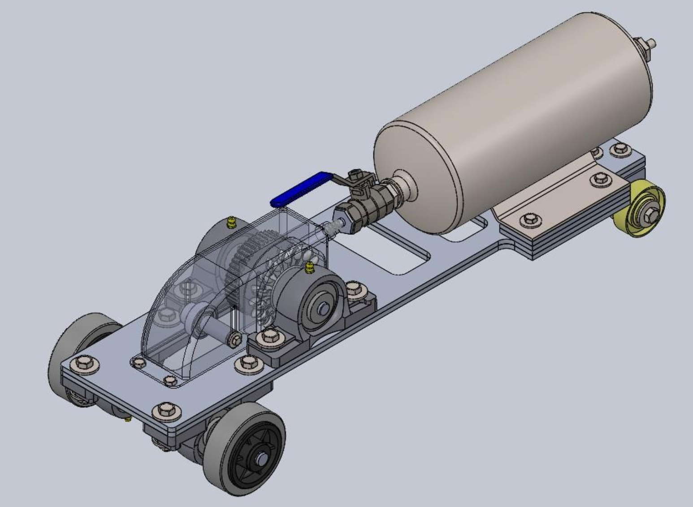

---

## 1. Introduction

### 1.1 Project Brief

Our team was tasked with designing a small-scale car powered by compressed gas. Our aims for the car as provided by the project brief were for our car to travel the full length of a track set up in the CAGB concourse in as little time as possible. We were supplied with a gas canister of volume 2L filled with air at a pressure of 5.5 bar complete with a release valve along with two free and two fixed wheels. Aside from these parts, it was our task to design and manufacture or order all other desired components.

The project brief constrained our methods of manufacture as follows:
- One manually turned part
- One manually milled part
- One laser cut part
- A maximum of three 3D printed parts
- One part can be manufactured using the CNC

Furthermore, our material choices were limited to what was readily available in our Student Teacher Workshop (STW).

### 1.2 Product Design Specification

Our very first task as a team was to curate a Product Design Specification (PDS). This made our goals clear and could be referenced while making key decisions during the design phase.

| Design Criteria | Desired Outcomes |
|:----------------|:-----------------|
| Performance | Travel the length of the concourse in minimal time, continuous movement as fast as possible over a set distance, as aerodynamic as possible |
| Environment | Ensure the car does not crash into the sides of the track by having it drive straight |
| Life Expectancy | The car must be able to run for 100 hours but may do so discontinuously as the canister may be refilled |
| Maintenance | The canister must be easily accessible in order to be refilled; the shell casing should be replaceable |
| Facilities | Achieve accurate designs and tolerances before entering STW |
| Size and Weight | The car should be less than 500mm in width and less than 400mm in height; as light as possible to maximize efficiency and speed |
| Materials | Acrylic, mild steel, aluminium |

---

## 2. Design Concept and Selection

### 2.1 Design Research

For the first two weeks of this project, we spent time researching and discussing possible drive options to establish a design skeleton which can be developed into our final design. Initially, we decided to make a spider diagram exploring all possible drive options and their respective advantages and disadvantages before solidifying our choices using Morphological analysis. Using this information, each team member spent some time independently drawing up their own design ideas, which we all presented in a meeting, and decided unanimously which design route we wanted to further explore taking inspiration from multiple design ideas.

### 2.2 Concepts

During our design research process, five different concepts for drive transmission were investigated:

#### 2.2.1 CD Nozzle

**Description:** A converging-diverging nozzle is a variable area passage that consists of a converging section up until the throat (minimum area) followed by a diverging section. This accelerates the gas exiting the canister.

**Manufacture:** 3D Print (ABS plastic)

| Advantages | Disadvantages |
|:-----------|:--------------|
| Very weight efficient, only one part required | Difficult to design correctly to be effective |
| Very energy efficient, no drivetrain friction losses | Canister pressure may not be high enough to propel the car |

#### 2.2.2 Turbine Engine

**Description:** For our purpose we decided a Pelton wheel was the best option as it would transmit torque in the correct direction for our drive. A Pelton wheel is an impulse turbine with rows of double cup shaped buckets around the rim of the wheel, actuated by a jet of fluid into the cups.

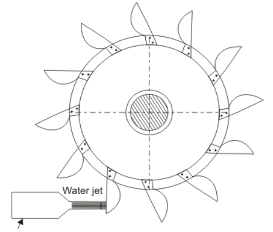

**Manufacture:** 3D Print (ABS plastic)

| Advantages | Disadvantages |
|:-----------|:--------------|
| Relatively weight efficient (3D printed plastic) | Energy loss due to friction if drivetrain used |
| Allows drivetrain elements to step up angular velocity | Requires turbine casing for efficiency |
| Easy to manufacture | Potential for impact failure from high velocity gas |

#### 2.2.3 Direct Drive

**Description:** The engine directly drives the load; therefore, no drivetrain elements are required. For this method we would attach a Pelton wheel directly to our drive shaft with the fixed wheels.

| Advantages | Disadvantages |
|:-----------|:--------------|
| Weight and energy efficient, no drivetrain required | No option to modify angular velocity or torque |
| Easy to manufacture and assemble | Would likely have to be front wheel drive |

#### 2.2.4 Spur Gears

**Description:** Cylindrical gear with straight teeth that transmit rotational motion between two parallel shafts.

**Manufacture:** Order off RS components then rebore and manufacture keyway.

| Advantages | Disadvantages |
|:-----------|:--------------|
| Can achieve efficiency up to 98% | Energy loss due to friction |
| Allows angular velocity step-up | Uneven weight distribution |
| | Small center distance limits turbine diameter and speed ratio |

#### 2.2.5 Pulleys

**Description:** HTD timing belt pulleys have a parabolic teeth profile that transmit rotational motion between two parallel shafts.

**Manufacture:** Order off RS components then rebore and manufacture keyway.

| Advantages | Disadvantages |
|:-----------|:--------------|
| Can achieve efficiency up to 98% | Energy loss due to friction |
| Allows angular velocity step-up | Uneven weight distribution |
| Large center distance maximizes turbine diameter | Requires tensioner (additional weight) |
| Large pulley doubles as flywheel | |

### 2.3 Morphological Chart

We created a morphological chart to explore different combinations of drive transmission ideas:

| | Concept 1 | Concept 2 | Concept 3 |
|:--|:----------|:----------|:----------|
| Engine Type | CD nozzle | Pelton turbine | — |
| Drive Transmission | Direct drive | Spur gears | HTD timing belt pulley |
| Drivetrain Cover | Cone shape | Box shape | — |

**Selections:**
- **Engine Type:** Pelton Turbine (based on Design Matrix)
- **Drive Transmission:** HTD timing belt pulleys (step-up speed ratio, no size limitation on Pelton wheel, metal pulley acts as flywheel)
- **Drivetrain Cover:** Box shape (easy tensioner integration, aerodynamics not necessary at our speed)

### 2.4 Selection and Justification

To decide on an engine type, we created a design matrix using morphological analysis. Before rating each design, we weighted each requirement from 1-8 (least to most important). Distance and speed were deemed most important as they affect performance most.

| Criteria | CD Nozzle | Pelton Wheel (Drivetrain) | Pelton Wheel (Direct Drive) | Weighting |
|:---------|:---------:|:-------------------------:|:---------------------------:|:---------:|
| Weight | 5 | 3 | 4 | 6 |
| Reliability | 5 | 3 | 3 | 5 |
| Manufacturability | 5 | 3 | 4 | 1 |
| Efficiency | 2 | 4 | 3 | 4 |
| Assembly | 4 | 3 | 4 | 3 |
| Size | 5 | 4 | 4 | 2 |
| Distance | 1 | 5 | 3 | 8 |
| Speed | 2 | 5 | 3 | 7 |
| **Total Score** | **112** | **144** | **120** | |
| **Rank** | 3 | **1** | 2 | |

The **Pelton wheel with drivetrain** ranked highest, primarily because it allows stepping up angular velocity between the turbine shaft and fixed wheel shaft.

---

## 3. Final Design

### 3.1 Breakdown of Design

#### Turbine

The turbine was inspired by a Pelton turbine and was 3D printed for ease of manufacturing. A balance was needed between bucket volume and weight (affecting torque). It has a diameter of 80mm and is made from ABS plastic for lightweight construction.

#### Transmission System Design

By making an appropriate assumption for turbine RPM, pulleys were selected for our one-stage transmission system:

| | No. of Teeth | PCD [mm] | Material |
|:--|:------------:|:--------:|:---------|
| Driving Pulley | 48 | 45 | Aluminium |
| Driven Pulley | 20 | 25 | Steel |

**Pulley Selection Calculations:**

Selected pulleys: $PCD\_1 = 45\text{mm}$ (48T), $PCD\_2 = 23\text{mm}$ (20T)

Speed Ratio:
$$R = \frac{z\_1}{z\_2} = \frac{48}{20} = 2.4$$

RPM estimates: slower shaft ~200 RPM, faster shaft ~480 RPM

Initial force from canister:
$$F = PA = 5.5 \times 10^5 \times 3.16 \times 10^{-5} = 17.14\text{ N}$$

Service factor $C\_0 = 1.9$ (soft start due to turbine, runs >16 hours, heavy duty due to gas impulse).

Calculating design power:
$$T\_1 = Fr\_1 = 17.1 \times (22.5 \times 10^{-3}) = 0.386\text{ Nm}$$

$$P\_1 = T\_1\omega\_1 = 0.386 \times \left(200 \times \frac{2\pi}{60}\right) = 8.08\text{ W}$$

$$P\_D = P\_1 \times C\_0 = 8.08 \times 1.9 = 15.3\text{ W}$$

From pitch selection chart: acceptable belt pitch = **5M**

Check teeth in mesh on small pulley (must be >6):
$$z\_e = \frac{z\_1}{6}\left(3 - \frac{D\_2 - D\_1}{CD}\right) = \frac{20}{6}\left(3 - \frac{(45-23) \times 10^{-3}}{130 \times 10^{-3}}\right) = 9.435 > 6 \checkmark$$

#### Torque Requirements

Estimate rolling resistance (car weight ~8kg), coefficient of friction for concrete $\mu = 0.02$:

$$F\_{roll} = \mu W = 0.02 \times (8 \times 9.81) = 1.77\text{ N}$$

Power requirement to run car:
$$P\_{req} = Fv = 1.77 \times \frac{480 \times \pi \times 80.3 \times 10^{-3}}{60} = 3.56\text{ W}$$

Required torque:
$$\tau = \frac{Pr}{v} = \frac{3.56 \times (11.5 \times 10^{-3})}{480 \times \pi \times 80.3 \times 10^{-3} \div 60} = 0.00203\text{ Nm} < 0.385\text{ Nm} \checkmark$$

**Estimated torque produced by pulley system exceeds required torque to move car.**

#### Tensioner Design

A tensioner was designed using a small shaft with a deep groove ball bearing. Two bolts on either end can be tightened into vertical slits in the casing, allowing free vertical movement to adjust belt tension.

#### Shaft Design

The two main shafts were designed to withstand applied torques whilst being as light as possible (diameters of 12mm and 15mm). Shoulders and circlips constrain all parts, with appropriate keys and keyways to transmit torque. Bearing constraint models ensured shafts were not over-constrained.

#### Bearing Selection

Bearing selection calculation for main shafts:

$$L\_{10} = L\_{10h} \times n \times 60 = 100 \times 200 \times 60 = 1,200,000\text{ revolutions} = 1.2\text{ Mrev}$$

Minimum required dynamic loading (k = 3 for ball bearings):
$$C\_{min} \geq F(L\_{10})^{1/k} = 171.43(1.2)^{1/3} = 182.17\text{ N}$$

For shaft diameter 15mm, $C\_{min} = 5.5\text{ kN} \geq 182.17\text{ N}$ ✓

**Bearing Constraint Models:**

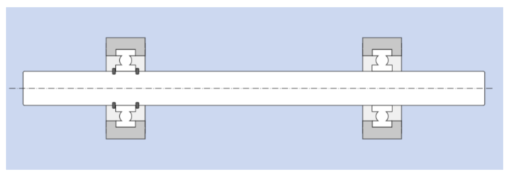

Constraint model for both main shafts:
- Internal circlips on one inner ring
- Pillow-block housing to constrain both outer rings

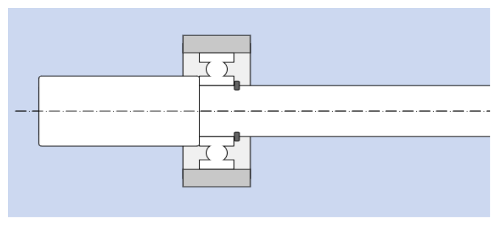

Constraint model for tensioner shaft:
- Internal circlip and shoulder to constrain inner ring

#### Base Plate

Made from two 5mm acrylic sheets layered on top of each other. Laser-cut for precise manufacturing so bolt holes would align. Middle sections removed to decrease weight.

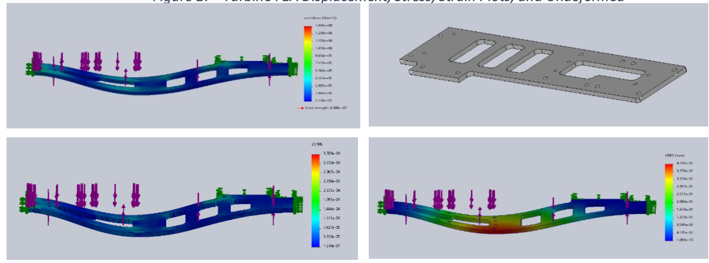

#### Casing

Made from ABS plastic and 3D printed. Designed to enclose all transmission elements as required. The turbine casing was incorporated into the external shell to reduce part count.

### 3.2 Material Selection

The shafts are vital for the transmission system. Material selection was based on reducing weight balanced with stiffness. An Ashby chart comparing Young's Modulus against density was generated for available STW materials.

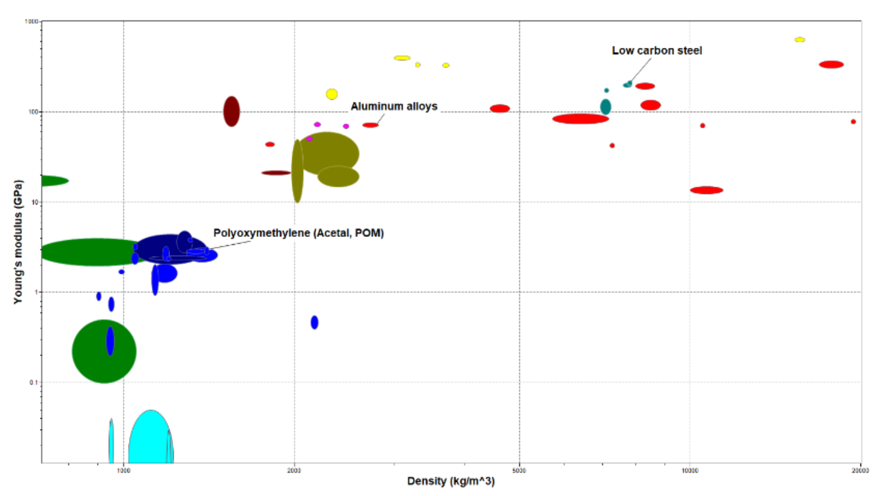

**Aluminium alloy** was selected for the shafts as it optimizes the ratio of both performance requirements.

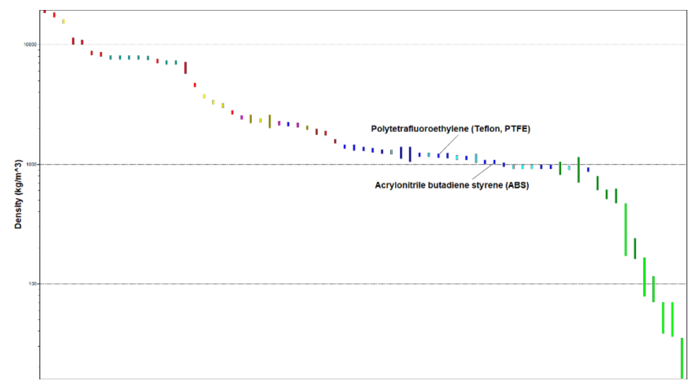

For the exterior casing, **ABS** was chosen for its lower density. The base plate was made from **acrylic** for slightly higher density (strength) while remaining lighter than metal.

### 3.3 Potential Failures and Mitigation

#### 1. Shaft Failure

Despite unlikelihood due to 6082 Aluminium T6 (max tensile strength 260 MPa, shear strength 170 MPa), we considered fatigue from cyclical stress. Values are significantly larger than bending and shear stresses acting on the shafts—**safe from failure**.

#### 2. Turbine Failure

Potential failure modes include fatigue and sudden impact from compressed gas. The casing prevents broken turbine parts from interfering with the pulley.

Force acting on turbine:
$$F\_t = P\_g \cdot A\_t = P\_g \cdot 2A\_{bucket}$$

With $A\_{bucket} = 129.05\text{ mm}^2$ and $P\_g = 5.5\text{ bar}$:
$$F\_t = 154.872\text{ N}$$

FEA using Mohr-Coulomb Safety Criteria for brittle materials showed max stress of 30.24 MPa, well below ABS yield strength (60 MPa). **Factor of Safety = 1.18 > 1** — failure unlikely.

#### 3. Base Plate Failure

Due to total mass (4 pillow block bearings and gas canister), base plate could fail from excessive load. We used two 5mm acrylic sheets with Tensol 12 DCM adhesive between plates for added stiffness. FEA showed stress levels extremely low with **Factor of Safety = 31**.

---

## 4. Manufacture and Assembly

### 4.1 Manufacture

#### General Manufacturing

Parts manufactured in STW:
- Fixed wheel shaft
- Turbine shaft
- Tensioner
- Base plate
- Pulley (rebored with keyway)
- L bracket

All processed by Centre Lathe and Vertical Milling Machine. Turbine and cover were 3D printed. Base plate was laser cut. Surface roughness: 3.2 (STW standard).

#### The Shafts

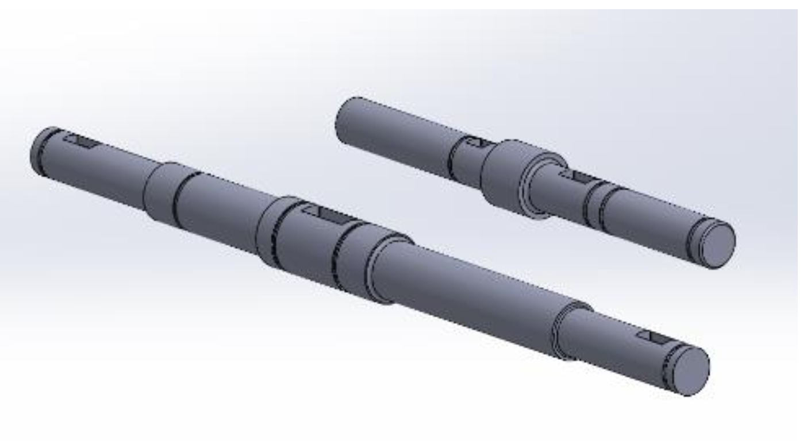

**Manufacturing Method:** All shafts cut from a single 25mm aluminum rod. Cutting diameter reduced 0.5mm at a time to reduce vibration and tool pressure. Lathe Centre used for long shafts to eliminate wobble. Circlip grooves and chamfers manufactured on lathe, keyways added on milling machine.

**Changes:**
- Turbine shaft redone due to cutting surface error
- Shaft diameters reduced from 14 to 12mm to accommodate turbine bore
- Tensioner length changed to fit cover
- Fixed wheel shaft drawing corrected

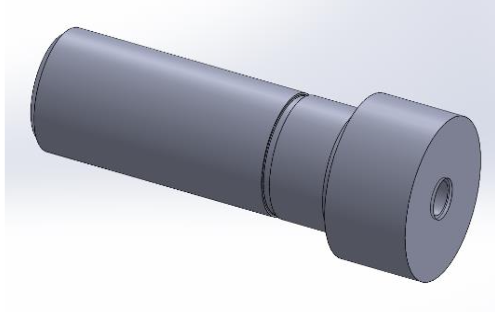

#### The Pulleys

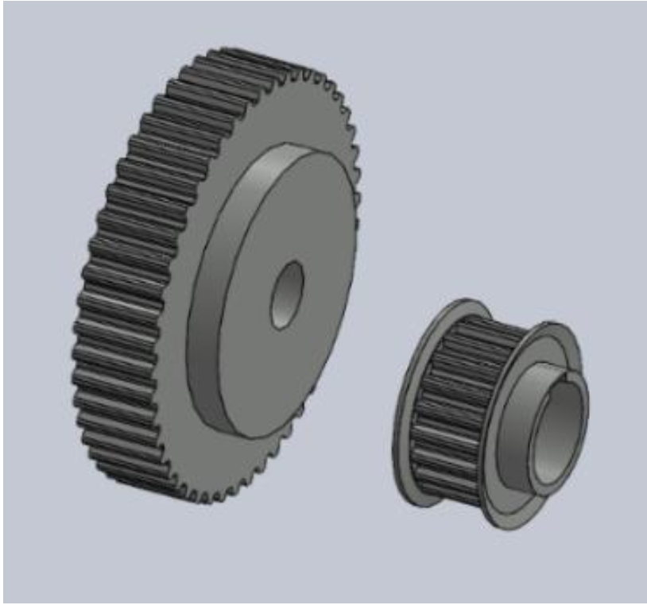

**Manufacturing:** Ordered from RS for high accuracy. Keyways added using vertical milling machine.

#### L Bracket

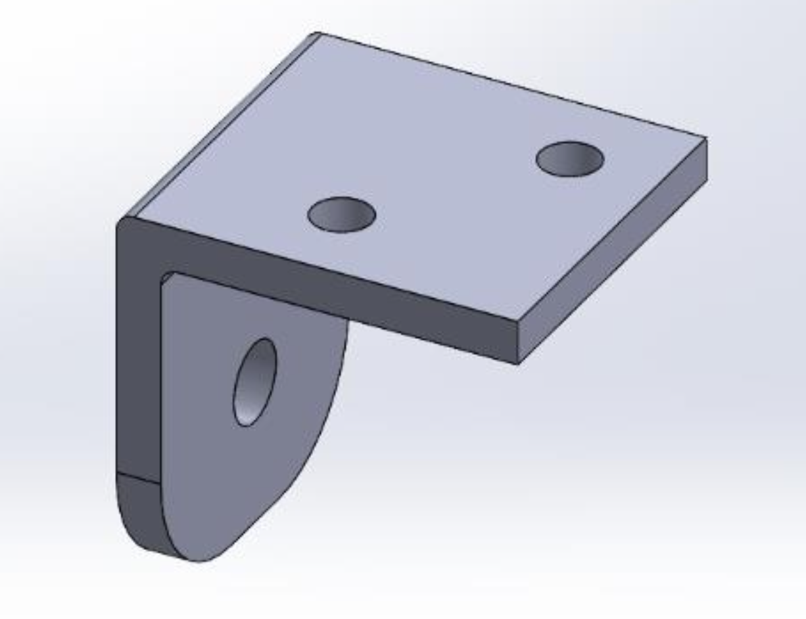

**Manufacturing:** 90×40mm rectangle cut from 1mm thick aluminum plate using guillotine and nibble snips. Bent to 90° using pan bender (45mm deep). Holes drilled: 9.05mm diameter for M8 bolts, 6.65mm diameter for M6 bolts.

#### Turbine Casing

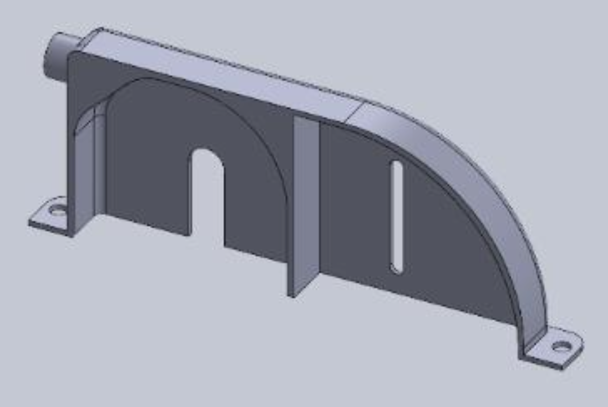

**Manufacturing:** 3D printed due to complex shape. Incorporated with transmission casing into single part.

#### Cover

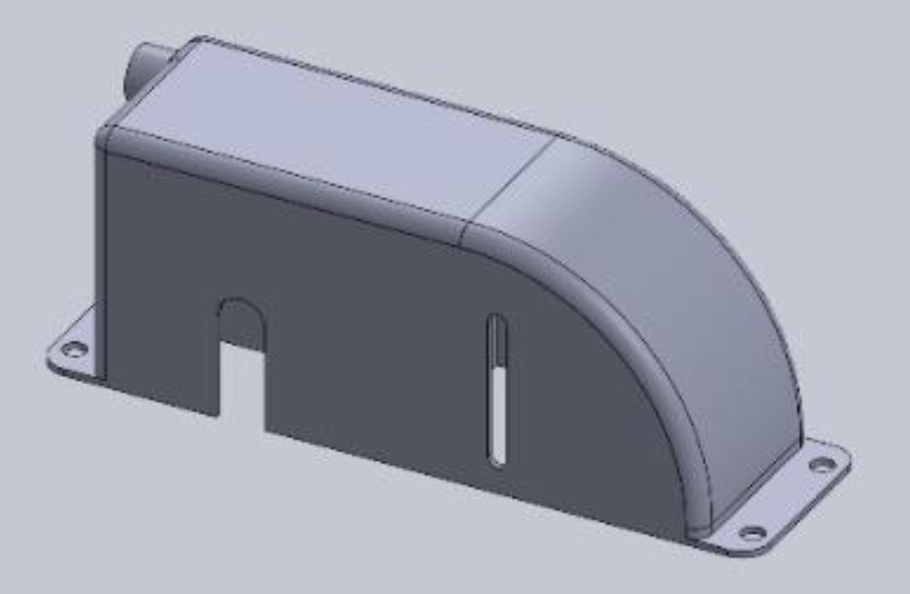

**Manufacturing:** 3D printed for light weight and easy dismantling. Original curved design flattened on both sides to fit tensioner.

#### Canister Spacer

**Manufacturing:** Two 40×120mm rectangles cut from 5mm thick aluminum sheet using scroll saw. 8mm diameter holes drilled for M6 hex bolt clearance.

### 4.2 Assembly

**Main Assembly:**
1. Layer two acrylic base plates
2. Mount L-brackets to underside using M6 hex bolts
3. Attach free wheels to L-brackets using M8 hex bolts
4. Layer two spacers, place canister on top, secure with M6 hex bolts
5. Screw ½" to ¼" hose adaptor into canister

**Driving Shaft Subassembly:**

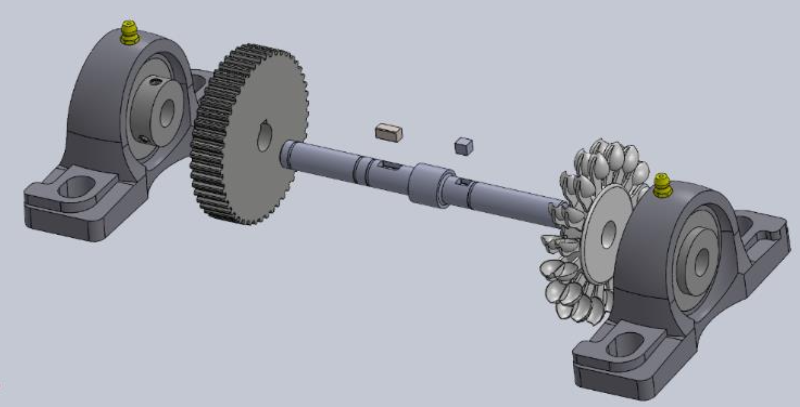

1. Slide 3D printed turbine and 48T pulley onto shaft with 5×10 and 5×6 keys
2. Constrain between shoulder and 12M external circlip
3. Place 12mm pillow-block bearings on each end
4. Tighten grub screws
5. Mount to topside of base plate using M8 hex bolts

**Driven Shaft Subassembly:**

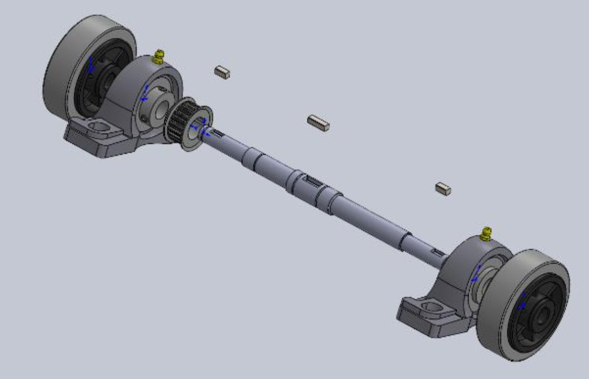

1. Slide 20T pulley onto shaft with 6×12 key
2. Slide 15mm bearings onto each end with M15 external circlip
3. Tighten grub screws
4. Mount fixed wheels with 5×10 keys, secured with 12M external circlips
5. Mount to underside of base plate using M8 hex bolts

**Belt and Tensioner:** Belt placed around both pulleys, tensioner screwed into vertical slits and adjusted until belt is taut.

**Cover:** Final component, surrounds hose adapter and covers all transmission elements, secured with 4 M6 hex bolts.

---

## 5. Conclusion

Our team was tasked with the design and manufacture of a car powered by compressed gas adhering to the instructions and limitations given by the design brief. We began by comparing several different designs such as direct propulsion, direct drive and the design we pursued, a drivetrain powered by a turbine. The initial decision was based on morphological analysis.

After making the choice to build a drivetrain, we considered different methods of transmission such as gears and pulleys. We could then consider materials for each component and designed the components of our car in SolidWorks. With designed components, we underwent analytical assessments such as FEA of the shafts and turbine. With the design stage complete, we entered the STW to produce the parts and assembled our final product.

### Design Flaws Identified

1. **Base plate strength** — Not strong enough to support drivetrain weight. Fixed by adhering two base plates using Tensol adhesive, which entirely mitigated bending.

2. **Bearing selection** — Pillow block bearings added significant weight. While they assured linear motion, they had high rolling resistance and only function effectively with constant power. In our application (short burst of work input), bearings stopped quickly. **Potential solution:** Remove dust covers and apply lubrication.

### Future Improvements

If redesigning from scratch, our largest focus would be **weight reduction**:
- Use plastic pillow blocks or design custom bearing housings
- Select bearings which spin longer with less resistance

---

## Appendix A: Measurement Report

### Table 6 — L-Brackets (P07-003)

| Feature | Dimension ID | Value/Tolerance (mm) | Method | Measured (mm) | Outcome |
|:--------|:------------:|:--------------------:|:------:|:-------------:|:-------:|
| M8 Hole | SD0 | Ø9.05 (±0.5) | Vernier Caliper | 8.54 | B |
| M6 Hole 1 | SD1 | Ø6.65 (±0.5) | Vernier Caliper | 6.36 | B |
| M6 Hole 2 | SD2 | Ø6.65 (±0.5) | Vernier Caliper | 6.45 | A |
| Length | SD3 | 45 (±0.5) | Vernier Caliper | 43.00 | B |
| Height | SD4 | 45 (±0.5) | Vernier Caliper | 44.34 | B |
| Width | SD5 | 40 (±0.5) | Vernier Caliper | 42.17 | B |
| Thickness | SD6 | 1.00 | Vernier Caliper | 1.00 | A |

### Table 7 — Fixed Shaft (P07-001)

| Feature | Dimension ID | Value/Tolerance (mm) | Method | Measured (mm) | Outcome |
|:--------|:------------:|:--------------------:|:------:|:-------------:|:-------:|
| Diameter | SD13 | Ø12.30 (±0.04) | Micrometer | 12.34 | A |
| Diameter | SD15 | Ø15.00 (±0.04) | Micrometer | 15.05 | B |
| Diameter | SD17 | Ø18.00 (±0.04) | Micrometer | 17.96 | A |
| Length | SD24 | 7.80 (-0.02) | Vernier Caliper | 7.80 | A |
| Length | SD29 | 236 (-0.02) | Ruler | 236 | A |
| Keyway A Length | SD32 | 10.00 (N9 -0.062) | Vernier Caliper | 10.00 | A |
| Keyway B Length | SD35 | 15.00 (N9 -0.062) | Vernier Caliper | 15.81 | B |

**Outcome Legend:**
- **A** — Acceptable, does not affect performance
- **B** — Outside tolerance, does not affect performance
- **C** — Outside tolerance, could affect performance

---

## Appendix B: Timeline and Gantt Chart

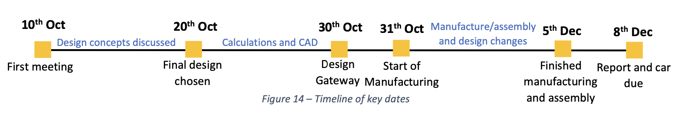
*Timeline of key dates*

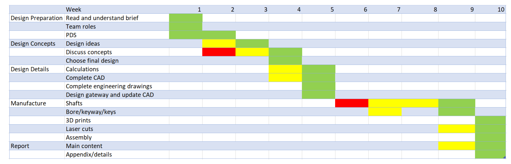
*Gantt Chart showing project schedule*

---

## Appendix C: Engineering Drawings

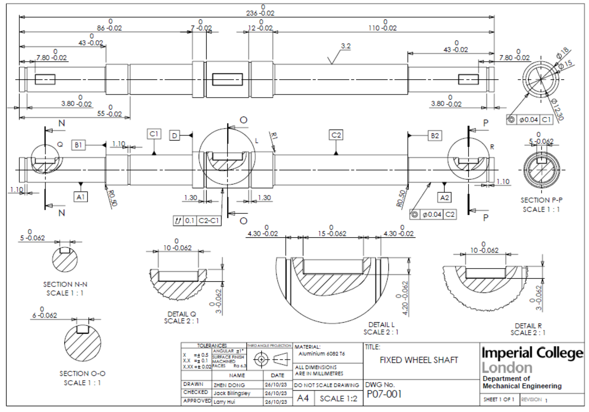
*Fixed wheel shaft engineering drawing*

*Turbine shaft engineering drawing*

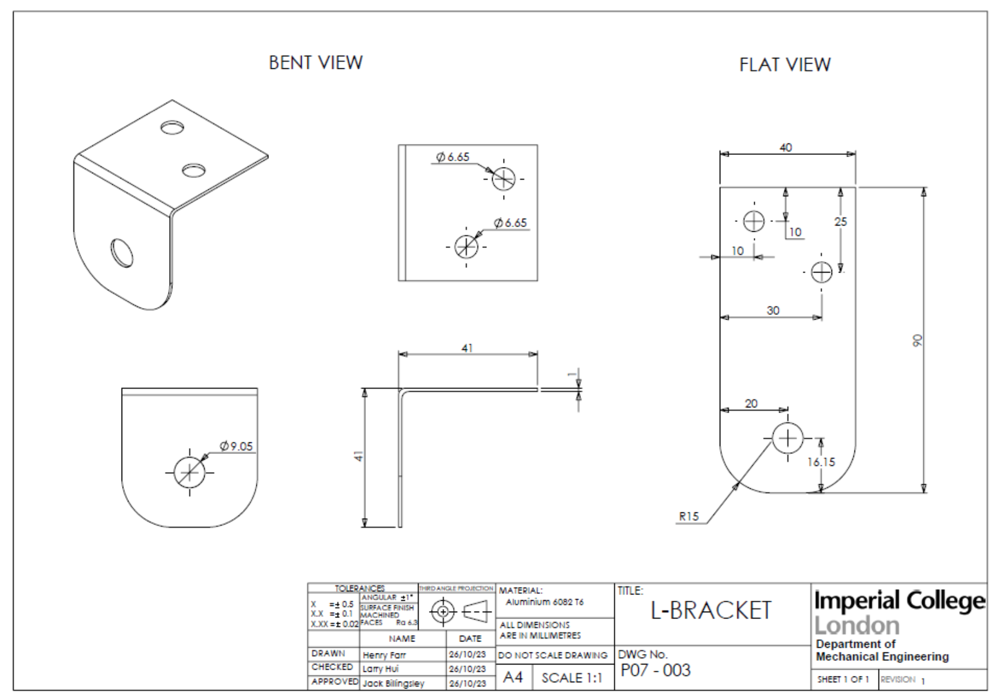
*L bracket engineering drawing*

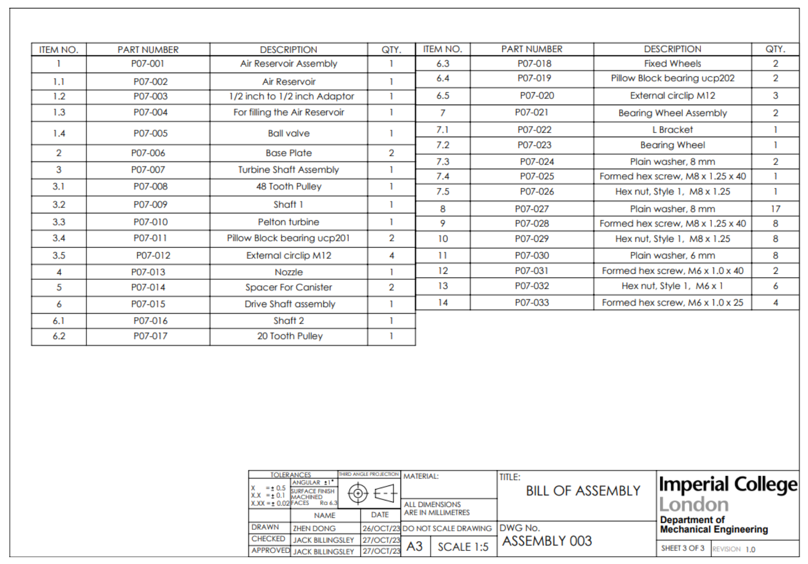
*Bill of Materials*

---

## References

1. "Aluminium Alloy 6082 Technical Datasheet." Smiths Metal Centres, 2023.

2. Travieso-Rodriguez, J. A., et al. (2019). Mechanical Properties of 3D-Printing Polylactic Acid Parts subjected to Bending Stress and Fatigue Testing. *Materials*, 12(23), 3859. https://doi.org/10.3390/ma12233859

3. Mohammed, I. K. (9 October 2023). ME2-DMF: Autumn Group Project 2023-2024; Project Brief.