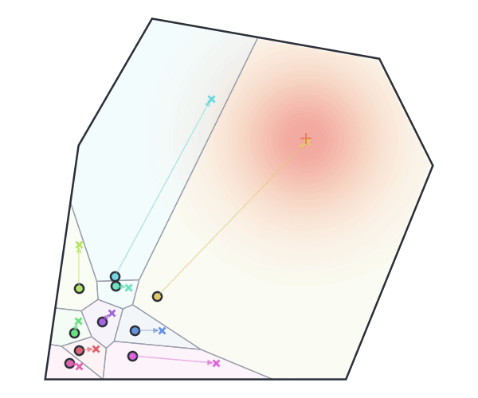

## Overview

This is the companion to my MEAM 6240 (Distributed Robotics) presentation at Penn on *Coverage Control for Mobile Sensing Networks* by Cortés, Martínez, Karatas and Bullo (IEEE Transactions on Robotics and Automation, 2004, [DOI 10.1109/TRA.2004.824698](https://doi.org/10.1109/TRA.2004.824698)). To go with the slides I wrote a set of demos that run the paper's algorithms, so you can watch the agents move and change the parameters yourself.

  <a href="/coverage-control/" style="display:inline-block; padding:10px 22px; border-radius:6px; background:#8b1a1a; color:#fff; font-weight:600; text-decoration:none;">Open the interactive demos</a>

The demos are written in Python with NumPy. On this site the same Python code runs in your browser, so the first load takes a few seconds and nothing is sent to a server. They work best on a laptop or desktop screen.

## The problem

A group of $n$ mobile sensors at positions $p_1, \dots, p_n$ has to cover a convex region $Q$. A density $\phi(q)$ says how important each point is, and sensing gets worse with distance. If every point is assigned to its nearest sensor, the region splits into Voronoi cells $V_i$ and the cost is

$$
\mathcal{H}(P) = \sum_{i=1}^{n} \int_{V_i} \lVert q - p_i \rVert^2 \, \phi(q)\, dq .
$$

The gradient has a simple form. With $M_{V_i}$ the mass of cell $i$ and $C_{V_i}$ its centroid,

$$
\frac{\partial \mathcal{H}}{\partial p_i} = 2 M_{V_i} \left( p_i - C_{V_i} \right),
$$

so each sensor lowers the cost by moving toward the centroid of its own cell. It only needs to know where its Voronoi neighbors are, which is what makes the method distributed.

## What you can try

**Descent for coverage control**

- **Discrete-time Lloyd.** Build the cells, find the centroids, move, repeat.
- **Continuous-time Lloyd.** Every agent follows $\dot p_i = k_{\mathrm{prop}} (C_{V_i} - p_i)$.
- **Two agents in a 6 × 2 room.** A small case you can check by hand: the cost goes 27, 16, 14.5 and settles at 13.

**Distributed algorithms**

- **Asynchronous network.** Agents run on their own clocks and only know the positions they last sensed.
- **Adjust sensing radius / communication radius.** How far an agent has to look to be sure of its own Voronoi cell.
- **Coverage behavior I and II.** The paper's two asynchronous algorithms, the second one with event-triggered updates.

**Vehicle dynamics**

- **Second-order vehicles.** Agents with inertia, where the coverage cost can rise for a while even though the total energy falls.
- **Wheeled vehicles.** Unicycle robots steering toward their centroids.

**Density-designed formations**

- **Ellipse band, ellipsoidal disk, line.** Choosing $\phi$ so the agents end up on an ellipse, inside it, or along a line.

On every page you can play the algorithm slowly or fast, click an agent to see its cell mass, centroid, gradient and neighbors, and change the number of agents, the environment, the density and the gains.

## How it is built

The simulation is two Python files. `geometry.py` computes the Voronoi cells by clipping the region with bisector half-planes, and integrates mass, centroid and cost over each cell (exactly for a uniform density, with Gauss quadrature otherwise). `demos.py` holds one simulation per page. The page itself only draws the states that the Python code returns.

For the presentation it runs from a small local Python server. Here it runs through [Pyodide](https://pyodide.org), which loads Python and NumPy into the browser.
