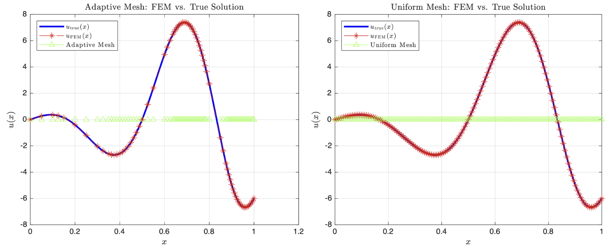
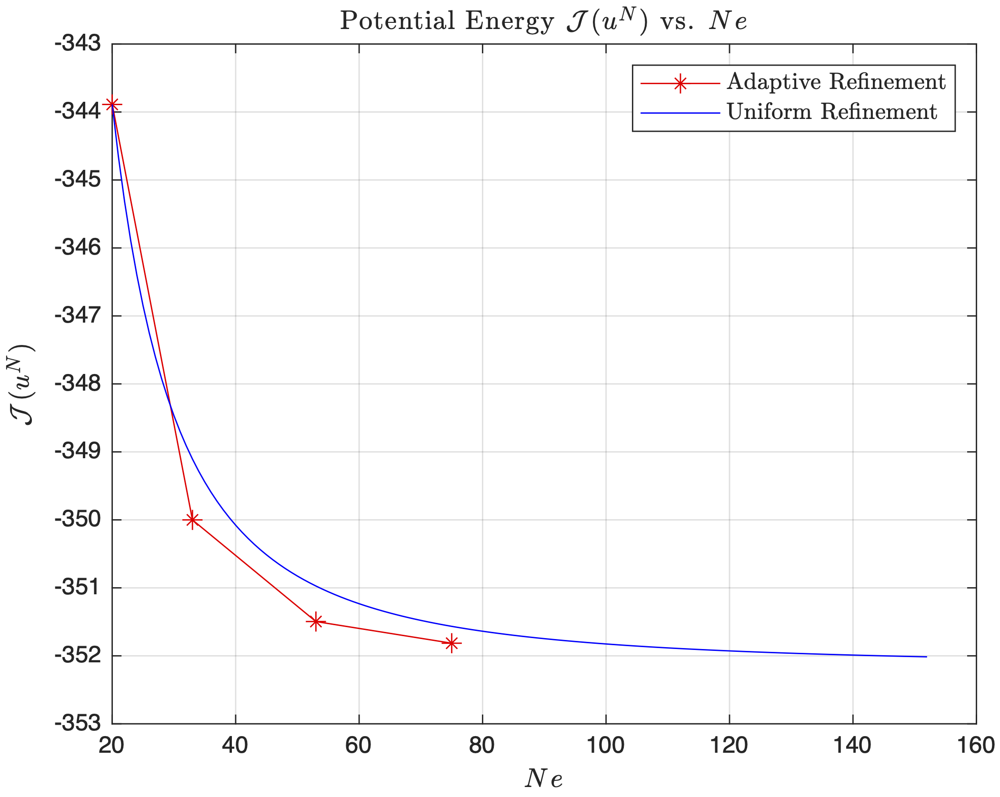
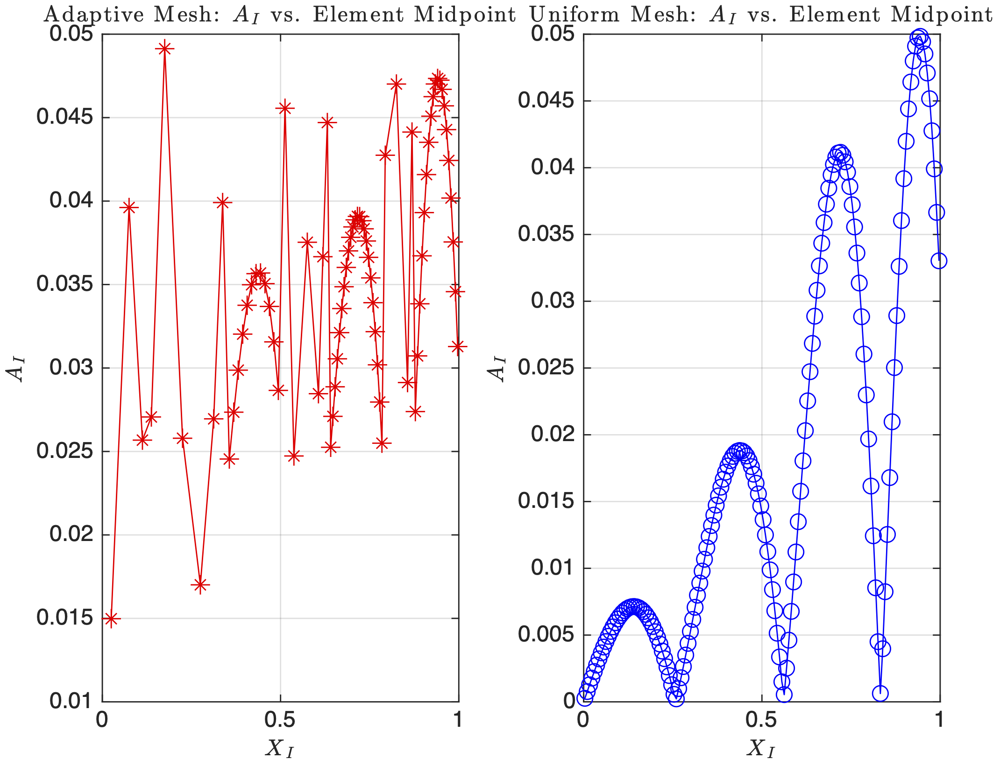
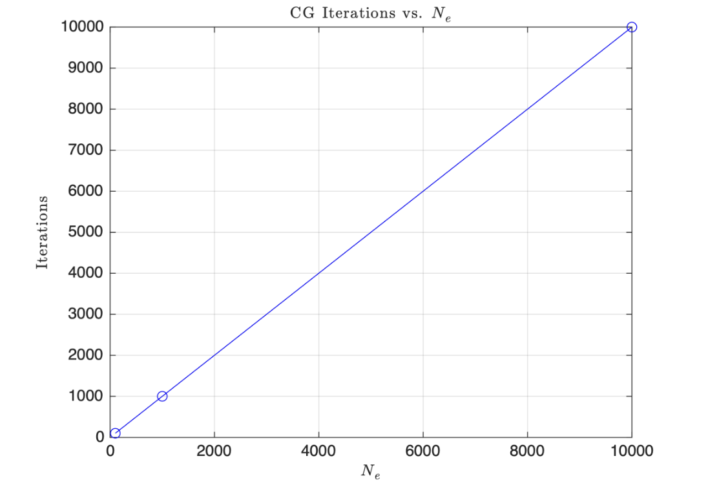
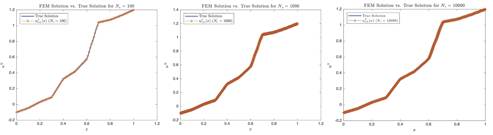
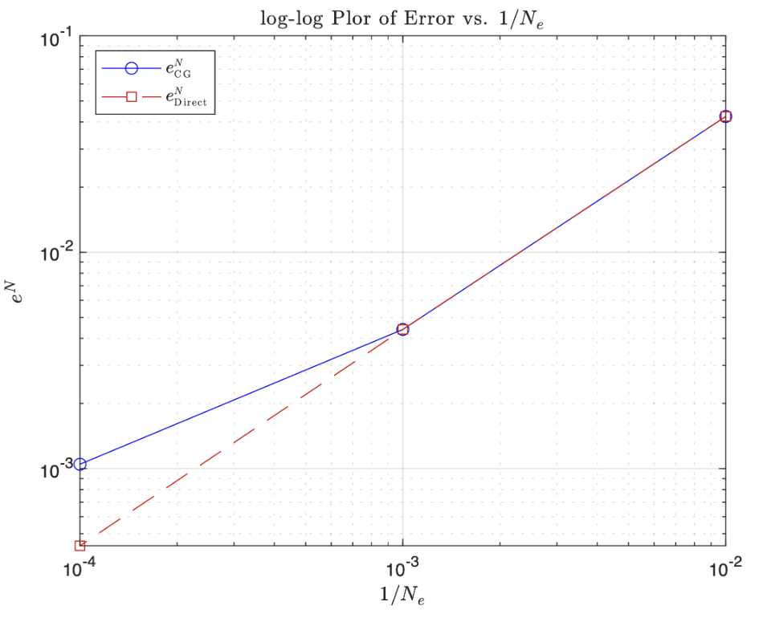
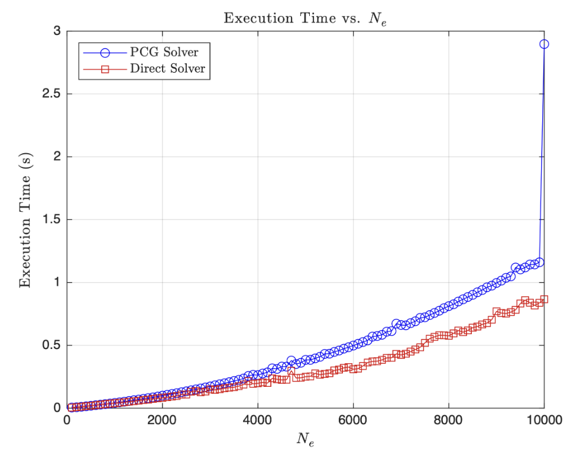
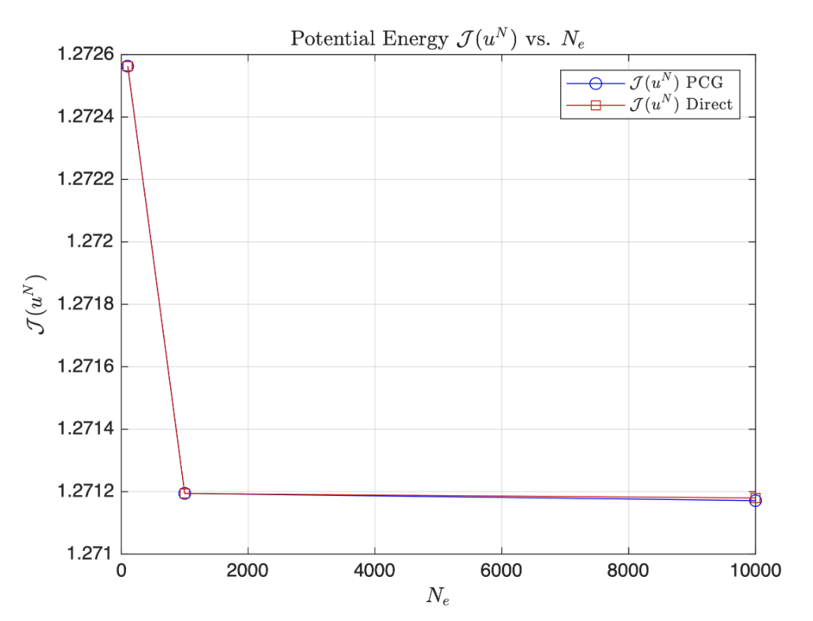
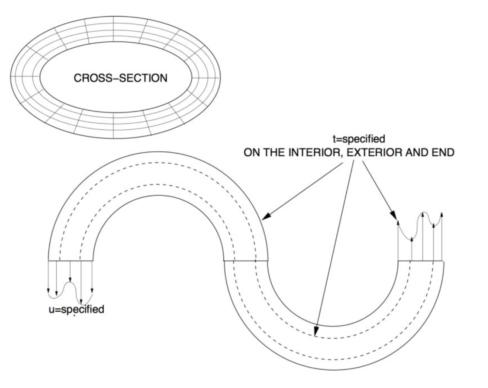

## Executive Summary

The Finite Element Method (FEM) is a powerful numerical technique used to solve complex engineering problems that are difficult or impossible to solve analytically. This comprehensive guide covers the theoretical foundations, practical applications, and implementation strategies of FEM across various engineering disciplines.

This project is structured into eight sections, progressing from fundamental concepts to advanced applications and implementation techniques.

---

## 1. The Basics of FEM

### 1.1 Introduction to Finite Element Analysis

The Finite Element Method (FEM) is a numerical technique for approximating solutions to boundary value problems in engineering and physics. It divides a complex domain into smaller, simpler parts called finite elements, and uses variational methods to approximate the solution over the entire domain.

The fundamental concept behind FEM is to **discretize** a continuous problem into a finite number of elements connected at specific points called **nodes**. This discretization transforms differential equations into a system of algebraic equations that can be solved using matrix methods.

### 1.2 Historical Development

FEM originated in the 1940s and 1950s with the work of engineers and mathematicians in the aerospace and automotive industries. Key milestones include:

- **1940s**: Early work on matrix methods for structural analysis
- **1950s**: Development of the displacement method by Turner, Clough, Martin, and Topp
- **1960s**: Introduction of isoparametric elements by Taig and Irons
- **1970s**: Commercial FEM software development begins
- **1980s-Present**: Rapid advancement in computational capabilities and algorithm development

### 1.3 Basic Principles

The core principles of FEM are based on three fundamental concepts:

#### 1.3.1 Discretization
A continuous domain is divided into a finite number of elements. Each element is defined by nodes, and the behavior within each element is approximated using simple functions.

#### 1.3.2 Interpolation
Within each element, the solution is approximated using interpolation functions (shape functions). For example, in structural analysis, displacement within an element might be approximated as:

$$u^e(x,y) = \sum_{i=1}^n N_i(x,y) u_i$$

where $N_i$ are shape functions and $u_i$ are nodal displacements.

#### 1.3.3 Assembly
Individual element equations are assembled into a global system of equations using the principle of compatibility (displacements must be continuous across element boundaries) and equilibrium.

### 1.4 Advantages and Limitations

#### Advantages:
- Can handle complex geometries and boundary conditions
- Applicable to various physics problems (structures, heat transfer, fluid flow, electromagnetics)
- Provides detailed stress/strain information throughout the domain
- Can be automated for parametric studies

#### Limitations:
- Requires significant computational resources for large models
- Accuracy depends on mesh quality and element type selection
- Preprocessing can be time-consuming for complex geometries
- Results interpretation requires engineering judgment

### 1.5 Applications in Engineering

FEM is widely used across engineering disciplines:

- **Structural Engineering**: Stress analysis, vibration analysis, buckling analysis
- **Thermal Engineering**: Heat conduction, convection, radiation
- **Fluid Dynamics**: CFD analysis, aerodynamics
- **Electromagnetic Analysis**: Antenna design, motor analysis
- **Biomechanics**: Bone stress analysis, implant design
- **Geotechnical Engineering**: Soil-structure interaction

### 1.6 Analytical Solution of a Boundary Value Problem

To illustrate the fundamental concepts of FEM, let's solve a one-dimensional boundary value problem both analytically and numerically. This will provide a true solution against which we can compare our FEM results.

Consider the differential equation:

$$\frac{d}{dx} \left(E \frac{du}{dx}\right) = k^2 \sin\left(\frac{2\pi k x}{L}\right) + 2x^2$$

with material constant $E = 0.2$, domain $\Omega = (0,L)$ where $L = 1$, and boundary conditions $u(0) = 0$, $u(L) = 1$.

Starting with the ODE, we integrate twice to find $u_{\text{true}}$. First integration yields:

$$\frac{d}{dx} \left(E \frac{du}{dx}\right) = k^2 \sin\left(\frac{2\pi k x}{L}\right) + 2x^2$$

$$\int \frac{d}{dx} \left(E \frac{du}{dx}\right) dx = \int \left[k^2 \sin\left(\frac{2\pi k x}{L}\right) + 2x^2\right] dx$$

$$E \frac{du}{dx} = k^2 \int \sin\left(\frac{2\pi k x}{L}\right) dx + 2 \int x^2 dx$$

Using $u$-substitution where $u = \frac{2\pi k x}{L}$ and $dx = \frac{L}{2\pi k} du$:

$$E \frac{du}{dx} = k^2 \int \sin(u) \cdot \frac{L}{2\pi k} du + 2 \int x^2 dx$$

$$E \frac{du}{dx} = \frac{k^2 L}{2\pi k} \int \sin(u) du + 2 \int x^2 dx$$

$$E \frac{du}{dx} = -\frac{k L}{2\pi} \cos\left(\frac{2\pi k x}{L}\right) + \frac{2}{3} x^3 + C_1$$

Integrating again:

$$\int E \frac{du}{dx} dx = \int \left[-\frac{k L}{2\pi} \cos\left(\frac{2\pi k x}{L}\right) + \frac{2}{3} x^3 + C_1\right] dx$$

$$E u(x) = -\frac{k L}{2\pi} \int \cos\left(\frac{2\pi k x}{L}\right) dx + \frac{2}{3} \int x^3 dx + \int C_1 dx$$

$$E u(x) = -\frac{\cancel{k} L}{2\pi} \cdot \frac{L}{2\pi \cancel{k}} \sin\left(\frac{2\pi k x}{L}\right) + \frac{2}{3} \cdot \frac{x^4}{4} + C_1 x + C_2$$

$$E u(x) = -\frac{L^2}{4\pi^2} \sin\left(\frac{2\pi k x}{L}\right) + \frac{x^4}{6} + C_1 x + C_2$$

$$u(x) = -\frac{L^2}{4\pi^2 E} \sin\left(\frac{2\pi k x}{L}\right) + \frac{x^4}{6E} + \frac{C_1 x}{E} + \frac{C_2}{E}$$

Applying the boundary condition $u(0) = 0$:

$$u(0) = 0 = -\frac{L^2}{4\pi^2 E} \sin\left(\frac{2\pi k (0)}{L}\right) + \frac{(0)^4}{6E} + \frac{C_1 (0)}{E} + \frac{C_2}{E} \Rightarrow C_2 = 0$$

So now:

$$u(x) = -\frac{L^2}{4\pi^2 E} \sin\left(\frac{2\pi k x}{L}\right) + \frac{x^4}{6E} + \frac{C_1 x}{E}$$

Applying the second boundary condition $u(L) = 1$:

$$u(L) = 1 = -\frac{L^2}{4\pi^2 E} \sin\left(\frac{2\pi k L}{L}\right) + \frac{L^4}{6E} + \frac{C_1 L}{E}$$

$$\frac{C_1 L}{E} = 1 - \frac{L^4}{6E} + \frac{L^2}{4\pi^2 E} \sin(2\pi k)$$

$$C_1 = \frac{E}{L} \left(1 - \frac{L^4}{6E} + \frac{L^2}{4\pi^2 E} \sin(2\pi k)\right)$$

$$C_1 = \frac{E}{L} - \frac{L^3}{6} + \frac{L}{4\pi^2} \sin(2\pi k)$$

Substituting back:

$$u_{\text{true}}(x) = -\frac{L^2}{4\pi^2 E} \sin\left(\frac{2\pi k x}{L}\right) + \frac{x^4}{6E} + \frac{x}{E} \left[\frac{E}{L} - \frac{L^3}{6} + \frac{L}{4\pi^2} \sin(2\pi k)\right]$$

$$u_{\text{true}}(x) = -\frac{L^2}{4\pi^2 E} \sin\left(\frac{2\pi k x}{L}\right) + \frac{x^4}{6E} + x \left[\frac{1}{L} - \frac{L^3}{6E} + \frac{L}{4\pi^2 E} \sin(2\pi k)\right]$$

Substituting the material constants $E = 0.2$ and $L = 1$:

$$u_{\text{true}}(x) = -\frac{1}{0.8\pi^2} \sin(2\pi k x) + \frac{x^4}{1.2} + x \left[\frac{1}{6} + \frac{5}{4\pi^2} \sin(2\pi k)\right]$$

### 1.7 Derivation of the Weak Form Using Galerkin's Method

To derive the weak form of the differential equation using Galerkin's method, we start with the strong form:

$$\frac{d\sigma}{dx} + f(x) = 0$$

where:

$$f(x) = -\left(k^2 \sin\left(\frac{2\pi k x}{L}\right) + 2x^2\right)$$

$$\sigma(x) = E(x) \frac{du}{dx}$$

Multiply both sides by a smooth test function $\nu = \nu(x)$ and integrate over the domain:

$$\int_{\Omega} \left(\frac{d\sigma}{dx} \nu + f(x) \nu\right) dx = \int_{\Omega} r \nu dx$$

where $r$ is the residual. Apply the product rule to $\sigma \nu$:

$$\frac{d}{dx}(\sigma \nu) = \frac{d\sigma}{dx} \nu + \sigma \frac{d\nu}{dx}$$

$$\frac{d\sigma}{dx} \nu = \frac{d(\sigma \nu)}{dx} - \sigma \frac{d\nu}{dx}$$

Substitute into the equation:

$$\int_{\Omega} \left[\frac{d(\sigma \nu)}{dx} - \sigma \frac{d\nu}{dx}\right] dx + \int_{\Omega} f \nu dx = \int_{\Omega} r \nu dx$$

$$\int_{\Omega} \frac{d(\sigma \nu)}{dx} dx - \int_{\Omega} \sigma \frac{d\nu}{dx} dx + \int_{\Omega} f \nu dx = 0$$

For the weak form to hold for all test functions $\nu$, the residual $r(x) = \frac{d\sigma}{dx} + f = 0$ at all points. Since $\nu(x)$ will find the solution and force the residual to zero, we have:

$$\int_{\Omega} \sigma \frac{d\nu}{dx} dx = \int_{\Omega} f \nu dx + \sigma \nu \big|_{\partial \Omega}$$

Set $\nu = 0$ on the boundaries where displacement $u$ is specified ($\Gamma_u$), which includes the entire boundary $\partial \Omega = \{0,L\}$. Thus $\sigma \nu(L) - \sigma \nu(0) = 0$.

To constrain the solution to have finite energy, let $u, \nu \in H^1(\Omega)$, where $H^1(\Omega)$ is the Sobolev space of functions with finite energy norm.

The weak form becomes:

$$\int_{\Omega} \sigma \frac{d\nu}{dx} dx = \int_{\Omega} f \nu dx$$

where the solution $u \in H^1(\Omega)$ satisfies $u \vert_{\Gamma_u} = u_0^*$ and $\forall \nu \in H^1(\Omega)$, $\nu \vert_{\Gamma_u} = 0$.

With the specific boundary conditions and domain:
- $\Omega = (0,L)$ where $L = 1$
- $f(x) = -\left(k^2 \sin\left(\frac{2\pi k x}{L}\right) + 2x^2\right)$
- $\sigma = E(x) \frac{du}{dx}$
- $u(0) = u_0^* = 0$
- $u(L) = u_L^* = 1$

### 1.8 One-Dimensional Finite Element Implementation

Using linear equal-sized elements, we implement a 1D FEM program to solve the boundary value problem. The program discretizes the domain into $N$ elements and uses Gaussian quadrature for numerical integration.

#### Mesh Requirements Analysis

The number of finite elements $N$ needed depends on the parameter $k$, which controls the oscillatory behavior of the solution. Higher $k$ values require finer meshes to capture the rapidly oscillating solution.

| k  | N   |
|----|-----|
| 1  | 18  |
| 2  | 46  |
| 4  | 124 |
| 16 | 574 |
| 32 | 1157 |

It is evident that as we increase $k$, the number of finite elements needed increases. As $k$ increases, the oscillatory behaviour of the problem increases which would also force our solution, $u_{\text{true}}(x)$ to oscillate more rapidly as well due to the two sine terms present. In order to actually capture the true nature of the solution and all the details fully, we would need more linear finite elements to refine the mesh. This is seen by looking at $k=1$ a relatively coarse mesh with $N=18$ suffices to capture the solution such that its energy norm is below 0.05. If we move to a higher $k$ of 16 and 32, we see that the number of elements $574$ and $1157$, respectively, leads to a very fine mesh. This probably suggests that we should try higher order shape functions to reduce the computational strain. It is also worth noting that there appears to exist a linear dependence between $k$ and $N$, that is, if we double $k$ then $N$ also doubles roughly. Explicitly, we see this with $k=2$ then $N=46$ and if $k=4$ then $N=124$. If you plotted the line of best fit of $k$ vs. $N$, it roughly follows the line $y=36.741x-20$.

#### Numerical Solution Convergence

The general trends follow that of above, that is, as we increase the number of elements, $N_e$, the more closely the solution converges to the true solution. But we also see that despite the low number of elements for $N_e=4$ and $N_e=16$ we still get a very good approximation of the true solution at low $k$ values. However, as $k$ increases, it is clear that the lack of elements starts to take a toll on the numerical solution's accuracy and coarse meshes are no longer good enough to achieve convergence; finer meshes are required to accurately map the oscillations. The low frequency problem is clearly less computationally expensive as we can solve them with limited elements. However, the higher frequency require finer meshes otherwise we see aliasing due to insufficient resolution; this implies that the choice of $N_e$ is very much problem dependent. 


#### Error Analysis

The energy norm error $e^N$ versus $1/N$ follows a logarithmic relationship, demonstrating the convergence properties of the finite element method. Higher $k$ values show slower convergence rates, requiring more elements to achieve the same level of accuracy.


### 1.9 MATLAB Implementation

<details>
<summary><strong>Linear FEM Implementation (Click to Expand)</strong></summary>

```matlab
clear; clc; close all;

% Vector of elements we want to evaluate at.
NeVec = [4,16,64,256,1024];
% Vector of k constants to evaluate at.
kVec = [1,2,4,16,32];
x0 = 0;
L = 1;
p = 1;      % Element polynomial order (1 = Linear)
Efunc = 0.2;
BC0 = 0;    % u(0) = 0
BCL = 1;    % u(L) = 1

% Array to see if BC is Dirichlet (1) or Neumann (0)
% First entry (BCType(1)) is for left boundary
% Second entry (BCType(2)) is for right boundary
BCType = [1 1]; % Both Endpoints are Dirichlet for HW1

syms x; % Will need to download Symbolic Math Toolbox
force = @(x) -((k.^2).*sin((2.*pi.*k.*x)./L)+2.*x.^2); % fill in
uTrue = @(x)  (-L.^2/(4.*pi.^2.*Efunc).*sin(2.*pi.*k.*x./L))+(x.^4./(6.*Efunc))+...
    x*(1./L-L.^3/(6.*Efunc)+L./(4.*pi.^2.*Efunc).*sin(2.*pi.*k)); %fill in
duTrue = @(x) -(L./(2.*pi.*Efunc)).*k.*cos((2.*pi.*k.*x)./L)+(2.*x.^3)./(3.*Efunc)+(1./L)-...
    (L.^3./(6.*Efunc))+(L./(4.*pi.^2.*Efunc))*sin(2.*pi.*k); % fill in

% Ensure plots use LaTex
set(groot, 'defaultTextInterpreter', 'latex');
set(groot, 'defaultLegendInterpreter', 'latex');

%% P3a
minNe = zeros(numel(kVec),1);
for i = 1:numel(kVec)   % loop through stiffness values
    k = kVec(i);
    
    % update forcing function and duTrue for current k value
    force = @(x) -((k.^2).*sin((2.*pi.*k.*x)./L)+2.*x.^2); % fill in
    duTrue = @(x) -(L./(2.*pi.*Efunc)).*k.*cos((2.*pi.*k.*x)./L)+(2.*x.^3)./(3.*Efunc)+(1./L)-...
        (L.^3./(6.*Efunc))+(L./(4.*pi.^2.*Efunc))*sin(2.*pi.*k); % fill in
    
    errFlag = false;
    Ne = 4; % coarse initial mesh
    while ~errFlag
        % mesh and solve FEM problem
        h = 1/Ne * ones(Ne,1);
        [xglobe, Nn, conn] = Mesh1D(p, Ne, x0, h);
        [uN, error] = myFEM1D(p, Ne, Nn, conn, xglobe, force, Efunc, BC0, BCL, BCType, duTrue);
      
        if error <= 0.05    % if error is above threshold, increment element count and try again
            minNe(i) = Ne;
            errFlag = true;
        else
            Ne = Ne + 1;
        end  
    end
end

% Print out minimum number of N are needed for different k's
fprintf('k\tmin Ne\n')
for i = 1:length(kVec)
    fprintf('%d\t%d\n',kVec(i),minNe(i));
end

%% P3b
close all
markers = {'o','+','*','s','d','v','>','h'};
% List a bunch of colors; like the markers, they 
% will be selected circularly. 
colors = {'b','g','r','k','m','c'};
% Same with line styles
linestyle = {'-','--','-.',':'};
% this function will do the circular selection
% Example:  getprop(colors, 7) = 'b'
getFirst = @(v)v{1}; 
getprop = @(options, idx)getFirst(circshift(options,-idx+1));

for j = 1:numel(kVec)
figure
hold on;
k = kVec(j);
force = @(x) -((k.^2).*sin((2.*pi.*k.*x)./L)+2.*x.^2); % fill in
uTrue = @(x)  (-L.^2/(4.*pi.^2.*Efunc).*sin(2.*pi.*k.*x./L))+(x.^4./(6.*Efunc))+...
    x*(1./L-L.^3/(6.*Efunc)+L./(4.*pi.^2.*Efunc).*sin(2.*pi.*k)); %fill in
duTrue = @(x) -(L./(2.*pi.*Efunc)).*k.*cos((2.*pi.*k.*x)./L)+(2.*x.^3)./(3.*Efunc)+(1./L)-...
    (L.^3./(6.*Efunc))+(L./(4.*pi.^2.*Efunc))*sin(2.*pi.*k); % fill in
    for i = 1:numel(NeVec)
        Ne = NeVec(i);
        h = 1/Ne * ones(Ne,1);
    
        [xglobe, Nn, conn] = Mesh1D(p, Ne, x0, h);
        
        [uN, error] = myFEM1D(p, Ne, Nn, conn, xglobe, force, Efunc, BC0, BCL, BCType, duTrue);
    
        plot(xglobe, uN,...
            'Marker',getprop(markers,i),...
            'MarkerSize', 4 ,...
            'color',getprop(colors,i),...
            'linestyle',getprop(linestyle,i),...
            'DisplayName', ['Ne = ', num2str(Ne)]);
    end

    xTrue = linspace(0,1,1000);
    plot(xTrue, uTrue(xTrue), 'DisplayName', 'True Solution');
    title(sprintf('Numerical Solutions for $N$ with $k = %d$', k), ...
        'Interpreter', 'latex', ...
        'FontWeight', 'normal');
    xlabel('$x$', 'Interpreter', 'latex')
    ylabel('$u_N$', 'Interpreter', 'latex')
    legend('Location','bestoutside');
    grid on;
end

%% Fill in Mesh1D Function below
% Ouputs: nodal coordinates, total number of nodes, connectivity matrix
function [xglobe, Nn, conn] = Mesh1D(p, Ne, x0, h)
        
    % Number of nodes in domain
    Nn = p * Ne + 1;

    % Initializing real domain positions
    xglobe = x0*ones(1,Nn);

    % Number of nodes per element
    Nne = p+1;

    % Iterate each next node position based on previous position + element length    
    for node = 2:Nn 
        % Use min since if we exceed Nn > Ne+1 but for 1D just add h(node-1),
        xglobe(node) = xglobe(node-1) + h(min(node-1, Ne)); % finish line here;
    end

    % Initializing connectivity matrix
    conn = zeros(Ne,Nne);
    
    % Fill in connectivity matrix (1D)
    conn = [(1:Nn-1)', (2:Nn)'];
end

function [ShapeFunc, ShapeDer] = evalShape(p,pts)
    switch p
        case 1
        % Linear Shape Functions (HW#1)
        ShapeFunc = [(1-pts)./2, (1+pts)./2]; % Eq 3.27
        ShapeDer = [-1/2, 1/2].*ones(size(pts));
        
        case 2
        % Quadratic Shape Functions (HW#2)
        ShapeFunc = [(pts.*(pts-1))/2, 1-pts.^2, (pts.*(pts+1))/2];
        ShapeDer = [ (2*pts-1)/2, -2*pts, (2*pts+1)/2 ];

        case 3
        % Cubic Shape Functions (HW#2)
        ShapeFunc = [-9/16 * (pts + 1/3) .* (pts - 1/3) .* (pts - 1), ...
                     27/16 * (pts + 1) .* (pts - 1/3) .* (pts - 1), ...
                    -27/16 * (pts + 1) .* (pts + 1/3) .* (pts - 1), ...
                      9/16 * (pts + 1) .* (pts + 1/3) .* (pts - 1/3)];

         ShapeDer = [1/16*(-27.*pts.^2+18.*pts+1), 9/16*(9.*pts.^2-2.*pts-3), ...
                     -9/16*(9.*pts.^2-2.*pts-3), 1/16*(27.*pts.^2+18.*pts-1)];

    end
end

% Got rid of xh
function [uN, error] = myFEM1D(p, Ne, Nn, conn, xglobe, force, Efunc, BC0, BCL, BCType, duTrue)
    % Defining weights and Gauss points
    [wts, pts] = myGauss(p);

    % Evaluating shape functions and their derivatives
    [ShapeFunc, ShapeDer] = evalShape(p,pts);

    % Initializing stiffness Matrix
    K = zeros(Nn, Nn);

    % Initializing FEM solution vector
    uN = zeros(Nn, 1);

    % Initializing Forcing vector
    R = zeros(Nn, 1);

    % Loop through each element
    for e = 1:Ne
        % Extract nodal indices (id) from conn matrix
        id = conn(e, :); % <- whole row-elem
        for q = 1:numel(pts) % looping through each gauss point
            % Evaluating Jacobian
            J = xglobe(id)*ShapeDer(q,:)';
            
            % Evaluating elemental stiffness matrix (2 x 2)
            Ke = wts(q) * (Efunc / J) * (ShapeDer(q,:)' * ShapeDer(q,:));

            % Map gauss point from local to global coordinates
            x_zeta = xglobe(id) * ShapeFunc(q,:)';
            
            % Evaluating forcing function for elemental loading terms
            Re = force(x_zeta) * ShapeFunc(q,:)' * J * wts(q);
            
            % Assembling Global Stiffness Matrix K
            K(id, id) = K(id, id) + Ke;
            
            % Assembling loading vector R
            R(id) = R(id) + Re;
        end
    end
    
    % Boundary conditions
    if BCType(1) % Left Dirichlet BC
        uN(1) = BC0;
        % Adjust second loading term 
        R(2) = R(2)-K(2,1)*uN(1);
    else % Nothing else for now
    end

    if BCType(2) % Right Dirichlet BC
        uN(Nn) = BCL;
        % Adjust second to last loading term 
        R(Nn-1) = R(Nn-1)-K(Nn-1,Nn)*uN(Nn);
    else % Nothing else for now
    end
    
    % Calculating uN (with removed BC terms)
    uN(2:end-1) = K(2:end-1,2:end-1) \ R(2:end-1);
    
    % Evaluating Error
    % Initialize error numerator and denominator
    errNum = 0;
    errDen = 0;
    
    for e = 1:Ne
        % Extract element ID
        id = conn(e,:);
        
        % Loop through Gauss points
        for q = 1:numel(pts)
            
            J = xglobe(id)*ShapeDer(q,:)';
            
            % Derivative of numerical solution
            duN = (ShapeDer(q,:) / J) * uN(id);
            
            % Map gauss point from local to true spatial coordinates
            x_zeta = xglobe(id) * ShapeFunc(q,:)'; 
            % Error numerator and denominator
            errNum = errNum + (duTrue(x_zeta) - duN).^2 * Efunc * J * wts(q);
            errDen = errDen + (duTrue(x_zeta)).^2  * Efunc * J * wts(q);
        end
    end
    
    % Final error
    error = sqrt(errNum/errDen);
end

%% P3c
figure; hold on;
title('$\log$-$\log$ Plot of $e^N$ vs. $1/N$ for different $k$', 'Interpreter', 'latex');
xlabel('$1/N$');
ylabel('$e^N$');
grid on;

% Loop over k values
for j = 1:length(kVec)
    k = kVec(j);
    
    force = @(x) -((k.^2).*sin((2.*pi.*k.*x)./L)+2.*x.^2); % fill in
    duTrue = @(x) -(L./(2.*pi.*Efunc)).*k.*cos((2.*pi.*k.*x)./L)+(2.*x.^3)./(3.*Efunc)+(1./L)-...
        (L.^3./(6.*Efunc))+(L./(4.*pi.^2.*Efunc))*sin(2.*pi.*k); % fill in
    
    % errors for each mesh size
    errors = zeros(size(NeVec));
    
    for i = 1:length(NeVec)
        Ne = NeVec(i);
        h = 1/Ne * ones(Ne,1);
        
        % Generate mesh
        [xglobe, Nn, conn] = Mesh1D(p, Ne, x0, h);
        
        % Solve FEM and compute error
        [uN, errorVal] = myFEM1D(p, Ne, Nn, conn, xglobe, force, Efunc, BC0, BCL, BCType, duTrue);
        errors(i) = errorVal;
    end
    
    % Plot log-log scale
    loglog(1./NeVec, errors, 'Marker', markers{j}, 'Color', colors{j}, ...
           'DisplayName', sprintf('$k = %d$', k));
    
    set(gca, "YScale", "log", "XScale", "log");
end

legend('Location', 'bestoutside');

%% DO NOT MODIFY BELOW -- use myGauss for myFEM1D
function [wts,pts] = myGauss(p)
    
    ptsNeed = ceil((p+1)/2);
    
    switch ptsNeed + 2
        case 1
            wts = 2;
            pts = 0;
        case 2
            wts = [1; 1];
            pts = [-0.5773502691896257; 0.5773502691896257];
        case 3
            wts = [0.8888888888888888; 0.5555555555555556; ...
                0.5555555555555556];
            pts = [0; -0.7745966692414834; 0.7745966692414834];
        case 4
            wts = [0.6521451548625461; 0.6521451548625461; ...
                0.3478548451374538; 0.3478548451374538];
            pts = [-0.3399810435848563; 0.3399810435848563; ...
                -0.8611363115940526; 0.8611363115940526];
        case 5
            wts = [0.5688888888888889; 0.4786286704993665;...
                0.4786286704993665; 0.2369268850561891; ...
                0.2369268850561891];
            pts = [0; -0.5384693101056831;  0.5384693101056831;...
                -0.9061798459386640; 0.9061798459386640];
    end
end
```

</details>

---

## 2. Higher Order Elements

### 2.1 Analytical Solution with Mixed Boundary Conditions

To demonstrate the capabilities of higher-order finite elements, let's solve a boundary value problem with mixed boundary conditions (Dirichlet and Neumann). This will highlight the advantages of p-refinement over h-refinement.

Consider the differential equation:

$$\frac{d}{dx} \left(E \frac{du}{dx}\right) = k^2 \sin\left(\frac{\pi k x}{L}\right) + k \cos\left(\frac{2\pi k x}{L}\right)$$

with domain $\Omega = (x_0, L)$ where $x_0 = 0.1$ and $L = 1.2$, material constant $E = 0.2$, and parameter $k = 6$. The boundary conditions are:
- Dirichlet: $u(x_0) = 1$
- Neumann: $E \frac{du}{dx}\big|_{x=L} = -0.7$

Starting with the ODE integration:

$$\frac{d}{dx} \left(E \frac{du}{dx}\right) = k^2 \sin\left(\frac{\pi k x}{L}\right) + k \cos\left(\frac{2\pi k x}{L}\right)$$

$$\int \frac{d}{dx} \left(E \frac{du}{dx}\right) dx = \int \left[k^2 \sin\left(\frac{\pi k x}{L}\right) + k \cos\left(\frac{2\pi k x}{L}\right)\right] dx$$

$$E \frac{du}{dx} = k^2 \int \sin\left(\frac{\pi k x}{L}\right) dx + k \int \cos\left(\frac{2\pi k x}{L}\right) dx$$

Using u-substitution for the sine term ($u = \frac{\pi k x}{L}$, $dx = \frac{L}{\pi k} du$) and cosine term ($v = \frac{2\pi k x}{L}$, $dx = \frac{L}{2\pi k} dv$):

$$E \frac{du}{dx} = k^2 \int \sin(u) \cdot \frac{L}{\pi k} du + k \int \cos(v) \cdot \frac{L}{2\pi k} dv$$

$$E \frac{du}{dx} = \frac{k^2 L}{\pi k} \int \sin(u) du + \frac{k L}{2\pi k} \int \cos(v) dv$$

$$E \frac{du}{dx} = -\frac{k L}{\pi} \cos\left(\frac{\pi k x}{L}\right) + \frac{L}{2\pi} \sin\left(\frac{2\pi k x}{L}\right) + C_1$$

Applying the Neumann boundary condition $E \frac{du}{dx}\big|_{x=L} = -0.7$:

$$E \frac{du}{dx}\big|_{x=L} = -0.7 = -\frac{k L}{\pi} \cos(\pi k) + \frac{L}{2\pi} \sin(2\pi k) + C_1$$

$$C_1 = \frac{k L}{\pi} \cos(\pi k) - \frac{L}{2\pi} \sin(2\pi k) - 0.7$$

Substituting the values $k=6$, $L=1.2$:

$$C_1 = \frac{7.2}{\pi} \cos(6\pi) - \frac{1.2}{2\pi} \sin(12\pi) - 0.7 = \frac{7.2}{\pi} - 0.7$$

Now integrating again:

$$\int E \frac{du}{dx} dx = \int \left[-\frac{k L}{\pi} \cos\left(\frac{\pi k x}{L}\right) + \frac{L}{2\pi} \sin\left(\frac{2\pi k x}{L}\right) + C_1\right] dx$$

$$E u(x) = -\frac{k L}{\pi} \int \cos\left(\frac{\pi k x}{L}\right) dx + \frac{L}{2\pi} \int \sin\left(\frac{2\pi k x}{L}\right) dx + C_1 \int dx$$

$$E u(x) = -\frac{k L^2}{\pi^2} \sin\left(\frac{\pi k x}{L}\right) - \frac{L^2}{4\pi^2 k} \cos\left(\frac{2\pi k x}{L}\right) + C_1 x + C_2$$

$$u(x) = -\frac{k L^2}{\pi^2 E} \sin\left(\frac{\pi k x}{L}\right) - \frac{L^2}{4\pi^2 k E} \cos\left(\frac{2\pi k x}{L}\right) + \frac{C_1 x}{E} + \frac{C_2}{E}$$

Applying the Dirichlet boundary condition $u(x_0) = 1$:

$$1 = -\frac{k L^2}{\pi^2 E} \sin\left(\frac{\pi k x_0}{L}\right) - \frac{L^2}{4\pi^2 k E} \cos\left(\frac{2\pi k x_0}{L}\right) + \frac{C_1 x_0}{E} + \frac{C_2}{E}$$

$$C_2 = E + \frac{k L^2}{\pi^2 E} \sin\left(\frac{\pi k x_0}{L}\right) + \frac{L^2}{4\pi^2 k E} \cos\left(\frac{2\pi k x_0}{L}\right) - \frac{C_1 x_0}{E}$$

Substituting numerical values:

$$C_2 = \frac{1.44}{\pi^2} \sin\left(\frac{6\pi \cdot 0.1}{1.2}\right) + \frac{1.44}{4\pi^2 \cdot 6} \cos\left(\frac{2\pi \cdot 6 \cdot 0.1}{1.2}\right) - C_1 \cdot 0.1 + 0.2$$

$$C_2 = \frac{1.44}{\pi^2} \sin(\pi/2) + \frac{0.06}{\pi^2} \cos(\pi) - \frac{0.72}{\pi} + 0.27 = \frac{1.38}{\pi^2} - \frac{0.72}{\pi} + 0.27$$

The analytical solution is:

$$u_{\text{true}}(x) = -\frac{k L^2}{\pi^2 E} \sin\left(\frac{\pi k x}{L}\right) - \frac{L^2}{4\pi^2 k E} \cos\left(\frac{2\pi k x}{L}\right) + \frac{C_1 x}{E} + \frac{C_2}{E}$$

Substituting all constants yields:

$$u_{\text{true}}(x) = -\frac{7.2}{\pi^2} \sin(5\pi x) - \frac{0.3}{\pi^2} \cos(10\pi x) + x\left(\frac{36}{\pi} - 3.5\right) + \frac{6.9}{\pi^2} - \frac{3.6}{\pi} + 1.35$$

### 2.2 Weak Form with Natural Boundary Conditions

When dealing with mixed boundary conditions, the weak form must account for natural (Neumann) boundary conditions. Starting with the strong form and multiplying by a test function $\nu$:

$$\int_{\Omega} \left(\frac{d\sigma}{dx} \nu + f \nu\right) dx = \int_{\Omega} r \nu dx$$

$$\int_{\Omega} \frac{d(\sigma \nu)}{dx} dx - \int_{\Omega} \sigma \frac{d\nu}{dx} dx + \int_{\Omega} f \nu dx = 0$$

$$\sigma \nu \big|_{\partial \Omega} - \int_{\Omega} \sigma \frac{d\nu}{dx} dx + \int_{\Omega} f \nu dx = 0$$

For mixed boundary conditions, we split the boundary into $\Gamma_u$ (Dirichlet) and $\Gamma_t$ (Neumann). Since $\nu = 0$ on $\Gamma_u$, the boundary term becomes:

$$\sigma \nu \big|_{\partial \Omega} = \sigma(L) \nu(L) - \sigma(0) \nu(0) = t^* \nu(L)$$

where $t^* = -0.7$ is the prescribed traction on the right boundary.

The weak form becomes:

Find $u \in H^1(\Omega)$, $u \vert_{\Gamma_u} = d$ such that $\forall \nu \in H^1(\Omega)$, $\nu \vert_{\Gamma_u} = 0$:

$$\int_{\Omega} \frac{d\nu}{dx} E \frac{du}{dx} dx = \int_{\Omega} f \nu dx + t^* \nu \vert_{\Gamma_t}$$

### 2.3 Higher-Order Element Implementation

Using quadratic (p=2) and cubic (p=3) elements in addition to linear (p=1) elements demonstrates the power of p-refinement.

#### Element Count Requirements

The table below shows the number of elements needed to achieve $e^N \leq 0.05$ for different polynomial orders:

| p | Nₑ | Error |
|---|-----|-------|
| 1 | 70  | 0.0497 |
| 2 | 13  | 0.0473 |
| 3 | 7   | 0.0375 |

Higher-order elements dramatically reduce the required number of elements while maintaining accuracy.

#### Solution Convergence Analysis


Based on the plots, for a complete polynomial order of 1 (i.e. linear elements) at $N_e=6$, the piecewise approximations are visibly less accurate than the true solution and are jagged. As $N_e$ increases to 64 though, the linear solution does tend toward the true solution which would make sense as we are refining the mesh by increasing the number of elements used. For a complete polynomial order of 2 (i.e. quadratic elements), even with $N_e=6$, we see it does a much better job than linear elements capturing the curvature better, and again, as we increase $N_e$ to 64, it is indistinguishable from the true solution. Generally, we see a lot less error compared to $p=1$. Finally, for a complete polynomial order of 3 (i.e. cubic elements), it does the best job of the 3 matching the true solution to the approximation. Even at just $N_e=6$, we see almost no difference between that and the true solution and, again, as $N_e$ increases to 64 it looks exactly like the true solution. This means that at higher orders of $p$, we can increase the accuracy as the solution captures the curvature better than linear elements allowing for fewer elements to achieve the same results. It also shows that no matter what, increasing $N_e$ means we can interpolate between more points so we can approximate more tightly. 

#### Convergence Rate Analysis


Firstly, since it is a $\log-\log$ plot, they are straight lines with positive slope. Also notice that the slopes for $p=1$, $p=2$, and $p=3$ are approximately 1, 2, and 3, respectively (this is shown in MATLAB). From this we can say that for $p=1$ $e^N\sim \mathcal{O}(h^1)$ and similarly, $p=2$ $e^N\sim \mathcal{O}(h^2)$, $p=3$ $e^N\sim \mathcal{O}(h^3)$. This means that each of these lines actually represents the order of convergence for the energy norm. Thus, $e^N \propto h^p\Rightarrow e^N=Ch^p$ where $C$ is some proportionality constant. The trend that we see is that as the complete order of the polynomial, $p$, increases---holding $h$ constant---the slope also increases implying a faster convergence for the same element size. 


### 2.4 p-Refinement vs h-Refinement

Based on our results, $p$-refinement is more effective in producing the most accurate solutions for less computational cost. Recall that under relatively mild assumptions, a fundamental a priori error estimate for the finite element method is

$$\|u-u^h\|_{E(\Omega)}\leq\mathcal{C}(u,p)h^{\min(r-1,p)}$$

where $p$ is the complete polynomial order of the finite element method used, $r$ is the regularity or smoothness index of the exact solution, and $\mathcal{C}$ is a constant dependent on the exact solution and the shape functions but not on $h$. For $h$-refinement, decreasing $h$ (increasing $N_e$) improves the accuracy according to $\min(r-1,p)$. For $p$-refinement, increasing the degree of the polynomial can potentially drive the order of convergence up provided that $r-1$ is in fact larger than $p$. If $r$ is large, indicative of a smooth exact solution, higher order elements are extremely effective. However, if $r$ is small, increasing the polynomial order does not improve convergence. For our case, given the smoothness of the solution due to the numerous trigonometric functions present in the differential equation and solution, we have a high regularity so $\min(r-1,p)$ is $p$. We also see in the error plots that increasing $p$ while holding $h$ constant increased the rate of convergence giving us an error $e^N\sim \mathcal{O}(h^p)$. Computationally, the number of nodes per element does increase for $p$-refinement, but it is offset by the small amounts of elements that otherwise would have been required from $h$-refinement. Also note that for $h$-refinement, the amount of elements would cause some large global stiffness matrices which would be computationally expensive to solve. 

### 2.5 MATLAB Implementation for Higher-Order Elements

<details>
<summary><strong>Higher-Order FEM Implementation (Click to Expand)</strong></summary>

```matlab
clear; close all; clc;

k = 6;
x0 = 0.1;   % Left endpoint location
L = 1.2;    % right endpoint location
Efunc = 0.2;% Youngs modulus function
BC0 = 1;    % u(x = x_0 = 0.1) = 1
BCL = -0.7; % Efunc*du/dx = -0.7
res = 10;   % Number of resample points

% Array to see if BC is Dirichlet (1) or Neumann (0)
% First entry (BCType(1)) is for left boundary
% Second entry (BCType(2)) is for right boundary
BCType = [1 0]; % Left boundary Dirichlet, right boundary Neumann

force = @(x,k) -k.^2.*sin(pi.*k.*x./L) - k.*cos(2.*pi.*k.*x./L);

c1 =  (k.*L./pi).*cos(pi.*k) - (L./(2.*pi)).*sin(2.*pi.*k) - 0.7;
c2 = (L.^2./pi.^2).*sin(pi.*k.*x0./L) + (L.^2./(4.*pi.^2.*k)).*cos(2.*pi.*k.*x0./L) - c1.*x0 + Efunc;
uTrue = @(x) - (L.^2/(pi.^2.*Efunc)).*sin(pi.*k.*x./L) - (L.^2/(4.*pi.^2.*k.*Efunc)).*cos(2.*pi.*k.*x./L) + (c1.*x)./Efunc + c2./Efunc;

duTrue = @(x) - (L.*k./(pi.*Efunc)).*cos(pi.*k.*x/L) + (L/(2.*pi.*Efunc)).*sin(2.*pi.*k.*x./L) + c1./Efunc;

% Stuff to make plots look nice
markers = {'o','+','*','s','d','v','>','h'};
% List a bunch of colors; like the markers, they will be selected circularly. 
colors = {'b','g','r','k','c','m'};
% Same with line styles
linestyle = {'-','--','-.',':'};
% this function will do the circular selection
% Example:  getprop(colors, 7) = 'b'
getFirst = @(v)v{1}; 
getprop = @(options, idx)getFirst(circshift(options,-idx+1));
% End Plotting Stuff

% Ensure plots use LaTex
set(groot, 'defaultTextInterpreter', 'latex');
set(groot, 'defaultLegendInterpreter', 'latex');

%% Problem 3a 
pVec = [1, 2, 3];
minNe   = zeros(numel(pVec),1);
errorVals = zeros(numel(pVec),1);

for i = 1:numel(pVec)
    p = pVec(i);
    
    errFlag = false;
    Ne = 4;  
    while ~errFlag
        h = (L - x0) / Ne * ones(Ne,1);
        [xglobe, Nn, conn] = Mesh1D(p, Ne, x0, h);
        [~, ~, error] = myFEM1D(p, Ne, Nn, conn, xglobe, force, Efunc, BC0, BCL, BCType, duTrue, res, k);
        
        if error <= 0.05
            minNe(i) = Ne;
            errorVals(i) = error;
            errFlag = true;
        else
            Ne = Ne + 1;  % increment mesh density and try again
        end  
    end
end

% Print out the results in table format
fprintf('p\tmin Ne\tError\n');
for i = 1:length(pVec)
    fprintf('%d\t%d\t%.4f\n', pVec(i), minNe(i), errorVals(i));
end

%% Problem 3b Plotting for each p
NeVec = [6 12 64]; % Vector of elements.
for p = 1:3  % Looping through each element polynomial order (1 = Linear, 2 = Quadratic, 3 = Cubic)
    figure(p) % Creating a plot for each p
    for i = 1:numel(NeVec) % Loop through each value of elements
        Ne = NeVec(i);
        
        h = (L-x0)/Ne * ones(Ne,1); % Spacing for each element
        
        % Discretize domain
        [xglobe, Nn, conn] = Mesh1D(p, Ne, x0, h);
        
        % Solve FEM problem
        [xh, uN, error] = myFEM1D(p, Ne, Nn, conn, xglobe, force, Efunc, BC0, BCL, BCType, duTrue, res, k);
    
        % Plot Solution
        hold on;
        plot(xh, uN,...
            'Marker',getprop(markers,i),...
            'color',getprop(colors,i),...
            'linestyle',getprop(linestyle,i),...
            'DisplayName', ['Ne = ', num2str(Ne)]);
    end
    % Plotting the true solution
    xTrue = linspace(x0,L,1000);
    plot(xTrue, uTrue(xTrue), 'DisplayName', 'True Sol');
    title(['Solutions with Different $N_e$ for $p$ = ', num2str(p)])
    xlabel('$x$')
    ylabel('$u^N$');
    legend('Location','bestoutside')
    grid on;
    hold off;
end

%% Problem 3c Getting error plots
NeVec = [16 32 64 128 256 512];
errorVec = zeros(1, numel(NeVec));
fig = figure();
axes('XScale', 'log', 'YScale', 'log') % make error plots loglog scaling
hold on
for p = 1:3
    for i = 1:numel(NeVec)
        Ne = NeVec(i);
        
        h = (L-x0)/Ne * ones(Ne,1); % Spacing for each element
    
        % Discretize domain
        [xglobe, Nn, conn] = Mesh1D(p, Ne, x0, h);
        
        % Solve FEM problem and get error
        [~, ~, errorVec(i)] = myFEM1D(p, Ne, Nn, conn, xglobe, force, Efunc, BC0, BCL, BCType, duTrue, res, k);
    end
    
    % Compute slopes of error lines
    xdata = log(1./NeVec);
    ydata = log(errorVec);
    coeffs = polyfit(xdata, ydata, 1);
    slope = coeffs(1);
    fprintf('For p = %d, the slope is %f\n', p, slope);
    
    hold on;
    loglog(1./NeVec, errorVec,...
        'Marker',getprop(markers,p),...
        'color',getprop(colors,p),...
        'linestyle',getprop(linestyle,p),...
        'DisplayName', ['p = ', num2str(p)]);
    title('$\log$-$\log$ plot of $e^N$ vs. $1/Ne$ for different $p$', 'Interpreter', 'latex');
    xlabel('$h$');
    ylabel('Error');
    legend('Location','bestoutside')
    grid on;
end

%% MESHER FUNCTION
function [xglobe, Nn, conn] = Mesh1D(p, Ne, x0, h)
    % Number of nodes in domain
    Nn = p * Ne + 1;
    
    % Initializing real domain positions
    xglobe = x0 * ones(1,Nn);
    
    % Number of nodes per element
    Nne = p + 1;
    
    % Iterate each next node position based on previous position + element length    
    for node = 1:Nn-1 
        xglobe(node+1) = xglobe(node) + h(floor((p+node)/Nne))/p;
    end
    
    % Initializing connectivity matrix
    conn = zeros(Ne, Nne);
    
    for c = 1:Nne % Columns
        conn(:,c) = (c : p : (Nn - (p - c + 1)))';
    end
end

%% Fill in evalShape Function below
function [ShapeFunc, ShapeDer] = evalShape(p,pts)
    switch p
        case 1
        % Linear Shape Functions (HW#1)
        ShapeFunc = [(1-pts)./2, (1+pts)./2]; % Eq 3.27
        ShapeDer = [-1/2, 1/2].*ones(size(pts));
        
        case 2
        % Quadratic Shape Functions (HW#2)
        ShapeFunc = [(pts.*(pts-1))/2, 1-pts.^2, (pts.*(pts+1))/2];
        ShapeDer = [ (2*pts-1)/2, -2*pts, (2*pts+1)/2 ];
        
        case 3
        % Cubic Shape Functions
        ShapeFunc = [-9/16*(pts+1/3).*(pts-1/3).*(pts-1),...
                    27/16*(pts+1).*(pts-1/3).*(pts-1),...
                    -27/16*(pts+1).*(pts+1/3).*(pts-1),...
                    9/16*(pts+1).*(pts+1/3).*(pts-1/3)];
        
        ShapeDer = [-(27*pts.^2 - 18*pts - 1)/16,...
                    9*(9*pts.^2 - 2*pts - 3)/16,...
                    -9*(9*pts.^2 + 2*pts - 3)/16,...
                    (27*pts.^2 + 18*pts - 1)/16];
    end
end

function [xh, uN, error] = myFEM1D(p, Ne, Nn, conn, xglobe, force, Efunc, BC0, BCL, BCType, duTrue, res, k)
    % Defining weights and Gauss points
    [wts, pts] = myGauss(p);
    
    % Evaluating shape functions and their derivatives
    [ShapeFunc, ShapeDer] = evalShape(p,pts);
    
    % Initializing stiffness Matrix
    K = zeros(Nn, Nn);
    
    % Initializing FEM solution vector
    uN = zeros(Nn, 1);
    
    % Initializing Forcing vector
    R = zeros(Nn, 1);
    for e = 1:Ne
        % Extracting element id from conn matrix
        id = conn(e, :); % <- whole row
        for gauss_pt = 1:numel(pts)
            x_zeta = xglobe(id) * ShapeFunc(gauss_pt,:)'; 
            % Evaluating Jacobian
            J = xglobe(id) * ShapeDer(gauss_pt,:)';
            % Evaluating elemental stiffness matrix (2 x 2) CHECK THIS LINE
            % ADDING KE MIGHT NOT BE NECESSARY
            K_e = wts(gauss_pt) * (Efunc / J) * (ShapeDer(gauss_pt,:)' * ShapeDer(gauss_pt,:));
            % Evaluating forcing function @(x) -k^2*cos(2*pi*k*x/L) - k*sin(pi*k*x/L);                 
            % Evaluating elemental loading terms
            R_e = force(x_zeta, k) * ShapeFunc(gauss_pt,:)' * J * wts(gauss_pt);
            % Assembling Global Stiffness Matrix K
            K(id, id) = K(id, id) + K_e;
            % Assembling loading vector R
            R(id) = R(id) + R_e;
        end
    end
    
    % Boundary conditions
    if BCType(1) % Left Dirichlet BC
        uN(1) = BC0;
        % Adjust loading terms 
        switch p
            case 1 % Linear 
                R(2) = R(2) - K(2,1) * uN(1);
            case 2 % Quadratic
                R(2) = R(2) - K(2,1)*uN(1);
                R(3) = R(3) - K(3,1)*uN(1);
            case 3 % Cubic
                R(2) = R(2) - K(2,1)*uN(1);
                R(3) = R(3) - K(3,1)*uN(1);
                R(4) = R(4) - K(4,1)*uN(1);
        end         
    else % for Left Neumann BC
        R(1) = R(1);
    end
    
    if BCType(2) % Right Dirichlet BC
        uN(Nn) = BCL;
        % Adjust second to last loading term 
        switch p
            case 1 % Linear 
                R(Nn-1) = R(Nn-1) - K(Nn-1,Nn)*uN(Nn);
            case 2 % Quadratic
                R(Nn-1) = R(Nn-1) - K(Nn-1,Nn)*uN(Nn);
                R(Nn-2) = R(Nn-2) - K(Nn-2,Nn)*uN(Nn);
            case 3 % Cubic
                R(Nn-1) = R(Nn-1) - K(Nn-1,Nn)*uN(Nn);
                R(Nn-2) = R(Nn-2) - K(Nn-2,Nn)*uN(Nn);
                R(Nn-3) = R(Nn-3) - K(Nn-3,Nn)*uN(Nn);
        end
    else % Right Neumann BC
        R(Nn) = R(Nn) + BCL;
    end
    
    % Calculating uh (with refomated K and R)
    fixed_nodes = [];
    % if Dirichlet on LHS, add that node to the list of fixed nodes
    if BCType(1)
        fixed_nodes = [fixed_nodes, 1];
    end
    % if Dirichlet on RHS, add that node to the list of fixed nodes
    if BCType(2)
        fixed_nodes = [fixed_nodes, Nn];
    end
    % finds all nodes that are not fixed
    free_nodes = setdiff(1:Nn, fixed_nodes);
    uN(free_nodes) = K(free_nodes, free_nodes) \ R(free_nodes);
    
    % Evaluating Error
    % Initialize error numerator and denominator
    errNum = 0;
    errDen = 0;
    
    for e = 1:Ne
        % Extract element ID
        id = conn(e, :);
        
        % Loop through Gauss points
        for gauss_pt = 1:numel(pts)
            x_zeta = xglobe(id) * ShapeFunc(gauss_pt,:)'; % Eq. 3.26
            J = xglobe(id) * ShapeDer(gauss_pt,:)';
            % Derivative of numerical solution
            duN = (ShapeDer(gauss_pt,:) / J) * uN(id);
            % Derivative of true solution duTrue is input into myFEM1D
            % Error numerator and denominator
            errNum = errNum + (duTrue(x_zeta) - duN).^2 * Efunc * J * wts(gauss_pt);
            errDen = errDen + (duTrue(x_zeta)).^2  * Efunc * J * wts(gauss_pt);
        end
    end
    
    % Final error
    error = sqrt(errNum/errDen);
    
    % Resampling
    if res
        xh = zeros(Ne*res, 1);       % Initialzing Positions of resample pts
        uNres = zeros(Ne*res,1);    % Initializing uN placeholder
        S = linspace(-1,1,res)';    % Sample points 
        [ResShapeFunc, ~] = evalShape(p,S); % ShapeFunc evaluated at res points
        n = 1; % Counter for indexing xh and uNRes through all res*Ne sample points
        for e = 1:Ne
            id = conn(e, :);
            for i = 1:res                        
                xh(n) =  xglobe(id) * ResShapeFunc(i, :)'; % x(zeta)
                % maybe don;'t need transpose
                uNres(n) = ResShapeFunc(i, :) * uN(id); % evaluating uh at sample point
                n = n + 1;
            end
        end
        uN = uNres;
    else
        xh = xglobe;
    end
end

%% DO NOT MODIFY BELOW -- use myGauss for myFEM1D
function [wts,pts] = myGauss(p)
    ptsNeed = ceil((p+1)/2);
    
    switch ptsNeed + 2
        case 1
            wts = 2;
            pts = 0;
        case 2
            wts = [1; 1];
            pts = [-0.5773502691896257; 0.5773502691896257];
        case 3
            wts = [0.8888888888888888; 0.5555555555555556; ...
                0.5555555555555556];
            pts = [0; -0.7745966692414834; 0.7745966692414834];
        case 4
            wts = [0.6521451548625461; 0.6521451548625461; ...
                0.3478548451374538; 0.3478548451374538];
            pts = [-0.3399810435848563; 0.3399810435848563; ...
                -0.8611363115940526; 0.8611363115940526];
        case 5
            wts = [0.5688888888888889; 0.4786286704993665;...
                0.4786286704993665; 0.2369268850561891; ...
                0.2369268850561891];
            pts = [0; -0.5384693101056831;  0.5384693101056831;...
                -0.9061798459386640; 0.9061798459386640];
    end
end
```

</details>

## 3. Adaptive Mesh Refinement

### 3.1 Boundary Value Problem with Complex Solution

Consider the boundary value problem with a highly oscillatory solution that requires adaptive mesh refinement:

$$\frac{d}{dx}\left(E\frac{du}{dx}\right) + f(x) = 0$$

where $\Omega = (0,1)$, $E = 0.4$, and the analytical solution is given by:

$$u(x) = (4\sin(\pi x^3) + 6x)\cos(3\pi x)$$

This solution exhibits rapid oscillations and varying curvature, making it an excellent test case for adaptive mesh refinement algorithms.

#### Derivation of Forcing Function and Boundary Conditions

Starting with the general form of the differential equation, we can derive the forcing function $f(x)$:

$$\frac{d}{dx}\left(E\frac{du}{dx}\right) + f(x) = 0$$

$$f(x) = -\frac{d}{dx}\left(E\frac{du}{dx}\right) = -E \frac{d^2u}{dx^2}$$

First, compute the first derivative using the product rule:

$$\frac{du}{dx} = \frac{d}{dx}\left(4\sin(\pi x^3) + 6x\right)\cos(3\pi x) + \frac{d}{dx}(\cos(3\pi x))(4\sin(\pi x^3) + 6x)$$

$$= (12\pi x^2 \cos(\pi x^3) + 6)\cos(3\pi x) + (-\sin(3\pi x)\cdot 3\pi)(4\sin(\pi x^3) + 6x)$$

$$= \cos(3\pi x)(12\pi x^2 \cos(\pi x^3) + 6) - 3\pi \sin(3\pi x)(4\sin(\pi x^3) + 6x)$$

Now compute the second derivative (this is quite involved):

$$\frac{d^2u}{dx^2} = -36\pi^2 x^4 \cos(3\pi x)\sin(\pi x^3) - 72\pi^2 x^2 \sin(3\pi x)\cos(\pi x^3) - 54\pi^2 x \cos(3\pi x)$$

$$+ 24\pi x \cos(3\pi x)\cos(\pi x^3) - 36\pi^2 \cos(3\pi x)\sin(\pi x^3) - 36\pi \sin(3\pi x)$$

Therefore, the forcing function becomes:

$$f(x) = -E(-36\pi^2 x^4 \cos(3\pi x)\sin(\pi x^3) - 72\pi^2 x^2 \sin(3\pi x)\cos(\pi x^3) - 54\pi^2 x \cos(3\pi x)$$

$$+ 24\pi x \cos(3\pi x)\cos(\pi x^3) - 36\pi^2 \cos(3\pi x)\sin(\pi x^3) - 36\pi \sin(3\pi x))$$

The boundary conditions are found by evaluating the analytical solution:

$$u(0) = (4\sin(\pi \cdot 0^3) + 6 \cdot 0)\cos(3\pi \cdot 0) = 0$$

$$u(1) = (4\sin(\pi \cdot 1^3) + 6 \cdot 1)\cos(3\pi \cdot 1) = -6$$

### 3.2 Principle of Minimum Potential Energy

The principle of minimum potential energy states that among all kinematically admissible displacement fields, the true solution minimizes the total potential energy. For the potential energy functional:

$$\mathcal{J}(u) = \frac{1}{2}\int_{\Omega} \frac{du}{dx} E \frac{du}{dx} dx - \int_{\Omega} f u dx - t^* u|_{\Gamma_t}$$

the true solution satisfies:

$$\mathcal{J}(u) \leq \mathcal{J}(v) \quad \forall v \in \mathcal{V}$$

#### Derivation
Starting with the energy norm relation:

$$\|u - w\|_{E(\Omega)}^2 = \int_{\Omega} \frac{d(u-w)}{dx} E \frac{d(u-w)}{dx} \, dx$$

Expanding this yields:

$$\|u - w\|_{E(\Omega)}^2 = \|u\|_{E(\Omega)}^2 + \|w\|_{E(\Omega)}^2 - 2\mathcal{B}(u,w)$$

where $\mathcal{B}(u,w) = \int_{\Omega} \frac{du}{dx} E \frac{dw}{dx} dx$

Relating to the potential energy:

$$\|u - w\|_{E(\Omega)}^2 = 2\mathcal{J}(w) - 2\mathcal{J}(u)$$

Since the energy norm is always non-negative:

$$\frac{1}{2}\|u - w\|_{E(\Omega)}^2 = \mathcal{J}(w) - \mathcal{J}(u) \geq 0$$

Therefore: $\mathcal{J}(u) \leq \mathcal{J}(w)$ for all admissible $w$.

### 3.3 Importance of Potential Energy in FEM

The potential energy functional serves as a critical monitoring tool in finite element analysis because:

- **Error Estimation**: The difference between numerical and analytical potential energies provides a global error measure
- **Convergence Monitoring**: As mesh refinement progresses, the potential energy should approach the analytical minimum
- **Solution Validation**: Significant deviations from expected potential energy values indicate numerical issues
- **Adaptive Refinement**: Local potential energy gradients guide mesh refinement decisions

The minimizer of the potential energy corresponds to the true solution of the system. Thus, when the potential energy is well-defined, the weak formulation of the problem is equivalent to its minimization. This allows us to construct error estimates for global mesh refinement, by assessing how well the numerical solution approximates the minimum potential energy.

### 3.4 Adaptive Mesh Refinement Implementation

Adaptive mesh refinement automatically adjusts element sizes based on local error indicators, concentrating computational effort where it's most needed.

#### Error Indicator Definition

The local error indicator $A_I$ for element $I$ is defined as:

$$A_I^2 = \frac{L}{h_I} \cdot \frac{\|u^{\mathrm{true}} - u^N\|_{E(\Omega_I)}}{\|u^{\mathrm{true}}\|_{E(\Omega)}}$$

where:
- $\Omega_I$ is the domain of element $I$
- $h_I$ is the length of element $I$
- $L$ is the total domain length

#### Final Solution Comparison


*Figure 3.1: Final adaptive mesh solution compared with the analytical solution, showing excellent agreement in regions of high solution variation.*

#### Refinement Algorithm

1. Start with uniform mesh (N = 20 elements)
2. Compute local error indicators for each element
3. Refine elements where $A_I > TOL_E = 0.05$
4. Repeat until all elements satisfy the tolerance

#### Comparison with Uniform Refinement

**Adaptive Refinement Results:**
- Final element count: 75 elements
- Computational efficiency: ~2× more efficient than uniform refinement

**Uniform Refinement Results:**
- Final element count: 152 elements
- Even distribution of elements regardless of local error

The number of elements needed to achieve a tolerance of $A_I < TOL_E = 0.05$ for all I using adaptive mesh refinement is 75 elements. However, using the same error tolerance for the uniform mesh refinement, we needed 152 elements to meet the same tolerance. Therefore, using a uniform mesh is roughly $2$ times more elements than the adaptive scheme. Thus, we see that it is much more computationally efficient to use adaptive refinement.

### 3.5 Mesh Refinement Analysis

#### Where Refinement is Needed

The solution $u(x) = (4\sin(\pi x^3) + 6x)\cos(3\pi x)$ requires more elements in regions of:
- **High Curvature**: Rapid changes in the solution slope
- **Oscillatory Behavior**: Regions where trigonometric functions create complex patterns
- **Boundary Effects**: Areas near discontinuities or high gradients

Conversely, fewer elements suffice in regions where the solution varies smoothly.

Evidently, from the adaptive mesh graph, the solution requires more nodes near the peaks and troughs. These places have steeper gradients, higher curvatures and/or rapid changes in curvature. The solution requires less nodes when $u_{\mathrm{true}}(x)$ is relatively smooth or regular i.e. the gradients remain more constant as $x$ increases much. The local error of each element drives where we refine the mesh so when we have higher curvature, using linear approximations will generate a high local error so we subdivide that element until the linear approximations approach the true solution. If the solution is smooth with no curves or kinks then we just take a couple elements and that is enough to capture the true solution. For the uniform case, it must refine everywhere to improve it's accuracy which is computationally expensive so nodes are spread evenly even in areas of smoothness, thus we achieve the same accuracy with a lot more elements.

#### Convergence Behavior

Both adaptive and uniform refinement show convergence of the potential energy toward the analytical minimum, but:
- **Adaptive Refinement**: Faster convergence with fewer elements due to targeted refinement
- **Uniform Refinement**: Slower convergence requiring uniform mesh density everywhere


*Figure 3.2: Potential energy convergence for adaptive vs uniform mesh refinement, showing superior performance of adaptive refinement.*

The adaptive refinement has 4 points corresponding to each new re-meshed configuration. The uniform mesh, we are adding one point re-spacing all the nodes equally until we hit 152 elements. For both $h$-refinement strategies, as the total number of elements increases, $\mathcal{J}(u^N)$ converges towards a value which represents the minimum of a quadratic indicating that $h$-refinement improves the accuracy of the approximation. The potential energy for the uniform mesh are higher even as the number of elements increases whereas the adaptive refinement potential energy is consistently lower than uniform (at low $N_e$) suggesting that for an equal number of elements, the adaptive mesh will approximate the true solution closer than the uniform mesh based off of the Principle of Minimum Potential.

#### Error Distribution

**Adaptive Meshing**: Evenly distributes error across elements by concentrating refinement where needed
**Uniform Meshing**: Higher error in critical regions, lower error in smooth regions


*Figure 3.3: Error indicators A_I vs element midpoint for adaptive and uniform mesh refinement, demonstrating more uniform error distribution with adaptive meshing.*

For the uniform mesh, the areas of the highest errors are the stationary points of the true solution; as the curvature of the peaks and troughs gets tighter as $x$ increases, we see that $A_I$ also increases. The uniform mesh has a lower overall $A_I$ in smooth regions compared to the adaptive mesh. It is also more uniform in pattern and much smoother, since all the elements have the same size regardless of local solution behaviour. The adaptive mesh more evenly distributes the error indicators $A_I$ at 0.035-0.04 but is more jagged. This is due to refining only in the regions of large local element error, so we keep the error uniform across the domain. Notice that we see the same parabola in both adaptive and uniform meshes at the areas of curvature, since a lot more nodes are used to capture the solution. Therefore, for the same number of total elements, the adaptive mesh refinement scheme seems more efficient since it places very little elements in places that are smooth and once it reaches the error threshold, it just stops, which is why we see generally a higher error per element for adaptive. However, it is more efficient as we only place elements where the solution has the steepest gradients, whereas the uniform refinement wastes resolution in smooth regions while still struggling equally as much in the areas of steeper curvature.

### 3.6 MATLAB Implementation for Adaptive Refinement

<details>
<summary><strong>Adaptive Mesh Refinement Implementation (Click to Expand)</strong></summary>

```matlab
clear; close all; clc;

%% MATERIAL CONSTANTS AND GEOMETRIC CONSTRAINTS
x0 = 0;                                      % Left endpoint location
L = 1;                                       % Right endpoint location
Efunc = 0.4;                                 % Youngs modulus function
BC0 = 0;                                     % u(x0) = ?
BCL = -6;                                    % u(L) = ?
res = 0;                                     % Number of resample points
p = 1;                                       % Shape function order
Ne = 20;                                     % 20 elements to start
h = (L-x0)/Ne * ones(Ne,1);                  % Array of initial element sizes
TOL = 0.05;                                  % Error tolerance in energy norm
E = 0.4;                                     % Youngs modulus

% Array to see if BC is Dirichlet (1) or Neumann (0)
% First entry (BCType(1)) is for left boundary
% Second entry (BCType(2)) is for right boundary
BCType = [1 1]; % Both Endpoints are Dirichlet for HW3

force = @(x) -E * (-36*pi^2*x.^4.*cos(3*pi*x).*sin(pi*x.^3) ...
              - 72*pi^2*x.^2.*sin(3*pi*x).*cos(pi*x.^3) ...
              - 54*pi^2*x.*cos(3*pi*x) ...
              + 24*pi*x.*cos(3*pi*x).*cos(pi*x.^3) ...
              - 36*pi^2*cos(3*pi*x).*sin(pi*x.^3) ...
              - 36*pi*sin(3*pi*x));

uTrue = @(x) (4*sin(pi.*x.^3) + 6.*x) .* cos(3*pi.*x);

duTrue = @(x) cos(3.*pi.*x).*(12.*pi.*x.^2.*cos(pi.*x.^3)+6)-3.*pi.*sin(3.*pi.*x)...
    .*(4.*sin(pi.*x.^3)+6.*x);

% Ensure all plots in LaTex
set(groot, 'defaultTextInterpreter', 'latex');
set(groot, 'defaultLegendInterpreter', 'latex');

%% ==================== PROBLEM 3A: ADAPTIVE Mesh Refinement ====================
% Initial mesh with Ne = 20
[xglobe, Nn, conn] = Mesh1D(p, Ne, x0, h);

% Solve FEM with initial Ne and get intial error
[xh, uN, error, PE] = myFEM1D(p, Ne, Nn, conn, xglobe, force, Efunc, BC0, BCL, BCType, duTrue, res);

NeVec = [Ne]; % Array for holdong Ne used in error while loop below
PEVec = [PE]; % Array for storing PE for each Ne used in while loop

while any(error >= TOL)
    [xglobe, conn, Ne, Nn] = addNodes(xglobe, error, TOL, p); % remesh based on last error

    % Solve with new nodes
    [xh, uN, error, PE] = myFEM1D(p, Ne, Nn, conn, xglobe, force, Efunc, BC0, BCL, BCType, duTrue, res);
    NeVec = [NeVec, Ne]; % append new Ne to NeVec
    PEVec = [PEVec, PE]; % append new PE to PEVec
end

fprintf('Adaptive refinement: Ne = %d\n', Ne);

%% ===================== PROBLEM 3A: UNIFORM Mesh Refinement =====================
% Re-assign initial mesh with Ne = 20
Ne_uniform = 20;

% Array of initial element sizes for uniform mesh
h_uniform = (L-x0)/Ne_uniform * ones(Ne_uniform,1);

% Solve FEM with initial Ne and get intial error
[xglobe_u, Nn_u, conn_u] = Mesh1D(p, Ne_uniform, x0, h_uniform);
[xh_u, uN_u, error_u, PE_u] = myFEM1D(p, Ne_uniform, Nn_u, conn_u, xglobe_u, force, Efunc, BC0, BCL, BCType, duTrue, res);

NeVec_uniform = [Ne_uniform]; % Array for holdong Ne used in error while loop below
PEVec_uniform = [PE_u];       % Array for storing PE for each Ne used in while loop

while any(error_u >= TOL)
    Ne_uniform = Ne_uniform + 1;
    h_uniform = (L-x0)/(Ne_uniform) * ones(Ne_uniform,1);

    [xglobe_u, Nn_u, conn_u] = Mesh1D(p, Ne_uniform, x0, h_uniform);
    [xh_u, uN_u, error_u, PE_u] = myFEM1D(p, Ne_uniform, Nn_u, conn_u, xglobe_u, force, Efunc, BC0, BCL, BCType, duTrue, res);

    NeVec_uniform = [NeVec_uniform, Ne_uniform];
    PEVec_uniform = [PEVec_uniform, PE_u];
end

fprintf('Uniform refinement: Ne = %d\n', Ne_uniform);

%% ===================== PROBLEM 3B: PLOTS FOR ADAPTIVE + UNIFORM MESH REFINEMENT =====================
% Plot true solution and adaptive meshing
figure(1)
xtrue = linspace(0,1,1000);
plot(xtrue, uTrue(xtrue), 'b-', 'LineWidth', 2)
hold on;
plot(xh, uN, 'r*--')
hold on;
plot(xglobe, 0, 'g^-')
title('Adaptive Mesh: FEM vs. True Solution')
xlabel('$x$')
ylabel('$u(x)$')
grid on;
legend('$u_{\mathrm{true}}(x)$', '$u_{\mathrm{FEM}}(x)$', 'Adaptive Mesh', 'Location','NorthWest')

% Plot true solution and uniform meshing
figure(2)
plot(xtrue, uTrue(xtrue), 'b-', 'LineWidth', 2)
hold on;
plot(xh_u, uN_u, 'r*-')
hold on;
plot(xglobe_u, 0, 'g^-')
title('Uniform Mesh: FEM vs. True Solution')
xlabel('$x$')
ylabel('$u(x)$')
grid on;
legend('$u_{\mathrm{true}}(x)$', '$u_{\mathrm{FEM}}(x)$', 'Uniform Mesh', 'Location','NorthWest')
hold off;

%% ===================== PROBLEM 3C: POTENTIAL ENERGY PLOTS FOR EACH ELEMENT  =====================
figure(3)
plot(NeVec, PEVec, 'r*-')
hold on;
plot(NeVec_uniform, PEVec_uniform, 'b-')
title('Potential Energy $\mathcal{J}(u^N)$ vs. $Ne$')
xlabel('$Ne$')
ylabel('$\mathcal{J}(u^N)$')
legend('Adaptive Refinement','Uniform Refinement')
grid on
hold off;

%% ===================== PROBLEM 3D: POTENTIAL ENERGY PLOTS FOR EACH ELEMENT  =====================
AI_adapt = zeros(Ne,1);
Xmid_adapt = zeros(Ne,1);
for e = 1:Ne
    id = conn(e,:);
    Xmid_adapt(e) = (xglobe(id(1)) + xglobe(id(end))) / 2;  % midpoint of element e
    AI_adapt(e) = error(e);                                 % error from problem 3A
end

% Compute element midpoints and error indicator for uniform mesh
AI_uniform = zeros(Ne_uniform, 1);
Xmid_uniform = zeros(Ne_uniform, 1);
for e = 1:Ne_uniform
    id = conn_u(e,:);
    Xmid_uniform(e) = (xglobe_u(id(1)) + xglobe_u(id(end))) / 2;
    AI_uniform(e) = error_u(e);
end

figure(4)
subplot(1,2,1)
plot(Xmid_adapt, AI_adapt, 'r*-')
title('Adaptive Mesh: $A_I$ vs. Element Midpoint')
xlabel('$X_I$')
ylabel('$A_I$')
grid on;

subplot(1,2,2)
plot(Xmid_uniform, AI_uniform, 'bo-')
title('Uniform Mesh: $A_I$ vs. Element Midpoint')
xlabel('$X_I$')
ylabel('$A_I$')
grid on;

%% MESHER FUNCTION
function [xglobe, Nn, conn] = Mesh1D(p, Ne, x0, h)
    % Number of nodes in domain
    Nn = p * Ne + 1;

    % Initializing real domain positions
    xglobe = x0 * ones(1,Nn);

    % Number of nodes per element
    Nne = p + 1;

    % Iterate each next node position based on previous position + element length
    for node = 1:Nn-1
        xglobe(node+1) = xglobe(node) + h(floor((p+node)/Nne))/p;
    end

    % Initializing connectivity matrix
    conn = zeros(Ne, Nne);

    for c = 1:Nne % Columns
        conn(:,c) = (c : p : (Nn - (p - c + 1)))';
    end
end

%% EVALUATE SHAPE FUNCTIONS AND SHAPE DERIVATIVES
function [ShapeFunc, ShapeDer] = evalShape(p,pts)
    switch p
        case 1
            % Linear Shape Functions
            ShapeFunc = [(1-pts)./2, (1+pts)./2]; % Eq 3.27
            ShapeDer = [-1/2, 1/2].*ones(size(pts));

        case 2
            % Quadratic Shape functions
            ShapeFunc = [(pts.*(pts-1))/2, 1-pts.^2, (pts.*(pts+1))/2];
            ShapeDer = [ (2*pts-1)/2, -2*pts, (2*pts+1)/2 ];

        case 3
            % Cubic Shape Functions
            ShapeFunc = [-9/16*(pts+1/3).*(pts-1/3).*(pts-1),...
                    27/16*(pts+1).*(pts-1/3).*(pts-1),...
                    -27/16*(pts+1).*(pts+1/3).*(pts-1),...
                    9/16*(pts+1).*(pts+1/3).*(pts-1/3)];

            ShapeDer = [-(27*pts.^2 - 18*pts - 1)/16,...
                    9*(9*pts.^2 - 2*pts - 3)/16,...
                    -9*(9*pts.^2 + 2*pts - 3)/16,...
                    (27*pts.^2 + 18*pts - 1)/16];
    end
end

%% FINITE ELEMENT IN 1D
function [xh, uN, error, PE] = myFEM1D(p, Ne, Nn, conn, xglobe, force, Efunc, BC0, BCL, BCType, duTrue, res)
    % Defining weights and Gauss points
    [wts, pts] = myGauss(p);

    % Evaluating shape functions and their derivatives
    [ShapeFunc, ShapeDer] = evalShape(p,pts);

    % Initializing stiffness Matrix
    K = zeros(Nn,Nn);

    % Initializing FEM solution vector
    uN = zeros(Nn,1);

    % Initializing Forcing vector
    R = zeros(Nn,1);
    for e = 1:Ne
        % Extracting element id from conn matrix
        id = conn(e,:); % <- whole row
        for q = 1:numel(pts) % Loop through Gauss points
            x_zeta = xglobe(id) * ShapeFunc(q,:)';
            J = xglobe(id) * ShapeDer(q,:)';
            K_e = wts(q) * (Efunc / J) * (ShapeDer(q,:)' * ShapeDer(q,:));
            R_e = force(x_zeta) * ShapeFunc(q,:)' * J * wts(q);
            K(id, id) = K(id, id) + K_e;
            R(id) = R(id) + R_e;
        end
    end

    KPE = K;
    RPE = R;

    % Boundary conditions
    if BCType(1) % Left Dirichlet BC
        uN(1) = BC0;
        % Adjust loading terms
        switch p
            case 1 % Linear
                R(2) = R(2) - K(2,1) * uN(1);
            case 2 % Quadtratic
                R(2) = R(2) - K(2,1)*uN(1);
                R(3) = R(3) - K(3,1)*uN(1);
            case 3 % Cubic
                R(2) = R(2) - K(2,1)*uN(1);
                R(3) = R(3) - K(3,1)*uN(1);
                R(4) = R(4) - K(4,1)*uN(1);
        end
    else % for Left Neumann BC
        R(1) = R(1) + BC0;
    end

    if BCType(2) % Right Dirichlet BC
        uN(Nn) = BCL;
        % Adjust loading terms
        switch p
            case 1 % Linear
                R(Nn-1) = R(Nn-1) - K(Nn-1,Nn)*uN(Nn);
            case 2 % Quadtratic
                R(Nn-1) = R(Nn-1) - K(Nn-1,Nn)*uN(Nn);
                R(Nn-2) = R(Nn-2) - K(Nn-2,Nn)*uN(Nn);
            case 3 % Cubic
                R(Nn-1) = R(Nn-1) - K(Nn-1,Nn)*uN(Nn);
                R(Nn-2) = R(Nn-2) - K(Nn-2,Nn)*uN(Nn);
                R(Nn-3) = R(Nn-3) - K(Nn-3,Nn)*uN(Nn);
        end
    else % Right Neumann BC
        R(Nn) = R(Nn) + BCL;
    end

    % Calculating uh (with refomated K and R)
    uN(2:end-1) = K(2:end-1,2:end-1) \ R(2:end-1);

    % Calculating PE
    PE = 0.5 * uN' * KPE * uN - uN' * RPE;

    % Evaluating Error
    % Initialize error numerator and denominator
    errNum = zeros(Ne,1);
    errDen = 0;

    for e = 1:Ne
        % Extract element ID
        id = conn(e,:);
        % Loop through Gauss points
        for q = 1:numel(pts)
            x_zeta = xglobe(id) * ShapeFunc(q,:)'; % Eq. 3.26
            J = xglobe(id) * ShapeDer(q,:)';
            % Derivative of numerical solution
            duN = (ShapeDer(q,:) / J) * uN(id);
            % Derivative of true solution duTrue is input into myFEM1D
            % Error numerator and denominator
            errNum(e) = errNum(e) + (duTrue(x_zeta) - duN).^2 * Efunc * J * wts(q);
            errDen = errDen + (duTrue(x_zeta)).^2  * Efunc * J * wts(q);
        end
        % Divide by element size
        errNum(e) = errNum(e) / diff(xglobe(id));
    end

    errDen = errDen / (xglobe(end) - xglobe(1));
    % Final error vector
    error = sqrt(errNum ./ errDen);

    % Resampling
    if res
        xh = zeros(res*Ne,1);                              % Initialzing Positions of resample pts
        uNres = zeros(res*Ne,1);                           % Initializing uh placeholder
        S = linspace(-1,1,res)';                           % Sample points
        [ResShapeFunc, ~] = evalShape(p,S);                % ShapeFunc evaluated at res points
        n = 1;                                             % Counter for indexing xh and uNRes through all res*Ne sample points
        for e = 1:Ne
            id = conn(e,:);
            for i = 1:res                                  % loop through resampled points
                xh(n) =  xglobe(id) * ResShapeFunc(i, :)'; % x(zeta)
                uNres(n) = ResShapeFunc(i, :) * uN(id);    % evaluating uh at sample point
                n = n + 1;
            end
        end
        uN = uNres;
    else
        xh = xglobe;
    end
end

%% ADAPTIVE MESHING
function [xglobeNew, connNew, NeNew, NnNew] = addNodes(xglobe, error, TOL, p)
    % Initialize empty array for new nodes
    newNodes = [];

    % Finding bad elements indices
    naughty = find(error >= TOL);

    for i = 1:length(naughty)
        L_idx = (naughty(i)-1) * p + 1;
        R_idx = naughty(i) + 1;
        % Midpoint obtained from xglobe
        mid = (xglobe(L_idx) + xglobe(R_idx)) / 2;
        newNodes = [newNodes, mid];
    end

    % Putting node coordinates in proper order
    xglobeNew = sort([xglobe, newNodes]);

    NnNew = length(xglobeNew);
    NeNew = floor((NnNew - 1) / p);
    connNew = zeros(NeNew, p+1);

    for e = 1:NeNew
        connNew(e,:) = (1:(p + 1)) + (e - 1) * p;
    end
end

%% DO NOT MODIFY BELOW -- use myGauss for myFEM1D
function [wts,pts] = myGauss(p)
    ptsNeed = ceil((p+1)/2);

    switch ptsNeed + 2
        case 1
            wts = 2;
            pts = 0;
        case 2
            wts = [1; 1];
            pts = [-0.5773502691896257; 0.5773502691896257];
        case 3
            wts = [0.8888888888888888; 0.5555555555555556; ...
                0.5555555555555556];
            pts = [0; -0.7745966692414834; 0.7745966692414834];
        case 4
            wts = [0.6521451548625461; 0.6521451548625461; ...
                0.3478548451374538; 0.3478548451374538];
            pts = [-0.3399810435848563; 0.3399810435848563; ...
                -0.8611363115940526; 0.8611363115940526];
        case 5
            wts = [0.5688888888888889; 0.4786286704993665;...
                0.4786286704993665; 0.2369268850561891; ...
                0.2369268850561891];
            pts = [0; -0.5384693101056831;  0.5384693101056831;...
                -0.9061798459386640; 0.9061798459386640];
    end
end
```

</details>

## 4. Efficient Solution Techniques

### 4.1 Linear System Setup for Piecewise Material Properties

Consider the differential equation with piecewise constant material properties:

$$\frac{d}{dx}\left(E(x)\frac{du}{dx}\right) + x^2k^2\sin\left(\frac{6\pi k x}{L}\right) = 0$$

with domain $\Omega = (0,L)$, parameters $k = 8$, $L = 1$, and boundary conditions $u(0) = -0.1$, $u(L) = 1.2$.

#### Material Property Segmentation

The material property $E(x)$ is defined in ten equal segments:

- **Segment 1**: $0.0 < x < 0.1$, $E_1 = 2.25$
- **Segment 2**: $0.1 < x < 0.2$, $E_2 = 1.5$
- **Segment 3**: $0.2 < x < 0.3$, $E_3 = 2.0$
- **Segment 4**: $0.3 < x < 0.4$, $E_4 = 0.5$
- **Segment 5**: $0.4 < x < 0.5$, $E_5 = 1.25$
- **Segment 6**: $0.5 < x < 0.6$, $E_6 = 0.75$
- **Segment 7**: $0.6 < x < 0.7$, $E_7 = 0.25$
- **Segment 8**: $0.7 < x < 0.8$, $E_8 = 3.50$
- **Segment 9**: $0.8 < x < 0.9$, $E_9 = 2.0$
- **Segment 10**: $0.9 < x < 1.0$, $E_{10} = 1.75$

#### Analytical Solution Development

Starting with the differential equation:

$$\frac{d}{dx}\left(E(x)\frac{du}{dx}\right) = -x^2k^2\sin\left(\frac{6\pi k x}{L}\right)$$

Integrate once to find the flux:

$$E(x)\frac{du}{dx} = -k^2\int x^2\sin\left(\frac{6\pi k x}{L}\right) dx + C$$

Using integration by parts twice for the sine integral:

$$E(x)\frac{du}{dx} = -\frac{L((L^2-18\pi^2k^2x^2)\cos\left(\frac{6\pi k x}{L}\right) + 6\pi k L x \sin\left(\frac{6\pi k x}{L}\right))}{108\pi^3 k} + C$$

Let $g(x)$ represent the antiderivative term:

$$g(x) = \frac{L((L^2-18\pi^2k^2x^2)\cos\left(\frac{6\pi k x}{L}\right) + 6\pi k L x \sin\left(\frac{6\pi k x}{L}\right))}{108\pi^3 k}$$

Then the derivative becomes:

$$\frac{du}{dx} = \frac{1}{E(x)}(-g(x) + C)$$

Integrate again to find the displacement:

$$u(x) = \frac{1}{E_i}\int g(x) dx + \frac{C}{E_i}x + \frac{D_i}{E_i}$$

where $i$ denotes the segment number and $D_i$ are integration constants for each segment.

Let $h(x) = \int g(x) dx$ represent the double antiderivative:

$$h(x) = \frac{L^2\left(4\pi k L x \cos\left(\frac{6\pi k x}{L}\right) - (L^2 - 6\pi^2 k^2 x^2)\sin\left(\frac{6\pi k x}{L}\right)\right)}{216\pi^4 k^2}$$

#### Continuity Conditions

For kinematic admissibility, displacements and tractions must be continuous at segment interfaces:

**Displacement Continuity**: $u_i(x_j^-) = u_{i+1}(x_j^+)$
**Traction Continuity**: $E_i \frac{du_i}{dx}(x_j^-) = E_{i+1} \frac{du_{i+1}}{dx}(x_j^+)$

From traction continuity, it follows that $C_1 = C_2 = \dots = C_{10} = C$ (same constant for all segments).

#### Linear System Formulation

The continuity conditions and boundary conditions form a system of 11 equations for 11 unknowns ($D_1$ through $D_{10}$ and $C$):

**Displacement continuity at interfaces:**
$$\frac{h(x_j)}{E_i} + \frac{C x_j}{E_i} + \frac{D_i}{E_i} = \frac{h(x_j)}{E_{i+1}} + \frac{C x_j}{E_{i+1}} + \frac{D_{i+1}}{E_{i+1}}$$

**Boundary conditions:**
- Left boundary: $u(0) = -0.1 \Rightarrow D_1 = -0.1 E_1$
- Right boundary: $u(1) = 1.2 \Rightarrow D_{10} + C = 1.2 E_{10} - h(1)$

This yields the linear system $\mathbf{A}\mathbf{b} = \mathbf{y}$ where $\mathbf{b} = [D_1, D_2, \dots, D_{10}, C]^\top$:

$$
\begin{array}{c}
\begin{bmatrix}
1 & 0 & 0 & 0 & 0 & 0 & 0 & 0 & 0 & 0 & 0 \\
\frac{1}{E_1} & -\frac{1}{E_2} & 0 & 0 & 0 & 0 & 0 & 0 & 0 & 0 &
0.1\left(\frac{1}{E_1}-\frac{1}{E_2}\right) \\
0 & \frac{1}{E_2} & -\frac{1}{E_3} & 0 & 0 & 0 & 0 & 0 & 0 & 0 &
0.2\left(\frac{1}{E_2}-\frac{1}{E_3}\right) \\
0 & 0 & \frac{1}{E_3} & -\frac{1}{E_4} & 0 & 0 & 0 & 0 & 0 & 0 &
0.3\left(\frac{1}{E_3}-\frac{1}{E_4}\right) \\
0 & 0 & 0 & \frac{1}{E_4} & -\frac{1}{E_5} & 0 & 0 & 0 & 0 & 0 &
0.4\left(\frac{1}{E_4}-\frac{1}{E_5}\right) \\
0 & 0 & 0 & 0 & \frac{1}{E_5} & -\frac{1}{E_6} & 0 & 0 & 0 & 0 &
0.5\left(\frac{1}{E_5}-\frac{1}{E_6}\right) \\
0 & 0 & 0 & 0 & 0 & \frac{1}{E_6} & -\frac{1}{E_7} & 0 & 0 & 0 &
0.6\left(\frac{1}{E_6}-\frac{1}{E_7}\right) \\
0 & 0 & 0 & 0 & 0 & 0 & \frac{1}{E_7} & -\frac{1}{E_8} & 0 & 0 &
0.7\left(\frac{1}{E_7}-\frac{1}{E_8}\right) \\
0 & 0 & 0 & 0 & 0 & 0 & 0 & \frac{1}{E_8} & -\frac{1}{E_9} & 0 &
0.8\left(\frac{1}{E_8}-\frac{1}{E_9}\right) \\
0 & 0 & 0 & 0 & 0 & 0 & 0 & 0 & \frac{1}{E_9} & -\frac{1}{E_{10}} &
0.9\left(\frac{1}{E_9}-\frac{1}{E_{10}}\right) \\
0 & 0 & 0 & 0 & 0 & 0 & 0 & 0 & 0 & 1 & 1
\end{bmatrix}
\begin{bmatrix}
D_1 \\ D_2 \\ D_3 \\ D_4 \\ D_5 \\ D_6 \\ D_7 \\ D_8 \\ D_9 \\ D_{10} \\ C
\end{bmatrix}
\\[1.2em]
=
\\[1.2em]
\begin{bmatrix}
-0.1E_1 \\
h(0.1)\left(\frac{1}{E_2}-\frac{1}{E_1}\right) \\
h(0.2)\left(\frac{1}{E_3}-\frac{2}{E_1}\right) \\
h(0.3)\left(\frac{1}{E_4}-\frac{3}{E_1}\right) \\
h(0.4)\left(\frac{1}{E_5}-\frac{4}{E_1}\right) \\
h(0.5)\left(\frac{1}{E_6}-\frac{5}{E_1}\right) \\
h(0.6)\left(\frac{1}{E_7}-\frac{6}{E_1}\right) \\
h(0.7)\left(\frac{1}{E_8}-\frac{7}{E_1}\right) \\
h(0.8)\left(\frac{1}{E_9}-\frac{8}{E_1}\right) \\
h(0.9)\left(\frac{1}{E_{10}}-\frac{9}{E_1}\right) \\
1.2E_{10}-h(1)
\end{bmatrix}
\end{array}
$$

### 4.2 Finite Element Solution with Piecewise Materials

Using linear equal-sized elements with piecewise constant material properties requires special handling at material interfaces.

#### Element-Level Implementation

For elements that span material interfaces, the element stiffness matrix must account for different material properties in different parts of the element. This requires subdividing such elements or using specialized integration techniques.

#### Direct vs. Iterative Solution Methods

**Direct Methods**: Use Gaussian elimination or LU decomposition to solve $\mathbf{K}\mathbf{u} = \mathbf{f}$ exactly in $\mathcal{O}(N^3)$ operations.

**Iterative Methods**: Use preconditioned conjugate gradient (PCG) to solve iteratively with convergence tolerance $10^{-6}$.

#### Performance Comparison

Testing with $N_e = 100$, $1000$, and $10000$ elements:

- **Solution Characteristics**: Piecewise linear approximation creates kinks at material interfaces
- **Convergence Analysis**: Both methods show expected convergence rates, with direct solver maintaining $\mathcal{O}(h^2)$ and PCG eventually degrading to $\mathcal{O}(h)$
- **Computational Efficiency**: Direct solver more efficient for problems up to $N_e \approx 2000$, PCG better for larger sparse systems

### 4.3 Preconditioned Conjugate Gradient Implementation

#### PCG Algorithm Overview

The preconditioned conjugate gradient method solves $\mathbf{K}\mathbf{u} = \mathbf{f}$ iteratively:

1. Choose preconditioner $\mathbf{M} \approx \mathbf{K}$
2. Initialize $\mathbf{r}_0 = \mathbf{f} - \mathbf{K}\mathbf{u}_0$
3. Solve $\mathbf{M}\mathbf{z}_0 = \mathbf{r}_0$
4. Set $\mathbf{p}_0 = \mathbf{z}_0$
5. Iterate until convergence:
   - $\alpha_k = \frac{\mathbf{r}_k^T \mathbf{z}_k}{\mathbf{p}_k^T \mathbf{K} \mathbf{p}_k}$
   - $\mathbf{u}_{k+1} = \mathbf{u}_k + \alpha_k \mathbf{p}_k$
   - $\mathbf{r}_{k+1} = \mathbf{r}_k - \alpha_k \mathbf{K} \mathbf{p}_k$
   - $\mathbf{M}\mathbf{z}_{k+1} = \mathbf{r}_{k+1}$
   - $\beta_{k+1} = \frac{\mathbf{r}_{k+1}^T \mathbf{z}_{k+1}}{\mathbf{r}_k^T \mathbf{z}_k}$
   - $\mathbf{p}_{k+1} = \mathbf{z}_{k+1} + \beta_{k+1} \mathbf{p}_k$

#### Performance Characteristics

- **Iteration Count**: Scales linearly with problem size for well-conditioned systems
- **Memory Usage**: $\mathcal{O}(N)$ vs. $\mathcal{O}(N^2)$ for direct methods
- **Preconditioning**: Critical for convergence rate; Jacobi or incomplete Cholesky common choices


*Figure 4.4: Number of PCG iterations vs number of elements Ne, showing linear scaling.*

From the CG iterations vs. $N_e$ plot, the number of PCG iterations grows directly proportional to the number of elements, $N_e$, used. That is, if we are increasing the number of elements the iteration count increases linearly with $N_e$. This is because as we increase $N_e$ the size of the linear system will increase which creates more unknowns leading to more iterations required.

### 4.4 Comparative Analysis of Solution Methods

#### Visual Solution Characteristics


*Figure 4.1: FEM solutions for different element counts (Ne = 100, 1000, 10000) compared with analytical solution, showing kinks at material interfaces.*

Firstly, the most notable thing is that since the solution is piecewise linear at each element, it creates kinks in the shape which contrasts our previous assignment solution as they were smooth sinusoidal functions. Our solution is of class $C^0$ which is continuous but not differentiable at all places, notably the kinks at $x=0.3$, $x=0.4$, and $x=0.6$. And as we increase the number of finite elements we use, we can capture that kink better especially since for non-smooth functions, $h$-refinement is much more useful than $p$-refinement as under standard assumptions in the classical a priori error estimate for the finite element method, $\|u-u^h\|_{E(\Omega)}\leq \mathcal{C}(u,p)$ where $h^{\min(r-1,p)}\triangleq\gamma$ where $r$ is the regularity or smoothness and $p$ is the complete polynomial order. So it would make sense that as we increase $N_e$ the FEM solution would be able to more accurately capture the non-smooth features.

#### Convergence Rate Analysis


*Figure 4.2: Log-log plot of error $e^N$ vs $1/Ne$ for direct and PCG solvers, showing convergence rate differences.*

For coarse meshes (right hand side), we see that both PCG and the Direct solver have identical error values. For the finer meshes we see that the PCG has a worse accuracy as $N_e$ increases. Also since it is a $\log-\log$ plot, they are straight lines with positive slopes so we can say $e^N\sim \mathcal{O}(\frac{1}{N_e}^1)$ for the PCG solver and for the Direct solver, $e^N\sim \mathcal{O}(\frac{1}{N_e}^2)$. This means that the lines actually represents the order of convergence for the energy norm. So as we increase the number of elements, PCG and the Direct solver have the same convergence rate. However, after $N_e=1000$ we see that the direct solver continues to converge with order 2 and the PCG slows down to order 1 convergence. So the Direct solver converges faster.

#### Computational Performance


*Figure 4.5: Execution time vs number of elements Ne for direct and PCG solvers.*

Some general trends that I notice are that both PCG and Direct solvers show a quadratically increasing execution time as the number of elements, $N_e$, increases which is expected as larger problems as they become more computationally expensive. For values of $N_e<2000$ the solvers are comparable and perform similarly with an execution time of around 0.1 to 0.2. However, as $N_e>2000$, the PCG solver becomes slower and takes longer to solve the problem than the Direct solver, and this gap only increases as the number of elements increases. There is a large spike at $N_e=10000$ for the PCG which could indicate that my problem might have had a hard time converging or just some noise in the data due to RAM while running the code. In total, the direct solver is ostensibly more efficient than the PCG solver in $80\%$ of the range of values $N_e$. This is surprising since conjugate gradient type iterative techniques, such as PCG, typically deliver solutions in $\mathcal{O}(N)^2$ operations. Compared to a direct approach, where we reduce a system to upper triangular form plus the cost of back substitution, where the typical solution time is $\mathcal{O}(N)^3$. This is why I would have expected PCG to outperform the direct solver, especially for a large and sparse problem like this. For almost all variants of Gaussian elimination, unless we involve complicated sparsity tracking to eliminate unnecessary operations on the zero entities. However, the backslash operator in MATLAB is extremely optimized and outperforms our rudimentary PCG solver.

**Execution Time Scaling**:
- Both methods show $\mathcal{O}(N^{2-3})$ scaling with problem size
- Direct solver more efficient for $N_e < 2000$
- PCG becomes competitive for larger, sparse systems
- MATLAB's optimized direct solver often outperforms basic PCG implementations

#### Potential Energy Minimization


*Figure 4.3: Potential energy $J(u^N)$ vs number of elements Ne for direct and PCG solvers.*

At the coarsest and intermediate fineness mesh, notice that both the direct solver and the PCG solver yield almost the same identical potential energies. At $N_e=100$ we have $\mathcal{J}(u^N)\approx1.27255$ and at $N_e=1000$, $\mathcal{J}(u^N)\approx1.2712$. There is almost no difference in potential energies as $Ne>1000$ but PCG does end up at a lower potential than the Direct solver. We also see that the biggest drop in potential energy was as $N_e=100$ refined to $N_e=1000$ which indicates that the solution had practically converged at that point and more elements was simply not going to reduce the potential by a significant amount. Therefore, this suggests that both methods are equally as effective at minimizing the potential energy functional i.e. getting as close as the true solution as possible which is, in the end, the main goal.

### 4.5 MATLAB Implementation for Efficient Solution Techniques

<details>
<summary><strong>Efficient Solution Techniques Implementation (Click to Expand)</strong></summary>

```matlab
clear; close all; clc;

%% MATERIAL CONSTANTS AND GEOMETRIC CONSTRAINTS

x0 = 0;
L = 1;
k = 8;
BC0 = -0.1;        % u(x0) = ?
BCL = 1.2;         % u(L) = ?
res = 0;           % Number of resample points
p = 1;             % Shape function order
Ne = 20;           % 20 elements to start
h = (L-x0)/Ne * ones(Ne,1);
CGTOL = 1E-6;

% Array to see if BC is Dirichlet (1) or Neumann (0)
% First entry (BCType(1)) is for left boundary
% Second entry (BCType(2)) is for right boundary
BCType = [1, 1]; % Both Endpoints are Dirichlet for HW3c

force = @(x) x.^2*k^2.*sin(6*pi*k*x/L);

Efunc = @(x) ...
    2.25 * (0 < x & x < 0.1) + ...
    1.50 * (0.1 < x & x < 0.2) + ...
    2.00 * (0.2 < x & x < 0.3) + ...
    0.50 * (0.3 < x & x < 0.4) + ...
    1.25 * (0.4 < x & x < 0.5) + ...
    0.75 * (0.5 < x & x < 0.6) + ...
    0.25 * (0.6 < x & x < 0.7) + ...
    3.50 * (0.7 < x & x < 0.8) + ...
    2.00 * (0.8 < x & x < 0.9) + ...
    1.75 * (0.9 < x & x < 1.0);

hFunc = @(x) (L^2 .* (4 .* pi .* k .* L .* x .* cos((6 .* pi .* k .* x) ./ L) ...
        - (L.^2 - 6 .* pi.^2 * k.^2 * x.^2) .* sin((6 .* pi .* k .* x) ./ L))) ...
        / (216 .* pi.^4 .* k^2);

% Vector of E values throughout domain

Evec = Efunc(0.05:0.1:1);

% we will solve for constants by setting up a system of equations:
% Ac = b --> constants = A\b
% Constructing A Matrix

A = zeros(11);

for i = 1:10
    A(i+1, i) = 1 ./ Evec(i);
    A(i, i) = -1 ./ Evec(i);
end

% Creating last column of A matrix (coefficients of C)

% helper terms 1/E_i, 1/E_{i+1}

Ei_inv = 1./(Evec(1:end-1)); % 1/E_i

Eip1_inv = 1./(Evec(2:end)); % 1/E_{i+1}

% leave Ccol(1) = 0 to enforce left dirichlet condition

% uTrue(x=0) = h0/E_10 + c*(0)/E_10 + d_10/E_10 --> C's coeff is 0

Ccol = zeros(11,1);

% we enforce the right dirichlet condition by plugging in x=1 into utrue

% uTrue(x=1) = h(1)/E_10 + C*(1)/E_10 + d_10/E_10 --> C's coeff is 1/E_10

Ccol(end) = 1/Evec(end);

% equations resulting from element interface continuity (see discussion 6)

Ccol(2:end-1) = linspace(0.1,.9,9) .* (Ei_inv - Eip1_inv);

A(:,end) = Ccol;

% Creating b column

x_bounds = 0:0.1:1;

hVec = hFunc(x_bounds);

b = zeros(11,1);

b(1) = hFunc(0)/Evec(1) - BC0; % left dirichlet

b(2:end-1) = hVec(2:end-1) .* (Eip1_inv - Ei_inv);

b(end) = BCL - hFunc(1.0)/Evec(end); % right dirichlet

% Solving for Constants d1,...,d10 and C

constants = A \ b;

d = constants(1:end-1);

C = constants(end);

uTrue = @(x) ...
    -0.1 * (x == 0) + ...
    1/Evec(1)*(hFunc(x) + C.*x + d(1)) .* (0 < x & x < 0.1) + ...
    1/Evec(2)*(hFunc(x) + C.*x + d(2)) .* (0.1 < x & x < 0.2) + ...
    1/Evec(3)*(hFunc(x) + C.*x + d(3)) .* (0.2 < x & x < 0.3) + ...
    1/Evec(4)*(hFunc(x) + C.*x + d(4)) .* (0.3 < x & x < 0.4) + ...
    1/Evec(5)*(hFunc(x) + C.*x + d(5)) .* (0.4 < x & x < 0.5) + ...
    1/Evec(6)*(hFunc(x) + C.*x + d(6)) .* (0.5 < x & x < 0.6) + ...
    1/Evec(7)*(hFunc(x) + C.*x + d(7)) .* (0.6 < x & x < 0.7) + ...
    1/Evec(8)*(hFunc(x) + C.*x + d(8)) .* (0.7 < x & x < 0.8) + ...
    1/Evec(9)*(hFunc(x) + C.*x + d(9)) .* (0.8 < x & x < 0.9) + ...
    1/Evec(10)*(hFunc(x) + C.*x + d(10)) .* (0.9 < x & x < 1.0) + ...
    1.2 * (x==1);

gFunc = @(x) -(L.^3.*cos((6.*pi.*k.*x)./L))./(108.*pi.^3.*k)...
    -(L.^2.*x.*sin((6.*pi.*k.*x)./L))./(18*pi.^2)...
    + (k.*L.*x.^2.*cos((6.*pi.*k.*x)./L))./(6.*pi);

duTrue = @(x) ...
    1/Evec(1)*(gFunc(x) + C) .* (0 < x & x < 0.1) + ...
    1/Evec(2)*(gFunc(x) + C) .* (0.1 < x & x < 0.2) + ...
    1/Evec(3)*(gFunc(x) + C) .* (0.2 < x & x < 0.3) + ...
    1/Evec(4)*(gFunc(x) + C) .* (0.3 < x & x < 0.4) + ...
    1/Evec(5)*(gFunc(x) + C) .* (0.4 < x & x < 0.5) + ...
    1/Evec(6)*(gFunc(x) + C) .* (0.5 < x & x < 0.6) + ...
    1/Evec(7)*(gFunc(x) + C) .* (0.6 < x & x < 0.7) + ...
    1/Evec(8)*(gFunc(x) + C) .* (0.7 < x & x < 0.8) + ...
    1/Evec(9)*(gFunc(x) + C) .* (0.8 < x & x < 0.9) + ...
    1/Evec(10)*(gFunc(x) + C) .* (0.9 < x & x < 1.0);

% Ensure plots use LaTex

set(groot, 'defaultTextInterpreter', 'latex');

set(groot, 'defaultLegendInterpreter', 'latex');

%% ===================== PROBLEM 2A: PLOT FEM CG SOLUTION VS TRUE SOLUTION =====================

Ne_values = [100, 1000, 10000];

for i = 1:length(Ne_values)
    Ne = Ne_values(i);
    h = (L-x0)/Ne * ones(Ne,1);

    [xglobe, Nn, conn] = Mesh1D(p, Ne, x0, h);

    [uN, error_val, PE_val, CGIter] = myFEMCG(p, Ne, Nn, conn, xglobe, force, Efunc, BC0, BCL, duTrue, CGTOL, BCType);

    figure;
    xTrue = linspace(0,1,1000);
    plot(xTrue, uTrue(xTrue), "LineWidth", 2);
    hold on;
    plot(xglobe, uN, 'Marker', '*');
    hold off;

    xlabel('$x$');
    ylabel('$u^N$');
    legend('True Solution', sprintf('$u^N_{\\mathrm{CG}}(x)$ $(N_e=%d)$', Ne), 'Location', 'northwest');
    title(sprintf('FEM Solution vs. True Solution for $N_e=%d$', Ne));
end

%% ===================== PROBLEM 2B: PLOT eN vs. 1/Ne SOLUTION VS TRUE SOLUTION =====================

errCGvec = zeros(length(Ne_values),1);
errDirectvec = zeros(length(Ne_values),1);

for i = 1:length(Ne_values)
    Ne = Ne_values(i);
    h = (L-x0)/Ne * ones(Ne,1);

    [xglobe, Nn, conn] = Mesh1D(p, Ne, x0, h);

    % PCG solver
    [uN_CG, errorCG, PE_CG, CGIter] = myFEMCG(p, Ne, Nn, conn, xglobe, force, Efunc, BC0, BCL, duTrue, CGTOL, BCType);
    errCGvec(i) = errorCG;

    % Direct solver
    [uN_direct, errDirect, PE_direct] = myFEM1D(p, Ne, Nn, conn, xglobe, force, Efunc, BC0, BCL, BCType, duTrue);
    errDirectvec(i) = errDirect;
end

% Create the log–log plot

f2 = figure;
set(gca, "YScale", "log", "XScale", "log");
loglog(1./Ne_values, errCGvec, 'bo-');
hold on;
loglog(1./Ne_values, errDirectvec, 'rs--');
xlabel('$1/N_e$');
ylabel('$e^N$');
legend('$e^N_{\mathrm{CG}}$', '$e^N_{\mathrm{Direct}}$', 'Location', 'southwest');
title('$\log$-$\log$ Plor of Error vs. $1/N_e$', 'Interpreter', 'latex');
grid on;
hold off;

%% ===================== PROBLEM 2C: PLOT POTENTIAL ENERGY FOR EACH NE FOR BOTH PCG AND DIRECT SOLVERS =====================

PE_CGvec = zeros(length(Ne_values),1);
PE_Directvec = zeros(length(Ne_values),1);

for i = 1:length(Ne_values)
    Ne = Ne_values(i);
    h = (L-x0)/Ne * ones(Ne,1);

    [xglobe, Nn, conn] = Mesh1D(p, Ne, x0, h);

    % PCG solver
    [uN_CG, errorCG, PE_CG, CGIter] = myFEMCG(p, Ne, Nn, conn, xglobe, force, Efunc, BC0, BCL, duTrue, CGTOL, BCType);
    PE_CGvec(i) = PE_CG;

    %Direct solver
    [uN_direct, error, PE_direct] = myFEM1D(p, Ne, Nn, conn, xglobe, force, Efunc, BC0, BCL, BCType, duTrue);
    PE_Directvec(i) = PE_direct;
end

% Create the potential energy plots

f3 = figure;
plot(Ne_values, PE_CGvec, 'bo-');
hold on;
plot(Ne_values, PE_Directvec, 'rs-');
xlabel('$N_e$');
ylabel('$\mathcal{J}(u^N)$');
legend('$\mathcal{J}(u^N)$ PCG', '$\mathcal{J}(u^N)$ Direct', 'Location', 'northeast');
title('Potential Energy $\mathcal{J}(u^N)$ vs. $N_e$');
grid on;
hold off;

%% ===================== PROBLEM 2D: PLOT PCG-SOLVER ITERATIONS PER NE =====================

Iterations_CGvec = zeros(length(Ne_values),1);
Iterations_Direct = zeros(length(Ne_values),1);

for i = 1:length(Ne_values)
    Ne = Ne_values(i);
    h = (L-x0)/Ne * ones(Ne,1);

    [xglobe, Nn, conn] = Mesh1D(p, Ne, x0, h);

    % PCG solver
    [uN_CG, errorCG, PE_CG, CGIter] = myFEMCG(p, Ne, Nn, conn, xglobe, force, Efunc, BC0, BCL, duTrue, CGTOL, BCType);
    Iterations_CGvec(i) = CGIter;

    % Direct solver
    %[uN_direct, error, PE_direct] = myFEM1D(p, Ne, Nn, conn, xglobe, force, Efunc, BC0, BCL, BCType, duTrue);
    %errDirect(i) = min(error);
end

% Create the potential energy plots

f3 = figure;
plot(Ne_values, Iterations_CGvec, 'bo-');
hold on;
xlabel('$N_e$');
ylabel('Iterations');
title('CG Iterations vs. $N_e$');
grid on;
hold off;

%% ===================== PROBLEM 3: PLOT EXECUTION TIME vs. NE =====================

Ne_range = linspace(100, 10000, 100);

time_PCG = zeros(length(Ne_range), 1);
time_Direct = zeros(length(Ne_range), 1);

for i = 1:length(Ne_range)
    Ne = Ne_range(i);
    h = (L-x0)/Ne * ones(Ne,1);

    [xglobe, Nn, conn] = Mesh1D(p, Ne, x0, h);

    % PCG solver
    tic;
    [uN_CG, errorCG, PE_CG, CGIter] = myFEMCG(p, Ne, Nn, conn, xglobe, force, Efunc, BC0, BCL, duTrue, CGTOL, BCType);
    time_PCG(i) = toc;

    %Direct solver
    tic;
    [uN_direct, error, PE_direct] = myFEM1D(p, Ne, Nn, conn, xglobe, force, Efunc, BC0, BCL, BCType, duTrue);
    time_Direct(i) = toc;
end

% Create execution time plots

f4 = figure;
plot(Ne_range, time_PCG, 'bo-');
hold on;
plot(Ne_range, time_Direct, 'rs-');
xlabel('$N_e$');
ylabel('Execution Time (s)');
legend('PCG Solver', 'Direct Solver', 'Location', 'northwest');
title('Execution Time vs. $N_e$');
grid on;
hold off;

%% ===================== MESHER FUNCTION  =====================

function [xglobe, Nn, conn] = Mesh1D(p, Ne, x0, h)
    % Number of nodes in domain
    Nn = p * Ne + 1;

    % Initializing real domain positions
    xglobe = x0 * ones(1,Nn);

    % Number of nodes per element
    Nne = p + 1;

    % Iterate each next node position based on previous position + element length
    for node = 1:Nn-1
        xglobe(node+1) = xglobe(node) + h(floor((p+node)/Nne))/p;
    end

    % Initializing connectivity matrix
    conn = zeros(Ne, Nne);

    for c = 1:Nne % Columns
        conn(:,c) = (c : p : (Nn - (p - c + 1)))';
    end
end

%% ===================== EVALUATE SHAPE FUNCTIONS  =====================

function [ShapeFunc, ShapeDer] = evalShape(p,pts)
    switch p
        case 1
        % Linear Shape Functions
        ShapeFunc = [(1-pts)./2, (1+pts)./2];
        ShapeDer = [-1/2, 1/2].*ones(size(pts));
    end
end

function [uN, error, PE, count] = myFEMCG(p, Ne, Nn, conn, xglobe, force, Efunc, BC0, BCL, duTrue, CGTOL, BCType)
    % Defining location and number of Gauss points and their respective weights
    [wts, pts] = myGauss(p);

    % Evaluating shape functions and their derivatives
    [ShapeFunc, ShapeDer] = evalShape(p,pts);

    % Allocate space for K, R, and T (preconditioner)
    K = zeros(Ne, 3);
    R = zeros(Nn, 1);
    T = zeros(Nn, 1);

    for e = 1:Ne
        % Extracting element id from conn matrix
        id = conn(e,:); % <- whole row
        Ke = zeros(2,2);
        for q = 1:numel(pts)
            x_zeta = xglobe(id) * ShapeFunc(q,:)';
            % Evaluating Jacobian
            J = xglobe(id) * ShapeDer(q,:)';
            % Evaluating elemental stiffness matrix (2 x 2)
            Ke = Ke + wts(q) * (Efunc(x_zeta) / J) * (ShapeDer(q,:)' * ShapeDer(q,:));
            % Evaluating forcing function
            Re = force(x_zeta) * ShapeFunc(q,:)' * J * wts(q);
            % Evaluating elemental loading terms
            R(id) = R(id) + Re;
        end
        K(e, 1) = K(e, 1) + Ke(1, 1);
        K(e, 2) = K(e, 2) + Ke(1, 2);
        K(e, 3) = K(e, 3) + Ke(2, 2);
    end

    % Save K and R before BC modifications for PE calculations
    KPE = K;
    RPE = R;

    % Boundary conditions
    if BCType(1) % Left Dirichlet BC
        uN(1) = BC0;
        R(1) = uN(1);
        R(2) = R(2) - K(1,2) * uN(1);
        K(1,2) = 0;
        K(1,1) = 1;
    end

    if BCType(2)% Right Dirichlet BC
        uN(Nn) = BCL;
        R(Nn) = uN(Nn);
        R(Nn-1) = R(Nn-1) - K(Nn-1,2) * uN(Nn);
        K(Nn-1,2) = 0;
        K(Nn-1,3) = 1;
    end

    % Assemble preconditioner
    T(1) =  1/sqrt(KPE(1,1)); % First value
    T(end) = 1/sqrt(KPE(end,end)); % Last value
    for i = 2:Nn-1 % Middle values where Ke's overlap
        T(i) = 1/sqrt(KPE(i-1, 3) + KPE(i, 1));
    end

    % Apply preconditioner to K to make K_Hat = T' * K * T
    for e = 1:Ne
        id = conn(e, :);
        K(e, 1) = K(e, 1) * T(id(1))^2;
        K(e, 2) = K(e, 2) * T(id(1)) * T(id(2));
        K(e, 3) = K(e, 3) * T(id(2))^2;
    end

    % Apply preconditioner to R to make R_Hat = T' * R
    R = T .* R;

    a = zeros(Nn,1); % Initialize a_Hat
    CGerr = 1; % Initilize CG error

    % Calculate initial search direction z = r = -GRAD_a(PI)
    % Step 1 in Eq. 5.18 in book
    Ka = matrixM(K,a);
    r = R - Ka;
    % Step 2 in Eq. 5.18 in book
    z = r;
    Kz = matrixM(K,z);
    lambda = (z' * r)/(z' * Kz);
    % Step 3 in Eq. 5.18 in book
    a = a + lambda * z;
    count = 1; % Initialize CG iteration counter to 1

    % Step 4 in Eq. 5.18 in book
    while CGerr > CGTOL
        Ka = matrixM(K, a);
        r = R - Ka;
        theta = - (r' * Kz) / (z' * Kz);
        z =  r + theta * z;
        Kz = matrixM(K, z);
        lambda = (z' * r) / (z' * Kz);
        anew =  a + lambda * z;
        % Step 5 in Eq. 5.18 in book
        CGerr = abs(lambda) * sqrt((z' * Kz) / (a' * Ka));
        if CGerr > CGTOL
            count = count + 1;
        end
        a = anew;
    end

    uN = a .* T; % Post process a_Hat to uN
    PE = 0.5 * uN' * matrixM(KPE, uN) - uN'* RPE;

    % Evaluating Error
    % Initialize error numerator and denominator
    errNum = 0;
    errDen = 0;

    % Calculate Error
    for e = 1:Ne
        % Extract element ID
        id = conn(e, :);
        % Loop through Gauss points
        for gauss_pt = 1:numel(pts)
            x_zeta = xglobe(id) * ShapeFunc(gauss_pt,:)';
            J = xglobe(id) * ShapeDer(gauss_pt,:)';
            % Derivative of numerical solution
            duN = (ShapeDer(gauss_pt,:) / J) * uN(id);
            % Derivative of true solution duTrue is input into
            % myFEM1D
            % Error numerator and denominator
            errNum = errNum + (duTrue(x_zeta) - duN).^2 * Efunc(x_zeta) * J * wts(gauss_pt);
            errDen = errDen + (duTrue(x_zeta)).^2  * Efunc(x_zeta) * J * wts(gauss_pt);
        end
    end

    % Final error
    error = sqrt(errNum/errDen);
end

%% [K]{s}
function Ks = matrixM(K, s)
    Nn = size(s,1);
    Ks = zeros(Nn,1);
    Ks(1) = K(1,1)*s(1) + K(1,2)*s(2);
    Ks(end) = K(end,2)*s(end-1) + K(end,3)*s(end);
    for i = 2:Nn-1
        Ks(i) = K(i-1,2)*s(i-1) + K(i-1,3)*s(i) + K(i,1)*s(i) + K(i,2)*s(i+1);
    end
end

function [uN, error, PE] = myFEM1D(p, Ne, Nn, conn, xglobe, force, Efunc, BC0, BCL, BCType, duTrue)
    % Defining weights and Gauss points
    [wts, pts] = myGauss(p);

    % Evaluating shape functions and their derivatives
    [ShapeFunc, ShapeDer] = evalShape(p,pts);

    % Initializing stiffness Matrix
    K = zeros(Nn,Nn);

    % Initializing FEM solution vector
    uN = zeros(Nn,1);

    % Initializing Forcing vector
    R = zeros(Nn,1);
    for e = 1:Ne
        % Extracting element id from conn matrix
        id = conn(e,:); % <- whole row
        for q = 1:numel(pts) % Loop through Gauss points
            x_zeta = xglobe(id) * ShapeFunc(q,:)';
            J = xglobe(id) * ShapeDer(q,:)';
            K_e = wts(q) * (Efunc(x_zeta) / J) * (ShapeDer(q,:)' * ShapeDer(q,:));
            R_e = force(x_zeta) * ShapeFunc(q,:)' * J * wts(q);
            K(id, id) = K(id, id) + K_e;
            R(id) = R(id) + R_e;
        end
    end

    KPE = K;
    RPE = R;

    % Boundary conditions
    if BCType(1) % Left Dirichlet BC
        uN(1) = BC0;
        % Adjust loading terms
        switch p
            case 1 % Linear
                R(2) = R(2) - K(2,1) * uN(1);
        end
    else % for Left Neumann BC
        R(1) = R(1) + BC0;
    end

    if BCType(2) % Right Dirichlet BC
        uN(Nn) = BCL;
        % Adjust loading terms
        switch p
            case 1 % Linear
                R(Nn-1) = R(Nn-1) - K(Nn-1,Nn)*uN(Nn);
        end
    else % Right Neumann BC
        R(Nn) = R(Nn) + BCL;
    end

    % Calculating uh (with refomated K and R)
    uN(2:end-1) = K(2:end-1,2:end-1) \ R(2:end-1);

    % Calculating PE
    PE = 0.5 * uN' * KPE * uN - uN' * RPE;

    % Evaluating Error
    % Initialize error numerator and denominator
    errNum = 0;
    errDen = 0;

    for e = 1:Ne
        % Extract element ID
        id = conn(e, :);

        % Loop through Gauss points
        for gauss_pt = 1:numel(pts)
            x_zeta = xglobe(id) * ShapeFunc(gauss_pt,:)'; % Eq. 3.26
            J = xglobe(id) * ShapeDer(gauss_pt,:)';
            % Derivative of numerical solution
            duN = (ShapeDer(gauss_pt,:) / J) * uN(id);
            % Derivative of true solution duTrue is input into myFEM1D
            % Error numerator and denominator
            errNum = errNum + (duTrue(x_zeta) - duN).^2 * Efunc(x_zeta) * J * wts(gauss_pt);
            errDen = errDen + (duTrue(x_zeta)).^2  * Efunc(x_zeta) * J * wts(gauss_pt);
        end
    end

    % Final error
    error = sqrt(errNum/errDen);
end

function [wts,pts] = myGauss(p)
    ptsNeed = 5;

    switch ptsNeed
        case 1
            wts = 2;
            pts = 0;
        case 2
            wts = [1; 1];
            pts = [-0.5773502691896257; 0.5773502691896257];
        case 3
            wts = [0.8888888888888888; 0.5555555555555556; ...
                0.5555555555555556];
            pts = [0; -0.7745966692414834; 0.7745966692414834];
        case 4
            wts = [0.6521451548625461; 0.6521451548625461; ...
                0.3478548451374538; 0.3478548451374538];
            pts = [-0.3399810435848563; 0.3399810435848563; ...
                -0.8611363115940526; 0.8611363115940526];
        case 5
            wts = [0.5688888888888889; 0.4786286704993665;...
                0.4786286704993665; 0.2369268850561891; ...
                0.2369268850561891];
            pts = [0; -0.5384693101056831;  0.5384693101056831;...
                -0.9061798459386640; 0.9061798459386640];
    end
end
```
</details>

### 4.6 Performance Analysis and Recommendations

#### Solution Method Selection Criteria

**Choose Direct Methods When**:
- Problem size is small to medium ($N < 2000$)
- High accuracy is required
- Memory is not a constraint
- Simple implementation is preferred

**Choose Iterative Methods When**:
- Problem size is large ($N > 5000$)
- System is sparse
- Memory efficiency is critical
- Multiple right-hand sides need solving

#### Preconditioning Strategies

**Jacobi Preconditioning**: Simple diagonal scaling, effective for well-conditioned systems
**Incomplete Cholesky**: More sophisticated, better for ill-conditioned problems
**Algebraic Multigrid**: Advanced preconditioning for complex geometries

#### Computational Considerations

**Memory Requirements**:
- Direct: $\mathcal{O}(N^2)$ storage for full matrix
- PCG: $\mathcal{O}(N)$ storage for sparse operations

**Scalability**:
- Direct methods scale poorly for large problems
- Iterative methods maintain efficiency with problem size

**Accuracy vs. Efficiency Trade-offs**:
- Direct methods provide exact solutions within machine precision
- Iterative methods provide solutions within specified tolerance
- Choice depends on required accuracy and computational constraints

This implementation demonstrates the practical considerations for selecting appropriate solution techniques in finite element analysis, balancing computational efficiency with solution accuracy for engineering applications.

## 5. 3D Formulation for Linear Elasticity and Thermodynamics Problem

We will set up a 3D linear elasticity and thermodynamics problem using the finite element method for the following geometry



Given this tubular multiphase structure with an elasticity of $\boldsymbol{E}(x,y,z)$, and with dimensions shown in the figure. It is clamped on one end and externally traction loaded everywhere else, including on the interior surface. The SMALL deformation of the body is governed by (strong form):

$$\nabla \cdot (\boldsymbol{E}:\nabla u) + \rho \mathbf{g}=0$$

where $\boldsymbol{E}$ and $\rho$ are spatial variables and where $\boldsymbol{g}=\boldsymbol{g}(x,y,z)$ is given data. We can then develop a weak form as follows. We start witht eh governing equation for the deformation denoted in strong form. We assume linear elastic deformation so $\mathbf{\sigma}=\mathbf{E}:\mathbf{\epsilon}=\mathbf{E}:\nabla \mathbf{u}$ where $\matbf{\sigma}$ is the Cauchy stress tensor, $\mathbf{E}$ is the 4th order elasticity tensor, and $\nabla \mathbf{u}$ is the gradient of the displacement vector. 
$$\nabla \cdot (\mathbf E : \nabla \mathbf u)$$

## 6. Modeling and Simulation of Time-Dependent Laser Processing - Meshing, Gaussian Quadrature, and Shape Functions

*(Section 6 content to be added)*

## 7. Modeling and Simulation of Time-Dependent Laser Processing - Assembling K and R

*(Section 7 content to be added)*

## 8. Modeling and Simulation of Time-Dependent Laser Processing - Time-Stepping

*(Section 8 content to be added)*

---