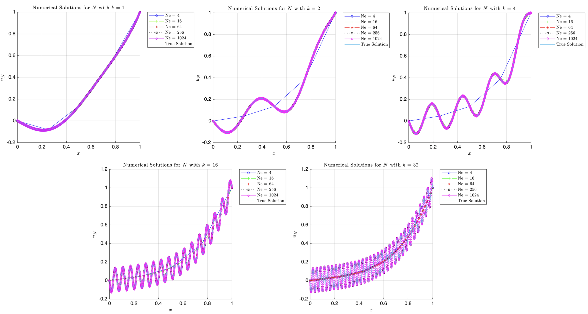
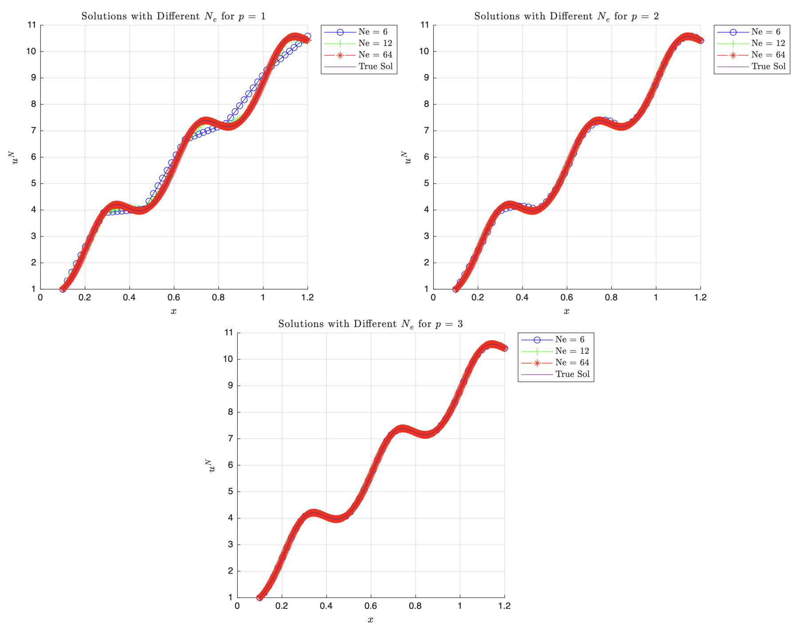
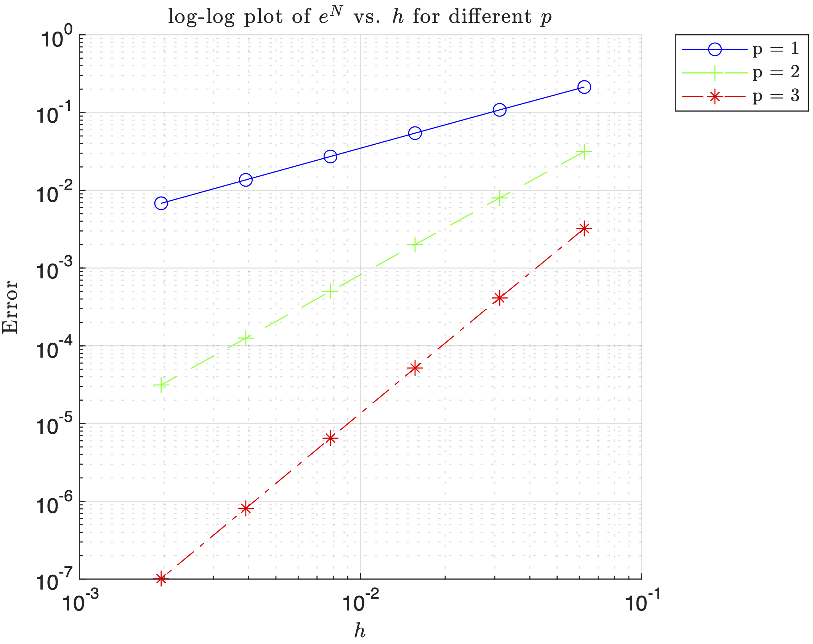

## Executive Summary

The Finite Element Method (FEM) is a powerful numerical technique used to solve complex engineering problems that are difficult or impossible to solve analytically. This comprehensive guide covers the theoretical foundations, practical applications, and implementation strategies of FEM across various engineering disciplines.

This project is structured into eight sections, progressing from fundamental concepts to advanced applications and implementation techniques.

---

## 1. The Basics of FEM

### 1.1 Introduction to Finite Element Analysis

The Finite Element Method (FEM) is a numerical technique for approximating solutions to boundary value problems in engineering and physics. It divides a complex domain into smaller, simpler parts called finite elements, and uses variational methods to approximate the solution over the entire domain.

The fundamental concept behind FEM is to **discretize** a continuous problem into a finite number of elements connected at specific points called **nodes**. This discretization transforms differential equations into a system of algebraic equations that can be solved using matrix methods.

### 1.2 Historical Development

FEM originated in the 1940s and 1950s with the work of engineers and mathematicians in the aerospace and automotive industries. Key milestones include:

- **1940s**: Early work on matrix methods for structural analysis
- **1950s**: Development of the displacement method by Turner, Clough, Martin, and Topp
- **1960s**: Introduction of isoparametric elements by Taig and Irons
- **1970s**: Commercial FEM software development begins
- **1980s-Present**: Rapid advancement in computational capabilities and algorithm development

### 1.3 Basic Principles

The core principles of FEM are based on three fundamental concepts:

#### 1.3.1 Discretization
A continuous domain is divided into a finite number of elements. Each element is defined by nodes, and the behavior within each element is approximated using simple functions.

#### 1.3.2 Interpolation
Within each element, the solution is approximated using interpolation functions (shape functions). For example, in structural analysis, displacement within an element might be approximated as:

$$u^e(x,y) = \sum_{i=1}^n N_i(x,y) u_i$$

where $N_i$ are shape functions and $u_i$ are nodal displacements.

#### 1.3.3 Assembly
Individual element equations are assembled into a global system of equations using the principle of compatibility (displacements must be continuous across element boundaries) and equilibrium.

### 1.4 Advantages and Limitations

#### Advantages:
- Can handle complex geometries and boundary conditions
- Applicable to various physics problems (structures, heat transfer, fluid flow, electromagnetics)
- Provides detailed stress/strain information throughout the domain
- Can be automated for parametric studies

#### Limitations:
- Requires significant computational resources for large models
- Accuracy depends on mesh quality and element type selection
- Preprocessing can be time-consuming for complex geometries
- Results interpretation requires engineering judgment

### 1.5 Applications in Engineering

FEM is widely used across engineering disciplines:

- **Structural Engineering**: Stress analysis, vibration analysis, buckling analysis
- **Thermal Engineering**: Heat conduction, convection, radiation
- **Fluid Dynamics**: CFD analysis, aerodynamics
- **Electromagnetic Analysis**: Antenna design, motor analysis
- **Biomechanics**: Bone stress analysis, implant design
- **Geotechnical Engineering**: Soil-structure interaction

### 1.6 Analytical Solution of a Boundary Value Problem

To illustrate the fundamental concepts of FEM, let's solve a one-dimensional boundary value problem both analytically and numerically. This will provide a true solution against which we can compare our FEM results.

Consider the differential equation:

$$\frac{d}{dx} \left(E \frac{du}{dx}\right) = k^2 \sin\left(\frac{2\pi k x}{L}\right) + 2x^2$$

with material constant $E = 0.2$, domain $\Omega = (0,L)$ where $L = 1$, and boundary conditions $u(0) = 0$, $u(L) = 1$.

Starting with the ODE, we integrate twice to find $u_{\text{true}}$. First integration yields:

$$\frac{d}{dx} \left(E \frac{du}{dx}\right) = k^2 \sin\left(\frac{2\pi k x}{L}\right) + 2x^2$$

$$\int \frac{d}{dx} \left(E \frac{du}{dx}\right) dx = \int \left[k^2 \sin\left(\frac{2\pi k x}{L}\right) + 2x^2\right] dx$$

$$E \frac{du}{dx} = k^2 \int \sin\left(\frac{2\pi k x}{L}\right) dx + 2 \int x^2 dx$$

Using $u$-substitution where $u = \frac{2\pi k x}{L}$ and $dx = \frac{L}{2\pi k} du$:

$$E \frac{du}{dx} = k^2 \int \sin(u) \cdot \frac{L}{2\pi k} du + 2 \int x^2 dx$$

$$E \frac{du}{dx} = \frac{k^2 L}{2\pi k} \int \sin(u) du + 2 \int x^2 dx$$

$$E \frac{du}{dx} = -\frac{k L}{2\pi} \cos\left(\frac{2\pi k x}{L}\right) + \frac{2}{3} x^3 + C_1$$

Integrating again:

$$\int E \frac{du}{dx} dx = \int \left[-\frac{k L}{2\pi} \cos\left(\frac{2\pi k x}{L}\right) + \frac{2}{3} x^3 + C_1\right] dx$$

$$E u(x) = -\frac{k L}{2\pi} \int \cos\left(\frac{2\pi k x}{L}\right) dx + \frac{2}{3} \int x^3 dx + \int C_1 dx$$

$$E u(x) = -\frac{\cancel{k} L}{2\pi} \cdot \frac{L}{2\pi \cancel{k}} \sin\left(\frac{2\pi k x}{L}\right) + \frac{2}{3} \cdot \frac{x^4}{4} + C_1 x + C_2$$

$$E u(x) = -\frac{L^2}{4\pi^2} \sin\left(\frac{2\pi k x}{L}\right) + \frac{x^4}{6} + C_1 x + C_2$$

$$u(x) = -\frac{L^2}{4\pi^2 E} \sin\left(\frac{2\pi k x}{L}\right) + \frac{x^4}{6E} + \frac{C_1 x}{E} + \frac{C_2}{E}$$

Applying the boundary condition $u(0) = 0$:

$$u(0) = 0 = -\frac{L^2}{4\pi^2 E} \sin\left(\frac{2\pi k (0)}{L}\right) + \frac{(0)^4}{6E} + \frac{C_1 (0)}{E} + \frac{C_2}{E} \Rightarrow C_2 = 0$$

So now:

$$u(x) = -\frac{L^2}{4\pi^2 E} \sin\left(\frac{2\pi k x}{L}\right) + \frac{x^4}{6E} + \frac{C_1 x}{E}$$

Applying the second boundary condition $u(L) = 1$:

$$u(L) = 1 = -\frac{L^2}{4\pi^2 E} \sin\left(\frac{2\pi k L}{L}\right) + \frac{L^4}{6E} + \frac{C_1 L}{E}$$

$$\frac{C_1 L}{E} = 1 - \frac{L^4}{6E} + \frac{L^2}{4\pi^2 E} \sin(2\pi k)$$

$$C_1 = \frac{E}{L} \left(1 - \frac{L^4}{6E} + \frac{L^2}{4\pi^2 E} \sin(2\pi k)\right)$$

$$C_1 = \frac{E}{L} - \frac{L^3}{6} + \frac{L}{4\pi^2} \sin(2\pi k)$$

Substituting back:

$$u_{\text{true}}(x) = -\frac{L^2}{4\pi^2 E} \sin\left(\frac{2\pi k x}{L}\right) + \frac{x^4}{6E} + \frac{x}{E} \left[\frac{E}{L} - \frac{L^3}{6} + \frac{L}{4\pi^2} \sin(2\pi k)\right]$$

$$u_{\text{true}}(x) = -\frac{L^2}{4\pi^2 E} \sin\left(\frac{2\pi k x}{L}\right) + \frac{x^4}{6E} + x \left[\frac{1}{L} - \frac{L^3}{6E} + \frac{L}{4\pi^2 E} \sin(2\pi k)\right]$$

Substituting the material constants $E = 0.2$ and $L = 1$:

$$u_{\text{true}}(x) = -\frac{1}{0.8\pi^2} \sin(2\pi k x) + \frac{x^4}{1.2} + x \left[\frac{1}{6} + \frac{5}{4\pi^2} \sin(2\pi k)\right]$$

### 1.7 Derivation of the Weak Form Using Galerkin's Method

To derive the weak form of the differential equation using Galerkin's method, we start with the strong form:

$$\frac{d\sigma}{dx} + f(x) = 0$$

where:

$$f(x) = -\left(k^2 \sin\left(\frac{2\pi k x}{L}\right) + 2x^2\right)$$

$$\sigma(x) = E(x) \frac{du}{dx}$$

Multiply both sides by a smooth test function $\nu = \nu(x)$ and integrate over the domain:

$$\int_{\Omega} \left(\frac{d\sigma}{dx} \nu + f(x) \nu\right) dx = \int_{\Omega} r \nu dx$$

where $r$ is the residual. Apply the product rule to $\sigma \nu$:

$$\frac{d}{dx}(\sigma \nu) = \frac{d\sigma}{dx} \nu + \sigma \frac{d\nu}{dx}$$

$$\frac{d\sigma}{dx} \nu = \frac{d(\sigma \nu)}{dx} - \sigma \frac{d\nu}{dx}$$

Substitute into the equation:

$$\int_{\Omega} \left[\frac{d(\sigma \nu)}{dx} - \sigma \frac{d\nu}{dx}\right] dx + \int_{\Omega} f \nu dx = \int_{\Omega} r \nu dx$$

$$\int_{\Omega} \frac{d(\sigma \nu)}{dx} dx - \int_{\Omega} \sigma \frac{d\nu}{dx} dx + \int_{\Omega} f \nu dx = 0$$

For the weak form to hold for all test functions $\nu$, the residual $r(x) = \frac{d\sigma}{dx} + f = 0$ at all points. Since $\nu(x)$ will find the solution and force the residual to zero, we have:

$$\int_{\Omega} \sigma \frac{d\nu}{dx} dx = \int_{\Omega} f \nu dx + \sigma \nu \big|_{\partial \Omega}$$

Set $\nu = 0$ on the boundaries where displacement $u$ is specified ($\Gamma_u$), which includes the entire boundary $\partial \Omega = \{0,L\}$. Thus $\sigma \nu(L) - \sigma \nu(0) = 0$.

To constrain the solution to have finite energy, let $u, \nu \in H^1(\Omega)$, where $H^1(\Omega)$ is the Sobolev space of functions with finite energy norm.

The weak form becomes:

$$\int_{\Omega} \sigma \frac{d\nu}{dx} dx = \int_{\Omega} f \nu dx$$

where the solution $u \in H^1(\Omega)$ satisfies $u \vert_{\Gamma_u} = u_0^*$ and $\forall \nu \in H^1(\Omega)$, $\nu \vert_{\Gamma_u} = 0$.

With the specific boundary conditions and domain:
- $\Omega = (0,L)$ where $L = 1$
- $f(x) = -\left(k^2 \sin\left(\frac{2\pi k x}{L}\right) + 2x^2\right)$
- $\sigma = E(x) \frac{du}{dx}$
- $u(0) = u_0^* = 0$
- $u(L) = u_L^* = 1$

### 1.8 One-Dimensional Finite Element Implementation

Using linear equal-sized elements, we implement a 1D FEM program to solve the boundary value problem. The program discretizes the domain into $N$ elements and uses Gaussian quadrature for numerical integration.

#### Mesh Requirements Analysis

The number of finite elements $N$ needed depends on the parameter $k$, which controls the oscillatory behavior of the solution. Higher $k$ values require finer meshes to capture the rapidly oscillating solution.

| k  | N   |
|----|-----|
| 1  | 18  |
| 2  | 46  |
| 4  | 124 |
| 16 | 574 |
| 32 | 1157 |

It is evident that as we increase $k$, the number of finite elements needed increases. As $k$ increases, the oscillatory behaviour of the problem increases which would also force our solution, $u_{\text{true}}(x)$ to oscillate more rapidly as well due to the two sine terms present. In order to actually capture the true nature of the solution and all the details fully, we would need more linear finite elements to refine the mesh. This is seen by looking at $k=1$ a relatively coarse mesh with $N=18$ suffices to capture the solution such that its energy norm is below 0.05. If we move to a higher $k$ of 16 and 32, we see that the number of elements $574$ and $1157$, respectively, leads to a very fine mesh. This probably suggests that we should try higher order shape functions to reduce the computational strain. It is also worth noting that there appears to exist a linear dependence between $k$ and $N$, that is, if we double $k$ then $N$ also doubles roughly. Explicitly, we see this with $k=2$ then $N=46$ and if $k=4$ then $N=124$. If you plotted the line of best fit of $k$ vs. $N$, it roughly follows the line $y=36.741x-20$.

#### Numerical Solution Convergence

The general trends follow that of above, that is, as we increase the number of elements, $N_e$, the more closely the solution converges to the true solution. But we also see that despite the low number of elements for $N_e=4$ and $N_e=16$ we still get a very good approximation of the true solution at low $k$ values. However, as $k$ increases, it is clear that the lack of elements starts to take a toll on the numerical solution's accuracy and coarse meshes are no longer good enough to achieve convergence; finer meshes are required to accurately map the oscillations. The low frequency problem is clearly less computationally expensive as we can solve them with limited elements. However, the higher frequency require finer meshes otherwise we see aliasing due to insufficient resolution; this implies that the choice of $N_e$ is very much problem dependent. 



#### Error Analysis

The energy norm error $e^N$ versus $1/N$ follows a logarithmic relationship, demonstrating the convergence properties of the finite element method. Higher $k$ values show slower convergence rates, requiring more elements to achieve the same level of accuracy.


### 1.9 MATLAB Implementation

<details>
<summary><strong>Linear FEM Implementation (Click to Expand)</strong></summary>

```matlab
clear; clc; close all;

% Vector of elements we want to evaluate at.
NeVec = [4,16,64,256,1024];
% Vector of k constants to evaluate at.
kVec = [1,2,4,16,32];
x0 = 0;
L = 1;
p = 1;      % Element polynomial order (1 = Linear)
Efunc = 0.2;
BC0 = 0;    % u(0) = 0
BCL = 1;    % u(L) = 1

% Array to see if BC is Dirichlet (1) or Neumann (0)
% First entry (BCType(1)) is for left boundary
% Second entry (BCType(2)) is for right boundary
BCType = [1 1]; % Both Endpoints are Dirichlet for HW1

syms x; % Will need to download Symbolic Math Toolbox
force = @(x) -((k.^2).*sin((2.*pi.*k.*x)./L)+2.*x.^2); % fill in
uTrue = @(x)  (-L.^2/(4.*pi.^2.*Efunc).*sin(2.*pi.*k.*x./L))+(x.^4./(6.*Efunc))+...
    x*(1./L-L.^3/(6.*Efunc)+L./(4.*pi.^2.*Efunc).*sin(2.*pi.*k)); %fill in
duTrue = @(x) -(L./(2.*pi.*Efunc)).*k.*cos((2.*pi.*k.*x)./L)+(2.*x.^3)./(3.*Efunc)+(1./L)-...
    (L.^3./(6.*Efunc))+(L./(4.*pi.^2.*Efunc))*sin(2.*pi.*k); % fill in

% Ensure plots use LaTex
set(groot, 'defaultTextInterpreter', 'latex');
set(groot, 'defaultLegendInterpreter', 'latex');

%% P3a
minNe = zeros(numel(kVec),1);
for i = 1:numel(kVec)   % loop through stiffness values
    k = kVec(i);
    
    % update forcing function and duTrue for current k value
    force = @(x) -((k.^2).*sin((2.*pi.*k.*x)./L)+2.*x.^2); % fill in
    duTrue = @(x) -(L./(2.*pi.*Efunc)).*k.*cos((2.*pi.*k.*x)./L)+(2.*x.^3)./(3.*Efunc)+(1./L)-...
        (L.^3./(6.*Efunc))+(L./(4.*pi.^2.*Efunc))*sin(2.*pi.*k); % fill in
    
    errFlag = false;
    Ne = 4; % coarse initial mesh
    while ~errFlag
        % mesh and solve FEM problem
        h = 1/Ne * ones(Ne,1);
        [xglobe, Nn, conn] = Mesh1D(p, Ne, x0, h);
        [uN, error] = myFEM1D(p, Ne, Nn, conn, xglobe, force, Efunc, BC0, BCL, BCType, duTrue);
      
        if error <= 0.05    % if error is above threshold, increment element count and try again
            minNe(i) = Ne;
            errFlag = true;
        else
            Ne = Ne + 1;
        end  
    end
end

% Print out minimum number of N are needed for different k's
fprintf('k\tmin Ne\n')
for i = 1:length(kVec)
    fprintf('%d\t%d\n',kVec(i),minNe(i));
end

%% P3b
close all
markers = {'o','+','*','s','d','v','>','h'};
% List a bunch of colors; like the markers, they 
% will be selected circularly. 
colors = {'b','g','r','k','m','c'};
% Same with line styles
linestyle = {'-','--','-.',':'};
% this function will do the circular selection
% Example:  getprop(colors, 7) = 'b'
getFirst = @(v)v{1}; 
getprop = @(options, idx)getFirst(circshift(options,-idx+1));

for j = 1:numel(kVec)
figure
hold on;
k = kVec(j);
force = @(x) -((k.^2).*sin((2.*pi.*k.*x)./L)+2.*x.^2); % fill in
uTrue = @(x)  (-L.^2/(4.*pi.^2.*Efunc).*sin(2.*pi.*k.*x./L))+(x.^4./(6.*Efunc))+...
    x*(1./L-L.^3/(6.*Efunc)+L./(4.*pi.^2.*Efunc).*sin(2.*pi.*k)); %fill in
duTrue = @(x) -(L./(2.*pi.*Efunc)).*k.*cos((2.*pi.*k.*x)./L)+(2.*x.^3)./(3.*Efunc)+(1./L)-...
    (L.^3./(6.*Efunc))+(L./(4.*pi.^2.*Efunc))*sin(2.*pi.*k); % fill in
    for i = 1:numel(NeVec)
        Ne = NeVec(i);
        h = 1/Ne * ones(Ne,1);
    
        [xglobe, Nn, conn] = Mesh1D(p, Ne, x0, h);
        
        [uN, error] = myFEM1D(p, Ne, Nn, conn, xglobe, force, Efunc, BC0, BCL, BCType, duTrue);
    
        plot(xglobe, uN,...
            'Marker',getprop(markers,i),...
            'MarkerSize', 4 ,...
            'color',getprop(colors,i),...
            'linestyle',getprop(linestyle,i),...
            'DisplayName', ['Ne = ', num2str(Ne)]);
    end

    xTrue = linspace(0,1,1000);
    plot(xTrue, uTrue(xTrue), 'DisplayName', 'True Solution');
    title(sprintf('Numerical Solutions for $N$ with $k = %d$', k), ...
        'Interpreter', 'latex', ...
        'FontWeight', 'normal');
    xlabel('$x$', 'Interpreter', 'latex')
    ylabel('$u_N$', 'Interpreter', 'latex')
    legend('Location','bestoutside');
    grid on;
end

%% Fill in Mesh1D Function below
% Ouputs: nodal coordinates, total number of nodes, connectivity matrix
function [xglobe, Nn, conn] = Mesh1D(p, Ne, x0, h)
        
    % Number of nodes in domain
    Nn = p * Ne + 1;

    % Initializing real domain positions
    xglobe = x0*ones(1,Nn);

    % Number of nodes per element
    Nne = p+1;

    % Iterate each next node position based on previous position + element length    
    for node = 2:Nn 
        % Use min since if we exceed Nn > Ne+1 but for 1D just add h(node-1),
        xglobe(node) = xglobe(node-1) + h(min(node-1, Ne)); % finish line here;
    end

    % Initializing connectivity matrix
    conn = zeros(Ne,Nne);
    
    % Fill in connectivity matrix (1D)
    conn = [(1:Nn-1)', (2:Nn)'];
end

function [ShapeFunc, ShapeDer] = evalShape(p,pts)
    switch p
        case 1
        % Linear Shape Functions (HW#1)
        ShapeFunc = [(1-pts)./2, (1+pts)./2]; % Eq 3.27
        ShapeDer = [-1/2, 1/2].*ones(size(pts));
        
        case 2
        % Quadratic Shape Functions (HW#2)
        ShapeFunc = [(pts.*(pts-1))/2, 1-pts.^2, (pts.*(pts+1))/2];
        ShapeDer = [ (2*pts-1)/2, -2*pts, (2*pts+1)/2 ];

        case 3
        % Cubic Shape Functions (HW#2)
        ShapeFunc = [-9/16 * (pts + 1/3) .* (pts - 1/3) .* (pts - 1), ...
                     27/16 * (pts + 1) .* (pts - 1/3) .* (pts - 1), ...
                    -27/16 * (pts + 1) .* (pts + 1/3) .* (pts - 1), ...
                      9/16 * (pts + 1) .* (pts + 1/3) .* (pts - 1/3)];

         ShapeDer = [1/16*(-27.*pts.^2+18.*pts+1), 9/16*(9.*pts.^2-2.*pts-3), ...
                     -9/16*(9.*pts.^2-2.*pts-3), 1/16*(27.*pts.^2+18.*pts-1)];

    end
end

% Got rid of xh
function [uN, error] = myFEM1D(p, Ne, Nn, conn, xglobe, force, Efunc, BC0, BCL, BCType, duTrue)
    % Defining weights and Gauss points
    [wts, pts] = myGauss(p);

    % Evaluating shape functions and their derivatives
    [ShapeFunc, ShapeDer] = evalShape(p,pts);

    % Initializing stiffness Matrix
    K = zeros(Nn, Nn);

    % Initializing FEM solution vector
    uN = zeros(Nn, 1);

    % Initializing Forcing vector
    R = zeros(Nn, 1);

    % Loop through each element
    for e = 1:Ne
        % Extract nodal indices (id) from conn matrix
        id = conn(e, :); % <- whole row-elem
        for q = 1:numel(pts) % looping through each gauss point
            % Evaluating Jacobian
            J = xglobe(id)*ShapeDer(q,:)';
            
            % Evaluating elemental stiffness matrix (2 x 2)
            Ke = wts(q) * (Efunc / J) * (ShapeDer(q,:)' * ShapeDer(q,:));

            % Map gauss point from local to global coordinates
            x_zeta = xglobe(id) * ShapeFunc(q,:)';
            
            % Evaluating forcing function for elemental loading terms
            Re = force(x_zeta) * ShapeFunc(q,:)' * J * wts(q);
            
            % Assembling Global Stiffness Matrix K
            K(id, id) = K(id, id) + Ke;
            
            % Assembling loading vector R
            R(id) = R(id) + Re;
        end
    end
    
    % Boundary conditions
    if BCType(1) % Left Dirichlet BC
        uN(1) = BC0;
        % Adjust second loading term 
        R(2) = R(2)-K(2,1)*uN(1);
    else % Nothing else for now
    end

    if BCType(2) % Right Dirichlet BC
        uN(Nn) = BCL;
        % Adjust second to last loading term 
        R(Nn-1) = R(Nn-1)-K(Nn-1,Nn)*uN(Nn);
    else % Nothing else for now
    end
    
    % Calculating uN (with removed BC terms)
    uN(2:end-1) = K(2:end-1,2:end-1) \ R(2:end-1);
    
    % Evaluating Error
    % Initialize error numerator and denominator
    errNum = 0;
    errDen = 0;
    
    for e = 1:Ne
        % Extract element ID
        id = conn(e,:);
        
        % Loop through Gauss points
        for q = 1:numel(pts)
            
            J = xglobe(id)*ShapeDer(q,:)';
            
            % Derivative of numerical solution
            duN = (ShapeDer(q,:) / J) * uN(id);
            
            % Map gauss point from local to true spatial coordinates
            x_zeta = xglobe(id) * ShapeFunc(q,:)'; 
            % Error numerator and denominator
            errNum = errNum + (duTrue(x_zeta) - duN).^2 * Efunc * J * wts(q);
            errDen = errDen + (duTrue(x_zeta)).^2  * Efunc * J * wts(q);
        end
    end
    
    % Final error
    error = sqrt(errNum/errDen);
end

%% P3c
figure; hold on;
title('$\log$-$\log$ Plot of $e^N$ vs. $1/N$ for different $k$', 'Interpreter', 'latex');
xlabel('$1/N$');
ylabel('$e^N$');
grid on;

% Loop over k values
for j = 1:length(kVec)
    k = kVec(j);
    
    force = @(x) -((k.^2).*sin((2.*pi.*k.*x)./L)+2.*x.^2); % fill in
    duTrue = @(x) -(L./(2.*pi.*Efunc)).*k.*cos((2.*pi.*k.*x)./L)+(2.*x.^3)./(3.*Efunc)+(1./L)-...
        (L.^3./(6.*Efunc))+(L./(4.*pi.^2.*Efunc))*sin(2.*pi.*k); % fill in
    
    % errors for each mesh size
    errors = zeros(size(NeVec));
    
    for i = 1:length(NeVec)
        Ne = NeVec(i);
        h = 1/Ne * ones(Ne,1);
        
        % Generate mesh
        [xglobe, Nn, conn] = Mesh1D(p, Ne, x0, h);
        
        % Solve FEM and compute error
        [uN, errorVal] = myFEM1D(p, Ne, Nn, conn, xglobe, force, Efunc, BC0, BCL, BCType, duTrue);
        errors(i) = errorVal;
    end
    
    % Plot log-log scale
    loglog(1./NeVec, errors, 'Marker', markers{j}, 'Color', colors{j}, ...
           'DisplayName', sprintf('$k = %d$', k));
    
    set(gca, "YScale", "log", "XScale", "log");
end

legend('Location', 'bestoutside');

%% DO NOT MODIFY BELOW -- use myGauss for myFEM1D
function [wts,pts] = myGauss(p)
    
    ptsNeed = ceil((p+1)/2);
    
    switch ptsNeed + 2
        case 1
            wts = 2;
            pts = 0;
        case 2
            wts = [1; 1];
            pts = [-0.5773502691896257; 0.5773502691896257];
        case 3
            wts = [0.8888888888888888; 0.5555555555555556; ...
                0.5555555555555556];
            pts = [0; -0.7745966692414834; 0.7745966692414834];
        case 4
            wts = [0.6521451548625461; 0.6521451548625461; ...
                0.3478548451374538; 0.3478548451374538];
            pts = [-0.3399810435848563; 0.3399810435848563; ...
                -0.8611363115940526; 0.8611363115940526];
        case 5
            wts = [0.5688888888888889; 0.4786286704993665;...
                0.4786286704993665; 0.2369268850561891; ...
                0.2369268850561891];
            pts = [0; -0.5384693101056831;  0.5384693101056831;...
                -0.9061798459386640; 0.9061798459386640];
    end
end
```

</details>

---

## 2. Higher Order Elements

### 2.1 Analytical Solution with Mixed Boundary Conditions

To demonstrate the capabilities of higher-order finite elements, let's solve a boundary value problem with mixed boundary conditions (Dirichlet and Neumann). This will highlight the advantages of p-refinement over h-refinement.

Consider the differential equation:

$$\frac{d}{dx} \left(E \frac{du}{dx}\right) = k^2 \sin\left(\frac{\pi k x}{L}\right) + k \cos\left(\frac{2\pi k x}{L}\right)$$

with domain $\Omega = (x_0, L)$ where $x_0 = 0.1$ and $L = 1.2$, material constant $E = 0.2$, and parameter $k = 6$. The boundary conditions are:
- Dirichlet: $u(x_0) = 1$
- Neumann: $E \frac{du}{dx}\big|_{x=L} = -0.7$

Starting with the ODE integration:

$$\frac{d}{dx} \left(E \frac{du}{dx}\right) = k^2 \sin\left(\frac{\pi k x}{L}\right) + k \cos\left(\frac{2\pi k x}{L}\right)$$

$$\int \frac{d}{dx} \left(E \frac{du}{dx}\right) dx = \int \left[k^2 \sin\left(\frac{\pi k x}{L}\right) + k \cos\left(\frac{2\pi k x}{L}\right)\right] dx$$

$$E \frac{du}{dx} = k^2 \int \sin\left(\frac{\pi k x}{L}\right) dx + k \int \cos\left(\frac{2\pi k x}{L}\right) dx$$

Using u-substitution for the sine term ($u = \frac{\pi k x}{L}$, $dx = \frac{L}{\pi k} du$) and cosine term ($v = \frac{2\pi k x}{L}$, $dx = \frac{L}{2\pi k} dv$):

$$E \frac{du}{dx} = k^2 \int \sin(u) \cdot \frac{L}{\pi k} du + k \int \cos(v) \cdot \frac{L}{2\pi k} dv$$

$$E \frac{du}{dx} = \frac{k^2 L}{\pi k} \int \sin(u) du + \frac{k L}{2\pi k} \int \cos(v) dv$$

$$E \frac{du}{dx} = -\frac{k L}{\pi} \cos\left(\frac{\pi k x}{L}\right) + \frac{L}{2\pi} \sin\left(\frac{2\pi k x}{L}\right) + C_1$$

Applying the Neumann boundary condition $E \frac{du}{dx}\big|_{x=L} = -0.7$:

$$E \frac{du}{dx}\big|_{x=L} = -0.7 = -\frac{k L}{\pi} \cos(\pi k) + \frac{L}{2\pi} \sin(2\pi k) + C_1$$

$$C_1 = \frac{k L}{\pi} \cos(\pi k) - \frac{L}{2\pi} \sin(2\pi k) - 0.7$$

Substituting the values $k=6$, $L=1.2$:

$$C_1 = \frac{7.2}{\pi} \cos(6\pi) - \frac{1.2}{2\pi} \sin(12\pi) - 0.7 = \frac{7.2}{\pi} - 0.7$$

Now integrating again:

$$\int E \frac{du}{dx} dx = \int \left[-\frac{k L}{\pi} \cos\left(\frac{\pi k x}{L}\right) + \frac{L}{2\pi} \sin\left(\frac{2\pi k x}{L}\right) + C_1\right] dx$$

$$E u(x) = -\frac{k L}{\pi} \int \cos\left(\frac{\pi k x}{L}\right) dx + \frac{L}{2\pi} \int \sin\left(\frac{2\pi k x}{L}\right) dx + C_1 \int dx$$

$$E u(x) = -\frac{k L^2}{\pi^2} \sin\left(\frac{\pi k x}{L}\right) - \frac{L^2}{4\pi^2 k} \cos\left(\frac{2\pi k x}{L}\right) + C_1 x + C_2$$

$$u(x) = -\frac{k L^2}{\pi^2 E} \sin\left(\frac{\pi k x}{L}\right) - \frac{L^2}{4\pi^2 k E} \cos\left(\frac{2\pi k x}{L}\right) + \frac{C_1 x}{E} + \frac{C_2}{E}$$

Applying the Dirichlet boundary condition $u(x_0) = 1$:

$$1 = -\frac{k L^2}{\pi^2 E} \sin\left(\frac{\pi k x_0}{L}\right) - \frac{L^2}{4\pi^2 k E} \cos\left(\frac{2\pi k x_0}{L}\right) + \frac{C_1 x_0}{E} + \frac{C_2}{E}$$

$$C_2 = E + \frac{k L^2}{\pi^2 E} \sin\left(\frac{\pi k x_0}{L}\right) + \frac{L^2}{4\pi^2 k E} \cos\left(\frac{2\pi k x_0}{L}\right) - \frac{C_1 x_0}{E}$$

Substituting numerical values:

$$C_2 = \frac{1.44}{\pi^2} \sin\left(\frac{6\pi \cdot 0.1}{1.2}\right) + \frac{1.44}{4\pi^2 \cdot 6} \cos\left(\frac{2\pi \cdot 6 \cdot 0.1}{1.2}\right) - C_1 \cdot 0.1 + 0.2$$

$$C_2 = \frac{1.44}{\pi^2} \sin(\pi/2) + \frac{0.06}{\pi^2} \cos(\pi) - \frac{0.72}{\pi} + 0.27 = \frac{1.38}{\pi^2} - \frac{0.72}{\pi} + 0.27$$

The analytical solution is:

$$u_{\text{true}}(x) = -\frac{k L^2}{\pi^2 E} \sin\left(\frac{\pi k x}{L}\right) - \frac{L^2}{4\pi^2 k E} \cos\left(\frac{2\pi k x}{L}\right) + \frac{C_1 x}{E} + \frac{C_2}{E}$$

Substituting all constants yields:

$$u_{\text{true}}(x) = -\frac{7.2}{\pi^2} \sin(5\pi x) - \frac{0.3}{\pi^2} \cos(10\pi x) + x\left(\frac{36}{\pi} - 3.5\right) + \frac{6.9}{\pi^2} - \frac{3.6}{\pi} + 1.35$$

### 2.2 Weak Form with Natural Boundary Conditions

When dealing with mixed boundary conditions, the weak form must account for natural (Neumann) boundary conditions. Starting with the strong form and multiplying by a test function $\nu$:

$$\int_{\Omega} \left(\frac{d\sigma}{dx} \nu + f \nu\right) dx = \int_{\Omega} r \nu dx$$

$$\int_{\Omega} \frac{d(\sigma \nu)}{dx} dx - \int_{\Omega} \sigma \frac{d\nu}{dx} dx + \int_{\Omega} f \nu dx = 0$$

$$\sigma \nu \big|_{\partial \Omega} - \int_{\Omega} \sigma \frac{d\nu}{dx} dx + \int_{\Omega} f \nu dx = 0$$

For mixed boundary conditions, we split the boundary into $\Gamma_u$ (Dirichlet) and $\Gamma_t$ (Neumann). Since $\nu = 0$ on $\Gamma_u$, the boundary term becomes:

$$\sigma \nu \big|_{\partial \Omega} = \sigma(L) \nu(L) - \sigma(0) \nu(0) = t^* \nu(L)$$

where $t^* = -0.7$ is the prescribed traction on the right boundary.

The weak form becomes:

Find $u \in H^1(\Omega)$, $u \vert_{\Gamma_u} = d$ such that $\forall \nu \in H^1(\Omega)$, $\nu \vert_{\Gamma_u} = 0$:

$$\int_{\Omega} \frac{d\nu}{dx} E \frac{du}{dx} dx = \int_{\Omega} f \nu dx + t^* \nu \vert_{\Gamma_t}$$

### 2.3 Higher-Order Element Implementation

Using quadratic (p=2) and cubic (p=3) elements in addition to linear (p=1) elements demonstrates the power of p-refinement.

#### Element Count Requirements

The table below shows the number of elements needed to achieve $e^N \leq 0.05$ for different polynomial orders:

| p | Nₑ | Error |
|---|-----|-------|
| 1 | 70  | 0.0497 |
| 2 | 13  | 0.0473 |
| 3 | 7   | 0.0375 |

Higher-order elements dramatically reduce the required number of elements while maintaining accuracy.

#### Solution Convergence Analysis



Based on the plots, for a complete polynomial order of 1 (i.e. linear elements) at $N_e=6$, the piecewise approximations are visibly less accurate than the true solution and are jagged. As $N_e$ increases to 64 though, the linear solution does tend toward the true solution which would make sense as we are refining the mesh by increasing the number of elements used. For a complete polynomial order of 2 (i.e. quadratic elements), even with $N_e=6$, we see it does a much better job than linear elements capturing the curvature better, and again, as we increase $N_e$ to 64, it is indistinguishable from the true solution. Generally, we see a lot less error compared to $p=1$. Finally, for a complete polynomial order of 3 (i.e. cubic elements), it does the best job of the 3 matching the true solution to the approximation. Even at just $N_e=6$, we see almost no difference between that and the true solution and, again, as $N_e$ increases to 64 it looks exactly like the true solution. This means that at higher orders of $p$, we can increase the accuracy as the solution captures the curvature better than linear elements allowing for fewer elements to achieve the same results. It also shows that no matter what, increasing $N_e$ means we can interpolate between more points so we can approximate more tightly. 

#### Convergence Rate Analysis



Firstly, since it is a $\log-\log$ plot, they are straight lines with positive slope. Also notice that the slopes for $p=1$, $p=2$, and $p=3$ are approximately 1, 2, and 3, respectively (this is shown in MATLAB). From this we can say that for $p=1$ $e^N\sim \mathcal{O}(h^1)$ and similarly, $p=2$ $e^N\sim \mathcal{O}(h^2)$, $p=3$ $e^N\sim \mathcal{O}(h^3)$. This means that each of these lines actually represents the order of convergence for the energy norm. Thus, $e^N \propto h^p\Rightarrow e^N=Ch^p$ where $C$ is some proportionality constant. The trend that we see is that as the complete order of the polynomial, $p$, increases---holding $h$ constant---the slope also increases implying a faster convergence for the same element size. 


### 2.4 p-Refinement vs h-Refinement

Based on our results, $p$-refinement is more effective in producing the most accurate solutions for less computational cost. Recall that under relatively mild assumptions, a fundamental a priori error estimate for the finite element method is

$$\|u-u^h\|_{E(\Omega)}\leq\mathcal{C}(u,p)h^{\min(r-1,p)}$$

where $p$ is the complete polynomial order of the finite element method used, $r$ is the regularity or smoothness index of the exact solution, and $\mathcal{C}$ is a constant dependent on the exact solution and the shape functions but not on $h$. For $h$-refinement, decreasing $h$ (increasing $N_e$) improves the accuracy according to $\min(r-1,p)$. For $p$-refinement, increasing the degree of the polynomial can potentially drive the order of convergence up provided that $r-1$ is in fact larger than $p$. If $r$ is large, indicative of a smooth exact solution, higher order elements are extremely effective. However, if $r$ is small, increasing the polynomial order does not improve convergence. For our case, given the smoothness of the solution due to the numerous trigonometric functions present in the differential equation and solution, we have a high regularity so $\min(r-1,p)$ is $p$. We also see in the error plots that increasing $p$ while holding $h$ constant increased the rate of convergence giving us an error $e^N\sim \mathcal{O}(h^p)$. Computationally, the number of nodes per element does increase for $p$-refinement, but it is offset by the small amounts of elements that otherwise would have been required from $h$-refinement. Also note that for $h$-refinement, the amount of elements would cause some large global stiffness matrices which would be computationally expensive to solve. 

### 2.5 MATLAB Implementation for Higher-Order Elements

<details>
<summary><strong>Higher-Order FEM Implementation (Click to Expand)</strong></summary>

```matlab
clear; close all; clc;

k = 6;
x0 = 0.1;   % Left endpoint location
L = 1.2;    % right endpoint location
Efunc = 0.2;% Youngs modulus function
BC0 = 1;    % u(x = x_0 = 0.1) = 1
BCL = -0.7; % Efunc*du/dx = -0.7
res = 10;   % Number of resample points

% Array to see if BC is Dirichlet (1) or Neumann (0)
% First entry (BCType(1)) is for left boundary
% Second entry (BCType(2)) is for right boundary
BCType = [1 0]; % Left boundary Dirichlet, right boundary Neumann

force = @(x,k) -k.^2.*sin(pi.*k.*x./L) - k.*cos(2.*pi.*k.*x./L);

c1 =  (k.*L./pi).*cos(pi.*k) - (L./(2.*pi)).*sin(2.*pi.*k) - 0.7;
c2 = (L.^2./pi.^2).*sin(pi.*k.*x0./L) + (L.^2./(4.*pi.^2.*k)).*cos(2.*pi.*k.*x0./L) - c1.*x0 + Efunc;
uTrue = @(x) - (L.^2/(pi.^2.*Efunc)).*sin(pi.*k.*x./L) - (L.^2/(4.*pi.^2.*k.*Efunc)).*cos(2.*pi.*k.*x./L) + (c1.*x)./Efunc + c2./Efunc;

duTrue = @(x) - (L.*k./(pi.*Efunc)).*cos(pi.*k.*x/L) + (L/(2.*pi.*Efunc)).*sin(2.*pi.*k.*x./L) + c1./Efunc;

% Stuff to make plots look nice
markers = {'o','+','*','s','d','v','>','h'};
% List a bunch of colors; like the markers, they will be selected circularly. 
colors = {'b','g','r','k','c','m'};
% Same with line styles
linestyle = {'-','--','-.',':'};
% this function will do the circular selection
% Example:  getprop(colors, 7) = 'b'
getFirst = @(v)v{1}; 
getprop = @(options, idx)getFirst(circshift(options,-idx+1));
% End Plotting Stuff

% Ensure plots use LaTex
set(groot, 'defaultTextInterpreter', 'latex');
set(groot, 'defaultLegendInterpreter', 'latex');

%% Problem 3a 
pVec = [1, 2, 3];
minNe   = zeros(numel(pVec),1);
errorVals = zeros(numel(pVec),1);

for i = 1:numel(pVec)
    p = pVec(i);
    
    errFlag = false;
    Ne = 4;  
    while ~errFlag
        h = (L - x0) / Ne * ones(Ne,1);
        [xglobe, Nn, conn] = Mesh1D(p, Ne, x0, h);
        [~, ~, error] = myFEM1D(p, Ne, Nn, conn, xglobe, force, Efunc, BC0, BCL, BCType, duTrue, res, k);
        
        if error <= 0.05
            minNe(i) = Ne;
            errorVals(i) = error;
            errFlag = true;
        else
            Ne = Ne + 1;  % increment mesh density and try again
        end  
    end
end

% Print out the results in table format
fprintf('p\tmin Ne\tError\n');
for i = 1:length(pVec)
    fprintf('%d\t%d\t%.4f\n', pVec(i), minNe(i), errorVals(i));
end

%% Problem 3b Plotting for each p
NeVec = [6 12 64]; % Vector of elements.
for p = 1:3  % Looping through each element polynomial order (1 = Linear, 2 = Quadratic, 3 = Cubic)
    figure(p) % Creating a plot for each p
    for i = 1:numel(NeVec) % Loop through each value of elements
        Ne = NeVec(i);
        
        h = (L-x0)/Ne * ones(Ne,1); % Spacing for each element
        
        % Discretize domain
        [xglobe, Nn, conn] = Mesh1D(p, Ne, x0, h);
        
        % Solve FEM problem
        [xh, uN, error] = myFEM1D(p, Ne, Nn, conn, xglobe, force, Efunc, BC0, BCL, BCType, duTrue, res, k);
    
        % Plot Solution
        hold on;
        plot(xh, uN,...
            'Marker',getprop(markers,i),...
            'color',getprop(colors,i),...
            'linestyle',getprop(linestyle,i),...
            'DisplayName', ['Ne = ', num2str(Ne)]);
    end
    % Plotting the true solution
    xTrue = linspace(x0,L,1000);
    plot(xTrue, uTrue(xTrue), 'DisplayName', 'True Sol');
    title(['Solutions with Different $N_e$ for $p$ = ', num2str(p)])
    xlabel('$x$')
    ylabel('$u^N$');
    legend('Location','bestoutside')
    grid on;
    hold off;
end

%% Problem 3c Getting error plots
NeVec = [16 32 64 128 256 512];
errorVec = zeros(1, numel(NeVec));
fig = figure();
axes('XScale', 'log', 'YScale', 'log') % make error plots loglog scaling
hold on
for p = 1:3
    for i = 1:numel(NeVec)
        Ne = NeVec(i);
        
        h = (L-x0)/Ne * ones(Ne,1); % Spacing for each element
    
        % Discretize domain
        [xglobe, Nn, conn] = Mesh1D(p, Ne, x0, h);
        
        % Solve FEM problem and get error
        [~, ~, errorVec(i)] = myFEM1D(p, Ne, Nn, conn, xglobe, force, Efunc, BC0, BCL, BCType, duTrue, res, k);
    end
    
    % Compute slopes of error lines
    xdata = log(1./NeVec);
    ydata = log(errorVec);
    coeffs = polyfit(xdata, ydata, 1);
    slope = coeffs(1);
    fprintf('For p = %d, the slope is %f\n', p, slope);
    
    hold on;
    loglog(1./NeVec, errorVec,...
        'Marker',getprop(markers,p),...
        'color',getprop(colors,p),...
        'linestyle',getprop(linestyle,p),...
        'DisplayName', ['p = ', num2str(p)]);
    title('$\log$-$\log$ plot of $e^N$ vs. $1/Ne$ for different $p$', 'Interpreter', 'latex');
    xlabel('$h$');
    ylabel('Error');
    legend('Location','bestoutside')
    grid on;
end

%% MESHER FUNCTION
function [xglobe, Nn, conn] = Mesh1D(p, Ne, x0, h)
    % Number of nodes in domain
    Nn = p * Ne + 1;
    
    % Initializing real domain positions
    xglobe = x0 * ones(1,Nn);
    
    % Number of nodes per element
    Nne = p + 1;
    
    % Iterate each next node position based on previous position + element length    
    for node = 1:Nn-1 
        xglobe(node+1) = xglobe(node) + h(floor((p+node)/Nne))/p;
    end
    
    % Initializing connectivity matrix
    conn = zeros(Ne, Nne);
    
    for c = 1:Nne % Columns
        conn(:,c) = (c : p : (Nn - (p - c + 1)))';
    end
end

%% Fill in evalShape Function below
function [ShapeFunc, ShapeDer] = evalShape(p,pts)
    switch p
        case 1
        % Linear Shape Functions (HW#1)
        ShapeFunc = [(1-pts)./2, (1+pts)./2]; % Eq 3.27
        ShapeDer = [-1/2, 1/2].*ones(size(pts));
        
        case 2
        % Quadratic Shape Functions (HW#2)
        ShapeFunc = [(pts.*(pts-1))/2, 1-pts.^2, (pts.*(pts+1))/2];
        ShapeDer = [ (2*pts-1)/2, -2*pts, (2*pts+1)/2 ];
        
        case 3
        % Cubic Shape Functions
        ShapeFunc = [-9/16*(pts+1/3).*(pts-1/3).*(pts-1),...
                    27/16*(pts+1).*(pts-1/3).*(pts-1),...
                    -27/16*(pts+1).*(pts+1/3).*(pts-1),...
                    9/16*(pts+1).*(pts+1/3).*(pts-1/3)];
        
        ShapeDer = [-(27*pts.^2 - 18*pts - 1)/16,...
                    9*(9*pts.^2 - 2*pts - 3)/16,...
                    -9*(9*pts.^2 + 2*pts - 3)/16,...
                    (27*pts.^2 + 18*pts - 1)/16];
    end
end

function [xh, uN, error] = myFEM1D(p, Ne, Nn, conn, xglobe, force, Efunc, BC0, BCL, BCType, duTrue, res, k)
    % Defining weights and Gauss points
    [wts, pts] = myGauss(p);
    
    % Evaluating shape functions and their derivatives
    [ShapeFunc, ShapeDer] = evalShape(p,pts);
    
    % Initializing stiffness Matrix
    K = zeros(Nn, Nn);
    
    % Initializing FEM solution vector
    uN = zeros(Nn, 1);
    
    % Initializing Forcing vector
    R = zeros(Nn, 1);
    for e = 1:Ne
        % Extracting element id from conn matrix
        id = conn(e, :); % <- whole row
        for gauss_pt = 1:numel(pts)
            x_zeta = xglobe(id) * ShapeFunc(gauss_pt,:)'; 
            % Evaluating Jacobian
            J = xglobe(id) * ShapeDer(gauss_pt,:)';
            % Evaluating elemental stiffness matrix (2 x 2) CHECK THIS LINE
            % ADDING KE MIGHT NOT BE NECESSARY
            K_e = wts(gauss_pt) * (Efunc / J) * (ShapeDer(gauss_pt,:)' * ShapeDer(gauss_pt,:));
            % Evaluating forcing function @(x) -k^2*cos(2*pi*k*x/L) - k*sin(pi*k*x/L);                 
            % Evaluating elemental loading terms
            R_e = force(x_zeta, k) * ShapeFunc(gauss_pt,:)' * J * wts(gauss_pt);
            % Assembling Global Stiffness Matrix K
            K(id, id) = K(id, id) + K_e;
            % Assembling loading vector R
            R(id) = R(id) + R_e;
        end
    end
    
    % Boundary conditions
    if BCType(1) % Left Dirichlet BC
        uN(1) = BC0;
        % Adjust loading terms 
        switch p
            case 1 % Linear 
                R(2) = R(2) - K(2,1) * uN(1);
            case 2 % Quadratic
                R(2) = R(2) - K(2,1)*uN(1);
                R(3) = R(3) - K(3,1)*uN(1);
            case 3 % Cubic
                R(2) = R(2) - K(2,1)*uN(1);
                R(3) = R(3) - K(3,1)*uN(1);
                R(4) = R(4) - K(4,1)*uN(1);
        end         
    else % for Left Neumann BC
        R(1) = R(1);
    end
    
    if BCType(2) % Right Dirichlet BC
        uN(Nn) = BCL;
        % Adjust second to last loading term 
        switch p
            case 1 % Linear 
                R(Nn-1) = R(Nn-1) - K(Nn-1,Nn)*uN(Nn);
            case 2 % Quadratic
                R(Nn-1) = R(Nn-1) - K(Nn-1,Nn)*uN(Nn);
                R(Nn-2) = R(Nn-2) - K(Nn-2,Nn)*uN(Nn);
            case 3 % Cubic
                R(Nn-1) = R(Nn-1) - K(Nn-1,Nn)*uN(Nn);
                R(Nn-2) = R(Nn-2) - K(Nn-2,Nn)*uN(Nn);
                R(Nn-3) = R(Nn-3) - K(Nn-3,Nn)*uN(Nn);
        end
    else % Right Neumann BC
        R(Nn) = R(Nn) + BCL;
    end
    
    % Calculating uh (with refomated K and R)
    fixed_nodes = [];
    % if Dirichlet on LHS, add that node to the list of fixed nodes
    if BCType(1)
        fixed_nodes = [fixed_nodes, 1];
    end
    % if Dirichlet on RHS, add that node to the list of fixed nodes
    if BCType(2)
        fixed_nodes = [fixed_nodes, Nn];
    end
    % finds all nodes that are not fixed
    free_nodes = setdiff(1:Nn, fixed_nodes);
    uN(free_nodes) = K(free_nodes, free_nodes) \ R(free_nodes);
    
    % Evaluating Error
    % Initialize error numerator and denominator
    errNum = 0;
    errDen = 0;
    
    for e = 1:Ne
        % Extract element ID
        id = conn(e, :);
        
        % Loop through Gauss points
        for gauss_pt = 1:numel(pts)
            x_zeta = xglobe(id) * ShapeFunc(gauss_pt,:)'; % Eq. 3.26
            J = xglobe(id) * ShapeDer(gauss_pt,:)';
            % Derivative of numerical solution
            duN = (ShapeDer(gauss_pt,:) / J) * uN(id);
            % Derivative of true solution duTrue is input into myFEM1D
            % Error numerator and denominator
            errNum = errNum + (duTrue(x_zeta) - duN).^2 * Efunc * J * wts(gauss_pt);
            errDen = errDen + (duTrue(x_zeta)).^2  * Efunc * J * wts(gauss_pt);
        end
    end
    
    % Final error
    error = sqrt(errNum/errDen);
    
    % Resampling
    if res
        xh = zeros(Ne*res, 1);       % Initialzing Positions of resample pts
        uNres = zeros(Ne*res,1);    % Initializing uN placeholder
        S = linspace(-1,1,res)';    % Sample points 
        [ResShapeFunc, ~] = evalShape(p,S); % ShapeFunc evaluated at res points
        n = 1; % Counter for indexing xh and uNRes through all res*Ne sample points
        for e = 1:Ne
            id = conn(e, :);
            for i = 1:res                        
                xh(n) =  xglobe(id) * ResShapeFunc(i, :)'; % x(zeta)
                % maybe don;'t need transpose
                uNres(n) = ResShapeFunc(i, :) * uN(id); % evaluating uh at sample point
                n = n + 1;
            end
        end
        uN = uNres;
    else
        xh = xglobe;
    end
end

%% DO NOT MODIFY BELOW -- use myGauss for myFEM1D
function [wts,pts] = myGauss(p)
    ptsNeed = ceil((p+1)/2);
    
    switch ptsNeed + 2
        case 1
            wts = 2;
            pts = 0;
        case 2
            wts = [1; 1];
            pts = [-0.5773502691896257; 0.5773502691896257];
        case 3
            wts = [0.8888888888888888; 0.5555555555555556; ...
                0.5555555555555556];
            pts = [0; -0.7745966692414834; 0.7745966692414834];
        case 4
            wts = [0.6521451548625461; 0.6521451548625461; ...
                0.3478548451374538; 0.3478548451374538];
            pts = [-0.3399810435848563; 0.3399810435848563; ...
                -0.8611363115940526; 0.8611363115940526];
        case 5
            wts = [0.5688888888888889; 0.4786286704993665;...
                0.4786286704993665; 0.2369268850561891; ...
                0.2369268850561891];
            pts = [0; -0.5384693101056831;  0.5384693101056831;...
                -0.9061798459386640; 0.9061798459386640];
    end
end
```

</details>

## 3. Element Types and Shape Functions

*(Section 3 content to be added)*

## 4. Assembly and Solution Methods

*(Section 4 content to be added)*

## 5. Structural Analysis Applications

*(Section 5 content to be added)*

## 6. Thermal and Fluid Analysis

*(Section 6 content to be added)*

## 7. Advanced Topics and Nonlinear Analysis

*(Section 7 content to be added)*

## 8. Practical Implementation and Case Studies

*(Section 8 content to be added)*

---

## References

1. Bathe, K. J. (1996). *Finite Element Procedures*. Prentice Hall.
2. Cook, R. D., Malkus, D. S., Plesha, M. E., & Witt, R. J. (2001). *Concepts and Applications of Finite Element Analysis*. Wiley.
3. Zienkiewicz, O. C., & Taylor, R. L. (2000). *The Finite Element Method: Volume 1*. Butterworth-Heinemann.
4. Reddy, J. N. (2005). *An Introduction to the Finite Element Method*. McGraw-Hill.
