---

## Abstract

We present a numerical investigation of fully developed heat transfer in channels with non-circular cross-sections. The project focuses on hydrodynamically and thermally developed convection heat transfer from non-circular flow passages with a constant rate of heat input at the walls per unit length of the channel. The governing equations are described and we use the finite-difference equations to derive the finite-difference form of the temperature and velocity fields leading to a set of discretized algebraic equations solved via the Gauss-Seidel iterative method. The computational approach is then used to solve different tasks where geometries and other factors are changed. We then study the flow and thermal characteristics of the problem using the hydraulic diameter, Nusselt Number, and Reynolds Numbers. Our simulations show that both the velocity and temperature fields converged within the set tolerances, with maximum changes during the iterations dropping below the prescribed convergence thresholds, which confirms the stability and accuracy of the Gauss–Seidel method for solving these types of problems.

---

## Introduction and Theoretical Background

This project will focus on hydrodynamically and thermally developed convection heat transfer from non-circular flow passages with a constant rate of heat input at the walls per unit length of the channel.

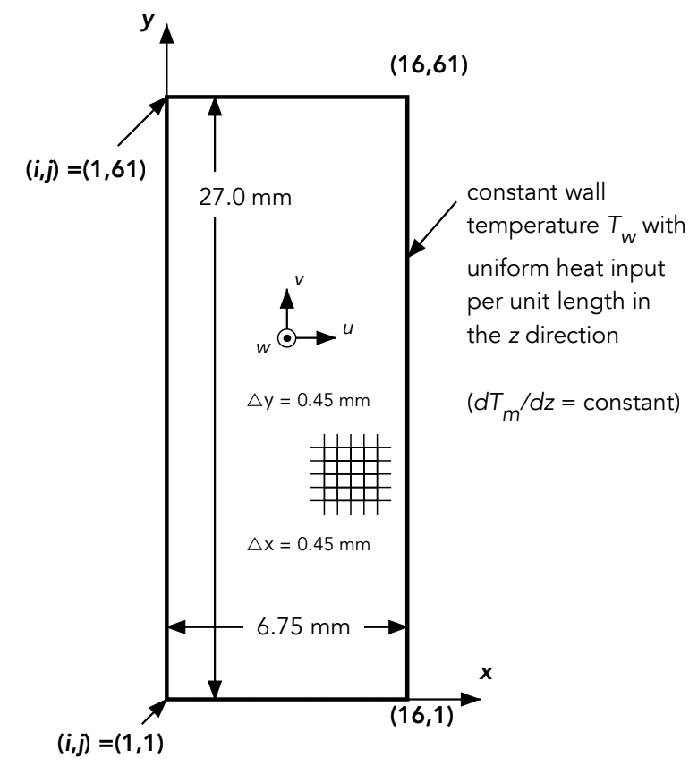
*Figure 1: Constant Wall Temperature $T\_w$ with Uniform Heat Input*

As a first step, consider flow in the rectangular passage shown above. The governing equations for fully developed flow and heat transfer are:

$$
0=\frac{\mu}{\rho}\left[\frac{\partial^2 w}{\partial x^2}+\frac{\partial^2w}{\partial y^2}\right]-\frac{1}{\rho}\frac{\partial P}{\partial z}
$$

$$
w\frac{\partial T}{\partial z}=\alpha \left[\frac{\partial^2 T}{\partial x^2}+\frac{\partial^2T}{\partial y^2}\right]
$$

Note that $u$ and $v$ are zero and $z$ derivatives are zero, except for $\partial T/\partial z$, which is constant for constant heat addition at the walls per unit length. The continuity equation is satisfied for these conditions since all terms are zero. Recall that for fully developed heat transfer with uniform heat addition at the walls,

$$
\frac{\partial T}{\partial z}=\frac{dT\_m}{dz}
$$

Also, the $u$ and $v$ momentum equations reduce to the pressure gradient in each direction equaling zero, which means the pressure is uniform across any cross section of the tube and $\partial P/\partial z$ in the flow is equal to the imposed pressure gradient $dP/dz$. The governing equations can therefore be written as

$$
\frac{\partial^2 w}{\partial x^2}+\frac{\partial^2w}{\partial y^2}=\frac{1}{\rho \nu}\frac{dP}{dz}
$$

$$
\frac{\partial^2 T}{\partial x^2}+\frac{\partial^2T}{\partial y^2}=\frac{w}{\alpha}\frac{dT\_m}{dz}
$$

These are both variations of the Poisson equation, and in this project, we will be adopting a numerical scheme that is flexible enough to use for a variety of non-circular geometries.

Using central differences for the second order derivatives, the above equations can be converted to the following finite-difference equations:

$$
\frac{w\_{i+1,j}-2w\_{i,j}+w\_{i-1,j}}{(\Delta x)^2}+\frac{w\_{i,j+1}-2w\_{i,j}+w\_{i,j-1}}{(\Delta y)^2}=\frac{1}{\rho \nu}\left(\frac{dP}{dz}\right)
$$

$$
\frac{T\_{i+1,j}-2T\_{i,j}+T\_{i-1,j}}{(\Delta x)^2}+\frac{T\_{i,j+1}-2T\_{i,j}+T\_{i,j-1}}{(\Delta y)^2}=\frac{w\_{i,j}}{\alpha}\left(\frac{dT\_m}{dz}\right)
$$

Solving the above equations for $w\_{i,j}$ and $T\_{i,j}$, respectively, yields:

$$
w\_{i,j}=\frac{(\Delta y/\Delta x)^2(w\_{i+1,j}+w\_{i-1,j})+w\_{i,j+1}+w\_{i,j-1}}{2(\Delta y/\Delta x)^2+2}-\frac{(dP/dz)(\Delta y)^2}{\rho \nu [2(\Delta y/\Delta x)^2+2]}
$$

$$
T\_{i,j}=\frac{(\Delta y/\Delta x)^2(T\_{i+1,j}+T\_{i-1,j})+T\_{i,j+1}+T\_{i,j-1}}{2(\Delta y/\Delta x)^2+2}-\frac{w\_{i,j}(dT\_m/dz)(\Delta y)^2}{\alpha  [2(\Delta y/\Delta x)^2+2]}
$$

The **Gauss-Seidel method** is used in this project assignment. In this solution scheme, the computation iteratively sweeps through the array from lower $i$ and $j$ to higher values (bottom to top), computing improved values of $w$ or $T$ at each node $(i,j)$. Values of $w$ or $T$ from adjacent nodes are used to evaluate the right side of the above relations. A single array is used to store the $w$ or $T$ values. Note that in sweeping from top to bottom, the terms on the right side with $i-1$ or $j-1$ indices will already have been updated for the current iteration. We designate values updated in the current iteration as primed variables. With this designation the relations are written as:

$$
w\_{i,j}'=\frac{(\Delta y/\Delta x)^2(w\_{i+1, j}+w\_{i-1,j}')+w\_{i, j+1}+w\_{i,j-1}'}{2(\Delta y/\Delta x)^2+2}-\frac{(dP/dz)(\Delta y)^2}{\rho \nu[2(\Delta y/\Delta x)^2+2]}
$$

$$
T\_{i,j}'=\frac{(\Delta y/\Delta x)^2(T\_{i+1, j}+T\_{i-1,j}')+T\_{i, j+1}+T\_{i,j-1}'}{2(\Delta y/\Delta x)^2+2}-\frac{w\_{i,j}(dT\_m/dz)(\Delta y)^2}{\alpha [2(\Delta y/\Delta x)^2+2]}
$$

The use of information from the new iteration values in computation of new values makes the method somewhat implicit. The other geometries that were considered in this study include a 2:1 aspect ratio passage shown below in Figure 2.

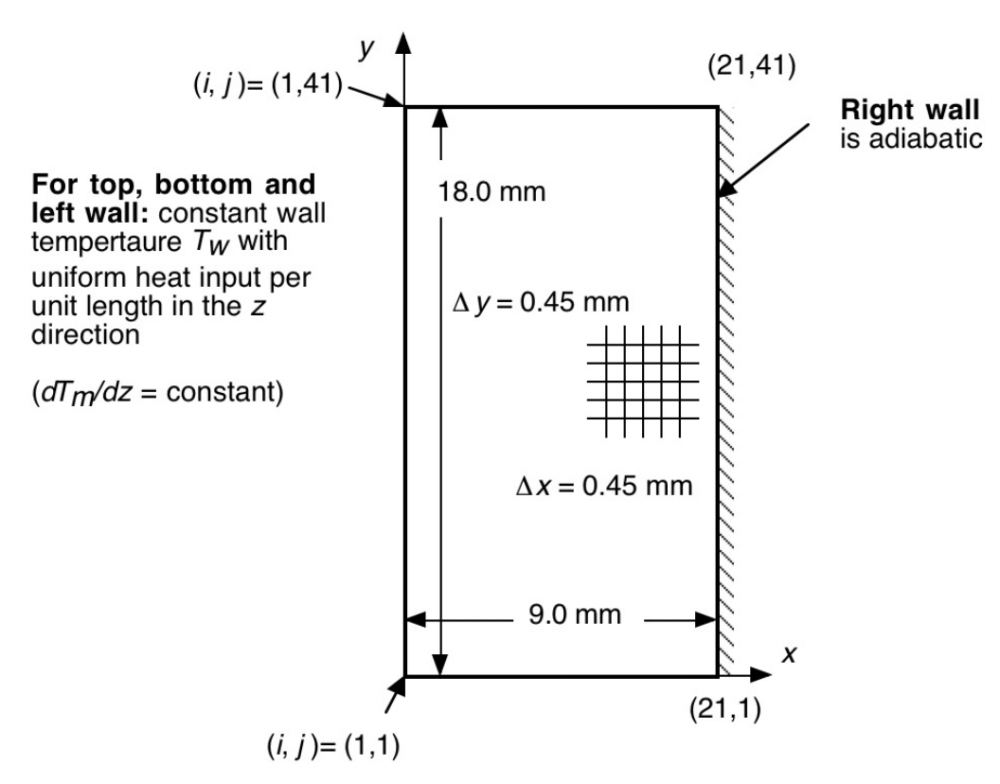
*Figure 2: Constant Wall Temperature $T\_w$ with Uniform Heat Input and Adiabatic Right Wall*

We finally consider a complex cross section where we analyze the fully developed flow and heat transfer for the passage in Figure 3 below.

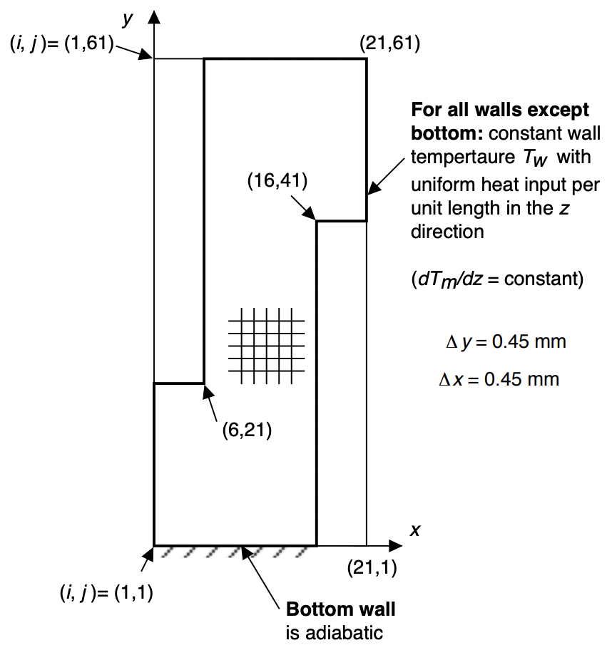
*Figure 3: Constant Wall Temperature $T\_w$ with Uniform Heat Input and Adiabatic Bottom Wall*

### Work Division and Tasks

This project is split into 3 tasks as follows:

1. **Task I**: Theoretical Derivations of the finite-difference equations for both the velocity and temperature fields from the governing equations and implementation of the Gauss-Seidel method for a 4:1 aspect ratio rectangular passage. From this, we generate 3D surface plots of $w(x,y)$ and $T(x,y)$ as well as the variation of the heat transfer coefficient along the short and long walls as a function of $x$ and $y$. Additionally, we find the hydraulic diameter, the Nusselt number, the Reynolds number and do analysis on these properties. We also make modifications to $dx$ and $dy$, and perform a sensitivity study for a mixture of ethylene glycol and water.

2. **Task II**: We modified our Task I program to the 2:1 aspect ratio passage shown in Figure 2. Changes were made to the boundary conditions as we now had an adiabatic right wall. We plotted the 3D surface plots of $w(x,y)$ and $T(x,y)$. Additionally, we find the hydraulic diameter, the Nusselt number, and compared it to the tabulated Nusselt numbers. We then calculated the hydraulic diameter based on the heated perimeter $D\_H=4A\_0/p\_h$ for which we also computed the fully developed Nusselt number and compared it to the tabulated Nusselt numbers.

3. **Task III**: The last task was to modify Task I again with a complex geometry and an adiabatic bottom wall. The mean velocities and mean temperatures were found in all three sections as well as the fully developed heat transfer coefficient and Nusselt number. The Reynolds number and fully developed Nusselt number were also determined using this geometry but we used the flow conditions specified in Task I.

### Theoretical Background

We can derive the finite-difference equations (**Task I**) for both the velocity and temperature fields as follows.

#### Derivation of Velocity Field Equation

Starting off with the finite-difference form of velocity:

$$
\frac{w\_{i+1,j}-2w\_{i,j}+w\_{i-1,j}}{(\Delta x)^2}+\frac{w\_{i,j+1}-2w\_{i,j}+w\_{i,j-1}}{(\Delta y)^2}=\frac{1}{\rho \nu}\left(\frac{dP}{dz}\right)
$$

We can multiply both sides by $(\Delta y)^2$ and then distribute to yield:

$$
\frac{(\Delta y)^2}{(\Delta x)^2}(w\_{i+1,j}-2w\_{i,j}+w\_{i-1,j})+(w\_{i,j+1}-2w\_{i,j}+w\_{i,j-1})=\frac{(\Delta y)^2}{\rho \nu}\left(\frac{dP}{dz}\right)
$$

$$
\left(\frac{\Delta y}{\Delta x}\right)^2w\_{i+1,j}-2\left(\frac{\Delta y}{\Delta x}\right)^2w\_{i,j}+\left(\frac{\Delta y}{\Delta x}\right)^2w\_{i-1,j} +w\_{i,j+1}-2w\_{i,j}+w\_{i,j-1} =\frac{(\Delta y)^2}{\rho \nu}\left(\frac{dP}{dz}\right)
$$

$$
\left(\frac{\Delta y}{\Delta x}\right)^2w\_{i+1,j}+\left(\frac{\Delta y}{\Delta x}\right)^2w\_{i-1,j}+w\_{i,j+1}+w\_{i,j-1}-w\_{i,j}\left[2\left(\frac{\Delta y}{\Delta x}\right)^2+2\right]=\frac{(\Delta y)^2}{\rho \nu}\left(\frac{dP}{dz}\right)
$$

Rearranging for $w\_{i,j}$:

$$
w\_{i,j}\left[2\left(\frac{\Delta y}{\Delta x}\right)^2+2\right]=\left(\frac{\Delta y}{\Delta x}\right)^2w\_{i+1,j}+\left(\frac{\Delta y}{\Delta x}\right)^2w\_{i-1,j}+w\_{i,j+1}+w\_{i,j-1}-\frac{(\Delta y)^2}{\rho \nu}\left(\frac{dP}{dz}\right)
$$

This can be separated and cleaned up into the desired form:

$$
w\_{i,j}=\frac{(\Delta y/\Delta x)^2(w\_{i+1,j}+w\_{i-1,j})+w\_{i,j+1}+w\_{i,j-1}}{2(\Delta y/\Delta x)^2+2}-\frac{(dP/dz)(\Delta y)^2}{\rho \nu [2(\Delta y/\Delta x)^2+2]}
$$

#### Derivation of Temperature Field Equation

The finite-difference form of the temperature field can be proved in the same manner. Starting off with:

$$
\frac{T\_{i+1,j}-2T\_{i,j}+T\_{i-1,j}}{(\Delta x)^2}+\frac{T\_{i,j+1}-2T\_{i,j}+T\_{i,j-1}}{(\Delta y)^2}=\frac{w\_{i,j}}{\alpha}\left(\frac{dT\_m}{dz}\right)
$$

We can multiply both sides by $(\Delta y)^2$ and then distribute to yield:

$$
\frac{(\Delta y)^2}{(\Delta x)^2}(T\_{i+1,j}-2T\_{i,j}+T\_{i-1,j})+(T\_{i,j+1}-2T\_{i,j}+T\_{i,j-1})=\frac{w\_{i,j}(\Delta y)^2}{\alpha}\left(\frac{dT\_m}{dz}\right)
$$

$$
\left(\frac{\Delta y}{\Delta x}\right)^2T\_{i+1,j}+\left(\frac{\Delta y}{\Delta x}\right)^2T\_{i-1,j}+T\_{i,j+1}+T\_{i,j-1}-T\_{i,j}\left[2\left(\frac{\Delta y}{\Delta x}\right)^2+2\right]=\frac{w\_{i,j}(\Delta y)^2}{\alpha}\left(\frac{dT\_m}{dz}\right)
$$

Rearranging for $T\_{i,j}$:

$$
T\_{i,j}=\frac{(\Delta y/\Delta x)^2(T\_{i+1,j}+T\_{i-1,j})+T\_{i,j+1}+T\_{i,j-1}}{2(\Delta y/\Delta x)^2+2}-\frac{w\_{i,j}(dT\_m/dz)(\Delta y)^2}{\alpha  [2(\Delta y/\Delta x)^2+2]}
$$

---

## Implementation and Development of Code

The following section will be a summary of our analysis organization including a description of our code organization for each task as well as different cases within each task that were considered. Snippets of code will be included where relevant.

### Task I

Firstly, our code organization and analysis is modular in design—we structured it into clear segments: parameter definitions, field initialization, iteration loops until convergence, post-processing, and finally visualization of results. This was particularly helpful for debugging and for running different cases.

The purpose of the initialization section was that it helped set up our simulation by defining all the necessary geometric and material parameters so we could keep track of all of them. Additionally, we kept the convergence criteria in case we needed to adjust them in the future. We define the grid resolution i.e. the number of nodes in the $x$ and $y$ directions and the element sizes $dx$ and $dy$. The material constants include the pressure gradient $dP/dz$, the mean temperature gradient $dT\_m/dz$, and the wall temperature from the constant heat input $T\_w$, as well as fluid and thermal properties.

```matlab
%% Define Material Constants and Geometric Parameters

% Geometric Parameters
Nx = 16;  % Number of x nodes
Ny = 61;  % Number of y nodes
dx = 0.45e-3;  % x element size
dy = 0.45e-3;  % y element size

% Material Constants
dPdz = -17.0;    % Pressure grad
dTmdz = 7.0;     % Mean temperature grad
Tw = 90;         % Wall temperature
nu = 8.26e-7;    % Kinematic viscosity
rho = 997;       % Density
alpha = 1.46e-7; % Thermal diffusivity
cp = 4164;       % Specific heat
k = 0.608;       % Thermal conductivity

% Convergence criteria
epsilon_w = 0.0005;
epsilon_T = 0.05;
```

The next section focused on initializing and pre-allocating our variables for faster runtime. The velocity and temperature fields are initialized. We set the velocity fields to zero, while the temperature field is uniformly set at $70°C$ and then adjusted along the boundaries to match the wall temperature of $90°C$. Note that we defined $N\_x$ as the number of rows and $N\_y$ as the number of columns.

```matlab
%% Initializing Initial Fields

% Initialize velocity field
w = zeros(Nx, Ny);

% Initial temperature field
T = 70 * ones(Nx, Ny); 

% Set constant wall temperature boundary 
T([1, Nx], :) = Tw;
T(:, [1, Ny]) = Tw;
```

The main part of this code is the iterative Solvers, in our case, the Gauss-Seidel Method. We use two while loops to update the velocity and temperature fields until they converge within the specified tolerance levels, at which point we set a flag to false and exit the loop.

**Velocity Field Update:**

For the velocity field, we loop over the interior nodes. The new velocity value is found based on the derived equation. The loop continues until the maximum change across all nodes falls below $\epsilon\_w$, the convergence criteria.

```matlab
converged_w_flag = false;

% Iterative loop to check w convergence
while ~converged_w_flag
    max_change_w = 0;
    
    % Sweep the velocity field
    for i = 2:Nx-1
        for j = 2:Ny-1
            w_new = ((dy/dx)^2 * (w(i+1,j) + w(i-1,j)) + w(i,j+1) + w(i,j-1)) / ...
                    (2*(dy/dx)^2 + 2) - (dPdz * dy^2) / (rho * nu * (2*(dy/dx)^2 + 2));
            max_change_w = max(max_change_w, abs(w_new - w(i,j)));
            w(i,j) = w_new;
        end
    end
    
    % Check convergence criteria for w
    if max_change_w < epsilon_w
        converged_w_flag = true;
    end
end
```

**Temperature Field Update:**

Similar to the velocity update, the temperature field is iteratively updated using the same method.

```matlab
converged_T_flag = false;

% Iterative loop to check T convergence
while ~converged_T_flag
    max_change_T = 0;

    % Sweep the temperature field
    for i = 2:Nx-1
        for j = 2:Ny-1
            T_new = ((dy/dx)^2 * (T(i+1,j) + T(i-1,j)) + T(i,j+1) + T(i,j-1)) / ...
                    (2*(dy/dx)^2 + 2) - (w(i,j) * dTmdz * dy^2) / (alpha * (2*(dy/dx)^2 + 2));
            max_change_T = max(max_change_T, abs(T_new - T(i,j)));
            T(i,j) = T_new;
        end
    end

    % Check convergence criteria for T
    if max_change_T < epsilon_T
        converged_T_flag = true;
    end
end
```

The next section is related to post-processing and analysis of the data. Once Gauss-Seidel converges, we compute the mean velocity, mean temperature, local heat fluxes, and heat transfer coefficients. Additionally, we also calculate the fully developed Nusselt and Reynolds numbers. For the numerical integration, we calculate the area with each grid node. Boundary nodes are treated with half the area to account for their partial representation in the full domain. The mean quantities are then computed as follows:

$$
w\_m=\frac{1}{A\_0}\int wdA\_0=\frac{1}{A\_0}\sum\_{\text{all nodes}}wA\_{\text{node}}
$$

$$
T\_m=\frac{1}{w\_mA\_0}\int wTdA\_0=\frac{1}{wA\_0}\sum\_{\text{all nodes}}wTA\_{\text{node}}
$$

where at the wall, $A\_{\text{node}}=\frac{1}{2}\Delta x\Delta y$. Otherwise $A\_{\text{node}}=\Delta x\Delta y$. As for the local heat flux and heat transfer coefficients, the heat flux $q\_w$ is calculated using Fourier's Law and the heat transfer coefficient $h$ is computed from the local heat flux and the difference between the wall temperature and the mean temperature by Newton's Law of Cooling.

The dimensionless numbers were then calculated. The hydraulic diameter was calculated as:

$$
D\_h=\frac{2ab}{a+b}
$$

and the Nusselt and Reynolds number were calculated simply by plugging in values determined by the code:

$$
Nu=\frac{\bar{h}D\_h}{k}\text{ and }Re=\frac{w\_mD\_h}{\nu}
$$

### Task II

Task II is effectively the exact same code organization as Task I, however the number of elements changed and we have introduced a new boundary condition, namely an adiabatic one. After each temperature iteration, the wall temperature at each node of the right wall is set equal to the new value of temperature at the node immediately to the left of the wall node, enforcing no temperature gradient and thus zero heat flux.

```matlab
% Iterative loop to check T convergence
while ~converged_T_flag
    max_change_T = 0;

    % Sweep the temperature field
    for i = 2:Nx-1
        for j = 2:Ny-1
            T_new = ((dy/dx)^2 * (T(i+1,j) + T(i-1,j)) + T(i,j+1) + T(i,j-1)) / ...
                    (2*(dy/dx)^2 + 2) - (w(i,j) * dTmdz * dy^2) / (alpha * (2*(dy/dx)^2 + 2));
            max_change_T = max(max_change_T, abs(T_new - T(i,j)));
            T(i,j) = T_new;
            T(Nx,:) = T(Nx-1, :);  % Enforce adiabatic right wall
        end
    end

    % Check convergence criteria for T
    if max_change_T < epsilon_T
        converged_T_flag = true;
    end
end
```

We also have a new portion of code that corresponds to the hydraulic diameter based on the heated perimeter instead of the wet perimeter. From this, we also compute the fully developed Nusselt number based on this diameter.

```matlab
% Calculate and display hydraulic diameter, Nusselt, and Reynolds Numbers
Dh = 4 * (A0) / (2*(Nx*dy+Ny*dx));
Nusselt = h_mean * Dh / k;
Dh_heated = 4 * (A0) / (2*(Nx*dy+.5*Ny*dx));
Nusselt_heated = h_mean * Dh_heated / k;

fprintf('Hydraulic Diameter (Dh) (wet): %.4f m\n', Dh);
fprintf('Nusselt Number (Nu) (wet): %.4f\n', Nusselt);
fprintf('Hydraulic Diameter (Dh) (heated): %.4f m\n', Dh_heated);
fprintf('Nusselt Number (Nu) (heated): %.4f\n', Nusselt_heated);
```

### Task III

Again, effectively the same code as Task I, however there are three major differences. We break the sweeping loops into three separate for loops so that we are able to change the $x$ extent of the looping for each. We have $i$ varying from 2 to 15 in the low section, 7 to 15 in the middle section, and 7 to 20 in the top section. The first major difference is the iterative scheme. We are doing region-based sweeps where the domain is separated three regions—lower, middle, and upper—each with its own looping indices. This allows different parts of the domain to be solved in sequence due to the complex geometry.

---

## Results and Discussion

### Task I Results and Discussion

In Task I, we were asked to generate 3D surface plots of the $w$ and $T$ fields, and 2D plots as necessary to analyze the results.

<div style="display: grid; grid-template-columns: repeat(2, 1fr); gap: 16px; margin: 24px 0;">
  <figure style="text-align: center; margin: 0;">
    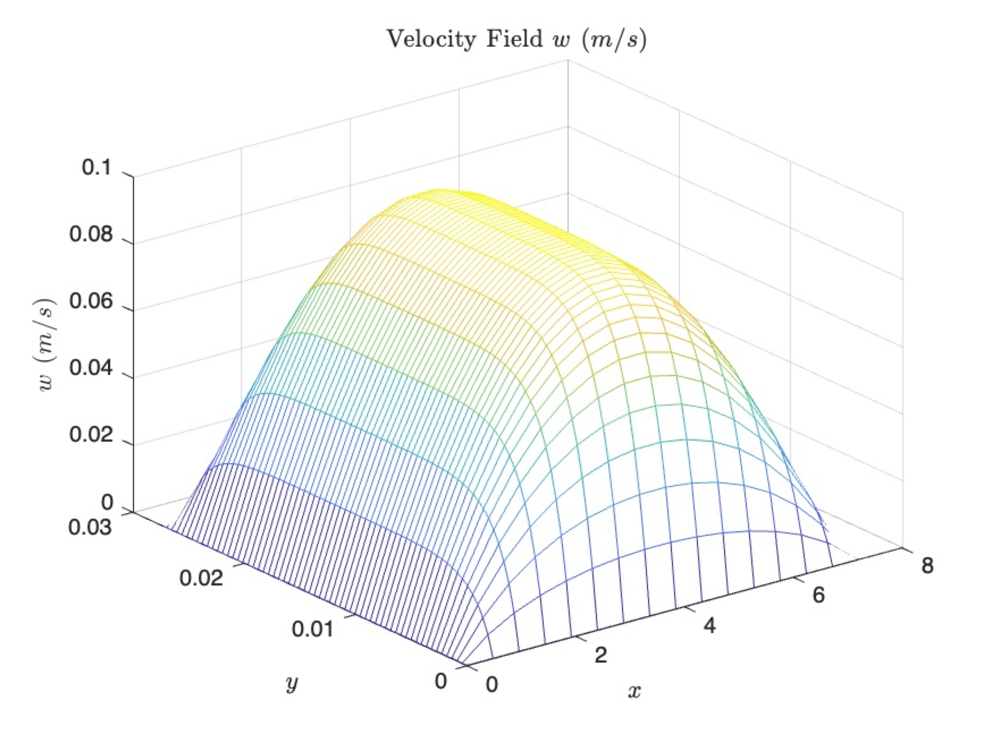
    <figcaption><strong>Figure 4:</strong> w(x,y) Field Surface Plot Task I</figcaption>
  </figure>
  <figure style="text-align: center; margin: 0;">
    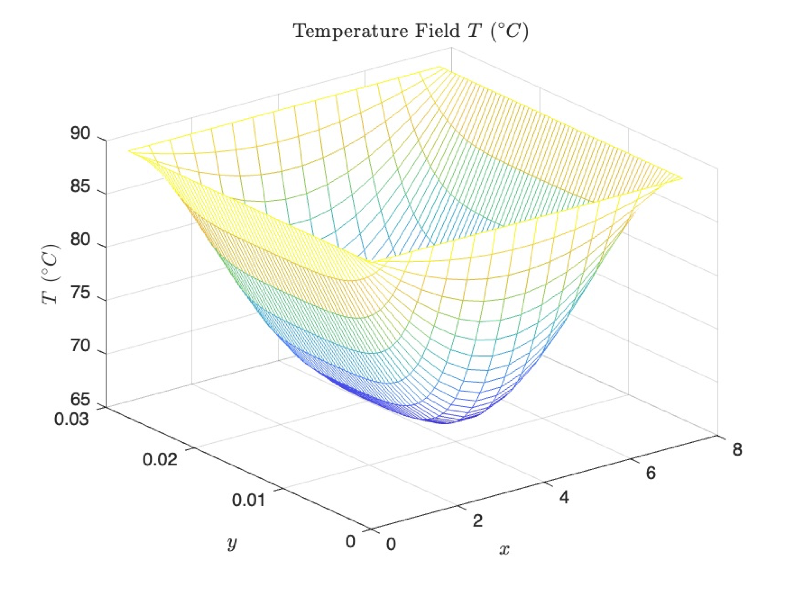
    <figcaption><strong>Figure 5:</strong> T(x,y) Field Surface Plot Task I</figcaption>
  </figure>
</div>

We also determined that the highest heat transfer coefficient was found at the center of the long walls, which also correspond to the point at which the velocity vector is the greatest. This heat transfer coefficient is $422.175 \, W/m^2 \cdot °C$ and is shown graphically in Figure 7. The lowest heat transfer coefficient is found next to the corners of the channels, where the velocity of the fluid is the lowest due to the frictional no slip boundary condition. This results in a minimum heat transfer coefficient $51.421 \, W/m^2 \cdot °C$ which can be seen in both Figures 6 and 7. The hydraulic diameter was computed to be:

$$
D\_h=\frac{4A\_0}{p\_w}=11.4 \, \mathrm{mm}
$$

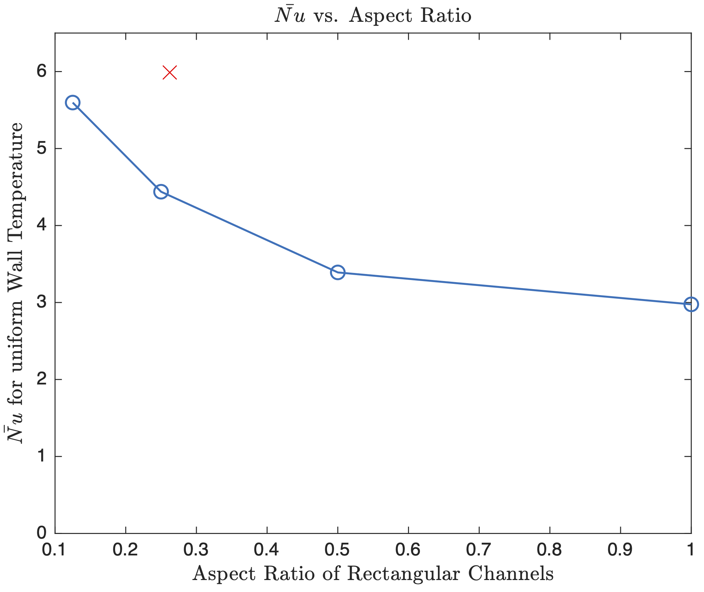
*Figure 8: Calculated Nusselt Number for Task I vs. Tabulated Nusselt Numbers*

Comparing this to the table for comparable aspect ratios, the fully-developed Nusselt number calculated is slightly higher than that of the table. The discrepancy is most likely due to low grid resolution and the fluid properties used in the tables.

<div style="display: grid; grid-template-columns: repeat(2, 1fr); gap: 16px; margin: 24px 0;">
  <figure style="text-align: center; margin: 0;">
    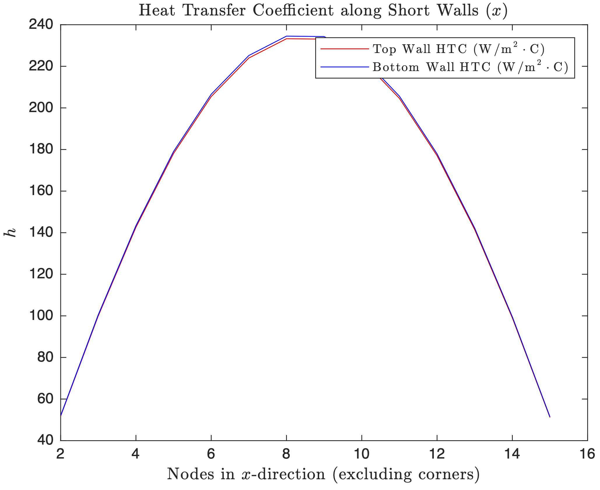
    <figcaption><strong>Figure 6:</strong> Variation of h for Short Walls Task I</figcaption>
  </figure>
  <figure style="text-align: center; margin: 0;">
    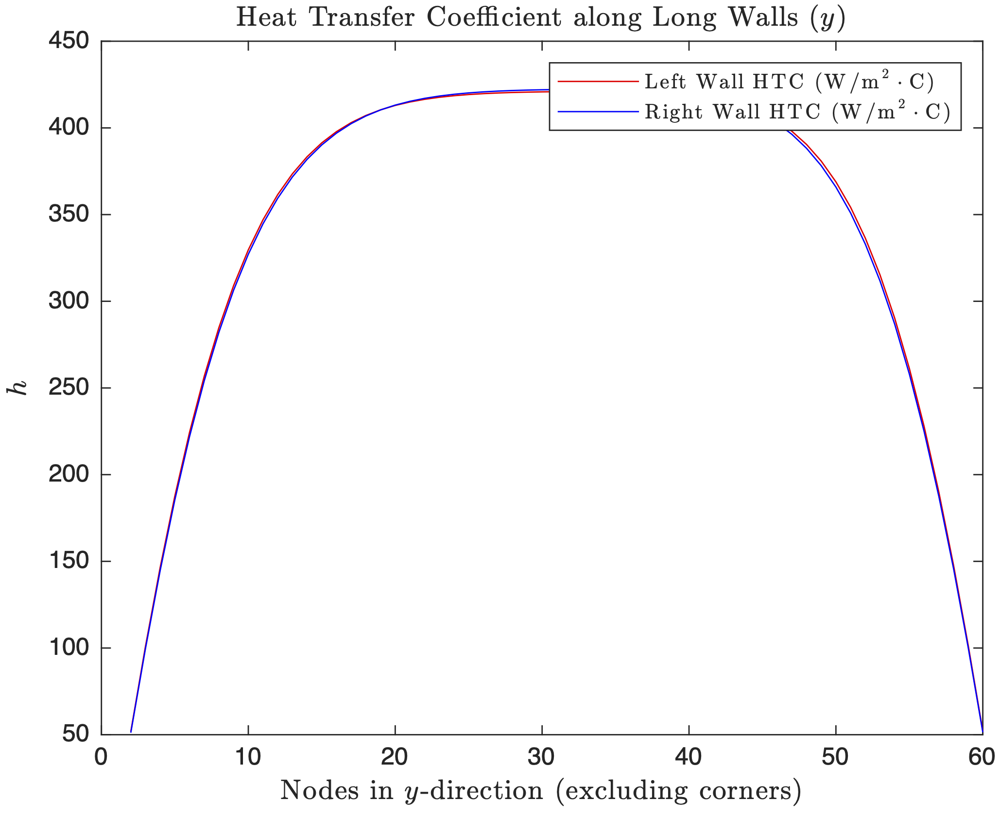
    <figcaption><strong>Figure 7:</strong> Variation of h for Long Walls Task I</figcaption>
  </figure>
</div>

Based on the mean velocity across the channel, the Reynolds number is found to be $\mathrm{Re}=706.83$, indicating fully developed laminar flow. With the smaller cooling channels, the Nusselt number increases significantly, reaching a value of $\mathrm{Nu}=20.11$ compared to $\mathrm{Nu}=5.99$ for a channel with dimensions three times larger. This increase is due to the higher surface area-to-volume ratio per fluid parcel associated with smaller channels. The mean heat transfer coefficient in the reduced passage is $3216 \, W/m^2 \cdot °C$. The maximum $w$ velocity of the reduced passage is $0.0125 \, m/s$.

Despite the hydraulic diameter decreasing from 11.4 mm to 3.8 mm, the mean heat transfer coefficient rises notably. When solving for the heat transfer coefficient, $h$, from Newton's Law of Cooling, the temperature difference between the wall and the mean temperature of the fluid is relatively small, and the wetted area is also reduced. Since both the temperature difference and wetted area appear in the denominator of the expression for $h$, this leads to a substantial increase in the heat transfer coefficient, ultimately resulting in a Nusselt number approximately four times that of the larger channel.

For the ethylene glycol and water mixture, the new values of the mean heat transfer coefficient and Nusselt number are $h=213.12 \, W/m^2 \cdot °C$ and $\mathrm{Nu}= 5.97$, respectively. The Nusselt number does not change significantly with variations in fluid properties, as it depends more on the geometry of the channel. However, the heat transfer coefficient is most influenced by the fluid's thermal conductivity, $k$, since $h$ is directly related to the wall heat flux, which is a function of $k$, as described by Fourier's Law.

### Task II Results and Discussion

<div style="display: grid; grid-template-columns: repeat(2, 1fr); gap: 16px; margin: 24px 0;">
  <figure style="text-align: center; margin: 0;">
    
    <figcaption><strong>Figure 9:</strong> w(x,y) Field Surface Plot Task II</figcaption>
  </figure>
  <figure style="text-align: center; margin: 0;">
    
    <figcaption><strong>Figure 10:</strong> T(x,y) Field Surface Plot Task II</figcaption>
  </figure>
</div>

For Task II, the 3D surface plots of the $w$ and $T$ fields are shown above in Figures 9 and 10 respectively. The wetted hydraulic diameter of the new geometry is 12.5 mm for the 21 by 41 node channel. A new boundary condition was introduced by making the rightmost wall adiabatic. This was achieved by setting the wall temperature at each node on the right wall equal to the temperature of the node immediately to its left. With no temperature difference between adjacent nodes, no heat flux occurs, thus creating an adiabatic wall.

In this new channel, the fully developed average heat transfer coefficient is $162.23 \, W/m^2 \cdot °C$. When calculating the Nusselt number, both heated and wetted values were determined. The wetted Nusselt number is calculated using the wetted hydraulic diameter, multiplying it by the average heat transfer coefficient, and dividing by the thermal conductivity, following the same method as before. In contrast, the heated Nusselt number requires calculating the heated hydraulic diameter, which excludes adiabatic walls when determining the perimeter. The result is a heated Nusselt number of $\mathrm{Nu}\_h=4.98$, while the wetted Nusselt number is $\mathrm{Nu}\_w=3.33$. The heated hydraulic diameter is 18.7 mm. Comparing the wetted Nusselt number to a square cross section with uniform wall temperature, we see that our Nusselt number of $3.33>2.976$. The error in the terms lies in the fact that we do not have uniform wall temperature and we are also not using a square cross section.

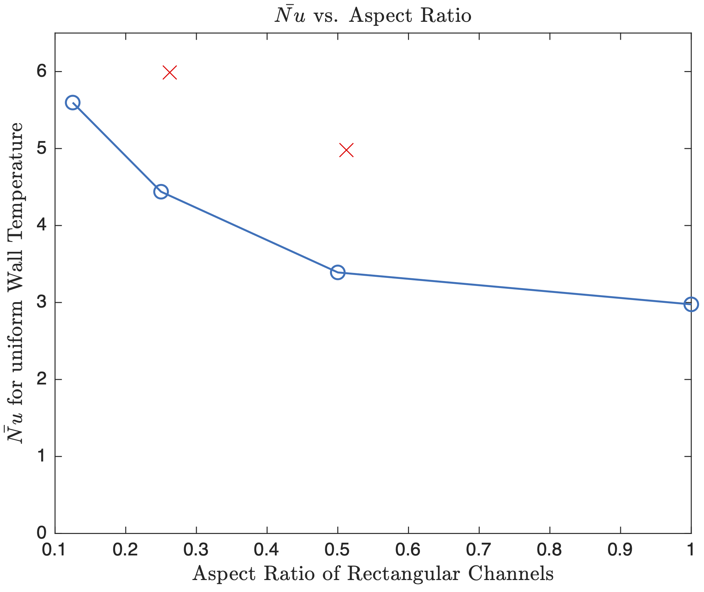
*Figure 11: Calculated Nusselt Number for Task II/I vs. Tabulated Nusselt Numbers*

<div style="display: grid; grid-template-columns: repeat(2, 1fr); gap: 16px; margin: 24px 0;">
  <figure style="text-align: center; margin: 0;">
    
    <figcaption><strong>Figure 12:</strong> Variation of h for Short Walls Task II</figcaption>
  </figure>
  <figure style="text-align: center; margin: 0;">
    
    <figcaption><strong>Figure 13:</strong> Variation of h for Long Walls Task II</figcaption>
  </figure>
</div>

Notice how on the right wall, the heat transfer coefficient is 0 due to the enforcement of the adiabatic boundary condition. Along the short walls, the heat transfer coefficient is roughly the same for both top and bottom but they diverge as the nodes in the $x$-direction increase. We also see a standard parabolic shaped variation in heat transfer for the long walls which would match our intuition.

### Task III Results and Discussion

For Task III, we are given a complex geometry and the 3D surface plots reflect that complexity as seen in Figures 14 and 15.

<div style="display: grid; grid-template-columns: repeat(2, 1fr); gap: 16px; margin: 24px 0;">
  <figure style="text-align: center; margin: 0;">
    
    <figcaption><strong>Figure 14:</strong> w(x,y) Field Surface Plot Task III</figcaption>
  </figure>
  <figure style="text-align: center; margin: 0;">
    
    <figcaption><strong>Figure 15:</strong> T(x,y) Field Surface Plot Task III</figcaption>
  </figure>
</div>

The fully developed heat transfer coefficient is $313.5290 \, W/m^2 \cdot °C$ and the Nusselt number is $\mathrm{Nu}=8.9067$. The Reynolds number for the flow conditions specified in Task I is $\mathrm{Re}=811.03$. The above plots are consistent with our expectations and intuition for flow in the complex channel geometry, where local changes in cross-sectional area and the presence of an adiabatic bottom wall influence the momentum and thermal fields.

| Case | Mean Velocity (m/s) | Mean Temperature (°C) |
|:-----|:--------------------|:----------------------|
| Lower | 0.0345 | 81.94 |
| Middle | 0.0470 | 81.84 |
| Top | 0.0349 | 82.01 |

*Table 1: Flow and Thermal Characteristics Task III*

| Overall Characteristics | Value |
|:------------------------|:------|
| Hydraulic Diameter (Dh) | 0.0173 m |
| Nusselt Number (Nu) | 8.9067 |
| Reynolds Number (Re) | 811.0329 |

Additionally, we include all the local heat transfer coefficients for each wall of the complex channel geometry as described in Figure 16.

<div style="display: grid; grid-template-columns: repeat(2, 1fr); gap: 16px; margin: 24px 0;">
  <figure style="text-align: center; margin: 0;">
    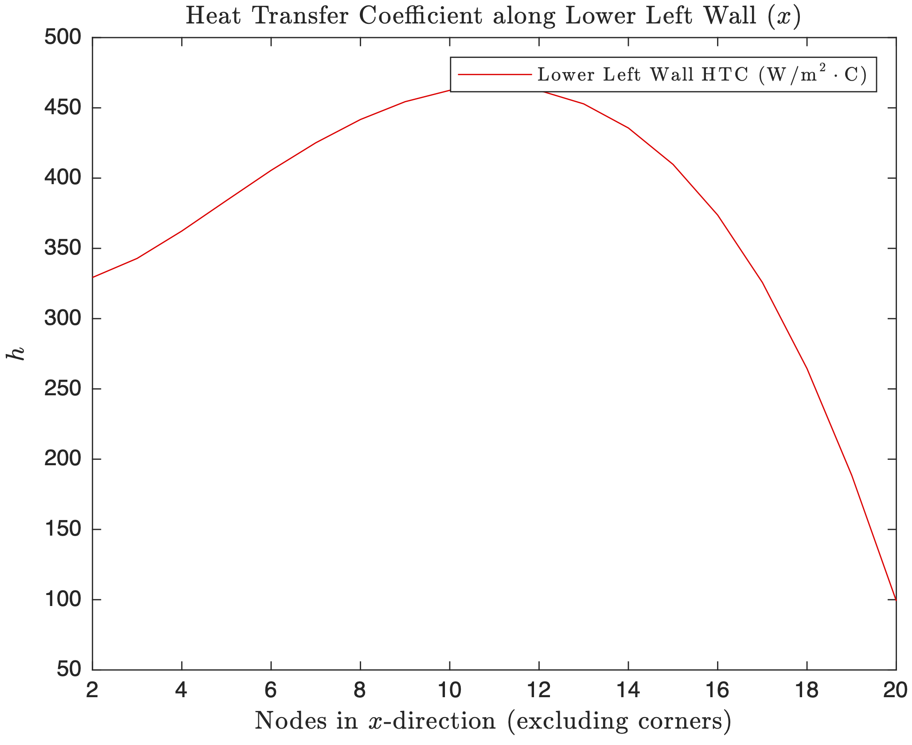
  </figure>
  <figure style="text-align: center; margin: 0;">
    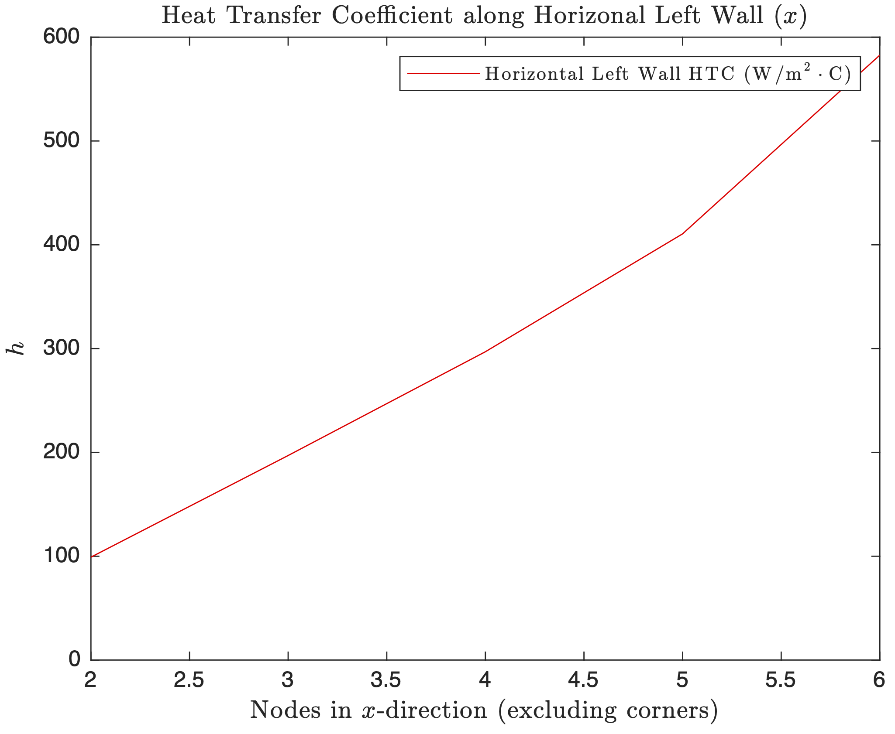
  </figure>
  <figure style="text-align: center; margin: 0;">
    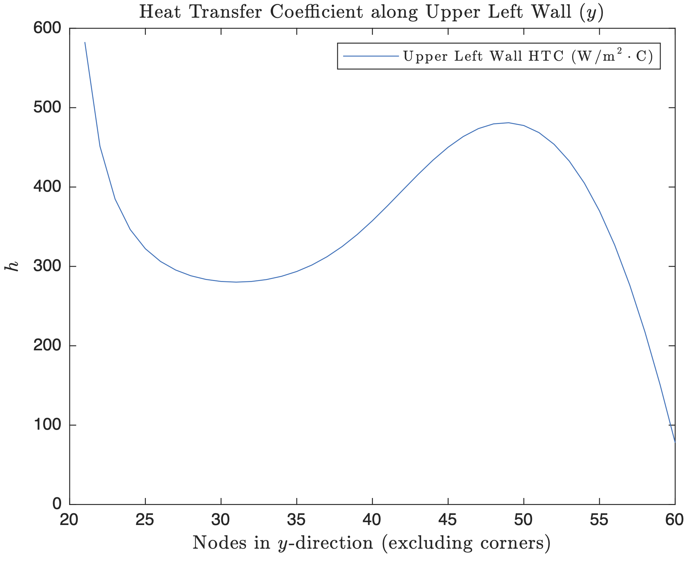
  </figure>
  <figure style="text-align: center; margin: 0;">
    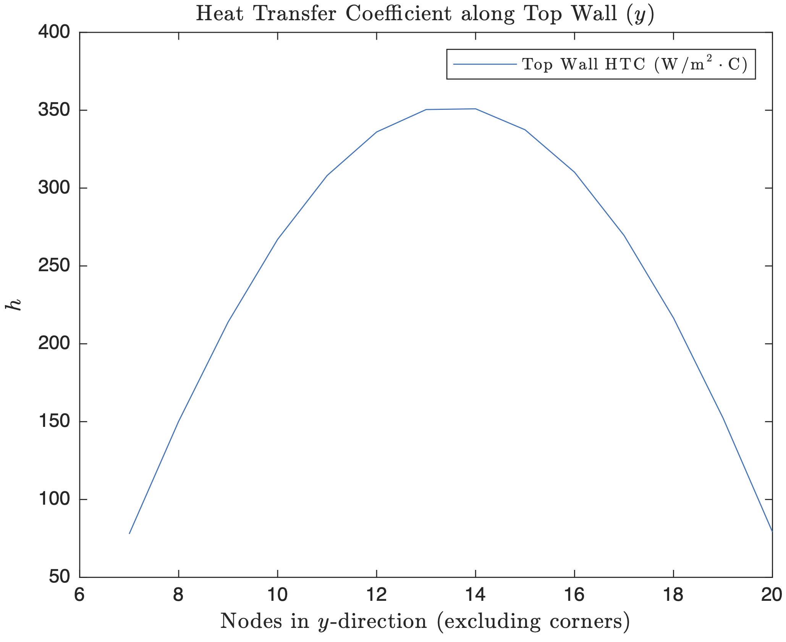
  </figure>
  <figure style="text-align: center; margin: 0;">
    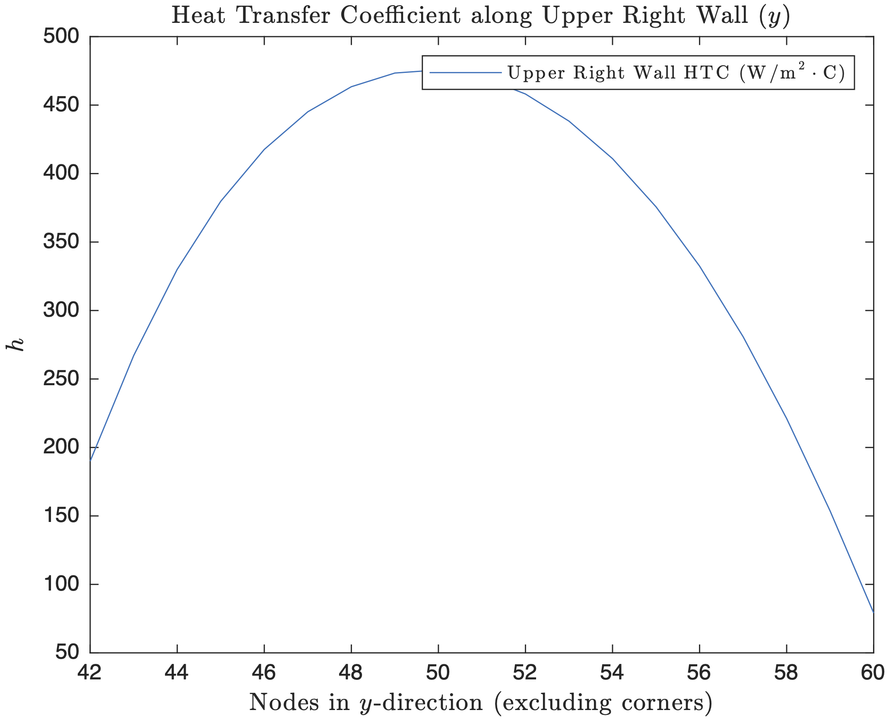
  </figure>
  <figure style="text-align: center; margin: 0;">
    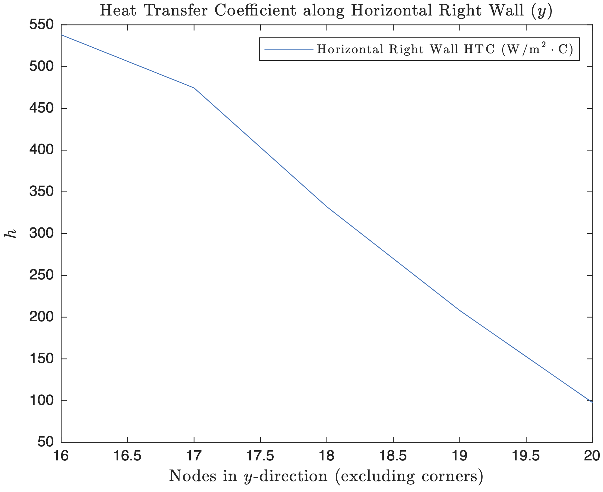
  </figure>
  <figure style="text-align: center; margin: 0;">
    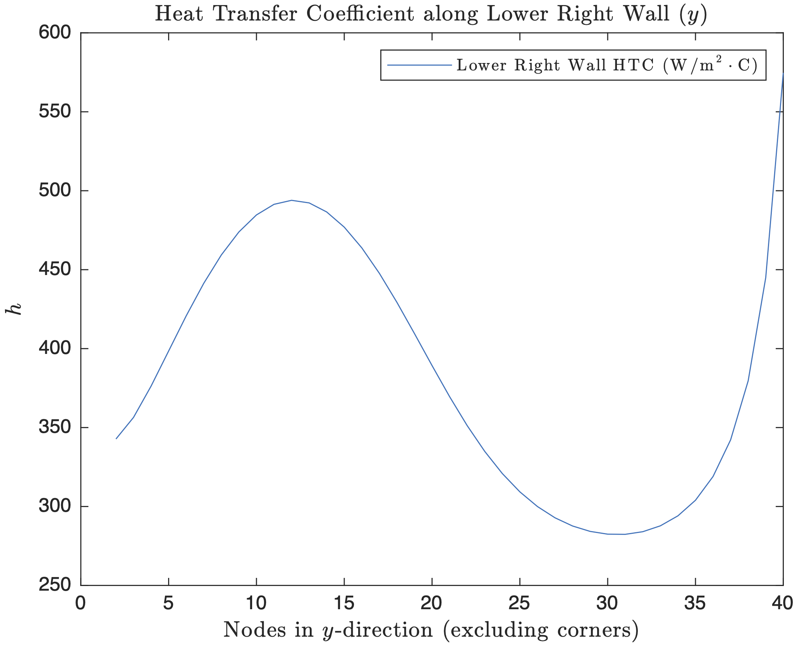
  </figure>
  <figure style="text-align: center; margin: 0;">
    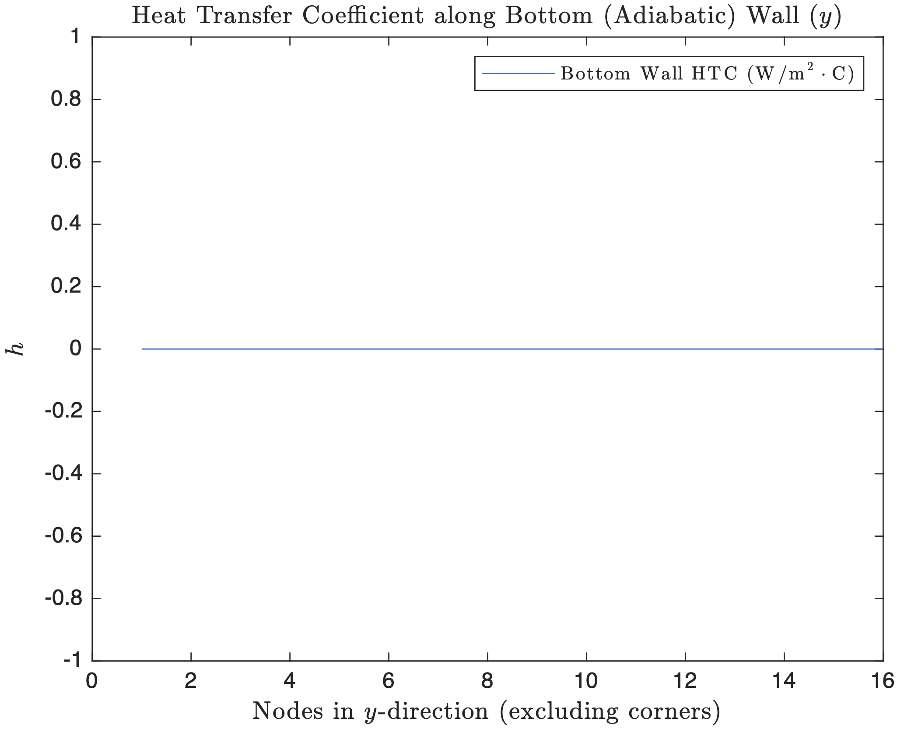
  </figure>
</div>

*Figure 16: Variation of Local h for All Walls in Task III*

---

## Conclusion

This work presented a robust numerical framework for analyzing convective heat transfer in two-dimensional domains. The application of a finite-difference method combined with a Gauss–Seidel iterative scheme successfully resolved the coupled velocity and temperature fields under both fixed temperature and adiabatic boundary conditions.

The simulation results confirmed that the iterative approach is both stable and efficient, as the convergence criteria were met for both fields. The smooth gradients observed in the velocity field and the steady profiles in the temperature field reflect the physical expectations for a laminar convective flow. Moreover, the use of Fourier's Law and Newton's Law of Cooling in the post-processing phase enabled the accurate calculation of local heat fluxes and heat transfer coefficients. These local measurements, alongside the derived values for the hydraulic diameter, Nusselt number, and Reynolds number, provided a comprehensive understanding of the convective process within the system.

The analysis between a standard rectangular domain and a segmented configuration revealed that even small tweaks in geometry can lead to noticeable differences in the distribution of thermal and velocity fields. This insight is particularly useful for the design and optimization of heat exchanger systems with cooling channels, where geometric modifications may be employed to enhance performance.

---

## Code Appendix

This appendix includes all the code relevant for **Task I**, **Task II**, **Task III**. The code is also commented to ease understanding and to display our thought process while writing.

<details>
<summary><strong>Task I Code (Click to Expand)</strong></summary>

```matlab
clear; clc; close all

%% Define Material Constants and Geometric Parameters

% Geometric Parameters
Nx = 16;  % Number of x nodes
Ny = 61;  % Number of y nodes
dx = 0.45e-3;  % x element size
dy = 0.45e-3;  % y element size

% Material Constants
dPdz = -17.0;    % Pressure grad
dTmdz = 7.0;     % Mean temperature grad
Tw = 90;         % Wall temperature
nu = 8.26e-7;    % Kinematic viscosity
rho = 997;       % Density
alpha = 1.46e-7; % Thermal diffusivity
cp = 4164;       % Specific heat
k = 0.608;       % Thermal conductivity

% Convergence criteria
epsilon_w = 0.0005;
epsilon_T = 0.05;

%% Initializing Initial Fields

% Initialize velocity field
w = zeros(Nx, Ny);

% Initial temperature field
T = 70 * ones(Nx, Ny); 

% Set constant wall temperature boundary 
T([1, Nx], :) = Tw;
T(:, [1, Ny]) = Tw;

%% Gauss-Seidel iterations for fields
converged_w_flag = false;

% Iterative loop to check w convergence
while ~converged_w_flag
    max_change_w = 0;
    
    % Sweep the velocity field
    for i = 2:Nx-1
        for j = 2:Ny-1
            w_new = ((dy/dx)^2 * (w(i+1,j) + w(i-1,j)) + w(i,j+1) + w(i,j-1)) / ...
                    (2*(dy/dx)^2 + 2) - (dPdz * dy^2) / (rho * nu * (2*(dy/dx)^2 + 2));
            max_change_w = max(max_change_w, abs(w_new - w(i,j)));
            w(i,j) = w_new;
        end
    end
    
    % Check convergence criteria for w
    if max_change_w < epsilon_w
        converged_w_flag = true;
    end
end

converged_T_flag = false;

% Iterative loop to check T convergence
while ~converged_T_flag
    max_change_T = 0;

    % Sweep the temperature field
    for i = 2:Nx-1
        for j = 2:Ny-1
            T_new = ((dy/dx)^2 * (T(i+1,j) + T(i-1,j)) + T(i,j+1) + T(i,j-1)) / ...
                    (2*(dy/dx)^2 + 2) - (w(i,j) * dTmdz * dy^2) / (alpha * (2*(dy/dx)^2 + 2));
            max_change_T = max(max_change_T, abs(T_new - T(i,j)));
            T(i,j) = T_new;
        end
    end

    % Check convergence criteria for T
    if max_change_T < epsilon_T
        converged_T_flag = true;
    end
end

%% Post-processing

% Numerical integration for mean temp and mean velocity
A = dx * dy * ones(Nx, Ny);
A([1, end],:) = 0.5 * dx * dy;
A(:,[1, end]) = 0.5 * dx * dy;

A0 = Nx * Ny * dx * dy;   

wm = sum(sum(w .* A)) / A0;
Tm = sum(sum(w .* T .* A)) / (wm * A0);

% Initialize Local heat flux and heat transfer coefficient
qw = zeros(Nx, Ny);
h = zeros(Nx, Ny);

% Fourier's Law
for i = 2:Nx-1
    qw(i,1) = k * (T(i,1) - T(i,2)) / dy;
    qw(i,Ny) = k * (T(i,Ny) - T(i,Ny-1)) / dy;
end

for j = 2:Ny-1
    qw(1,j) = k * (T(1,j) - T(2,j)) / dx;
    qw(Nx,j) = k * (T(Nx,j) - T(Nx-1,j)) / dx;
end

% Newton's Law of Cooling
for i = 2:Nx-1
    for j = [1 Ny]
        h(i,j) = qw(i,j) / (T(i,j) - Tm);
    end
end

for j = 2:Ny-1
    for i = [1 Nx]
        h(i,j) = qw(i,j) / (T(i,j) - Tm);
    end
end

% Total heat input rate and mean heat transfer coefficient
A_wall = 0.5 * dx * dy * ones(Nx,Ny);
Q_total = sum(qw(:) .* A_wall(:));
Aw = 0.5 * dx * dy * (Nx + Nx + Ny + Ny);
T_wall_avg = (sum(T(1,1:Ny)) + sum(T(Nx, 1:Ny)) + sum(T(1:Nx-1,1)) + sum(T(1:Nx-1,Ny))) / (2*(Nx+Ny));
h_mean = Q_total / (Aw * (T_wall_avg - Tm));

% Calculate dimensionless numbers
Dh = 4 * (A0) / (2*(Nx*dy+Ny*dx));
Nusselt = h_mean * Dh / k;
Reynolds = wm * Dh / nu;
fprintf('Hydraulic Diameter (Dh): %.4f m\n', Dh);
fprintf('Nusselt Number (Nu): %.4f\n', Nusselt);
fprintf('Reynolds Number (Re): %.4f\n', Reynolds);
```

</details>

<details>
<summary><strong>Task II Code (Click to Expand)</strong></summary>

```matlab
clear; clc; close all

%% Define Material Constants and Geometric Parameters

Nx = 21;  % Number of x nodes
Ny = 41;  % Number of y nodes
dx = 0.45e-3;
dy = 0.45e-3;

dPdz = -17.0;
dTmdz = 7.0;
Tw = 90;
nu = 8.26e-7;
rho = 997;
alpha = 1.46e-7;
cp = 4164;
k = 0.608;

epsilon_w = 0.0005;
epsilon_T = 0.05;

%% Initializing Initial Fields

w = zeros(Nx, Ny);
T = 70 * ones(Nx, Ny);  

T(1,:) = Tw;
T(Nx,:) = Tw;
T(:,1) = Tw;
T(:,Ny) = Tw;

%% Gauss-Seidel iterations for fields
converged_w_flag = false;

while ~converged_w_flag
    max_change_w = 0;

    for i = 2:Nx-1
        for j = 2:Ny-1
            w_new = ((dy/dx)^2 * (w(i+1,j) + w(i-1,j)) + w(i,j+1) + w(i,j-1)) / ...
                    (2*(dy/dx)^2 + 2) - (dPdz * dy^2) / (rho * nu * (2*(dy/dx)^2 + 2));
            max_change_w = max(max_change_w, abs(w_new - w(i,j)));
            w(i,j) = w_new;
        end
    end

    if max_change_w < epsilon_w
        converged_w_flag = true;
    end
end

converged_T_flag = false;

while ~converged_T_flag
    max_change_T = 0;
    for i = 2:Nx-1
        for j = 2:Ny-1
            T_new = ((dy/dx)^2 * (T(i+1,j) + T(i-1,j)) + T(i,j+1) + T(i,j-1)) / ...
                    (2*(dy/dx)^2 + 2) - (w(i,j) * dTmdz * dy^2) / (alpha * (2*(dy/dx)^2 + 2));
            max_change_T = max(max_change_T, abs(T_new - T(i,j)));
            T(i,j) = T_new;
            T(Nx,:) = T(Nx-1,:);  % Enforce adiabatic right wall
        end
    end

    if max_change_T < epsilon_T
        converged_T_flag = true;
    end
end

%% Post-processing and Dimensionless Numbers
A = dx * dy * ones(Nx, Ny);
A(1,:) = 0.5 * dx * dy;
A(end,:) = 0.5 * dx * dy;
A(:,1) = 0.5 * dx * dy;
A(:,end) = 0.5 * dx * dy;

A0 = Nx*Ny*dx*dy;      

wm = sum(sum(w .* A)) / A0;
Tm = sum(sum(w .* T .* A)) / (wm * A0);

% ... (heat flux and h calculations similar to Task I)

Dh = 4 * (A0) / (2*(Nx*dy+Ny*dx));
Nusselt = h_mean * Dh / k;
Dh_heated = 4 * (A0) / (2*(Nx*dy+.5*Ny*dx));
Nusselt_heated = h_mean * Dh_heated / k;

fprintf('Hydraulic Diameter (Dh) (wet): %.4f m\n', Dh);
fprintf('Nusselt Number (Nu) (wet): %.4f\n', Nusselt);
fprintf('Hydraulic Diameter (Dh) (heated): %.4f m\n', Dh_heated);
fprintf('Nusselt Number (Nu) (heated): %.4f\n', Nusselt_heated);
```

</details>

<details>
<summary><strong>Task III Code (Click to Expand)</strong></summary>

```matlab
clear; clc; close all

%% Define Material Constants and Geometric Parameters

Nx = 21;
Ny = 61;
dx = 0.45e-3;
dy = 0.45e-3;

dPdz = -17.0;
dTmdz = 7.0;
Tw = 90;
nu = 8.26e-7;
rho = 997;
alpha = 1.46e-7;
cp = 4164;
k = 0.608;

epsilon_w = 0.0005;
epsilon_T = 0.05;

%% Initializing Initial Fields

w = zeros(Nx, Ny);
T = 90 * ones(Nx, Ny); 

% Set wall boundary conditions for complex geometry
T(1, 1:21) = Tw;
T(1:6, 21) = Tw;
T(6, 21:61) = Tw;
T(6:21, 61) = Tw;       
T(21, 41:61) = Tw;
T(16:21, 41) = Tw;
T(16, 1:41) = Tw;

%% Gauss-Seidel iterations for fields
converged_w_flag = false;

while ~converged_w_flag
    max_change_w = 0;
    
    % Lower Section Sweep (i=2:15)
    for i = 2:15
        for j = 2:20
            w_new = ((dy/dx)^2*(w(i+1,j) + w(i-1,j)) + w(i,j+1) + w(i,j-1)) ...
                    / (2*(dy/dx)^2 + 2) - (dPdz * dy^2) / (rho * nu * (2*(dy/dx)^2 + 2));
            max_change_w = max(max_change_w, abs(w_new - w(i,j)));
            w(i,j) = w_new;
        end
    end

    % Middle Section Sweep (i=7:15)
    for i = 7:15
        for j = 21:40
            w_new = ((dy/dx)^2*(w(i+1,j) + w(i-1,j)) + w(i,j+1) + w(i,j-1)) ...
                    / (2*(dy/dx)^2 + 2) - (dPdz * dy^2) / (rho * nu * (2*(dy/dx)^2 + 2));
            max_change_w = max(max_change_w, abs(w_new - w(i,j)));
            w(i,j) = w_new;
        end
    end

    % Upper Section Sweep (i=7:20)
    for i = 7:20
        for j = 41:60
            w_new = ((dy/dx)^2*(w(i+1,j) + w(i-1,j)) + w(i,j+1) + w(i,j-1)) ...
                    / (2*(dy/dx)^2 + 2) - (dPdz * dy^2) / (rho * nu * (2*(dy/dx)^2 + 2));
            max_change_w = max(max_change_w, abs(w_new - w(i,j)));
            w(i,j) = w_new;
        end
    end
    
    if max_change_w < epsilon_w
        converged_w_flag = true;
    end
end

% Temperature iterations with region-based sweeping and adiabatic BC
% ... (similar structure with T updates)

%% Post-processing for each region
A = dx * dy * ones(Nx, Ny);
A([1, end],:) = 0.5 * dx * dy;
A(:,[1, end]) = 0.5 * dx * dy;

A0 = Nx * Ny * dx * dy;   

% Lower section mean values
wm_lower = sum(sum(w(2:15, :) .* A(2:15, :))) / sum(sum(A(2:15, :)));
Tm_lower = sum(sum(w(2:15, :) .* T(2:15, :) .* A(2:15, :))) / ...
           sum(sum(w(2:15, :) .* A(2:15, :)));

% Middle section mean values
wm_middle = sum(sum(w(7:15, :) .* A(7:15, :))) / sum(sum(A(7:15, :)));
Tm_middle = sum(sum(w(7:15, :) .* T(7:15, :) .* A(7:15, :))) / ...
            sum(sum(w(7:15, :) .* A(7:15, :)));

% Upper section mean values
wm_top = sum(sum(w(7:20, :) .* A(7:20, :))) / sum(sum(A(7:20, :)));
Tm_top = sum(sum(w(7:20, :) .* T(7:20, :) .* A(7:20, :))) / ...
         sum(sum(w(7:20, :) .* A(7:20, :)));

Tm = (Tm_lower + Tm_middle + Tm_top) / 3;
wm = (wm_lower + wm_middle + wm_top) / 3;

fprintf('Lower: wm = %.4f m/s, Tm = %.2f C\n', wm_lower, Tm_lower);
fprintf('Middle: wm = %.4f m/s, Tm = %.2f C\n', wm_middle, Tm_middle);
fprintf('Top: wm = %.4f m/s, Tm = %.2f C\n', wm_top, Tm_top);

% Dimensionless numbers
P_wet = 2*(Nx*dy) + (Ny*dx) + (0.5*Ny*dx);
Dh = 4 * (A0) / P_wet;
Nusselt = h_mean * Dh / k;
Reynolds = wm * Dh / nu;
fprintf('Hydraulic Diameter (Dh): %.4f m\n', Dh);
fprintf('Nusselt Number (Nu): %.4f\n', Nusselt);
fprintf('Reynolds Number (Re): %.4f\n', Reynolds);
```

</details>

