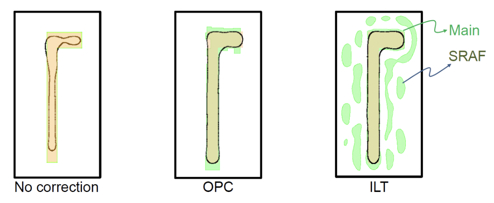
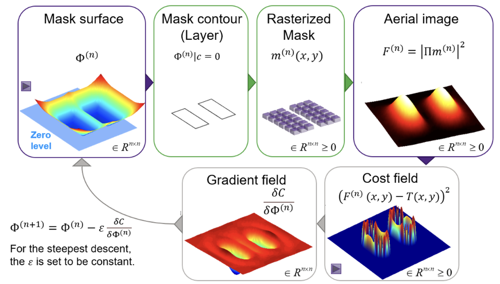
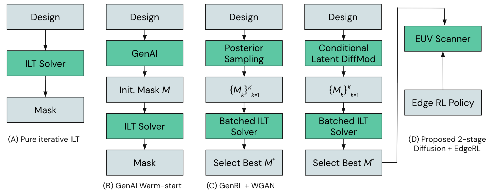
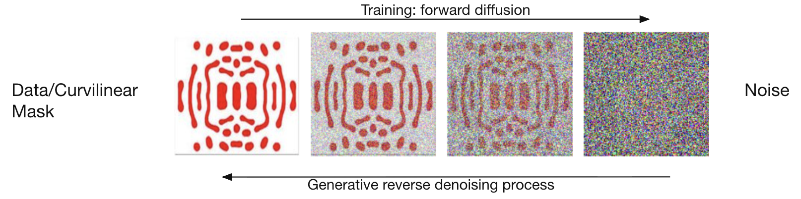
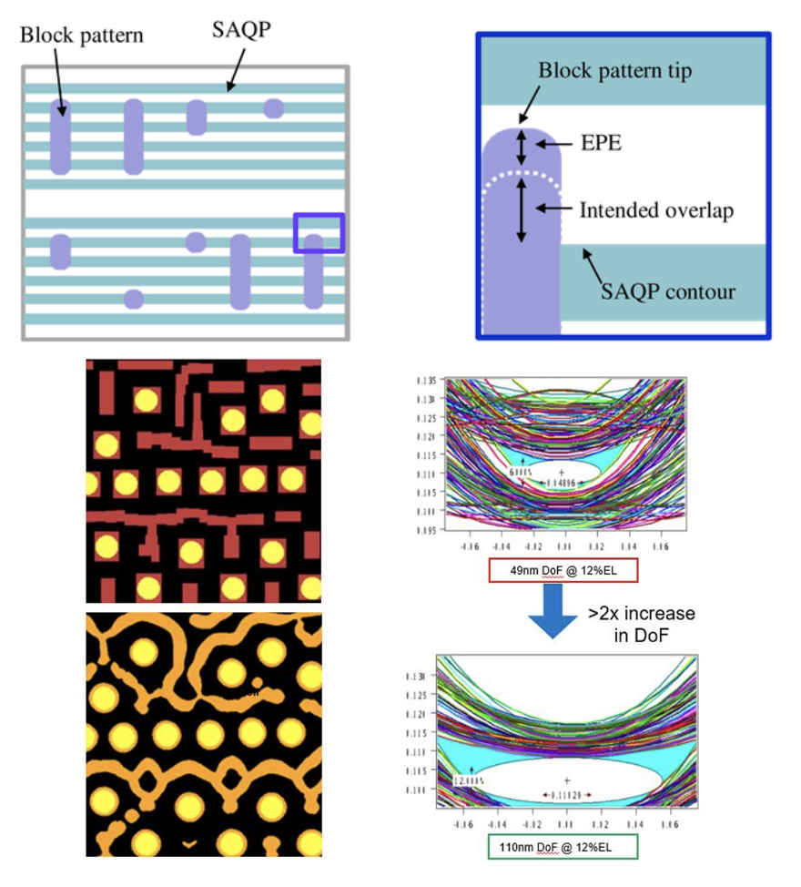
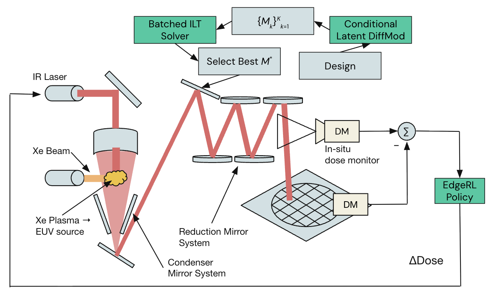

## Why Inverse Lithography (ILT)?

**Problem:** Smaller chips require more resolution enhancement techniques (RETs). Traditional approaches are expensive, prone to failure, and not perfect.

**Solution:** Curvilinear masks use curves rather than orthogonal polygons, computed by ILT to maximize the **process window** — the margin for error in lithography. Benefits include:

- Bigger process window and more robust wafer shapes at advanced nodes (optical + EUV), improving yield margins
- Improved depth of focus → less sensitivity to focus drifts; better contact fidelity
- High-NA EUV (0.33 → 0.55) is expected to make curvilinear masks a necessity

*Figure 1: Optical proximity correction (OPC) vs. inverse lithography (ILT) mask design.*

---

## How Does ILT Work?

ILT treats mask design as an **inverse math problem**. It creates optimized, curvilinear mask shapes that include main patterns and sub-resolution assist features (SRAFs).

1. **Forward Simulation** — Simulates light diffraction, predicting the wafer image from an initial mask design.
2. **The Cost Function** — Compares the simulated image against the desired pattern to calculate error.
3. **Gradient Descent** — Minimizes the error; indicates which way to adjust the mask's curves and pixels.
4. **Iterate** — The system continuously loops this process until the error approaches zero.

*Figure 2: Iterative ILT optimization loop.*

---

## Current Challenge + Proposed Model

| Challenge | Description |
| :--- | :--- |
| Slow physics simulations | Current ILT relies on expensive forward lithography models and gradient descent |
| Non-convex optimization | The problem is highly non-convex; algorithms get stuck in sub-optimal local minima |
| High compute cost | Thousands of CPU/GPU hours per chip layer |

**Proposition:** Move ILT from a pure physics simulation to a **conditional sampling task**, analogous to the relationship between the finite element method (FEM) and physics-informed neural networks (PINNs) — learn the solution manifold from data rather than re-solving the PDE from scratch every time.

*Figure 3: Proposed generative ILT architecture overview.*

---

## Diffusion Models for Mask Generation

Replace posterior sampling with a **Conditional Latent Diffusion Model (LDM)**:

- Input the ideal circuit layout as the condition
- The model denoises a latent canvas into a photomask
- For variable-shaped beam (VSB) writers instead of multi-beam mask writers (MBMW), a **diffusion transformer** can natively generate discrete, constrained geometries — e.g., tokenizing Manhattan constraints to force 90° shapes

**Advantages:**

- Inherently learns the manifold/shape of optimal masks from historical data
- LDM learns a global shape manifold → no need to chase local gradients at every iteration

*Figure 4: Conditional latent diffusion for photomask synthesis.*

### Generative Reverse Denoising Process

The diffusion model learns to reverse a forward noising process: starting from Gaussian noise and progressively denoising toward a valid mask conditioned on the target layout. This framing replaces iterative gradient descent on a physics simulator with a single forward pass (or few-step sampler) through a learned generative model.

1 Yang, H., & Ren, H. (2026). *Pushing the Limits of Inverse Lithography with Generative Reinforcement Learning.* arXiv preprint [arXiv:2602.16089](https://arxiv.org/abs/2602.16089).

---

## Generative Reinforcement Learning

**Problem with pure diffusion:** Statistically plausible masks can still fail strict EUV physics checks, causing **Edge Placement Errors (EPE)**.

**Solution:** Fine-tune the diffusion model using **Group Relative Policy Optimization (GRPO)** — eliminating the need for a critic model from standard PPO by utilizing group-reward sampling.

### Proposed Control Loop

1. RL agent generates a batch of mask candidates
2. Candidates are evaluated via a differentiable lithography simulator (e.g., TorchLitho 2.0)
3. **Reward function:** Minimize simulated EPE and maximize the process window
4. **Result:** The RL agent teaches the model to escape bad minima and generate physically valid masks

*Figure 5: Process window vs. edge placement error trade-off under GRPO fine-tuning.*

---

## Two-Stage Control Method

*Figure 6: Dual-stage offline mask synthesis + online EUV dose control.*

### Edge-Level Control

- Compiled RL policy connects directly to the EUV scanner
- **Model quantization:** GRPO-trained policy is quantized for low latency
- Deployed onto the scanner's FPGA
- Operates at the **50 kHz** frequency of the EUV droplet generator ($\Delta\text{Dose}$)
- **Real-time compensation:** The edge agent dynamically modulates the EUV laser dose to counter stochastic defects during printing

---

## Comparison to State of the Art

| Feature | Generative ILT | Dual-Stage Control (Proposed) |
| :--- | :--- | :--- |
| **Domain** | Offline RL | Offline RL + GRPO Edge RL |
| **Failure Handling** | Passive / statistical: designs a mask mathematically less likely to fail | Active / deterministic: modulates laser to suppress random photon noise |
| **Tool Awareness** | Blind to EUV scanner dynamics | Real-time adaptation |
| **Architecture** | Single-stage (Diffusion → Mask) | Dual-stage (Latent Diffusion → Mask **and** RL Agent → Laser) |

### Proposed Software Advantages

- **GANs** are prone to mode collapse → **LDM** explores the full solution space
- **AdaIN** injection misses local geometry → **LDM cross-attention** places SRAFs where needed
- **WGAN** requires carefully balanced networks → **LDM denoising** is stable and scales easily

---

## Summary

This project proposes a generative framework for inverse lithography that combines conditional latent diffusion for fast curvilinear mask synthesis with GRPO-based reinforcement learning to enforce EUV physics constraints. A dual-stage architecture extends this offline optimization with real-time laser dose modulation at the scanner edge — bridging the gap between statistically correct masks and deterministically reliable wafer prints as nodes continue to shrink.
