---

## Background on Viscoelastic Materials

Many materials exhibit a viscoelastic response, such as polymeric media, biological tissues, and porous media. Viscoelastic solid materials return to their reference configuration when unloaded but unlike purely elastic solids there is a time delay over which the material gradually returns. One way to picture viscoelasticity is the Kelvin-Voigt model which is what happens to the Standard Linear Solid (SLS) model when we reduce to the case of a single spring in parallel with a single dashpot and nothing else. The SLS model is where the response is modeled like a spring and dashpot in series, which is then placed in parallel with another spring.

### Qualitative and Mathematical Representation

As described in "Introduction to Mechanics of Solid Materials," viscoelastic materials are materials that, in addition to their elastic behavior, have a viscous strain-rate dependence ($d\epsilon/dt$). Common physical phenomena that result from this include:

- **Creep**: the increase in strain over a long period of low loading
- **Stress-relaxation**: the reduction of stress over a long period of constant strain
- **Strain-rate sensitivity**: the dependence of a typical prescribed strain stress-strain curve on the strain rate
- **Energy absorption**: viscoelastic materials can also absorb vibrational energy by damping out motions


*Examples of Common Viscoelastic Materials: Earplugs, skin, and wood*

These behaviors are particularly prominent in polymeric solids, biological tissues, elastomers, and porous media, where molecular rearrangements, fluid transport, or microstructural dissipation mechanisms occur over finite time scales. Some everyday examples include wood, or specifically the cellulose fibers in the polymeric lignin matrix. Polyurethane earplugs allow progressive conformation of the cushion to the ear, though creep has a tendency to actually make the earplugs more stiff and dense over time. An example of stress relaxation comes from music; guitar strings are viscoelastic since as they are tuned and tightened, they absorb tensile stress. When fixed at constant strain, stress relaxation occurs allowing a lower pitch to be heard. Finally, in any sort of system where dampers are used, the dampers tend to be made out of viscoelastic materials.

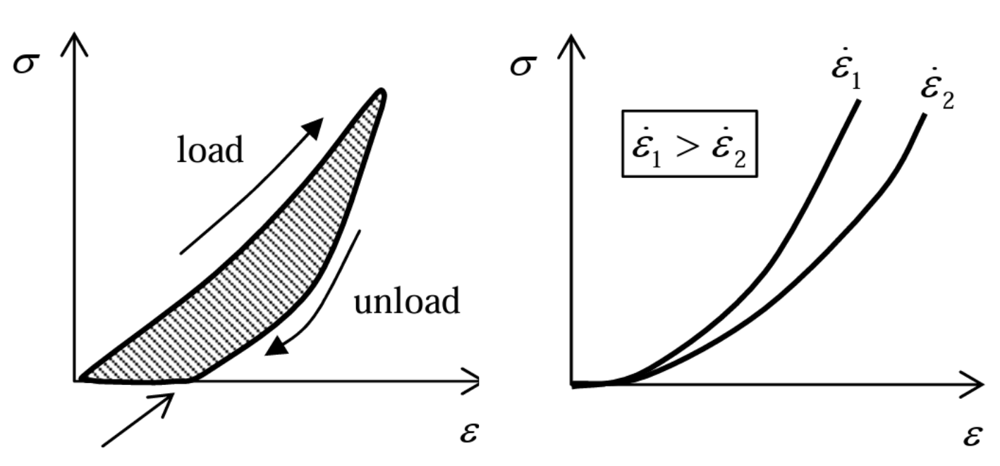
*Stress-strain Curve for Viscoelastic Material under Uniaxial Tension*

Note that the loading and unloading curves form a hysteresis loop and that the faster the stretching, the larger the stress required causing some possible permanent deformation upon complete unloading.

From a mathematical perspective, we can model viscoelasticity by using standard elastic constitutive laws with rate-dependent terms. We can do this by using linear combinations of springs (elastic energy storage) and dashpots (viscous dissipation). Two canonical models arise from this construction: the **Kelvin-Voigt** model and the **Standard Linear Solid (SLS)** model. The Kelvin-Voigt model is explained further in Section 2 and takes on the resulting constitutive relation:

$$
\sigma = E\epsilon + \eta \dot{\epsilon}
$$

where $E$ is the elastic modulus and $\eta$ the viscosity. This simplified model does not exhibit stress relaxation under constant strain. The SLS model extends the Kelvin-Voigt model by introducing a spring and dashpot in series in parallel with another spring. In the linear setting, the SLS constitutive law is:

$$
\sigma + \frac{\eta}{E_1}\dot{\sigma} = (E_1+E_2)\epsilon + \eta \dot{\epsilon}
$$

In this work, we focus on a finite-deformation generalization of the Kelvin–Voigt model. While simpler than the SLS, this choice enables a clear separation between elastic energy storage and viscous dissipation, facilitating a thermodynamically consistent formulation and straightforward finite element implementation. The resulting model captures essential viscoelastic effects while remaining analytically and numerically tractable.

### Historical Development and Foundational Papers

Boltzmann was the first to start exploring the classical linear theory of viscoelasticity in the late 19th century. He introduced constitutive relations in which the stress at a given time depends on the entire history of strain. This formulation represented a fundamental departure from purely elastic theories by explicitly incorporating material memory through convolution integrals over past deformations. In his original work, Boltzmann developed a fully 3D theory for isotropic materials. Nevertheless, the extension of the theory to anisotropic materials follows naturally from the mathematical structure of the constitutive relations and does not require modification of the underlying physical hypotheses. Since Boltzmann's initial contributions, assumptions of linear viscoelasticity—linearity of response, causality, and dependence on strain history—have remained unchanged and continue to serve as the foundation of the theory.

During the first half of the twentieth century, attention increasingly shifted toward reformulating viscoelastic constitutive relations in forms more directly accessible to experimental measurement. In particular, one-dimensional representations expressed in terms of material functions such as creep compliances, relaxation moduli, and frequency-dependent complex moduli became central to both theoretical and experimental investigations. Early systematic treatments highlighting these experimentally measurable quantities were provided by Lee, as well as by Ferry and Ninomiya, who highlighted the close connection between constitutive modeling and rheological testing and demonstrated how viscoelastic material behavior could be characterized through laboratory experiments. These developments enabled the practical identification and comparison of viscoelastic material models.

In parallel with these experimentally motivated advances, substantial progress was made in clarifying the mathematical structure of linear viscoelastic theories. Gross presented a seminal synthesis of the mathematical foundations of viscoelasticity, systematically analyzing the relationships among the various material functions that arise in one-dimensional formulations of the theory and establishing conditions under which different representations are equivalent. This work provided a unifying framework that linked hereditary integral formulations, differential constitutive equations, and experimentally defined material functions within a consistent mathematical structure.

Additionally, Leaderman investigated rheological response functions and their interpretation within linear viscoelastic theory, allowing for more experimentally grounded constitutive descriptions. Love addressed foundational aspects of the theory, including mathematical consistency and admissibility conditions for material response functions. König and Meixner extended these analyses by examining the axiomatic and functional-analytic structure of viscoelastic constitutive relations, helping to clarify the conditions required for physically meaningful and thermodynamically admissible material behavior. In all, the combinations of these seminal works established a sound foundation and groundwork for conceptually and mathematically grounded formulations of viscoelasticity upon which later continuum-mechanical and thermodynamic formulations of viscoelasticity were built.

---

## Constitutive Analysis of Viscoelastic Materials

In this section we derive a simple model for viscoelasticity drawing from the Kelvin-Voigt 1D model:

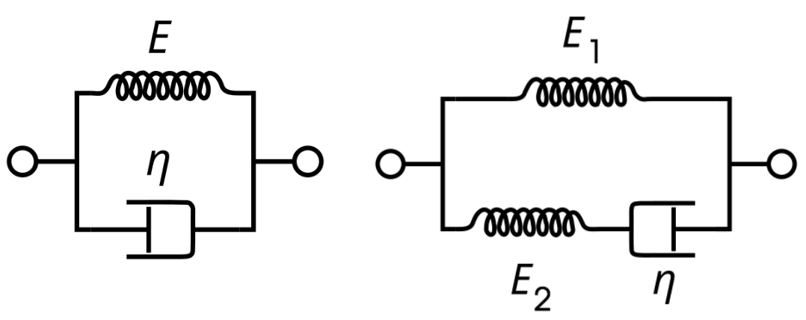
*Kelvin-Voigt/SLS diagram: a spring with stiffness $E$ with a dashpot with coefficient of $\eta$*

Some notable characteristics drawn from this model are that the strain on both the elastic and viscous components is equal, and the total stress is the sum of the stress carried by each component. Thus,

$$
\epsilon = \epsilon^e = \epsilon^v
$$

$$
\sigma = \sigma^e + \sigma^v = E\epsilon^e + \eta\dot{\epsilon}^v = E\epsilon + \eta \dot{\epsilon}
$$

Where $\epsilon, \epsilon^e, \epsilon^v$ and $\sigma, \sigma^e, \sigma^v$ are the total, elastic, and viscous strain and stress respectively. $E$ and $\eta$ are the elastic stiffness and viscous damping coefficients. We can then make the useful predictions that while the stress will depend on both the strain and strain rate (deformation gradient $\mathbf{F}$ and velocity gradient $\mathbf{L}$), the specific free energy $\psi$ will only depend on the strain as dashpots can only dissipate and not store energy.

### Kinematic Framework and Constitutive Dependences

Assuming the Kelvin-Voigt model and isothermal elasticity, we propose independent variables $\mathbf{F}$ and $\mathbf{L}$:

$$
\psi = \hat{\psi}(\mathbf{F}, \mathbf{L})
$$

$$
\mathbf{T} = \hat{\mathbf{T}}(\mathbf{F}, \mathbf{L})
$$

We first enforce frame indifference, requiring that constitutive functions should agree regardless of the relative motion between two simultaneous observers $\mathcal{O}$ and $\mathcal{O}^*$. We aim to derive the relations between observed quantities $\mathbf{F}$ and subsequently $\mathbf{L}$. At any point in time $t$ (suppressed in notation), define the relative motion vector:

$$
\mathbf{r}^* = \mathbf{y} + \mathbf{Qr}
$$

$$
\chi^*(\mathbf{X}^*) = \mathbf{y} + \mathbf{Q}\chi(\mathbf{X})
$$

Note that $\mathbf{X}^*$ and $\mathbf{X}$ reference the same material point $p$, thus:

$$
\frac{\partial \chi^*}{\partial \mathbf{X}} = \mathbf{F}^* = \frac{\partial \mathbf{r}^*}{\partial \mathbf{r}}\frac{\partial \mathbf{r}}{\partial \mathbf{X}} = \mathbf{QF}
$$

By taking the time derivative and utilizing the chain rule, we can obtain:

$$
\mathbf{L}^* = \dot{\mathbf{Q}}\mathbf{Q}^\top + \mathbf{QLQ}^\top
$$

where $\dot{\mathbf{Q}}\mathbf{Q}^\top = \mathbf{\Omega}$, a skew tensor.

As scalar state fields must equal over observer transformations and tensor state fields can be transformed according to the mapping of their principal basis vectors, we require the following frame relations:

$$
\hat{\psi}(\mathbf{F}^*, \mathbf{L}^*) = \hat{\psi}(\mathbf{QF}, \mathbf{\Omega} + \mathbf{QLQ}^\top) = \hat{\psi}(\mathbf{F}, \mathbf{L})
$$

$$
\hat{\mathbf{T}}(\mathbf{F}^*, \mathbf{L}^*) = \hat{\mathbf{T}}(\mathbf{QF}, \mathbf{\Omega} + \mathbf{QLQ}^\top) = \mathbf{Q}\hat{\mathbf{T}}(\mathbf{F}, \mathbf{L})\mathbf{Q}^\top
$$

We first inspect the relation that applying an arbitrary rotation $\mathbf{Q}$ after the deformation does not affect either field. We choose $\mathbf{Q} = \mathbf{R}^\top$ from the right polar decomposition $\mathbf{F} = \mathbf{RU}$, obtaining:

$$
\hat{\psi}(\mathbf{F}^*, \mathbf{L}^*) = \hat{\psi}(\mathbf{QF}, \mathbf{L}^*) = \hat{\psi}(\mathbf{R}^\top \mathbf{RU}, \mathbf{L}^*) = \hat{\psi}(\mathbf{U}, \mathbf{L}^*) = \hat{\psi}(\mathbf{U}, \mathbf{L}) = \psi
$$

As the right Cauchy-Green tensor $\mathbf{C} = \mathbf{U}^2$, we conclude that $\hat{\psi}(\mathbf{F})$ satisfying frame indifference can only depend on the stretch tensor or its square, so we replace the $\mathbf{F}$ dependence with $\mathbf{C}$. Similarly for stress:

$$
\mathbf{Q}\hat{\mathbf{T}}(\mathbf{F}, \mathbf{L})\mathbf{Q}^\top = \hat{\mathbf{T}}(\mathbf{F}^*, \mathbf{L}^*) = \hat{\mathbf{T}}(\mathbf{QF}, \mathbf{L}^*) = \hat{\mathbf{T}}(\mathbf{R}^\top \mathbf{RU}, \mathbf{L}^*) = \hat{\mathbf{T}}(\mathbf{U}, \mathbf{L}^*)
$$

$$
\hat{\mathbf{T}}(\mathbf{F}, \mathbf{L}) = \mathbf{R}\hat{\mathbf{T}}(\mathbf{U}, \mathbf{L}^*)\mathbf{R}^\top
$$

For $\mathbf{L}$ dependence, we can observe that for choice of $\mathbf{Q}(t=0) = \mathbf{1}$ and $\mathbf{\Omega}$ is a constant, $\mathbf{L}^*$ reduces to $\mathbf{\Omega} + \mathbf{L}$. As this has no effect on the identities, we deduce that these quantities cannot depend on any of the skew part of the $\mathbf{L}$ argument, and thus solely depend on the symmetric part $\mathbf{D} = \text{sym}(\mathbf{L})$. So, our reduction by imposing frame indifference is:

$$
\psi = \hat{\psi}(\mathbf{C}, \mathbf{D})
$$

$$
\mathbf{T} = \mathbf{R}\hat{\mathbf{T}}(\mathbf{C}, \mathbf{D})\mathbf{R}^\top
$$

### Free Energy, Dissipation, and Thermodynamic Constraints

We next set out to impose the Second Law of Thermodynamics with the isothermal assumption enforced:

$$
\rho\dot{\psi} - \mathbf{T}:\mathbf{D} \leq 0
$$

First addressing the $\rho \dot{\psi}$ term, we use the chain rule on $\hat{\psi}$:

$$
\rho \dot{\psi} = \rho \left[ \frac{\partial\hat{\psi}}{\partial \mathbf{C}} : \dot{\mathbf{C}} + \frac{\partial\hat{\psi}}{\partial \mathbf{D}} : \dot{\mathbf{D}} \right]
$$

We then look back to the Kelvin-Voigt model to inform how we handle the Cauchy Stress $\mathbf{T}$. We propose that $\mathbf{T}$ is actually the sum of two stress components, $\mathbf{T}^e$ the elastic stress and $\mathbf{T}^v$ the viscous stress. Just as the Kelvin-Voigt equations show that $\sigma^e$ depends solely on the strain and that $\sigma^v$ depends solely on the strain *rate*, we suppose that these stress components are of the form:

$$
\mathbf{T}^e = \hat{\mathbf{T}}^e(\mathbf{C})
$$

$$
\mathbf{T}^v = \hat{\mathbf{T}}^v(\mathbf{D})
$$

$$
\text{hence } \mathbf{T} = \mathbf{T}^e + \mathbf{T}^v = \hat{\mathbf{T}}^e(\mathbf{C}) + \hat{\mathbf{T}}^v(\mathbf{D})
$$

By linearity of the contraction operator $:$, we can express $\mathbf{T}:\mathbf{D} = \hat{\mathbf{T}}^e(\mathbf{C}):\mathbf{D} + \hat{\mathbf{T}}^v(\mathbf{D}):\mathbf{D}$, thus the Second Law of Thermodynamics becomes:

$$
\rho \frac{\partial\hat{\psi}}{\partial \mathbf{C}} : \dot{\mathbf{C}} + \rho \frac{\partial\hat{\psi}}{\partial \mathbf{D}} : \dot{\mathbf{D}} - \hat{\mathbf{T}}^e(\mathbf{C}):\mathbf{D} - \hat{\mathbf{T}}^v(\mathbf{D}):\mathbf{D} \leq 0
$$

We observe that we can use the identity $\mathbf{D} = \frac{1}{2} \mathbf{F}^{-\top} \dot{\mathbf{C}} \mathbf{F}^{-1}$ on *just* the $\mathbf{D}$ contracted with $\hat{\mathbf{T}}^e(\mathbf{C})$, and in doing so we can obtain the following result:

$$
\hat{\mathbf{T}}^e(\mathbf{C}):\mathbf{D} = \hat{\mathbf{T}}^e(\mathbf{C}):\frac{1}{2}\mathbf{F}^{-\top} \dot{\mathbf{C}} \mathbf{F}^{-1} = \frac{1}{2} \mathbf{F}^{-1}\hat{\mathbf{T}}^e(\mathbf{C})\mathbf{F}^{-\top}:\dot{\mathbf{C}}
$$

Defining the Second Piola Stress $\mathbf{T}_{RR}^e = J \mathbf{F}^{-1}\mathbf{T}^e\mathbf{F}^{-\top}$, we first show:

$$
\mathbf{T}_{RR}^e = J \mathbf{F}^{-1}\mathbf{T}^e\mathbf{F}^{-\top} = J \mathbf{F}^{-1}(\mathbf{R}\hat{\mathbf{T}}^e(\mathbf{C})\mathbf{R}^\top)\mathbf{F}^{-\top}
$$

$$
= J \mathbf{U}^{-1}\hat{\mathbf{T}}^e(\mathbf{C})\mathbf{U}^{-\top} = \det(\sqrt{\mathbf{C}}) \sqrt{\mathbf{C}}^{-1}\hat{\mathbf{T}}^e(\mathbf{C})\sqrt{\mathbf{C}}^{-\top}
$$

Hence, $\mathbf{T}_{RR}^e = \hat{\mathbf{T}}_{RR}^e(\mathbf{C})$, and we reduce to:

$$
\hat{\mathbf{T}}^e(\mathbf{C}):\mathbf{D} = \frac{1}{2} J^{-1} \hat{\mathbf{T}}_{RR}^e(\mathbf{C}):\dot{\mathbf{C}}
$$

Substituting back and grouping terms according to the independent variables of each function and their contraction:

$$
\left[ \rho \frac{\partial\hat{\psi}}{\partial \mathbf{C}} - \frac{1}{2} J^{-1} \hat{\mathbf{T}}_{RR}^e(\mathbf{C}) \right] : \dot{\mathbf{C}} + \rho \frac{\partial\hat{\psi}}{\partial \mathbf{D}} : \dot{\mathbf{D}} - \hat{\mathbf{T}}^v(\mathbf{D}):\mathbf{D} \leq 0
$$

We notice that this equation is of the general form that allows us to perform the **Coleman-Noll procedure**:

$$
f_1(x)y + f_2(x) \leq 0 \; \forall x,y \implies f_1(x) = 0, \; f_2(x) \leq 0
$$

Note that this holds for arbitrary and independent $x,y$ terms. Thus, we begin with inspection of the second term, $\rho \frac{\partial\hat{\psi}}{\partial \mathbf{D}} : \dot{\mathbf{D}}$. As $\hat{\psi}$ is a function solely of $\mathbf{C}, \mathbf{D}$, $\dot{\mathbf{D}}$ is arbitrary and $\rho \frac{\partial\hat{\psi}}{\partial \mathbf{D}}$ must be identically zero. Thus, $\hat{\psi}(\mathbf{C}, \mathbf{D})$ does not actually depend on $\mathbf{D}$, and we reduce as predicted by the Kelvin-Voigt model:

$$
\psi = \hat{\psi}(\mathbf{C})
$$

This results in the second law relation simplifying to:

$$
\left[ \rho \frac{\partial\hat{\psi}}{\partial \mathbf{C}} - \frac{1}{2} J^{-1} \hat{\mathbf{T}}_{RR}^e(\mathbf{C}) \right] : \dot{\mathbf{C}} - \hat{\mathbf{T}}^v(\mathbf{D}):\mathbf{D} \leq 0
$$

While the Coleman-Noll Procedure allows for the $\dot{\mathbf{D}}$ term to go away, the same can't be said for the viscous and elastic portions of the inequality. Firstly, the elastic and viscous portions are contracted by $\dot{\mathbf{C}}$ and $\mathbf{D}$, respectively. We concluded earlier that $\dot{\mathbf{C}}$ and $\mathbf{D}$ are directly related to each other. This groups the viscous and elastic terms together when attempting the Coleman-Noll procedure. Furthermore, the viscous Cauchy stress is defined as a function of the rate-of-deformation tensor, $\mathbf{D}$. As a result, this makes the procedure not be valid for splitting the viscous and elastic portion. However, there is another trick that can be used. We start by defining the rate of deformation tensor to be the same tensor, just multiplied by an arbitrary, positive scalar. Due to the $\dot{\mathbf{C}}$ and $\mathbf{D}$ tensors being directly related, the same can be done to the $\dot{\mathbf{C}}$ tensor.

$$
\mathbf{D} \rightarrow \alpha\mathbf{D}, \quad \dot{\mathbf{C}} \rightarrow \alpha\dot{\mathbf{C}}
$$

This updates the second law equation to be as follows:

$$
\left[ \rho \frac{\partial\hat{\psi}}{\partial \mathbf{C}} - \frac{1}{2} J^{-1} \hat{\mathbf{T}}_{RR}^e(\mathbf{C}) \right] : \alpha\dot{\mathbf{C}} - \hat{\mathbf{T}}^v(\alpha\mathbf{D}):\alpha\mathbf{D} \leq 0
$$

Next, we divide both sides of the inequality by $\alpha$:

$$
\left[ \rho \frac{\partial\hat{\psi}}{\partial \mathbf{C}} - \frac{1}{2} J^{-1} \hat{\mathbf{T}}_{RR}^e(\mathbf{C}) \right] : \dot{\mathbf{C}} - \hat{\mathbf{T}}^v(\alpha\mathbf{D}):\mathbf{D} \leq 0
$$

Now, by taking the limit of the equation as $\alpha$ goes to zero, the only term affected is going to be the $\mathbf{T}^v$ term. We know that when alpha is zero, the constant results in the rate of deformation tensor also approaching zero. Knowing this, we can deduce that if there is no rate of deformation occurring, there will not be a viscous stress. This, as a result, simplifies this case to a hyperelastic model, with the following inequality:

$$
\left[ \rho \frac{\partial\hat{\psi}}{\partial \mathbf{C}} - \frac{1}{2} J^{-1} \hat{\mathbf{T}}_{RR}^e(\mathbf{C}) \right] : \dot{\mathbf{C}} \leq 0
$$

Then we may turn our attention to the bracketed terms as the internal functions are now all functions of solely $\mathbf{C}$ while they are contracted with $\dot{\mathbf{C}}$. We use the identity $\rho = \rho_R J^{-1}$ and define $\psi_R = \rho_R \psi$ such that:

$$
\left[ \rho \frac{\partial\hat{\psi}}{\partial \mathbf{C}} - \frac{1}{2} J^{-1} \hat{\mathbf{T}}_{RR}^e(\mathbf{C}) \right] : \dot{\mathbf{C}} = J^{-1} \left[ \frac{\partial\hat{\psi}_R}{\partial \mathbf{C}} - \frac{1}{2} \hat{\mathbf{T}}_{RR}^e(\mathbf{C}) \right] : \dot{\mathbf{C}}
$$

As the terms within brackets are entirely independent of $\dot{\mathbf{C}}$, which can be varied arbitrarily, Coleman-Noll requires that the bracketed term is the zero function:

$$
\frac{\partial\hat{\psi}_R}{\partial \mathbf{C}} - \frac{1}{2} \hat{\mathbf{T}}_{RR}^e(\mathbf{C}) = 0
$$

$$
2 \frac{\partial\hat{\psi}_R}{\partial \mathbf{C}} = \hat{\mathbf{T}}_{RR}^e(\mathbf{C})
$$

Transforming back from the Elastic Second Piola Stress to the deformed configuration Cauchy Stress:

$$
\hat{\mathbf{T}}_{RR}^e(\mathbf{C}) = J \mathbf{F}^{-1}\hat{\mathbf{T}}^e(\mathbf{C})\mathbf{F}^{-\top} = 2 \frac{\partial\hat{\psi}_R}{\partial \mathbf{C}}
$$

$$
\hat{\mathbf{T}}^e(\mathbf{C}) = 2J^{-1}\mathbf{F} \frac{\partial\hat{\psi}_R}{\partial \mathbf{C}}\mathbf{F}^\top
$$

Now that we have shown both the first two terms must equal zero, we arrive at the final constraint that $-\hat{\mathbf{T}}^v(\mathbf{D}):\mathbf{D} \leq 0$. Our final set of constitutive law restrictions is thus:

$$
\frac{\partial\hat{\psi}}{\partial \mathbf{D}} = 0
$$

$$
\hat{\mathbf{T}}^e(\mathbf{C}) = 2J^{-1}\mathbf{F} \frac{\partial\hat{\psi}_R}{\partial \mathbf{C}}\mathbf{F}^\top
$$

$$
\hat{\mathbf{T}}^v(\mathbf{D}):\mathbf{D} \geq 0
$$

### Developing a Tractable Model

We can now assume that $\mathbf{T}^v$ is a linear function of the rate-of-deformation tensor $\mathbf{D}$. This ultimately allows for the viscous stress to pass the directionality analysis, as the stress would always align with rate of deformation. The viscous Cauchy Stress tensor would be then defined as follows:

$$
\hat{\mathbf{T}}^v = \lambda_1 \text{tr}(\mathbf{D})\mathbf{1} + \lambda_2 \mathbf{D}
$$

By simplifying the contraction, we get the following relation for the viscous portion of the stress:

$$
\hat{\mathbf{T}}^v : \mathbf{D} = (\lambda_1 \text{tr}(\mathbf{D})\mathbf{1} + \lambda_2 \mathbf{D}):\mathbf{D} = \lambda_1 \text{tr}(\mathbf{D})^2 + \lambda_2 ||\mathbf{D}||^2
$$

By plugging the contraction back into the inequality, we can now set constraints of the two lambda constants:

$$
\lambda_1 \text{tr}(\mathbf{D})^2 + \lambda_2 ||\mathbf{D}||^2 \geq 0
$$

We first consider the case where the $\mathbf{D}$ tensor has no trace. This would eliminate the first term from the inequality. The resultant shows that $\lambda_2$ constant would have to be greater than or equal to zero:

$$
\lambda_2 \geq 0
$$

Next, we consider the case where there is a uniform compression or expansion. This causes the rate of deformation to have the following relation: $\mathbf{D} = d\mathbf{1}$. With this, we find that the trace of the deformation tensor to be same as the trace of the identity multiplied by a scalar. As a result, the first term of the inequality results in:

$$
\lambda_1 \text{tr}(\mathbf{D})^2 = \lambda_1(3d)^2 = \lambda_1(9d^2)
$$

Moving on to the second term, we find that the exponent by the norm commutes. Knowing this, we find the second term to be:

$$
\lambda_2 ||\mathbf{D}||^2 = \lambda_2 ||\mathbf{D}^2|| = \lambda_2(D_{11}^2 + D_{22}^2 + D_{33}^2) = \lambda_2(d^2 + d^2 + d^2) = \lambda_2(3d^2)
$$

This results in the following constraint on the $\lambda_1$ constant:

$$
\lambda_1 \geq -\frac{\lambda_2}{3}
$$

The $\lambda_1$ and $\lambda_2$ constants are associated with real life material properties. We will define the constants as the following, with $\lambda_1$ corresponding to the bulk viscosity, $\kappa$, and $\lambda_2$ corresponding to the shear viscosity, $\mu$:

$$
\lambda_1 = \kappa, \quad \lambda_2 = 2\mu
$$

This results in the viscous Cauchy stress tensor to be defined as:

$$
\hat{\mathbf{T}}^v = \kappa \, \text{tr}(\mathbf{D})\mathbf{1} + 2\mu \mathbf{D}
$$

### Material Symmetry Considerations

We may impose additional constitutive restrictions on $\hat{\psi}(\mathbf{C})$, $\hat{\mathbf{T}}^e(\mathbf{C})$, and $\hat{\mathbf{T}}^v(\mathbf{D})$ to model materials with various symmetries. We consider a material element in an *unloaded* state such that there is a special set of rotations $\mathbf{Q} \in \mathcal{G}$ known as the material's *symmetry group*. $\mathcal{G}$ has the property that a pre-rotation belonging to $\mathcal{G}$ of the undeformed material does not affect the material's microstructure — thus, its constitutive response is also unchanged. For example, isotropy is defined by $\mathcal{G}$ being the set of *all* rotations $\mathbf{Q}$.

We enforce this constraint by checking that constitutive responses for a given deformation $\mathbf{F}$ are equivalent to those given by $\mathbf{FQ}$, as the rotation is applied before the deformation. We can inspect this in terms of the effects on the independent variables, $\mathbf{C}$ and $\mathbf{D}$, denoting their symmetric counterparts as $\mathbf{C}'$ and $\mathbf{D}'$:

$$
\mathbf{C}' = (\mathbf{FQ})^\top (\mathbf{FQ}) = \mathbf{Q}^\top \mathbf{F}^\top \mathbf{FQ} = \mathbf{Q}^\top \mathbf{CQ}
$$

Thus, for $\hat{\psi}_R(\mathbf{C})$:

$$
\hat{\psi}_R(\mathbf{C}) = \psi_R(\mathbf{C}')
$$

$$
\hat{\psi}_R(\mathbf{C}) = \hat{\psi}_R(\mathbf{Q}^\top \mathbf{CQ}) \; \forall \; \mathbf{Q} \in \mathcal{G}
$$

And for $\hat{\mathbf{T}}^e(\mathbf{C})$:

$$
\hat{\mathbf{T}}^e(\mathbf{C}) = \hat{\mathbf{T}}^e(\mathbf{C}')
$$

$$
\mathbf{Q}^\top \hat{\mathbf{T}}_{RR}^e(\mathbf{C}) \mathbf{Q} = \hat{\mathbf{T}}_{RR}^e(\mathbf{Q}^\top \mathbf{CQ}) \; \forall \; \mathbf{Q} \in \mathcal{G}
$$

For $\hat{\mathbf{T}}^v(\mathbf{D})$, we consider how $\mathbf{D}$ is transformed to $\mathbf{D}'$. We also observe that for a *material* symmetry rotation, $\mathbf{Q}$ does not vary with time, and therefore $\dot{\mathbf{C}}' = \mathbf{Q}^\top\dot{\mathbf{C}}\mathbf{Q}$. Beginning with $\mathbf{D} = \frac{1}{2} \mathbf{F}^{-\top} \dot{\mathbf{C}} \mathbf{F}^{-1}$:

$$
\mathbf{D}' = \frac{1}{2} (\mathbf{FQ})^{-\top} \dot{\mathbf{C}}' (\mathbf{FQ})^{-1}
$$

$$
= \frac{1}{2} \mathbf{F}^{-\top}\mathbf{Q}^{-\top} \mathbf{Q}^\top\dot{\mathbf{C}}\mathbf{Q} \mathbf{Q}^{-1}\mathbf{F}^{-1}
$$

$$
\mathbf{D}' = \frac{1}{2} \mathbf{F}^{-\top} \dot{\mathbf{C}} \mathbf{F}^{-1} = \mathbf{D}
$$

As this condition does not depend on a particular $\mathbf{Q} \in \mathcal{G}$, we realize that this condition is inherent to any constitutive function solely dependent on $\mathbf{D}$. Therefore, $\hat{\mathbf{T}}^v(\mathbf{D})$ automatically satisfies any symmetry group. We can draw parallel intuition from the formulation of a constitutive function for a viscous fluid, which similarly has the property that it is inherently isotropic.

### Final Governing Equations and Material Parameter Specification

In summary of all the derivations, we have three governing parameters. The first shows that the free energy is not a function of the rate of deformation. The second term defines the elastic portion of the stress, and the third defines the viscous portion of the stress contracted with the rate of deformation must always be greater than or equal to zero.

$$
\frac{\partial\hat{\psi}}{\partial \mathbf{D}} = 0
$$

$$
\hat{\mathbf{T}}^e(\mathbf{C}) = 2J^{-1}\mathbf{F} \frac{\partial\hat{\psi}_R}{\partial \mathbf{C}}\mathbf{F}^\top
$$

$$
\hat{\mathbf{T}}^v(\mathbf{D}):\mathbf{D} \geq 0
$$

We then define the viscous stress below, with $\kappa$ representing the bulk viscosity and $\mu$ representing the shear viscosity. Furthermore, the restrictions on the viscosity terms are also shown:

$$
\hat{\mathbf{T}}^v = \kappa \, \text{tr}(\mathbf{D})\mathbf{1} + 2\mu \mathbf{D}
$$

with

$$
\kappa \geq -\frac{2\mu}{3}, \quad \mu \geq 0
$$

---

## Numerical Tests of Viscoelastic Materials

### One-Element Verification Tests

To verify the constitutive implementation while isolating material behavior from numerical and geometric effects, we performed a single one-element verification test. The model single three-dimensional cuboid element is subjected to a homogeneous deformation via prescribed displacement of twice its side length. Constraints were applied to eliminate rigid body motion while maintaining a uniform deformation state. All simulations were conducted under isothermal conditions, consistent with our constitutive assumptions. The reference (undeformed) body displayed along with the deformed body at the time of maximal extension.

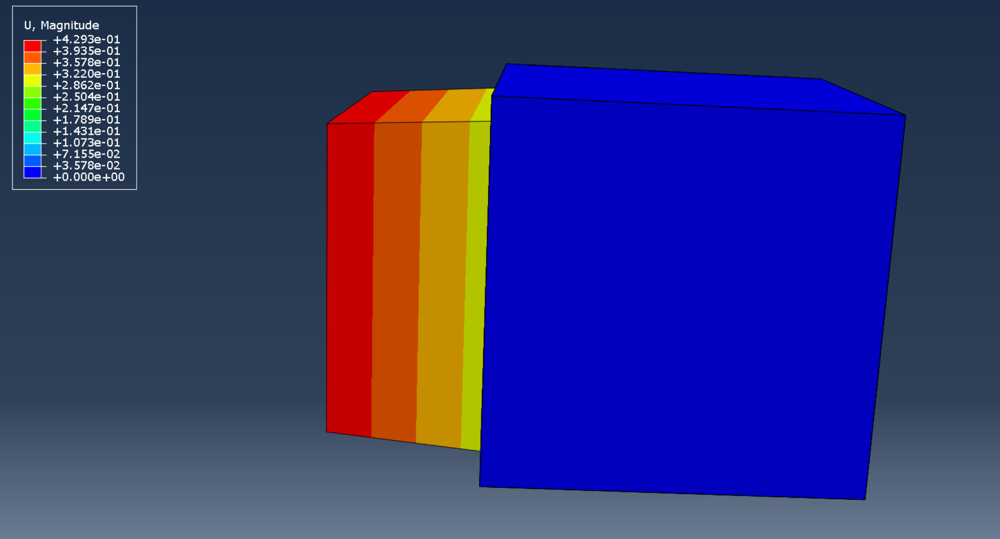
*One-element verification test configuration*

The linear $u_2$ displacement field confirms a homogeneous strain state within the element, demonstrating that the observed response arises from the constitutive model rather than numerical artifacts. The agreement with theoretical expectations across all cases confirms the correctness of the constitutive equations and thus we move on to more complex geometries.

### Mesh Refinement Study and Convergence Analysis

We performed a mesh refinement study to verify that our code is actually converging to a real continuum solution. The analysis considered a sequence of progressively refined meshes with element sizes $h = \{3, 1.2, 0.8, 0.4, 0.2\}$. For each mesh, the same geometry, material parameters, and loading conditions were applied, and the maximum von Mises equivalent stress is noted via the legend.

For the coarsest mesh, $h=3$, the stress field appears overly smooth, with relatively low peak stresses. This behaviour is expected because coarse discretizations are unable to adequately resolve stress gradients near geometric features such as holes, leading to artificial stress averaging. Upon refinement to $h=1.2$, the stress field becomes more structured and localized, and the maximum stress increases noticeably, indicating improved resolution of stress concentrations.

Further refinement to $h=0.8$ results in an additional increase in the peak von Mises stress. However, the increase is not linear with respect to the size of the mesh, reflecting the nonlinear interaction between the resolution of the mesh, the geometric stress concentration, and the response of the material. This nonlinearity is typical in problems involving sharp geometric features, where stress gradients are steep and convergence in the maximum stress occurs more slowly than convergence in global quantities such as displacement or strain energy.

When the mesh is refined to $h=0.4$, a more pronounced increase in maximum stress is observed compared to previous refinement steps. At this resolution, the mesh is sufficiently fine to capture the local stress concentrations around the holes with greater fidelity, revealing higher stress peaks that were previously under-resolved. Refinement to the finest mesh, $h=0.2$, results in a smaller incremental increase in peak stress, suggesting that the solution is approaching convergence.

Overall, the observed trend demonstrates monotonic but non-uniform convergence of the maximum von Mises stress with mesh refinement. While coarse meshes significantly underpredict peak stresses, successive refinements reduce discretization error and yield increasingly localized and physically meaningful stress distributions. Based on these results, meshes with element sizes $h \leq 0.4$ provide a reasonable balance between computational cost and accuracy for capturing stress concentrations in this geometry.

<div style="display: grid; grid-template-columns: repeat(3, 1fr); gap: 16px; margin: 24px 0;">
  <figure style="text-align: center; margin: 0;">
    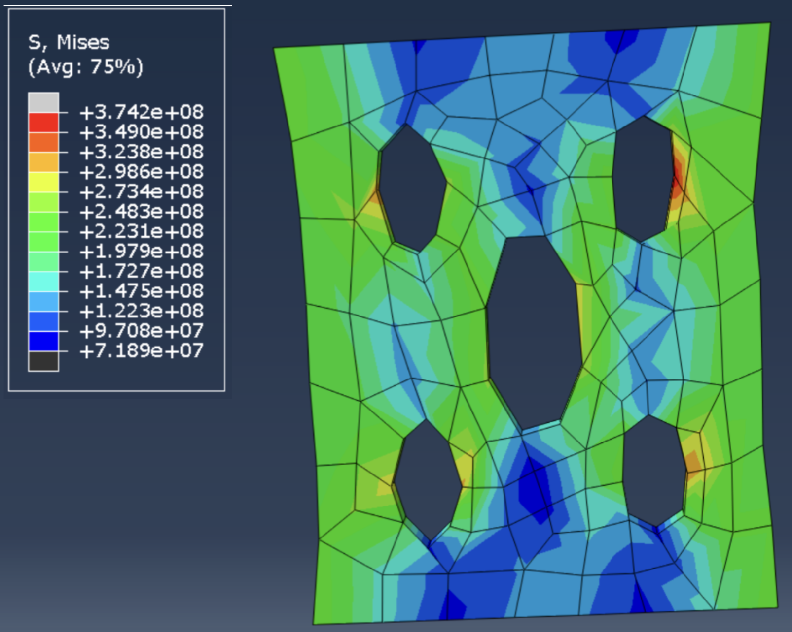
    <figcaption><strong>(a)</strong> h = 3.0</figcaption>
  </figure>
  <figure style="text-align: center; margin: 0;">
    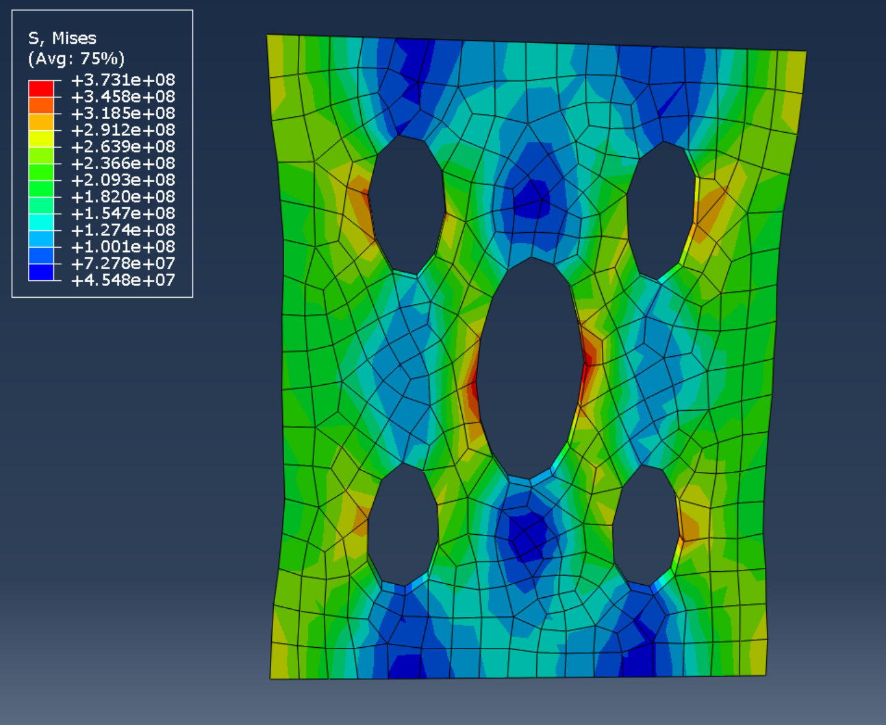
    <figcaption><strong>(b)</strong> h = 1.2</figcaption>
  </figure>
  <figure style="text-align: center; margin: 0;">
    
    <figcaption><strong>(c)</strong> h = 0.8</figcaption>
  </figure>
  <figure style="text-align: center; margin: 0;">
    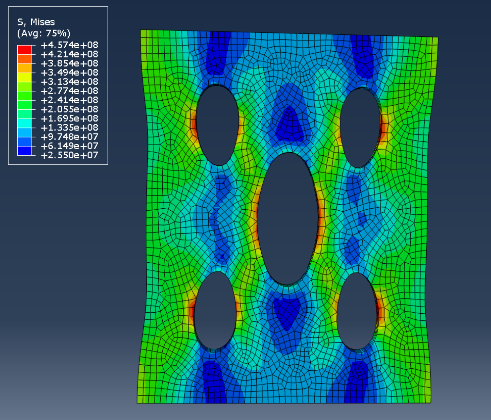
    <figcaption><strong>(d)</strong> h = 0.4</figcaption>
  </figure>
  <figure style="text-align: center; margin: 0;">
    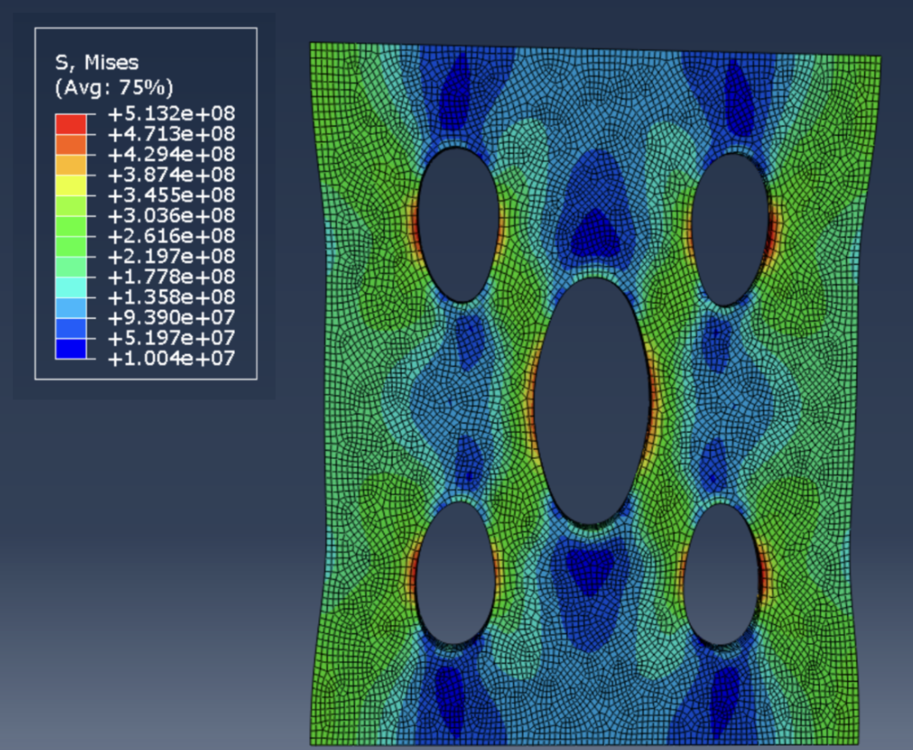
    <figcaption><strong>(e)</strong> h = 0.2</figcaption>
  </figure>
  <figure style="text-align: center; margin: 0;">
    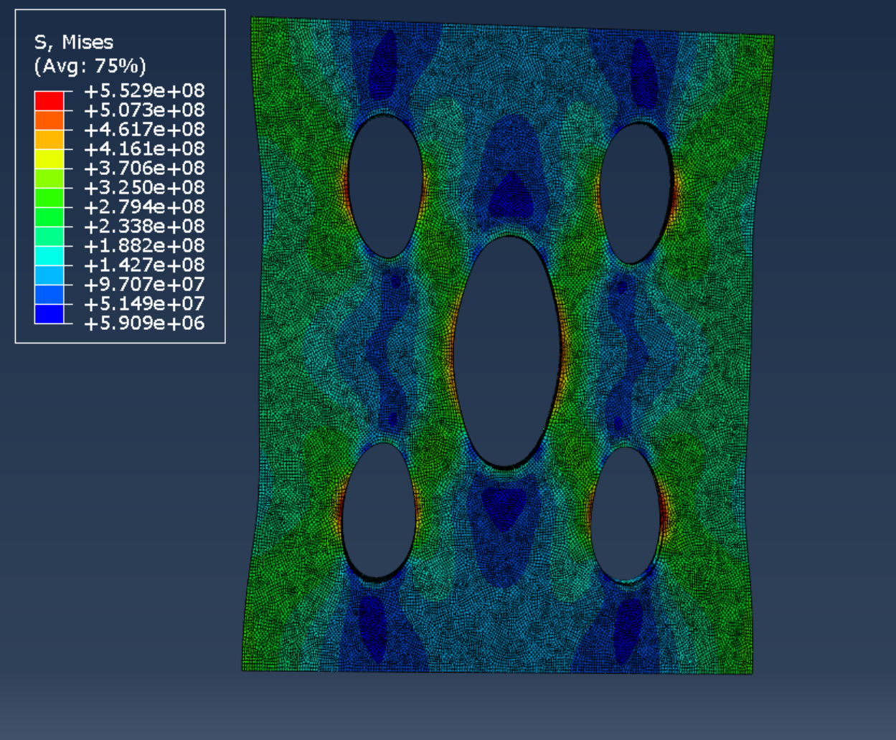
    <figcaption><strong>(f)</strong> h = 0.1</figcaption>
  </figure>
</div>

*Mesh refinement study showing progressively finer discretization with decreasing element size*

Some simple estimates for adequate FEM meshes do indicate that the observed convergence behavior that was observed for this viscoelastic material is indeed consistent with classical a priori error estimates for FEM. Under standard assumptions, the error in the energy norm satisfies:

$$
\|u - u^h\|_{E(\Omega)} \leq C(u,p) h^{\min(r-1,p) \triangleq \gamma}
$$

where $h$ denotes the characteristic element size, and $\gamma$ depends on the interpolation polynomial's order and $C$ denotes the regularity or smoothness of the solution. Using the PMPE formulation, we have:

$$
\|u - u^h\|^2_{E(\Omega)} = 2(\mathcal{J}(u^h) - \mathcal{J}(u))
$$

Consequently, solutions computed on successively refined meshes yield monotonically decreasing energy errors, consistent with the increasing peak stresses observed. Note that $\mathcal{J}(w) \triangleq \frac{1}{2}\mathcal{B}(w,w) - \mathcal{F}(w)$, $w \subset H^1(\Omega)$ is any kinematically admissible function, and $\mathcal{B}$ is the bilinear form of internal energy, and $\mathcal{F}$ is the linear functional or external work.

We note that stress evidently asymptotically converges to a value of $5.53 \times 10^8$ as we refine the mesh by a factor of $40\times$ ($h=4$ to $h=0.1$).

### Finite Element Setup for Complex Geometries

#### Cylinder Extension Test

A cylindrical geometry with an initial length of 100 units and a diameter of 6 was subjected to a predefined extension of 80 units applied over 10 seconds in the $U_3$ or axial direction. The boundary conditions are as follows: one end of the cylinder was fixed and the displacement was imposed on the opposite face. This was done for both the hyperelastic and viscoelastic case.

<div style="display: grid; grid-template-columns: repeat(2, 1fr); gap: 16px; margin: 24px 0;">
  <figure style="text-align: center; margin: 0;">
    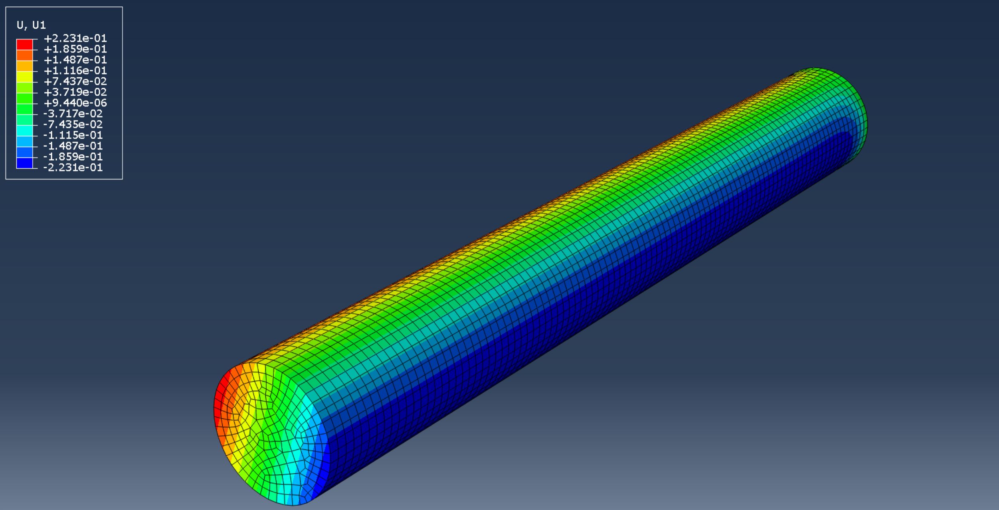
    <figcaption><strong>(a)</strong> Viscoelastic response: u₁ displacement</figcaption>
  </figure>
  <figure style="text-align: center; margin: 0;">
    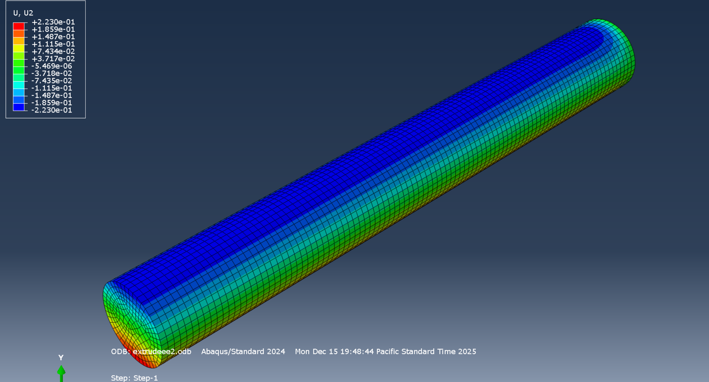
    <figcaption><strong>(b)</strong> Viscoelastic response: u₂ displacement</figcaption>
  </figure>
  <figure style="text-align: center; margin: 0;">
    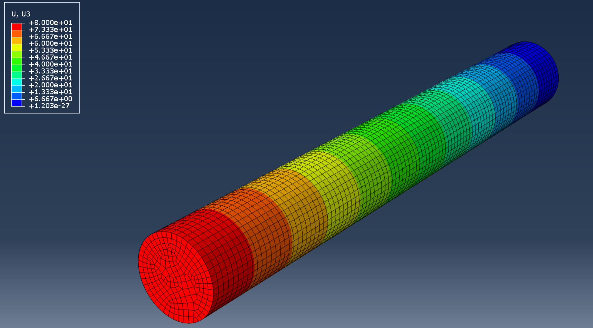
    <figcaption><strong>(c)</strong> Viscoelastic response: u₃ displacement</figcaption>
  </figure>
  <figure style="text-align: center; margin: 0;">
    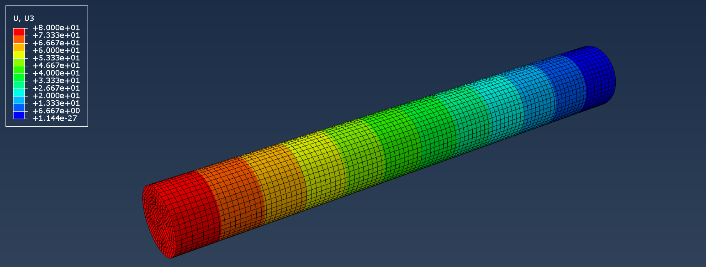
    <figcaption><strong>(d)</strong> Hyperelastic response: u₃ displacement</figcaption>
  </figure>
  <figure style="text-align: center; margin: 0;">
    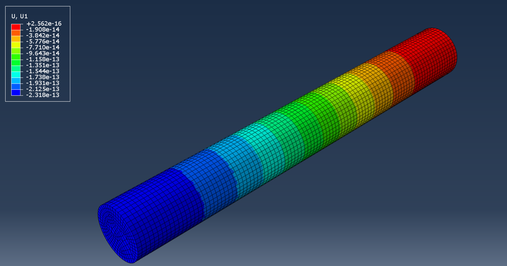
    <figcaption><strong>(e)</strong> Hyperelastic response: u₁ displacement</figcaption>
  </figure>
  <figure style="text-align: center; margin: 0;">
    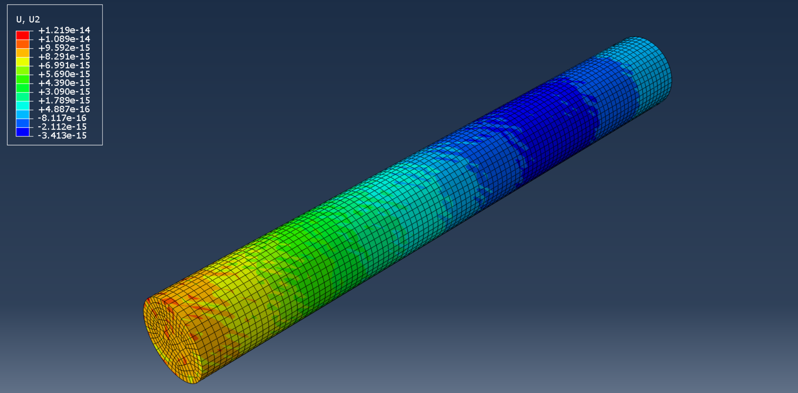
    <figcaption><strong>(f)</strong> Hyperelastic response: u₂ displacement (final timestep)</figcaption>
  </figure>
</div>

*Comparison of viscoelastic and hyperelastic displacement responses under identical loading conditions for cylinder*

In the viscoelastic case, there is a noticeable radial displacement during axial loading, characterized by the contraction in the transverse directions of $U_1$ and $U_2$. This radial contraction develops concurrently with the imposed axial displacement and manifests as a clear displacement gradient across the cylinder. Something similar is observed in the one-element test which indicates that this response actually originates from the constitutive formulation rather than some geometric or numerical artifact in computation.

The hyperelastic case actually shows negligible transverse displacement with radial displacements that are negligible. This confirms that hyperelastic material does not produce any meaningful radial contraction. We hypothesize that the radial contraction arises from the rate-dependent viscous term of the Kelvin-Voigt model, coupling the axial deformation to the transverse observation seen in ABAQUS. Thus, the contraction in the viscoelastic case manifests itself as a constitutive effect of viscoelastic materials.

#### 5-Hole Plate Test

<div style="display: grid; grid-template-columns: repeat(2, 1fr); gap: 16px; margin: 24px 0;">
  <figure style="text-align: center; margin: 0;">
    
    <figcaption><strong>(a)</strong> 5-hole plate with hyperelastic behavior</figcaption>
  </figure>
  <figure style="text-align: center; margin: 0;">
    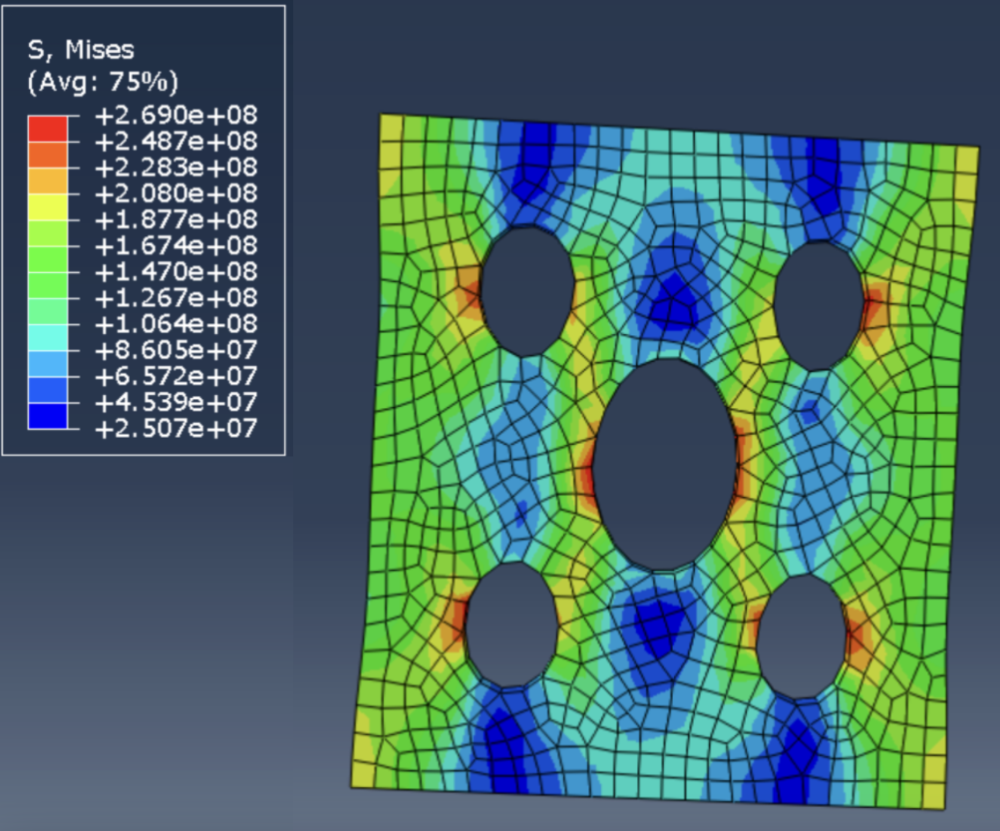
    <figcaption><strong>(b)</strong> 5-hole plate with viscoelastic behavior</figcaption>
  </figure>
</div>

*Comparison of deformation and stress fields in a 5-hole plate*

For the 5-hole plate geometry, we subjected it to a uniaxial displacement loading to both the viscoelastic and hyperelastic materials. The viscoelastic model exhibited consistently lower stresses than the hyperelastic model. This reduction arises from the additional viscous contribution in the constitutive law, modeled by the dashpot. This introduces that rate-dependent energy dissipation factor and can effectively attenuate stress magnitudes during loading. As a result, both the peak von Mises stress and overall stress concentrations around the holes are reduced in the viscoelastic case in comparison to the purely hyperelastic one.

Consequently, the deformation of the holes is less pronounced in the viscoelastic plate. The reduced stress levels lead to smaller strains and diminished stretching at the boundaries of the holes. As in classical mechanics, we know that stress and strain are only related linearly in a small regime i.e. small strain case, this trend still makes itself to be apparent even under larger finite deformation: the viscous response limits the accumulation of elastic energy and suppresses extreme local deformation. Consequently, the viscoelastic formulation will produce a more distributed and stabilized stress field relative to the hyperelastic case.

---

## ABAQUS/Explicit Implementation: VUMAT Subroutine

To enable the use of our finite-strain Kelvin–Voigt viscoelastic model within commercial FEA software, we implemented a **VUMAT** (Vectorized User Material) subroutine in FORTRAN77 for ABAQUS/Explicit. This section describes the numerical implementation and algorithmic structure.

### Hyperelastic Baseline Simulation

Before implementing the full viscoelastic model, we verified the hyperelastic component independently. The video below demonstrates a hyperelastic simulation in ABAQUS:

<video controls style="width: 100%; max-width: 800px; display: block; margin: 24px auto; border-radius: 8px;">
  <source src="images/hyperelastic.mp4" type="video/mp4">
  Your browser does not support the video tag.
</video>

*ABAQUS/Explicit simulation of hyperelastic material response*

### VUMAT Architecture Overview

The VUMAT subroutine interfaces with ABAQUS/Explicit's explicit dynamics solver. Key input/output variables include:

| Variable | Description |
|:---------|:------------|
| `DEFGRAD_OLD`, `DEFGRAD_NEW` | Deformation gradient at previous and current time steps |
| `STRETCH_NEW` | Right stretch tensor $\mathbf{U}$ at current time |
| `STRESS_OLD`, `STRESS_NEW` | Cauchy stress at previous and current time steps |
| `STATE_OLD`, `STATE_NEW` | Internal state variables (plastic deformation, viscous stress history) |
| `PROPS` | Material properties array |
| `DT` | Time increment |

### Material Properties

The subroutine reads four material properties from the ABAQUS input file:

```fortran
youngs = props(01)    ! Young's modulus E
nu     = props(02)    ! Poisson's ratio ν
ka     = props(03)    ! Bulk viscosity κ
ma     = props(04)    ! Shear viscosity μ
```

From these, the elastic moduli are computed:

$$
\mu = \frac{E}{2(1+\nu)}, \quad \kappa = \frac{E}{3(1-2\nu)}
$$

### Algorithmic Steps

The VUMAT implementation follows these key algorithmic steps:

#### 1. Deformation Gradient Extraction

The deformation gradients $\mathbf{F}_t$ (old) and $\mathbf{F}_\tau$ (new) are extracted from ABAQUS arrays and assembled into 3×3 matrices:

```fortran
F_T(1,1) = DEFGRAD_OLD(KM,1)
F_T(2,2) = DEFGRAD_OLD(KM,2)
! ... (assembling full tensor)

F_tau(1,1) = DEFGRAD_NEW(KM,1)
! ... (assembling full tensor)
```

#### 2. Midpoint Approximation for Rate of Deformation

To compute the rate-of-deformation tensor $\mathbf{D}$, we use a **midpoint approximation** for improved accuracy:

$$
\mathbf{F}_{\text{avg}} = \frac{1}{2}(\mathbf{F}_\tau + \mathbf{F}_t)
$$

$$
\mathbf{L}_{\text{inc}} = (\mathbf{F}_\tau - \mathbf{F}_t) \cdot \mathbf{F}_{\text{avg}}^{-1}
$$

$$
\mathbf{D}_{\text{inc}} = \frac{1}{2}(\mathbf{L}_{\text{inc}} + \mathbf{L}_{\text{inc}}^\top)
$$

```fortran
do i = 1, 3
  do j = 1, 3
    Finc(i,j) = F_tau(i,j) - F_T(i,j)
    F_avg(i,j) = 0.5d0 * (F_tau(i,j) + F_T(i,j))
  end do
end do

call matinv(F_avg, F_avg_inv, dtmp)

! Compute velocity gradient increment
do i = 1, 3
  do j = 1, 3
    Linc(i,j) = 0.d0
    do k = 1, 3
      Linc(i,j) = Linc(i,j) + Finc(i,k) * F_avg_inv(k,j)
    end do
  end do
end do

Dinc = 0.5d0 * (Linc + transpose(Linc))
```

#### 3. Spectral Decomposition for Logarithmic Strain

The elastic logarithmic (Hencky) strain is computed via spectral decomposition of the right Cauchy-Green tensor:

$$
\mathbf{C} = \mathbf{F}^\top \mathbf{F} = \sum_{i=1}^{3} \lambda_i^2 \, \mathbf{n}_i \otimes \mathbf{n}_i
$$

$$
\mathbf{E}_e = \frac{1}{2} \ln \mathbf{C} = \sum_{i=1}^{3} \ln(\lambda_i) \, \mathbf{n}_i \otimes \mathbf{n}_i
$$

```fortran
call SPECTRAL(matmul(transpose(Fe), Fe), eigvals, eigvecs)
       
Ee = matmul(matmul(eigvecs, 
     0.5d0*reshape((/dlog(eigvals(1)),z,z,z,dlog(eigvals(2)),z,z,z, 
     dlog(eigvals(3)) /), (/3, 3/))), transpose(eigvecs))
```

#### 4. Elastic Stress (Neo-Hookean)

The elastic portion follows a Neo-Hookean hyperelastic model:

$$
\mathbf{T}^e = \frac{1}{J} \mathbf{R}_e \left( 2\mu \, \mathbf{E}_e^0 + \kappa \, \text{tr}(\mathbf{E}_e) \, \mathbf{1} \right) \mathbf{R}_e^\top
$$

where $\mathbf{E}_e^0$ is the deviatoric part of the elastic strain.

```fortran
tr_Ee = Ee(1,1) + Ee(2,2) + Ee(3,3)
Ee0 = Ee - (tr_Ee/3.d0) * I_1

Te_sph = kappa * tr_Ee
Te_0 = 2.d0 * mu * Ee0
```

#### 5. Viscous Stress Update

The viscous stress is updated incrementally based on the derived constitutive law:

$$
\Delta \mathbf{T}^v = 2\mu_v \, \mathbf{D}_{\text{inc}}^0 + \kappa_v \, \text{tr}(\mathbf{D}_{\text{inc}}) \, \mathbf{1}
$$

$$
\mathbf{T}^v_\tau = \mathbf{T}^v_t + \Delta \mathbf{T}^v
$$

```fortran
tr_Dinc = Dinc(1,1) + Dinc(2,2) + Dinc(3,3)
D_dev_inc = Dinc - (tr_Dinc)/3.d0 * I_1

Delta_Tvis = 2.d0*ma*D_dev_inc + ka*tr_Dinc*I_1
Tvis_tau = Tvis_old + Delta_Tvis
```

#### 6. Total Cauchy Stress

The total Cauchy stress combines elastic and viscous contributions:

$$
\mathbf{T} = \mathbf{T}^e + \mathbf{T}^v
$$

```fortran
T_tau = matmul(Re_tau, matmul(Te_0 + I_1*Te_sph, 
        transpose(Re_tau)))/det_Fe + Tvis_tau
```

### State Variable Management

The subroutine maintains internal state variables across time steps:

| State Variables | Description |
|:----------------|:------------|
| `STATE(1:9)` | Plastic deformation gradient $\mathbf{F}^p$ (identity for viscoelasticity) |
| `STATE(10:18)` | Deviatoric Mandel stress |
| `STATE(21:29)` | Viscous stress tensor $\mathbf{T}^v$ |

### Helper Subroutines

The implementation includes three essential helper routines:

1. **`MATINV`**: Computes the inverse and determinant of a 3×3 matrix using the adjugate formula
2. **`SPECTRAL`**: Performs spectral decomposition using Jacobi iteration
3. **`JACOBI`** / **`EIGSRT`**: Compute eigenvalues/eigenvectors and sort them in ascending order

<details>
<summary><strong>Full VUMAT Source Code (Click to Expand)</strong></summary>

```fortran
      SUBROUTINE VUMAT (
!      Read only (unmodifiable) variables :-
     +                    NBLOCK, NDIR, NSHR, NSTATEV, NFIELDV,
     +                    NPROPS, LANNEAL, STEP_TIME, TOTAL_TIME,
     +                    DT, CMNAME, COORD_MP, CHAR_LENGTH, PROPS,
     +                    DENSITY, STRAIN_INC, REL_SPIN_INC,
     +                    TEMP_OLD, STRETCH_OLD, DEFGRAD_OLD,
     +                    FIELD_OLD, STRESS_OLD, STATE_OLD, 
     +                    ENER_INTERN_OLD, ENER_INELAS_OLD, TEMP_NEW,
     +                    STRETCH_NEW, DEFGRAD_NEW, FIELD_NEW, 
!      Read and write (modifiable) variables :-
     +                    STRESS_NEW, STATE_NEW, ENER_INTERN_NEW,
     +                    ENER_INELAS_NEW)
     
      INCLUDE 'VABA_PARAM.INC'
      
      DIMENSION COORD_MP(NBLOCK,*),CHAR_LENGTH(NBLOCK), PROPS(NPROPS),
     +       DENSITY(NBLOCK), STRAIN_INC(NBLOCK,NDIR+NSHR), 
     +       REL_SPIN_INC(NBLOCK,NSHR), TEMP_OLD(NBLOCK), 
     +       STRETCH_OLD(NBLOCK,NDIR+NSHR),
     +       DEFGRAD_OLD(NBLOCK,NDIR+NSHR+NSHR), 
     +       FIELD_OLD(NBLOCK,NFIELDV), STRESS_OLD(NBLOCK,NDIR+NSHR),
     +       STATE_OLD(NBLOCK,NSTATEV), ENER_INTERN_OLD(NBLOCK),
     +       ENER_INELAS_OLD(NBLOCK), TEMP_NEW(NBLOCK), 
     +       STRETCH_NEW(NBLOCK,NDIR+NSHR), 
     +       DEFGRAD_NEW(NBLOCK,NDIR+NSHR+NSHR), 
     +       FIELD_NEW(NBLOCK,NFIELDV), STRESS_NEW(NBLOCK,NDIR+NSHR),
     +       STATE_NEW(NBLOCK,NSTATEV), ENER_INTERN_NEW(NBLOCK),
     +       ENER_INELAS_NEW(NBLOCK)

      character*8 CMNAME
      integer  km

      real*8 F_t(3,3),F_tau(3,3),Fdot(3,3),U_tau(3,3),U_inv(3,3), det_U,R_tau(3,3)
      real*8 T_tau(3,3), Ee(3,3), det_F, E_tau(3,3), Re_tau(3,3)
      real*8 Fp_t(3,3), Fp_tau(3,3), Fe(3,3), eigvecs(3,3), eigvals(3) 
      real*8 nu_p, tau,  I_1(3,3), Dp(3,3), Te_0(3,3), stretches(3,3)
      real*8 Fp_inv(3,3), Ee0(3,3), tr_Ee, dtmp, D_dev_tau(3,3)
      real*8 L_tau(3,3), D_tau(3,3), tr_D_tau, F_tau_inv(3,3)
      real*8 det_Fe, zero_m(3,3),  snake, z, Ue_inv(3,3),Tvis_tau(3,3)
      real*8 mu, kappa, dens_p,  excess, Te_sph, youngs, nu, tens_yield
      real*8 F_inv(3,3), shear_yield, visc_ext, Ep(3,3), visc
      real*8 Finc(3,3), Linc(3,3), Dinc(3,3), tr_Dinc, D_dev_inc(3,3)
      real*8 Delta_Tvis(3,3), Tvis_old(3,3), F_avg(3,3), F_avg_inv(3,3)
      
      parameter(ONE=1., ONE_HALF=0.5, TWO=2., ZERO=0.,
     +                ONE_THIRD=1./3., TWO_THIRD=2./3.,
     +                THREE_HALF=1.5, THREE=3.)

        I_1 = reshape((/1, 0, 0, 0, 1, 0, 0, 0, 1 /), (/3,3/))
        Zero_m = reshape((/0, 0, 0, 0, 0, 0, 0, 0, 0 /), (/3,3/))
        z=0.d0

      ! Material properties from input file
        youngs = props(01)
        nu     = props(02)
        ka     = props(03)
        ma     = props(04)
        
        mu=youngs/(2.d0*(1.d0+nu))
        kappa=youngs/(3.d0*(1.d0-2.d0*nu))

      do km = 1,NBLOCK
        ! ... (main computation loop)
        ! See full implementation for details
      end do

      return
      end
```

</details>

---

## Conclusion

In all, we developed a thermodynamically consistent finite-strain Kelvin–Voigt viscoelastic model and implemented it within a 3D finite element framework. Starting from fundamental kinematic and thermodynamic principles, we derived constitutive equations that cleanly separate elastic energy storage from viscous dissipation while satisfying frame indifference and the second law of thermodynamics. A sequence of numerical tests—including one-element verification, mesh refinement studies, and simulations on complex geometries—confirmed the correctness, stability, and convergence of the implementation. Comparisons with hyperelastic responses highlighted the physically meaningful role of viscosity in redistributing stress, attenuating peak stresses, and introducing rate-dependent deformation effects. Overall, the model provides a robust and tractable foundation for simulating finite-deformation viscoelastic behavior and can be readily extended to more complex rheological models or coupled multiphysics applications.

---

## References

1. Boltzmann, L. (1874). Zur Theorie der elastischen Nachwirkung. *Sitzungsberichte der Mathematisch-Naturwissenschaftlichen Classe der Kaiserlichen Akademie der Wissenschaften*.

2. Lee, E. H., & Ferry, J. D. (1960). Foundations of viscoelastic constitutive relations.

3. Gross, B. (1953). *Mathematical Structure of the Theories of Viscoelasticity*. Hermann, Paris.

4. Leaderman, H. (1957). Rheological response functions and their interpretation.

5. Love, A. E. H. (1956). *A Treatise on the Mathematical Theory of Elasticity*.

6. König, H., & Meixner, J. (1958). Axiomatic foundations of viscoelastic theory.

7. Zohdi, T. I. (2017). *Introduction to Computational Continuum Mechanics*. Oxford University Press.

8. Gurtin, M. E., Fried, E., & Anand, L. (2010). *The Mechanics and Thermodynamics of Continua*. Cambridge University Press.
