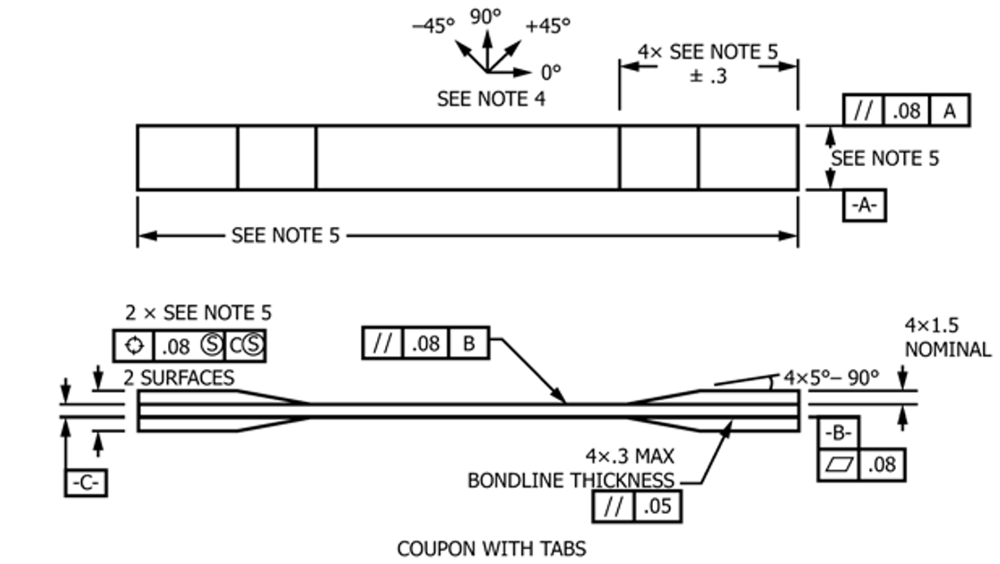
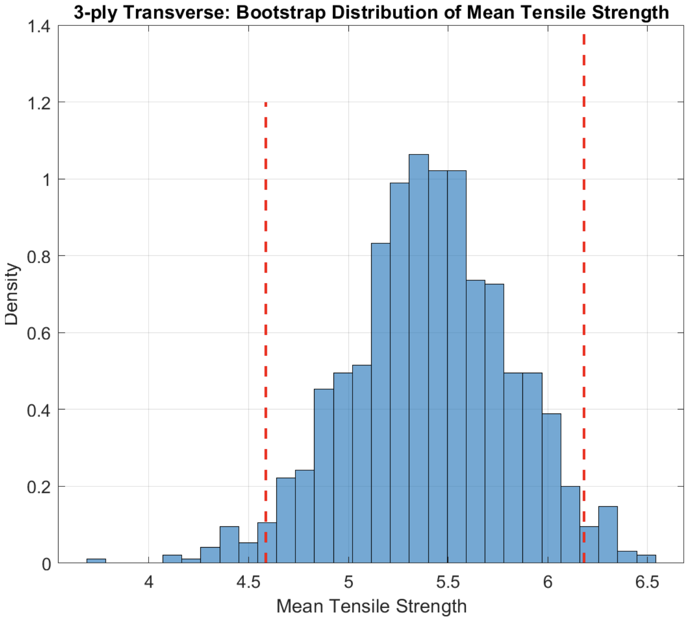
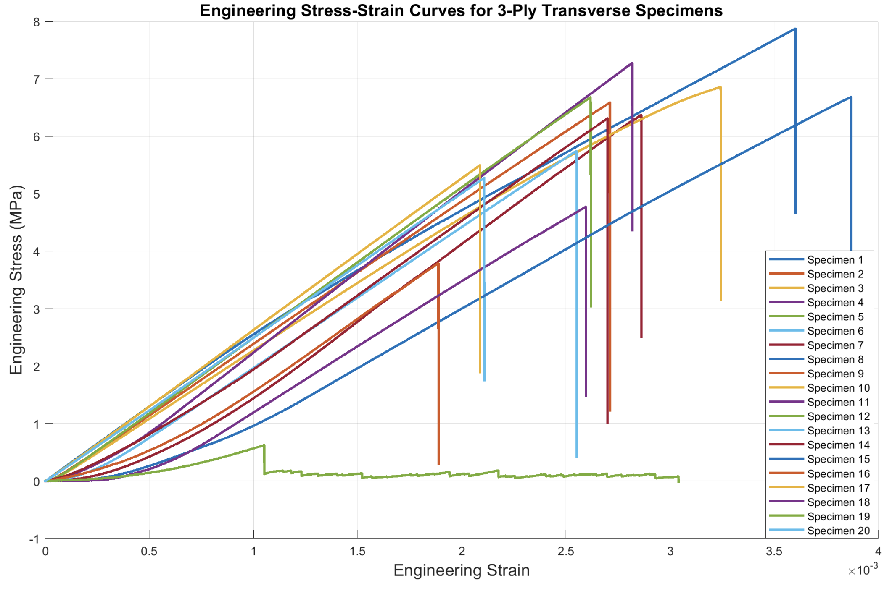
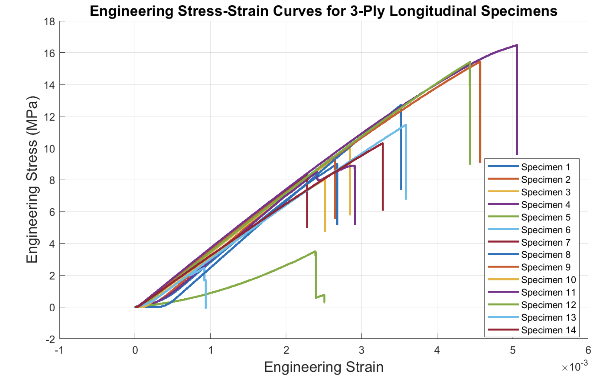
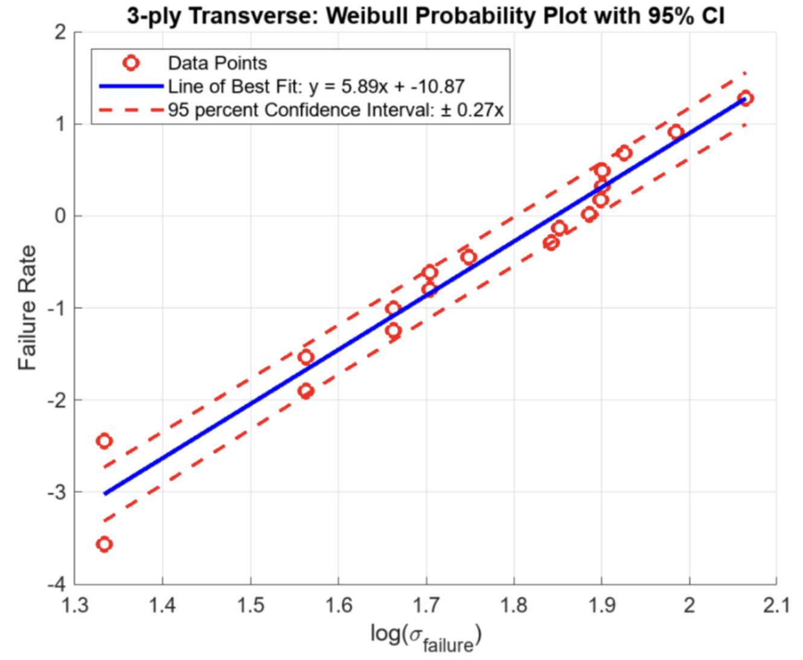
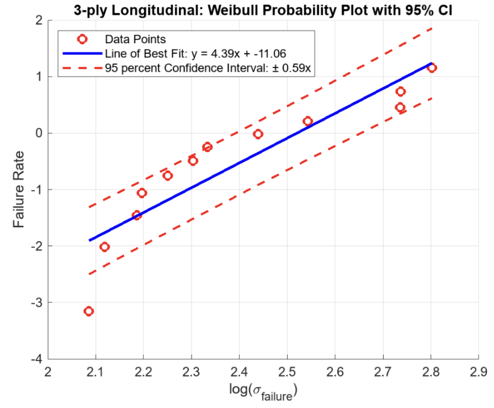
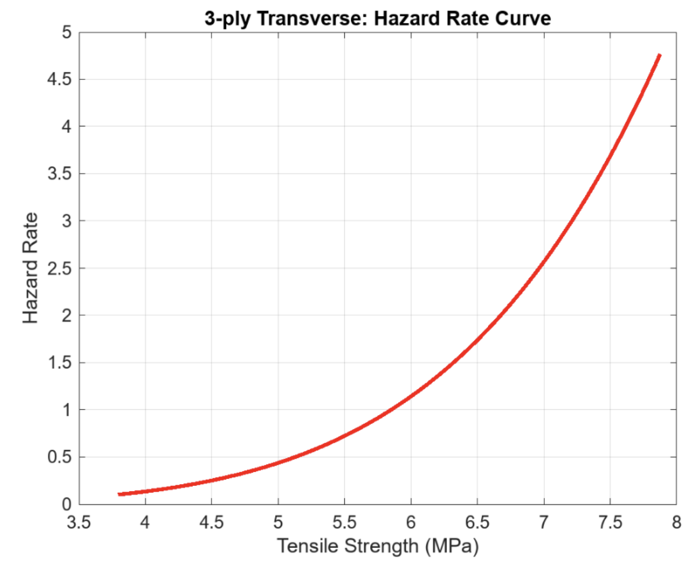
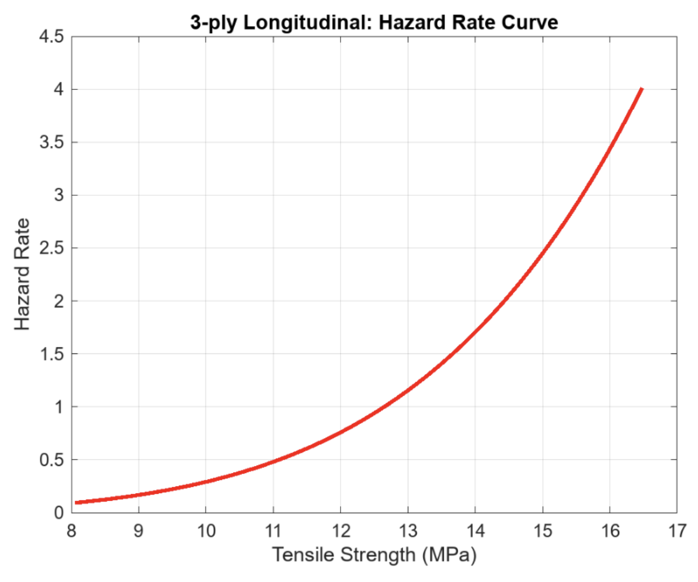
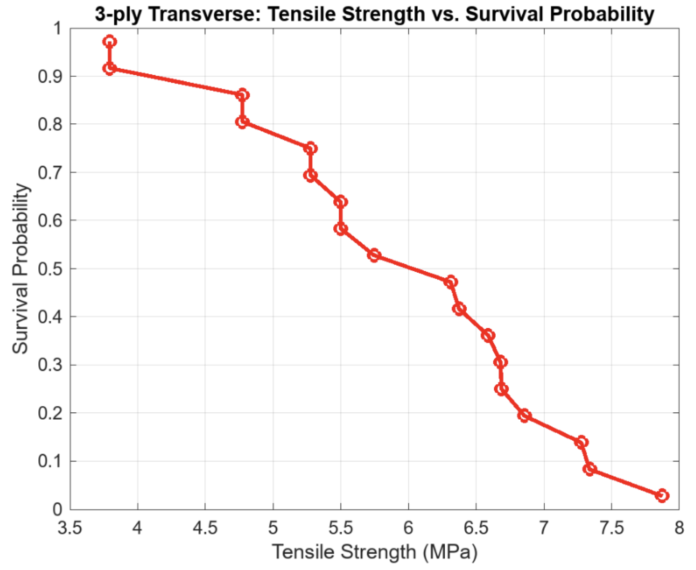

**Keywords:** Carbon Fibre Laminate, Composites, Tensile Behavior, Weibull Statistic, Material Properties

---

## Abstract

The research conducted focused on examining the unique properties of carbon fiber K13C2U, particularly its behavior under quasi-static tensile conditions. A total of 14 3-ply longitudinal laminates and 20 3-ply transverse laminates were subjected to tensile tests using a standard gauge length of $7\times 1$ inches, as specified by ASTM. Tests spanned 3-ply specimens and a $0^\circ/90^\circ/0^\circ$ orientation. The study aimed to understand the mechanical properties of the laminates, including tensile strength and modulus of elasticity, and to examine how different test quantities influence these properties. A significant observation was the dispersion of the tensile characteristics and random fracture processes, a common trait of brittle materials. To understand this, we applied rigorous statistical tools, including the Weibull distribution at the 95% confidence interval and a Kruskal-Wallis H Test at the 5% significance level. We used this to determine Weibull transverse and longitudinal moduli of 5.89 and 4.39, respectively. These were then used to calculate an overall composite modulus for each, respectively: 2.26 GPa and 3.33 GPa. We compared this to the manufacturer's claims for the transverse. The material properties are approximately the same, though there are slight variations due to manufacturing and testing processes and the condition of the prepreg.

---

## Introduction

Carbon fiber laminates are critical in advanced engineering applications due to their excellent strength-to-weight ratio. In the development of the Electron-Ion Collider (EIC) at Lawrence Berkeley National Laboratory (LBNL), the carbon fiber laminates play a vital role as structural components in the detector. It is part of the collider's tracking and detection system, which is responsible for observing/analyzing particles produced in high-energy collisions. The laminates must provide structural rigidity to support the weight of the sensors and hardware without becoming misaligned or distorted while also being lightweight to avoid adding extra mass and compromising the collider's efficiency. Although carbon fiber laminates are widely used, there is limited empirical data on extremely thin K13C2U laminates and how orientation affects tensile performance under specific conditions.

Even the ASTM does not have a standard for testing thin laminates! In this study, we will evaluate the mechanical performance of the laminates under tensile loading and explore the relationship between orientation and tensile strength. The original experiment included a factorial design of experiments that focused on two independent variables: i) laminate orientation and ii) the thickness (plies). Now, we will only assess orientation. To evaluate the mechanical performance of these laminates, an Instron was used. The machine enabled precise control/measurement of the forces applied to the material, ensuring accurate results for its tensile strength, stiffness, and fracture behavior. The experimental results from the controlled environment will then be compared with the theoretical results to identify any deviations from the expected outcomes. As directed by LBNL, a 3-ply carbon fiber laminate (K13C2U) with a $0^\circ/90^\circ/0^\circ$ cut orientation was manufactured, and tensile tests were performed. The specimens are cut along (longitudinal) and across (transverse) the grains to assess variability. Apart from verifying theoretical values, a practical application of our testing would be to determine the optimal use of the carbon fiber laminate K13C2U in load-bearing applications.

---

## Material Methods

An Instron universal testing machine [6800 Series] (Instron, Norwood, Massachusetts) with the Wedge Action Tensile Grip as well as a 100 kN load cell was utilized to test the tensile strengths of the carbon fiber laminates as shown in Figure 1. The Instron was set to displace the specimens at a rate of 0.1 mm/min.

*Figure 1: Quasi-static tensile testing setup using an Instron 6800 with wedge action tensile grips for thin carbon fibre laminate specimens.*

### Carbon Fiber Laminate Preparations

The carbon fiber laminates are $11 \times 1$ inches, 3-ply, and $0^\circ/90^\circ/0^\circ$ oriented. According to an LBNL specification sheet, the surface texture thickness of the specimen is 0.0700 mm on both sides, measured with a peel-ply surface. Each cure ply thickness is 23.9 μm, leading to a 3-ply laminate thickness of 71.6 μm. The samples are manufactured by debulking prepreg K13C2U cuts in the $0^\circ/90^\circ/0^\circ$ orientation in a clean environment. The uncooked part is then placed in a vacuum bag with thermocouples. These bags are placed in an autoclave and baked under pressure to cure the resin. The cooked samples (cut into $12 \times 12$ squares) are then cut into $1 \times 1$ strips and sanded to remove any imperfections that could create a weak point.

50 of the 3-ply carbon fiber laminate specimens have been manufactured, along with 15 of the 15-ply carbon fiber laminate specimens. Tensile tests were performed on 20 specimens cut in the transverse direction and 14 specimens cut in the longitudinal direction. Complications in wedge manufacturing limited the amount of laminates tested.

### Design and Manufacturing of the Wedges

Due to the restrictions on the thickness of the corrugated carbon fiber laminates, wedges are needed to grip the samples for testing using an Instron. Wedges with specifications of $1.4 \times 1$ inches and a thickness of 0.06 inches, according to ASTM D3039 standards, were manufactured from stainless steel and bonded to the laminates with epoxy on both ends, allowing the wedges to be reused in future tests. Figure 2 shows toleranced drawings for coupons with tabs required for testing carbon-fibre laminates.

*Figure 2: Geometry and dimensional specifications of the tensile coupon with bonded tabs used for quasi-static testing, adapted from ASTM D3039, showing fibre orientation reference, tab geometry, bondline thickness, and datum definitions.*

Stainless steel wedges were cut into rectangles of the aforementioned dimensions ($1.4 \times 1.1 \times 0.06$ inches) and then set at an angle of 7° and milled into a wedge shape. The wedges are then sanded, cleaned, and primed with scotchbrite for gluing onto the carbon fiber strips using Hysol 9309 two-part glue.

*Figure 3: Close-up view of a thin carbon fibre laminate specimen, illustrating the laminate edge profile and ply stacking prior to tensile testing.*

### Alternative Designs of the Wedges

As previously mentioned, the time required to manufacture and adhere the wedges to the specimens is hugely time-consuming. Alternative methods and approaches were considered and tried as outlined below.

The primary factor that hindered progress was the adherence process for the epoxy resins to cure overnight. An alternative was to use tape to secure the wedges with the specimen, and the Instron's compressive force would be enough to prevent slipping. However, during the tensile test, the force-displacement diagram showed significant slippage, rendering this method unreliable.

Another approach was to use sandpaper to grip the specimens rather than using wedges. Due to the thinness of the laminates, however, concerns arose regarding the jaws of the Instron being in contact with each other. A solution was to insert an aluminum shim between the jaws and the sandpaper to create more spacing; however, this proved unsuccessful due to the abrasive nature of the sandpaper, which wore down the specimen when gripped, weakening the laminates at their ends and subjecting the specimen to early fracture. The final method attempted was to manufacture the wedges from 1/16 inch plywood and then adhere them to the specimen using Krazy Glue. These wedges were designed and manufactured with a laser cutter, sanded to the exact specifications as the metal wedges, and, ostensibly, worked as well as the metal wedges, with the benefit of a quicker, more reusable end product.

### Mechanical Testing and Clamps

During tensile testing, one must be careful when loading the samples to ensure they do not rip along the grip due to the wedges' geometry and the fragility of the laminates. Once the upper fixture grips the specimen, it is crucial to protect it before engaging the lower grip to avoid any potential damage or misalignment. This protection ensures the specimen is stabilized adequately before the lower grip secures it, allowing for accurate and safe testing. Before the lower grip clamps the specimen, the Instron is zeroed such that the displacement and force readings are zero. Once the lower grip clamped the sample wedges, the force was again zeroed, resulting in a display reading of less than 5 N.

ASTM D3039/D3039M lists the procedure for inserting samples into the grips: to "align the long axis of the gripped specimen with the test direction." Each specimen was displaced at a rate of 0.1 mm/min until failure. Specimen failures fall under 3 types of failure: i) Fracture due to stress concentrations in the clamps; ii) Two fractures along gauge length; iii) Single fracture in the middle of specimen.

*Figure 4: Representative carbon fibre laminate tensile specimens with bonded end tabs prior to testing. Specimens are labeled for identification, and a ruler is shown for scale.*

*Figure 5 (Continued): Representative carbon fibre laminate tensile specimens with bonded end tabs prior to testing.*

Unfortunately, there was an addendum in the policy with the Hesse Machine Shop before our final round of testing. Testing of carbon fiber laminates was banned due to the potential hazards posed by carbon fiber dust particles, which can lead to fibrosis. Thus, we were unable to perform additional testing for the thicker 15-ply laminates.

---

## Weibull Statistical Analysis

Unlike metals, carbon fiber laminates are brittle and have low fracture toughness. Similar to other brittle materials, plasticity at the crack tip is very limited, so the material fails by fast fracture. Even though many other investigations of brittle materials have also applied similar formulations to carbon fibers, making it well documented in the world of material testing, the decision to use a specific model to depict the distribution of tensile strengths at failure always deserves some justification.

Weibull analysis, which accounts for data randomness, is thus frequently used in fragile materials, as the distribution of damage plays an important role in the fracture process. Consequently, variations in crack length in each sample show a statistical variation in strength as given by:

$$\sigma\_{\text{TS}}\approx \frac{K\_{IC}}{\sqrt{\pi a\_c}}$$

where TS denotes the tensile strength, $K\_{IC}$ is the fracture toughness in mode I (tension) loading, and $a\_c$ is the critical crack length. Multiple tensile tests will produce a distribution of strength. Determining the Weibull shape parameter or modulus ($m$) is necessary for determining the survival rate probability given by the simplified equation:

$$P\_s(V)=\exp\left(-\frac{1}{\sigma\_0^mV\_0}\int\_V \sigma^m dV\right)=\exp\left(-\frac{V}{V\_0}\left(\frac{\sigma}{\sigma\_0}\right)^m\right)$$

10 or more tests are required to make a Weibull modulus estimation; 30 tests are required to make a statistically sound estimation. We can estimate the Weibull parameters in 2 ways:

**i) Least-squares approach** by first taking natural logarithms of the Weibull CDF and then performing a linear regression:

$$F(x)=1-\exp\left(-\left(\frac{x}{\lambda}\right)^m\right)$$

$$\ln(-\ln(1-F(x)))=m\ln(x)-m\ln(\lambda)$$

**ii) Maximum Likelihood Estimation (MLE)** approach involves maximizing the likelihood function of the Weibull PDF:

$$\max L(m, \lambda)=\max \prod\_{i=1}^n f(x\_i; m, \lambda)$$

In this paper, we utilize the LS approach in determining the parameters; however, for the K-S test, we use the MLE approach. Both methods yield similar results but the MLE achieves the Cramér-Rao lower-bound when $n \to \infty$.

### Bootstrapping for Weibull Analysis

In some circumstances, we can analytically determine the sampling distributions of a statistic. However, it is generally not possible to derive the sampling distribution for any arbitrary statistic, in our case, the mean tensile strength, due to the intractability of the problem.

Since our sample size is less than 30 (but i.i.d.) for each of the laminates, we cannot use the central limit theorem to assume the sampling distribution as normal. Even though K-S and Levene's tests validate a Weibull distribution, the estimates of the scale parameters for a Weibull distribution would have significant bias or variability and thus be difficult to derive a sampling distribution analytically using an MLE approach.

In this case, we resort to simulation to estimate the sampling distribution and obtain statistically viable Weibull modulus and shape parameters. We used the Monte Carlo algorithm for resampling, given a sample $x\_1, \dots, x\_n$:

1. Resample the data with replacement. The size of the resample must be equal to the size of the original data set to get $x\_{\pi(1)},\dots,x\_{\pi(n)}$ where $\pi$ is an $n\times1$ vector of independently and uniformly sampled from $1, \dots, n$
2. Calculate the statistic of interest, $t(x\_{\pi(1)},\dots,x\_{\pi(n)})$
3. Repeat (1) and (2) many times to get a bootstrap distribution of the statistic.

*Figure 6: Bootstrapped sampling distribution of the mean tensile strength for 3-ply transverse carbon fibre laminates. The dashed red lines indicate the 95% confidence interval of the estimated mean.*

Our bootstrapped data in Figure 6 shows the density of estimated tensile strengths. We used bootstrap sampling to select 2 points for the transverse yield strength and 6 points for the longitudinal yield strength to perform the Kruskal-Wallis test.

---

## Results and Discussion

### Combined Stress-Strain Plot (3-ply transverse)

*Figure 7: Engineering stress–strain curves for 3-ply transverse carbon fibre laminate specimens under quasi-static tensile loading. Individual curves correspond to separate specimens.*

In Figure 7, the strength-strain relationship of the 3-ply carbon fiber laminates under tensile stress is illustrated. These curves exhibit a two-phase behavior; initially, as tension is applied, the laminate exhibits a nearly straight-line response which represents the stretch and internal reconfiguration of its microstructure. As the specimens stretch, the fiber resists the pull with a more pronounced linear behavior until a sharp drop in stress at their respective fracture points, indicating the brittleness. The first phase is a non-linear zone for strains between 0% and 0.06%, followed by a second phase, a near-vertical drop in stress which is indicative of the specimen fracturing. The outliers in our transverse specimen data were specimens 5 and 19, which have a significantly lower stress/strain due to premature failure where crack-bridging was at play.

### Combined Stress-Strain Plot (3-ply longitudinal)

*Figure 8: Engineering stress–strain curves for 3-ply longitudinal carbon fibre laminate specimens under quasi-static tensile loading. Individual curves correspond to separate specimens and show increased stiffness and strength relative to the transverse orientation.*

In Figure 8, the strength-deformation relationship of the 3-ply longitudinal carbon fiber laminates under tensile stress is illustrated. They similarly exhibit a two-phase behavior as the transverse. However, there is a significantly higher yield strength reached; roughly on average twice that of the transverse data.

There are two outliers in our data, namely specimens 5 and 6. This is most likely due to the nature of the grips we were using. The metal wedges for specimens 5 and 6 were glued incorrectly. It was observed that one of the wedges on specimen 5 was placed upside down, while specimen 6 was glued to a wedge with remnants of a previous carbon fiber laminate.

### Statistical Analysis of Specimens

Following the experimentations, before conducting statistical tests, we need to verify the assumptions of normality and homogeneity of variances required for ANOVA. Additionally, the decision to use a model to depict the distribution of the strength at failure in carbon fibers deserves justification.

The conformity of tensile strength data to a Weibull distribution was evaluated using a Kolmogorov-Smirnov (K-S) test. The Shapiro-Wilk test (SW) was employed to assess whether the tensile strength data follows a normal distribution:

$$SW=\frac{\left(\sum\_{i=1}^n a\_ix\_{(i)}\right)^2}{\sum\_{i=1}^n(x\_i-\overline{x})^2}$$

For our tensile strength data:
- **Transverse laminates:** $SW=0.84$, $p=0.005$ at significance level 5%, which violates normality ($p<0.05$)
- **Longitudinal:** $SW=0.94$, $p=0.45$ at significance level 5%, $p>0.05$

Therefore, ANOVA cannot be used, and an alternative method must be considered. The homogeneity of variances across groups was evaluated using Levene's test:

$$L=\frac{N-k}{k-1}\cdot \frac{\sum\_{i=1}^k N\_i(\overline{Z}\_{i.}-\overline{Z\_{..}})^2}{\sum\_{i=1}^k\sum\_{j=1}^{N\_i}(Z\_{ij}-\overline{Z}\_{i.})^2}$$

For our data, $L=4.1$. Since $L>F\_{\alpha, k-1, N-k}$, the assumption of homoscedasticity was met.

Finally, we performed a Kolmogorov-Smirnov (KS) test to check whether the tensile strength data follows a Weibull distribution. The K-S test statistic:

$$D=\max\_x|S(x)-F(x;m,\lambda)|$$

The KS test statistic was calculated with a corresponding $p$-value of 0.297 for the transverse samples and 0.723 for longitudinal. Since $p>\alpha=0.05$, we fail to reject our null hypothesis that the tensile strength samples follow a Weibull Distribution.

### Weibull Probability Plots

*Figure 9: Weibull probability plot for 3-ply transverse carbon fibre laminate tensile strength data. Solid line is the maximum-likelihood Weibull fit, while dashed lines indicate the 95% confidence interval on the fitted distribution.*

The yield strengths align well with the LS-line of best fit, indicating moderate consistency in the failure strengths. The slope of the line ($m = 5.89$) represents the Weibull shape parameter, which reflects relatively low variability in material performance. For a typical carbon fiber material, the Weibull modulus falls between 5 and 8. In this case, a modulus of 5.89 falls within the expected range. The uncertainty is ±0.27, determined using the propagation of uncertainty.

*Figure 10: Weibull probability plot for 3-ply longitudinal carbon fibre laminate tensile strength data. Solid line is the maximum-likelihood Weibull fit, while dashed lines indicate the 95% confidence interval on the fitted distribution.*

Similarly, in Figure 10, we have the probability plot for our longitudinal data. The yield strengths follow the LS-line of best fit, indicating solid consistency with a Weibull shape parameter of 4.39 which is slightly less than what is expected.

### Hazard Rate Analysis

The hazard rate curve is helpful in indicating failure rate over time or strain:

$$HR=\frac{m}{S}\left(\frac{t}{S}\right)^{m-1}$$

where $m$ is the Weibull shape parameter, $S$ is the characteristic strength, and $t$ are the tensile strengths.

*Figure 11: Estimated hazard rate as a function of tensile strength for 3-ply transverse carbon fibre laminate specimens, derived from the fitted Weibull distribution.*

The hazard rate curve for 3-ply transverse shown in Figure 11 suggests that staying within a lower tensile strength range would reduce the risks of failure. Between 4-5 MPa, the hazard rate exponentially grew, suggesting that with higher tensile strengths, the specimens are more likely to fail.

*Figure 12: Estimated hazard rate as a function of tensile strength for 3-ply longitudinal carbon fibre laminate specimens, derived from the fitted Weibull distribution.*

### Kruskal-Wallis H Test for Comparison

To evaluate if a transverse or longitudinal fiber orientation plays a significant role in the tensile strength of carbon fiber laminates, a Kruskal-Wallis H test was performed. This non-parametric test was chosen because it does not require assumptions of normality.

**Hypotheses:**
- $H\_0$: There is no difference in the distributions of tensile strength for transverse and longitudinal orientations.
- $H\_a$: The distributions of tensile strength for transverse and longitudinal orientations are different.

The Kruskal-Wallis H test statistic:

$$H=\frac{12}{n(n+1)}\sum\_{i=1}^k\frac{R\_i^2}{n\_i}-3(n+1)$$

| Source | SS | DoF | MS | χ² | p-value |
|:-------|:--:|:---:|:--:|:--:|:-------:|
| Orientation | 2624.4 | 1 | 2624.4 | 19.21 | $1.1\times10^{-5}$ |
| Error | 2702.6 | 38 | 71.12 | --- | --- |
| Total | 5327.0 | 39 | --- | --- | --- |

At a significance level of 5%, since the $p$-value is significantly smaller, **we reject the null hypothesis**. This indicates that there is a statistically significant difference in the tensile strength distributions between the transverse and longitudinal orientations of the carbon fiber laminates.

Practically, this makes sense since if fibers are aligned with the applied load direction, they are able to withstand more. In the longitudinal configuration, if the crack propagates from the side, crack bridging occurs from 2 layers which would allow for much more load to be passed through the fibers before breaking them. In the transverse configuration, the crack would be parallel to the fibers so it only has one layer of fibers to help bridge the crack which implies the yield strength and fracture strength will be lower.

### Survival Probability Analysis

*Figure 13: Empirical survival probability as a function of tensile strength for 3-ply transverse carbon fibre laminate specimens.*

The probability of failure was estimated using the median rank approximation:

$$F=\frac{k-0.5}{n}$$

where $n$ is the total number of specimens and $k$ is the ordered failure index. The corresponding survival probability:

$$S=1-F$$

At lower tensile strengths (approximately 4–5 MPa), the survival probability remains high. In the intermediate stress range of roughly 5–6 MPa, the survival probability decreases sharply. Beyond 6 MPa, the survival probability is low, indicating that failure is highly probable.

### Comparison to Manufacturers' Claim

| Property | Value |
|:---------|:------|
| Fiber Type | K13C2U |
| Resin Mass Fraction ($M\_m$) | 41% |
| Fiber Areal Weight (FAW) | 45 gsm |
| Void Fraction ($V\_v$) | 0.5% |
| Surface Texture Thickness (Peel Ply) | 70 μm |
| Number of Layers | 3 |
| Layer Orientation | 0/90/0 |
| Fiber Axial Modulus ($E\_{1f}$) | 896 GPa |
| Fiber Transverse Modulus ($E\_{2f}$) | 7 GPa |
| Fiber Poisson's Ratio ($\nu\_{12f}$) | 0.3 |
| Fiber Density ($\rho\_f$) | 2.19 g/cm³ |
| Matrix Modulus ($E\_m$) | 4.4 GPa |
| Matrix Poisson's Ratio ($\nu\_m$) | 0.35 |
| Matrix Density ($\rho\_m$) | 1.17 g/cm³ |

The fiber volume fraction:

$$V\_f=\frac{1-V\_v}{1+\frac{\rho\_f(M\_m)}{\rho\_m(1-M\_m)}}$$

The matrix volume fraction:

$$V\_m=1-V\_f-V\_v$$

The composite modulus in the transverse direction:

$$E\_{22}=\frac{E\_{2f}\sqrt{V\_f}+E\_m(1-\sqrt{V\_f})}{\sqrt{V\_f}}+\frac{1-\sqrt{V\_f}}{E\_m}$$

The calculations based on the manufacturer's specifications yield: $V\_f = 43.2\%$, $V\_m= 56.3\%$, and $E\_{22}=5.4$ GPa/mm. The calculated laminate thickness is 71.6 μm, corresponding to a 9.6 GPa modulus.

**Experimental Results:**
- **Experimental mean transverse modulus** $\overline{E}\_{22}$ = 2.23 GPa (excluding specimens 5 and 19)
- **Experimental mean longitudinal modulus** $\overline{E}\_{11}$ = 3.33 GPa (excluding specimens 5 and 6)

**Primary Hypotheses for Discrepancies:**

1. **State of the carbon fiber**: The K13C2U we used was expired and therefore dry. This could cause the laminate to cure poorly, leading to a less stiff laminate.
2. **Manufacturing difficulties**: Dry prepreg doesn't fully stick to itself properly in the debulking process, causing weaknesses in the laminate.
3. **Wedge influence**: The ASTM standard is for samples of at least 1 mm thickness—different grip strategies could be explored.
4. **Instron calibration**: The discrepancy could also be attributed to the calibration of the Instron.

---

## Conclusion

Thus far, one can conclude that the transverse specimens will survive at the lower tensile strength range of 0 to $4.5\pm0.5$ MPa while they are more likely to break and fail in the higher ranges of the tensile strength: $>6$ MPa. Likewise, for the longitudinal specimens, they have a wider range of service ranging from 0 to $13\pm0.5$ MPa on average.

Experimental data shows that the composite modulus in the transverse direction is **2.23 GPa**, and the experimental longitudinal modulus is **3.33 GPa**. These values are different from the calculated values, but are of the same order of magnitude. Our findings suggest that laminate orientation is a statistically significant factor dictating tensile strength, aligning with the structural role of fibers in resisting crack driving forces. These findings highlight the critical importance of fiber orientation in the design of load-bearing components, especially in optimizing material performance under tensile loads. Discrepancies between experimental and manufacturer data illustrate the importance of application-specific testing and validation.

**Future Work:**
- Investigate the interaction between thickness and orientation of laminates
- Explore underlying causes of composite modulus discrepancies through testing conditions or manufacturing variability
- Explore other types of orientations at offset angles such as 45°, or hybrid laminates

---

## Acknowledgements

We would like to acknowledge and thank the Hesse Hall Machine Shop staff: Daniel Paragas, Mike Neufer, and Tom Clark in assisting with our usage of the Instron. We would also like to thank the MECENG 103 Faculty and Staff especially Professor Hayden Taylor and our GSI, X Sun. This experimentation project would not have been possible without their guidance and direction.

Lastly we would like to thank the Lawrence Berkeley National Laboratory researchers, employees, scientists, and staff in collaboration with Skye Heiles for the manufacturing and fabrication of the specimens.

---

*The authors declare no conflict of interest.*

