##### Download

+ [Full Report (PDF)](ME151B_Project_2.pdf)

---

## Abstract

We present a numerical analysis of boundary layer flow caused by natural convection from a uniformly applied surface heat flux on a vertical plate. We utilized 3 common approaches to solve this problem. We started off implementing the Forward-Time-Central-Space (FTCS) finite-difference (FD) method to simulate the transient behaviour of the field variables over a 2D mesh. We were able to capture and visualize key transient phenomena including the leading-edge effect, various field variable surface plots, as well as the time at which our flow reached steady-state. Secondly, we used a more traditional similarity variables approach to transform the steady-state boundary layer equations into a Blasius-type ODE, which we solved using the fourth-order Runge-Kutta (RK4) method and state variables for simplification. This served as a benchmark to verify that the FD model results were accurate and demonstrated the self-similar nature of the flow. Lastly, an integral boundary layer analysis from the standpoints of momentum and energy conservation provided approximate expressions for the velocity and temperature profiles, which gave further physical insights into the scaling behavior of the boundary layer thickness.

These methods were then used to examine the heat transfer regarding the cooling of an electronics component mounted on a vertical circuit board, where we have both natural convection coupled with radiative heat transfer. Our solutions demonstrated convergence and similarities across the various methods, with consistent predictions of flow and thermal characteristics under varying operating conditions. In general, results confirm the accuracy and stability of the numerical methods used, and provide a solid foundation for analyzing convective heat transfer phenomena in applications.

---

## Introduction and Theoretical Background

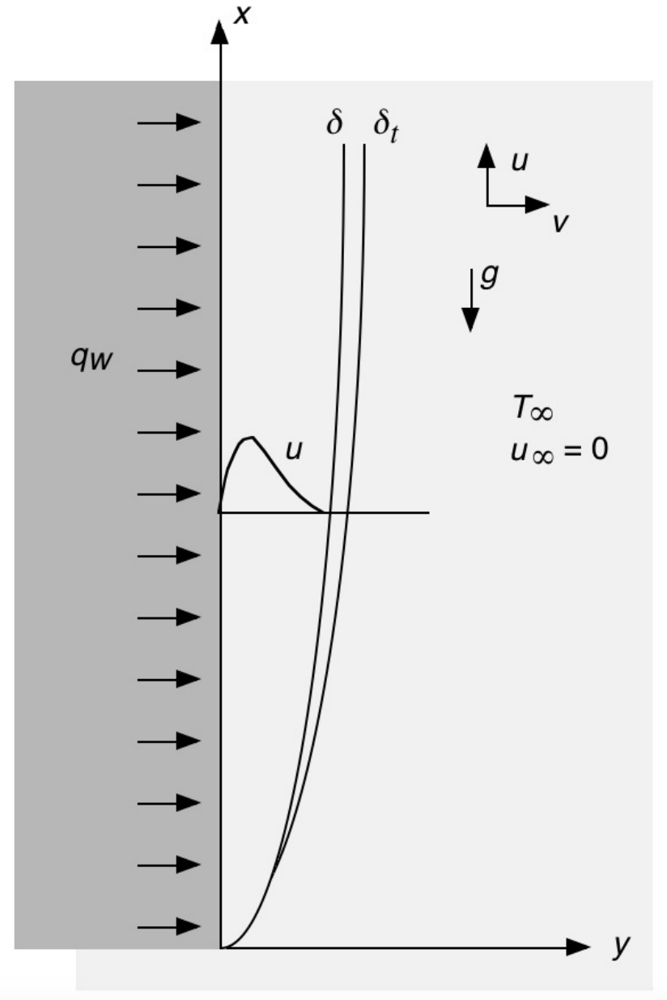
*Figure 1: Natural Convection Boundary Layer Flow near a Surface with Uniform Heat Flux*

This project focuses on understanding the natural convection boundary layer flow near a surface with a specified uniform heat flux as shown above. We consider three different ways of analyzing this type of two-dimensional convection heat transfer process. Invoking the usual boundary layer approximations, the Boussinesq approximations, neglecting pressure work and viscous dissipation, the governing equations, and the initial and boundary conditions for time-varying flow are:

$$
\frac{\partial u}{\partial x}+ \frac{\partial v}{\partial y}=0
$$

$$
\frac{\partial u}{\partial t}+u\frac{\partial u}{\partial x}+v\frac{\partial u}{\partial y}=g\beta (T-T\_{\infty})+\nu \frac{\partial^2 u}{\partial y^2}
$$

$$
\frac{\partial T}{\partial t}+u\frac{\partial T}{\partial x} + v\frac{\partial T}{\partial y}=\alpha \frac{\partial^2T}{\partial y^2}
$$

**Initial and Boundary Conditions:**
- At $t = 0$: $u = v = 0$, $T = T\_{\infty}$ for all $x, y$
- For $t > 0$: at $y = 0$: $u = v = 0$, $\frac{\partial T}{\partial y} = -\frac{q\_w}{k}$; at $y = \infty$: $u = 0$, $T = T\_{\infty}$

The initial and boundary conditions model the time-varying buoyancy-driven flow and heat transfer resulting from sudden application of the uniform heat flux at the surface at time $t=0$, with zero $u$ velocity and $T=T\_{\infty}$ everywhere at $t=0$.

---

### Theoretical Background

This section provides a brief overview of all the mathematical formulation and analytical approaches used throughout the project to model and understand natural convection boundary layer flow over a vertically heated surface.

We start with the numerical finite-difference formulation, followed by similarity analysis, and integral solutions. Each method offers unique insights into the physical behavior of the system—ranging from time-dependent simulations capturing transient startup phenomena, to reduced-order similarity solutions describing steady-state behavior, and approximate integral formulations providing closed-form expressions for flow characteristics. Together, these approaches form a comprehensive framework for analyzing buoyancy-driven convection and validating numerical results across varying levels of complexity.

#### Numerical Analysis Formulation

In the first approach, the system of equations, initial conditions and boundary conditions is solved on the finite-difference mesh shown below.

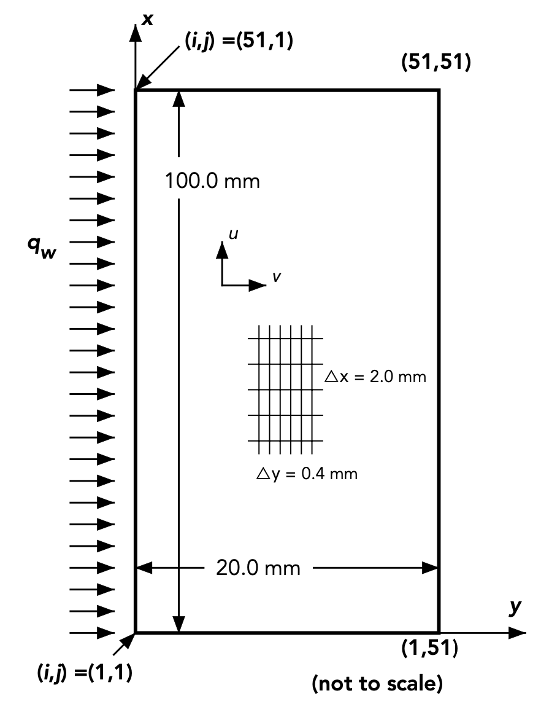
*Figure 2: Finite Difference Mesh for Boundary Layer Analysis*

First-order upwind differences are used for the first derivatives in the convection terms. Otherwise, backward differences are used for first derivatives. For second order derivatives, central differences are used. The resulting finite difference equations are:

$$
\frac{T'\_{i,j}-T\_{i,j}}{\Delta t}+u\_{i,j}\frac{T\_{i,j}-T\_{i-1,j}}{\Delta x}+v\_{i,j}\frac{T\_{i,j+1}-T\_{i,j}}{\Delta y}=\alpha \frac{T\_{i,j+1}-2T\_{i,j}+T\_{i,j-1}}{(\Delta y)^2}
$$

$$
\frac{u'\_{i,j}-u\_{i,j}}{\Delta t}+u\_{i,j}\frac{u\_{i,j}-u\_{i-1,j}}{\Delta x}+v\_{i,j}\frac{u\_{i,j+1}-u\_{i,j}}{\Delta y}=g\beta(T'\_{i,j}-T\_{\infty}) \frac{u\_{i,j+1}-2u\_{i,j}+u\_{i,j-1}}{(\Delta y)^2}
$$

$$
\frac{u'\_{i,j}-u'\_{i-1,j}}{\Delta x}+\frac{v'\_{i,j}-v'\_{i,j-1}}{\Delta y}=0
$$

We rearrange the above equations to solve for $u$, $v$ and $T$ at the next time step:

$$
T'\_{i,j} = T\_{i,j} + \left[\alpha\frac{T\_{i,j+1} - 2T\_{i,j} + T\_{i,j-1}}{(\Delta y)^2} - u\_{i,j}\frac{T\_{i,j} - T\_{i-1,j}}{\Delta x} - v\_{i,j}\frac{T\_{i,j+1} - T\_{i,j}}{\Delta y}\right]\Delta t
$$

$$
u'\_{i,j} = u\_{i,j} + \left[g\beta(T\_{i,j} - T\_{\infty}) + \nu\frac{u\_{i,j+1} - 2u\_{i,j} + u\_{i,j-1}}{(\Delta y)^2} - u\_{i,j}\frac{u\_{i,j} - u\_{i-1,j}}{\Delta x} - v\_{i,j}\frac{u\_{i,j+1} - u\_{i,j}}{\Delta y}\right]\Delta t
$$

$$
v'\_{i,j} = v'\_{i,j-1} - \left[\frac{u'\_{i,j} - u'\_{i-1,j}}{\Delta x}\right]\Delta y
$$

The heat flux boundary condition at $y = 0$ is represented in finite difference form as:

$$
\frac{-q\_w}{k}=\frac{T\_{i,2}-T\_{i,1}}{\Delta y}
$$

**FTCS Algorithm Steps:**

1. Create arrays to store the old (unprimed) and new (primed) field variables at each node: $u\_{i,j}$, $v\_{i,j}$, $T\_{i,j}$, $u'\_{i,j}$, $v'\_{i,j}$, $T'\_{i,j}$ where $1 \leq i \leq 51$ and $1 \leq j \leq 51$.

2. Initialize old and new fields everywhere to: $u\_{i,j} = 0$, $v\_{i,j} = 0$, $T\_{i,j} = T\_{\infty}$

3. Compute the fields at the next time step at all non-boundary points using the equations above.

4. The temperatures along the wall at $y = 0$ at the next time step are computed as: $T'\_{i,1} = \frac{q\_w}{k}\Delta y + T'\_{i,2}$

5. If time has exceeded the specified limit, exit the algorithm. If not, store new field values in old field variables and return to step 3.

#### Similarity Analysis

For the similarity analysis, we define the similarity variables as follows:

$$
\eta\triangleq\frac{y}{x}\left(\frac{g\beta q\_w x^4}{5k\nu^2}\right)^{1/5}
$$

$$
\psi\triangleq5\nu\left(\frac{g\beta q\_w x^4}{5k\nu^2}\right)^{1/5}F(\eta)
$$

$$
H(\eta)\triangleq\frac{T-T\_{\infty}}{q\_w x/k}\left(\frac{g \beta q\_w x^4}{5k\nu^2}\right)^{1/5}
$$

We can show that the replacement of $y$, $u$, $v$, and $T$ with transform variables satisfies the continuity equation and converts the *steady forms* of the $u$-momentum and energy equations to:

$$
F''' - 3F'^2 + 4FF'' + H = 0
$$

$$
H'' + \text{Pr}(4FH' - F'H) = 0
$$

with boundary conditions:
- $F(0) = 0$, $F'(0) = 0$, $H'(0) = -1$
- $F'(\infty) = 0$, $H(\infty) = 0$

**Proof of Continuity Equation:**

By invoking the Boussinesq approximations, density is taken to be constant when studying flow implying incompressibility. Thus we introduce a scalar stream function $\psi(x,y)$ with velocity components:

$$
u\triangleq \frac{\partial \psi}{\partial y} \quad \text{and} \quad v\triangleq-\frac{\partial \psi}{\partial x}
$$

Simply by plugging in $u$ and $v$ in terms of $\psi$ into the 2D incompressible flow continuity equation:

$$
\frac{\partial u}{\partial x}+\frac{\partial v}{\partial y} = \frac{\partial^2 \psi}{\partial x\partial y}- \frac{\partial^2 \psi}{\partial y\partial x} = 0
$$

By Clairaut's Theorem, for any smooth continuous function $\psi(x,y)$ of differentiability class $C^2$, the order of differentiation does not matter, confirming that the continuity equation is satisfied.

**Derivation of u-Momentum Equation:**

For notational convenience, let $\xi = \left(\frac{g\beta q\_w}{5k\nu^2}\right)^{1/5}$. Expanding the velocity components in terms of stream functions:

$$
u = 5\nu \xi^2 x^{3/5}F'(\eta)
$$

$$
v = -5\nu \xi x^{-1/5}\left[\frac{4}{5}F(\eta)-\frac{\eta}{5}F'(\eta)\right]
$$

After computing all necessary partial derivatives and substituting into the steady $u$-momentum equation, we obtain:

$$
F''' - 3F'^2 + 4FF'' + H = 0
$$

This confirms that $C\_{2.1} = 3$ and $C\_{2.2} = 4$.

**Derivation of Energy Equation:**

Similarly, substituting the temperature derivatives into the steady-state energy equation yields:

$$
H'' + \text{Pr}[4F(\eta)H'(\eta) - F'(\eta)H(\eta)] = 0
$$

**Boundary Conditions Verification:**

- At the wall ($y=0 \Rightarrow \eta=0$): $u(0)=0$ requires $F'(0)=0$, and $v(0)=0$ requires $F(0)=0$
- The uniform heat flux BC gives $H'(0)=-1$
- Far-field conditions ($\eta \rightarrow \infty$): $F'(\infty)=0$ and $H(\infty)=0$

#### Integral Analysis

When we construct an $x$-direction force-momentum balance on a segment of the boundary layer with buoyancy effects and zero free stream velocity:

$$
\frac{d}{dx}\int\_{0}^\delta u^2 dy = -\nu\left[\frac{\partial u}{\partial y}\right]\_{y=0}+\int\_{0}^\delta g \beta (T-T\_{\infty})dy
$$

The integral form of the energy equation:

$$
\frac{d}{dx}\int\_{0}^\delta u(T\_{\infty}-T)dy=\alpha\left[\frac{\partial T}{\partial y}\right]\_{y=0}
$$

Assuming the following functional forms:

$$
u=\hat{U}\frac{y}{\delta}\left(1-\frac{y}{\delta}\right)^2, \quad \text{where }\hat{U}=Ax^m
$$

$$
T-T\_{\infty}=\Delta T\left(1-\frac{y}{\delta}\right)^2
$$

$$
\delta = Bx^n
$$

**Reformulated Balance Equations:**

Substituting these relations into the integral equations yields:

$$
\frac{1}{105}\frac{d}{dx}(\hat{U}^2\delta)=\frac{1}{3}g\beta \Delta T \delta - \frac{\nu\hat{U}}{\delta}
$$

$$
\frac{1}{30}\frac{d}{dx}(\hat{U}\Delta T \delta)=\frac{2\alpha \Delta T}{\delta}
$$

**Exponent Determination:**

Solving the system of equations for the exponents yields:

$$
m = \frac{3}{5} = 0.6 \quad \text{and} \quad n = \frac{1}{5} = 0.2
$$

**Determination of Constants A and B:**

Substituting the exponents back into the balance equations:

$$
B = \left(\frac{72\alpha k(4\alpha + 5\nu)}{g\beta q\_w}\right)^{1/5}
$$

$$
A = 60\alpha \left(\frac{g\beta q\_w}{72\alpha k(4\alpha+5\nu)}\right)^{2/5}
$$

**Complete Solutions:**

The boundary layer thickness:
$$
\delta(x) = \left(\frac{72\alpha k(4\alpha + 5\nu)}{g\beta q\_w}\right)^{1/5}x^{0.2}
$$

The velocity field:
$$
u(x,y/\delta) = 60\alpha \left(\frac{g\beta q\_w}{72\alpha k(4\alpha+5\nu)}\right)^{2/5}x^{0.6} \cdot \frac{y}{\delta}\left(1-\frac{y}{\delta}\right)^2
$$

The temperature field:
$$
T(x, y/\delta) = T\_{\infty}+\frac{q\_w}{2k}\left(\frac{72\alpha k(4\alpha + 5\nu)}{g\beta q\_w}\right)^{1/5}x^{0.2}\left(1-\frac{y}{\delta}\right)^2
$$

---

## Implementation and Development of Code

The following section summarizes our analysis organization including a description of our code organization for each approach as well as different cases that were considered. For each major block of the script, we include the relevant code snippet followed by an explanation. Complete code can be found in the Appendix.

### FTCS Finite-Difference Implementation

Our analysis implements a modular code design where we specify the flow conditions and other relevant parameters, discretize the domain and solve the governing laminar boundary layer equations with a finite-difference FTCS algorithm, apply boundary conditions, and post-process our data to visualize our results.

```matlab
%% Flow Conditions and Geometric Parameters
g = 9.81;            % gravity
beta = 3.3e-3;       % thermal expansion coeff.
nu = 1.5e-5;         % kinematic vis.
alpha = 2.2e-5;      % thermal diff.
k_air = 0.0261;      % thermal cond. of air
Tinf = 30;           % ambient temp.
q_w = 220;           % surface heat flux
```

The purpose of the initialization section is to set up our simulation by defining all the necessary geometric and material parameters. Some physical properties include gravitational acceleration, coefficient of thermal expansion, viscosity, diffusivity, and conductivity, along with the specified ambient temperature and the constant heat flux on the vertical plate.

```matlab
% Mesh Grid Dimensions
Nx = 51;              % points in vertical (x) direction
Ny = 51;              % points in horizontal (y) direction

% Grid spacings, simulation time, and tolerance
dx = 2.0e-3;          % vertical grid spacing
dy = 0.4e-3;          % horizontal grid spacing
dt = 5.0e-4;          % time step
maxTime = 100;        % time limit
Tol = 1.0e-6;         % convergence tolerance

% Initializing coordinate vectors
x = linspace(0, (Nx-1)*dx, Nx);
y = linspace(0, (Ny-1)*dy, Ny);
numSteps = ceil(maxTime/dt);
```

We focus on discretization and geometry in this section. `Nx` and `Ny` are the number of grid points in the vertical $x$ and horizontal $y$ directions; grid spacings are defined as `dx` and `dy`. Simulation parameters include the desired time step `dt` and the max simulation time.

```matlab
%% Array Initialization
u_old = zeros(Nx, Ny);          % u: vertical velocity component
v_old = zeros(Nx, Ny);          % v: horizontal velocity component
T_old = Tinf * ones(Nx, Ny);    % temperature field
u_new = u_old;
v_new = v_old;
T_new = T_old;
```

Pre-allocating memory is important for any iterative scheme to reduce computation time. We reserve space for the solution arrays for velocity and temperature fields, initializing temperature to be uniform at the ambient temperature.

The main time loop implements the FTCS algorithm with upwind differencing for convective terms and central differences for diffusion:

```matlab
%% Time Loop for FTCS
for n = 1:numSteps
    % Update temperature in interior
    for i = (Nx-1):-1:2
        for j = 2:(Ny-1)
            % Upwind differencing in x
            if u(i,j) >= 0
                dTdx = (T(i,j) - T(i-1,j)) / dx;
            else
                dTdx = (T(i+1,j) - T(i,j)) / dx;
            end
            
            % Upwind differencing in y
            if v(i,j) >= 0
                dTdy = (T(i,j) - T(i,j-1)) / dy;
            else
                dTdy = (T(i,j+1) - T(i,j)) / dy;
            end
            convT = - ( u(i,j)*dTdx + v(i,j)*dTdy );
            
            % Diffusion term
            diffT_y = alpha * ( T(i,j+1) - 2*T(i,j) + T(i,j-1) ) / (dy^2);
            
            % New temperature
            T_new(i,j) = T(i,j) + dt*( convT + diffT_y );
        end
    end
    % ... similar updates for u and v velocities
end
```

Boundary conditions are applied at each time step:

```matlab
% Left wall (constant heat flux)
for i = 1:Nx
    u_new(i,1) = 0;
    v_new(i,1) = 0;
    T_new(i,1) = T_new(i,2) + (q_w * dy / k_air);
end

% Right boundary = zero-gradient and far field
for i = 1:Nx
    T_new(i,Ny) = T_new(i,Ny-1);
    u_new(i,Ny) = 0;
    v_new(i,Ny) = v_new(i,Ny-1);
end
```

### Similarity Solution (RK4) Implementation

The original PDEs are reduced to a fifth-order system of 1st-order ODEs. We use `fsolve` to determine the unknown initial conditions using literature values as our initial guess:

```matlab
%% Flow Conditions and Geometric Parameters
Pr = 0.733;          % Prandtl number
F0 = 0; Fp0 = 0; Hp0 = -1; etaMax = 10;  

% Guess and find the correct F''(0) and H(0)
guess = [0.80893; 1.47981];  
options = optimset('TolFun',1e-7,'TolX',1e-7);
sol = fsolve(@(soln) res(soln,Pr,Hp0,etaMax), guess, options);
Fpp0_sol = sol(1); H0_sol = sol(2);
```

The 4th-order Runge-Kutta scheme integrates the ODE system:

```matlab
% Define ODE system
sys = @(eta, Y) [
    Y(2); 
    Y(3); 
    C21*(Y(2)^2)-C22*Y(1)*Y(3) - Y(4);          
    Y(5);                                       
    Pr*(Y(2)*Y(4) - 4*Y(1)*Y(5))                
];

% Runge-Kutta Scheme
for i = 1:N
    eta_i = etaVals(i);
    Yi = [yF(i); yFp(i); yFpp(i); yH(i); yHp(i)];
    
    k1 = sys(eta_i, Yi);
    k2 = sys(eta_i + 0.5*dEta, Yi + 0.5*dEta*k1);
    k3 = sys(eta_i + 0.5*dEta, Yi + 0.5*dEta*k2);
    k4 = sys(eta_i + dEta, Yi + dEta*k3);
    
    Y_new = Yi + (dEta/6)*(k1 + 2*k2 + 2*k3 + k4);
    % ... store results
end
```

### Integral Solution Implementation

The integral solutions are computed using the derived expressions:

```matlab
% Exponents and constants
n = 0.2; m = 0.6;
B = ((72*alpha*k*(4*alpha+5*nu))/(g*beta*q_w))^0.2;
A = 60*alpha*(((g*beta*q_w)/(72*alpha*k*(4*alpha+5*nu)))^0.4);

% Boundary Layer Thickness at specified x
delta1 = B*x1^n; delta2 = B*x2^n;   

% Integral solution expressions
u_int_03 = @(y) A*x1^m .* (y/delta1) .* (1 - (y/delta1)).^2;
T_int_03 = @(y) T_inf + (q_w/(2*k)) * B*x1^n .* (1 - (y/delta1)).^2;
```

---

## Results and Discussion

### FTCS Finite-Difference Results

We used 3 different heat fluxes $q\_w=220$ W/m², $q\_w=300$ W/m², and $q\_w=150$ W/m² to study transient behavior including temperature and velocity profiles.

| $q\_w$ (W/m²) | $t\_{LE}$ (s) | $t\_{99\%}$ (s) | $T\_{peak}$ (°C) | $t\_{T,peak}$ (s) | $u\_{peak}$ (m/s) | $T\_{SS}$ (°C) | $u\_{SS}$ (m/s) |
|:---:|:---:|:---:|:---:|:---:|:---:|:---:|:---:|
| 220 | 0.1615 | 0.7860 | 73.50 | 0.9300 | 0.0614 | 70.99 | 0.0584 |
| 300 | 0.1215 | 0.6905 | 85.84 | 0.8185 | 0.0735 | 82.55 | 0.0735 |
| 150 | 0.2305 | 0.9225 | 61.96 | 1.088 | 0.0491 | 60.17 | 0.0468 |

*Table 1: Transient Behavior Characteristics for Various Heat Fluxes*

For $q\_w=220$ W/m², the time for the leading-edge effect to reach the top edge is 0.1615 seconds. The time for the flow to reach 99% of its steady state surface temperature is 0.7860 seconds. These times are quicker for higher heat fluxes because the greater heat flux heats the gas to a higher temperature, causing it to expand more and increasing the velocity.

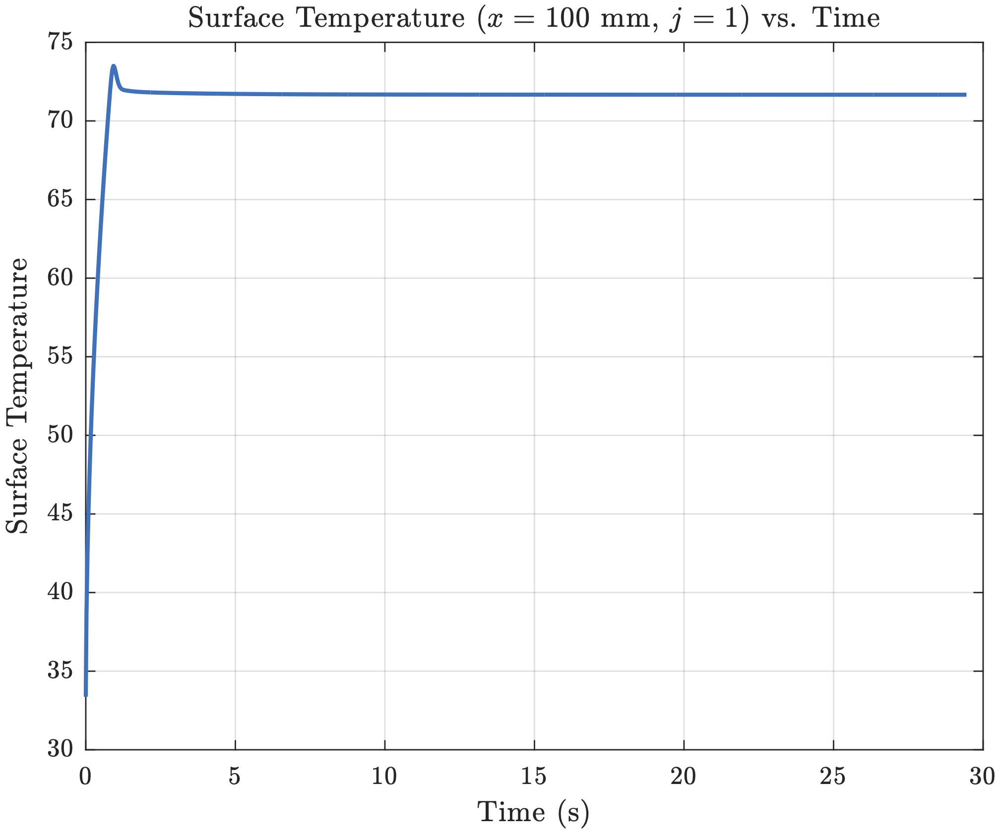
*Figure 3: Variation of Surface Temperature at Top Edge for $q\_w=220$ W/m²*

The temperature does not rise monotonically. Initially, the temperature rises sharply and overshoots, before eventually settling/converging on a value a few degrees below the peak temperature. The FTCS method initially overshoots because its way of approximating derivatives introduces small errors, causing temporary oscillations. Over time, numerical diffusion smooths out these oscillations allowing convergence.

<div style="display: grid; grid-template-columns: 1fr 1fr; gap: 10px; margin: 20px 0;">
  <figure style="margin: 0;">
    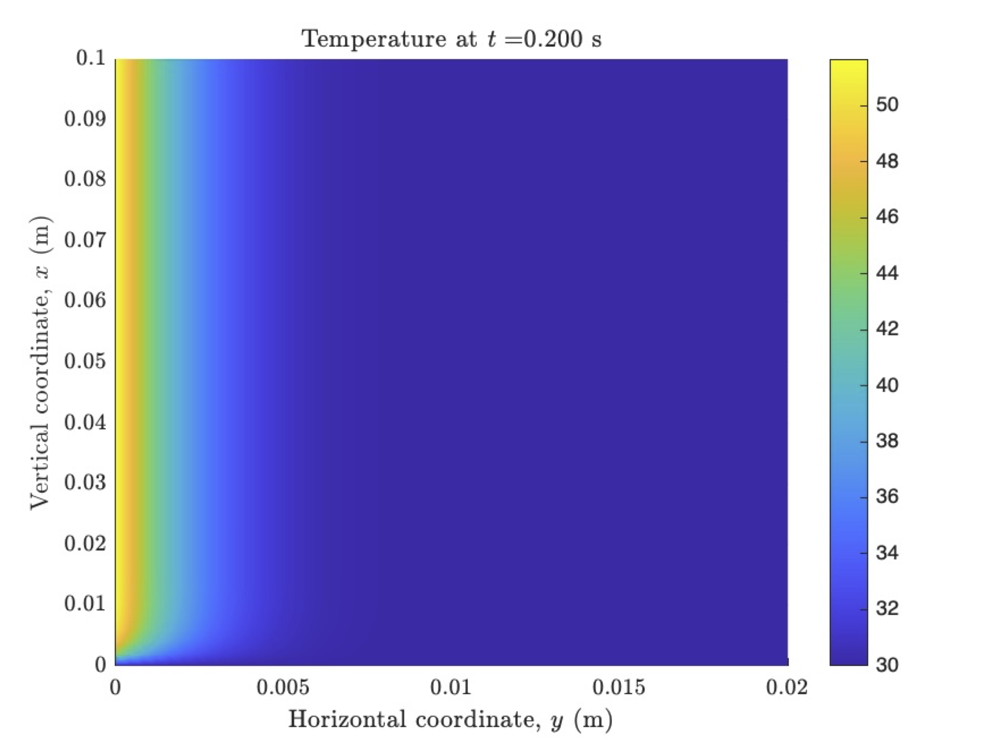
    <figcaption><strong>Figure 4:</strong> Temperature at t=0.2s</figcaption>
  </figure>
  <figure style="margin: 0;">
    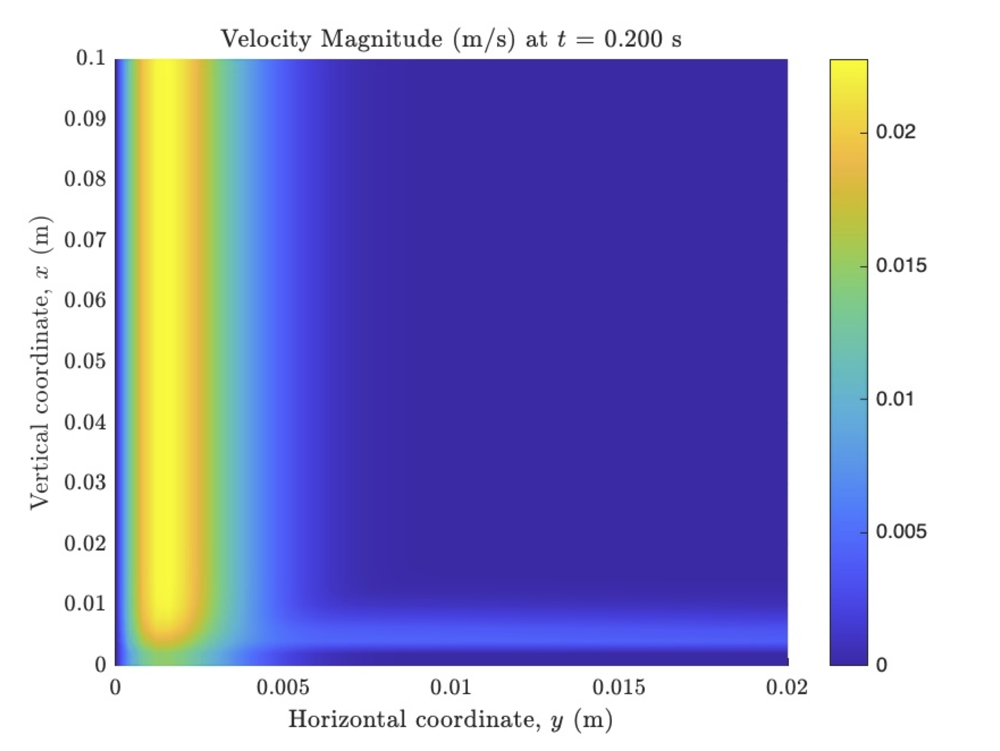
    <figcaption><strong>Figure 5:</strong> Velocity at t=0.2s</figcaption>
  </figure>
</div>

<div style="display: grid; grid-template-columns: 1fr 1fr; gap: 10px; margin: 20px 0;">
  <figure style="margin: 0;">
    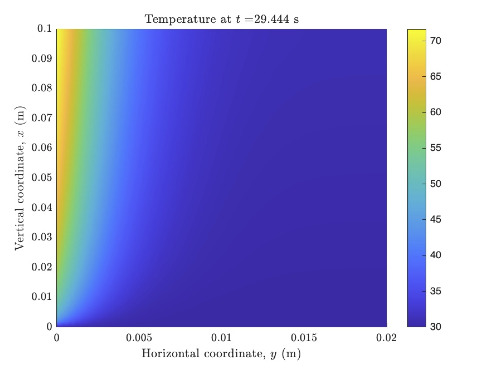
    <figcaption><strong>Figure 6:</strong> Temperature at steady-state</figcaption>
  </figure>
  <figure style="margin: 0;">
    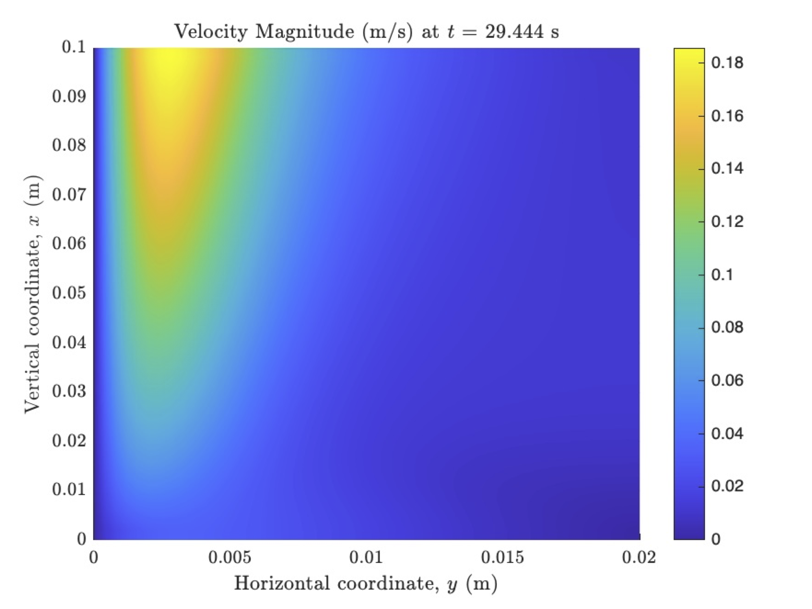
    <figcaption><strong>Figure 7:</strong> Velocity at steady-state</figcaption>
  </figure>
</div>

The series of contours show a detailed picture of how the field variables change during the transient. For the temperature field, there is a relatively constant temperature along the heated wall at t = 0.2 seconds. The temperature field develops into its steady state solution over time. The velocity field similarly starts to develop through the transient.

<div style="display: grid; grid-template-columns: 1fr 1fr; gap: 10px; margin: 20px 0;">
  <figure style="margin: 0;">
    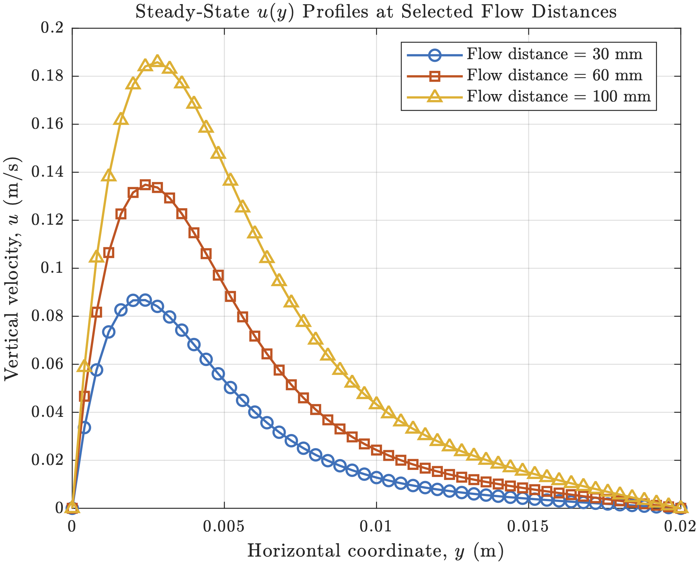
    <figcaption><strong>Figure 8:</strong> Steady-state Temperature Profiles</figcaption>
  </figure>
  <figure style="margin: 0;">
    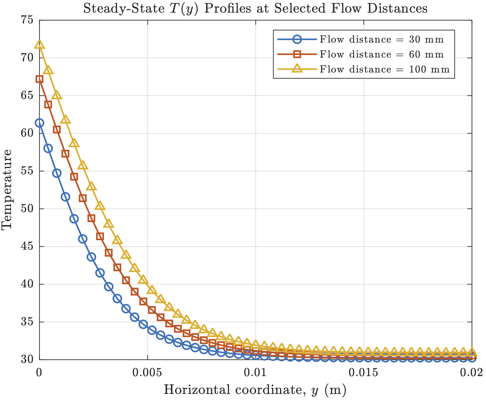
    <figcaption><strong>Figure 9:</strong> Steady-state Velocity Profiles</figcaption>
  </figure>
</div>

For $q\_w=220$ W/m², all field variables are higher than those where $q\_w=150$ W/m², which makes sense as we generate a larger temperature difference implying stronger buoyancy forces so our boundary layer velocity is higher and thicker. As we increase the downstream distance, velocities and temperatures increase.

**Laminar Flow Verification:**

Transition in a free convection boundary layer depends on the relative magnitude of buoyancy and viscous forces. We calculate the Rayleigh number:

$$
\text{Ra}\_x = \text{Gr}\_x \cdot \text{Pr} = \frac{g\beta (T\_s-T\_{\infty})x^3}{\nu\alpha}
$$

For $q\_w=220$ W/m² with maximum $T\_w-T\_{\infty} \approx 41°$C:

$$
\text{Ra}\_L = \frac{(9.81)(0.0033)(41)(0.1)^3}{(1.613\times 10^{-5})(2.2\times 10^{-5})} = 3.74\times 10^6 < 10^9
$$

Since both Ra values are below the critical Rayleigh number, we are in the laminar region. This is verified by the smooth velocity profiles showing gradual variations without abrupt fluctuations.

### Similarity Solution Results

We computed variations of $F$, $F'$, and $H$ with $\eta$ for $\text{Pr}=0.733$ using:
- $F''(0) = 0.80893$
- $H(0) = 1.47981$

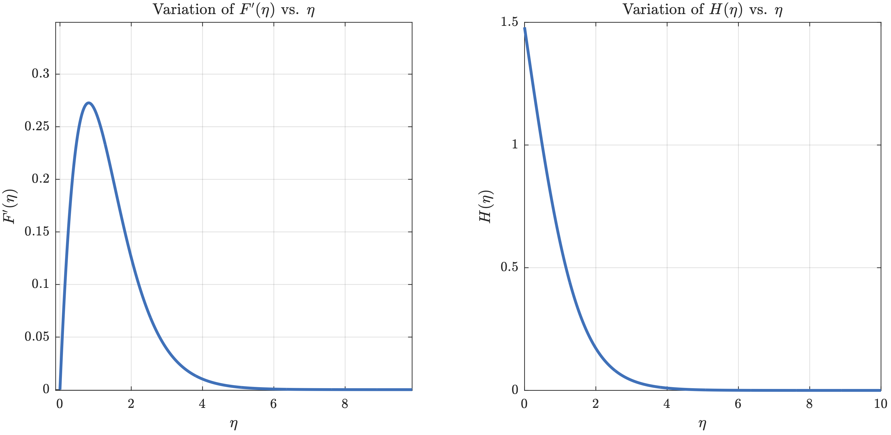
*Figure 10: Variations of $F'$ and $H$ with $\eta$*

These graphs show our similarity solutions to the boundary layer equations. The $F'(\eta)$ rises fast and drops off just as fast. Physically, at $\eta=0$ and as $\eta \rightarrow \infty$, the velocity gradient vanishes as expected.


*Figure 11: Similarity Functions vs. Dimensionless Field Variables*

The RK4 solution matches well with our FD solution at various downstream locations; they tend to collapse onto the similarity solution especially for temperature. For velocity, we notice a slight discrepancy when $\eta>2$.

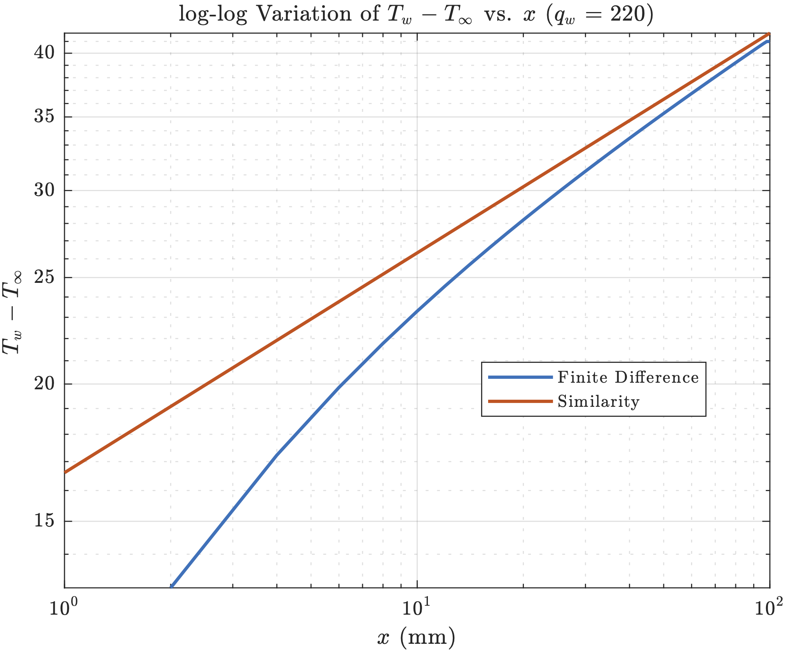
*Figure 12: log-log plot of $T\_w-T\_{\infty}$ vs. $x$ for $q\_w=220$ W/m²*

There is a significant difference between the two approaches as the similarity and FD solutions have an offset in temperature differences especially near the leading edge. The FD boundary conditions use the raw boundary layer equations rather than making idealized assumptions as the similarity variables do. However, it still shows similar scaling behavior for the wall surface temperature.

### Integral Solution Results

Using the integral solutions for $u$ and $T$, we predicted profiles at $x = 30$ mm and $60$ mm. The flow conditions are:

- $g = 9.8$ m/s² (gravitational acceleration)
- $\beta = 0.0033$ K⁻¹ (thermal expansion coefficient)
- $\nu = 1.613\times 10^{-5}$ m²/s (kinematic viscosity)
- $\alpha = 2.200\times 10^{-5}$ m²/s (thermal diffusivity)
- $k = 0.0261$ W/(m·K) (thermal conductivity)
- $T\_\infty = 30°$C (ambient temperature)
- $q\_w = 220$ W/m² (surface heat flux)

The boundary layer thickness at both locations:
- $\delta(0.03\text{ m}) = 0.00783$ m
- $\delta(0.06\text{ m}) = 0.00899$ m

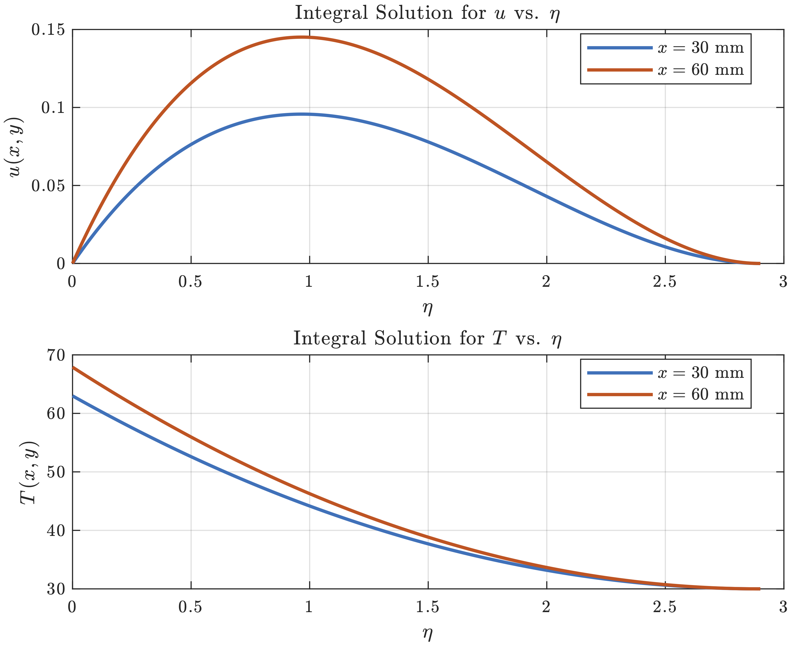
*Figure 13: Integral Solutions of $u$ and $T$ at $x=30,60$ mm as a Function of $\eta$*

Both velocity plots follow a similar shape—as we increase $\eta$ (moving away from the wall), the velocity profile rises to a peak and then decays to zero. At $x = 60$ mm, the velocity is overall higher than at $30$ mm, indicating stronger flow downstream, consistent with $u(x, y/\delta) \sim x^{0.6}$.

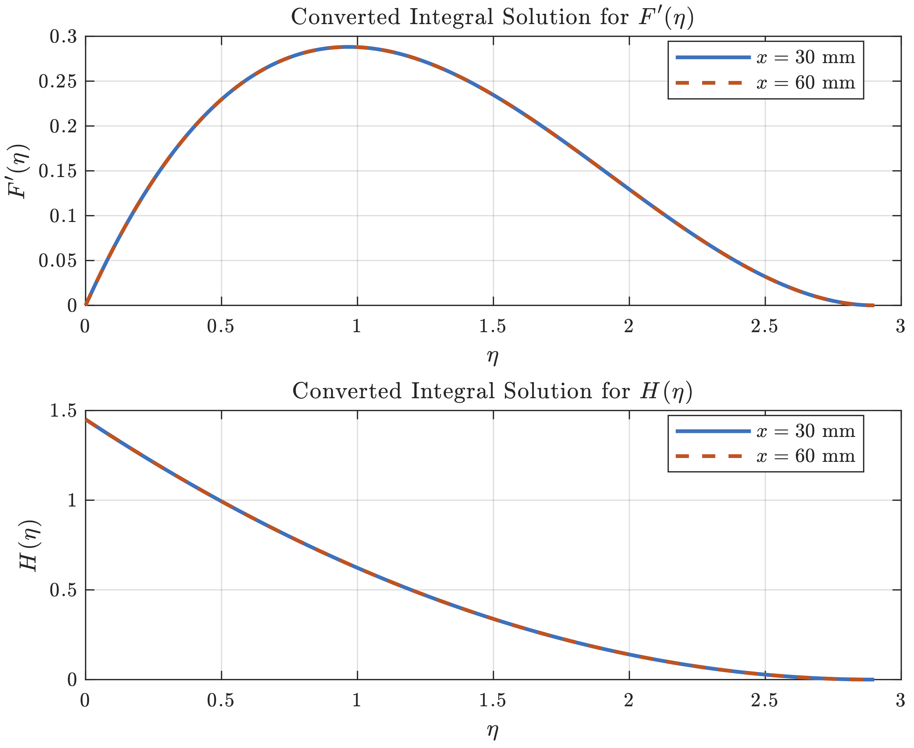
*Figure 14: Similarity Solutions of $u$ and $T$ at $x=30,60$ mm*

The curves for different streamwise locations nearly overlap perfectly when the self-similarity transformation is applied. The integral solution is self-similar—once we introduce $\eta$ and convert to $F'(\eta)$ and $H(\eta)$, explicit $x$-dependence is removed.


*Figure 15: Variation of Wall Temperature $H(0)$ with Integral and Similarity solutions*

Both methods show that $T\_{\text{wall}}$ changes with streamwise location $x$. The solutions collapse into one graph indicating that both methods equivalently predict the growth of the vertical surface plate temperature. The steep rise when $x$ is near 0 reflects the local effect of heating at the leading edge; the temperature profile tapers as $x$ increases, suggesting the boundary layer grows thicker and wall temperature levels off.

### Electronic Device Cooling Application

Consider a thin electronic device mounted on a vertical circuit board that is 3 cm tall and 5 cm wide. The board insulates the back so all heat generated is transferred to adjacent air by natural convection within a large electronics cabinet. Heat is generated uniformly over the surface.

**Boundary Layer Theory Applicability:**

For a $3\text{ cm} \times 5\text{ cm}$ device dissipating 0.3 W uniformly, we verify boundary layer theory is appropriate by checking:

$$
10^4 < \text{Gr}\_x < 10^9
$$

Using the Nusselt number correlation for laminar free convection:

$$
\overline{\text{Nu}}\_L = 0.59(\text{Gr}\_L \cdot \text{Pr})^{1/4}
$$

A bisection algorithm was implemented to find $\Delta T = 26.76$ K. Then:

$$
\text{Gr}\_L = \frac{g\beta \Delta T L^3}{\nu^2} = \frac{(9.8)(0.0033)(26.76)(0.03)^3}{(1.613\times 10^{-5})^2} = 8.98\times10^4
$$

This confirms we are in the laminar free convection regime where boundary layer theory applies.

**Maximum Heat Generation Rate:**

If the maximum allowable surface temperature is $70°$C with ambient at $30°$C, using the boundary layer analysis expressions:

$$
\max q\_{w} = \frac{80k}{Bx^n} = \frac{80(0.0261)}{(0.015785)(0.03)^{0.2}} = 266.72 \text{ W/m}^2
$$

Maximum rate of heat generation:

$$
\max \dot{Q} = \max q\_{w} \cdot A = 266.72 \cdot (0.03 \times 0.05) = 0.4 \text{ W}
$$

**Including Radiative Heat Exchange:**

We modified the boundary condition to include radiation exchange with surroundings at $T\_{\infty}$:

$$
\frac{-q\_e}{k}=\frac{T\_{i,2}-T\_{i,1}}{\Delta y}-\frac{\sigma \varepsilon\_s}{k}(T\_{i,1}^4-T\_{\infty}^4)
$$

where $\sigma=5.67\times10^{-8}$ W/m²K⁴ is the Stefan-Boltzmann constant. With surface emissivity of 0.85, the maximum heat generation rate that can be rejected by natural convection and radiation is **0.32 W**.

**Lunar Gravity Conditions:**

On the Moon with gravitational acceleration of 1.62 m/s² (~1/6 of Earth's), the Grashof number would be just above the lower threshold since $\frac{1}{6} \cdot 8.98\times 10^4 \approx 1.49\times 10^4 > 10^4$. However, the reduced gravity significantly affects cooling performance—the maximum allowable heat generation decreased to **0.21 W**.

---

## Conclusion

This study investigated laminar and buoyancy-driven boundary layer flow near a vertical surface heated at a uniform flux. Three analytical and numerical approaches—a finite-difference simulation, a similarity solution, and an integral boundary layer model—were employed to understand both transient and steady-state behavior. Despite relying on distinct assumptions and levels of complexity, all methods converged on consistent predictions of velocity fields, temperature distributions, boundary layer thickness, and overall flow structure.

The explicit finite-difference scheme revealed how the flow starts up following a sudden heat input, tracking how leading-edge disturbances progress in time. The similarity solution condensed the original partial differential equations into ordinary differential equations, confirming that at steady conditions, the boundary layer exhibits self-similarity with minimal dependence on the distance from the leading edge. Meanwhile, the integral boundary layer approach, though simpler, still produced results that agreed closely with both the similarity and finite-difference analyses, showcasing its practicality for rapid engineering estimates.

Finally, the framework was applied to cooling an electronic device under both terrestrial and reduced (lunar) gravity, illustrating how modest changes in gravitational acceleration or inclusion of radiative heat transfer can significantly alter thermal performance limits. These results underscore the robustness and flexibility of boundary layer approximations for buoyancy-driven convection and highlight how various solution strategies—from quick integral estimates to detailed time-dependent simulations—can be used effectively to design and assess natural-convection flows.

---

## Code Appendix

<details>
<summary><strong>FTCS Finite-Difference Code (Click to Expand)</strong></summary>

```matlab
clear; clc; close all;

%% Flow Conditions and Geometric Parameters
g = 9.81;            % gravity
beta = 3.3e-3;       % thermal expansion coeff.
nu = 1.5e-5;         % kinematic vis.
alpha = 2.2e-5;      % thermal diff.
k_air = 0.0261;      % thermal cond. of air
Tinf = 30;           % ambient temp.
q_w = 220;           % surface heat flux

% Mesh Grid Dimensions
Nx = 51;             % points in vertical (x) direction
Ny = 51;             % points in horizontal (y) direction

% Grid spacings, simulation time, and tolerance
dx = 2.0e-3;         % vertical grid spacing
dy = 0.4e-3;         % horizontal grid spacing
dt = 5.0e-4;         % time step
maxTime = 0.9205;    % time limit
Tol = 1.0e-6;        % convergence tolerance

% Initializing coordinate vectors
x = linspace(0, (Nx-1)*dx, Nx);
y = linspace(0, (Ny-1)*dy, Ny);
numSteps = ceil(maxTime/dt);

%% Array Initialization
u_old = zeros(Nx, Ny);
v_old = zeros(Nx, Ny);
T_old = Tinf * ones(Nx, Ny);
u_new = u_old;
v_new = v_old;
T_new = T_old;

% Preallocate arrays
Tsurf_vals = zeros(1, numSteps);
time_vals  = zeros(1, numSteps);
u_inlet_vals = zeros(1, numSteps);
usurf_vals = zeros(1, numSteps);

%% Time Loop for FTCS
for n = 1:numSteps
    u = u_old;  
    v = v_old;  
    T = T_old;
    
    % Update temperature in interior
    for i = (Nx-1):-1:2
        for j = 2:(Ny-1)
            if u(i,j) >= 0
                dTdx = (T(i,j) - T(i-1,j)) / dx;
            else
                dTdx = (T(i+1,j) - T(i,j)) / dx;
            end
            if v(i,j) >= 0
                dTdy = (T(i,j) - T(i,j-1)) / dy;
            else
                dTdy = (T(i,j+1) - T(i,j)) / dy;
            end
            convT = - ( u(i,j)*dTdx + v(i,j)*dTdy );
            diffT_x = alpha * ( T(i+1,j) - 2*T(i,j) + T(i-1,j) ) / (dx^2);
            diffT_y = alpha * ( T(i,j+1) - 2*T(i,j) + T(i,j-1) ) / (dy^2);
            T_new(i,j) = T(i,j) + dt*( convT + diffT_x + diffT_y );
        end
    end
    
    % Update vertical velocity in interior
    for i = (Nx-1):-1:2
        for j = 2:(Ny-1)
            if u(i,j) >= 0
                dudx = (u(i,j) - u(i-1,j)) / dx;
            else
                dudx = (u(i+1,j) - u(i,j)) / dx;
            end
            if v(i,j) >= 0
                dudy = (u(i,j) - u(i,j-1)) / dy;
            else
                dudy = (u(i,j+1) - u(i,j)) / dy;
            end
            convU = - ( u(i,j)*dudx + v(i,j)*dudy );
            diffU_x = nu * ( u(i+1,j) - 2*u(i,j) + u(i-1,j) ) / (dx^2);
            diffU_y = nu * ( u(i,j+1) - 2*u(i,j) + u(i,j-1) ) / (dy^2);
            buoy = g * beta * ( T(i,j) - Tinf );
            u_new(i,j) = u(i,j) + dt*( convU + diffU_x + diffU_y + buoy );
        end
    end
    
    % Update horizontal velocity v from continuity
    for i = (Nx-1):-1:2
        for j = 2:(Ny-1)
            du_dx = (u(i,j) - u(i-1,j)) / dx;
            dv_dy = (v(i,j) - v(i,j-1)) / dy;
            v_new(i,j) = v(i,j) - dt*( du_dx + dv_dy );
        end
    end
    
    %% BOUNDARY CONDITIONS
    % Left wall (constant heat flux)
    for i = 1:Nx
        u_new(i,1) = 0;
        v_new(i,1) = 0;
        T_new(i,1) = T_new(i,2) + (q_w * dy / k_air);
    end
    
    % Right boundary
    for i = 1:Nx
        T_new(i,Ny) = T_new(i,Ny-1);
        u_new(i,Ny) = 0;
        v_new(i,Ny) = v_new(i,Ny-1);
    end
    
    % Bottom boundary
    for j = 1:Ny
        T_new(1,j) = Tinf;
        u_new(1,j) = u_new(2,j);
        v_new(1,j) = v_new(2,j);
    end
    
    % Top boundary
    for j = 1:Ny
        T_new(Nx,j) = T_new(Nx-1,j);
        u_new(Nx,j) = u_new(Nx-1,j);
        v_new(Nx,j) = v_new(Nx-1,j);
    end
    
    Tsurf_vals(n) = T_new(Nx,1);
    u_inlet_vals(n) = u_new(Nx,2);   
    time_vals(n) = (n-1)*dt;
    
    % Check for convergence
    diffU = max(abs(u_new(:) - u_old(:)));
    diffV = max(abs(v_new(:) - v_old(:)));
    diffT = max(abs(T_new(:) - T_old(:)));
    maxChange = max([diffU, diffV, diffT]);
    
    u_old = u_new;
    v_old = v_new;
    T_old = T_new;
        
    if maxChange < Tol
        fprintf('Steady-state reached at iteration %d\n', n);
        break;
    end
end
```

</details>

<details>
<summary><strong>Similarity Solution (RK4) Code (Click to Expand)</strong></summary>

```matlab
clear; clc; close all;

%% Flow Conditions
Pr = 0.733;
g = 9.81;
beta = 0.0033;
nu = 1.5e-5;
k_air = 0.026;
T_inf = 30;

% Boundary Conditions
F0 = 0; Fp0 = 0; Hp0 = -1; etaMax = 10;        

% Find the correct F''(0) and H(0)
guess = [0.80893; 1.47981];  
options = optimset('TolFun',1e-5,'TolX',1e-5);
sol = fsolve(@(soln) res(soln,Pr,Hp0,etaMax), guess, options);
Fpp0_sol = sol(1); H0_sol = sol(2);

%% 4th Order Runge-Kutta Method
Fpp0 = Fpp0_sol; H0 = H0_sol;
C21 = 3; C22 = 4;
N = 1000; dEta = etaMax/N;

% Arrays for storing solutions
etaVals = zeros(N+1,1);
yF = zeros(N+1,1);
yFp = zeros(N+1,1);
yFpp = zeros(N+1,1);
yH = zeros(N+1,1);
yHp = zeros(N+1,1);

% Initial values at eta=0
yFpp(1) = Fpp0; yH(1) = H0; yHp(1) = Hp0; 

% Define ODE system
sys = @(eta, Y) [
    Y(2); 
    Y(3); 
    C21*(Y(2)^2)-C22*Y(1)*Y(3) - Y(4);          
    Y(5);                                       
    Pr*(Y(2)*Y(4) - 4*Y(1)*Y(5))                
];

% Runge-Kutta Scheme
for i = 1:N
    eta_i = etaVals(i);
    Yi = [yF(i); yFp(i); yFpp(i); yH(i); yHp(i)];
    
    k1 = sys(eta_i, Yi);
    k2 = sys(eta_i + 0.5*dEta, Yi + 0.5*dEta*k1);
    k3 = sys(eta_i + 0.5*dEta, Yi + 0.5*dEta*k2);
    k4 = sys(eta_i + dEta, Yi + dEta*k3);
    
    Y_new = Yi + (dEta/6)*(k1 + 2*k2 + 2*k3 + k4);
    
    etaVals(i+1) = eta_i + dEta;
    yF(i+1) = Y_new(1);
    yFp(i+1) = Y_new(2);
    yFpp(i+1) = Y_new(3);
    yH(i+1) = Y_new(4);
    yHp(i+1) = Y_new(5);
end

function dY = Reformulate(Y, Pr)
    F = Y(1); Fp = Y(2); Fpp = Y(3);
    H = Y(4); Hp = Y(5);
    C21 = 3; C22 = 4;
    dFdx = Fp;
    dFpdx = Fpp;
    dFppdx = C21 * Fp^2 - C22 * F * Fpp - H;
    dHdx = Hp;
    dHpdx = Pr * (Fp * H - 4 * F * Hp);
    dY = [dFdx; dFpdx; dFppdx; dHdx; dHpdx];
end

function re = res(sol, Pr, Hp0, etaMax)
    dEtaS = etaMax / 10000;
    Y = [0; 0; sol(1); sol(2); Hp0];
    for i=1:10000
        k1 = Reformulate(Y, Pr);
        k2 = Reformulate(Y + 0.5 * dEtaS * k1, Pr);
        k3 = Reformulate(Y + 0.5 * dEtaS * k2, Pr);
        k4 = Reformulate(Y + dEtaS * k3, Pr);
        Y  = Y + (dEtaS/6)*(k1 + 2 * k2 + 2 * k3 + k4);
    end
    re = [Y(2); Y(4)]; 
end
```

</details>

<details>
<summary><strong>Integral Solution Code (Click to Expand)</strong></summary>

```matlab
%% Flow Conditions from Task I
g = 9.8;
beta = 0.0033;
nu = 1.613e-5;
alpha = 2.2e-5;
k = 0.0261;
T_inf = 30;
q_w = 220;

% Streamwise locations
x1 = 0.03; x2 = 0.06;

%% Integral Solutions
n = 0.2; m = 0.6;
B = ((72*alpha*k*(4*alpha+5*nu))/(g*beta*q_w))^0.2;
A = 60*alpha*(((g*beta*q_w)/(72*alpha*k*(4*alpha+5*nu)))^0.4);

% Boundary Layer Thickness
delta1 = B*x1^n; delta2 = B*x2^n;   

% Similarity variables
xi = ((g*beta*q_w)/(5*k*nu^2))^(1/5);
eta = @(y, x) xi * y ./ (x^(1/5));

% Integral solution expressions
u_int_03 = @(y) A*x1^m .* (y/delta1) .* (1 - (y/delta1)).^2;
u_int_06 = @(y) A*x2^m .* (y/delta2) .* (1 - (y/delta2)).^2;
T_int_03 = @(y) T_inf + (q_w/(2*k)) * B*x1^n .* (1 - (y/delta1)).^2;
T_int_06 = @(y) T_inf + (q_w/(2*k)) * B*x2^n .* (1 - (y/delta2)).^2;

% For x = 0.03 m
y_vals_03 = linspace(0, delta1, 200);         
eta_vals_03 = eta(y_vals_03, x1);            

% For x = 0.06 m
y_vals_06 = linspace(0, delta2, 200);      
eta_vals_06 = eta(y_vals_06, x2);         

%% Similarity Transformations
F_transform = @(u, x) u ./ (5*nu*xi^2*(x^(0.6)));
H_transform = @(T, x) (T - T_inf) ./ ((q_w/k) .* (x^(0.2)/xi));

% For x = 0.03 m
u_vals_03 = u_int_03(y_vals_03);
T_vals_03 = T_int_03(y_vals_03);
Fprime_int_03 = F_transform(u_vals_03, x1);
H_int_03 = H_transform(T_vals_03, x1);

% For x = 0.06 m
u_vals_06 = u_int_06(y_vals_06);
T_vals_06 = T_int_06(y_vals_06);
Fprime_int_06 = F_transform(u_vals_06, x2);
H_int_06 = H_transform(T_vals_06, x2);
```

</details>

<details>
<summary><strong>Radiative Heat Exchange Code (Click to Expand)</strong></summary>

```matlab
clear; clc; close all;

%% Flow Conditions and Geometric Parameters
g = 9.81;
beta = 3.3e-3;
nu = 1.5e-5;
alpha = 2.2e-5;
k_air = 0.0261;
Tinf = 30;
sigma = 5.67e-8;     % Stefan-Boltzmann
emis  = 0.85;        % emissivity

Nx = 51; Ny = 51;
dx = 2.0e-3; dy = 0.4e-3; dt = 5.0e-4;
maxTime = 500;
Tol = 1.0e-4;

T_max_allowed = 70;
q_test = 25:1:30; 

nTest = length(q_test);
Tsteady_vals = nan(nTest, 1);

for idx = 1:nTest
    q_w = q_test(idx);
    % Run simulation with radiative boundary condition
    % ... (full implementation in main code)
    
    % Modified boundary condition:
    % Heated left wall with radiation
    for i = 1:Nx
        u_new(i,1) = 0;
        v_new(i,1) = 0;
        radiation = (sigma*emis/k_air)*((T_new(i,2)+273.15)^4 - (Tinf+273.15)^4);
        conduction = (q_w / k_air);
        T_new(i,1) = T_new(i,2) + dy*(conduction + radiation);
    end
    
    if Tsteady > T_max_allowed
        break;
    end
end
```

</details>
