##### Download

+ [Full Lab Report (PDF)](/E143_Lab_Report_1.pdf)

---

## Summary

This project was done for EE143 at the University of California at Berkeley and outlines the step-by-step fabrication process of a ⟨100⟩ silicon wafer containing several learning integrated circuits (ICs). Specifically, we fabricated MOSFETs, ring oscillators, comb drives, cantilever arrays, and a heater platform on our wafer. In making these components, we learned to carry out major microfabrication techniques with precision. Our production sequence consisted of nine steps: field oxidation, active-area photolithography and etching, gate oxidation, polysilicon deposition, gate photolithography and etching, source and drain doping, dopant drive-in and intermediate oxidation, contact-hole photolithography, metallization, and metallization photolithography and etching. These steps form the foundation of modern chip manufacturing, and learning them was both rewarding and enjoyable.

Dry and wet oxidation were used to form insulating layers, and successive photolithography steps patterned the active devices, gate regions, contact openings, and metal routing. A combination of wet and dry etching sculpted the film geometries, followed by thermal evaporation to deposit the aluminum metallization. After each major step, we characterized oxide thickness, sheet resistance, and mask alignment to track how the fabrication sequence altered the wafer. The process demonstrated good fidelity, with only minor over-etching and slight misalignments. During the photolithography steps, there were instances where we had to re-apply photoresist when the coating did not spread evenly. Mask alignment was also not perfect, though we did our best to minimize errors.

Overall, the workflow proceeded smoothly: the same wafer was used from start to finish without shattering, the critical dimensions were met, and the resulting electrical behavior aligned well with expectations. Most deviations remained below 10%, indicating negligible impact from our handling. We learned that microfabrication demands both precision and patience. Tuning the HF etch time required experimentation since we had no means of in-situ monitoring, but ultimately produced satisfactory results when etching the field oxide. 

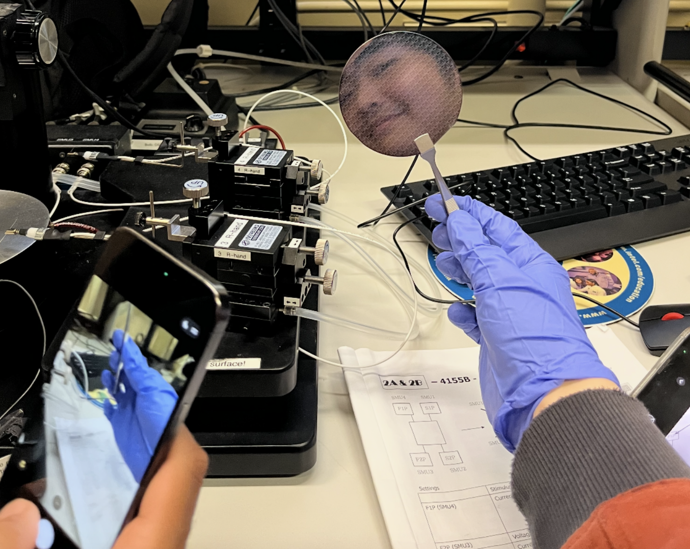
*The completed wafer after all fabrication steps with my reflection*

---

## Experimental Details

### Major Fabrication Steps

---

#### Step 1: Field Oxidation *(done by TAs)*

Field oxidation is grown by the TAs in the Nanolab. Silicon dioxide is grown from silicon with wet oxidation in a Tystar 2 furnace. We grow field oxide on the silicon wafer base to keep components that we will eventually create insulated from each other, since silicon dioxide is an excellent insulator.

---

#### Step 2: Active Area (ACTV) Photolithography & Etch

The active area is created by etching away the field oxide to expose a working area of the underlying silicon, where components can be built upon. The wafer is first coated with positive photoresist. Then, ultraviolet light shines through a photomask to weaken exposed photoresist. The weakened photoresist is then removed and the exposed silicon dioxide is removed. We need this step because otherwise the wafer will just be coated in silicon dioxide, which alone is an insulator.

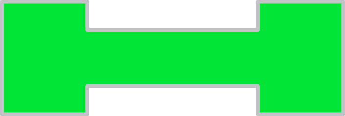

---

#### Step 3: Gate Oxidation

In the gate oxidation step, we grow a thin layer of silicon dioxide from the exposed silicon in the exposed active area. The gate oxide is needed to form an insulating layer between the gate and the underlying silicon, which will contain the source and the drain.

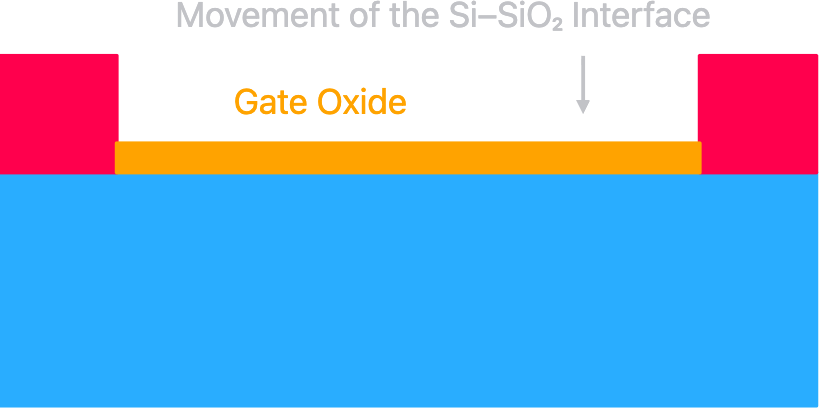

---

#### Step 4: Polysilicon Deposition *(done by TAs)*

Polysilicon deposition is done by TAs in the Tystar10 furnace. Silane is used to supply silicon and phosphorus so we grow a slightly n-doped polysilicon layer. The polysilicon deposition step is needed to deposit the silicon layer required to form the gate of the MOSFET.

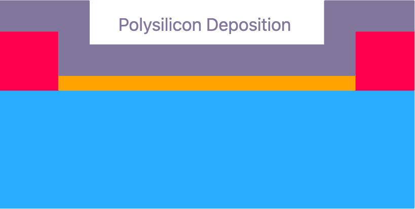

---

#### Step 5: Gate (POLY) Photolithography & Etch

The gate photolithography & etch step creates the source and drain regions on the silicon wafer by etching the gate oxide. The MOSFET is also formed by the remaining polysilicon. This step is performed with the standard lithography procedure described in step 2, with the exception that this step uses the POLY mask on the lithography machine.

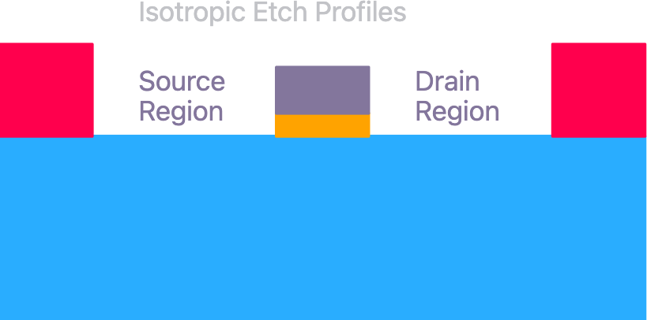

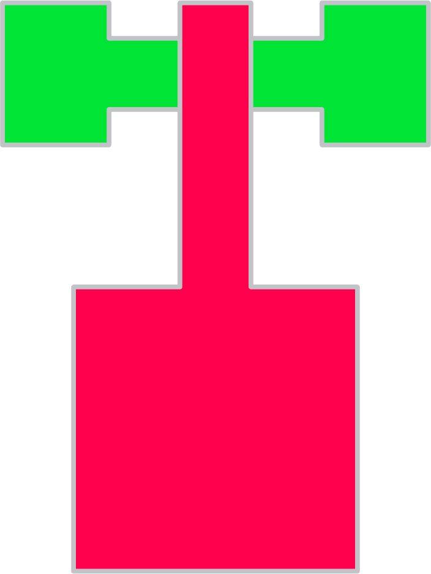

---

#### Step 6: Source/Drain Doping

The source/drain doping step creates the n⁺ dopant regions on the exposed silicon wafer for the MOSFET source and drains. This is performed by first coating the wafer with spin-on dopant, then baking the wafer to remove solvent, then diffusing the dopant via the 1050°C furnace. This step is necessary because the n⁺ source and drain regions are where external wires will connect to, forming the source and gates of the MOSFET.

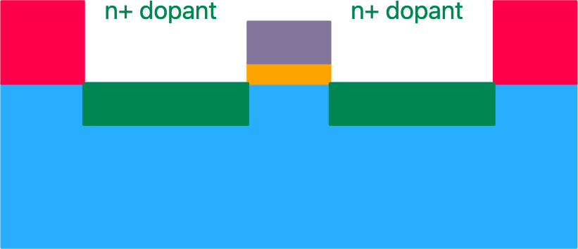

---

#### Step 7: Dopant Drive-in & Intermediate Oxidation

The dopant drive-in and intermediate oxidation steps aim to grow a layer of intermediate oxide around the source and drains to act as insulation for their metal connectors. This step is performed by growing silicon oxide with wet oxidation, because it grows oxide faster.

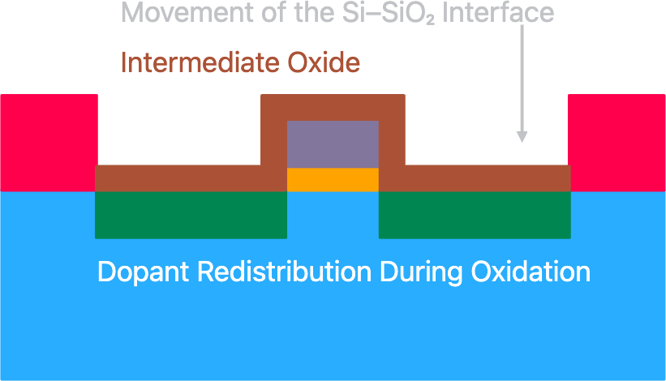

---

#### Step 8: Contact Hole (CONT) Photolithography & Etch

The contact hole photolithography and etch step etches a contact hole in the intermediate oxide for the metal connectors to form, which allows the n⁺ doped source and drain regions to the surface via a conducting connector. This step is performed with the standard lithography steps with the CONT mask.

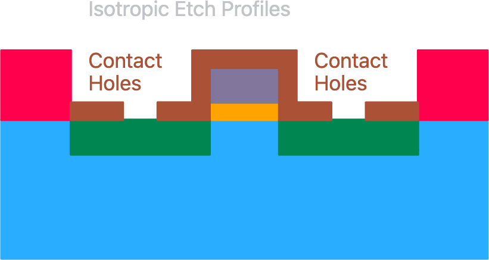

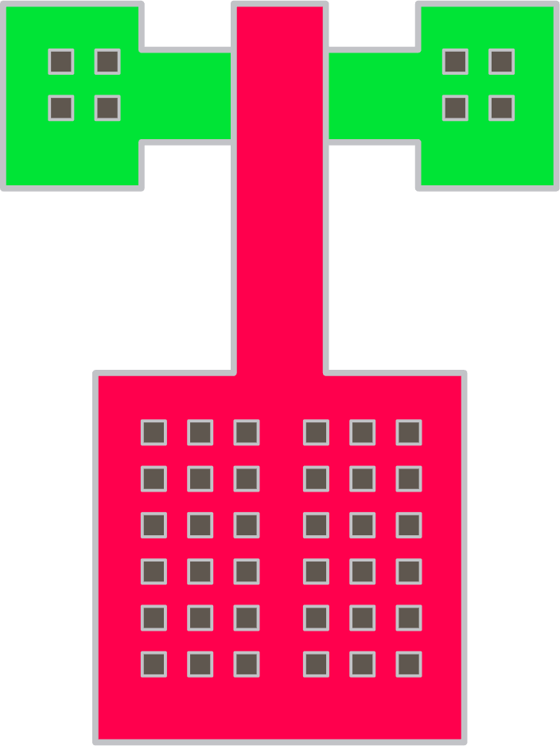

---

#### Step 9: Metallization

The metallization step performs physical vapor deposition to deposit a layer of aluminum across the entire wafer. This step is performed specifically to form metal contacts between the source and drain regions and the surface of the wafer. We deposit aluminum across the entire wafer first before etching the metal layer.

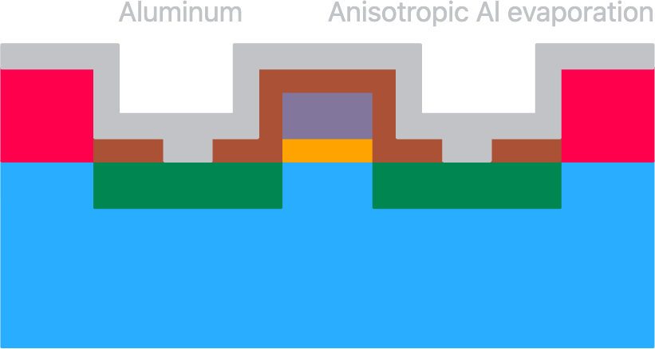

---

#### Step 10: Metal (METL) Photolithography & Etch

The metal photolithography and etch steps etch the deposited aluminum to form aluminum contacts only at the regions right above the n⁺ source and drain regions, insulated by the intermediate oxide. This step is necessary because otherwise the aluminum layer will conduct electricity directly between the source and drain regions if it is not etched away. This step is performed with the standard lithography steps with the METL mask.

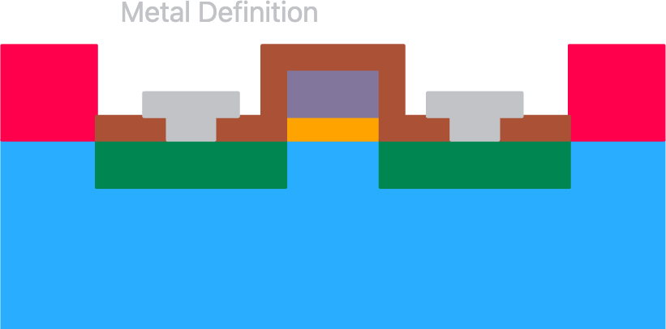

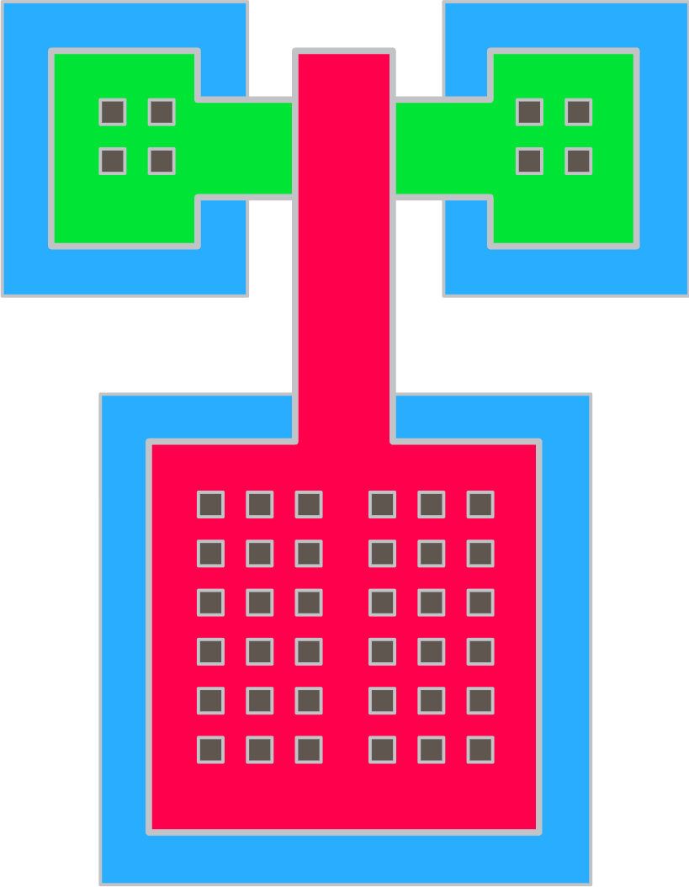

---

### Fabrication Summary Table

| Step | Process | Description |
|:----:|:--------|:------------|
| 1 | Field Oxidation | Thermal oxidation to grow thick SiO₂ isolation layer |
| 2 | Active-Area Photolithography & Etching | Pattern and etch to define active device regions |
| 3 | Gate Oxidation | Thin oxide growth for gate dielectric |
| 4 | Polysilicon Deposition | LPCVD polysilicon for gate electrode |
| 5 | Gate Photolithography & Etching | Pattern gate structures |
| 6 | Source/Drain Doping | Spin-on dopant diffusion doping |
| 7 | Dopant Drive-in & Intermediate Oxidation | Thermal activation and passivation |
| 8 | Contact-Hole Photolithography | Open vias to source, drain, and gate |
| 9 | Metallization | Aluminum deposition via PVD |
| 10 | Metal Photolithography & Etching | Pattern aluminum routing |

*The tables below summarize all of the important parameters and their corresponding values for each major fabrication step. Photos are included for the active lithography, polysilicon, contact lithography, and metallization. These photos are analyzed both post-developed and post-etched to determine if any overetching occurred.*

### Microscope Images

Post-Develop

Post-Etch

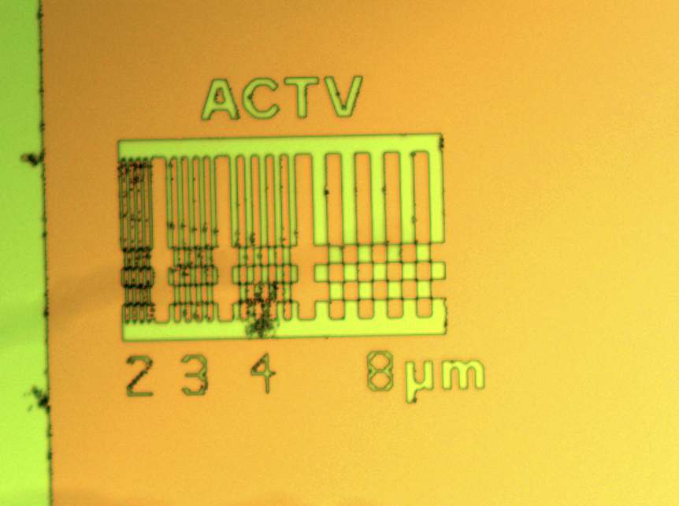

ACTV Post-Develop

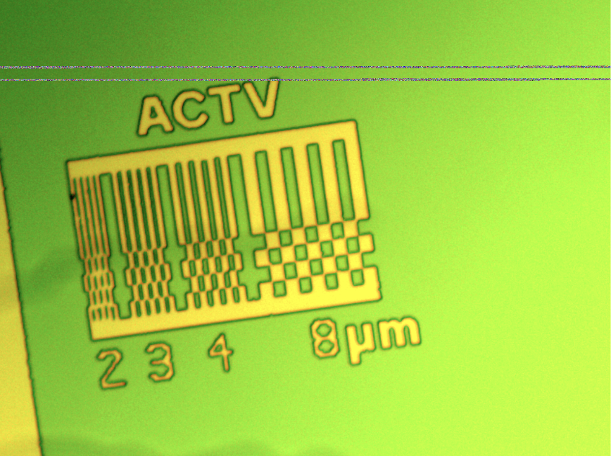

ACTV Post-Etch

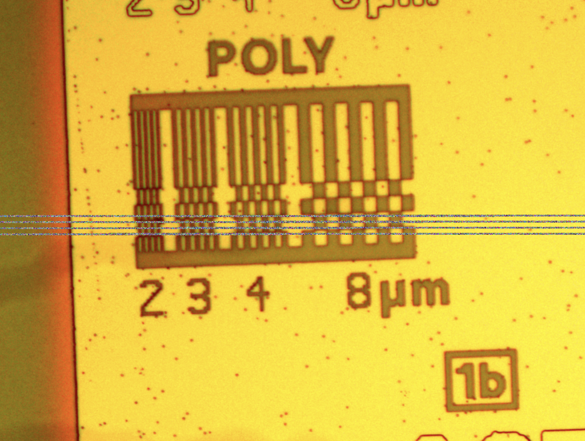

POLY Post-Develop

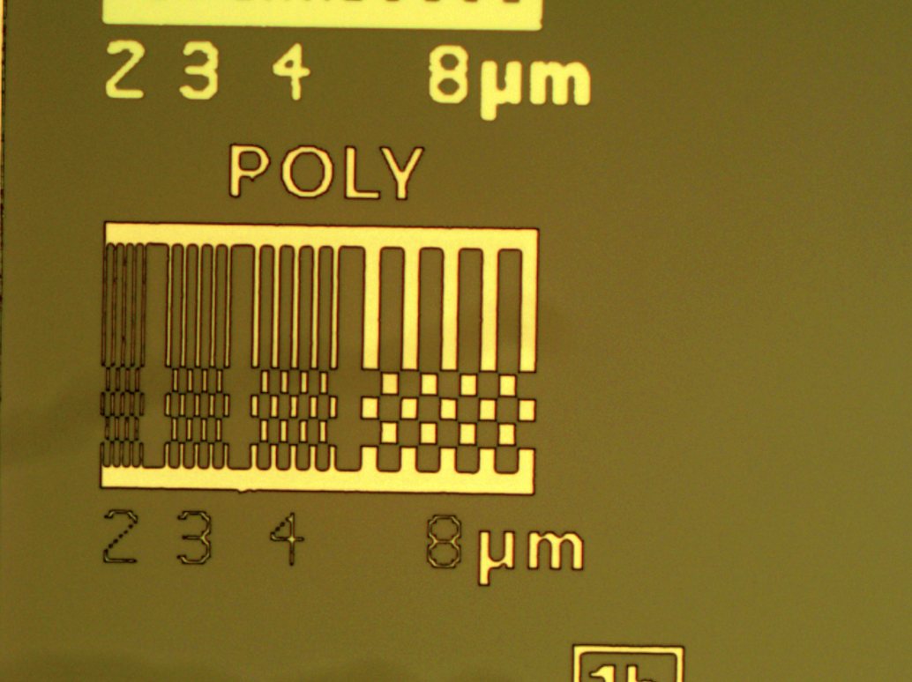

POLY Post-Etch

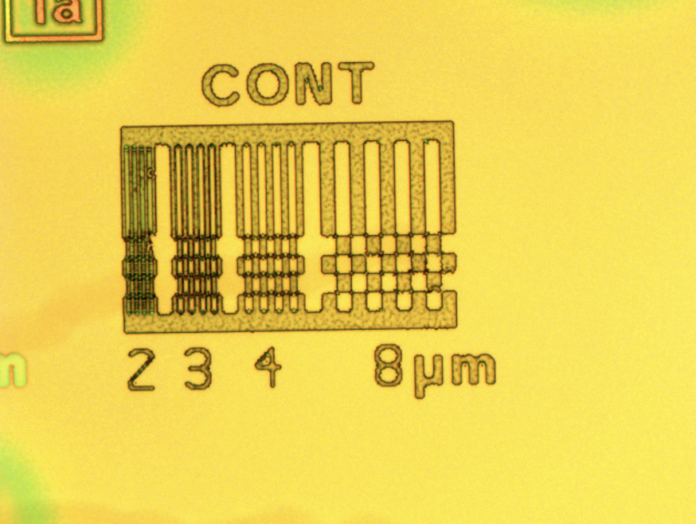

CONT Post-Develop

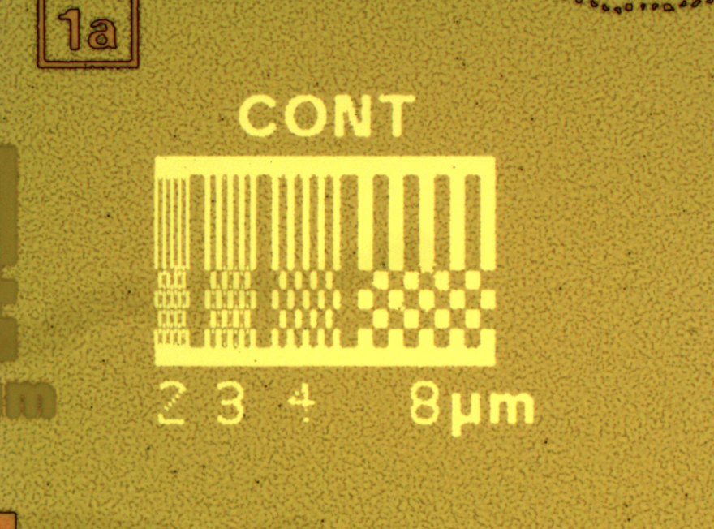

CONT Post-Etch

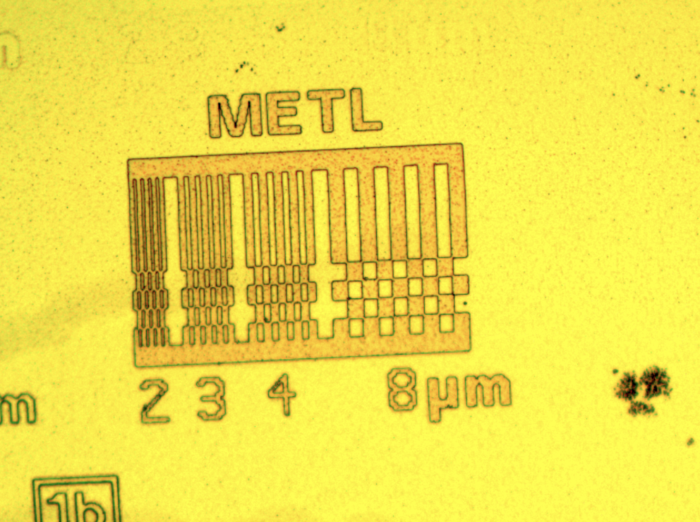

METL Post-Develop

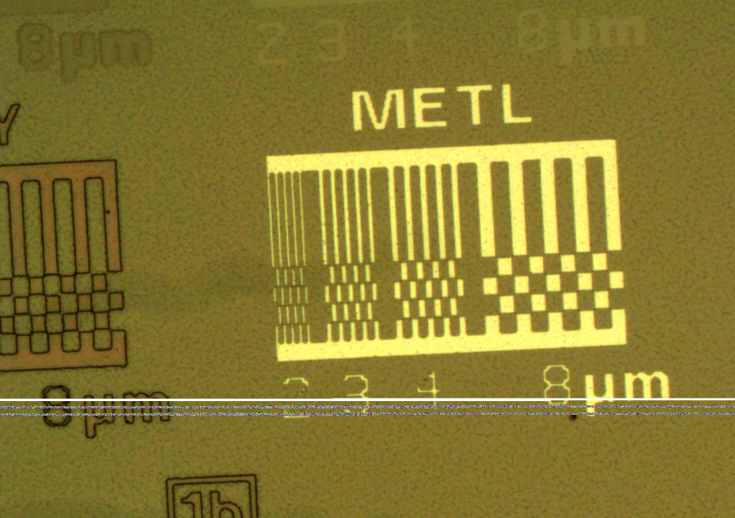

METL Post-Etch

### Oxidation Thickness Measurements

| Oxidation Step | Theoretical Thickness (nm) | Measured Thickness (nm) |
|:---------------|:--------------------------:|:-----------------------:|
| Field Oxidation | $629.59$ | $620$ |
| Gate Oxidation | $86.85$ | $109.1$ |
| Intermediate Oxidation | $51.47$ | $67.3$ |

### Overetch Measurements

| Lithography Step | Average Overetch from Lithography (μm) | Average Overetch from Wet Etching (μm) |
|:-----------------|:--------------------------------------:|:--------------------------------------:|
| ACTV | $0.32$ | $0.4425$ |
| POLY | $0.5475$ | $1.215$ |
| CONT | $0.27$ | $0.6325$ |
| METL | $0.305$ | $0.8325$ |

### Mask Alignment Measurements

| Parameter | X Misalignment (μm) | Y Misalignment (μm) |
|:----------|:-------------------:|:-------------------:|
| ACTV-POLY | $0.039$ | $0.058$ |
| ACTV-CONT | $0.058$ | $0.108$ |
| CONT-METL | $0.09$ | $0.02$ |

---

## Theoretical Calculations

### Oxide Thickness

The Deal-Grove model describes thermal oxidation kinetics:

$$x_{ox}^2 + A \cdot x_{ox} = B(t + \tau)$$

where $x_{ox}$ is oxide thickness, $B$ is the parabolic rate constant, and $B/A$ is the linear rate constant.

### Doping Parameters

| Parameter | Value |
|:----------|:-----:|
| Boron peak concentration (atoms/cm³) | $4.06 × 10^{16}$ |
| Depth of boron peak concentration (μm) | $0.2$ |
| Phosphorus peak concentration (atoms/cm³) | $10^{21}$ |
| Depth of phosphorus peak concentration (μm) | $0$ |
| Junction depth (μm) | $0.9$ |
| Sheet resistance of areas with no phosphorus doping (Ω/□) | $395$ |
| Sheet resistance of areas with phosphorus doping (Ω/□) | $4.10$ |
| Lateral diffusion of phosphorus (μm) | $0.63$ |

### Sheet Resistance Measurements

| Doping Profile | Theoretical Value (Ω/□) | Measured Value (Ω/□) |
|:---------------|:-----------------------:|:--------------------:|
| Sheet resistance before phosphorus doping | $395$ | N/A |
| Sheet resistance after phosphorus doping | $4.10$ | $5.93$ |

### Aluminum Metallization

Aluminum was deposited via thermal evaporation. The sheet resistance for a 100nm film was characterized:

| Aluminum | Theoretical Value (Ω/□) | Measured Value (Ω/□) |
|:---------|:-----------------------:|:--------------------:|
| Sheet Resistance | $0.265$ | $0.124$ |

### Dopant Diffusion

The dopant profile follows Gaussian or complementary error function distributions depending on the source conditions:

$$C(x,t) = \frac{Q}{\sqrt{\pi D t}} \exp\left(-\frac{x^2}{4Dt}\right)$$

where $D$ is the diffusion coefficient and $Q$ is the dose.

### Doping Profile Plots

#### Background Concentration
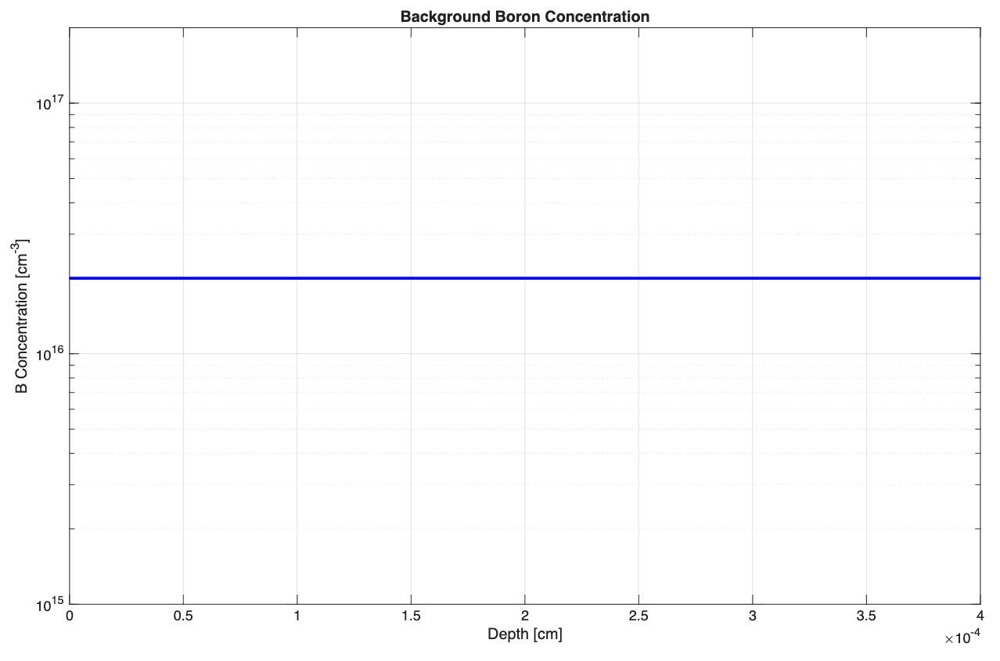

#### Initial Ion Implant
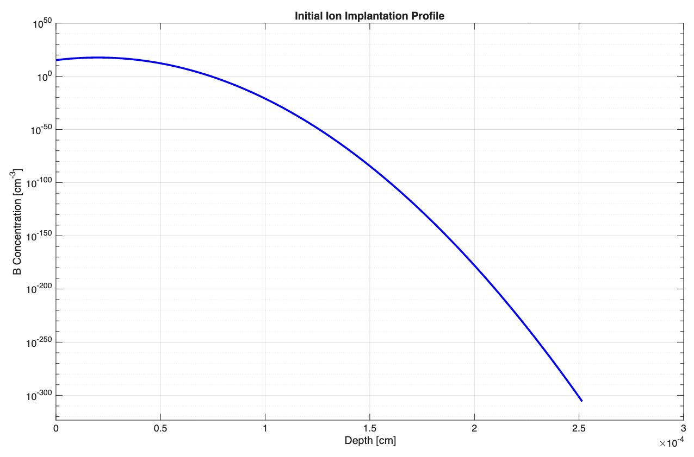

#### After 4 Thermal Steps
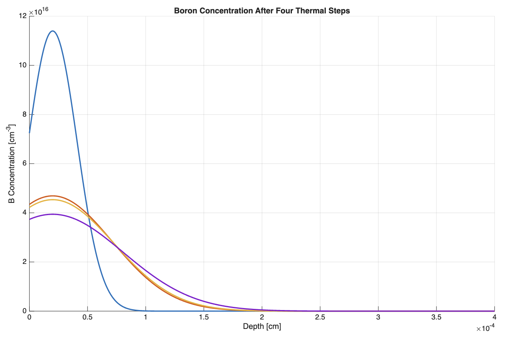

#### 2-Step Phosphorus Diffusion
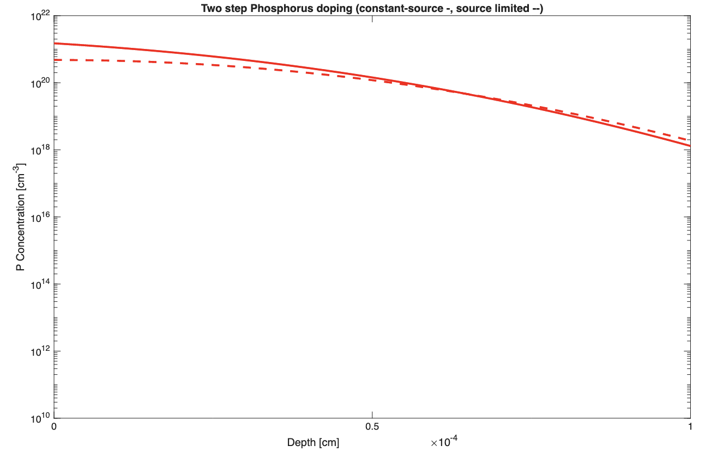

#### Total Phosphorus and Boron Concentration
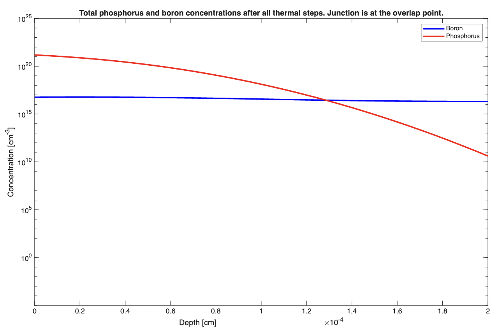

### Doping Summary

| Region | Dopant | Type | Target Concentration |
|:-------|:------:|:----:|:--------------------:|
| Substrate | Boron | p-type | ~$10^{15}$ cm⁻³ |
| Source/Drain | Phosphorus | $n^+$ | ~$10^{20}$ cm⁻³ |
| Polysilicon Gate | Phosphorus | $n^+$ | ~$10^{20}$ cm⁻³ |

---

## Process Deviations

During fabrication, several deviations from ideal processing were observed:

1. **Photoresist Coating**: In some photolithography steps, the photoresist did not spread evenly on the first application, requiring re-spin and recoating.

2. **Mask Alignment**: Minor misalignment occurred between successive mask layers. While we minimized errors through careful adjustment, sub-micron precision was challenging to achieve.

3. **HF Etch Time**: Without in-situ monitoring, the HF etch time for field oxide removal required iterative experimentation. Initial attempts resulted in slight over-etching in some regions.

4. **Oxide Thickness Variation**: Measured oxide thicknesses showed minor variation across the wafer, likely due to temperature non-uniformity in the furnace.

Despite these deviations, the overall process yielded functional devices with electrical characteristics within acceptable tolerances (most deviations < 10%).
