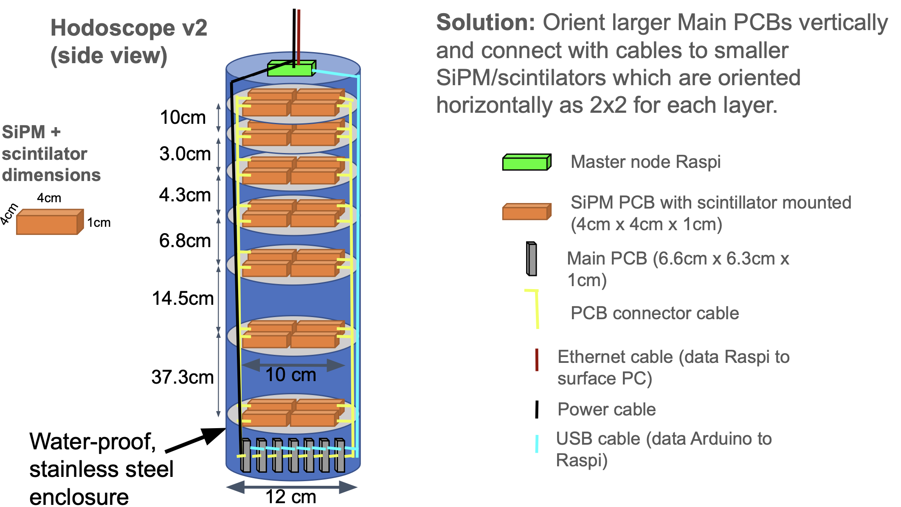

---

## Overview

During my internship at [Outer Rim Exploration Inc. (ORE)](https://ore.green/), I worked as a **Hardware Engineering Intern** on the design and development of a drone-based hodoscope system. A hodoscope is a particle detector used to track the paths of cosmic rays and other charged particles—ORE's innovation was mounting this detection system on a drone platform for mobile, aerial surveys.

---

## My Contributions

### Mechanical Design & Tolerancing

- Designed the mechanical enclosure for the hodoscope using CAD software
- Created detailed tolerance analyses to ensure proper fit between components
- Optimized the enclosure for weight constraints critical to drone payload limits
- Designed mounting interfaces between the hodoscope and drone airframe

### PCB Integration

- Integrated the electronic PCB design into the mechanical enclosure
- Ensured proper clearances for connectors, heat dissipation, and cable routing
- Collaborated with electrical engineers on design-for-manufacturing (DFM) considerations
- Created assembly documentation for production

### Failure Analysis

- Developed code for analyzing potential failure modes in the system
- Created tools to simulate and identify weak points in the design
- Documented failure scenarios and mitigation strategies

### Deployment Research

- Researched methods for deploying the hodoscope system in field conditions
- Investigated operational constraints for drone-mounted instrumentation
- Contributed to mission planning and operational procedures

---

## Technical Details

### Hodoscope System

A hodoscope consists of arrays of scintillator detectors that register the passage of charged particles. When a cosmic ray passes through the detector, it produces light signals that are captured by photomultipliers or silicon photomultipliers (SiPMs). By analyzing the timing and position of these signals across multiple detector layers, the trajectory of the particle can be reconstructed.

### Design Challenges

| Challenge | Solution |
|:----------|:---------|
| Weight constraints | Optimized enclosure geometry and material selection |
| Vibration isolation | Designed damping mounts for sensitive electronics |
| Thermal management | Incorporated ventilation and heat sinks for PCB cooling |
| Environmental protection | Sealed enclosure design for outdoor operation |
| Assembly accessibility | Modular design for field serviceability |

---

## Skills Developed

- **CAD & Mechanical Design:** SOLIDWORKS for enclosure design and assembly
- **GD&T:** Geometric dimensioning and tolerancing for manufacturing
- **Design for Manufacturing:** Optimizing designs for production feasibility
- **Cross-functional Collaboration:** Working with electrical and software teams
- **Technical Documentation:** Creating assembly guides and specifications

---

## Gallery

*Add images of your CAD models, prototypes, or the final hodoscope design to the `images` folder.*

<!--  -->
<!--  -->
<!--  -->

---

*Hardware Engineering Internship at [Outer Rim Exploration Inc.](https://ore.green/), 2024*

