---

## Overview

During my internship at [Outer Rim Exploration Inc. (ORE)](https://ore.green/), I worked as a **Hardware Engineering Intern** on the design and development of a drone-based hodoscope system—the startup's minimum viable product (MVP). The goal: detect muons to investigate ore deposit locations around mountains, utilizing drones and muon tomography.

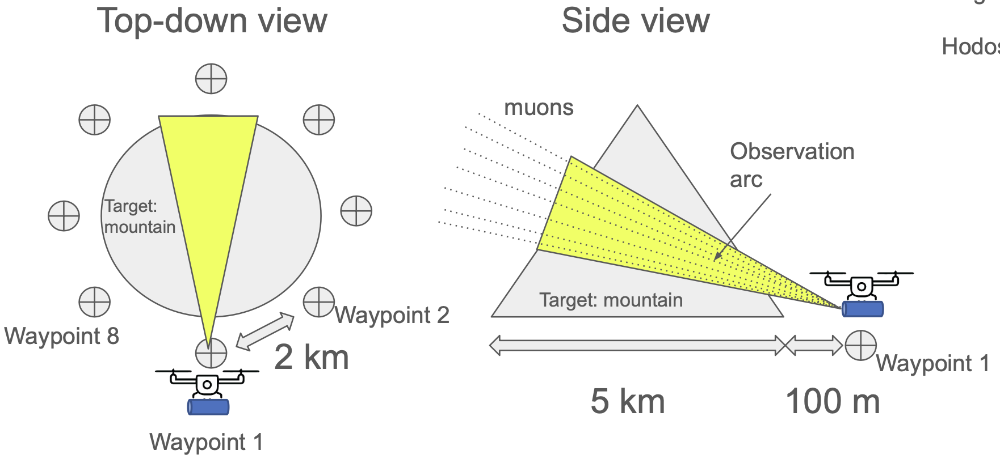

### What I Built

- Designed the full mechanical assembly in **SOLIDWORKS**
- Utilized solenoid mechanisms to set zenith angle of observations
- Designed custom gearbox to rotate an **8 kg payload**
- Implemented telescopic slides so payload can reach optimal length for muon data collection

### Impact

| Result | Details |
|:-------|:--------|
| **$200K Seed Funding** | Secured startup funding by validating technology idea to investors |
| **40% Cost Reduction** | Shifted design to COTS (commercial off-the-shelf) parts |
| **First Pilot Study** | Secured first pilot study contract for the prototype |

---

## System Architecture

### Survey Flow (MVP)

1. Fly to next waypoint
2. Land
3. Drone enters sleep mode
4. Drone recharges battery with solar panels
5. Hodoscope enters observe mode using drone battery
6. Observe for 1 day
7. Repeat until survey finished

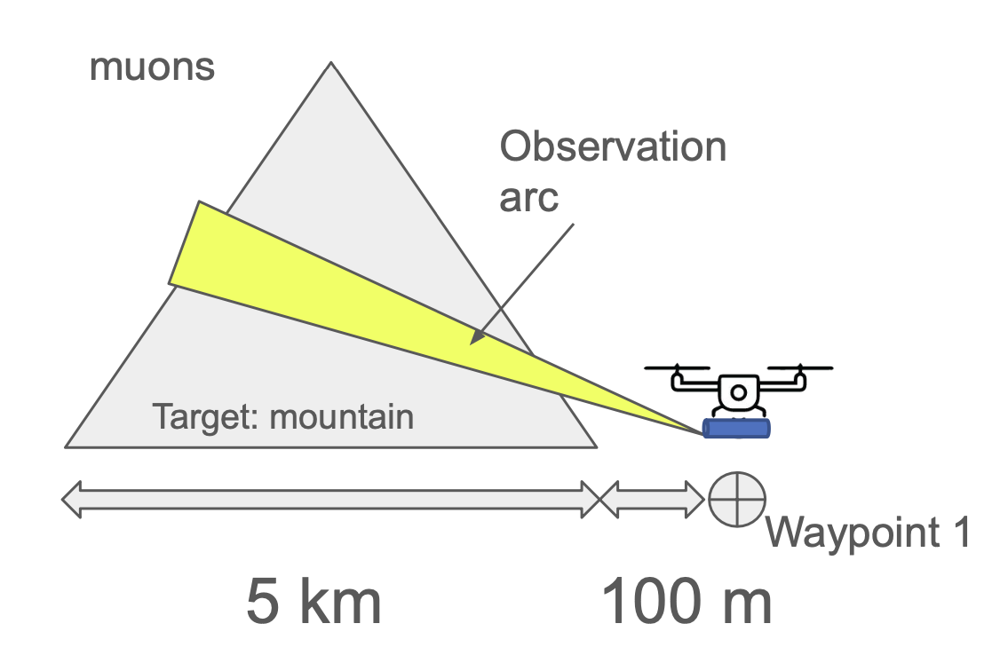

### Prototype Specifications

| Parameter | Value |
|:----------|:------|
| Maximum layer distance | ~76.0 cm |
| View angle | 15° |
| Angular resolution | 7.5° |
| Spatial resolution @ 1km | 131 m |
| Spatial resolution @ 100m | 13 m |
| Spatial resolution @ 10m | 1 m |
| Spatial resolution @ 1m | 14 cm |
| Output | Muon flux image (2×2) |

<video width="100%" controls muted style="border-radius: 8px;">
  <source src="images/Drone_Hodoscope2_1.mp4" type="video/mp4">
</video>
<p style="text-align: center; font-style: italic; color: var(--secondary);">Hodoscope prototype: contracted and extended views</p>

---

## Engineering Requirements

### Drone Constraints

| Requirement | Target |
|:------------|:-------|
| Price | < $2,000 |
| Power | Solar-powered |
| Payload capacity | Based on Aurelia X6 (5 kg) |
| Flight time | ~30 min |
| Range | ~5 km |

### Hodoscope Constraints

| Requirement | Target |
|:------------|:-------|
| Price | < $1,000 |
| PCB size | < 5 cm per module |
| Operation | Fully autonomous |
| Observation duration | < 1 day per waypoint |

---

## My Contributions

### Mechanical + Plastic CAD Design

Designed the full plastic CAD assembly for the drone-mounted muon detector in **SOLIDWORKS**:

- Integrated PCB layouts, support structures, and validation systems into a unified mechanical package
- Ensured manufacturability, structural integrity, and tight spatial constraints for drone-compatible payloads
- Designed enclosure with heat dissipation and waterproofing considerations

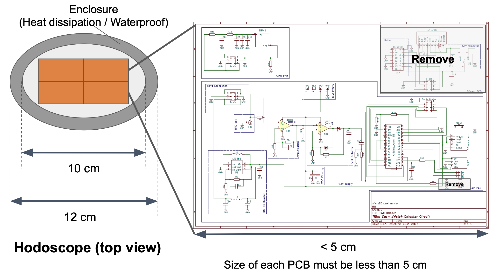

### Structural Topology Optimization & FEA

#### Weight Optimization of Telescopic Hodoscope Casing

Topology optimization is a technique that removes material from a user-defined shape or design domain to maximize performance. Performance can mean:
1. Maximize stiffness-to-weight ratio
2. Minimize displacement
3. Combination of the two for a given set of loading conditions

#### Pre-processing and Digitalization

The digitalization process was carried out using 3D modelling capabilities in **SOLIDWORKS**. Although the housing, PCB, scintillators, and muon detector are modelled as separate parts, they were combined as a single monolithic body made of **6061 Aluminum Alloy T4**. This approach:
- Provides worst-case scenario (plastic scintillators are lighter than 6061)
- Enables topology optimization (SOLIDWORKS doesn't allow simultaneous optimization of assemblies)
- Simplifies the model by removing auxiliary elements (linear slides replaced with aluminum bar in extended position)

#### External Loads and Fixtures

Fixtures describe how the model is supported and define the boundary conditions for FEM:

- **2 areas of fixed geometry** 
- **2 areas of fixed hinges** (where the motor from the worm gearbox connects)

#### Goals and Constraints

The topology study finds the stiffest structure possible given a certain amount of material removal. The optimization algorithm minimizes global compliance (a measure of overall flexibility, defined as the sum of strain energies of all elements).

| Parameter | Value |
|:----------|:------|
| Target mass reduction | **60%** |
| Original mass | 15 kg |
| Optimized mass | **9 kg** |

#### Manufacturing Controls

To ensure manufacturability, we applied:
- **Preserved regions** to maintain critical geometry
- **Symmetry control** to speed up convergence
- Prevention of undercuts and hollow parts

#### Optimization Results

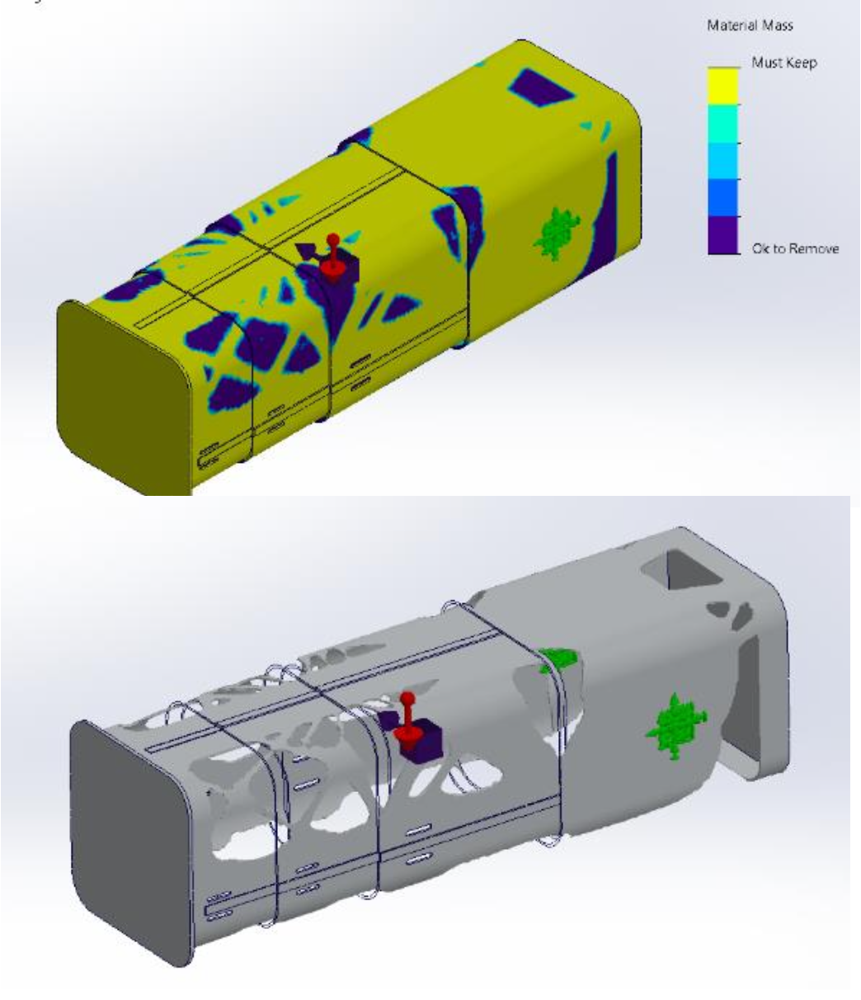

After running the optimization:
- Achieved **40% mass reduction** with truss-like structure
- Same pattern can be used for each layer
- Added bottom constraint to create truss structure below
- Post-processing: export as STL, retrace cuts for smoother, more machinable geometry

---

### Deflection Modeling (ABAQUS Verification)

The deflection due to self-weight was studied to ensure high factor of safety and stability as zenith angle changes during observation. We needed to avoid fatigue as the cause of failure.

#### Material & Setup

| Property | Value |
|:---------|:------|
| Material | 6061 Aluminum Alloy T4 |
| UTS | 180 MPa |
| Yield Strength | 110 MPa |
| Mesh Type | Curvature-based (for accuracy) |

**Fixtures:**
- Hinge fixture at turning shaft (connected to worm gearbox at both ends)
- Fixed fixtures for screws around drone mount
- Gravitational force applied at mid-plane

#### FEA Results

<div style="display: grid; grid-template-columns: repeat(2, 1fr); gap: 10px; margin: 20px 0;">
<div style="text-align: center;">
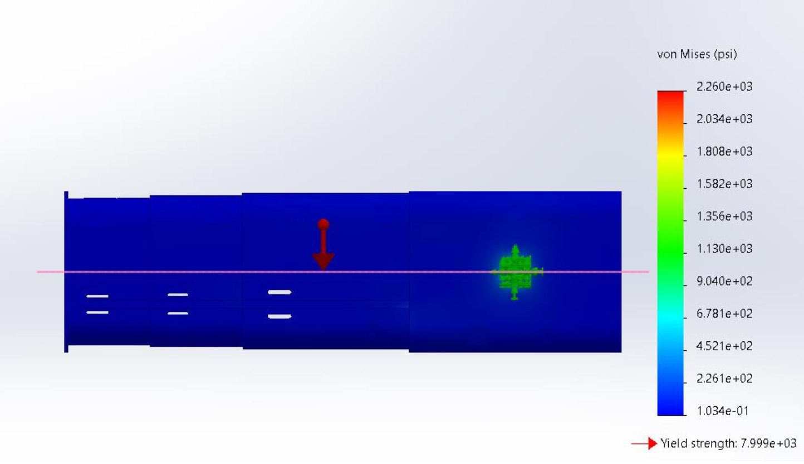
<p style="font-size: 0.85em; color: var(--secondary); margin-top: 5px;">Von Mises Stress</p>
</div>
<div style="text-align: center;">

<p style="font-size: 0.85em; color: var(--secondary); margin-top: 5px;">Strain Analysis</p>
</div>
<div style="text-align: center;">
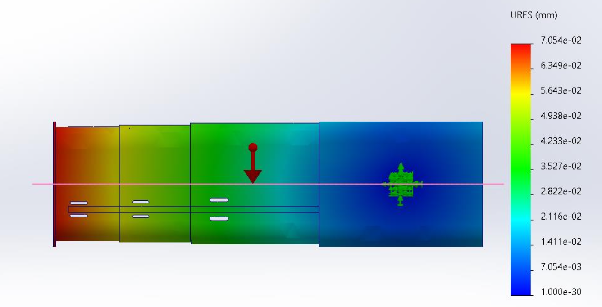
<p style="font-size: 0.85em; color: var(--secondary); margin-top: 5px;">Displacement (URES)</p>
</div>
<div style="text-align: center;">
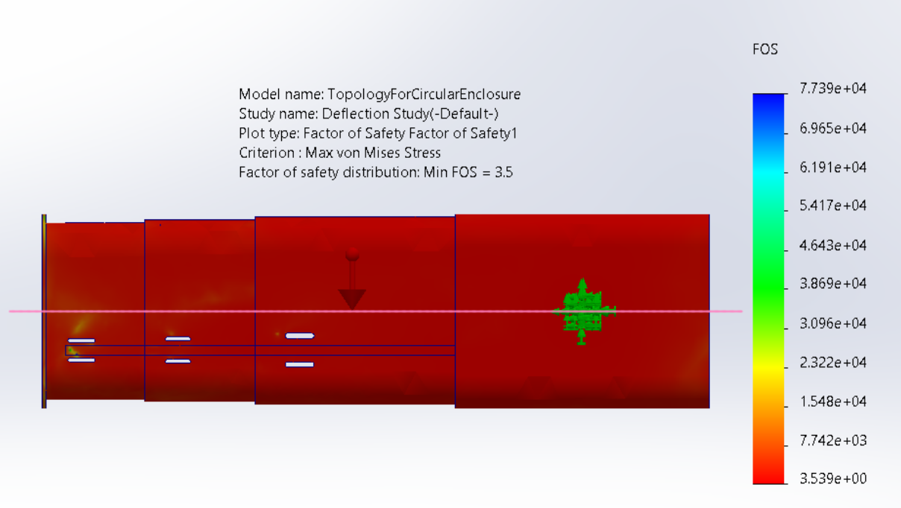
<p style="font-size: 0.85em; color: var(--secondary); margin-top: 5px;">Safety Factor</p>
</div>
</div>

**Key Findings:**
- Stress is very low → expect little fatigue or creep
- Displacement highest at end of hodoscope (as expected) — consider when designing ratchet system for motor/zenith angle control
- **Factor of Safety: 3.5** — above 1, provides reasonable margin

---

### Custom MATLAB FEM Solver

Used a custom **MATLAB-based solver** to perform independent verification:
- Buckling analysis
- Static deflection and load-path evaluations
- Arbitrary-condition FEA verification

The solver implements CPE4/CPS4 elements for plane strain/stress analysis with 4-point Gaussian quadrature integration.

<details>
<summary><strong>View MATLAB FEM Code</strong></summary>

```matlab
% Finite element code for a rectangle subject to any combination of applied
% force and displacement boundary conditions (CPE4, CPS4 Elements)
clear, close, clc;

dx = 30; % x dimension
dy = 5; % y dimension
mx = 24; % # elements in x direction - should always be an even number
my = 4; % # elements in y direction - should always be an even number
mel = mx*my; % total number of elements
mno = (mx+1)*(my+1);

ey = 0.1;
nu = 0.3;
la = nu*ey/((1+nu)*(1-2*nu));
mu = ey/(2*(1+nu));

D = zeros(3,3);
% plane strain
D(1,1) = la + 2*mu;
D(1,2) = la;
D(1,3) = 0;
D(2,2) = la + 2*mu;
D(2,3) = 0;
D(3,3) = mu;
D(2,1) = D(1,2);
D(3,1) = D(1,3);
D(3,2) = D(2,3);

zv = 1/sqrt(3);
z = zeros(4,2);
z(1,1:2) = [-zv,-zv];
z(2,1:2) = [zv,-zv];
z(3,1:2) = [zv,zv];
z(4,1:2) = [-zv,zv];

x = zeros(mno,2); % global nodal coordinates

for j = 1:mx+1 % nodes in x direction
    for i = 1:my+1
        gn = j + (i-1)*(mx+1); % global node #
        x(gn,1) = (j-1)*dx/mx;
        x(gn,2) = dy-(i-1)*dy/my;
    end
end

nc = zeros(mel,4); % element connectivity

for i = 1:my
    for j = 1:mx
        ge = j + (i-1)*mx;
        nc(ge,1) = j + i*(mx+1);
        nc(ge,2) = nc(ge,1)+1;
        nc(ge,4) = j + (i-1)*(mx+1);
        nc(ge,3) = nc(ge,4) + 1;
    end
end

n = zeros(4,4);
% n(q,a) is shape function Na(s1,s2) evaluated at integration point q
for q = 1:4
    n(q,1) = .25*(1-z(q,1))*(1-z(q,2));
    n(q,2) = .25*(1+z(q,1))*(1-z(q,2));
    n(q,3) = .25*(1+z(q,1))*(1+z(q,2));
    n(q,4) = .25*(1-z(q,1))*(1+z(q,2));
end

ns = zeros(4,4,2);
% derivative of shape function Na(s1,s2) w.r.t. sj evaluated at integration point q
for q = 1:4
    ns(q,1,1) = -.25*(1-z(q,2));
    ns(q,1,2) = -.25*(1-z(q,1));
    ns(q,2,1) = .25*(1-z(q,2));
    ns(q,2,2) = -.25*(1+z(q,1));
    ns(q,3,1) = .25*(1+z(q,2));
    ns(q,3,2) = .25*(1+z(q,1));
    ns(q,4,1) = -.25*(1+z(q,2));
    ns(q,4,2) = .25*(1-z(q,1));
end

J = zeros(2,2,mel,4);
invJ = zeros(2,2);
detJ = zeros(mel,4);
nx = zeros(mel,4,4,2);
B = zeros(3,8,mel,4);

for p = 1:mel % all elements
    for q = 1:4 % integration points per element
        for i = 1:2
            for j = 1:2
                for a = 1:4
                    J(i,j,p,q) = J(i,j,p,q) + ns(q,a,j)*x(nc(p,a),i);
                end
            end
        end
        detJ(p,q) = det(J(:,:,p,q));
        invJ = inv(J(:,:,p,q));
        for a = 1:4
            for j = 1:2
                for i = 1:2
                    nx(p,q,a,j) = nx(p,q,a,j) + ns(q,a,i)*invJ(i,j);
                end
            end
            B(1,(a-1)*2+1,p,q) = nx(p,q,a,1);
            B(1,(a-1)*2+2,p,q) = 0;
            B(2,(a-1)*2+1,p,q) = 0;
            B(2,(a-1)*2+2,p,q) = nx(p,q,a,2);
            B(3,(a-1)*2+1,p,q) = nx(p,q,a,2);
            B(3,(a-1)*2+2,p,q) = nx(p,q,a,1);
        end
    end
end

ke = zeros(8,8,mel); % local stiffness matrix
for p = 1:mel
    for q = 1:4
        ke(:,:,p) = ke(:,:,p) + B(:,:,p,q)'*D*B(:,:,p,q)*detJ(p,q);
    end
end

kg = zeros(mno*2,mno*2); % global stiffness matrix assembly
for p = 1:mel
    for a = 1:4
        for b = 1:4
            gna = nc(p,a);
            gnb = nc(p,b);
            for i = 1:2
                for j = 1:2
                    kg(2*(gna-1)+i,2*(gnb-1)+j) = kg(2*(gna-1)+i,2*(gnb-1)+j) + ke(2*(a-1)+i,2*(b-1)+j,p);
                end
            end
        end
    end
end

f = zeros(mno*2,1);

% Define force boundary conditions for uniaxial tension
F = 1E-2;
f(2*(mx+1)-1,1) = F/2;
for i = 2:my
    f(i*2*(mx+1)-1,1) = F;
end
f((my+1)*2*(mx+1)-1,1) = F/2;

% Define zero displacement DOFs
k = 0;
for i = 1:my+1
    gn = (i-1)*(mx+1)+1;
    zudofs(i+k) = 2*gn-1;
    if i == my/2+1
        zudofs(i+1) = 2*gn;
        k = 1;
    end
end

% Manipulate stiffness matrix for boundary conditions
for i = 1:2*mno
    if any(zudofs == i) == 1
        f(i) = 0;
        for j = 1:2*mno
            if j == i
                kg(i,j) = 1;
            else
                kg(i,j) = 0;
            end
        end
    else
        for k = 1:size(zudofs,2)
            j = zudofs(k);
            kg(i,j) = 0;
        end
    end
end

u = kg\f;

% Stress/strain interpolation
clear X Y strainX0 stressX0
np = 1;
[X,Y] = meshgrid([0:dx/mx/np:dx],[0:dy/my/np:dy]);

for k = 1:size(X,1)
    for l = 1:size(X,2)
        x0 = [X(k,l) Y(k,l)];
        j = ceil(x0(1)/(dx/mx));
        if j == 0; j = 1; end
        i = ceil((dy-x0(2))/(dy/my));
        if i == 0; i = 1; end
        p = j + (i-1)*mx;
        midx = 1/2*(x(nc(p,1),1)+x(nc(p,3),1));
        midy = 1/2*(x(nc(p,1),2)+x(nc(p,3),2));
        w = [x(nc(p,3),1)-midx, x(nc(p,3),2)-midy];
        s = [(x0(1)-midx)/w(1),(x0(2)-midy)/w(2)];
        
        N(1) = .25*(1-s(1))*(1-s(2));
        N(2) = .25*(1+s(1))*(1-s(2));
        N(3) = .25*(1+s(1))*(1+s(2));
        N(4) = .25*(1-s(1))*(1+s(2));
        
        strain = zeros(3,4);
        for i = 1:3
            for q = 1:4
                strain(i,q) = (B(i,[1,3,5,7],p,q)*u(2*nc(p,:)-1) + B(i,[2,4,6,8],p,q)*u(2*nc(p,:)));
            end
        end
        stress = D*strain;
        strainNodal = (n\strain');
        stressNodal = (n\stress');
        strainX0(k,l,:) = N*strainNodal;
        stressX0(k,l,:) = N*stressNodal;
    end
end

% Visualization
figure(1)
surf(X,Y,strainX0(:,:,1))
xlabel('x'); ylabel('y'); title('\epsilon_{11}')
view(2); colorbar

figure(2)
surf(X,Y,stressX0(:,:,1))
xlabel('x'); ylabel('y'); title('\sigma_{11}')
view(2); colorbar

u1 = zeros(my+1,mx+1);
u2 = zeros(my+1,mx+1);
for j = 1:my+1
    for i = 1:mx+1
        gn = (j-1)*(mx+1)+i;
        u1(j,i) = u(2*gn-1);
        u2(j,i) = -u(2*gn);
    end
end

figure(3)
surf(X,Y,u1(:,:))
xlabel('x'); ylabel('y'); title('u_{1}')
view(2); colorbar

figure(4)
surf(X,Y,u2(:,:))
xlabel('x'); ylabel('y'); title('u_{2}')
view(2); colorbar
```

</details>

### Precision Rotation Stage Design

Designed a high-accuracy rotation stage to control the detector's zenith angle:

- Created a **solenoid-pin locking mechanism** enabling:
  - **1°-level angular accuracy**
  - Bidirectional motion
  - Reduced vertical clearance between drone and payload
- Designed custom gearbox to rotate an 8 kg payload

<div style="display: grid; grid-template-columns: repeat(2, 1fr); gap: 10px; margin: 20px 0;">
<div style="text-align: center;">
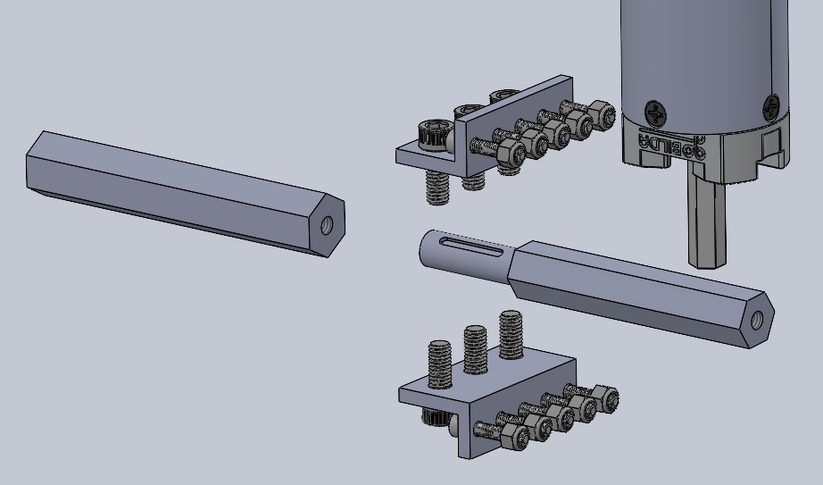
</div>
<div style="text-align: center;">
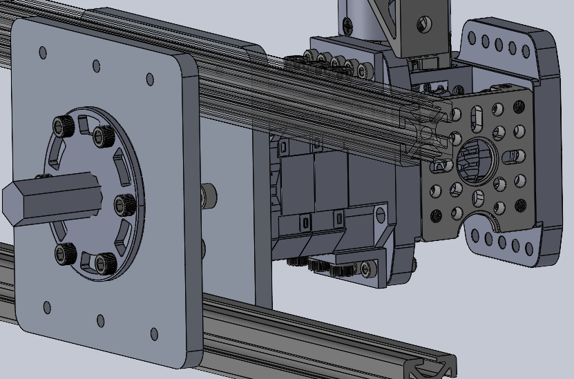
</div>
<div style="text-align: center;">
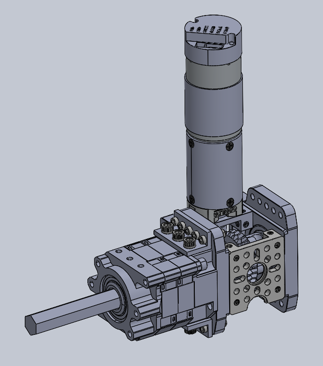
</div>
<div style="text-align: center;">
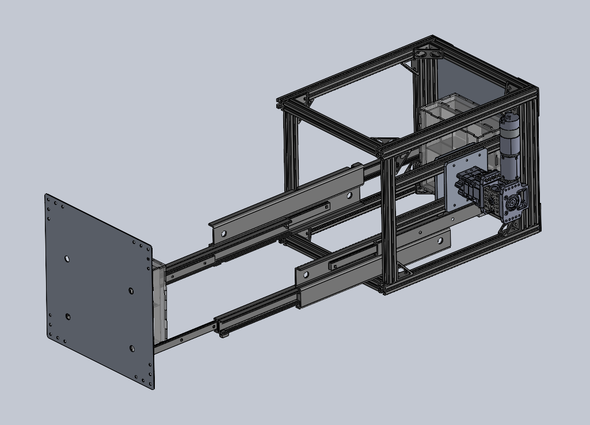
</div>
</div>

### Deployment Mechanism Research

Investigated alternatives to linear slide deployments:

| Mechanism Type | Evaluation Criteria |
|:---------------|:--------------------|
| Pantographic mechanisms | Compactness, alignment precision |
| Elastically deformable systems | Environmental robustness |
| Inflatable structures | Mechanical complexity |
| Telescopic slides | **Selected** — optimal length for muon data collection |

Compared mechanisms based on: compactness, alignment precision, environmental robustness, and mechanical complexity.

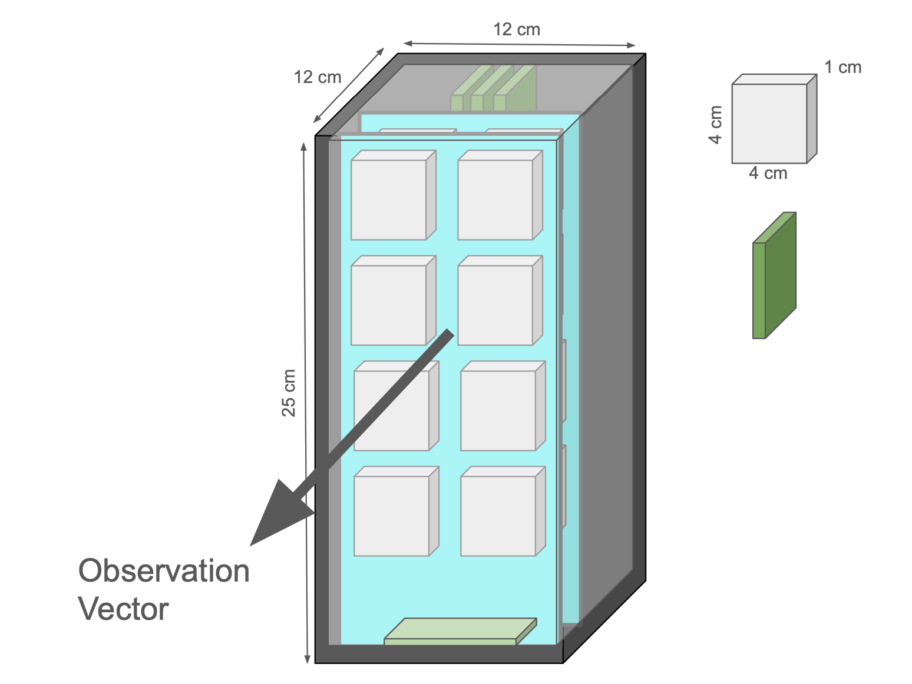

### PCB Integration

The CosmicWatch PCBs presented a size challenge—the main PCB (6.6 × 6.3 cm) was too large for the compact enclosure design. 

**Solution:** Orient larger main PCBs vertically and connect with cables to smaller SiPM/scintillator boards (4 × 4 cm) arranged horizontally as 2×2 arrays for each detection layer.


**System Components:**
- Master node (Raspberry Pi)
- SiPM PCB with scintillator mounted (4 × 4 × 1 cm)
- Main PCB (6.6 × 6.3 × 1 cm)
- PCB connector cables
- Ethernet cable (data: Raspi → surface PC)
- Power cable
- USB cable (data: Arduino → Raspi)

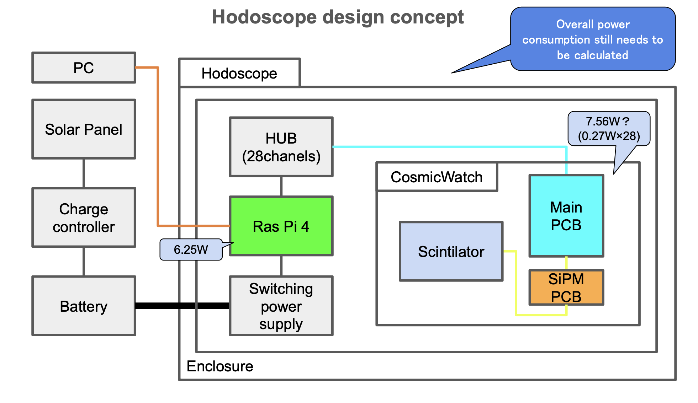

### Failure Analysis

- Developed code for analyzing potential failure modes in the system
- Created tools to simulate and identify weak points in the design
- Documented failure scenarios and mitigation strategies

---

## Technical Background

### How It Works

A hodoscope consists of arrays of scintillator detectors that register the passage of charged particles. When a cosmic ray or muon passes through the detector, it produces light signals captured by silicon photomultipliers (SiPMs). By analyzing the timing and position of these signals across multiple detector layers, the trajectory of the particle can be reconstructed—enabling subsurface density imaging.

### Applications

- Geological surveys and mineral exploration
- Subsurface void detection
- Archaeological site mapping
- Infrastructure inspection

Here is an actual built out hardware version! 
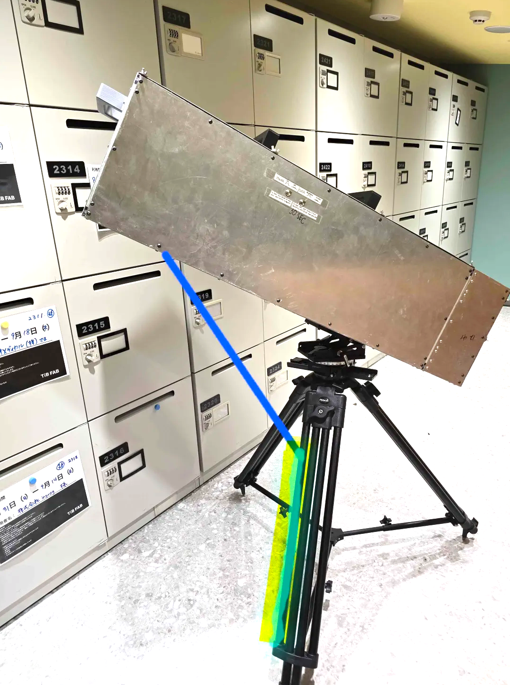

---

## Skills Developed

- **CAD & Mechanical Design:** SOLIDWORKS for full assembly design and plastic enclosures
- **FEA & Optimization:** MATLAB-based topology optimization, buckling and static analysis
- **Mechanism Design:** Precision rotation stages, gearbox design, solenoid locking systems
- **GD&T:** Geometric dimensioning and tolerancing for manufacturing
- **Design for Manufacturing:** Optimizing designs for drone payload constraints, COTS integration
- **PCB Integration:** Mechanical-electrical interface design for compact payloads
- **Research & Trade Studies:** Deployment mechanism comparison and selection
- **Cross-functional Collaboration:** Working with electrical and software teams
- **Technical Documentation:** Creating assembly guides and specifications

---

*Hardware Engineering Internship at [Outer Rim Exploration Inc.](https://ore.green/), 2024*


