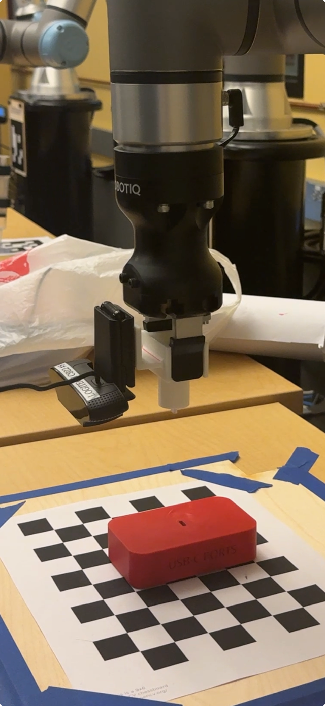
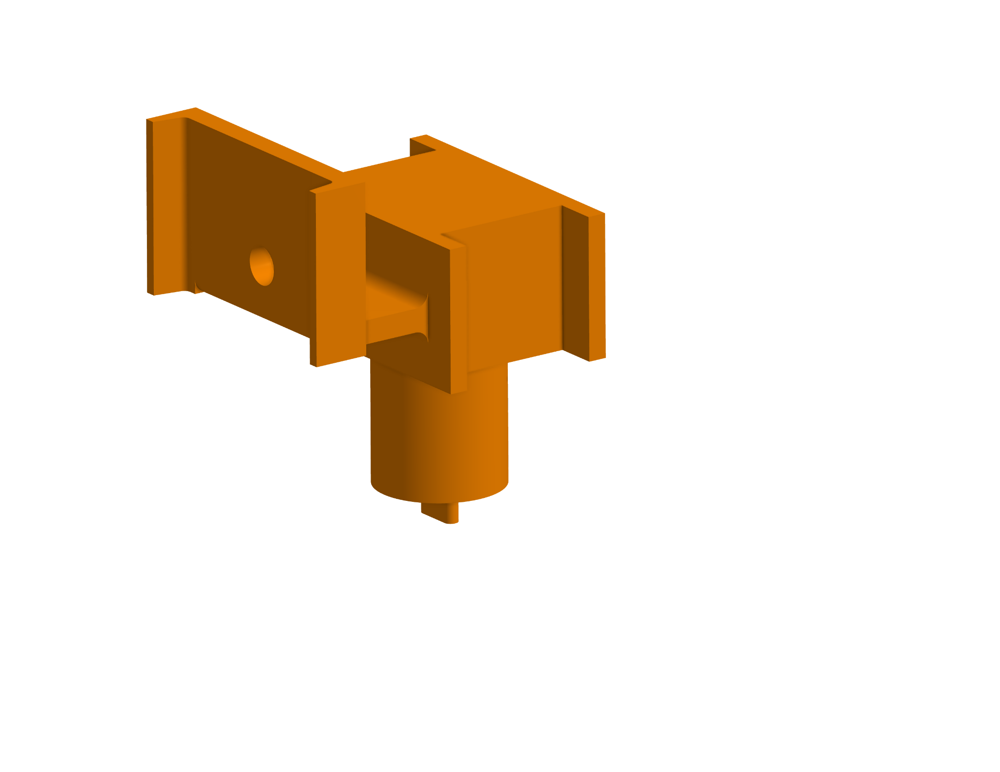
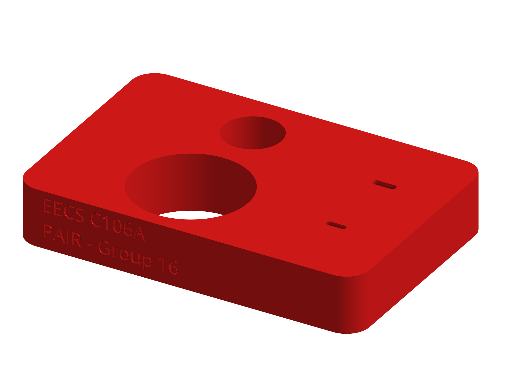
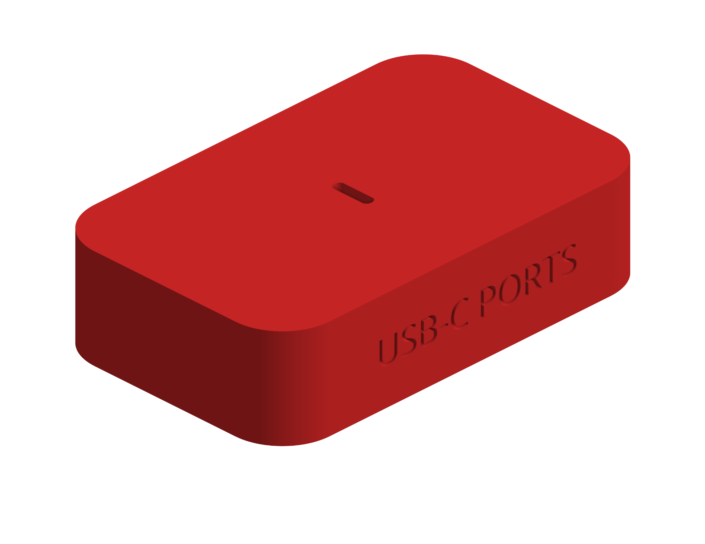
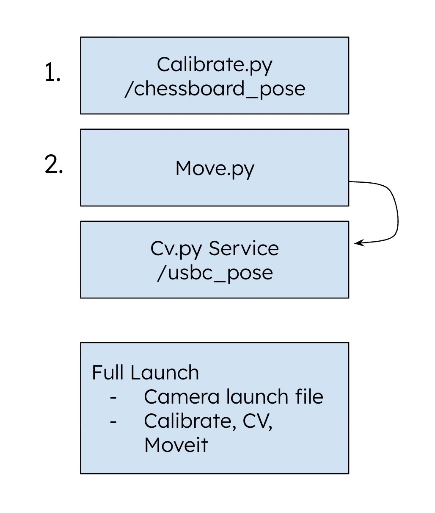
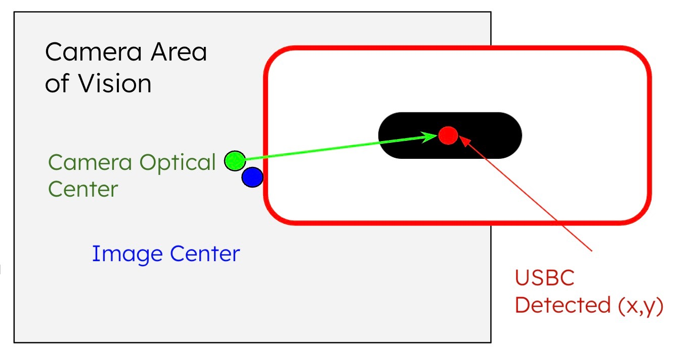
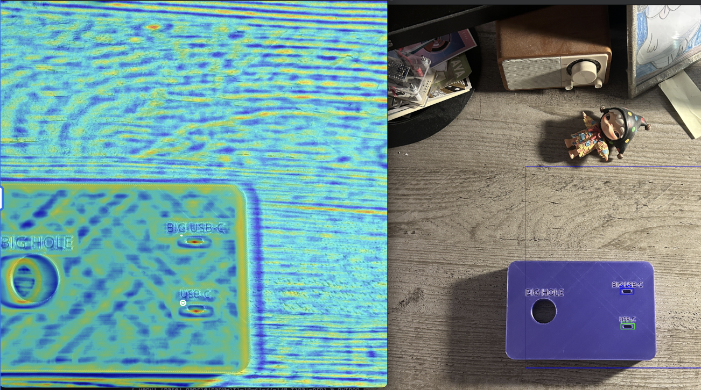

##### Links

+ [Project Website](https://gabrielhan23.github.io/106a-final/)
+ [GitHub Repository](https://github.com/gabrielhan23/106a-final)
+ [CAD: End Effector with Camera Support](https://cad.onshape.com/documents/b038176c4c9ec3856d868651/w/032ba38525306ab1ee9039fb/e/e9bbe3ac70984c201e5ea34b)
+ [CAD: Hole Base Plate](https://cad.onshape.com/documents/0c38fee060fd23d26a7cac4d/w/e889355cfcc5fc49057f094d/e/e1fd3b6e83e237307392d7ef)

---

## 1. Introduction

### The Problem

In the field of industrial automation, the "Peg-in-Hole" problem is a classic benchmark for manipulation capability. While humans perform this task using intuition and high-fidelity tactile feedback, robots struggle with the tight tolerances involved. Our project focuses specifically on inserting a USB-C connector—a task that requires **sub-millimeter precision (±0.5mm)** and delicate force control to avoid damaging the small, reversible port.

### Our Solution

We developed a hybrid approach combining **Eye-in-Hand visual servoing** for coarse alignment with a **force-feedback spiral search algorithm** for fine insertion. The system uses a monocular camera mounted on the robot's end-effector to locate the USB-C port, then transitions to a "blind" tactile search phase that compensates for calibration errors and ensures safe, successful insertion.

### The Impact

By solving this precision manipulation challenge with low-cost sensors (a webcam and the UR7e's built-in force sensor), we demonstrate that sophisticated insertion tasks don't require expensive force/torque sensors or sub-millimeter positioning systems. This approach can be adapted for automated testing, electronics assembly, and any application requiring reliable connector mating in industrial environments.

### Project Goals

The primary objective was to develop a "blind-capable" insertion system. We aimed to build a robotic system that could:

1. Visually identify a USB-C port on a flat surface using a monocular camera
2. Align a robot arm (UR7e) with the target using visual servoing
3. Execute a tactile "spiral search" maneuver to compensate for visual calibration errors
4. Insert the connector without exceeding a safety force threshold of 10N

### Why is this interesting?

Standard industrial robots rely on perfect calibration and fixed fixtures. If a part moves by 2mm, a standard robot will crash. Our project solves the **Unstructured Environment** problem. By combining vision (for "getting close") and force (for "getting it right"), we created a system that works even if the charging port is moved or placed under different lighting conditions.

### Real-World Applications

- **Automated Product Testing:** Robots plugging/unplugging devices to test port durability in manufacturing
- **EV Charging:** Autonomous charging stations connecting to vehicles
- **Electronics Assembly:** Precision mating of connectors during PCB assembly
- **Everyday Household:** Ensuring personal devices are being charged overnight for the next day of work

---

## 2. Design

*Our approach to creating a precision USB-C insertion system*

### Design Criteria

To achieve a successful insertion, our system had to meet the following criteria:

| Criterion | Target |
|:----------|:-------|
| Detection Precision | Align tool tip within <1.0mm of port center |
| Robustness | Handle slight misalignments in X/Y plane |
| Insertion Precision | >70% success rate with <5mm localization error |
| Safety | Stop immediately upon meeting resistance |

### Final Design: Four-Stage Pipeline

1. **Calibration:** Move the robot to 18 unique calibration positions and measure the chessboard pose. Using the chessboard pose in camera's frame and end effector positions (joint states), calculate the end effector to camera transform.

2. **Blind Shift:** Move the end-effector down to a pre-align height and align the camera directly with the chessboard. That way, as long as the USB-C is aligned with the chessboard, we will know how to insert.

3. **Visual Shift and Dive:** Use the camera to detect the USB-C port and iteratively align the camera (not end-effector) above it, then move down to the insertion point.

4. **Force-Guided Spiral Search:** Transform so that the end effector (instead of camera) is aligned with the port. Engage force mode and perform a spiral search pattern until the port is found, then insert.

### Design Trade-offs

We originally chose to assume the transform between the camera and end effector was fixed. That way, we can align the camera and move straight down to insert into the port. However, we eventually realized even the slightest error in camera mounting would cause significant misalignment at the tool tip. Thus, we used camera calibration to reduce error in each step.

In order to achieve higher accuracy, we revised our scope to not picking up *any* cable for the rigidity of a fixed tool. This reduced the complexity of cable detection as well as cable pick up, allowing us to focus on the insertion logic and execution. Ultimately, we pivoted a decent amount from our initial proposal (due to our conversation with our assigned TA) to prioritize robust core functionality of the USB-C twist of the traditional peg insertion problem.

We also switched from joint-space planning to **Cartesian path planning** to ensure the camera remained perpendicular to the workspace.

### Impact of Design Choices: Real-World Implications

Our system was designed not just for a lab demo, but to model how robust assembly lines function under uncertainty. We focused on bridging the gap between "computer vision" and "mechanical reality."

#### 1. Hybrid Strategy: Mimicking Industrial "Blind" Assembly

**Design Choice:** We handed off the "last millimeter" of insertion to a tactile force-guided spiral search rather than relying on perfect vision.

**Real-World Value:** In factory environments, lighting is inconsistent and metallic parts (like USB-C ports) cause specular reflections that blind depth sensors. By decoupling success from perfect visibility, our approach mirrors cost-effective industrial automation where "compliance" (tactile sensing) is prioritized over expensive, infinite-resolution cameras.

#### 2. Cartesian Planning: Enhancing Cobot Safety

**Design Choice:** We enforced strictly linear Cartesian paths rather than the curved, energy-efficient arcs of joint-space interpolation.

**Real-World Value:** In collaborative workspaces (Cobots), predictability is safety. Operators can intuitively anticipate a linear path, whereas joint-space arcs can swing unpredictably into human zones. Linearity also ensures sensors remain perfectly aligned with the workspace, eliminating the "perspective drift" common in dynamic environments.

#### 3. Software-Compensated Hardware (Calibration)

**Design Choice:** We utilized a custom 18-point hand-eye calibration routine to solve for physical offsets, rather than relying on fixed CAD assumptions.

**Real-World Value:** This approach drastically lowers the "barrier to entry" for hardware. It demonstrates that high-precision tasks do not require expensive, perfect manufacturing. By using software to mathematically correct for physical imperfections (like loose mounts or 3D printing tolerances), manufacturers can achieve sub-millimeter accuracy using cheaper, off-the-shelf components.

---

## 3. Implementation

### Hardware Setup



### CAD Models

| End Effector with USB-C | Baseplate (Tolerance) | Baseplate (To Spec) |
|:-----------------------:|:---------------------:|:-------------------:|
|  |  |  |

### Mechanical Architecture

We opted for a **Fixed-Tool, Eye-in-Hand** configuration:

- **Calibration Board:** A 9×6 checkerboard pattern (23.25mm squares) provides the "World Frame" and solves scale ambiguity
- **The End Effector:** A custom 3D-printed end effector held by the gripper of the UR7e. This also serves as a bracket to rigidly mount a Logitech C922 webcam parallel to the tool flange, with a USB-C shaped stub at the bottom to serve as a connector
- **The USB-C Port:** A 3D-printed USB-C port on a baseplate




---

### Software A. Perception: The 'Calibration' Node

The core perception logic relies on a robust OpenCV pipeline encapsulated within the `CalibrationNode`. We utilize `cv2.findChessboardCorners` to identify the grid pattern in the raw video feed, followed immediately by `cv2.cornerSubPix` to refine these detections to sub-pixel accuracy. This refinement step is crucial for high-precision insertion tasks, as it minimizes quantization error before any geometric calculations occur.

Once the 2D pixel coordinates are locked, `cv2.solvePnP` matches them against the known 3D geometry of the chessboard (`obj_points`). This algorithm solves the Perspective-n-Point problem, outputting the rotation and translation vectors that define exactly where the chessboard sits relative to the camera's optical center.

To make this spatial data actionable for the robot, we perform a rigorous coordinate transformation sequence. The raw output from the vision pipeline is in the camera's optical frame, which is distinct from the robot's coordinate system. The code converts the rotation vectors into quaternions using `scipy.spatial.transform` and leverages the ROS 2 `tf2` buffer to transform the pose from the `camera_link` frame to the `base_link` frame.

Finally, the node functions as a managed state machine rather than a continuous stream, ensuring system stability. It utilizes a ROS service (`/calibrate_height`) to trigger detection only when the robot is static, preventing motion blur from corrupting the measurement.



**Pseudocode:**

```python
def process_frame(image):
    # 1. Detection: Find grid pattern in 2D image
    corners_2d = cv2.findChessboardCorners(image)
    
    if found:
        # 2. Refinement: Improve accuracy to sub-pixel level
        refined_corners = cv2.cornerSubPix(corners_2d)
        
        # 3. PnP Solver: Match 2D pixels to known 3D geometry
        pose_in_camera = cv2.solvePnP(refined_corners, known_3d_points)
        
        # 4. Transformation: Convert to Robot Base Frame
        pose_in_base = tf_buffer.transform(pose_in_camera, 
                                          from="camera_link", 
                                          to="base_link")
        
        publish(pose_in_base)
```

---

### Software B. Motion Planning: The 'Move' Node

This node acts as the system's "Brain," using a **Finite State Machine** to command the UR7e via MoveIt. It orchestrates the transition from visual alignment to tactile insertion.

#### The Control Loop (FSM)

- **ALIGN:** Uses closed-loop visual servoing to minimize error to <1.0mm
- **DIVE:** Descends to a "pre-insert" height (Z=12cm) while locking X/Y alignment
- **SHIFT:** Executes a "blind shift" using TF2 transforms to physically swap the camera position with the gripper tip
- **SPIRAL:** Triggers the `/spiral_search` service, handing off control to force feedback

#### Cartesian Path Planning

We prioritize **Cartesian Path Planning** over joint interpolation. By enforcing strictly linear motion, we prevent the arc-induced "perspective drift" common in joint moves. This ensures the camera remains perpendicular to the target throughout the descent.

#### The "Shift"

The **SHIFT** state handles the critical hand-eye coordination. The code calculates the real-time inverse transform between `camera_link` and `tool0`, determining exactly how to position the gripper where the camera lens just was.

**Pseudocode:**

```python
state = "ALIGN"
while node_is_running:
    if state == "ALIGN":
        error_vector = get_usb_c_position()
        if magnitude(error_vector) < 1.0mm:
            state = "DIVE"
        else:
            move_cartesian(dx=error_vector.x, dy=error_vector.y)
            
    elif state == "DIVE":
        move_cartesian(dz=-0.12)
        state = "SHIFT"
        
    elif state == "SHIFT":
        offset = get_transform(from="camera_link", to="tool0")
        move_cartesian(offset) 
        state = "SPIRAL"
        
    elif state == "SPIRAL":
        trigger_service("/spiral_search")
        stop_cartesian_control()
```

---

### Software C. Object Detection: The 'CV' Node

While the Calibration Node handles static alignment, the `CV` node is responsible for real-time target detection. Because the robot may approach the USB-C port from varying heights (changing the apparent size of the port), standard template matching is insufficient.

To solve this, we implemented a **Multi-Scale Template Matching** pipeline. The algorithm iteratively resizes the template across a defined range (0.1% to 1.0% of the image area) to ensure scale invariance. We utilize **Normalized Cross-Correlation (NCC)** (`cv2.TM_CCOEFF_NORMED`) as our matching metric, which makes the system robust to global lighting changes—a critical feature for detecting metallic ports that reflect light unpredictably.


*Figure: Correlation Heatmap. Red areas indicate high probability matches (NCC > 0.8), while blue areas indicate low correlation.*

Finally, to prevent false positives from cluttering the data, we apply **Non-Maximum Suppression (NMS)**. This filters out overlapping bounding boxes, ensuring that only the single strongest detection candidate is published to the `/usbc_pose` topic.

**Pseudocode:**

```python
def find_usbc_port(image, template):
    all_matches = []
    
    # 1. Multi-Scale Search
    for scale in linspace(min_scale, max_scale, 20):
        resized_template = cv2.resize(template, scale)
        
        # 2. Normalized Cross-Correlation
        heatmap = cv2.matchTemplate(image, resized_template, TM_CCOEFF_NORMED)
        
        # 3. Thresholding
        locations = where(heatmap > 0.8)
        all_matches.append(locations, score)
    
    # 4. Non-Maximum Suppression (NMS)
    best_match = non_max_suppression(all_matches, overlap_thresh=0.3)
    
    return best_match.center_x, best_match.center_y
```

---

### Software D. Force Control: The 'SpiralSearch' Node

Standard ROS topics (and our attempted use of a load cell) have too much latency (50-100ms) for force insertion. We solved this by injecting **URScript** directly into the controller to toggle force mode on the UR7e.

#### The Algorithm

- Apply 4N downward force (Force Mode)
- Move in a square spiral pattern (0.5mm step size)
- Monitor Z-position. If Z drops > 3mm, trigger **SUCCESS**

**Pseudocode:**

```python
def _perform_spiral_search(self):
    ur_script = """
    force_mode(p[0,0,0,0,0,0], [0,0,1,0,0,0], [0,0,-5.0,0,0,0], 2, ...)
    while step_count < max_steps:
        # Move in expanding spiral (0.5mm steps)
        # Check Z-height
        if drop > 0.003:  # 3mm drop detected
            textmsg("HOLE FOUND!")
            break
    """
    self.script_publisher.publish(ur_script)
```

We put all of our services, MoveIt, camera initialization into launch files for easier management and reproducibility.

---

## 4. Results

### Quantitative Performance

| Metric | Result |
|:-------|:------:|
| Alignment Precision | ±1mm of port center |
| Insertion Success Rate | **80%** |
| Localization Error | <5mm pre-insertion |
| Force Safety Threshold | 10N |

**Alignment Precision:** The visual servoing consistently brought the tool tip within ±1mm of the port center.

**Insertion Success:** In final trials, the system achieved an **80% success rate** with **<5mm localization error pre-insertion**. Failures were typically due to calibration drift causing the spiral search to start too far from the hole.

### Video Demonstrations

#### Full System Demo
<video width="100%" controls muted>
  <source src="images/demo.mp4" type="video/mp4">
</video>
<p style="text-align: center; font-style: italic; color: var(--secondary);">Full system demonstration: Alignment → Shift → Spiral → Insertion</p>

<div style="display: grid; grid-template-columns: repeat(2, 1fr); gap: 20px; margin-top: 30px;">
<div>
<video width="100%" controls muted>
  <source src="images/better.mp4" type="video/mp4">
</video>
<p style="text-align: center; font-style: italic; color: var(--secondary);">The "Wiggle" (Spiral Search) in action</p>
</div>
<div>
<video width="100%" controls muted>
  <source src="images/caliscreen.mp4" type="video/mp4">
</video>
<p style="text-align: center; font-style: italic; color: var(--secondary);">Computer Vision detecting the board</p>
</div>
</div>

<div style="display: grid; grid-template-columns: repeat(2, 1fr); gap: 20px; margin-top: 20px;">
<div>
<video width="100%" controls muted>
  <source src="images/calibration.mp4" type="video/mp4">
</video>
<p style="text-align: center; font-style: italic; color: var(--secondary);">Calibration process</p>
</div>
<div>
<video width="100%" controls muted>
  <source src="images/prefix.mp4" type="video/mp4">
</video>
<p style="text-align: center; font-style: italic; color: var(--secondary);">Flawed transform logic (live demo)</p>
</div>
</div>

<div style="margin-top: 20px;">
<video width="100%" controls muted>
  <source src="images/postfix.mp4" type="video/mp4">
</video>
<p style="text-align: center; font-style: italic; color: var(--secondary);">Fixed and 100% accurate transform logic</p>
</div>

---

## 5. Conclusion

We successfully engineered a robotic system capable of sub-millimeter insertion without expensive hardware. The project demonstrated that **Hybrid Control (Vision + Force)** is far more reliable than Vision alone. The visual system gets us "in the ballpark," but the tactile system "scores the run."

Overall, we are quite content with our work as we ended up successfully accomplishing our intended target outcomes—achieving an 80% success rate with <5mm localization error given our adjusted project (focusing only on USB-C insertion) while leaving extensive room for taking the project to the next level going forward.

### Challenges

1. **Hand-Eye Calibration:** Finding the exact offset between camera and tool was our biggest difficulty. We spent significant time tuning parameters until we found proper values for fully accurate calibration. Our live demo utilized flawed calculation logic due to the relationship complexity between varying transforms.

2. **Force Mode Discovery:** The solution to force mode was an elaborate journey as we were unaware of the UR7e's default ability to enter a force detection state. Prior to this, we designed our own custom cantilever load cell setup where we attempted to: a) interface an ESP32 serially; b) publish load-cell data to MQTT broker for subscribers. Both proved too slow for our use case.

3. **Search Pattern Optimization:** With the nature of the USB-C shape, a typical circle-shaped search pattern is not optimal. We tried varying spiral search patterns to find the most effective for USB-C insertion.

4. **Robust CV Detection:** Given our goal of having redundancy of USB-C detection in varying lighting conditions, we needed effective detection with high confidence interval. We tried varying CV options including Keyhole detection (and many more) to find the most consistent and robust contour detection.

### Future Work

- **Fix the "bonk" error** after toggling force mode—our UR7e setup severs the preexisting connection when injecting URScript, causing an error upon completion
- **Rotated USB-C functionality** to properly plug into ports that aren't already aligned inline with the connector
- **Widen apparatus of port types** to succeed with any commonly used port types (USB-A, HDMI, etc.)
- **Pick up functionality** to pick up the cable itself prior to insertion

---