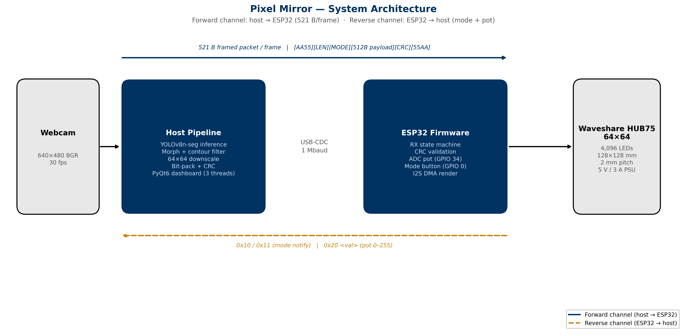
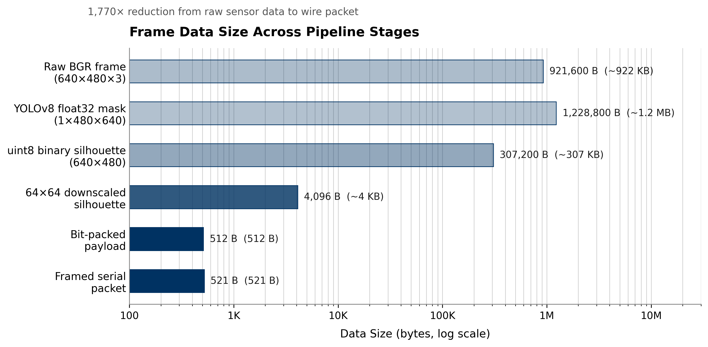
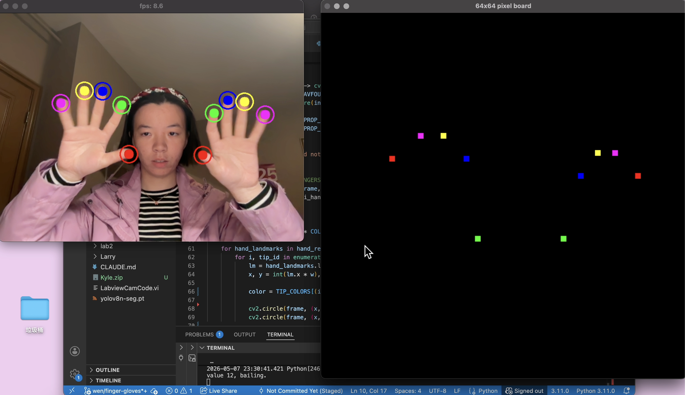
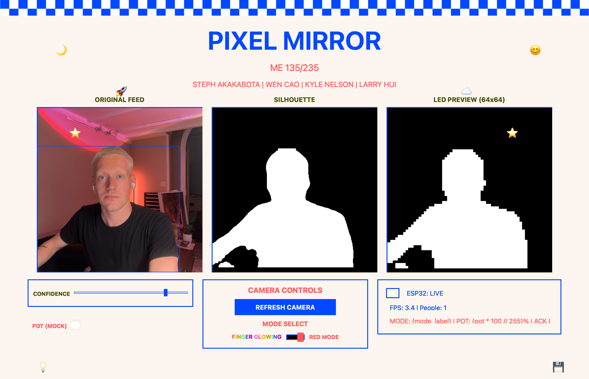

## Abstract

*Pixel Mirror* is a real-time computer-vision art project. A `YOLOv8-seg` instance-segmentation CNN extracts a binary silhouette of every person in frame; `MediaPipe Hands` extracts fingertip positions and streams both over a 1 Mbaud USB-CDC link to an ESP32 Feather V2 driving a Waveshare 64×64 HUB75E LED panel. The system has two display modes selected by a physical button: a **silhouette mode** where the person's shape is lit and a 10 kΩ potentiometer interpolates color from white to red, and a **gloving mode** where up to ten fingertips are rendered as colored 3×3 dots on a black field. A PyQt6 GUI hosts the live camera, the silhouette, a colored 64×64 LED preview mirroring the physical panel, and a control surface with sliders, buttons, and link telemetry. End-to-end vision-to-pixel latency sits between 50 and 70 ms at 25–30 fps; the link delivers ≥99% of frames on the first attempt.

---

## Background and Motivation

### Engineering as Art

Mechanical engineering can be artwork. *Pixel Mirror* is built around that claim: a low-resolution LED canvas that turns a passer-by's movements into real-time pixel art, the way an exhibit might in a museum. The viewer walks past, their silhouette appears on the 64×64 panel, and a small physical control surface — one potentiometer and one button — lets them change what the panel does with their shape.

The project leans on the vocabulary of engineering coursework (instance segmentation, framed serial protocol, ADC smoothing, panel DMA) alongside the vocabulary of visual art (silhouette, gesture, color wash, palette), and the claim is that the two are describing the same activity.

A second motivation was *systems integration as a primary deliverable*. The project combines three subsystems that are each nontrivial on their own: a deep-learning CV chain, a multi-threaded GUI, and an ESP32. The hard problems live at the intersection — the engineering content sits mostly in the protocol design, the threading model, and the failure modes that emerge when those three things have to agree about state.

### Project Goals

1. Build a real-time CV system around `YOLOv8-seg` restricted to the COCO `person` class, with end-to-end vision-to-pixel latency in the tens of milliseconds.
2. Expose interactive visual filtering through a GUI — sliders for confidence and LED threshold, buttons for camera reset and re-calibration, plus a live LED preview that mirrors what the physical panel is showing.
3. Run all host↔ESP32 traffic over one bidirectional UART link, with framed packets and CRC protection so the communication layer survives noise, retries, and a full hardware pivot.

---

## System Architecture

The system decomposes into three logical nodes connected by a single serial link:

- **Image-capture node** — The laptop's built-in webcam captures raw 640×480 frames. The same frame feeds both the GUI display and the LED panel after compression and transport.
- **Host node (Python on the laptop)** — Runs `YOLOv8-seg`, applies per-person bounding boxes, builds an annotated silhouette, downsizes to a 64×64 pixelated frame, hosts the PyQt6 dashboard, and sends processed pixel data to the display node over USB serial.
- **Display node (ESP32 + button + potentiometer + panel)** — Receives framed pixel data from the host and renders to the HUB75 panel. A push-button toggles modes; the potentiometer controls color-wash intensity in real time. Both control inputs stream **back** to the host so the GUI preview matches the physical panel.


*Figure 1: The three-node system architecture. The computer and microcontroller talk bidirectionally in real time.*

---

## Computer-Vision Stack

The vision pipeline runs every frame in roughly this order on the GUI's worker thread:

1. **Frame capture** — OpenCV `VideoCapture` opens the built-in webcam at 640×480. Backend selection is portable: AVFoundation on macOS, V4L2 on Linux/Jetson.
2. **YOLOv8 instance segmentation** — A `yolov8n-seg.pt` checkpoint (~6 MB) is loaded once at startup. Each frame is passed to `model.predict(..., classes=[0], conf=…)`, restricting detections to the COCO `person` class. The model emits bounding boxes and per-instance masks.
3. **Silhouette assembly** — Each per-person mask is resized to the camera frame, then OR'd into a single binary silhouette. A 5×5 elliptical morphological close smooths jagged edges.
4. **Contour cleanup** — `findContours` extracts external contours; contours below 0.2% of frame area are dropped, the rest are re-filled into a clean silhouette.
5. **Downscale to 64×64** — The clean silhouette is resampled with `INTER_AREA`, then re-thresholded at 96. The downsize *is* the pixelation. This achieves a **1,770× reduction** from the 921 KB raw frame down to a 521-byte framed serial packet.
6. **MediaPipe Hands** — Up to two hands; five fingertip landmarks per hand (IDs 4, 8, 12, 16, 20) are mapped to the 64×64 grid and assigned a color from a cycling 5-color palette. In silhouette mode MediaPipe is skipped entirely, saving ~6–8 ms per frame.
7. **Serial transmission** — Depending on the ESP32's reported mode, either the 64×64 binary mask or the fingertip list is packed and sent over the framed serial protocol.


*Figure 2: Data volume at each stage on a log scale. A raw frame is nearly 1 MB; the transmitted packet is 521 bytes.*


*Figure 3: Gloving mode tracking up to ten fingertips concurrently.*

---

## Hardware

| Part | Role |
| :--- | :--- |
| M-series MacBook | `YOLOv8-seg`, MediaPipe, PyQt6 GUI, serial host |
| Laptop built-in webcam (640×480) | Image source |
| Adafruit ESP32 Feather V2 (PICO-MINI-02, 8 MB flash, 2 MB PSRAM) | Frame RX, panel driver, button + pot I/O |
| Waveshare RGB-Matrix-P2 64×64 HUB75E, 2 mm pitch, 4096 LEDs | Output |
| 10 kΩ linear potentiometer on GPIO 33 (ADC1_CH5) | Color-blend control |
| Tactile pushbutton on GPIO 34, external 10 kΩ pull-up to 3.3 V (input-only pin, no internal pull-up) | Mode toggle |
| Separate 5 V / 3 A+ DC PSU for panel; ESP32 powered from MacBook USB | Avoids brownout on full-white frames |
| 1000–2000 µF electrolytic across panel V+/GND | Soaks turn-on inrush |
| USB CDC, 1,000,000 baud, 8N1 | Host ↔ ESP32 link |

The ESP32 talks to the panel over HUB75 through the `ESP32-HUB75-MatrixPanel-DMA` library, which uses the I²S peripheral in DMA mode to clock pixels out at panel-refresh rates with almost zero CPU cost. Three GPIOs that DevKitC tutorials assume are free are unavailable on the Feather V2: GPIOs 16 and 17 are reserved for on-module PSRAM, and GPIO 23 is not broken out. The A, D, and CLK signals were remapped to GPIOs 21, 20, and 22 respectively.

---

## Technical Challenges

**LabVIEW → PyQt6 GUI.** The original plan was a LabVIEW GUI. We pursued it for two weeks; coupling was the problem. The same project had to load the CNN, decode camera frames at frame rate, talk to a serial port at 1 Mbaud, and render a custom pixel-art aesthetic — all at once. The rewrite to PyQt6 collapsed the entire stack into one Python process, one thread model, and one debugger.

**OpenCV masking → YOLOv8-seg.** The first CV approach was background subtraction (MOG2/KNN) plus contour filtering. It worked in controlled lighting and fell apart the moment anyone moved the camera, opened a window, or changed shirt color. `YOLOv8-seg` is class-aware (it knows what a *person* is, not what "something that moved" is) and motion-independent. The cost — ~25 ms of inference per frame on CPU — is paid willingly.

**Wiring the 64×64 LED matrix.** HUB75 has thirteen logic lines plus power/ground, and the Feather V2 hides three GPIOs that tutorials assume are free. Other gotchas — the GPIO 12 strapping pin, panel-vs-ESP32 power-rail separation, the 1000–2000 µF bulk cap, and the optional 74HCT245 level shifter for 3.3 V→5 V — are documented in `Kyle/firmware/WIRING.md`. Once documented, bring-up at a new venue is a ~30-minute procedure.

**Grimes deployment vs. MVP.** The minimum-viable build runs the 64×64 panel locally on the bench. The Grimes Engineering Center deployment runs the **same** Python code, wire protocol, and ESP32 firmware. The Grimes deployment became a hardware swap rather than a software port because the wire format never changed.

The system also began life on different hardware: an NVIDIA Jetson Nano with a PS3 Eye camera, MOG2/KNN background subtraction, and a WS2812B 108×108 NeoPixel grid driven by FastLED. That archived path lives at `Kyle/_archive/`. The pivot to HUB75 + YOLO happened around mid-semester: NeoPixel updates are bandwidth-starved on a 108×108 grid (~35 ms of raw bit-banging per frame before any compute), and background subtraction is fragile under live-demo conditions. The protocol had been written generically enough that the pivot required only updating the payload size from 1458 bytes to 512.

---

## GUI, Real-Time, and Multitasking


*Figure 4: The PyQt6 GUI showing the live camera feed, silhouette mask, and 64×64 LED preview side by side.*

The user-facing application is a single PyQt6 desktop app. The Qt threading model (QThread + signals/slots with `QueuedConnection`) maps cleanly onto the producer/consumer structure needed. There is no LabVIEW anywhere.

### GUI Layout

The window opens at 1280×980 minimum: a checkered top border; a header block with the title "PIXEL MIRROR" in 56 pt Fixedsys; a row of three live viewports (*Original Feed*, *Silhouette*, *LED Preview*); and a footer with sliders (CONFIDENCE 0–100%, LED THR 0–255), buttons (AI SCENE ANALYSIS, RESET CAMERA, RE-CALIBRATE), and a status panel reporting FPS, people count, ESP32 connection state, current mode, pot percentage, and running ACK/NAK counters. Twelve draggable pixel-art emoji decorations float over the layout via custom `QLabel` mouse event handlers.

### Real-Time Event Sources

| Event | Mechanism | Cost |
| :--- | :--- | :--- |
| Panel refresh | Hardware timer + I²S DMA interrupt | ~0 CPU |
| New frame from host | UART RX interrupt → `pollFrame()` state machine | Per-byte |
| Mode toggle | Active-low GPIO 34, 50 ms software debounce | Per-loop |
| Pot adjustment | 12-bit ADC + EWMA (α = 0.1), rate-limited to 50 ms | Per-loop |
| GUI render | `change_pixmap_signal` from worker thread → GUI thread repaint | Per-frame |

### Threading Model

`VisionWorker` is a `QThread` that owns the camera, YOLO model, MediaPipe instance, and `SerialSender`. On each frame iteration it emits two signals: `change_pixmap_signal` carries three numpy arrays (annotated camera, silhouette, LED preview), and `status_signal` carries FPS, people count, mode, pot value, connection state, and ack/nak counts. The worker never blocks waiting for the GUI to paint.

A second throttle gates on `TX_MIN_INTERVAL_S = 1.0 / 30.0`: even when YOLO inference finishes under 33 ms, the host waits until at least 33.3 ms have elapsed since the last frame before pushing the next one. Combined with the one-frame-in-flight ACK gate, this pins host throughput to exactly the rate the panel can usefully consume.

### Latency Budget

| Stage | Cost |
| :--- | :--- |
| Camera capture + colorspace convert | ~5 ms |
| `YOLOv8-seg` inference (CPU) | ~25 ms |
| Mask cleanup + downscale + bit-pack | ~3 ms |
| `MediaPipe Hands` (gloving mode only) | ~6–8 ms |
| Serial wire time at 1 Mbaud (521 B) | ~5 ms |
| Firmware ingest + render + ACK | ~2 ms |
| **Total (silhouette mode)** | **~40–45 ms** |
| **Total (gloving mode)** | **~50–70 ms** |

### Multitasking on the ESP32

The firmware runs on a single FreeRTOS task and time-slices cooperatively. Each iteration: reads and debounces the button; pumps the byte-by-byte `pollFrame()` state machine; reads and EWMA-smooths the pot ADC; emits a pot notification if the value has changed and 50 ms have elapsed; repaints the panel if the dirty bit is set; and checks the 5-second watchdog. A typical idle iteration completes in under 200 µs.

---

## Communication Protocol

The link is USB-CDC at **1,000,000 baud, 8-N-1**. On top of that byte stream the protocol carries: bulk image data (host → ESP32), sensor telemetry (ESP32 → host), and a per-frame ACK/NAK reliability layer.

### Why a Framed Custom Protocol

USB-CDC is a byte stream, not a packet stream. Any protocol on top of it has to answer four questions per frame: *where does it start, where does it end, is it intact, and did it arrive?* The 9-byte framing envelope below answers all four for a 521-byte mode-0 packet — an overhead of ~1.7%.

A mode-0 frame is `2 + 2 + 1 + 512 + 2 + 2 = 521 bytes` — about 5.21 ms at 1 Mbaud with 8N1 framing. Add a ~1 ms ACK round-trip and the link is busy for ~6.2 ms per frame against a **33 ms budget at 30 fps**. The link is roughly **5× over-provisioned**, which absorbs NAK retransmits without dropping a visible frame.

### Frame Structure

```
[ 0xAA 0x55 | LEN_HI LEN_LO | MODE | PAYLOAD (512 B) | CRC_HI CRC_LO | 0x55 0xAA ]
```

CRC is CRC-16/CCITT-FALSE (poly 0x1021, init 0xFFFF). The Python and C++ implementations were validated against each other with a round-trip test before bring-up.

### Reliability Layer: ACK/NAK

The ESP32 writes back `0x06` (ACK) on CRC match or `0x15` (NAK) on error. The host waits up to 50 ms and retries up to three times before dropping the frame. Frame-by-frame stats (frames sent / acked / naked) are displayed in the GUI status panel.

### Sideband Telemetry (ESP32 → Host)

| Byte | Meaning |
| :--- | :--- |
| `0x10` | Mode switched to mask mode |
| `0x11` | Mode switched to fingertip mode |
| `0x20 <v>` | Smoothed pot value v ∈ [0, 255], up to 20 Hz |

All sideband codes are disjoint from the start-sync byte `0xAA`, so no escape character is needed.

### Error Recovery

- **Single-bit corruption** — CRC catches it; NAK returned; host retries. The previous good frame stays on the panel, so transient noise reads as a brief freeze rather than a black flash.
- **Frame de-sync** — A 100 ms timeout fires if no further bytes arrive after a leading `0xAA`. State resets to `RX_WAIT_AA`; the next valid sync re-acquires within ~6 ms at 1 Mbaud.
- **Host crash / disconnect** — A 5-second watchdog on `lastFrameMs` blanks the panel if no valid mask frame arrives while in mask mode.

---

## Notable Engineering Details

### Threaded GUI Back-Pressure Contract

PyQt's signal/slot mailboxes are unbounded. If the GUI emits 30 fps of `send_mask` requests and the worker's per-frame cost climbs past 33 ms (e.g., one NAK + one 50 ms retry), the queue grows without bound. The fix: the GUI never emits a new `send_mask` until it sees `send_complete_signal` from the previous one. This pins queue depth at 1 and bounds host-to-panel latency to one frame's worth of transport regardless of link quality.

### ESP32 Receive State Machine

A byte-driven state machine (`RX_WAIT_AA → RX_WAIT_55 → READ_LEN_H → … → READ_END_AA`) with two refinements: sync recovery without flushing the UART buffer (bytes already received are re-scanned for a new sync on CRC error), and a 100 ms per-frame timeout that fires and resets state if no further bytes arrive after the leading `0xAA`.

### Pot Loopback for Closed-Loop GUI Preview

The ESP32 *sends its pot value back* to the host (`0x20 <byte>`) at up to 20 Hz. The host caches that value in `SerialSender.esp32_pot`, and the GUI's LED-preview viewport uses it to tint the on-screen 64×64 silhouette with the same white→red lerp the panel is showing. The hardware is the single source of truth; the host doesn't *guess* the panel color — the panel *tells it*.

### Optional Gemini Scene Description

The "AI SCENE ANALYSIS" button grabs the current camera frame, JPEG-encodes it, and POSTs it to the Gemini 2.0 Flash multimodal endpoint. The response prints to the console — deliberately, because a popup would break the minimalist aesthetic. It bridges two kinds of "vision": a 6 MB YOLO model emitting a 4096-pixel mask, and a foundation model writing a paragraph about the same frame.

---

## Code Listings

### A.1 — CRC-16/CCITT-FALSE and Frame Builder (Python)

```python
def crc16_ccitt(data: bytes, init: int = 0xFFFF) -> int:
    """CRC-16/CCITT-FALSE: poly=0x1021, init=0xFFFF,
       no reflect, no xorout."""
    crc = init
    for byte in data:
        crc ^= byte << 8
        for _ in range(8):
            if crc & 0x8000:
                crc = (crc << 1) ^ 0x1021
            else:
                crc <<= 1
            crc &= 0xFFFF
    return crc

def build_frame(mode: int, payload: bytes) -> bytes:
    """Wrap payload in the full framed packet."""
    body = bytes([mode]) + payload
    crc = crc16_ccitt(body)
    length = len(payload)
    return (FRAME_START + struct.pack(">H", length)
            + body + struct.pack(">H", crc) + FRAME_END)
```

### A.2 — Bit-Packed Mask Encoder (Python)

```python
def pack_mask(mask: np.ndarray) -> bytes:
    """Pack a (64, 64) {0,1} or {0,255} mask
       into 512 bytes, MSB-first row-major."""
    if mask.shape != (PANEL_SIZE, PANEL_SIZE):
        raise ValueError(
            f"Expected ({PANEL_SIZE}, {PANEL_SIZE}), "
            f"got {mask.shape}")
    arr = np.ascontiguousarray(mask, dtype=np.uint8)
    if arr.max() > 1:
        arr = (arr > 0).astype(np.uint8)
    packed = np.packbits(arr.flatten(),
                         bitorder="big").tobytes()
    if len(packed) != PAYLOAD_BYTES:
        raise ValueError(
            f"Pack produced {len(packed)} bytes, "
            f"expected {PAYLOAD_BYTES}")
    return packed
```

### A.3 — ESP32 RX State Machine (C++)

```cpp
// States: WAIT_START0, WAIT_START1, READ_LEN_H, READ_LEN_L,
//         READ_MODE, READ_PAYLOAD, READ_CRC_H, READ_CRC_L,
//         READ_END0, READ_END1
while (Serial.available()) {
    uint8_t b = Serial.read();
    switch (rx_state) {
        case WAIT_START0:
            if (b == 0xAA) rx_state = WAIT_START1; break;
        case WAIT_START1:
            rx_state = (b == 0x55) ? READ_LEN_H : WAIT_START0;
            break;
        case READ_LEN_H:
            payload_len = (uint16_t)b << 8;
            rx_state = READ_LEN_L; break;
        case READ_LEN_L:
            payload_len |= b;
            rx_state = READ_MODE; break;
        case READ_MODE:
            rx_mode = b;
            crc_acc = crc16_step(0xFFFF, b);
            payload_idx = 0;
            rx_state = (payload_len > 0) ?
                       READ_PAYLOAD : READ_CRC_H;
            break;
        case READ_PAYLOAD:
            rxbuf[payload_idx++] = b;
            crc_acc = crc16_step(crc_acc, b);
            if (payload_idx >= payload_len)
                rx_state = READ_CRC_H;
            break;
        case READ_CRC_H:
            frame_crc = (uint16_t)b << 8;
            rx_state = READ_CRC_L; break;
        case READ_CRC_L:
            frame_crc |= b;
            rx_state = READ_END0; break;
        case READ_END0:
            rx_state = (b == 0x55) ? READ_END1 : WAIT_START0;
            break;
        case READ_END1:
            if (b == 0xAA && frame_crc == crc_acc) {
                memcpy(framebuf, rxbuf, payload_len);
                Serial.write(0x06);   // ACK
                last_frame_ms = millis();
            } else {
                Serial.write(0x15);   // NAK
            }
            rx_state = WAIT_START0;
            break;
    }
}
```

### A.4 — Pot EWMA Smoothing and Loopback Notify (C++)

```cpp
int raw = analogRead(POT_PIN);
float norm = raw / 4095.0f;
pot_ema = 0.1f * norm + 0.9f * pot_ema;   // alpha = 0.1
uint8_t quantized = (uint8_t)(pot_ema * 255.0f);

if (quantized != last_quantized) {
    last_quantized = quantized;
    Serial.write(0x20);   // pot-notify
    Serial.write(quantized);
}
```

### A.5 — Qt-Threaded Serial Worker (Python)

```python
class SerialWorker(QObject):
    frame_sent = pyqtSignal(bool)          # success
    esp32_notification = pyqtSignal(int)   # mode / pot

    def __init__(self, port: str):
        super().__init__()
        self._sender = SerialSender(port=port)

    @pyqtSlot(bytes, int)
    def send_frame(self, payload: bytes, mode: int):
        ok = self._sender.send(mode, payload)
        self.frame_sent.emit(ok)
        for note in self._sender.drain_notifications():
            self.esp32_notification.emit(note)

# Wiring in the GUI:
worker = SerialWorker(port="/dev/cu.usbserial-XXXX")
thread = QThread()
worker.moveToThread(thread)
thread.start()
```

---

## Version 2.0 — What We Would Change

With fifteen weeks of hindsight, almost every structural change sits on the software side. The hardware stack — YOLOv8 + ESP32 + HUB75 + pot + button — we would keep.

- **Move the host code to C++ from day one.** A working C++ port (`Larry/vision_fast.cpp`) already exists. A native build also opens Apple's Neural Engine via Core ML, pushing inference latency below 10 ms.
- **Replace the bit-packed mask with a per-pixel palette index.** A 4-bit palette index per pixel — 16 simultaneous on-panel colors — still fits in 2048 bytes per frame at 30 fps on 1 Mbaud. One change unlocks gradient silhouettes, body-part coloring, and motion trails without touching the cable.
- **Switch the firmware loop to FreeRTOS tasks.** Four pinned tasks — panel render, serial RX, sensor poll, control — talking through ring buffers. The ESP32 has two Xtensa cores; we are using one.
- **Replace USB CDC with ESP-NOW or UDP-over-WiFi.** USB tethering was right for the first build, but it ties the panel to a desktop. The frame structure already survives unreliable transport.
- **Capability handshake at boot.** A `0x30` "hello" from the firmware reporting `{firmware version, panel size, supported modes, max payload}` would let the host adapt automatically across firmware revisions or different panel sizes.
- **Virtual ESP32 simulator over a `pty` pair.** A Python "virtual ESP32" speaking the wire format over a `pty` pair would let most protocol work happen without a physical panel — and unlock a fuzz suite for the RX state machine.
- **Sliding-window ACKs.** A 4-frame sliding window with selective NAK would amortize round-trip cost across several in-flight frames. At current frame budgets the difference is invisible; at 60+ fps it would matter.
- **One vision file, not three.** `Larry/vision.py`, `Kyle/vision/vision.py`, and `Kyle/vision/vision_send.py` share ~80% of the same YOLO logic. Factor a shared `vision_core.py`.

The meta-lesson worth carrying forward: **freeze the wire format first, vary everything around it.** The frame layout written in week 5 survived a pivot from MOG2 to YOLO, from WS2812B 108×108 to HUB75 64×64, from a Jetson host to a MacBook host, and from a single-mode to a two-mode protocol with sideband sensor telemetry. Everything else we built was rewritten at least once. The byte schema was not.

---

## Acknowledgments

Thanks to the ME 135/235 instructor and teaching staff, who put up with fifteen weeks of a project that pivoted hardware once and the software stack twice.

**Larry Hui** did the hardware: the HUB75 panel assembly, the ESP32-to-panel ribbon, the power rail with bulk-capacitor decoupling, and the button and potentiometer wiring. He also wrote the original `vision.py` silhouette workflow the production sender is built on, the C++ port (`vision_fast.cpp`), and the standalone HUB75 hello-world (`led_board.cpp`) used to verify panel bring-up. **Wen Cao** built the full MediaPipe fingertip system for gloving mode and designed the mode-1 protocol payload. **Steph Akakabota** built the retro PyQt6 frontend the demo runs on. **Kyle Nelson** wrote the serial protocol, the ESP32 firmware, and the bring-up documentation (`WIRING.md`), and was responsible for integrating the four pieces.

---

## References

1. G. Jocher, A. Chaurasia, and J. Qiu. *Ultralytics YOLOv8*, version 8.0.0, 2023. [github.com/ultralytics/ultralytics](https://github.com/ultralytics/ultralytics)
2. C. Lugaresi *et al.* "MediaPipe: A Framework for Building Perception Pipelines." *arXiv:1906.08172*, 2019.
3. "ESP32-HUB75-MatrixPanel-I2S-DMA," open-source PlatformIO library. [github.com/mrfaptastic/ESP32-HUB75-MatrixPanel-DMA](https://github.com/mrfaptastic/ESP32-HUB75-MatrixPanel-DMA)
4. Waveshare Electronics. *RGB-Matrix-P2 64×64 wiki and datasheet*. [waveshare.com](https://www.waveshare.com/wiki/RGB-Matrix-P2-64x64)
5. G. Bradski. "The OpenCV Library." *Dr. Dobb's Journal of Software Tools*, 2000.
6. Riverbank Computing. *PyQt6 Reference Guide*. [riverbankcomputing.com](https://www.riverbankcomputing.com/static/Docs/PyQt6/)
