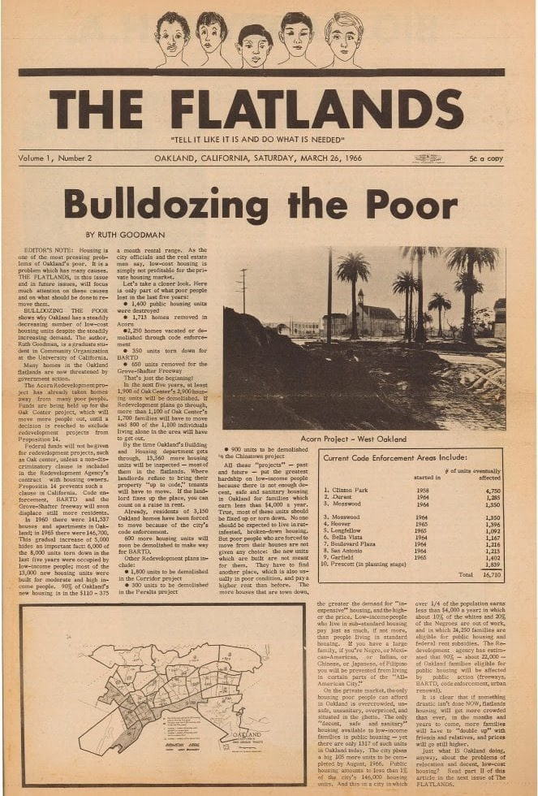
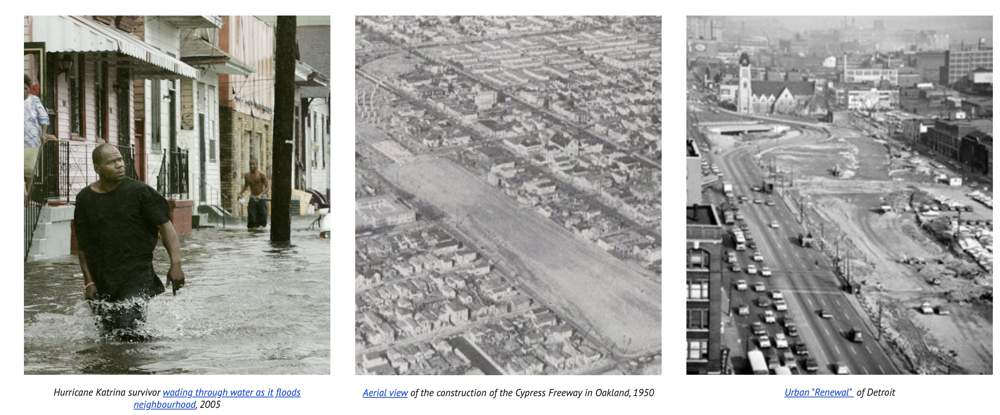
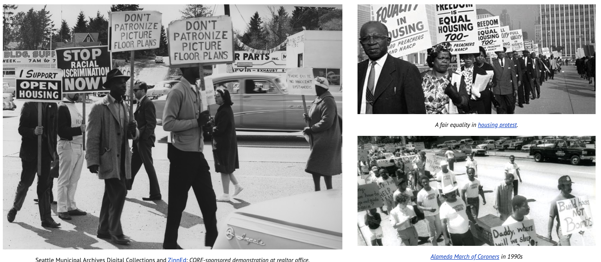
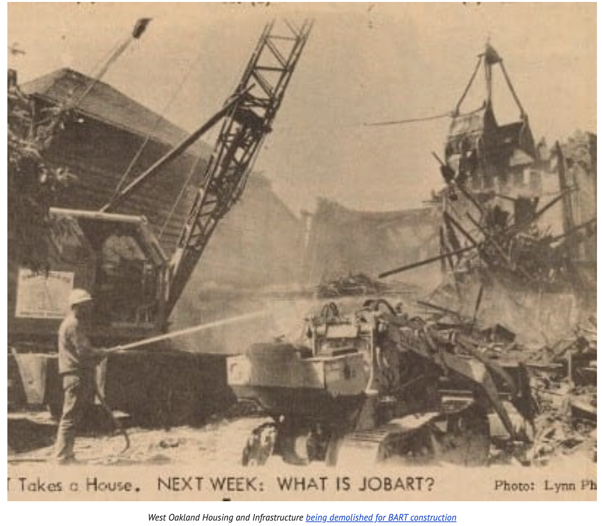

---
This project looks at the intersection of urban policy and socio-environmental vulnerability within the contiguous United States. Explore the history and destructive legacies of redlining, everlasting effects, and much more. Start with the Interactive Timeline below to trace salient events that shaped urban inequality within our case study cities of Oakland, Detroit, and New Orleans. Dive deeper into our Narrative Analysis, where text and images unpack the structural impacts of redlining in greater details. Explore our interactive maps under the Visualizations tab for spatio-temporal insights into redlining and infrastructure changes and their ripple effects across geographies. A full list of sources is under our Annotated Bibliography and Reference List. 

## Interactive Timeline

Explore the key events that shaped urban inequality and redlining policies across our case study cities. Use the timeline below to navigate through history.

<iframe src="https://cdn.knightlab.com/libs/timeline3/latest/embed/index.html?source=v2:2PACX-1vQcwackvZmTn3YWyq90W2ezt7GMDI3WKRpDTO1nj-_eZOmnJNL0TgYUgYzSVYyzYGjQSrqdT8Tx2_CG&font=Default&lang=en&initial_zoom=2" width="100%" height="650" frameborder="0" allowfullscreen></iframe>

---

## 1. Project Narrative

### Redrawing the Lines: Mapping the Legacy of Redlining in U.S. Cities

Identifying that inequality is a cyclical, generational trap begins with recognizing the impacts of history and policy on modern-day society. Redlining has significantly influenced the narrative surrounding housing. In the mid-20th century, redlining facilitated structural discrimination in lending and financial services, perpetuating the economic underdevelopment of neighborhoods designated for redlining. Much of the evidence unearthed in recent literature reveals the discriminatory reasoning behind specific risk assessments. From racist verbiage rationalizing discrimination to bigoted neighborhood classification systems, redlining activities would persist until the Fair Housing Act in 1968 officially prohibited them (Nelson et al., 2018).

Nevertheless, legislation is often crafted from a position of privilege. Society's infrastructure breeds inequity as it stands. New Orleans exemplifies this idea. Dr. Ari Kelman of the University of California, Davis, writes about the post-1950 urban push to mitigate New Orleans' environmental vulnerabilities. Levees were raised, wetlands were drained, and land was reclaimed at the expense of the socioeconomically disadvantaged: "New Orleanians became stratified, with poorer people of color often concentrated on low land" (Kelman, 2005, para. 10). This redevelopment effort was not neutral but a residual impact of redlining on the city.

This leads us to our research question: **How has redlining evolved from a historical housing policy into an interconnected system of inequality, and how can a temporal narrative illustrate its long-term consequences?** Divergent outcomes persist within metropolitan areas, underscoring the gaps that redlining has created. Through an extensive literature review, we identified three cities—Oakland, New Orleans, and Detroit—in which certain notable events highlighted the consequences of redlining. Our objective is twofold: to map the relationships between redlining and neighborhood-level economic outcomes and to uncover veiled narratives connecting redlining with deep-rooted infrastructural inequities.

*Oakland Public Library: The Flatlands newspaper "Bulldozing the poor"*

Throughout history, cities have evolved, and maps have changed, but the original intent remains. In the 1930s, the federal government etched inequality into paper through the Home Owners' Loan Corporation (HOLC) maps, which categorized Black and immigrant neighborhoods as "hazardous." It encased them in red lines, deeming them unworthy of investment and care (Nelson et al., 2018). These maps are not static; they are blueprints for exclusion that have evolved, mutated, and embedded into every layer of city life. Across decades, the inhumane boundaries seeped into concrete policy, shaping the very streets and highways of Oakland, Detroit, and New Orleans. Red zones did not merely mark these cities; they shaped them.

In Oakland, postwar "urban renewal" became a tool to dismantle Black economic prosperity. The development of Interstate 980 and the West Oakland BART station divided thriving communities, splitting them in half and leading to disinvestment in them (Self, 2003, pp. 255–260). In Detroit, HOLC determinations fueled white flight and suburbanization, while redlined neighborhoods were denied mortgages and forced into predatory loans. They produced a dual-tier housing system that undermined housing stability and scapegoated Black Detroiters for urban decline (Sugrue, 2005, p. 37). In New Orleans, the legacy of redlining became an environmental disaster. Laura Pulido highlights how environmental racism includes development decisions regarding land use that benefit a white majority (Pulido, 2016, p. 7). This translates into why New Orleans neighborhoods with failing levees had higher minority populations. These cities exemplify the various avenues of inequality in contemporary society.

The Fair Housing Act of 1968 was a vision that outlawed explicit red zones but did not dismantle the systems it created. Our project continues where redlining was presumed to end, displaying how inequality mutated to credit scores that replaced racial covenants, environmental racism relocating blame, and highways cementing racism into the streets of the "hazardous." These inequalities persist in neighborhoods, targeting the same communities and perpetuating the same systems that determine which areas are of lower value. Thus, we argue that **redlining was not undone but repaved**. Redlining and its afterlife are the timelines our project traces. The red zones may be formally removed from maps, but their effects have solidified into a cartography of exclusion in which some futures remain disposable.

By overlaying the HOLC redlining maps with modern census data, our data visualizations illustrate how the historical racial prejudice stemming from redlining continues to deny these communities opportunities to improve their upward mobility. Using data from the U.S. Census' Opportunity Insights dataset, we analyze trends in metrics such as job growth rate, median household income, and job density to demonstrate how formerly redlined neighborhoods continue to experience limited upward mobility. These spatially determined inequalities became transportation infrastructure, lending practices, and environmental racism, all of which reinforced geographic and racial segregation.

Structural racism did not die; it adapted. In Oakland, we witnessed how transportation routes fractured Black communities. In Detroit, lending inequalities drove hundreds of thousands of foreclosures. In New Orleans, environmental injustice relegated minorities to high-risk areas. Accordingly, we conclude that the observed reinforcement of redlining has been sustained by similar policy inequities across all three cities. Policymaking often favors affluence and deprioritizes minorities, which embeds biases into urban development, creating sinkholes through invisible forces for these communities. Until minorities gain stronger representation in development policies, urbanization will continue to be a contradictory force to their success.

Our methodology draws from the seven principles of Data Feminism as summarized in Yasamin Rezai's "Data Stories for/from All: Why Data Feminism Is for Everyone," the transparency framework offered by Boyd Davis, Vane, and Kräutli, and Faithe Day's insistence for Black Digital Humanities to govern racialized politics (Boyd Davis et al., 2019; Day, 2024; Rezai, 2022).

To examine and challenge power, we reveal the 1930s Home Owners' Loan Corporation security maps as racial technologies through their marking of Black and immigrant neighborhoods as "hazardous", foreshadowing the modern inequalities we trace to Oakland, Detroit, and New Orleans (Nelson et al., 2018). The redefinition of the maps as racially motivated also allows us to negate the belief that the Fair Housing Act reversed all harms. We redefine data that drove inequality by quantifying the extent to which modern-day redlining events overlap with areas that were historically redlined, with the chosen inequality for each city.

To elevate emotion and embodiment, we draw inspiration from the Mapping Inequality project, which integrates digitized redlining maps with neighborhood descriptors and demographics (Nelson et al., 2018). By incorporating personal stories into spatial data, the project humanizes a process that is often reduced to zoning or finance. To rethink binaries and hierarchies, we reject HOLC's A/B/C/D categorization, which employs a continuous gradient of harm, and instead recognize that marginalization exists on a spectrum, subjected to multiple layers of infrastructural violence. This aligns with Faithe Day's emphasis on acknowledging complexity and resisting oversimplification (Day, 2024). To embrace pluralism, we integrate community narratives, local reports, and statistical data to offer diverse perspectives. This ensures that, instead of merely describing the affected populations, we include them in the work that is created.

To consider context, we draw on Boyd Davis et al.'s reminder that humanistic data are subjective and sometimes untrustworthy. Thus, we explicitly state our limitations, including those related to data availability, differences between HOLC and modern map boundaries, and the specific manner in which we utilize the maps (Boyd Davis et al., 2019). To make labor visible, we maintain a public research log that documents assumptions, decisions, and discarded avenues from the exploration process. Citations list community sources, activist archives, and open-source contributors alongside student analysts, underscoring that DH projects are always collaborative efforts.

To substantiate our methods, we now discuss the tools that will be used and explain their rationale. **ArcGIS** allows us to visualize the historical and contemporary patterns of redlining. In particular, we overlay the HOLC classifications onto modern urban maps of our selected cities, much like the Mapping Inequality project, which includes Oakland, Detroit, and New Orleans, to understand the impacts of redlining policies resulting from infrastructural changes, such as transportation projects, and post-natural disaster recovery efforts. ArcGIS also includes spatial functions that allow us to identify these overlaps and embed case-specific annotated narratives, pop-ups, and filters onto the maps. Additionally, we intend to utilize temporal mapping to illustrate how urban development has evolved, comparing historically redlined zones with the current quality of life, environmental risk, and health data. Therefore, these tools will not create any bias with the data as well, "The importance of letting the data speak for itself was stressed (Mayer-Schönberger & Cukier, 2013)." (Prescott, 2023, para. 7).

**Kepler.gl** renders large geotagged datasets with scathing clarity and efficiency. Our workflow with this tool is as follows: scrape data from the Opportunity Insights Datasets, which encompass household income mobility, job densities, and incarceration rates, process it, and visualize salient and nuanced trends in these indicators across different geographies. By integrating Kepler.gl's layered animations with ArcGIS's annotated historical narrative, we display the legacy of redlining through dynamic, accessible representations while ensuring accessibility.

To accurately represent the nuances of redlining as a spatiotemporal complex, we have created an interactive timeline using **TimelineJS**. It serves as a chronological narrative that complements other visualizations and textual analysis, threading key urban policy shifts, transportation, and general infrastructure projects, and post-disaster recovery efforts across our selected cities. This contextualizes redlining within the century of urban planning, elucidating how different forms of inequality, such as transportation development in Oakland, are entangled within the harmful legacy of redlining. We move beyond the subversive notion that redlining is a closed-form definition and frame it as a causal system that continues to unfold.

These tools focus on adopting Davis, Vane, and Kräutli's ethical visualization and Rezai's data feminism. The use of Kepler.gl was inspired by Hepworth and Church's Racial Terror Lynching Map example. By grounding our analysis in these principles, we present visualizations as layered narratives that convey a deeper understanding of the data. In addition, through Hepworth and Church's reading, "the goal of this visualization ethics should be 'increasing understanding [for users] while minimizing harm' to represent people and places (Cairo, 2014)." (Hepworth & Church, 2023, para. 6). This quote further emphasizes the importance of ethical visualization, allowing us to be mindful when using these digital tools and how the visualizations we create could impact the way the audience interprets the data. However, we believe that this further underscores the value of digital tools for our project. Although it can be further argued that "There is no neutral visualization: the intention [is] based on a shared understanding of the objectives" (Boyd Davis et al., 2021, para. 35), which allows some interpretations to be preferred over others; therefore, it is essential to keep in mind when creating our visualizations to have a balanced argument. Consequently, it is evident the importance of these digital tools in our project.

In conclusion, the income and privilege gap is inexorably fracturing American metropolitan areas into microcosms. In this divisive climate, key perpetrators of these gaps are especially crucial to analyze. Redlining, despite its ban some time ago, has left a wake of destruction etched into urban policies and infrastructure that shape our cities today. Through transportation improvement and disinvestment patterns, we can see how they mirror the red lines drawn arbitrarily by the HOLC nearly a century ago, marking the persistence of structural inequality across the contiguous United States. Through tools like ArcGIS and datasets from Opportunity Insights, we uncover hidden consequences through a sociodemographic lens by creating an engaging, ethical, and unbiased collection of maps and descriptions that illustrate how the effects of redlining have persisted to this day.

**There is a clear call for action.** Policymakers should amend state Community Reinvestment Act rules to prioritize infrastructure upgrades in historically redlined census tracts. Community organizations can utilize our map layers to advocate for more equitable transportation and lending policies with city councils. Furthermore, we encourage fellow practitioners of Digital Humanities to replicate this analysis in additional cities and to test how other modern events, such as credit-scoring algorithms, support or disrupt the observed patterns. Likewise, anyone can explore the interactive layers of our project and draw meaningful insights.

We understand that visualizations, especially those related to inequality, are never neutral, despite our good intentions. As creators, building a revealing and engaging narrative is akin to playing God, selecting and arranging elements to imbue a specific meaning. However, this illusion of control obscures the very voices that need to reach us—people who live in seclusion can be visually represented, but can be overshadowed by overcomplexity and clutter. Redlining is far from being closed; it is constantly evolving. With these insights, we can reform our cities, not with lines of exclusion, but with constructions that support inclusivity, making legible what has been shrouded over the years.

---

## 2. Visualizations

### West Oakland — Public Infrastructure and Red Lines Building White Wealth

Our data decisions revolve around accessibility and explainability. We tried to get our primary sources from trustworthy organizations—the city of Oakland—first hand accounts and blog reports because it ensures its credibility and makes sure that we have a wide variety of perspectives when it comes to writing the impact of redlining on the residents. In addition, we are aware of the harmful language used in some of the sources, namely the HOLC taxonomy for classification reports found in the University of Richmond's Mapping Inequality. It is critical that we acknowledge this and make sure that we do not include this type of language in our popup descriptions so as to not intentionally offend anyone or subjugate anyone to the HOLC's foregrounding of racist intent in their "community" betterment.

The data we chose to include in our visualization is information on the major infrastructure that have deeply impacted the West Oakland community and made sure we included information from Opportunity Insights Atlas to show the impact of redlining and infrastructure on the community in present times. When creating the designs for our visualizations, we wanted to make it eye-catching to attract the attention of the audience and also have a clear distinction on the parts of the map as well. Therefore, we used different icons and different colors to represent the different infrastructures and housing areas as well.

<arcgis-embedded-map style="height:600px;width:100%;" item-id="d6adbd94904d4c769acba8933888e556" theme="light" legend-enabled share-enabled center="-122.27921843753391,37.81825313049765" scale="72223.819286" portal-url="https://cal.maps.arcgis.com"></arcgis-embedded-map>

---

### Detroit — Spatial Legacy of Redlining on the Life Chances of Low-Income Children

This map layers (1) the density of children (ages < 18) from low-income households in 2000, by race, per km²; (2) the mean adult-income percentile those same children later achieved in 2014-2015; (3) a Shannon diversity score measuring how evenly the three racial groups share that low-income child population; (4) the race holding >50% of such children in each tract; (5) 1939 HOLC lending grades (A–D) that codified redlining; and (6) the 2024 TIGER/Line road network for orientation. Together, the layers trace how historic segregation maps onto the childhood geography and later economic mobility of disadvantaged Detroiters.

The purpose of this map is to recognize the long-lasting effects of redlining on Detroit's housing system. The 1939 HOLC map, from Mapping Inequality, layered with information from the Opportunity Insights Atlas, shows how the inception of these maps led to the perpetuation of spatial segregation despite the Fair Housing Act (FHA) and other government-sponsored attempts to rectify the inequalities cemented by redlining. The different colors on the map are taken from the HOLC map to remain accurate with the geo-coding done by the corporation, and the rest of the coloring displays how darker saturation correlates with higher statistics. We are aware and want to highlight that the language used by the HOLC is racially motivated and that the data from the Atlas may be skewed due to self-reporting but by staying consistent in these metrics we offer a pipeline from the racially-charged redlining maps to current events that are trackable across our three case studies by using the same data. In addition, the inclusion of roads, although not directly studied in Detroit, is for comparison with Oakland and New Orleans in case future researchers want to focus on how redlining impacted transportation.

<iframe src="https://poetic-selkie-12790d.netlify.app/mean%20household%20income%20by%202010%20census%20tract%20copy.html.html" width="100%" height="600" frameborder="0" allowfullscreen></iframe>

---

### New Orleans — How Redlining and Hurricanes Locked Residents Into Poverty

The base map depicts the city of New Orleans. The original areas outlined in the HOLC redlining maps are outlined in their respective colors on the "HOLC 1939" layer. There are several other toggleable layers as well, such as density of white, Black, and Hispanic residents, the incarceration rate, the proportions of residents who stayed in the same area as their parents, and each tract's household income. These layers are colored using a gradient corresponding to a colorbar in the corner of the map — darker colors correspond to higher values.

We chose to layer this demographic data derived from the Opportunity Atlas census data over the original HOLC redlining data because we wanted to emphasize how these redlining decisions made a century ago have hampered the upwards mobility of communities of color in New Orleans. Particularly, we needed to understand historical displacement and societal instability within the city. We kept the original colors from the HOLC redlining maps to maintain consistency, but we want to emphasize that the original HOLC criteria for dividing up neighborhoods was based on racist assumptions and a biased point of view. Nevertheless, as demonstrated by the demographic data from Opportunity Atlas, these divisions have persisted in these communities.

<iframe src="https://6864b5858b6c394d0aecc0ef--admirable-truffle-ed95db.netlify.app/" width="100%" height="600" frameborder="0" allowfullscreen></iframe>

---

## 3. Data Critique

### Opportunity Atlas and Mapping Inequality: Our Thoughts on the Value-Add and Limitations

We have utilized two primary datasets: "Redrawing the Lines: Mapping the Legacy of Redlining in U.S. Cities": the Opportunity Atlas dataset, as well as Home Owners' Loan Corporation (HOLC) redlining maps from the University of Richmond's Mapping Inequality project. The HOLC redlining maps are digitized scans of city survey files from 1935–1940, kept at the National Archives and available under a CC-BY-NC license; Opportunity Atlas is a joint collaboration between the U.S. Census Bureau and Harvard University.

Opportunity Atlas includes data from the 2000 and 2010 censuses, in addition to anonymized data from 1990s income tax returns and American Community Surveys (ACS) launched between 2005 and 2019. In the first bucket of data, "Neighborhood Characteristics," the researchers included key neighborhood economic statistics, as well as demographic information. The second bucket, "Children's Outcomes in Adulthood," includes indicators of childhood mobility within neighborhoods, like incarceration rates, employment and college graduation rates, income distributions, and incomes of children staying in the same commuting zone they grew up in, as well as comparisons between immigrants and American-born residents.

Mapping Inequality includes both HOLC georectified maps with color-coded risk grades and textual "area descriptions" recording explicitly racist and classist justifications for disinvestment. These maps categorize specific regions of major American cities on an A to D scale based on "residential security," or how beneficial it would be for a bank to provide mortgages to particular residents, with A-grade neighborhoods being more likely to receive loans.

The HOLC data prop up our analysis, motivating in-depth understanding of our research question. In conjunction with the Opportunity Atlas data, Mapping Inequality helps us trace the origins of disparities, matching outcomes to neighborhood characteristics and highlighting patterns of infrastructural neglect. For instance, in Oakland, a quick analysis shows that "D" rated neighborhoods by the HOLC closely align with areas now bifurcated by Interstate 980, the new West Oakland BART plaza, or suffering from housing disinvestment. Similarly, in Detroit, historically redlined zones are associated with higher foreclosures and lending disparities, while in New Orleans, flood zones from Hurricane Katrina demonstrate how environmental risk and overt systemic racism intersect on the map.

A strong attribute of Opportunity Atlas is its utilization of a diverse array of economic indicators. We are introduced to uncommonly seen metrics, such as hours worked per week, percent staying in the same commuting zone as adults, and neighborhood job growth rate, all with time-based evolution over fixed periods. Fundamentally, understanding regional differences at as granular of a level as a census tract paints a rich, compelling narrative about the evolution of inequality. We are granted flexibility in using rarely-seen indicators to craft temporal and geospatial visualizations, dynamically redefining our narrative as contemporary rather than rigidly historical.

Despite their ability to bridge historical context and quantitative data, Opportunity Atlas and Mapping Inequality have limitations regarding nuance and explanations. The Atlas maps outcomes, not causes. For example, while visualizations show differences in adult wages, they cannot explain why middle-income Black men have a higher incarceration rate than lowest-income Black men in specific neighborhoods. Primary cohorts' mobility outcomes are studied in 2005 and 2019, for children born in 1978 and 1992, respectively (Chetty et al., 2019). Thus, trends may not be fully representative of populations impacted by redlining. As for the HOLC data, maps only exist for certain cities, and even within those, boundaries do not align perfectly with modern census tracts, necessitating geospatial interpolation that introduces error and uncertainty. The IRS and census data also exclude undocumented immigrants, which impacts representation, as the HOLC maps show 30% of "foreign" populations, which is a sizable portion of Detroit (Nelson et al., 2018). Both datasets reflect biases in their original collection processes: the HOLC maps were shaped by 1930s institutional racism, while non-response bias and misreporting may exist in voluntary responses to the Bureau-run ACS.

To account for these limitations, we have input modern-day stories into temporal narration: our interactive timeline includes contextual commentary. As Boyd Davis, Vane, and Kräutli remind us, "there is no neutral visualization: the intention [is] based on a shared understanding of the objectives" (Boyd Davis et al., 2021, para. 35), compelling us to foreground the ethical stakes of our work and to question how we (re)present marginalized communities. We adopt the "seven main principles [of][...] Data Feminism" as outlined by Rezai, especially her imperative that we must "elevat[e] emotion and embodiment [...] making labor visible" (Rezai, 2022, para. 2). Ultimately, we aim to create reliable, neutral, and persuasive commentary to illustrate the consequences of redlining, rehabilitating modern stories ex post with thorough, transparent, and accessible documentation.

---

## 4. Acknowledgments

We would like to thank **Dr. Scott Caddy**, **Rebecca Baugh**, and **Sabrina Jaszi** for giving their invaluable advice, comments, and critique to advance our project. Without their help, we would be lost.

We would also like to acknowledge the following sources of data:

- [Opportunity Atlas - Module 1 - Neighborhood Mobility Outcomes](https://www.opportunityatlas.org/)
- [Opportunity Atlas - Module 2 - Neighborhood Mobility Trends](https://www.opportunityatlas.org/)
- [Mapping Inequality - HOLC Residential Security Maps (1935–40)](https://dsl.richmond.edu/panorama/redlining/)
- [TIGER/Line Shapefiles - 2020 Census tracts & 2024 Wayne-County roads](https://www.census.gov/geographies/mapping-files/time-series/geo/tiger-line-file.html)

Full scholarly citations appear in the Reference List below.

---

## 5. Technical and Methodological Decisions

### Detroit Map

- **Stack:** Python 3.11, GeoPandas 0.14, Folium 0.16, MapClassify, Shapely, Pandas, NumPy.
- **Projection:** All spatial joins executed in EPSG 32616 (UTM zone 16 N); map served in EPSG 4326 (Web Mercator).
- **Density calculation:** Opportunity Atlas child counts ÷ tract land-area (km²). We opted not to rescale by the total 2010 population because the research question targets the same specific population for their income in 2014-2015.
- **Jenks natural breaks (k = 5)** used for choropleth classes to emphasize within-layer variation.
- **Data cleaning:** Removed tracts with zero land area; clipped HOLC polygons to Detroit boundary for clarity; normalized income-rank variables from 0% to 100% for cross-race comparison.
- **Color palette:** Used colors that pass WCAG AA for color-blind safety when denoting the races.

### New Orleans Map

- **Stack:** Python 3.11, GeoPandas 0.14, Folium 0.16, MapClassify, Shapely, Pandas, NumPy.
- **Projection:** All spatial joins executed in EPSG 32616 (UTM zone 16 N); map served in EPSG 4326 (Web Mercator).
- **Jenks natural breaks (k = 5)** used for choropleth classes to emphasize within-layer variation.
- Data extracted from Opportunity Atlas demographic data (layers are named the same as data categories in CSV data)

### Oakland Map

- **ArcGIS:** We used the ArcGIS software to combine information from Mapping Inequality with other sources.
- **Popups design:** Legend includes popup icons and names and includes full interactivity.
- Data extracted from the Mobility Trends from Opportunity Atlas demographic data and used in the popup information. GeoJSON data from Mapping Inequality was downloaded and laid on top of the default map along with a georectified HOLC map.

### Redlining Timeline

- **TimelineJS:** The Google Sheets version was used to format and create the timeline. The program has both color limitations and backgrounds, so for readability, everything is white background and black text. Also, there are picture limitations as only pictures that are publicly available through their own link can be used, which left some slides without a photo.
- Data was taken from research about the timelines for redlining and each respective city from the specific outcome studied. These are not the only outcomes and main events, but due to the time limitation, not every major event could be included.

---

## 6. Bibliography

### Detroit Research

U.S. Census Bureau & Opportunity Insights. (2024). *Opportunity Atlas: Household income and incarceration for children from low-income households by census tract, race, and gender* [Data set; Module 1 revision]. https://www.census.gov/programs-surveys/ces/data/public-use-data/opportunity-atlas-data-tables.html

Nelson, R. K., Winling, L. C., Connolly, N. D. B., & Ayers, E. L. (2018). *Mapping Inequality: Redlining in New Deal America* (Version 1.0) [Interactive map & dataset]. Digital Scholarship Lab, University of Richmond. https://dsl.richmond.edu/panorama/redlining/

U.S. Census Bureau (2024). *TIGER/Line shapefiles: 2020 census tracts (tl_2020_26_tract.shp) and 2024 Wayne-County roads (tl_2024_26163_roads.shp)* [Shapefiles]. https://www.census.gov/geographies/mapping-files/time-series/geo/tiger-line-file.html

Sugrue, T. J. (2005). "Detroit's Time Bomb": Race and Housing in the 1940s. In *The Origins of the Urban Crisis: Race and Inequality in Postwar Detroit - Updated Edition* (REV-Revised, pp. 115–150). Princeton University Press. http://www.jstor.org/stable/j.ctt6wpzvr.10

### New Orleans Research

Yawn, A. (2024, November 11). New study links historical redlining to delays in HIV treatment. *Tulane University News*. https://news.tulane.edu/pr/new-study-links-historical-redlining-delays-hiv-treatment

Bassler, J. R., Wang, Q., & Williams, S. M. (2024). Redlining and time to viral suppression among persons with HIV. *JAMA Internal Medicine*, 184(11), e235–e243. https://doi.org/10.1001/jamainternmed.2024.5003

Kelman, A. (2005, December 15). In the shadow of disaster. *The Nation*. https://www.thenation.com/article/archive/shadow-disaster/

Frymer, P., Katznelson, I., & Roberts, A. (2006, June 11). Katrina's political roots and divisions: Race, class, and federalism in American politics. *Items: Insights from the Social Sciences*. https://items.ssrc.org/understanding-katrina/katrinas-political-roots-and-divisions-race-class-and-federalism-in-american-politics/

Seicshnaydre, S., Collins, R. A., Hill, C., & Ciardullo, M. (2018). *Rigging the real estate market: Segregation, inequality, and disaster risk*. The Data Center. https://www.datacenterresearch.org/reports_analysis/rigging-the-real-estate-market-segregation-inequality-and-disaster-risk/

Aune, K. T., Gesch, D., & Smith, G. S. (2020). A spatial analysis of climate gentrification in Orleans Parish, Louisiana post–Hurricane Katrina. *Environmental Research*, 185, 109384. https://doi.org/10.1016/j.envres.2020.109384

### Oakland Research

Self, R. O. (2003). Redistribution. In *American Babylon: Race and the Struggle for Postwar Oakland* (STU-Student edition, pp. 135–176). Princeton University Press. http://www.jstor.org/stable/j.ctt5hhq2x.10

Flynn, D., & City of Oakland. (n.d.). Oakland's history of resistance to racism. *City of Oakland*. https://www.oaklandca.gov/topics/oaklands-history-of-resistance-to-racism

Romero, E. D. (2023, May 30). Advocates: Reparations are the answer for sea-level threat in West Oakland, Calif. *NPR*. https://www.npr.org/2023/05/30/1177050378/advocates-reparations-is-the-answer-for-sea-level-threat-in-west-oakland-calif

State of Black Education Oakland. *The Color of Law and the Geography of Opportunity in West Oakland*. https://cao-94612.s3.amazonaws.com/documents/The-Color-of-Law-and-the-Geography-of-Opportunity-in-West-Oakland.pdf

Hirsch, L. (2023, November 5). The lines that Scar West Oakland. *ArcGIS StoryMaps*. https://storymaps.arcgis.com/stories/4b0d0ee723f0475e872dc1c87a4cad41

### Full Reference List

April 11, 1968: Fair housing act signed into law. *Zinn Education Project*. (2024, March 25). https://www.zinnedproject.org/news/tdih/fair-housing-act-signed-into-law/

Board of Governors of the Federal Reserve System. (n.d.). Community Reinvestment Act (CRA). https://www.federalreserve.gov/consumerscommunities/cra_about.htm

Boyd Davis, S., Vane, O., & Kräutli, F. (2019). Can I believe what I see? Data visualization and trust in the humanities. *Interdisciplinary Science Reviews*, 46(4), 522–546. https://doi.org/10.1080/03080188.2021.1872874

Chetty, R., Dobbie, W., Goldman, B., Porter, S. R., & Yang, S. C. (2019). The Opportunity Atlas: County & Metro Mobility Trends. *Opportunity Insights*. https://www.opportunityatlas.org/

Church, C., & Hepworth, K. (2018). Racism in the machine: Visualization ethics in digital humanities projects. *Digital Humanities Quarterly*, 12(4). http://www.digitalhumanities.org/dhq/vol/12/4/000408/000408.html

Day, F. J. (2024). Debates in #BlackDH: Key moments and queer directions in Black studies scholarship. *Digital Humanities Quarterly*, 18(4). https://www.digitalhumanities.org/dhq/vol/18/4/000760/000760.html

Federal Reserve Bank of St. Louis. (2022). Redlining. *Federal Reserve History*. https://www.federalreservehistory.org/essays/redlining

Mayer-Schönberger, V., & Cukier, K. (2013). *Big Data: A revolution that will transform how we live, work and think*. Eamon Dolan.

National Community Reinvestment Coalition. (n.d.). HOLC redlining maps: The persistent structure of segregation and economic inequality. https://ncrc.org/holc/

Prescott, A. (2023). Bias in big data, machine learning and AI: What lessons for the digital humanities? *Digital Humanities Quarterly*, 17(2). https://dhq.digitalhumanities.org/vol/17/2/000689/000689.html

Pulido, L. (2016). Flint, Environmental Racism, and Racial Capitalism. *Capitalism Nature Socialism*, 27(3), 1–16. https://doi.org/10.1080/10455752.2016.1213013

Rezai, Y. (2022). Data stories for/from all: Why data feminism is for everyone. *Digital Humanities Quarterly*, 16(2). https://www.digitalhumanities.org/dhq/vol/16/2/000618/000618.html

---