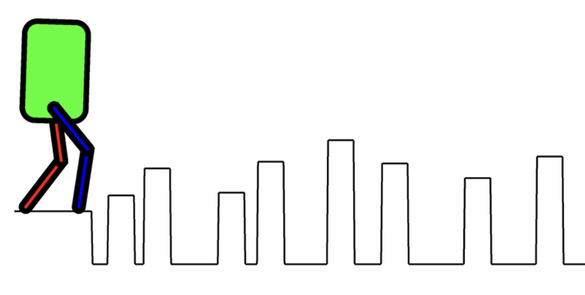
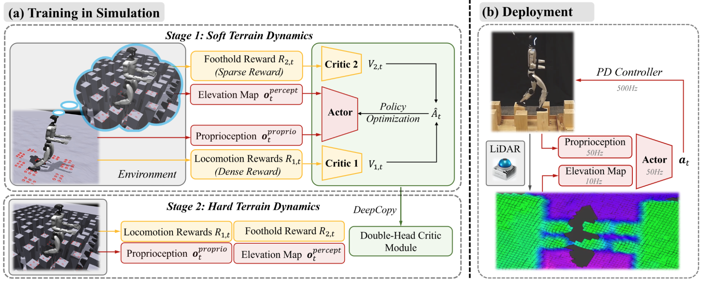
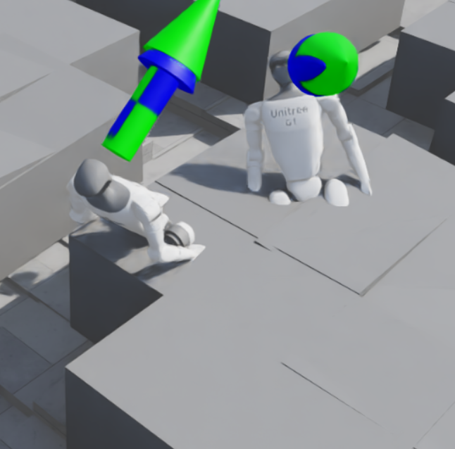

---

## Project Motivation

Humanoids must navigate complex, unstructured environments with limited footholds to perform meaningful tasks. This project addresses the challenges of training RL policies for dynamic locomotion on stepping stones—from flat surfaces to varying terrains—required for autonomous robotics in outdoor environments. Additionally, we aimed to learn to use simulation software for legged robotics research.

### Problem Statement

> **How can we train a terrain-aware RL policy under known dynamics that produce stable, non-myopic locomotion over transient terrain, despite sparse rewards and time-varying footholds?**

---

## Approach

We aimed to build off [BeamDojo's](https://arxiv.org/abs/2502.10363) codebase that enables confident walking on static stepping stones, which relies on the following key techniques:

- **Curriculum Learning:** Progressively more difficult stepping stones
- **Double Critic PPO:** Balance between sparse rewards (correct foot placement) and standard walking rewards
- **Soft Training:** Initial training for the robot to learn foot placements without falling, enabling consistent learning

Our plan was to incorporate stepping stones with **time-varying positions** near the more difficult end of the curriculum, and retrain.

---

## Step 1: IsaacLab with Unitree G1 on Rough Terrain

### Prior Work Context

Most prior work simulating stepping stones with humanoids is attempted in a 3D environment, so we decided to familiarize ourselves with basic RL and IsaacLab first.

### Flat-Ground Walking

We retrained Unitree G1 to walk on flat ground in a provided environment using reference reward functions and hyperparameters from IsaacLab documentation.

### Rough Terrain Walking - Boxes

We modified the terrain generation to create various "difficulties" of procedurally generated boxes of varying heights, creating a **curriculum of terrains** (easy to hard) for the humanoid to learn.

We then trained G1 to walk on this terrain, successfully implementing our idea without the transient component or gaps between stones.

<video width="100%" controls muted>
  <source src="images/rough_terrain.mp4" type="video/mp4">
</video>

G1 walking on rough terrain with procedurally generated boxes

**Training Details:**
- Trained for ~4 hours on an RTX 4060
- 3000 iterations, 2048 parallel environments
- Passable walking observed around 950 iterations

---

## Step 2: BeamDojo

We initially proposed this project with the intent of building on top of an existing humanoid stepping stone traversal paper: **BeamDojo**.

*BeamDojo enables smooth, confident traversal of stepping stones*

### Key Techniques from BeamDojo

#### Double-Critic PPO

One of the reasons stepping stones (and foot placement in general) is so hard to train is due to **sparse rewards**—correct foot placements are rare, and the majority of learning is done in the failure regime. The policy has to learn to balance two types of rewards.

BeamDojo solves this by learning **two different critics**, one for each reward type.

#### Soft Training

Before actually training on stepping stones, to minimize the amount of failed runs (again, sparse rewards), they train foot placement by making the robot *imagine* it's on the actual stepping stones, but walk on smooth terrain.

As a result, it's rewarded for correct foot placement, but doesn't actually fall every time it misses a single step.

### Challenges

#### BeamDojo GitHub Not Public

This was probably the **biggest hit to our project**, as our idea hinged on building off of BeamDojo's existing code. Since we weren't able to access the codebase, we tried to recreate it from the ground up using their outlined process and provided hyperparameters.

#### Result

We spent the majority of our project time (**over a week**) attempting to reimplement this. We managed to implement their dual critic PPO, but couldn't figure out how to implement the soft training.

In particular, the way in which the algorithm accesses the heightmap of stepping-stone terrain while acting on flat ground was unclear. It would've been greatly beneficial if we had access to their codebase.

In the interest of time, we moved to working on a 2D implementation.

---

## Fallback 1: 2D Approach using MuJoCo

### MuJoCo with MJX Framework

After struggling with IsaacLab, we wanted to see if removing a dimension would make things easier. To do this while maintaining parallelized training, we used **MJX** (MuJoCo's parallelized framework).

We quickly trained a standard walking policy on the ground.

### Dynamic Stepping Stones Environment

We implemented our own **dynamic stepping stone environment**!

<video width="100%" controls muted>
  <source src="images/stones_moving.mp4" type="video/mp4">
</video>

Dynamic stepping stones moving in MJX environment

### MJX Terrain Limitation

Custom terrain in walker-2d is incredibly difficult to do properly. We had to include them as mo-cap rigid bodies, and even though they look great, the terrain had **unpredictable collision dynamics**.

As a result, we weren't able to even train a flat walking policy on these rigid bodies, much less one with moving stepping stones.

### Alternative Approach: Airtime Reward

We tried training a walking policy that rewarded foot airtime with the idea that it would work better as a warm start for curriculum learning stepping stones.

It resulted in this skipping motion:

<video width="100%" controls muted>
  <source src="images/walking_skip.mp4" type="video/mp4">
</video>

Walker learning a skipping motion from airtime reward

---

## Fallback 2: IsaacLab (Transient Terrain, No Stones)

We then decided to forgo the problem of sparse rewards entirely and **remove the gaps between stepping stones**. This way, standard PPO and training regimes could learn the policy efficiently.

### Implementing Transient Terrain in IsaacLab

We attempted to model dynamic platforms that would move up and down out of the existing terrain:

- **Computational Efficiency:** Our RTX 4060 cannot handle training for an entire terrain solely composed of dynamic platforms
- **Kinematic Obstacles:** Each piece of transient terrain was implemented as a kinematic obstacle with constant, hardcoded motion
- **Observation Space:** The current positions of the nearest 3 stepping stones in the direction of travel are part of the provided observation
- **LIDAR Limitation:** Just using the robot's raycaster (effectively LIDAR) was not possible, as it only takes in a single mesh—this would not work with transient terrain

### Setback

For the last day of the project, we struggled with a weird bug where the robot would successfully collide with the platform about **25% of the time**, and sometimes starts a collision halfway through a block.

We were unable to fix this issue in time. Unfortunately, it seems like IsaacSim is not particularly fond of transient terrain in general.

*Example of partial collision: robot leans back and gets stuck after entering block, but phases through*

---

## Results & Reflection

### What Worked ✓

- Successfully trained a Unitree G1 humanoid to walk on **rough terrain** with procedurally generated boxes of varying heights using IsaacLab
- Successfully implemented **transient terrain in MJX**
- Successfully trained **standard walking policies** for all environments

### What Didn't Work ✗

- Attempted to reimplement BeamDojo library after not having code access—didn't work out
- Used MuJoCo's MJX to implement a 2D walker but encountered issues with **terrain integration being unstable**
- Attempted to integrate transient terrain in IsaacLab, but **ran out of time to debug**

---

## Future Goals & Alternative Approaches

- **Get BeamDojo access** and try again!
- **Custom 2D environment** with RL only for learning optimal placement, and traditional control for actual dynamics
- Explore **model-based RL** approaches that may handle sparse rewards better
- Investigate **sim-to-real transfer** for validated policies

---

## References

1. Wang, H., Wang, Z., Ren, J., Ben, Q., Huang, T., Zhang, W., & Pang, J. (2025). **BeamDojo: Learning Agile Humanoid Locomotion on Sparse Footholds.** arXiv. [https://doi.org/10.48550/arXiv.2502.10363](https://doi.org/10.48550/arXiv.2502.10363)

2. Xie, Zhaoming, Hung Yu Ling, Nam Hee Kim, and Michiel van de Panne. **"ALLSTEPS: Curriculum-Driven Learning of Stepping Stone Skills."** Computer Graphics Forum 39, no. 8 (2020): 213–224. [https://doi.org/10.1111/cgf.14148](https://doi.org/10.1111/cgf.14148)

3. Nguyen, Quan, Ayush Agrawal, William Martin, Hartmut Geyer, and Koushil Sreenath. **"Dynamic Bipedal Locomotion over Stochastic Discrete Terrain."** The International Journal of Robotics Research 37, no. 13–14 (2018): 1537–1553.

4. Rudin, N., Hoeller, D., Reist, P., & Hutter, M. (2021). **Learning to Walk in Minutes Using Massively Parallel Deep Reinforcement Learning.** arXiv. [https://doi.org/10.48550/arXiv.2109.11978](https://doi.org/10.48550/arXiv.2109.11978)

---

## Appendix

### PPO Hyperparameters

| Parameter | Value |
|:----------|:-----:|
| Steps per environment | 24 |
| Max iterations | 3000 |
| Learning rate | 1 × 10⁻³ |
| KL target | 0.01 |
| GAE λ | 0.95 |
| Clip parameter | 0.2 |
| Entropy coefficient | 0.008 |
| Value loss coefficient | 1.0 |
| Learning epochs | 5 |
| Mini-batches | 4 |
| Max gradient norm | 1.0 |

### Reward Terms, Weights, and Computation

| Term | Weight | Computed as |
|:-----|:------:|:------------|
| termination_penalty | −50.0 | 𝟙_terminated = `mdp.is_terminated` |
| track_lin_vel_xy_exp | +3.0 | r_track,v = `mdp.track_lin_vel_xy_yaw_frame_exp`(σ = 0.5) |
| track_ang_vel_z_exp | +1.0 | r_track,ω = `mdp.track_ang_vel_z_world_exp`(σ = 0.5) |
| feet_air_time | +0.25 | r_air = `mdp.feet_air_time_positive_biped`(threshold = 0.4) |
| feet_slide | −0.1 | r_slide = `mdp.feet_slide` |
| dof_pos_limits | −1.0 | r_joint-lim = `mdp.joint_pos_limits` (ankle joints) |
| joint_deviation_hip | −0.1 | r_hip-dev = `mdp.joint_deviation_l1` (hip_yaw, hip_roll) |
| joint_deviation_arms | −0.1 | r_arm-dev = `mdp.joint_deviation_l1` (shoulder, elbow) |
| joint_deviation_fingers | −0.05 | r_finger-dev = `mdp.joint_deviation_l1` (finger joints) |
| joint_deviation_torso | −0.1 | r_torso-dev = `mdp.joint_deviation_l1` (torso_joint) |
| flat_orientation_l2 | −1.0 | r_flat = (inherited, modified) |
| action_rate_l2 | −0.005 | r_ȧ = (inherited, modified) |
| dof_acc_l2 | −1.25 × 10⁻⁷ | r_q̈ = L2 joint accel (hip, knee only) |
| dof_torques_l2 | −1.5 × 10⁻⁷ | r_τ = L2 torques (hip, knee, ankle) |

*Note: The above computations are in terms of IsaacLab functions, for reproducibility.*

### Network Architecture

Our actor and critic networks were both typical MLPs with:
- **Layer sizes:** (512, 256, 128)
- **Activation:** ReLU

---

*Completed for ME 193B at UC Berkeley*

