**Special thanks to:**
- **Michael Nuefer** for wiring and soldering tips
- **Tom Clark** for his quick and clear explanations of our amplifiers and sensors, for suggesting the thermocouple, and for sourcing many of our components
- **Jordan Kam** for being our test subject and for risking his life sitting on our chair
- **Professor George Anwar** for his last-minute debugging advice even 10 minutes before our presentation and his wealth of electronics knowledge, without which this project would not have been possible


*Derek Shah (left), Matthew Thompson (middle back), Larry Hui (right), and Professor George Anwar (middle front) enjoying our Chair*

---

## Introduction

Electronics has become a powerful and ubiquitous technology supporting solutions to a wide range of applications in fields ranging from science, engineering, healthcare, environmental monitoring, transportation, to entertainment. The Internet of Things (IoT) refers to any device connected by internet with on and off capabilities.

IoT, before it was coined IoT, started out in the 19th-century telegraphy and early 20th-century radio, with digital computing in the middle of the 50s. The term "Internet of Things" wasn't coined until the turn of the century by Kevin Ashton of MIT's Auto-ID Labs in 1999, and its definition has broadened ever since. Since then, IoT has become a part of life. Whether it is wireless communication or from MEMS to embedded systems, it truly encompasses almost anything you can think of: mobile phones, medical devices, etc.

MEC ENG 100 is a survey course that teaches aspiring engineers about electronics, including basic circuit principles, design of simple digital systems, use of microcontrollers, information transmission, and instrumentation. It introduces some principles and applications of the "Internet of Things" (IoT)—which means connecting sensors and actuators to physical objects to track and control their status remotely, and thereby enabling new functions.

The significance of IoT in mechanical engineering is rapidly expanding—driven by widespread sensor integration and connectivity in autonomous vehicles, the rise of factory automation, and the substantial efficiency improvements achievable through predictive maintenance, where data-driven insights allow machinery to be serviced before failures occur.

---

## Project Description

### Problem Statement

Traditional chairs are ostensibly stable but they lack real-time load monitoring. Sometimes, unchecked overloading by heavy users, toddlers, elderly, or students leaning over risks sudden material failure and potentially injury. Other times, furniture companies may scam you and provide a cheap product for an expensive price. Our group is determined to make sure these problems are no more.

Over time, cyclic loading causes fatigue and striations to form damaging the microstructure and allowing the propagation of subcritical cracks. However, structural materials are seldom designed for fatigue resistance; but rather for strength, ductility, and toughness. This in turn weakens the chair's material, increasing the risk of fracture and potential injury to users.

To address this issue, we propose a chair that continuously monitors strain on each of the pegs, providing real-time alerts when weight limits are exceeded and incorporating an IoT-enabled system for remote monitoring, data tracking, and adjustments to allow for different safety factors.

### Proposed Solution

Our proposed solution includes:

- **4 Load cells** placed on chair to determine weight placed on each leg
- **Threshold warnings** — When weight reaches a certain threshold near collapse, user will receive an auditory, visual, or haptic signal to warn them
- **Tip-over detection** — Will alert the user when too much weight is distributed into one side of the chair, signaling a potential tip over
- **Real-time IoT monitoring** — Will send real-time data and alerts to an external LCD screen via ESP-NOW to track uses and fatigue over a longer period of time

---

## The Final Build

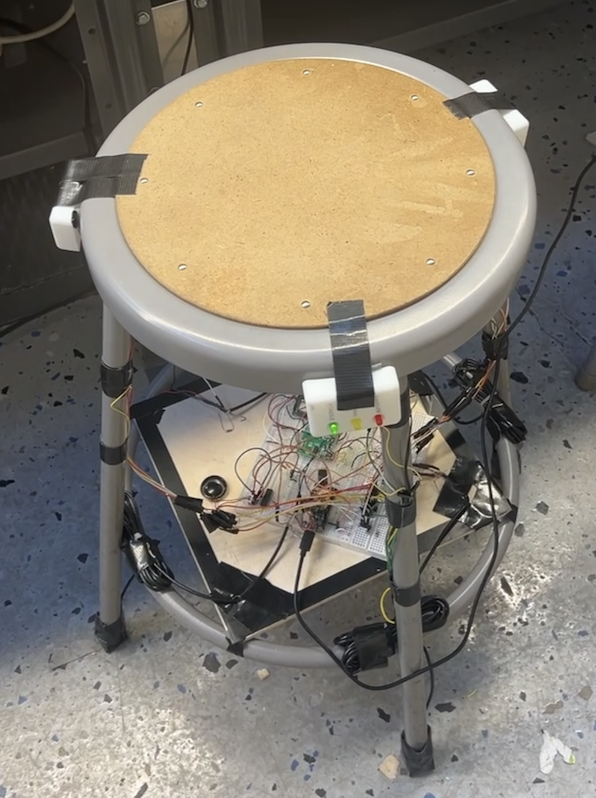
*The completed smart load-sensing chair with integrated sensors and feedback systems*

<div style="display: grid; grid-template-columns: 1fr 1fr; gap: 10px;">

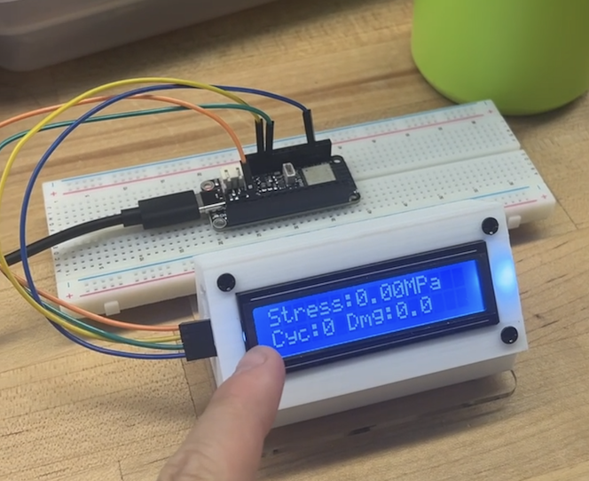
*LCD display showing real-time weight, stress, and factor of safety*

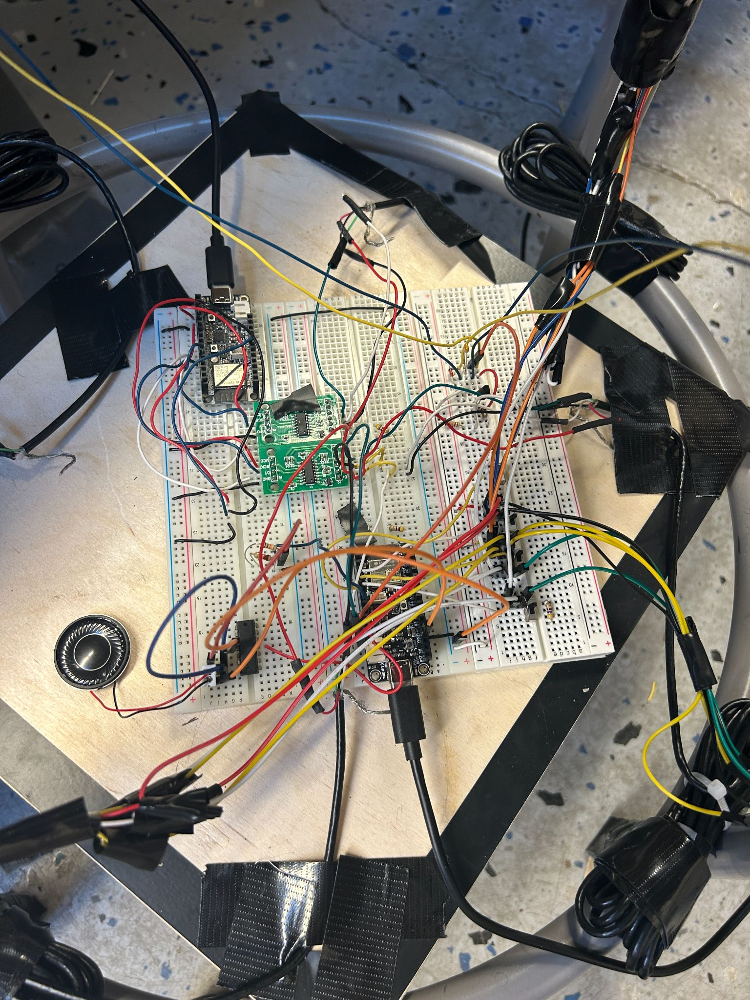
*The assembled circuit with ESP32 microcontrollers, HX711 amplifiers, and actuators*

</div>

---

## Design Process

### CAD Models

A casing was made to hold the LCD screen together to provide a pleasant viewing experience for Professor Anwar/any external person watching the load and factor of safety when the chair is in use.

<div style="display: grid; grid-template-columns: 1fr 1fr; gap: 10px;">


*Figure 1: LCD Mount Base*

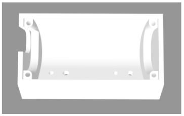
*Figure 2: LCD Mounting Interface*

</div>

To attach the LEDs to the chair, we needed to design a way to integrate them into the chair, separate from the board. This involved 3D printing a mount to the chair such that the LED prongs were still easily accessible for wiring and integration with the rest of the circuit.

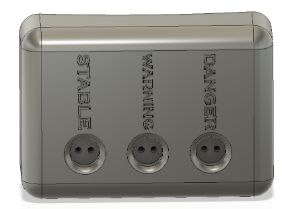
*Figure 3: LED Mount — Green LED labeled "STABLE", yellow labeled "WARNING", and red labeled "DANGER"*

---

### Circuit Diagrams

Our circuit is fairly simple. The system is built around three ESP32 microcontrollers that are communicating over ESP-NOW to sense weight, generate haptic, visual, and auditory feedback, and present relevant information on a user-friendly I2C LCD display.

#### Sensor ESP32

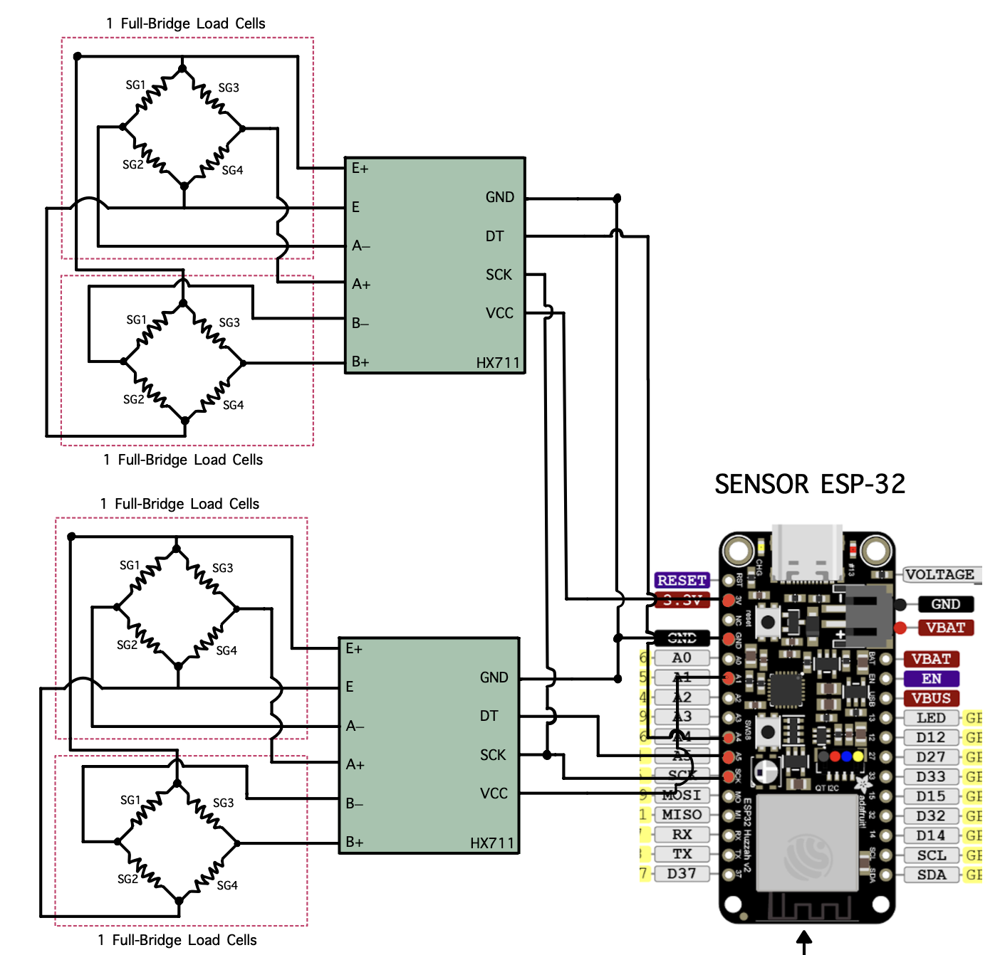
*Figure 4: Sensor ESP32 Circuit Diagram*

The sensor ESP32 circuit has two HX711 24-bit load cell amplifiers/ADCs, each running on a pseudo-SPI communication to the ESP32. They are configured to excite and read from a pair of full-bridge load cells. Each bridge consists of four matched strain gauges (SG1–SG4) wired in the typical Wheatstone bridge configuration: the HX711 supplies the excitation voltage across E+ and E–, and measures the differential voltages between the A+/A- or B+/B- terminals.

These raw counts are linearized and calibrated in our code to yield the weight in kg. After tare and calibration, the ESP-32 periodically clocks out 24-bit samples over its SCK and DT lines, converts them to floating-points, and sends them via ESP-NOW to the actuator and LCD ESPs.

#### Actuating ESP32


*Figure 5: Actuating ESP32 Circuit Diagram*

The actuating ESP32 takes in the weight data coming from the Sensor ESP32 and uses it to drive our feedback:

- **LED Array** — 9 red, yellow, and green LEDs arranged and connected to 4 GPIO pins with current limiting resistors (~470Ω)
- **Audio Amplifier** — Non-inverting audio amplifier built around a single op-amp powered from 5V, with a 10kΩ/2.2kΩ resistor divider to control volume
- **Vibration Motor** — Negative terminal switched by an n-channel MOSFET with a gate resistor (220Ω) and pull-down resistor (10kΩ), with a flyback diode and 10nF capacitor to suppress inductive spikes

#### Receiving ESP32

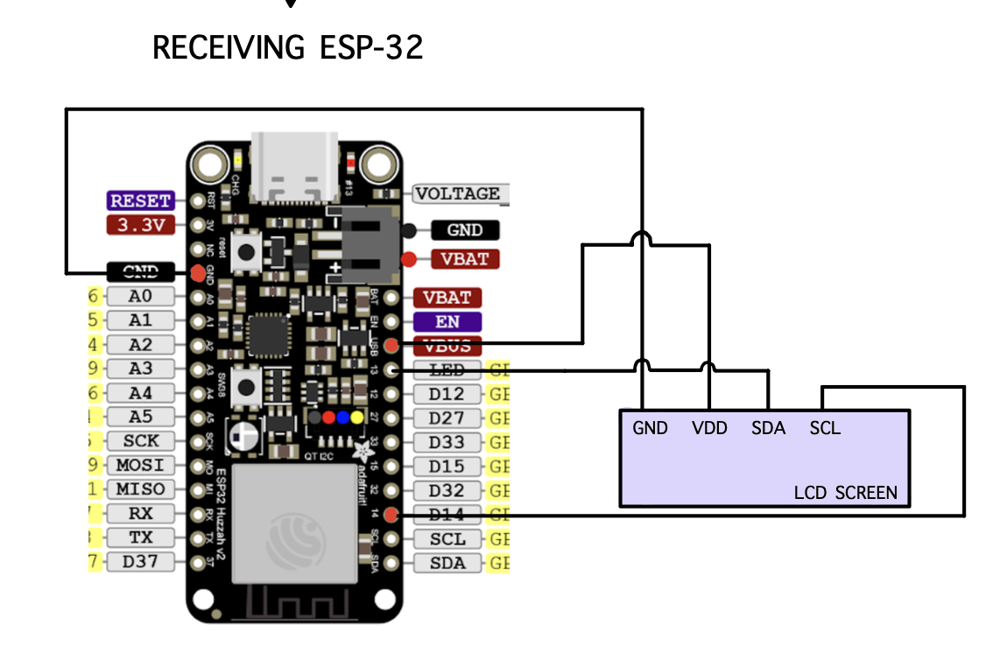
*Figure 6: LCD ESP32 Circuit Diagram*

The LCD ESP32 offers a simple interface via an I2C 16×2 LCD screen. Its VDD and GND are connected directly to the 5V USB VBUS, and the SDA and SCL are wired to the corresponding I2C pins on the ESP32. When the ESP32 receives weight data, we display various pieces of information including weight, factor of safety, cycles until failure, and a timer.

Together, these three circuits form a cohesive wireless network: the sensor ESP32 accurately measures weight, the actuator ESP32 translates those measurements into feedback, and the receiving ESP32 displays the data for human monitoring.

---

## Component Selection

### ESP-32 Microcontrollers

We used 3 **ESP-32 Feather V2** microcontrollers—a breadboard-friendly robust microcontroller that supports up to 5V output from the USB VBUS or the regular 3.3V regulator (up to 500mA to the ESP32). The multitude of GPIO pins and dedicated I2C pins (SDA and SCL) make it extremely flexible for rapid prototyping.

| ESP32 | Function |
|:------|:---------|
| Sensor ESP32 | Reads load cells, sends weight data |
| Actuating ESP32 | Drives LEDs, speaker, vibration motor |
| LCD ESP32 | Displays weight, FOS, fatigue data |

### Sensor Selection

We chose four **QLMH-41 full-bridge compression load cells**, each capable of reading 100kg (220 lbs). Each of the four load cells was placed under one of the four legs. The load cells were paired into twos, connected by an **HX711 amplifier** that:
- Averages the weights from two load cells
- Converts analog to digital output
- Amplifies the signal for variance detection

<div style="display: grid; grid-template-columns: 1fr 1fr; gap: 10px;">

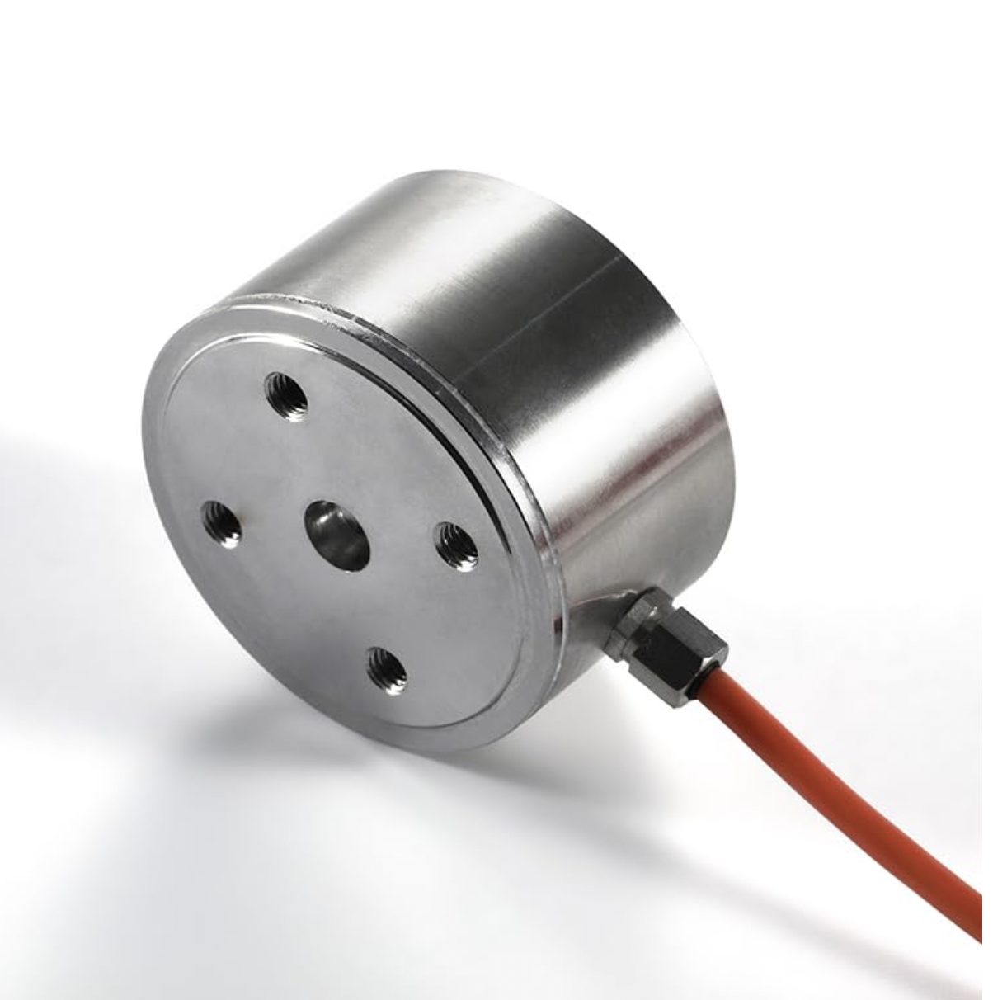
*Figure 7: QLMH-41 Load Cell*


*Figure 8: HX711 Load Cell Amplifier*

</div>

*Note: We originally had a Type K thermocouple connected to an AD8495 amplifier for temperature-dependent material properties, but the data proved negligible so we focused on simplicity.*

### Actuator Selection

We prioritized variety for accessibility:

| Actuator | Purpose |
|:---------|:--------|
| **9 LEDs** (3 groups of R/Y/G) | Visual feedback — Green=good, Yellow=approaching limit, Red=at limit |
| **Speaker** | Audio feedback — Alarm noise at threshold |
| **2 Vibration Motors** | Haptic feedback — Vibrate chair at threshold |

All actuators are controlled by switches, allowing users to customize feedback for different situations and accessibility needs (blindness, deafness, etc.).

---

## Communication Protocol

The main communication protocol used was **ESP-NOW** between our sensor, actuator, and LCD ESP32s. ESP-NOW operates as a P2P protocol, allowing direct communication between ESP32s without a WiFi router.

**MAC Addresses:**
```
LCD_MAC:    b'\x14\x2b\x2f\xaf\x0d\x08'
SENSOR_MAC: b'\x14\x2b\x2f\xaf\x3d\xb4'
```

We opted for one-way communication where the sender sends data without expecting a response—ideal for streaming sensor data.

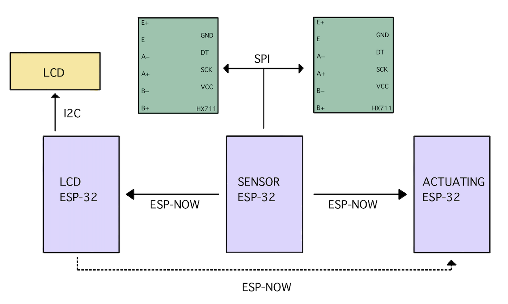
*Figure 9: Communication Protocols between Devices*

This was used in conjunction with:
- **I2C** for the LCD
- **Pseudo-SPI** for the HX711 load-cell amplifiers

---

## Analysis of Data

### Analysis of Elasticity in Chair

Upon early testing, we saw an unexpected phenomenon. Our load cells had a small knob on the bottom with the strain gauge. By putting the load cells directly on the chair bottom, this knob would dig into the rubber piece, leading to load readings that **decayed over time**. This decay was caused by the elasticity of the rubber material—it would initially give accurate readings but then decay exponentially until reaching steady-state.

To fix this, we implemented an **artificial scaling factor** as a function of time:

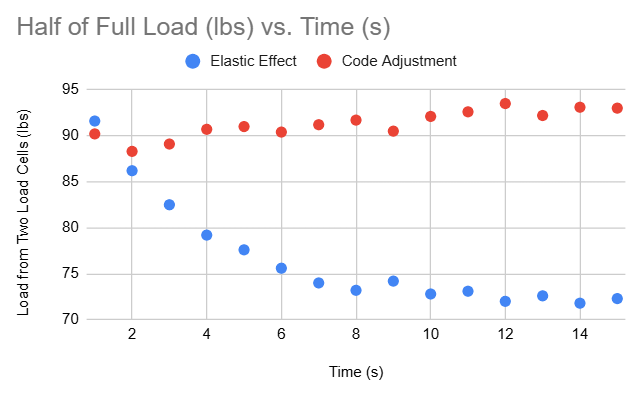
*Figure 10: Load vs Time — comparing elastic effects vs adjusted data*

The scaled data is much more consistent, and while the scaling method leads to a slight overestimate in weight, it is more conservative for stress and safety calculations.

### Finite Element Analysis

To confirm the load cell results, an FEA was conducted on a replica model of the chair in **ANSYS Mechanical** with approximately 200,000 elements.

**Analysis Details:**
- **Applied Force:** 200 lbs on top face (simulating average person)
- **Material:** Stainless Steel
- **Boundary Conditions:** Fixed constraints on all four leg bottom faces, standard Earth gravity

<div style="display: grid; grid-template-columns: 1fr 1fr; gap: 10px;">

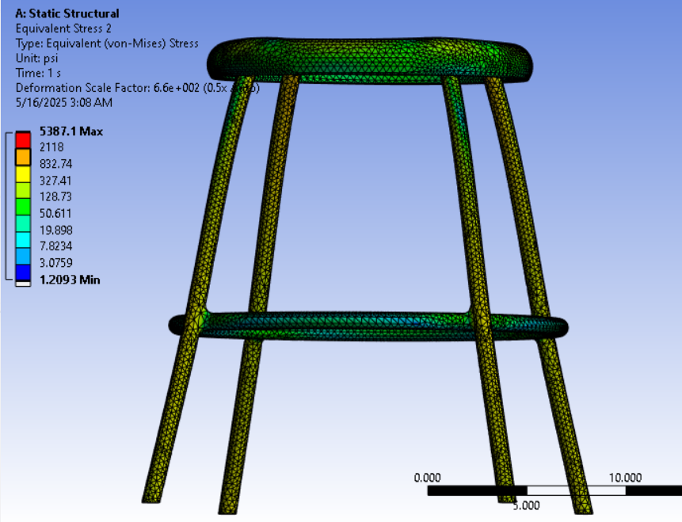
*Figure 11: Equivalent (von Mises) Stress*

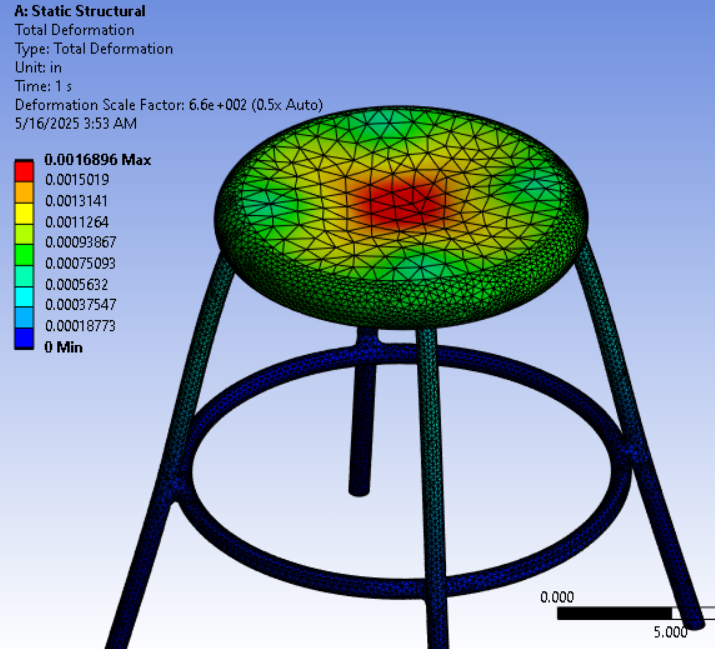
*Figure 12: Deformation (scaled 6.6×10² for visibility)*

</div>

The equivalent stress from FEA aligned well with analytical calculations based on load cell force and leg cross-sectional area. The FEA gave stress values slightly less than analytical calculations, likely due to load transfer to the stiffening ring between legs.

### Analytical Stress Analysis

The raw readings for left and right leg loads, $W\_L$ and $W\_R$ (in pounds), are decoded and summed, then converted to Newtons:

$$F = (W\_L + W\_R) \times 4.44822$$

**Nominal Bending Stress** per leg (assuming equal load sharing):

$$\sigma = \frac{F/4}{A + 1 \times 10^{-8}}$$

where $A$ is the cross-sectional area of one leg.

**Euler Critical Buckling Load** (pinned-pinned column):

$$P\_{\text{crit}} = \frac{\pi^2 E I}{(K L)^2}$$

where $E$ is Young's modulus, $I$ is second moment of area, $L$ is unsupported length, and $K$ is the effective length factor.

**Critical Stress:**

$$\sigma\_{\text{crit}} = \frac{P\_{\text{crit}}}{A}$$

**Fatigue Life Estimation** using Basquin's relation:

$$N\_f = 0.5 \left( \frac{\sigma}{\sigma\_f'} \right)^{1/b}$$

where $\sigma\_f'$ is the fatigue strength coefficient and $b$ is the fatigue exponent.

**Miner's Rule** for damage accumulation:

$$D = \frac{N\_c}{N\_f}$$

When $D$ approaches unity, the component has reached its fatigue life.

---

## Project Materials

- **Project Video:** [Google Drive Link](https://drive.google.com/file/d/1Uf_pQMPMgymlOZwLSmWyfxbtcFZdl9Z3/view?usp=sharing)
- **Project Slides:** [Google Slides](https://docs.google.com/presentation/d/17d7_mQ2YoheZ8O1My2G1bf8Ezz-oP-duuMnW9T6y3D8/edit?usp=sharing)

---

## Code Appendix

### Sender Code (Sensor ESP-32)

<details>
<summary>Click to expand MicroPython code</summary>

```python
import machine
import time
from machine import freq, Pin, PWM
from hx711 import HX711
import network
import espnow

# Initialize WLAN interface for ESP-NOW
sta = network.WLAN(network.STA_IF)
sta.active(True)
sta.disconnect()

# Initialize ESP-NOW
e = espnow.ESPNow()
e.active(True)

# Define the peer's MAC address
peer1 = b'\xe8\x6b\xea\x37\x61\xd4'
peer2 = b'\x14\x2b\x2f\xaf\x0d\x08'
e.add_peer(peer1)
e.add_peer(peer2)
e.send(peer1, "Starting...")
e.send(peer2, "Starting...")

driverB = HX711(d_out=36, pd_sck=5)
driverF = HX711(d_out=4, pd_sck=5)

led_ext = Pin(32, mode=Pin.OUT)
led_ext1 = Pin(14, mode=Pin.OUT)
led_ext2 = Pin(15, mode=Pin.OUT)
speaker_ext = Pin(27, mode=Pin.OUT)
duty_cycle = 05
L1 = PWM(speaker_ext, freq=500, duty=0)

def offset(driver, samples=5, delay=0.3):
    weight_base = 0
    for k in range(samples):
        weight = driver.read()
        if weight != -1:
            weight_base += weight
        time.sleep(delay)
    return weight_base / samples

weightB_tare = offset(driverB)
weightF_tare = offset(driverF)
time = 0
print("Tare Weight Front:", weightF_tare, "Tare Weight Back:", weightB_tare)

def calibrate(weight, raw):
    res = 200 / (2**24)
    delta = raw - weight
    return res * delta

def pvalues(Timer):
    global driverB, driverF, weight_base, time
    
    rawWeightB = driverB.read()
    rawWeightF = driverF.read()
    
    weightB = calibrate(weightB_tare, rawWeightB) * 36
    weightF = calibrate(weightF_tare, rawWeightF) * 33
    
    if weightF > 10:
        weightFor = weightF + (time * weightF / 150)
        weightBak = weightB + (time * weightB / 150)
        time = time + 1
    else:
        weightFor = weightF
        weightBak = weightB
        time = 0
    
    message = f'{weightFor:.1f},{weightBak:.1f}'
    print(message)
    e.send(peer1, message)
    e.send(peer2, message)

tm = machine.Timer(1)
tm.init(period=2000, mode=tm.PERIODIC, callback=pvalues)
```

</details>

### Receiver Code (Actuator ESP-32)

<details>
<summary>Click to expand MicroPython code</summary>

```python
import network
import espnow
from machine import Pin
import machine
import time
from machine import freq, Pin, PWM

led_extY = Pin(32, mode=Pin.OUT)
led_extR = Pin(14, mode=Pin.OUT)
led_extG = Pin(15, mode=Pin.OUT)
speaker_ext = Pin(27, mode=Pin.OUT)
duty_cycle = 05
L1 = PWM(speaker_ext, freq=500, duty=0)
vibration = Pin(33, mode=Pin.OUT)

sta = network.WLAN(network.STA_IF)
sta.active(True)
sta.disconnect()

e = espnow.ESPNow()
e.active(True)

LCD_MAC = b'\x14\x2b\x2f\xaf\x0d\x08'
SENSOR_MAC = b'\x14\x2b\x2f\xaf\x3d\xb4'

e.add_peer(LCD_MAC)
e.add_peer(SENSOR_MAC)

while True:
    host, msg = e.irecv(1000)
    
    if host == LCD_MAC:
        clock_str = msg.decode('utf-8')
        print("Clock update:", clock_str)
        time_limit = 1800
        if int(clock_str) >= time_limit:
            led_extY(0)
            led_extR(1)
            led_extG(0)
            L1.duty(duty_cycle)
            L1.freq(500)
            vibration(1)
    
    if host == SENSOR_MAC:
        message_str = msg.decode('utf-8')
        weights = message_str.split(',')
        weightB = float(weights[0])
        weightF = float(weights[1])
        print("Weight:", weightF + weightB)
        
        if weightB + weightF > 200:
            led_extY(0)
            led_extR(1)
            led_extG(0)
            L1.duty(duty_cycle)
            L1.freq(500)
            vibration(1)
        
        elif weightF > ((weightB + 5) * 5):
            for k in range(5):
                led_extY(1)
                led_extR(1)
                led_extG(1)
                L1.duty(duty_cycle)
                L1.freq(500)
                vibration(1)
                time.sleep(0.5)
                led_extY(0)
                led_extR(0)
                led_extG(0)
                L1.duty(duty_cycle)
                L1.freq(500)
                vibration(1)
                time.sleep(0.5)
        
        elif weightB > ((weightF + 5) * 5):
            for k in range(5):
                led_extY(1)
                led_extR(1)
                led_extG(1)
                L1.duty(duty_cycle)
                L1.freq(500)
                vibration(1)
                time.sleep(0.5)
                led_extY(0)
                led_extR(0)
                led_extG(0)
                L1.duty(duty_cycle)
                L1.freq(500)
                vibration(1)
                time.sleep(0.5)
        
        elif weightB + weightF > 50:
            led_extY(1)
            led_extR(0)
            led_extG(0)
            vibration(0)
            L1.duty(0)
        else:
            led_extY(0)
            led_extR(0)
            led_extG(1)
            L1.duty(0)
            vibration(0)
            time.sleep(0.5)
```

</details>

### LCD Code

<details>
<summary>Click to expand MicroPython code</summary>

```python
import time
import network
import espnow
import math
from machine import SoftI2C, Pin
from I2C_LCD import I2cLcd

sta = network.WLAN(network.STA_IF)
sta.active(True)
sta.disconnect()

e = espnow.ESPNow()
e.active(True)

# Material and Geometric Constants (Stainless Steel)
g = 9.81           # Gravitational acceleration [m/s^2]
A = 0.00017        # Cross-sectional Area [m^2]
E = 200e9          # Young's Modulus [Pa]
I = 1.072e-8       # Iz 2nd moment of area [m^4]
K = 0.25           # Effective length factor
L = 0.5842         # Column length [m]
UTS = 550          # UTS [MPa]

# Basquin Constants for HCF
sigma_f_prime = 1248.7e6
b = -0.07
sigma_upper = 150e6
sigma_lower = 50e6

prev_above = False
cycle_count = 0
damage = 0.0

# LCD Initialization
DEFAULT_I2C_ADDR = 0x27

i2c = SoftI2C(scl=Pin(14), sda=Pin(13), freq=400000)
devices = i2c.scan()
if len(devices) == 0:
    print("No I2C device!")
else:
    for device in devices:
        print("I2C addr: " + hex(device))
        lcd = I2cLcd(i2c, device, 2, 16)

Display_Period_1 = 5
Display_Period_2 = 5
start_time = time.time()

while True:
    host, msg = e.irecv(1000)
    if msg:
        message_str = msg.decode('utf-8')
        weights = message_str.split(',')
        weightL = float(weights[0])
        weightR = float(weights[1])
        F = (weightL + weightR) * 4.44822  # Force in [N] from lbf
        print("Weight:", weightL, weightR)
        
        # Nominal bending stress per leg
        stress = ((F / 4) / (A + 1e-8))
        
        # Buckling
        P_crit = (math.pi * E * I) / ((K * L) ** 2)
        stress_crit = P_crit / A
        FOS_buckling = stress_crit / (stress + 1e-8)
        
        # Fatigue cycle rainflow counting
        above = stress > sigma_upper
        if above and not prev_above:
            cycle_count += 1
        prev_above = above
        
        # Basquin Relation
        Nf = 0
        if stress > 0:
            Nf = 0.5 * (stress / sigma_f_prime) ** (1.0 / b)
        damage = cycle_count / Nf if Nf > 0 else 0
        
        now = time.time()
        cycle_time = int(now - start_time)
        cycle = now % (Display_Period_1 + Display_Period_2)
        
        lcd.clear()
        
        if cycle < Display_Period_1:
            lcd.move_to(0, 0)
            lcd.putstr("Stress:{:.2f}MPa".format(stress / 10e6))
            lcd.move_to(0, 1)
            lcd.putstr("Cyc:{:d} Dmg:{:.1f}".format(cycle_count, damage))
        else:
            lcd.move_to(0, 0)
            lcd.putstr("Timer:{:3d}sec".format(cycle_time))
            lcd.move_to(0, 1)
            lcd.putstr("FOS:{:.0f}".format(FOS_buckling))
        time.sleep(0.5)
```

</details>

