##### Download

+ [Full Report (PDF)](ME151B_Project_3.pdf)

---

## Abstract

This work presents a two-part investigation of convective heat transfer in thin film and internal channel configurations that combines turbulence theory with a modern approach in the physical sciences: physics-informed neural networks (PINNs). In the first part, we revisit a high Prandtl number, turbulent falling film that is relevant to molten salt solar receivers. Starting from the time-averaged energy and momentum balances, an eddy diffusivity model is integrated twice to relate wall heat flux, wall shear stress, and film thickness. By eliminating auxiliary variables, we obtain an explicit correlation showing that the non-dimensional heat transfer coefficient grows with the Prandtl number raised to the one-third power and the Reynolds number raised to $7/24$. The numerical pre-factor is fixed through a mixed analytic-numeric evaluation of a single near-wall integral, demonstrating that compact, closed-form design rules can still emerge from classical analysis even in fully turbulent, high Pr flows.

In the second part, a PINN is trained on fully developed laminar flow and heat transfer in rectangular and filleted channels. On a coarse, one-millimeter collocation grid, the network reproduces bulk velocity but overestimates wall heat flux by roughly an order of magnitude when compared with a high-resolution finite-difference model that resolves the thermal boundary layer. Rounding the channel corners shifts heat flux peaks into the fillets, enhancing local cooling but reducing the area-averaged flux by about two percent, leaving the sharp-cornered rectangle the more effective overall heat sink for a fixed footprint.

Taken together, the study shows that classical boundary layer methods still yield fast, reliable engineering correlations when turbulence dominates and that PINNs offer mesh-free flexibility for complex geometries but demand finer or adaptive wall sampling to achieve quantitative accuracy. The hybrid approach lays a foundation for multiscale optimization of large-scale solar receivers and microscale cooling passages alike.

---

# PART 1: High-Prandtl Turbulent Film Analysis

## Introduction and Theoretical Background

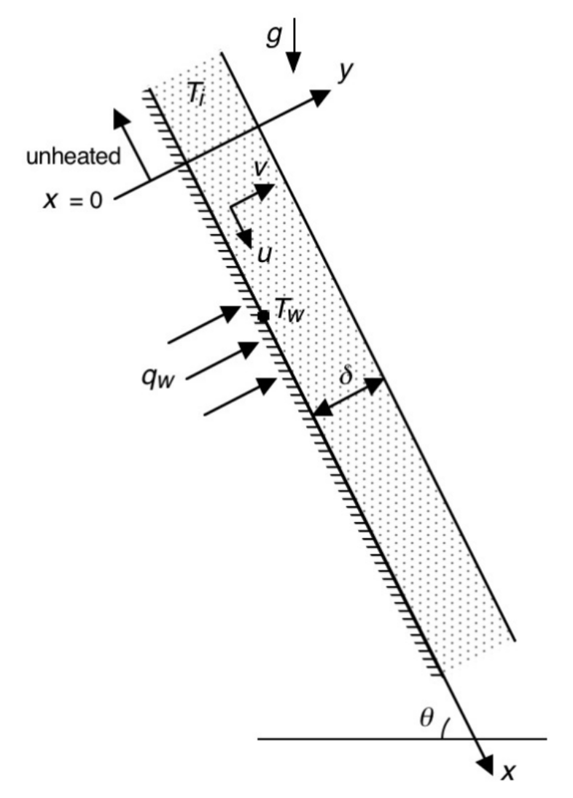
*Figure 1: Turbulent Falling Liquid Film on Inclined Flat Surface*

In this first part of the project, we will be analyzing heat transfer to a falling liquid film on a slightly inclined flat surface, similar to the circumstances considered in Homework 2. For the analysis here, however, the flow will have two key differences. One is that the flow will be turbulent, and the other is that the Prandtl number will be large compared to 1. These additional circumstances could be encountered in a large-scale falling film solar central receiver using molten salt as a working fluid.

For turbulent flow at high Prandtl number, a steep temperature gradient is expected to exist close to the solid surface. (This near-wall region encompasses the viscous sublayer and a portion of the flow just outside it.) The outer region of the film is expected to be virtually isothermal. Heat transfer to the surrounding gas is assumed to be negligible. In the region very near the wall, convection of thermal energy is assumed to be negligible compared to molecular diffusion and turbulent transport normal to the wall. The time-averaged boundary layer form of the energy equation in this region is therefore

$$\frac{\partial}{\partial y}\left[\alpha \frac{\partial \overline{T}}{\partial y}-\overline{\nu'T'}\right]=0$$

Adopting the usual definition of eddy diffusivity, $\epsilon\_H=-\overline{\nu'T'}/(\partial\overline{T}/\partial y)$, this becomes

$$\frac{\partial }{\partial y}\left[(\alpha+\epsilon\_H)\frac{\partial \overline{T}}{\partial y}\right]=0$$

### Task Descriptions

This project is split into 5 tasks which are briefly described below.

1. **Task I**: This task allows us to establish the integral wall heat flux relation. Firstly, we start with the time-averaged energy equation for turbulent liquid film at a high Prandtl number, this formulation assumes an eddy-diffusivity model that grows rapidly with distance from the wall. We then integrate twice—first in the normal direction of the wall and then in its dimensionless version—we then collapse the differential form into integral form that connects the imposed wall heat flux to the temperature difference between the wall and the nearly-isothermal film core. This step isolates the near-wall physics and defines an integral whose numerical value controls all later heat-transfer predictions.

2. **Task II**: This task builds on the integral form from the previous part; we choose a similarity variable, $\eta$, that deals with both the eddy-diffusivity constant and the Prandtl number. The energy-balance integral is then rearranged into a correlation for the local heat-transfer coefficient. Since the integrand goes to 0 as $\eta$ gets large we can set the upper limit as infinity with some error and then split the integral into 3 sub-domains: we then compute 2 of the integrals analytically and one numerically in MATLAB.

3. **Task III**: We then focus on the momentum transport by simplifying the boundary-layer momentum equation for the film. By neglecting streamwise convection terms we can integrate this equation across the film thickness to get an explicit expression for the wall shear stress in terms of fluid densities, gravity, surface incline angle, and the unknown film thickness.

4. **Task IV**: With the wall shear now characterized, we are able to figure out the mass-flow rate. A 1/7 power-law universal velocity profile is used to represent turbulent flow. Integrating that profile across the film gets us mass-flow rate per unit width. The final expression is a power law that connects mass-flow, wall shear stress, film thickness, and fluid properties through two numerical constants fixed by the chosen profile.

5. **Task V**: This task removes wall shear from our expression. First, the wall-shear expression from **Task III** is combined with the mass-flow relation from **Task IV**, eliminating shear stress and giving a single equation that predicts film thickness directly from the imposed mass-flow rate and the angle of incline. Next, we also eliminate the thickness by combining the energy result of **Task II** with the momentum and mass-flow relations. The product is a fully non-dimensional heat-transfer correlation that depends only on Reynolds and Prandtl numbers; its coefficient and exponent emerge from the preceding algebra and numerical integration.

## Implementation and Development of Code

### Task II Code

The only necessary piece of code in this part of the project was a numerical integration scheme to calculate $I\_2$. We first discretize the interval $[a,b]$ into $N$ equally spaced sub-intervals with a width of $\delta=\frac{b-a}{N}$. We then evaluate the integrand $f(\eta) = \frac{\eta^{-2/3}}{1+\eta}$ at all $N+1$ nodes, and we apply the trapezoid rule in a single pass.

$$\int\_a^bf(x)dx \approx \frac{\Delta x}{2}\sum\_{k=1}^N(f(x\_{k-1})+f(x\_k))=\Delta x \left(\frac{f(x\_N)+f(x\_0)}{2}+\sum\_{k=1}^{N-1}f(x\_k)\right)$$

Since we just summed all the terms exactly once, the time complexity scales linearly as $\mathcal{O}(N)$. We chose $N=100,000$ since it gave us good accuracy without taking too much computing power.

**Algorithm: Trapezoidal Rule for Numerical Integration**

1. **Initialize integration parameters and number of subdivisions:**
   $$N \gets 100000,\quad lb \gets 0.01,\quad ub \gets 100,\quad \delta \gets \frac{ub - lb}{N}$$

2. **Compute sample points:**
   $$\text{for }i = 0,1,\dots,N:\quad \eta\_i \leftarrow lb + i\,\delta$$

3. **Evaluate integrand:**
   $$\text{for }i = 0,1,\dots,N:\quad f\_i \leftarrow \frac{\eta\_i^{-2/3}}{1 + \eta\_i}$$

4. **Apply trapezoidal rule:**
   $$I \leftarrow \frac{1}{3}\,\delta\;\Bigl(\tfrac{1}{2}f\_{0} + \sum\_{i=1}^{N-1}f\_{i} + \tfrac{1}{2}f\_{N}\Bigr)$$

**Output:** $I$ (approximate value of the integral).

## Results and Discussion

This section aims to give an overview of the quantitative outcomes of the turbulent falling-film analysis and interprets their physical significance. We also present all the mathematical formulation and analytical approaches used throughout this part of the project to model and understand high-Prandtl turbulent film analysis. Solutions to **Tasks I to V** are shown here.

### Task I Results and Discussion

For this task, by integrating Equation (2) twice, changing the second integration variable to $y^+$, we obtain a relation of the form

$$\frac{(T\_w-T\_i)k\sqrt{\tau\_w/\rho\_l}}{q\_w\nu}=\int\_0^{\delta\_{nw}^+}\frac{dy^+}{1+F\_I(\mathrm{Pr}, \nu)\frac{\epsilon\_M(y^+)}{\mathrm{Pr}\_t}}$$

where $q\_w$ is the wall heat flux and $F\_I(\mathrm{Pr, \nu})$ is a function of Pr and $\nu$. Note that $\delta\_{nw}$ and $\delta\_{nw}^+$ correspond to a thermal boundary layer thickness that is smaller than the film thickness $\delta$.

**Task I. Integral form of the wall-heat-flux relation:** Firstly, we start from the time-averaged boundary layer form of the energy equation in the near-wall region.

*Derivation:* We integrate Eq. 2 with respect to $y$ to get the axial heat flux

$$\frac{\partial }{\partial y}\left[(\alpha+\epsilon\_H)\frac{\partial \overline{T}}{\partial y}\right]=0$$

$$(\alpha+\epsilon\_H)\frac{\partial \overline{T}}{\partial y}=C\_1$$

At the wall, the no-slip condition implies that the velocity fluctuations are gone $\Rightarrow \epsilon\_H=0$. Therefore, if we apply Fourier's law of heat conduction to enforce the constant wall heat flux

$$q\_w=-k\frac{\partial \overline{T}}{\partial y}\Big|\_{y=0}\Rightarrow -\frac{q\_w}{k}=\frac{\partial \overline{T}}{\partial y}\Big|\_{y=0}$$

Then substituting this into our axial heat flux expression yields

$$\alpha \frac{\partial \overline{T}}{\partial y}\Big|\_{y=0}=C\_1 \Rightarrow C\_1=-\alpha \frac{q\_w}{k}$$

Therefore, the region near the wall obeys

$$(\alpha+\epsilon\_H)\frac{\partial \overline{T}}{\partial y}=-\alpha \frac{q\_w}{k}$$

We rearrange and integrate again w.r.t. $y$

$$T\_w-T\_i =\frac{\alpha q\_w}{k}\int\_0^{\delta\_{nw}}\frac{1}{\alpha+\epsilon\_H}dy$$

We introduce the following non-dimensional variables

$$u^+\triangleq \frac{u}{u\_\tau}=\frac{u}{\sqrt{\tau\_w/\rho\_l}}\quad , \quad y^+\triangleq \frac{yu\_{\tau}}{\nu}=\frac{y\sqrt{\tau\_w/\rho\_l}}{\nu}$$

Note that the characteristic velocity $u\_\tau \triangleq \sqrt{\tau\_w/\rho\_l}$. By the definition of kinematic viscosity as well as the definition of the Prandtl number, we also have the following expressions

$$\nu \triangleq \mu/\rho\_l\quad , \quad \mathrm{Pr}=\frac{\nu}{\alpha}\Rightarrow \alpha =\frac{\nu}{\mathrm{Pr}}$$

Recall that the turbulent Prandtl number is defined as

$$\mathrm{Pr}\_t \triangleq \frac{\epsilon\_M}{\epsilon\_H}\Rightarrow\epsilon\_H=\frac{\epsilon\_M}{\mathrm{Pr}\_t}$$

Combining this all, we can write the denominator of the integrand as

$$\alpha+\epsilon\_H=\frac{\nu}{\mathrm{Pr}}\left(1+\frac{\mathrm{Pr}}{\nu}\frac{\epsilon\_M}{\mathrm{Pr}\_t}\right)$$

We set $F\_I\triangleq \mathrm{Pr}/\nu$, then simplifying we get the final result:

$$\frac{(T\_w-T\_i)k\sqrt{\tau\_w/\rho\_l}}{q\_w\nu}=\int\_0^{\delta\_{nw}^+}\frac{dy^+}{1+F\_I(\mathrm{Pr}, \nu)\frac{\epsilon\_M(y^+)}{\mathrm{Pr}\_t}}$$

where $F\_I(\mathrm{Pr}, \nu)=\frac{\mathrm{Pr}}{\nu}$ and $\delta\_{nw}^+=\frac{\delta\_{nw}u\_{\tau}}{\nu}$.

To evaluate the integral on the right side of the above equation, the variation of $\epsilon\_M$ and turbulent Prandtl number $\mathrm{Pr}\_t$ must be known. In the relation we obtained, it is clear that for large Pr, the integrand is small except when $\epsilon\_M$ is sufficiently small that $\mathrm{Pr}\epsilon\_M/\nu=\mathcal{O}(1)$. Thus, to evaluate the integral, an accurate relation for $\epsilon\_M$ is only needed in the region close to the wall (i.e. for small $y^+$), where $\epsilon\_M$ is small. Studies by Tien (1964) and Simonek (1983) indicated that $\epsilon\_M/\nu$ is proportional to $(y^+)^3$ for small $y^+$. For this analysis, we therefore take

$$\epsilon\_M/\nu=\gamma(y^+)^3$$

Based on the study by Kato, et al. (1968), we will use the recommended value of $5.10\times10^{-4}$ for $\gamma$. Here the turbulent Prandtl number is taken to be one: $\mathrm{Pr}\_t=1.0$.

### Task II Results and Discussion

We continue from the first task. We designate the integral on the right side of Equation (3) as $I$ and defining $\eta=\gamma(y^+)^3\mathrm{Pr}$, change the variable of integration in $I$ to $\eta$, and recognize the resulting modified form of Equation (5) to a relation for the heat transfer coefficient $h=q\_w/(T\_w-T\_i)$ having the form

$$\frac{h}{k}\left(\frac{\nu}{\sqrt{\tau\_w/\rho\_l}}\right)=\frac{(\gamma\mathrm{Pr})^{1/3}}{I}$$

where

$$I=\frac{1}{C\_{1.2}}\int\_{0}^{\gamma(\delta\_{nw}^+)^3\mathrm{Pr}}\frac{\eta^{-2/3}}{1+\eta/\mathrm{Pr}\_t}d\eta$$

where $\mathrm{Pr}\_t=1.0$, and $C\_{1.2}=3$ is an integer numerical constant.

To evaluate the integral $I$, we proceed as follows. First, we adopt the idealization that the Prandtl number is high. Since the integrand goes to zero as $\eta$ gets large, we assume we can set the upper limit to infinity with little error. Then, break the integral up into three parts:

$$I=\frac{1}{C\_{1.2}}\int\_0^\infty \frac{\eta^{-2/3}}{1+\eta/\mathrm{Pr}\_t}d\eta$$

$$I=\frac{1}{C\_{1.2}}\int\_0^{0.01} \frac{\eta^{-2/3}}{1+\eta}d\eta+\frac{1}{C\_{1.2}}\int\_{0.01}^{100} \frac{\eta^{-2/3}}{1+\eta}d\eta+\frac{1}{C\_{1.2}}\int\_{100}^{\infty} \frac{\eta^{-2/3}}{1+\eta}d\eta$$

In the first integral, the denominator of the integrand only varies between 1 and 1.01, so set the denominator to its mean value 1.005. For the third integral, $\eta$ is much larger than one over its $\eta$ range, so neglect one compared to $\eta$ in the denominator, making the integrand $\eta^{-5/3}$.

**Evaluation of the integral $I$:**

Splitting the integral into 3 parts, we evaluate the first two integrals analytically:

$$I\_1=\frac{1}{3}\int\_0^{0.01}\frac{\eta^{-2/3}}{1.005}d\eta = \frac{1}{3.015}\left[3\eta^{1/3}\right]^{0.01}\_0 \Rightarrow I\_1=0.2144$$

The third integral is evaluated as follows:

$$I\_3=\frac{1}{3}\lim\_{t\rightarrow \infty}\int\_{100}^t \eta^{-5/3}d\eta = -\frac{1}{2}\lim\_{t\rightarrow\infty}[t^{-2/3}-100^{-2/3}] \Rightarrow I\_3=0.02321$$

The second integral was evaluated using the trapezoidal rule method in MATLAB:

$$I\_2=0.971216$$

Therefore, summing up all the individual integrals, we get a final value of:

$$I=\sum\_{i=1}^3I\_i=1.208826$$

### Task III Results and Discussion

For this next task, we shift focus to the momentum transport. For the boundary layer $U$-momentum equation,

$$U\frac{\partial U}{\partial x}+V\frac{\partial U}{\partial y}=\frac{g\sin \theta(\rho\_l-\rho\_g)}{\rho\_l}+\frac{\partial}{\partial y}\left((\nu+\epsilon\_M)\frac{\partial U}{\partial y}\right)$$

Neglecting the momentum convection terms and integrating this equation across the film to obtain a relation for the wall shear as a function of the film thickness and the other parameters in the equation.

**Task III. Wall-shear relation from the momentum equation:**

Neglecting the convective terms, which is consistent with the assumption of a thin-film liquid, we get:

$$\frac{\partial}{\partial y}\left((\nu+\epsilon\_M)\frac{\partial U}{\partial y}\right)=-\frac{g\sin\theta(\rho\_l-\rho\_g)}{\rho\_l}$$

Also, assuming turbulence is isotropic, we can use the relation: $\tau\_w=\rho\_l(\nu+\epsilon\_M)\frac{dU}{dy}$ to get:

$$\frac{\partial \tau\_w}{\partial y}=-g\sin\theta(\rho\_l-\rho\_g)$$

Now integrating from the wall $y=0$ to the free surface at $y=\delta$:

$$\tau\_w(\delta)-\tau\_w(0)=-g\sin\theta(\rho\_l-\rho\_g)\delta$$

Since at the free surface, there is no shear force, $\tau\_w(\delta)=0$, and at the wall $\tau\_w(0)=\tau\_w$, hence:

$$\tau\_w=g\sin\theta(\rho\_l-\rho\_g)\delta$$

### Task IV Results and Discussion

By characterizing the wall shear, we are able to determine a mass-flow relation. The mass-flow rate per unit width of the surface (in the $z$ direction) is computed by integrating the $U$ velocity across the film $\Gamma$:

$$\Gamma=\rho\_l \int\_0^\delta Udy$$

Using the power-law universal velocity profile:

$$u^+=8.75(y^+)^{1/7}$$

to evaluate the integral and obtain a relation for mass flow $\Gamma$ (per unit width of surface) as a function of wall shear, film thickness and properties:

$$\Gamma=C\_{1.4}\rho \nu \left(\frac{\delta}{\nu/\sqrt{\tau\_w/\rho\_l}}\right)^{n\_{1.4}}$$

**Task IV. Mass-flow rate relation using the power-law universal velocity profile:**

We compute the mass flow rate per unit width of the surface (in the $z$-direction) as follows:

$$\Gamma=\rho\_l\int\_0^\delta Udy$$

Using the power-law universal velocity profile:

$$U=u\_\tau 8.75\left(\frac{yu\_\tau}{\nu}\right)^{1/7}$$

Substituting into our mass flow integral yields:

$$\Gamma = 8.75\rho\_l u\_\tau^{8/7}\nu^{-1/7}\int\_0^\delta y^{1/7}dy = 8.75\rho\_l u\_\tau^{8/7}\nu^{-1/7}\cdot \frac{7}{8}\delta^{8/7}$$

$$\Gamma = 7.65625\rho\_l \nu \left(\frac{\delta}{\nu/\sqrt{\tau\_w/\rho\_l}}\right)^{8/7}$$

where $C\_{1.4}=7.65625$ and $n\_{1.4}=8/7$.

### Task V Results and Discussion

This task is split into two parts (a) and (b). For part (a), we combine the wall-shear equation and mass-flow equation to eliminate the wall shear and obtain a relation between mass flow per unit width of the surface $\Gamma$, film thickness $\delta$, with $\rho\_l$, $\rho\_g$, $\nu$, $g$, $\theta$ appearing as parameters.

**Task V.a. Elimination of shear stress:**

Modifying the equation for wall shear and using $u\_\tau=\sqrt{\tau\_w/\rho\_l}$, we get:

$$u\_\tau=\sqrt{\frac{g\sin\theta(\rho\_l-\rho\_g)}{\rho\_l}}\delta^{1/2}$$

Substituting into the $\Gamma$ equation:

$$\Gamma =7.65625\rho\_l^{3/7}((\rho\_l-\rho\_g)g\sin\theta)^{4/7}\nu^{-1/7}\delta^{12/7}$$

Rearranging for $\delta$:

$$\delta = \left[\frac{\Gamma}{7.65625\rho\_l^{3/7}((\rho\_l-\rho\_g)g\sin\theta)^{4/7}\nu^{-1/7}}\right]^{7/12}$$

**Task V.b. Elimination of $\delta$:**

Part (b) requires us to combine the equations to eliminate $\delta$ and obtain a non-dimensional relation for the heat transfer coefficient having the form:

$$\frac{h}{k}\left(\frac{\nu^2\rho\_l}{g\sin\theta(\rho\_l-\rho\_g)}\right)^{1/3}=C\_{1.5}\mathrm{Pr}^{1/3}\mathrm{Re}^{n\_{1.5}}$$

where the Reynolds number $\mathrm{Re}$ is defined as:

$$\mathrm{Re}=\frac{4\Gamma}{\rho\_l \nu}$$

After detailed algebra (combining the heat transfer coefficient relation, wall-shear expression, and mass-flow relation), we obtain:

$$\frac{h}{k}\left(\frac{\nu^2\rho\_l}{g\sin\theta(\rho\_l-\rho\_g)}\right)^{1/3}=0.0244\mathrm{Pr}^{1/3}\mathrm{Re}^{7/24}$$

where $C\_{1.5}=0.0244$ and $n\_{1.5}=7/24$.

## Conclusion (Part 1)

This first part of the project allowed us to develop and compare various analytical and numerical approaches to predict heat transfer in a turbulent, high-Prandtl-number falling liquid film. Starting with the eddy-diffusivity model for the near-wall energy balance, we derived an integral expression for the wall heat flux and were able to evaluate it using some approximations, analytically, and numerically via the Trapezoid rule for numerical integration. A similarity transformation then allowed us to simplify the governing integral into a universal heat-transfer correlation, isolating the integral non-dimensional group $I$.

We also looked at simplifying the turbulent boundary layer momentum equation to obtain an explicit wall-shear relation, and—using the power-law universal velocity profile—derived the mass-flow rate per unit width. By eliminating the shear and film thickness, we ended up successfully with a non-dimensional correlation for the heat-transfer coefficient as a function of Reynolds and Prandtl numbers. Each step in this portion allowed us to reinforce the others which gave us good predictions demonstrating that classical methods, despite their age, are robust and are of great practical value for rapid engineering estimation when dealing with large-scale falling film applications.

---

# PART 2: PINN Solution for Convective Channel Flow

## Introduction and Theoretical Background

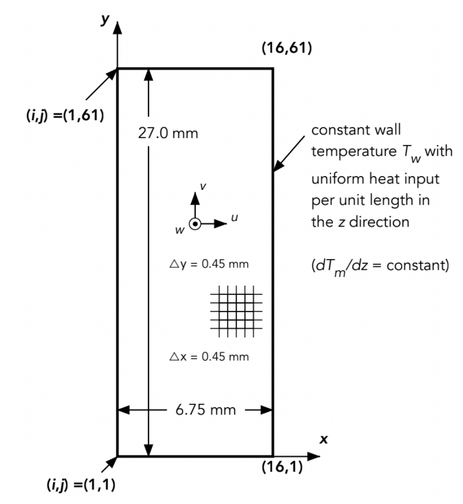
*Figure 2: Constant Wall Temperature $T\_w$ with Uniform Heat Input*

The second part of this project introduces us to the use of a physics-inspired neural network (PINN) to solve a convective transport problem for which there are governing partial differential equations and associated boundary conditions. Specifically, this project focuses on the type of fully-developed flow and heat transfer considered in Project 1, but with a completely different approach to determining a solution. The project aims to model fully-developed flow and heat transfer in a channel with a specified cross section, uniform temperature around the perimeter at each axial ($z$) location, and uniform heat transfer input per unit length of the channel.

Here the governing equations and boundary conditions discussed in Project 1 apply. The equations are:

$$0=\frac{\mu}{\rho}\left[\frac{\partial^2w}{\partial x^2}+\frac{\partial^2w}{\partial y^2}\right]-\frac{1}{\rho}\frac{\partial P}{\partial z}$$

$$w\frac{\partial T}{\partial z}=\alpha\left[\frac{\partial^2 T}{\partial x^2}+\frac{\partial ^2T}{\partial y^2}\right]$$

Note that $w$ is the velocity component in the axial direction of the passage. For fully developed flow, $u$ and $v$ are zero and $z$ derivatives are zero, except for $\partial T/\partial z$, which is constant for constant heat addition at the walls per unit length, and the imposed pressure gradient $\partial P/\partial z$. The continuity equation is satisfied for these conditions since all terms in it are zero.

Recall that for fully developed heat transfer with uniform heat addition at the walls:

$$\frac{\partial T}{\partial z}=\frac{dT\_m}{dz} \text{ at all }(x,y) \text{ locations.}$$

The governing equations can therefore be written as:

$$\frac{\partial^2w}{\partial x^2} + \frac{\partial^2w}{\partial y^2}=\frac{1}{\rho\nu}\frac{dP}{dz}$$

$$\frac{\partial^2T}{\partial x^2}+\frac{\partial^2T}{\partial y^2}=\frac{w}{\alpha}\left(\frac{dT\_m}{dz}\right)$$

Here we will consider flow of water in which the right side of the above equations contains a fixed constant or a fixed constant multiplying $w$. In addition, here the parameter units will be expressed in mm instead of meters. The following properties for water are used: $\alpha=0.146\ \mathrm{mm^2/s}$, $\rho=9.97\times10^{-7}\ \mathrm{kg/mm^3}$, $\nu=0.826\ \mathrm{mm^2/s}$, $c\_p=4164\ \mathrm{J/kg^\circ C}$, $k=6.06\times10^{-4}\ \mathrm{W/mm^\circ C}$.

And, in mm-based units, the values of the constants are:

$$\frac{1}{\mu}\left(\frac{dP}{dz}\right)=-80.0\ \mathrm{mm^{-1}s^{-1}}, \quad \frac{1}{\alpha}\left(\frac{dT}{dz}\right)=0.103\ ^\circ \mathrm{C\ s/mm}$$

Also the boundary conditions that apply at the passage wall are:

$$w=0\ \mathrm{(mm/s)}\text{ and }T=90^\circ\mathrm{C}\text{ (at the passage wall)}$$

### PINN Approach Overview

Two key ideas are foundations for PINN approaches to solving governing PDEs for physical systems. One is the use of a neural network as a powerful means of fitting performance trends in the data or the way the system behaves. PINN methods can be designed to fit multiple features of system behavior. In a system governed by a PDE and boundary or initial conditions, both satisfying the equation and satisfying the boundary or initial conditions can be captured.

In training the neural network, feedback on the goodness of fit is provided as the value of a loss function (sometimes called an error function), so that the best possible fit corresponds to a minimum in the loss function value returned. The neural network typically has a large number of adjustable parameters, and the objective is to find the combination of those parameters that minimizes the loss function.

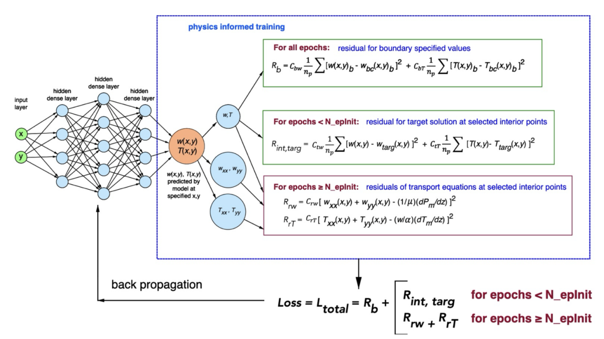
*Figure 3: Schematic of PINN model for fully developed flow and convection in a channel*

### Task Descriptions

This project is split into 3 tasks which are briefly described below.

1. **Task I**: This task focuses on preparing the Jupyter Notebook to accurately and fully represent the developed flow and heat transfer for a rectangular channel. We populate the boundary-point tensor with the wall coordinates provided; we verify the data arrays and boundary checker contain identical point pairs, and then we run the following cells sequentially. We train the network in two long epoch blocks until the loss hits our tolerance of about 0.3. When it converges, we use the field data and the plots to compute the temperature gradient and heat flux to the fluid at the mid-span of both the short and long walls of the channel; we also determine the peak flow velocity and minimum temperature in the flow and tabulate them next to results from the Poisson-equation Gauss-Seidel code developed in Project 1.

2. **Task II**: We now consider a new geometry. Modifying the code to model the flow and heat transfer in the rounded corner channel. We remove 12 grid points closest to each sharp corner and add the 12 new arc points. Like above, we retrain our network, plot the field data, and discuss how they differ from the corresponding plots for the sharp rectangular domain.

3. **Task III**: Lastly, explore the variation of the heat flux along the wall of the passage in the near corner region. Extracting the temperature gradients at the wall nodes closest to each corner (and for the rounded tube, at the bend midpoint) we compute the heat flux and discuss how the heat flux behaves at the corner itself as well as how it varies along the wall surface as we approach the corner. Finally, we state which geometry offers the more uniform and better thermal performance.

## Implementation and Development of Code

### Custom Loss Function Structure

Custom loss functions provide the means to customize the PINN modeling scheme to the specific system of interest. For PINNs, specialized features are added to combine multiple loss mechanisms. In this project three loss mechanisms are incorporated into the custom loss function:

1. The first is the sum of the square of the deviations between the model predictions of $w$ and $T$ at the boundary (wall) and the specified boundary conditions ($w = 0$ and $T = 90^\circ C$).

2. In the early portion of the simulation (number of epochs up to about 2000), the boundary loss calculation is followed by calculation of a loss component that sums the squared error between the model predictions of $w$ and $T$ and the corresponding value for an approximate target solution.

3. For epochs beyond about 2000, the custom loss function switches and instead of computing the loss function component for the target solution, the squared errors of the residue errors of the momentum equation and heat transfer PDE equations are computed.

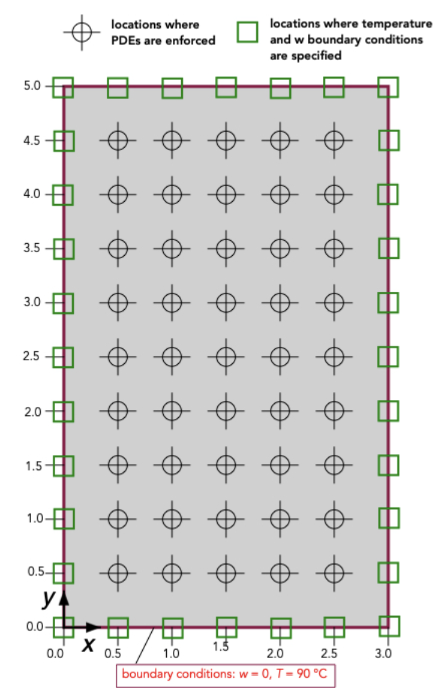
*Figure 4: Domain of convective flow and heat transport with specified $w=0$ and $T=90^\circ$C at the boundary. The coordinates $x$ and $y$ are in millimeters.*

For **Task II**, we model the flow and heat transfer in the rounded-corner channel:

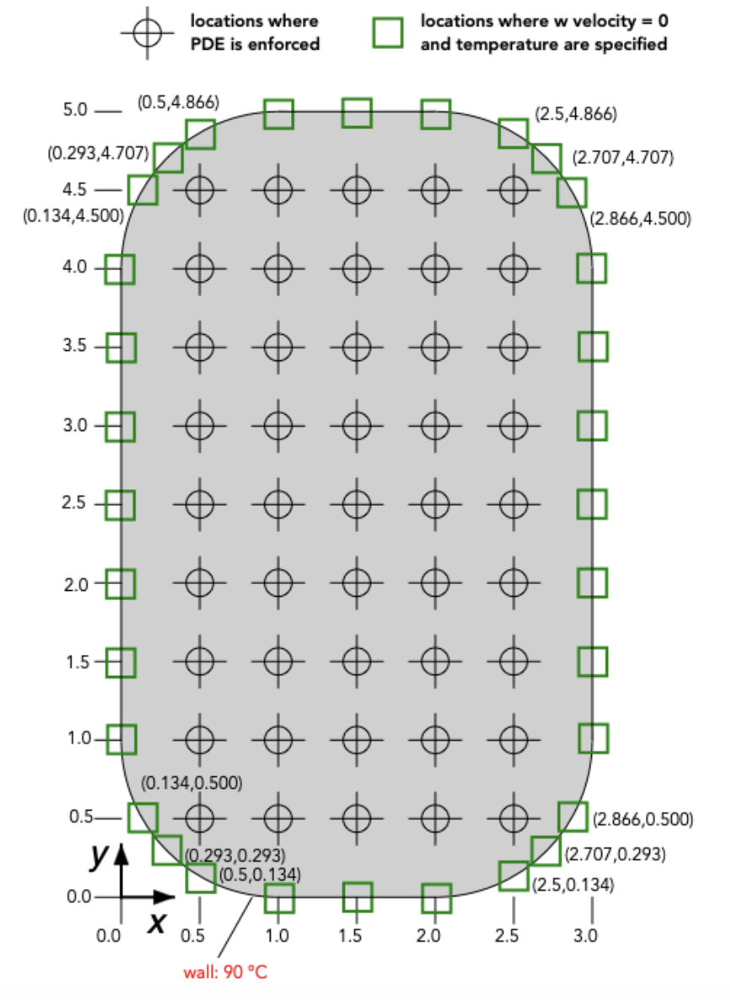
*Figure 5: Domain of convective flow and heat transport for a rounded-corner tube with specified $w$ velocity and $T$ at the boundary. The coordinates $x$ and $y$ are in millimeters.*

## Results and Discussion

### Task I Results and Discussion

First, the boundary conditions were modified so that all wall data points were included in the `pointsBoundaryChk` tensor. The model was trained with the loss progressively decreasing with each epoch. Training was deemed sufficient when the model achieved a loss value of 0.29.

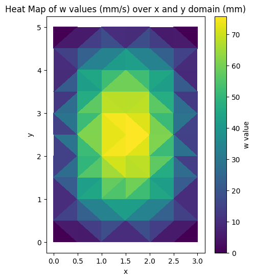
*Figure 6a: PINN Velocity Profile for Rectangular Channel*

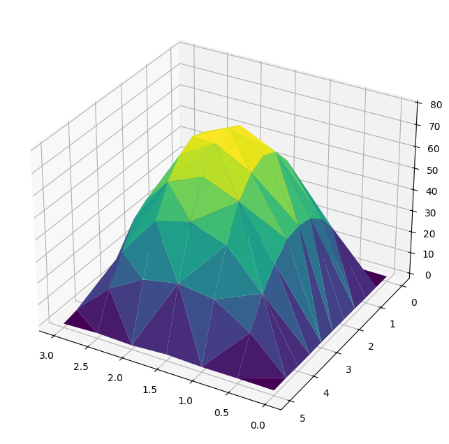
*Figure 6b: PINN Velocity Profile for Rectangular Channel (alternate view)*


*Figure 7: Parity Plot for Rectangular Channel*

The PINN outputs are reported in millimetres and mm/s. All coordinates and velocities were therefore multiplied by $10^{-3}$ to convert them to metres and m/s. The thermal conductivity supplied for the PINN model is $k = 6.06\times10^{-4}\ \text{W mm}^{-1\ \circ\mathrm{C}^{-1}}$, which corresponds to $k = 0.606\ \text{W m}^{-1\ \circ\mathrm{C}^{-1}}$.

$$\frac{\partial T}{\partial n} = \frac{T\_{\text{int}}-T\_{\text{wall}}}{\Delta n}, \qquad q'' = -k\frac{\partial T}{\partial n}, \qquad \Delta n = 0.5\ \text{mm} = 5\times10^{-4}\ \text{m}$$

| Wall location | $T\_{\text{wall}}$ (°C) | $T\_{\text{int}}$ (°C) | $\partial T/\partial n$ (°C/m) | $q''$ (kW/m²) |
|---------------|------------------------|------------------------|-------------------------------|---------------|
| Long wall center (0 mm, 2.5 mm) | 90.100 | 57.638 | $-6.49\times10^{4}$ | 39.3 |
| Short wall center (1.5 mm, 0 mm) | 89.755 | 69.047 | $-4.14\times10^{4}$ | 25.1 |

The maximum $w$-velocity predicted by the PINN is $w\_{\max}=79.192\ \text{mm/s}=0.0792\ \text{m/s}$, occurring at the point $(1.5\ \text{mm}, 2.5\ \text{mm})$. The coldest fluid temperature in the dataset is $T\_{\min}=32.267°\text{C}$, found at the same location.

| Model | $q''\_{\text{long}}$ (kW/m²) | $q''\_{\text{short}}$ (kW/m²) | Peak $\|w\|$ (m/s) | $T\_{\min}$ (°C) |
|-------|------------------------------|-------------------------------|-------------------|-----------------|
| PINN | 39.3 | 25.1 | 0.0792 | 32.27 |
| Finite difference | 0.58 | 1.5 | 0.0593 | 79.5 |

This large discrepancy between the PINN and finite-difference model is likely because the PINN's mesh is so coarse that it skips most of the thermal boundary layer region adjacent to the walls. Lacking interior nodes there, the network fits the sparse wall data by steepening its temperature profile over the few points it does see, which over-estimates the normal gradients and thus the wall heat flux.

### Task II Results and Discussion

To modify the model for the channel with rounded corners, the code was updated to reflect the geometry shown in Figure 5. First, the three coordinate points nearest to each of the four corners were removed from the `xdata` and `ydata` arrays, eliminating a total of 12 entries. Next, new entries were added to include the coordinates of the 12 rounded corner points.

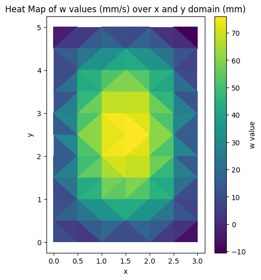
*Figure 9a: PINN Velocity Profile for Rounded Channel*


*Figure 9b: PINN Velocity Profile for Rounded Channel (alternate view)*

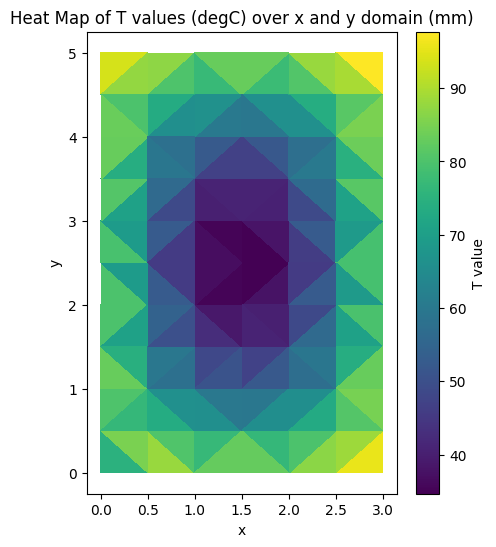
*Figure 10a: PINN Temperature Profile for Rounded Channel*

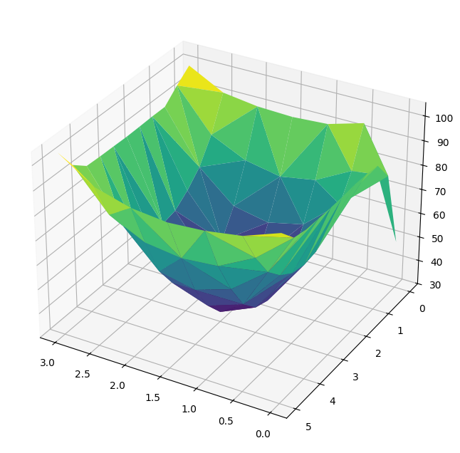
*Figure 10b: PINN Temperature Profile for Rounded Channel (alternate view)*

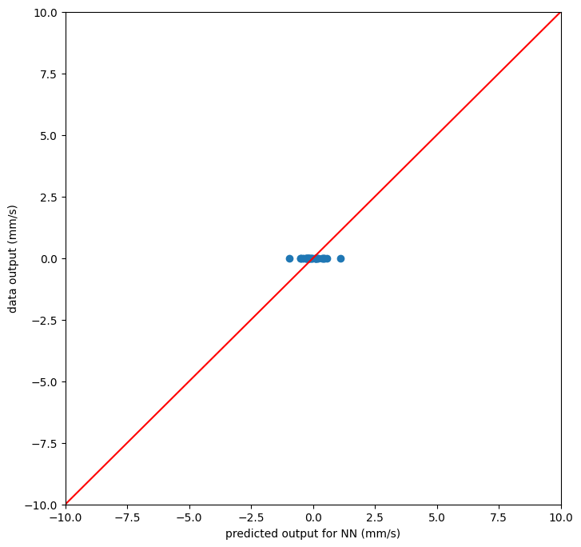
*Figure 11: Parity Plot for Rounded Channel*

The plots seem similar to the rectangular plots; however, on this plot there are noticeable discontinuities at the corners. This makes sense since the corners don't physically exist, so when trying to solve them, the model does not know what to do and diverges at the corners.

| Model | $q''\_{\text{long}}$ (kW/m²) | $q''\_{\text{short}}$ (kW/m²) | Peak $\|w\|$ (m/s) | $T\_{\min}$ (°C) |
|-------|------------------------------|-------------------------------|-------------------|-----------------|
| PINN – rectangular | 39.3 | 25.1 | 0.0792 | 32.27 |
| PINN – round | 38.8 | 25.0 | 0.0804 | 31.39 |

It can be seen that the mid-wall heat flux values along with the max and min velocity and temperature seem to relatively agree between the two models, with the rectangular channels showing slightly better heat transfer characteristics based on the slightly larger heat flux values.

### Task III Results and Discussion

We use a finite one-sided first-order difference between each wall node and the first interior node ($\Delta n = 5.0\times10^{-4}\ \text{m}$) to approximate the normal temperature gradient:

$$\left.\frac{\partial T}{\partial n}\right|\_{\text{wall}} = \frac{T\_{\text{int}}-T\_{\text{wall}}}{\Delta n}, \qquad q'' = -k\frac{\partial T}{\partial n}, \qquad k = 0.606\ \text{W/m}^{-1}\ °\text{C}^{-1}$$

**Rectangular Channel Corner Heat Flux:**

| Location (m) | $\Delta n$ (m) | $T\_{\text{wall}}$ (°C) | $T\_{\text{int}}$ (°C) | $\partial T/\partial n$ (°C/m) | $q''$ (kW/m²) |
|--------------|----------------|------------------------|------------------------|-------------------------------|---------------|
| (0.000, 0.0005) | $5.0\times10^{-4}$ | 89.984 | 78.127 | $-2.37\times10^{4}$ | 14.4 |
| (0.0005, 0.000) | $5.0\times10^{-4}$ | 90.010 | 78.127 | $-2.38\times10^{4}$ | 14.4 |

Away from the corner, mid-wall regions exhibit much steeper normal gradients (short wall $\sim 6.5\times10^{4}\ °\text{C/m}$, long wall $\sim 4.1\times10^{4}\ °\text{C/m}$), producing heat-flux densities of 39 and 25 kW/m², respectively. Approaching the corner the gradient drops to $\sim 2.4\times10^{4}\ °\text{C/m}$, so the flux is already down to $\approx 14\ \text{kW/m}^{2}$ one cell away. At the corner itself the wall normals are perpendicular; a vector normal to both faces must be the zero vector, forcing the normal component of the temperature gradient and thus the heat flux to vanish exactly at the corner.

**Rounded Channel Corner Heat Flux:**

| Location (m) | $\Delta n$ (m) | $T\_{\text{wall}}$ (°C) | $T\_{\text{int}}$ (°C) | $\partial T/\partial n$ (°C/m) | $q''$ (kW/m²) |
|--------------|----------------|------------------------|------------------------|-------------------------------|---------------|
| (0.0025, 0.005) | $5.0\times10^{-4}$ | 94.442 | 79.049 | $-3.08\times10^{4}$ | 18.7 |
| (0.003, 0.0045) | $5.0\times10^{-4}$ | 94.821 | 79.049 | $-3.15\times10^{4}$ | 19.1 |
| (0.003, 0.005) | $7.071\times10^{-4}$ | 103.858 | 79.049 | $-3.51\times10^{4}$ | 21.3 |

**Note:** The normal gradient at the bend was evaluated with $T\_{\text{wall}}(3.0\ \text{mm}, 5.0\ \text{mm})=103.86°\text{C}$ and the first interior point $T\_{\text{int}}(2.5\ \text{mm}, 4.5\ \text{mm})=79.05°\text{C}$ over a normal spacing $\Delta n = \sqrt{2}\times 0.5\ \text{mm}=0.7071\ \text{mm}=7.071\times 10^{-4}\ \text{m}$.

Based on these results, for two channels of the same nominal length and width, it can be reasonably determined that the **rectangular channel is better at transferring heat**. This can be physically seen by the table in Task II, where the rectangular channel has a greater heat flux and greater minimum interior temperature, meaning it has absorbed more heat from its surroundings. The reasons for this difference is because the rounded channels are actually better at transferring heat in the corners. It can be seen in the two tables in Task III that all values of the rounded geometry near the corner are greater than the rectangular, as the rectangular heat flux at the corner approaches 0. Because of this higher corner heat flux, the rounded geometry has a slightly less heat flux in the straight/middle sections of the walls when compared to rectangular. And because there are significantly more walls than there are corners, the rectangular geometry wins out in terms of being the better channel for facilitating heat transfer.

## Conclusion (Part 2)

The physics-informed neural network (PINN) and a high-resolution finite-difference model (FDM) were analyzed for fully developed laminar flow and conjugate heat transfer in three channel geometries. The PINN, trained on a coarse 1 mm collocation grid, reproduced the bulk velocity field but over-predicted wall heat flux by roughly an order of magnitude because it under-resolved the thermal boundary layer that the 0.1 mm FDM grid captured.

Filleting the rectangular corners by 1 mm redistributed heat-flux load from the long walls to the bends, raising local $q''$ near the fillet to about 21 kW/m²; however, the overall wall-integrated flux fell by $\sim$2% because the straight-wall area dominates. Peak axial velocity ($\approx$0.08 m/s) and minimum core temperature ($\approx$32°C) changed negligibly, indicating that bulk flow is insensitive to modest geometric smoothing.

In practical terms, a sharp-cornered rectangular channel maximizes total heat transfer for a given footprint: rounded corners slightly enhance local cooling at the bends but reduce flux along the much larger straight walls. Boosting PINN fidelity will require denser or adaptive collocation near walls, promising mesh-free flexibility without sacrificing quantitative accuracy.

---

## Code Appendix

### Part 1 Code (MATLAB)

```matlab
% Number of blocks
N = 100000;
% Limits of integration
lb = 0.01;
ub = 100;
% Step size and sample points
delta = (ub-lb) / N;
eta = lb:delta:ub;
% Integrand evaluated at each sample pt
f = eta.^(-2/3) ./ (1 + eta);
% Trapezoid Rule
I = 1/3 * (delta * (0.5*f(1) + sum(f(2:end-1)) + 0.5*f(end)));
fprintf('I approx %.6f\n', I);
```

### Part 2 PINN Code (Python)

<details>
<summary><strong>Click to expand full PINN code for Rectangular Channel</strong></summary>

```python
# CodeP3Pt2B.1PINNconvSp25.ipynb - V.P. Carey, ME250B Sp25
import keras
import pandas as pd
from keras.models import Sequential
import numpy as np
import keras.backend as kb
import tensorflow as tf
import os
os.environ['KMP_DUPLICATE_LIB_OK']='True'

# Create input data array
xdata = []
ND = 32
xdata = [[0.0, 0.0], [0.0, 0.5], [0.0, 1.0], [0.0, 1.5], [0.0, 2.0], [0.0, 2.5], [0.0, 3.0],
         [0.0, 3.5], [0.0, 4.0], [0.0, 4.5], [0.0, 5.0],
         [3.0, 0.0], [3.0, 0.5], [3.0, 1.0], [3.0, 1.5], [3.0, 2.0], [3.0, 2.5], [3.0, 3.0],
         [3.0, 3.5], [3.0, 4.0], [3.0, 4.5], [3.0, 5.0]]
xdata.append([0.5, 0.0])
xdata.append([1.0, 0.0])
xdata.append([1.5, 0.0])
xdata.append([2.0, 0.0])
xdata.append([2.5, 0.0])
xdata.append([0.5, 5.0])
xdata.append([1.0, 5.0])
xdata.append([1.5, 5.0])
xdata.append([2.0, 5.0])
xdata.append([2.5, 5.0])
xarray = np.array(xdata)

# Boundary values (w=0 mm/s, T=90°C)
ydata = [[0.0, 90.] for _ in range(32)]
yarray = np.array(ydata)

data_inputs = np.array(xdata)
data_outputs = np.array(ydata)

tf_tensor_inputs = tf.convert_to_tensor(data_inputs, dtype=tf.float32)
tf_tensor_outputs = tf.convert_to_tensor(data_outputs, dtype=tf.float32)

# Define neural network model
from tensorflow.keras.models import Sequential
from tensorflow.keras.layers import Dense

initializer = tf.keras.initializers.RandomUniform(minval=-2.9, maxval=2.9, seed=42)

model = Sequential([
    Dense(5, input_dim=2, activation='elu', kernel_initializer=initializer),
    Dense(12, activation='elu', kernel_initializer=initializer),
    Dense(8, activation='elu', kernel_initializer=initializer),
    Dense(2)
])

kappa = 1.3
x_max = 3.0
y_max = 5.0

# Custom loss function (abbreviated - see full report for complete implementation)
# ... (custom loss function implementation)

# Training
from tensorflow.keras.callbacks import Callback

class EpochTracker(Callback):
    def __init__(self, N_epInit):
        super().__init__()
        self.N_epInit = N_epInit
        self.epochs_trained = 0
    
    def on_epoch_end(self, epoch, logs=None):
        self.epochs_trained = epoch

epoch_tracker = EpochTracker(N_epInit=1)
# custom_loss = custom_loss_function(kappa=1.3, x_max=3.0, y_max=5.0, epoch_tracker=epoch_tracker)
# model.compile(optimizer='adam', loss=custom_loss)

# historyData = model.fit(tf_tensor_inputs, tf_tensor_outputs,
#                 epochs=2500, batch_size=32,
#                 callbacks=[epoch_tracker])
```

</details>

### Part 2 FDM Code (MATLAB - Project 1)

<details>
<summary><strong>Click to expand Gauss-Seidel Solver Code</strong></summary>

```matlab
% Gauss-Seidel Solver for Fully Developed Heat Transfer in a Rectangular Channel
clear; clc; close all

% Define constants and parameters
Nx = 30;  % Number of nodes in x direction
Ny = 50;  % Number of nodes in y direction
dx = 0.1e-3;  % Grid spacing in x (m)
dy = 0.1e-3;  % Grid spacing in y (m)
Tw = 90;       % Wall temperature (°C)
nu = 8.26e-7;  % Kinematic viscosity (m^2/s)
rho = 997;     % Density (kg/m^3)
alpha = 1.46e-7; % Thermal diffusivity (m^2/s)
cp = 4164;     % Specific heat (J/kg°C)
k = 0.606;     % Thermal conductivity (W/m°C)
dPdz = -80 * nu * rho * 1000;  % Pressure gradient (Pa/m)
dTmdz = alpha * 0.103 * 1e9;   % Mean temperature gradient (°C/m)

% Convergence criteria
epsilon_w = 0.0001;
epsilon_T = 0.05;

% Initialize fields
w = zeros(Nx, Ny);
T = 70 * ones(Nx, Ny);
T(1,:) = Tw; T(Nx,:) = Tw; T(:,1) = Tw; T(:,Ny) = Tw;

% Gauss-Seidel iterations for velocity field
converged_w = false;
while ~converged_w
    max_change_w = 0;
    for i = 2:Nx-1
        for j = 2:Ny-1
            w_new = ((dy/dx)^2 * (w(i+1,j) + w(i-1,j)) + w(i,j+1) + w(i,j-1)) / ...
                    (2*(dy/dx)^2 + 2) - (dPdz * dy^2) / (rho * nu * (2*(dy/dx)^2 + 2));
            max_change_w = max(max_change_w, abs(w_new - w(i,j)));
            w(i,j) = w_new;
        end
    end
    if max_change_w < epsilon_w
        converged_w = true;
    end
end

% Gauss-Seidel iterations for temperature field
converged_T = false;
while ~converged_T
    max_change_T = 0;
    for i = 2:Nx-1
        for j = 2:Ny-1
            T_new = ((dy/dx)^2 * (T(i+1,j) + T(i-1,j)) + T(i,j+1) + T(i,j-1)) / ...
                    (2*(dy/dx)^2 + 2) - (w(i,j) * dTmdz * dy^2) / (alpha * (2*(dy/dx)^2 + 2));
            max_change_T = max(max_change_T, abs(T_new - T(i,j)));
            T(i,j) = T_new;
        end
    end
    if max_change_T < epsilon_T
        converged_T = true;
    end
end

% Post-processing and visualization
[x_grid, y_grid] = meshgrid(linspace(0, Nx*dx, Nx), linspace(0, Ny*dy, Ny));
figure; mesh(x_grid, y_grid, w'); title('Velocity Field w (m/s)');
figure; mesh(x_grid, y_grid, T'); title('Temperature Field T (°C)');
```

</details>

