## Project Summary

### The Objective

The objective of this project was to fabricate a unique design of a wind turbine to 3D print and test under certain conditions. The main tasks consisted of researching and sketching a design for the blade and tower parts of the wind turbine to ensure optimal performance. Once the final design was decided we used SolidWorks to create the CAD models to 3D print. We had specific restrictions regarding the platform dimension, height, and volume limitations which we worked around. The ultimate goal was to **maximize power and stiffness efficiency**.

### Summary of Performance Data

We created a tower with radially symmetric pedals and an internal truss system which helped support the structure of the tower to maximize stiffness all while minimizing its mass. The tower also meets predefined requirements of sitting on a 12×12 in platform base and has a volume of 17.59 cubic inches. The total height of the tower is 16 inches and the tower net weight is 283.6 grams. The blade design focused on maximizing lift-to-drag ratio which is why we chose 3 blades and an angle of twist of 15 degrees.

| Metric | Value |
|:-------|:------|
| Maximum Power | 1950 mW |
| Computed Stiffness | 4.71 N/mm |
| Tower Height | 16 inches |
| Tower Weight | 283.6 grams |
| Tower Volume | 17.59 in³ |
| Number of Blades | 3 |
| Angle of Twist | 15° |

### Results

Ultimately, we were successful at meeting our goals of designing a wind turbine which had optimal maximum power and stiffness performance. We faced a few challenges when it came to designing a strong tower while maintaining a low mass. We eventually altered our entire design to meet our goals and ensure the most efficient performance. Through our tests we found that as we increased the load, deflection also increased—the slope of this proportional relationship is our maximum stiffness. We found a similar relationship between the current and power until we peaked at our maximum power of 1950 mW and began decreasing afterwards. Thus, our final design met our aim of creating a power-efficient wind turbine which can withstand strong external forces.

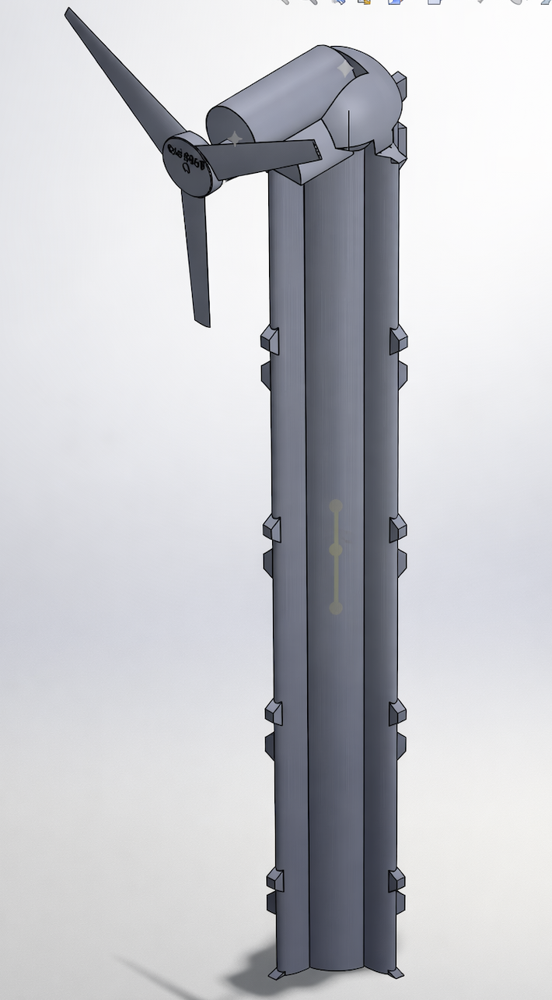
*Figure 1: Final Wind Turbine CAD Design*

---

## Introduction

Over the course of history, there have been many methods for converting energy into different types of energy, like waterwheels, solar panels, and batteries. In modern times, devices for harnessing different forms of energy for conversion into electrical energy are particularly of interest. One such device that is commonly used today is the wind turbine.

The wind turbine dates back to at least the first century BCE, when the Greek engineer Hero of Alexandria is believed to have designed the first wind wheel to power a machine. Over time, wind wheels became more common, and were used to grind grains or move water. In the late 1800s, the first instance of wind turbines being used to produce electricity was recorded. By the early 1900s wind turbines were a common source of electrical energy in some parts of the world, including the United States, and have been widely used for various purposes since then.

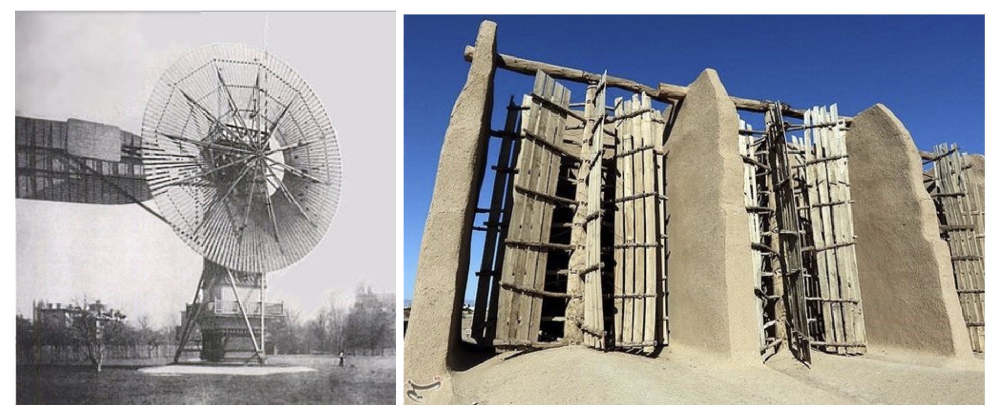
*Left: First automatically operated wind turbine | Right: Ancient wind wheels in Iran*

Wind turbines are a source of renewable energy that convert the kinetic energy of wind into electrical energy, which is then used for a variety of purposes from powering vehicles to neighborhoods. Since wind turbines are used in different locations all over the world for many different purposes, there are numerous wind turbine designs that cater to the diverse applications that they have.

### Types of Wind Turbines

- **Horizontal axis land turbine** — Most common design with blades rotating around a horizontal axis
- **Vertical axis land turbine** — Blades rotate around a vertical axis, omnidirectional
- **Horizontal axis offshore turbine** — Larger scale turbines designed for marine environments

### Wind Turbine Components

A wind turbine generally consists of four parts:

1. **Foundation** — A solid structure, usually located underground, meant to keep the turbine stable
2. **Tower** — Extends from the foundation up to an altitude of desirable wind speed and holds up the nacelle and rotor
3. **Nacelle** — Connected to the tower and contains gears and a generator that convert kinetic energy to electrical energy
4. **Rotor Blades and Hub** — The rotor hub attaches to the nacelle and the rotor blades extend from it, spinning as wind hits them

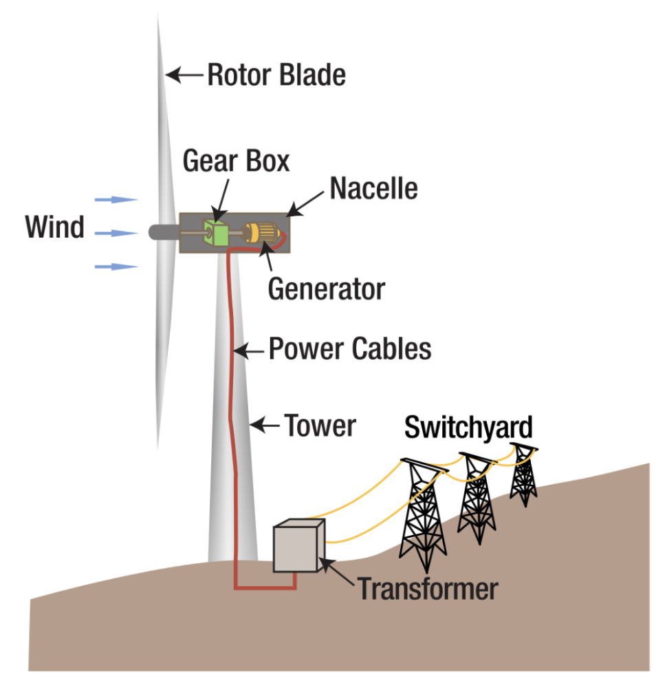
*Figure 2: Parts of a wind turbine*

### Project Goals

In this project, we were tasked with designing, printing, and testing a wind turbine. Given several constraints, we had to:

1. Make freehand sketch concepts of the blade and tower
2. Pick the best of each and use SolidWorks CAD software to design the components
3. Use the Simulation feature in SolidWorks to test the tower's stiffness
4. Print and assemble the turbine's parts
5. Test the final wind turbine's power output and tower stiffness

**Target specifications:**
- Power output: ≥ 2 Watts
- Tower stiffness: ≥ 8 N/mm
- Net weight: < 350 grams

---

## Design

This section analyzes the design choices of the 2 main components of the wind turbine: the blade and the body. This includes relevant sketches, freehand drawings, finite element analysis (FEA) simulations, and mass properties.

### Blade Design

#### Design Goals

The aim of the blade was to generate the most amount of power given dimension constraints. We needed to research a blade profile, angle of attack, angle of twist, and number of blades to optimize weight and power.

#### Blade Profile: NACA 4415

The blade profile chosen was the **NACA 4415** airfoil, selected for its favorable lift-to-drag characteristics.

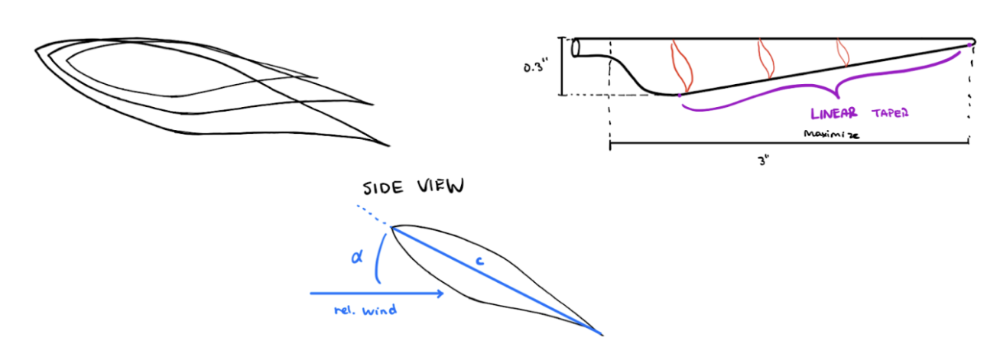
*Figure 3: Freehand Sketch Profile*

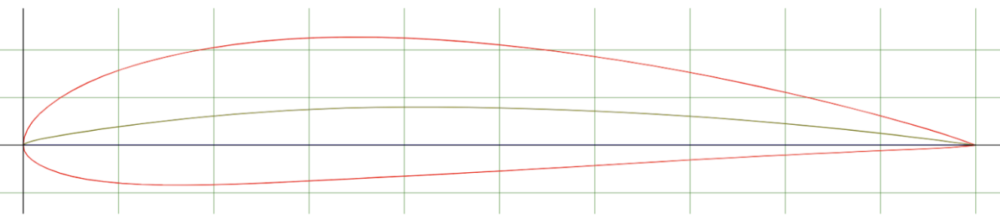
*Figure 4: NACA 4415 side airfoil profile*

#### Number of Blades Analysis

The amount of blades that a wind turbine has relates directly to the amount of energy that it can generate. It is usually best to include "an odd number of blades" (Youssefi) as even numbers cause stability issues.

| Blades | Analysis |
|:------:|:---------|
| 1 | Could cause instability |
| 2 | Fair energy yield, but prone to "gyroscopic precession" (TU Delft), causing tendency to yaw. Requires higher rotational speed |
| **3** | **"Polar moment of inertia with respect to yawing is constant" (TU Delft), contributing to smooth rotation** |
| >3 | Creates wind resistance, slowing energy production. Each additional blade only contributes ~3% efficiency (Kerrigan) |

**Conclusion:** 3 blades is optimal for this wind turbine design. This also conserves volume for a sturdier base.

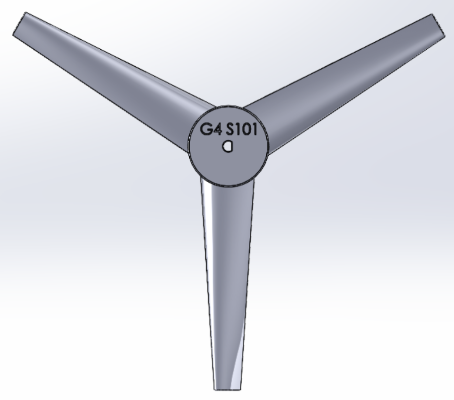
*Figure 5: Top View showing 3-blade configuration*

#### Angle of Attack and Twist

The most efficient angle of attack is the point at which $C_L/C_D$ is at a maximum. This value is roughly **10°–15°** for most blades (NMSEA).

Since local wind speed and angle vary along the length of the blade, we need to change the twist of the blade so that each cross section can hit the relative wind at the optimal angle of attack. According to Herr et al., the blade should "include a total backward twist between 6°–15°."

We chose **15° twist** as there is not much drag in our model, allowing for more optimal operations at higher twist angles.

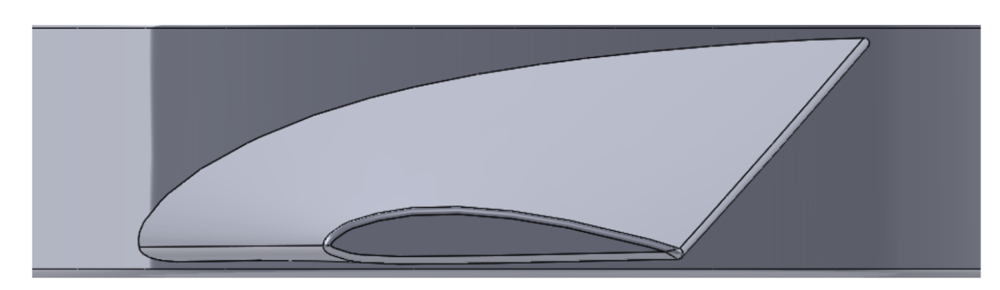
*Figure 6: Side Profile of Blade showing twist*

#### CAD Implementation

When designing the blade in SolidWorks, the main tools used were:
- **Loft** — To create the 3D blade shape from profiles
- **Spline** — Following the NACA 4415 airfoil shape
- **Fillet** — To smooth edges for 3D printing
- **Derived Sketch** — For profile transformations

The main profile at the hub was rotated and extended 2.75 in. away from the first profile to meet the 6 in. diameter constraint. The profiles were then lofted and edges smoothed using the fillet tool.

**Blade Mass Properties (from SolidWorks):**

| Property | Value |
|:---------|:------|
| Density | 0.04 lb/in³ |
| Mass | 0.01 lb (4.5 g) |
| Volume | 0.41 in³ |
| Surface Area | 10.24 in² |

| Center of Mass | Value (inches) |
|:---------------|:--------------:|
| X | 0.00 |
| Y | 0.11 |
| Z | 0.00 |

---

### Tower (Body) Design

#### Design Goals

Our goal was to minimize deflection when a force in the axis of the propeller was applied while also minimizing weight.

#### Initial Concept

The original idea was an I-beam like structure due to its high moment of inertia and ability to take large bending moments, as the moment arm was going to be quite large compared to the beam thickness.

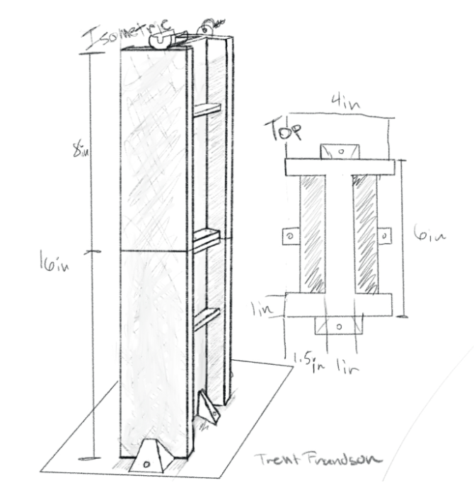
*Figure 8: Original Tower Concept*

This design was scrapped after further evaluation:
- Project required a radially symmetrical design
- When modeled, the weight was extremely high

#### Final Design: Truss System

To reduce mass while maximizing stiffness, a **truss system** was chosen. This approach:
- Maximizes length-to-depth ratio (moment of inertia scales with depth³)
- Reduces weight by eliminating solid material
- Uses triangular structures for stability

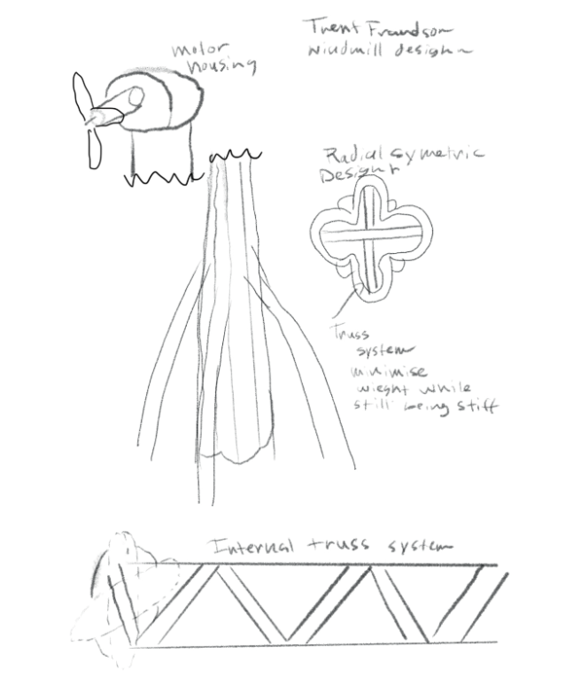
*Figure 9: Revised design with internal truss system and radially symmetric pedals*

#### CAD Implementation

When modeling the tower, the major tool used was the **extrusion tool**:

1. Thin circular walls drawn on the x-y plane, extruded 16 in. in the z-direction
2. X-z plane added for the truss system drawing
3. Truss extruded bilaterally for centering
4. Truss mirrored along x-y axis (90° rotation) creating internal cross truss system
5. Fine-tuning to stay under weight limits while maximizing depth in force direction

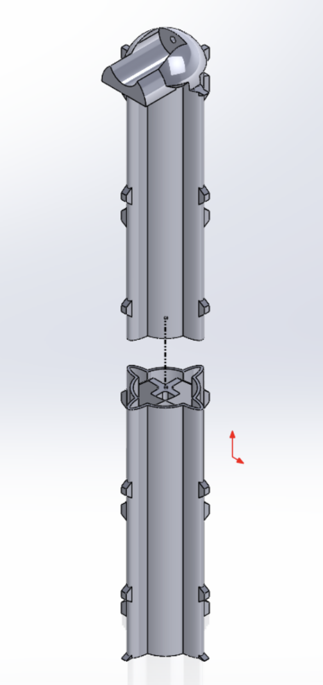
*Figure 10: Exploded View of Tower Assembly*

*Figure 11: Section view showing internal truss system*

**Tower Mass Properties (from SolidWorks):**

| Property | Value |
|:---------|:------|
| Density | 0.04 lb/in³ |
| Mass | 0.64 lb (290.3 g) |
| Volume | 17.59 in³ |
| Surface Area | 332.99 in² |

| Center of Mass | Value (inches) |
|:---------------|:--------------:|
| X | -0.01 |
| Y | 1.01 |
| Z | 0.01 |

**Principal Moments of Inertia** (lb·in²):

| Axis | Direction | Moment |
|:----:|:----------|:------:|
| Ix | (0.00, 1.00, 0.00) | 0.52 |
| Iy | (0.01, 0.00, 1.00) | 16.21 |
| Iz | (1.00, 0.00, -0.01) | 16.23 |

**Moments of Inertia at Center of Mass** (lb·in²):

|  | xx | xy | xz |
|:-:|:--:|:--:|:--:|
| **Lxx** | 16.23 | -0.02 | 0.00 |
| **Lyx** | -0.02 | 0.52 | 0.06 |
| **Lzx** | 0.00 | 0.06 | 16.21 |

#### Finite Element Analysis (FEA)

SimulationXpress in SolidWorks was used to optimize and determine the stiffness of the tower:

1. **Fixtures:** Base of the model fixed
2. **Load:** 5 pounds applied to inner face of motor housing
3. **Mesh:** Tower meshed (small hole for i-bolt removed for proper meshing)
4. **Analysis:** Von Mises stress, displacement, and factor of safety calculated

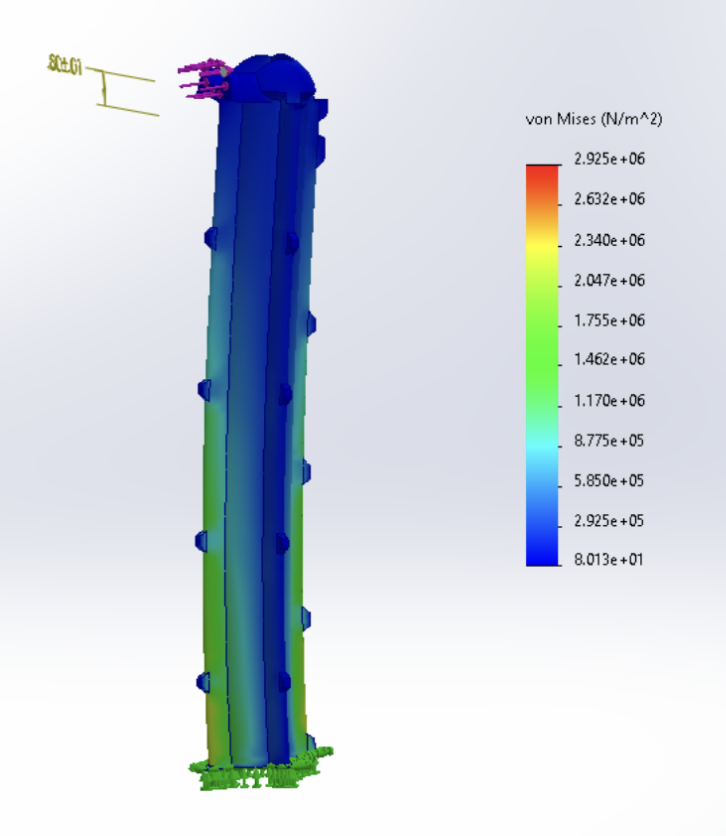
*Figure 13: Von Mises stress distribution*

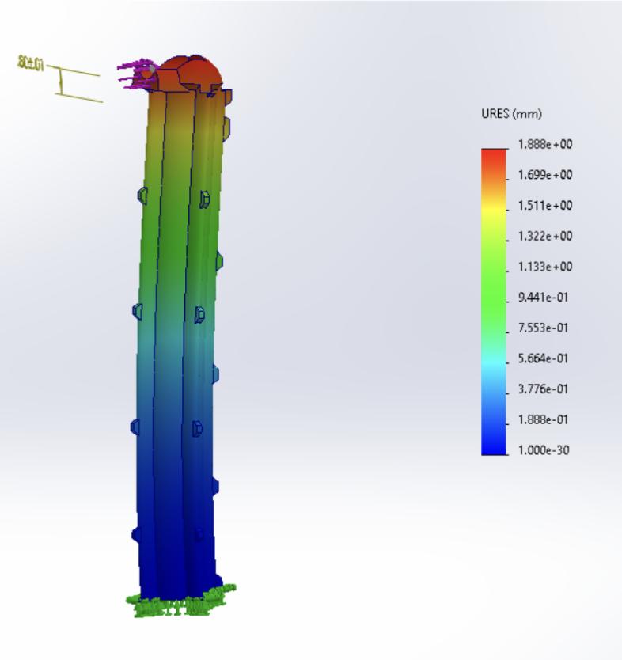
*Figure 14: Displacement in mm*

**FEA Results:**
- Maximum von Mises stress: $2.925 \times 10^6$ N/m²
- Minimum von Mises stress: 8.013 N/m²
- Maximum displacement: 1.88 mm (at top of tower)
- The von Mises stress never exceeded yield value of ABS plastic, confirming the 5 lb load did not structurally harm the tower

---

## CAD Drawings

*Figure 15: 3D Wind Turbine Drawing (isometric view)*

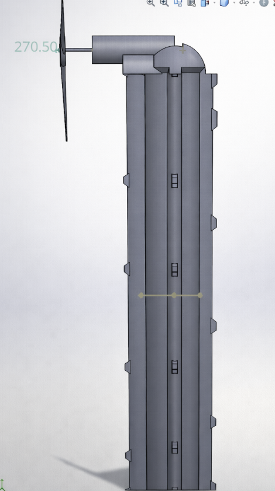
*Figure 16: Side view*

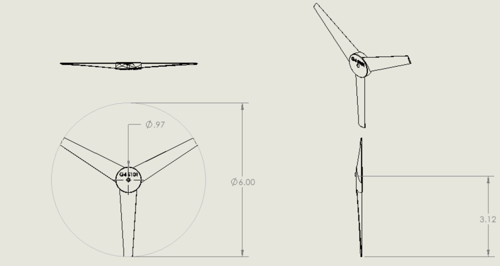
*Figure 19: Propeller 2D Drawing*

---

## Test and Results

### Test 1: Stiffness

**Procedure:**
1. Wind turbine is secured and screwed into the platform
2. A pulley with a string is fixed to the mechanism
3. Normalize the dial indicator and set to zero
4. Gradually add 0.1 kg weights to the string and record the deflection

**Table 1: Load and Deflection Data**

| Load (kg) | Load (N) | Deflection (mm) |
|:---------:|:--------:|:---------------:|
| 0.1 | 0.98 | 0.02 |
| 0.2 | 1.96 | 0.08 |
| 0.3 | 2.94 | 0.17 |
| 0.4 | 3.92 | 0.31 |
| 0.5 | 4.90 | 0.46 |
| 0.6 | 5.88 | 0.69 |
| 0.7 | 6.86 | 0.86 |
| 0.8 | 7.84 | 1.11 |
| 0.9 | 8.82 | 1.35 |
| 1.0 | 9.80 | 1.59 |
| 2.0 | 19.6 | 3.60 |
| 3.0 | 29.4 | 5.12 |
| 4.0 | 39.2 | 8.25 |

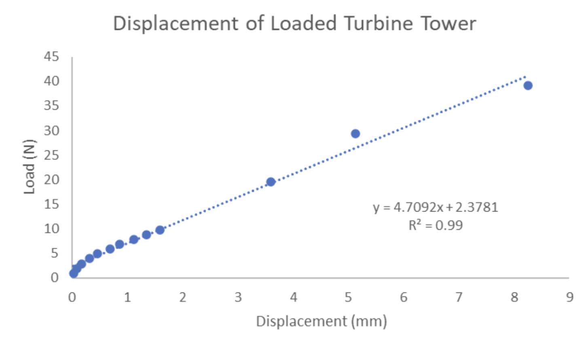
*Graph 1: Displacement of loaded Turbine Tower*

The stiffness value is equal to the slope of the regression line. Therefore, the **stiffness of the tower is 4.71 N/mm**. The R² value of 0.99 indicates the regression line accounts for 99% of the variance in our data.

---

### Test 2: Power Generation

**Procedure:**
1. Wind turbine secured to platform with blower positioned at 25.0 mph
2. While blower is off, generator and load box connected
3. Potentiometer zeroed and blower turned on
4. Potentiometer turned clockwise incrementally until maximum power determined
5. Voltage, power, current, and blade speed recorded

**Table 2: Voltage, Current, Power, and Blade Speed**

| Voltage (V) | Current (mA) | Power (mW) | Blade Speed (rpm) |
|:-----------:|:------------:|:----------:|:-----------------:|
| 5.10 | 88.0 | 450 | 7620 |
| 4.90 | 120.0 | 600 | 7500 |
| 4.85 | 155.2 | 750 | 7350 |
| 4.74 | 190.0 | 900 | 7200 |
| 4.55 | 226.5 | 1050 | 7100 |
| 4.45 | 269.5 | 1200 | 7000 |
| 4.20 | 320.1 | 1350 | 6750 |
| 4.00 | 376.8 | 1500 | 6600 |
| 3.75 | 438.5 | 1650 | 6350 |
| 3.50 | 510.6 | 1800 | 6000 |
| **2.90** | **640.0** | **1950** | **5400** |
| 2.24 | 737.4 | 1650 | 4550 |
| 1.97 | 741.2 | 1400 | 4200 |

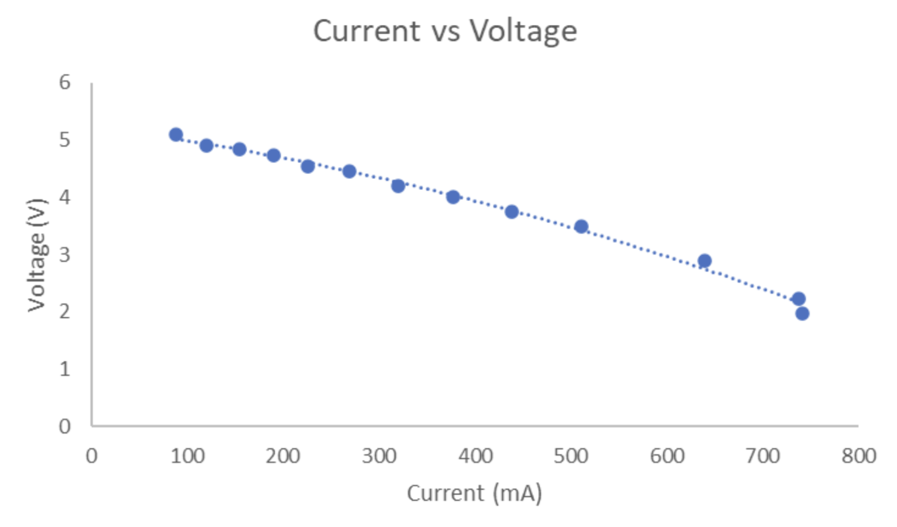
*Graph 2: Current vs. Voltage*

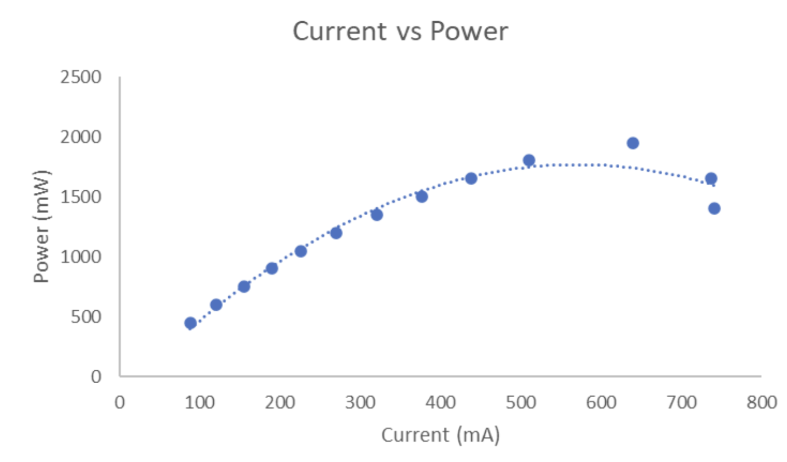
*Graph 3: Current vs. Power*

Looking at Graph 3, our data followed a parabolic shape with an exponential drop after the maximum power was reached. The **maximum power of our wind turbine was 1950 mW**, making us the **top placing group out of 200 students** in power generation.

---

### Efficiency Computation

Using the power equation:

$$P = \frac{1}{2}\rho A V^3$$

Where:
- $\rho$ = 1.2 kg/m³ (density of air)
- $V$ = 25.0 mph = 11.2 m/s (velocity of air)
- $A$ = blade coverage area = $\pi r^2$ = $\pi (3\text{ in})^2$ = 28.3 in² = 0.0183 m²

**Theoretical Power:**
$$P = \frac{1}{2}(1.2)(0.0183)(11.2)^3 = 15.4 \text{ W}$$

**Efficiency:**

$$\eta = \frac{P\_{\text{actual}}}{P\_{\text{theoretical}}} = \frac{1.95}{15.4} = 0.127 = \mathbf{12.7\\%}$$

---

## Conclusions

In this project, we were able to design a wind turbine that met the project requirements:

- **3 blades** optimized volume and rotation
- **15° angle of attack** reduced drag
- **Internal truss system** maximized length-to-depth ratio while reducing mass
- **Triangular structure** improved stiffness

**Final Specifications:**

| Parameter | Value |
|:----------|:------|
| Tower Height | 16 inches |
| Tower Weight | 283.6 g |
| Base Volume | ~17.59 in³ |
| Stiffness | 4.71 N/mm |
| Maximum Power | 1950 mW |
| Efficiency | 12.7% |

The turbine we designed yielded around 12.7% efficiency, which is relatively low compared to most real turbines working at 20–40% efficiency (DOE). The lower efficiency can be attributed to the constraints and scale of our design.

---

## Recommendations

Despite our turbine performing well through physical tests, several improvements could be made:

1. **Weight Optimization** — The turbine was relatively heavy; the motor housing could have been shelled out to reduce overall weight
2. **Mass Redistribution** — Weight reduction in inefficient areas would allow for relocation of mass to force-bearing components
3. **Motor Mounting** — A dedicated hole for the motor would improve assembly (a zip tie was needed during testing)
4. **Streamlined Design** — A sleeker, less bulky tower design could improve aerodynamics and aesthetics

---

## References

1. Aerodynamics of wind turbine blades - NM MESA. https://www.nmmesa.org/wp-content/uploads/2019/10/Aerodynamics-of-Wind-Turbine-Blades.pdf

2. Airfoil Tools. NACA 4415 (NACA4415-IL). http://airfoiltools.com/airfoil/details?airfoil=naca4415-il

3. Andrew, J. M. (2022, July 27). Wind Systems Magazine. https://www.windsystemsmag.com/fundamentals-of-wind-turbines/

4. Herr, S., Kirtley, K. R., Kinzie, K. W., & Gerber, B. S. (2013). Wind Turbine Blades with Twisted and Tapered Tips. US Patent US8419371.

5. How do wind turbines work? Energy.gov. https://www.energy.gov/eere/wind/how-do-wind-turbines-work

6. Kerrigan, S. (2018, March 28). The scientific reason why wind turbines have 3 blades. Interesting Engineering. https://interestingengineering.com/science/the-scientific-reason-why-wind-turbines-have-3-blades

7. Marshall L. Buhl, J. S809 airfoil shape. NWTC Information Portal. https://wind.nrel.gov/airfoils/shapes/s809_shape.html

8. Shahan, Z. (2019, September 9). History of wind turbines. Renewable Energy World. https://www.renewableenergyworld.com/storage/history-of-wind-turbines/

9. U.S. Department of Energy (DOE). Energy Efficiency and Renewable Energy. Wind and Hydropower Technologies Program. http://www.eere.energy.gov/windandhydro/wind_how.html

10. Youssefi, K. ENGIN26 Lecture 6: Wind Turbine Aerodynamics. UC Berkeley.

