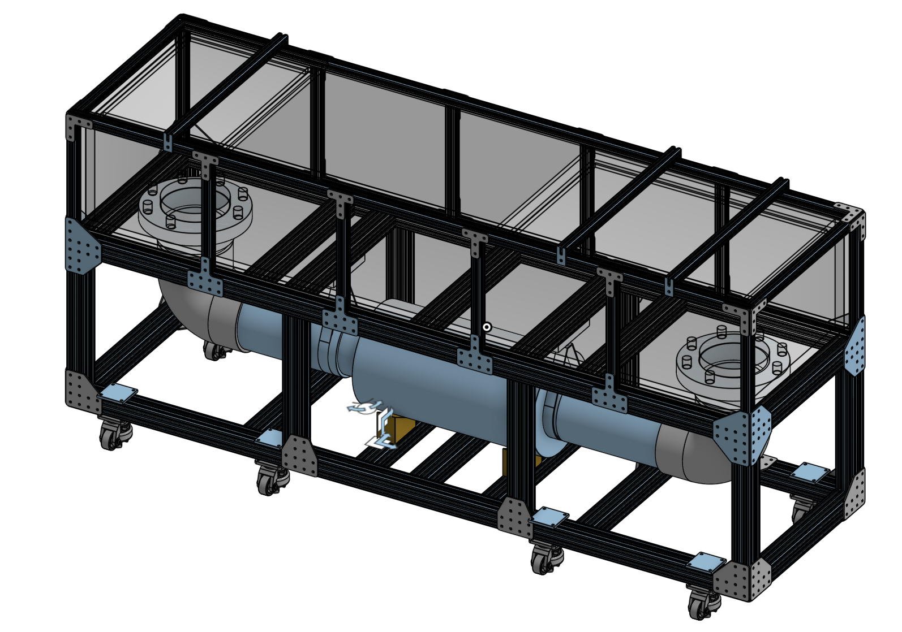
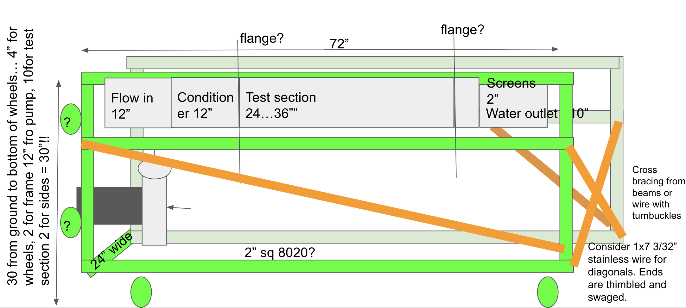
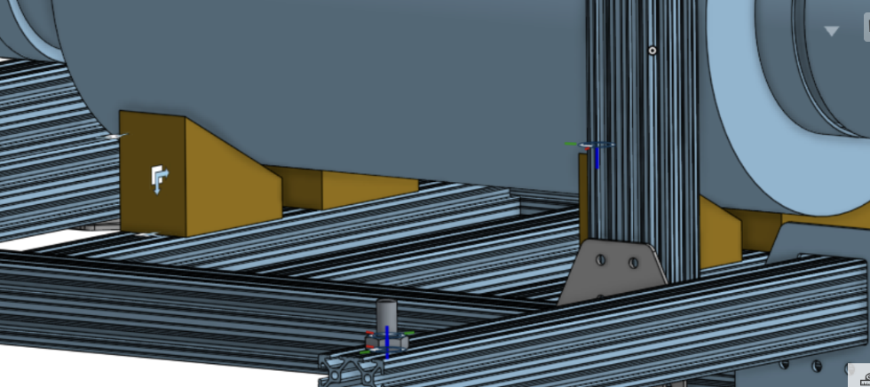
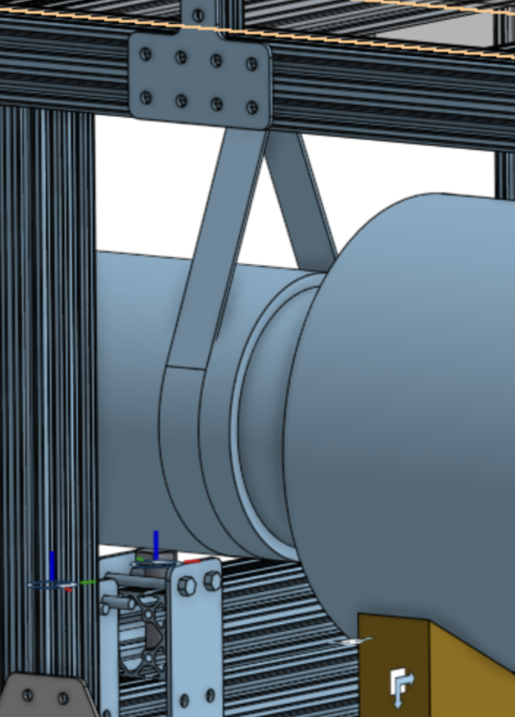
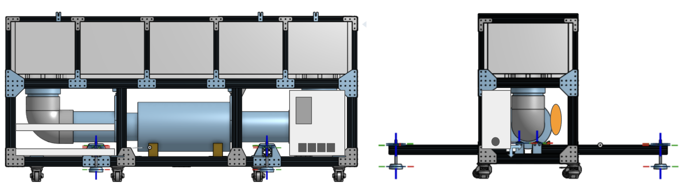
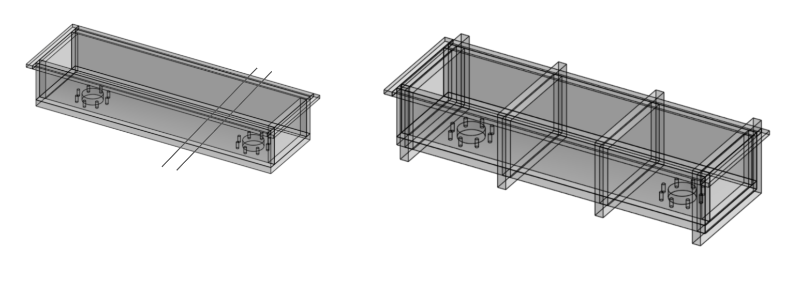
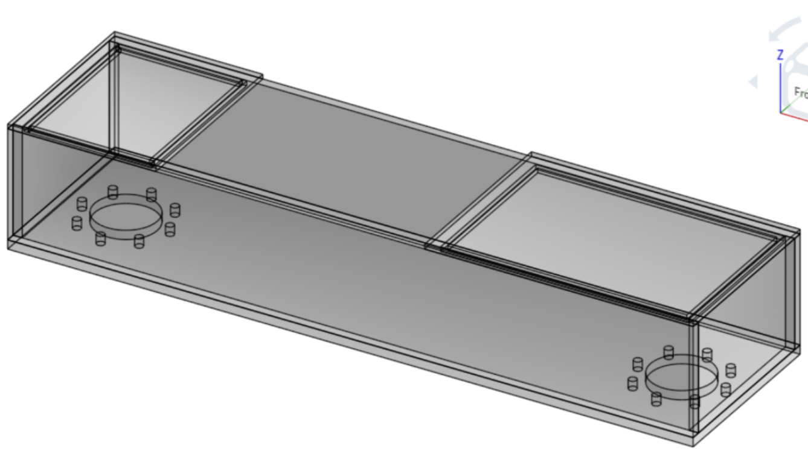
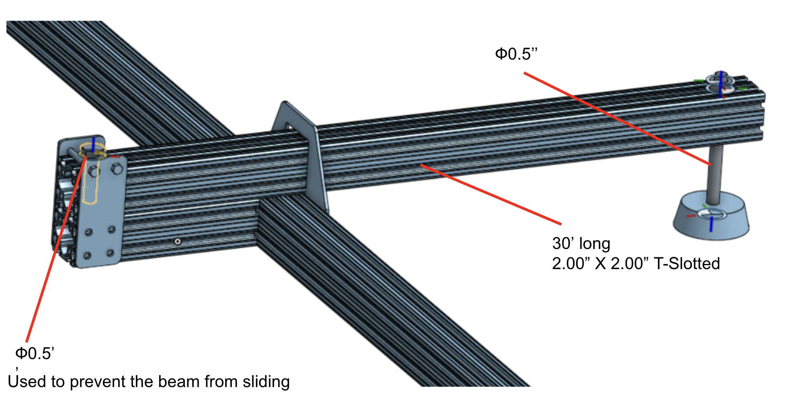
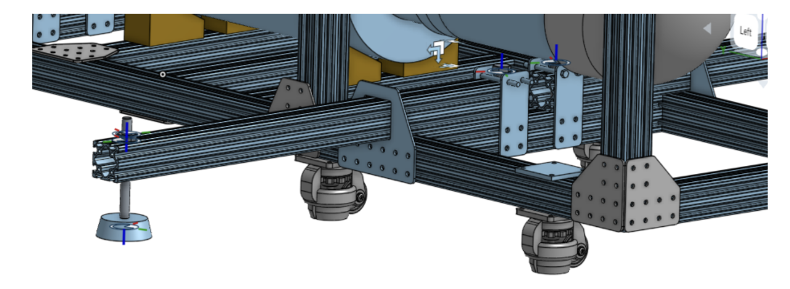

## Summary

The FLOW Lab Research project focuses on the design and development of an interactive fluid dynamics exhibit that demonstrates fundamental principles of fluid mechanics through hands-on experimentation. The exhibit features a recirculating flow loop with adjustable flow rates, multiple measurement capabilities, and educational demonstrations of fluid forces, flow patterns, and hydrodynamic principles.

The project encompasses mechanical design, material selection, fabrication techniques, and integration of measurement systems to create an engaging, educational, and durable exhibit suitable for public display.

A full CAD model is shown below.

### Key Technical Challenges
- **Flow Uniformity**: Achieving consistent velocity profiles across the test section
- **Force Measurement**: Developing accurate, real-time measurement systems for educational use
- **Safety Integration**: Ensuring public safety while maintaining interactive features
- **Scalability**: Designing for both educational effectiveness and transportability

### Engineering Disciplines Involved
- **Fluid Mechanics**: Flow analysis, pressure drop calculations, Froude scaling
- **Mechanical Design**: Structural integrity, vibration isolation, material selection
- **Electrical Engineering**: Motor control, safety systems, data acquisition
- **Systems Integration**: Sensor calibration, control algorithms, user interface design

## 1. Project Overview

### 1.1 Project Scope

The FLOW Lab fluid dynamics exhibit is designed to provide an interactive educational experience that allows visitors to explore fundamental fluid mechanics concepts. The exhibit includes:

- **Flow Visualization**: Transparent walls for observing flow patterns
- **Force Measurement**: Systems to measure forces on submerged objects
- **Interactive Elements**: Hand-held shapes and adjustable configurations
- **Flow Control**: Variable speed pump system with safety enclosures
- **Educational Components**: Demonstrations of laminar vs turbulent flow, wave patterns, and hydrodynamic forces

### 1.2 Design Philosophy

The exhibit design prioritizes several key engineering principles that balance functionality, safety, and educational effectiveness:

#### Safety-First Approach
- **Risk Assessment**: Comprehensive analysis of potential hazards including electrical shock, water exposure, and structural failure
- **Fail-Safe Design**: Multiple layers of protection including emergency shutoffs, ground fault circuit interrupters (GFCI), and mechanical safeguards
- **OSHA Compliance**: Adherence to Occupational Safety and Health Administration guidelines for equipment handling and public interaction

#### Educational Engineering
- **Progressive Disclosure**: Information presented at multiple levels - from basic observation to advanced quantitative analysis
- **Hands-On Learning**: Direct physical interaction with fluid forces to build intuitive understanding
- **Real-World Applications**: Demonstrations connected to practical engineering problems in boating, aerodynamics, and fluid systems

#### Sustainable Design
- **Modular Construction**: Components designed for easy replacement and upgrade
- **Energy Efficiency**: Optimized pump selection and variable speed control to minimize power consumption
- **Material Longevity**: Corrosion-resistant materials and wear-resistant components for extended service life

#### User-Centered Design
- **Accessibility**: Controls and displays positioned for various user heights and abilities
- **Intuitive Operation**: Clear labeling and logical control sequences
- **Maintenance-Friendly**: Accessible components and diagnostic systems for efficient upkeep

## 2. Exhibit Goals

The Flow Loop Exhibit is designed to be:

### 2.1 Engagement Features
- **Interactive Design**: Hands-on experimentation with flow parameters
- **Visual Appeal**: Clear visualization of flow patterns and forces
- **Educational**: Demonstrates real-world fluid mechanics applications

### 2.2 Measurement Capabilities
- **Absolute Force Measurement**: Direct measurement of forces on floating and submerged shapes
- **Relative Force Measurement**: Comparison of forces between different configurations
- **Inline and Transverse Forces**: Measurement in multiple directions relative to flow
- **Flow Speed Measurement**: Real-time velocity monitoring

### 2.3 Interactive Elements
- **Direct Flow Experience**: Ability to feel forces through hand exposure or hand-held shapes
- **Shape Assembly**: Tools for visitors to create custom test shapes
- **Flow Enhancement**: Methods to visualize wave patterns and flow structures

### 2.4 Educational Connectivity
- **Boat and Sailing Applications**: Demonstrations of hull forces and stability
- **Flow Pattern Analysis**: Visualization of wakes, interference patterns, and boundary layers

## 3. Design Constraints

### 3.1 Safety Requirements
- All components designed to prevent injury
- Electrical systems with proper grounding and GFCI protection
- Structural integrity for public use
- Emergency shutoff mechanisms

### 3.2 Physical Constraints
- **Dimensions**: Must fit within specified volume (L × H × W, TBD)
- **Weight**: Transportable by two people (under 100 lbs total, per OSHA guidelines)
- **Materials**: Durable construction with replaceable components

### 3.3 Performance Specifications
- **Flow Rate**: Adjustable from 0.05 to 0.50 m/s
- **Uniformity**: Consistent flow across test section
- **Noise Level**: Below specified dB limits
- **Power**: 115VAC, 1HP, 15A maximum

### 3.4 Cost and Budget
- **Total Cost**: Under specified budget (TBD)
- **Component Selection**: Cost-effective materials without compromising functionality

## 4. Technical Specifications

### 4.1 Test Section Design

**Dimensions**: 18" wide × 24" long × 6-10" deep (plus side walls)

The test section dimensions were carefully selected based on multiple engineering considerations:

#### Hydraulic Considerations
- **Aspect Ratio**: 18" width provides adequate span for demonstrating transverse effects while maintaining reasonable flow requirements
- **Length**: 24" allows sufficient development length for boundary layer growth and wake studies
- **Depth**: Variable 6-10" accommodates different experimental setups and water level adjustments

#### Flow Parameters
- **Velocity Range**: 0.05 - 0.50 m/s spans from creeping flow to moderate turbulence, suitable for educational demonstrations
- **Reynolds Number Analysis**: For water at 20°C, Re = ρVD/μ ranges from ~3,000 to ~30,000, covering laminar-to-turbulent transition regimes

#### Froude Number Scaling
The Froude number (Fr = V/√(g×d)) compares inertial forces to gravitational forces and is crucial for free-surface flows:

**Fr = V/√(g×d) ≈ 0.3 < 1**

This sub-critical flow condition ensures:
- Stable free surface without excessive wave generation
- Controlled experimental conditions
- Safe operation without risk of fluid ejection

#### Flow Rate Calculations
**Cross-sectional Area**: A = 18" × 10" = 180 in² = 1.167 ft² = 0.1087 m²

**Maximum Flow Rate**: Q = V × A = 0.5 m/s × 0.1087 m² = 0.05435 m³/s = 1,441 L/min = 381 GPM

**Practical Considerations**: The system is designed for 942 GPM to account for:
- Pump inefficiencies and system losses
- Safety margins for flow control
- Realistic power requirements within 15A circuit limits

### 4.2 Pump System

The pump system represents the heart of the flow loop, requiring careful selection to meet both performance and practical constraints:

#### Hydraulic Requirements
- **Head Capacity**: ~10 ft (~3m) total dynamic head accounts for:
  - Static lift: Vertical distance from pump to water surface
  - Friction losses: Pipe friction, fittings, and flow straighteners
  - Minor losses: Elbows, valves, and flow disturbances
- **Flow Range**: 450-950 GPM provides flexibility for different demonstration scenarios
- **Efficiency**: Target >60% to minimize energy consumption and heat generation

#### System Head Calculation
Total system head (H_total) includes:
- **Static Head**: Height difference between pump and discharge point
- **Friction Head**: $H_f = f × (L/D) × (V^2/2g)$ where f is friction factor
- **Velocity Head**: $H_v = V^2/2g$ (typically small)
- **Minor Losses**: $K × V^2/2g$ where K accounts for fittings and transitions

For our system: $H_total\approx$ 3m (10 ft) provides adequate capacity while maintaining reasonable power requirements.

#### Pump Selection Criteria
- **Centrifugal Design**: Preferred for constant head applications and smooth flow characteristics
- **Stainless Steel Construction**: Corrosion resistance for water service and longevity
- **Sealed Bearings**: Protection against water ingress and vibration
- **Low NPSH**: Net Positive Suction Head requirements to prevent cavitation

#### Variable Frequency Drive (VFD)
- **Speed Control**: Precise flow adjustment from 0.05 to 0.5 m/s
- **Soft Start**: Reduces mechanical stress and water hammer effects
- **Energy Efficiency**: Power consumption proportional to flow³ for centrifugal pumps
- **Electrical Safety**: 115VAC, 15A service with built-in overload protection

#### Power Analysis
**Pump Power**: $P = \rho gQH/\eta$ where $\eta \approx 0.6$(pump efficiency)

For $Q = 0.054$ m³/s, $H = 3$m, $\rho = 1000$ kg/m³, $g = 9.81$ m/s²:
$P = 1000 \times 9.81 \times 0.054 \times 3 / 0.6 \approx 2.65$ kW $\approx 3.55$ HP

**Electrical Requirements**: 15A at 115VAC provides ~1.7 kVA, sufficient for the 3.55 HP motor with service factor.

### 4.3 Materials and Construction

#### Frame Design
- **8020 Extrusion System**: Modular aluminum framing
- **Dimensions**: 30" wide × 76" tall × appropriate depth
- **Cross Members**: Added support for 550 lbs water weight
- **Stabilization**: Deployable outriggers for additional stability

#### Flow Channel
- **Walls**: Transparent, replaceable acrylic sections
- **Honeycomb Flow Straighteners**: 12"×18"×1.5" panels with 1/4" holes
- **Material**: 0.005" thick aluminum foil
- **Quantity**: 4 panels at $105 each

#### Acrylic Wall System
**Material Selection**: Cast acrylic provides:
- **Optical Clarity**: >92% light transmission for flow visualization
- **Impact Resistance**: 17x stronger than glass of equivalent thickness
- **Chemical Resistance**: Compatible with water and cleaning agents
- **UV Stability**: Prevents yellowing and degradation

**Modular Design**: Replaceable sections allow:
- Easy maintenance and repair
- Different thicknesses for various pressure requirements
- Quick replacement in case of damage

#### Honeycomb Flow Conditioning
**Function**: The honeycomb straighteners serve critical roles in flow quality:

**Flow Straightening**: Transforms turbulent inlet flow into uniform, low-turbulence flow
- **Cell Geometry**: 1/4" hexagonal cells provide optimal straightening
- **Length-to-Diameter Ratio**: 6:1 ensures adequate development length
- **Pressure Drop**: Minimal resistance while significantly improving uniformity

**Turbulence Management**: Reduces free-stream turbulence from ~10% to <1%
- **Isotropic Turbulence**: Equal turbulence intensity in all directions
- **Length Scales**: Filters out large-scale turbulent structures

**Boundary Layer Control**: Provides clean inlet conditions for test models
- **Entrance Effects**: Minimizes inlet boundary layer effects
- **Repeatability**: Ensures consistent test conditions for educational demonstrations

#### Material Considerations
**Aluminum Honeycomb**: Selected for:
- **Lightweight**: Density ~2.5% of solid aluminum
- **High Strength-to-Weight**: Superior specific strength
- **Corrosion Resistance**: Suitable for water exposure
- **Cost Effectiveness**: Economical for large panels

**Thickness Selection**: 1.5" depth provides optimal balance of:
- **Straightening Effectiveness**: Adequate length for flow development
- **Structural Integrity**: Sufficient thickness for handling and installation
- **Pressure Drop**: Minimal additional resistance to flow

### 4.4 Measurement Systems

The measurement systems integrate multiple sensing technologies to provide comprehensive data for educational demonstrations:

#### Force Measurement Subsystem

**Load Cell Technology**:
- **Strain Gauge Principle**: Wheatstone bridge configuration for high sensitivity
- **Capacity Range**: 0-50 lbs suitable for educational force measurements
- **Accuracy**: ±0.1% full scale for quantitative demonstrations
- **Environmental Protection**: IP65 rating for water exposure

**Multi-Axis Force Sensors**:
- **Six-Degree-of-Freedom**: Measures forces in X, Y, Z and moments about each axis
- **Decoupled Measurements**: Orthogonal sensing elements prevent crosstalk
- **Dynamic Response**: Bandwidth >100 Hz for transient force capture
- **Mounting Interface**: Standard threads for easy integration with test models

**Data Acquisition System**:
- **Sampling Rate**: 1 kHz minimum for capturing flow-induced vibrations
- **Resolution**: 16-bit ADC for precise force measurements
- **Real-time Processing**: Instantaneous display and recording capabilities
- **Educational Interface**: Clear displays showing force components and totals

#### Flow Visualization Technologies

**Particle Image Velocimetry (PIV) Considerations**:
- **Seeding Strategy**: Biodegradable particles sized for optimal light scattering
- **Particle Density**: $\rho_p ≈ 1.05$ g/cm³ for neutral buoyancy in water
- **Size Distribution**: 10-50 μm diameter for tracer fidelity
- **Safety Certification**: Non-toxic, environmentally safe materials

**Bubble Generation System**:
- **Controlled Injection**: Precision valves for consistent bubble release
- **Bubble Size Control**: Capillary tubes producing uniform 1-3 mm bubbles
- **Flow Tracing**: Lagrangian tracking of fluid motion
- **Visualization Enhancement**: Strobe lighting synchronized with bubble release

**Advanced Imaging**:
- **High-Speed Camera**: 500+ fps capability for detailed flow analysis
- **Lighting Systems**: LED arrays for uniform illumination and contrast enhancement
- **Image Processing**: Real-time particle tracking and velocity field computation
- **Educational Displays**: Instantaneous velocity vectors and streamlines

#### Flow Speed Measurement

**Electromagnetic Flowmeter**:
- **Accuracy**: ±1% of reading for reliable measurements
- **Range**: 0.05-0.5 m/s with automatic range selection
- **Installation**: Non-intrusive design with no moving parts

**Pressure-Based Methods**:
- **Pitot-Static Tube**: Measures dynamic and static pressure difference
- **Calibration**: Regular verification against known flow standards
- **Multiple Locations**: Traverse measurements across channel width

**Ultrasonic Doppler**:
- **Non-Contact Measurement**: External sensors for velocity profiling
- **Multi-Point Sensing**: Simultaneous measurements at different depths
- **Real-time Display**: Instantaneous flow speed updates for interactive demonstrations

## 5. Component Design

### 5.1 Frame Structure

**Key Components**:
- 8020 extrusions in various lengths (12.5", 15", 18", 20", 22", 30", 76")
- L-brackets, T-brackets, and web brackets for connections
- Drop-in T-nuts and button head screws for assembly

### 5.2 Pump Support System

**Design Features**:
- Pipe hangers for overhead support
- Adjustable wedges for height control
- 90-degree angle brackets for secure mounting
- Vibration isolation mounts

### 5.3 Tank and Lid System

**Construction Details**:
- Acrylic tank with foam tape seals
- Hinged lid with cross-bar securing system
- Rubber padding for protection
- Adhesive-backed gasket for sealing

### 5.4 Stabilization System

**Features**:
- Deployable outriggers for stability
- Leveling casters (retractable)
- Vibration-damping mounts
- Weight distribution analysis

### 5.5 Electrical and Control Systems

**Power Distribution**:
- Weather-resistant VFD enclosure
- GFCI protection circuits
- Main power switch
- Accessory outlets (2-4 available)

**Safety Features**:
- Emergency shutoff systems
- Ground fault protection
- Cable management and storage

## 6. Machining and Fabrication

### 6.1 Aluminum Adapter Plates

**Purpose**: Secure connection between casters and 8020 frame

**Design Requirements**:
- Material: Machined aluminum (6061-T6 preferred for strength and machinability)
- Thickness: 1/4" minimum for structural integrity under 550 lbs total load
- Mounting holes: M8 threaded holes for 8020 T-slot connections
- Caster interface: 5/16" diameter holes matching caster bolt patterns
- Surface finish: 125 RMS finish for proper sealing and fit

**Engineering Considerations**:
- **Load Distribution**: Plates distribute concentrated caster loads across frame members
- **Alignment**: Precision machining ensures proper caster swivel and height adjustment
- **Corrosion Resistance**: Clear anodizing provides protection in humid environments
- **Weight Optimization**: Minimal material removal while maintaining strength

**Manufacturing Process**:
- **Material Selection**: 6061 aluminum plate stock
- **CNC Machining**: Precision drilling and milling operations
- **Quality Control**: Dimensional inspection and fit testing with actual casters
- **Surface Treatment**: Anodizing for corrosion protection and appearance

### 6.2 Custom Pump Support Components

**Design Objectives**:
- **Structural Support**: Withstand pump weight plus dynamic loads during operation
- **Vibration Isolation**: Dampen pump vibrations to protect frame and reduce noise
- **Adjustability**: Allow for precise pump positioning and alignment
- **Maintenance Access**: Easy removal for pump servicing and replacement

**Wedge System Design**:
- **Material**: Machined aluminum or steel for durability
- **Geometry**: Tapered wedges with 5-10° angle for mechanical advantage
- **Locking Mechanism**: Positive locking pins or threaded fasteners
- **Friction Considerations**: Anti-slip coatings or knurled surfaces

**Pipe Hanger Integration**:
- **Load Capacity**: Designed for 100+ lbs dynamic load capacity
- **Vibration Dampening**: Rubber or elastomeric isolators
- **Thermal Expansion**: Allowance for temperature-induced dimensional changes
- **Corrosion Protection**: Stainless steel or coated fasteners in wet environments

**Fabrication Details**:
- **Precision Machining**: Close tolerance work for alignment-critical features
- **Welding**: TIG welding for structural joints where required
- **Surface Finishing**: Smooth finishes to prevent snagging and improve appearance
- **Testing**: Load testing and vibration analysis validation

### 6.2 Pump Support Components

**Custom Machining Needs**:
- Wedge blocks for adjustable pump height
- Mounting brackets for pipe hangers
- Interface plates between pump and frame
- Vibration isolation components

## 7. Educational Demonstrations

### 7.1 Available Experiments

The exhibit provides hands-on exploration of fundamental fluid mechanics principles through carefully designed experiments:

#### 1. Rudder Side Forces
**Learning Objectives**: Understanding transverse forces and control surface effectiveness

**Physics Principles**:
- **Pressure Distribution**: Higher pressure on windward side, lower on leeward side
- **Center of Pressure**: Location of resultant force on control surface
- **Aspect Ratio Effects**: How span affects force generation
- **Angle of Attack**: Relationship between deflection and force magnitude

**Educational Value**: Demonstrates navigation and control principles used in boating and aviation

#### 2. Hull Forces
**Learning Objectives**: Drag and resistance analysis for streamlined shapes

**Physics Principles**:
- **Form Drag**: Pressure differences around bluff bodies
- **Friction Drag**: Viscous effects on wetted surfaces
- **Wave Drag**: Energy dissipation through wave generation
- **Reynolds Number Effects**: Transition from laminar to turbulent boundary layers

**Engineering Applications**: Ship design, automotive aerodynamics, and hydrodynamic optimization

#### 3. Hull Interactions
**Learning Objectives**: Interference effects and multi-body hydrodynamics

**Physics Principles**:
- **Wake Interference**: How upstream bodies affect downstream flow
- **Vortex Shedding**: Alternating vortex formation and interaction
- **Induced Drag**: Additional resistance from flow interference
- **Channeling Effects**: Flow acceleration between closely spaced bodies

**Real-World Context**: Fleet racing, fish schooling, and multi-hull vessel design

#### 4. Wake Patterns
**Learning Objectives**: Flow visualization and disturbance propagation

**Physics Principles**:
- **Boundary Layer Separation**: Transition from attached to separated flow
- **Von Kármán Vortex Street**: Alternating vortex shedding pattern
- **Turbulent Wakes**: Three-dimensional flow structures and mixing
- **Far-Field Effects**: How disturbances propagate downstream

**Visualization Techniques**: Particle tracing, dye injection, and shadowgraph methods

#### 5. Flow Regimes
**Learning Objectives**: Understanding laminar-turbulent transition

**Physics Principles**:
- **Reynolds Number**: Re = ρVD/μ as the governing dimensionless parameter
- **Critical Reynolds Number**: Transition point (Re_c ≈ 2,000 for pipe flow)
- **Laminar Flow**: Smooth, predictable streamlines with parabolic velocity profile
- **Turbulent Flow**: Chaotic, three-dimensional motion with Reynolds stresses

**Measurement Techniques**: Velocity profiling, turbulence intensity quantification

#### 6. Wave Phenomena
**Learning Objectives**: Wave interference and superposition principles

**Physics Principles**:
- **Constructive Interference**: Wave amplification in phase alignment
- **Destructive Interference**: Wave cancellation out of phase
- **Standing Waves**: Stationary wave patterns from reflections
- **Group Velocity**: Energy propagation vs. phase velocity

**Applications**: Wave energy devices, acoustic systems, and signal processing

#### 7. Stability Analysis
**Learning Objectives**: Naval architecture and stability principles

**Physics Principles**:
- **Metacenter**: Point where vertical line through center of buoyancy intersects centerline
- **Metacentric Height**: Distance between center of gravity and metacenter
- **Righting Moment**: Restoring torque from buoyancy force
- **Angle of Loll**: Critical stability angle

**Demonstrations**: Adjustable ballast, variable displacement, and stability curves

### 7.2 Fluid Mechanics Education Framework

#### Progressive Learning Approach
- **Observation Level**: Qualitative flow visualization and pattern recognition
- **Quantitative Level**: Force measurements and dimensional analysis
- **Analytical Level**: Mathematical modeling and scaling relationships
- **Design Level**: Optimization and application to engineering problems

#### Interdisciplinary Connections
- **Physics**: Fluid dynamics, force analysis, energy conservation
- **Mathematics**: Differential equations, dimensional analysis, statistics
- **Engineering**: Design optimization, material selection, system integration
- **Environmental Science**: Ecological impacts, sustainable design, water conservation

### 7.2 Interactive Features

- **Shape Construction**: Visitor-assembled test objects
- **Flow Control**: Adjustable speed for different demonstrations
- **Force Feedback**: Direct measurement and display of forces
- **Visualization Enhancement**: Multiple methods for flow pattern display

## 8. Bill of Materials (BOM)

| Vendor | Part No. | Description | Qty | Order No. | Shipping Method | Tracking No. | Date Ordered | Date Shipped | Date Delivered | Confirmed |
|--------|----------|-------------|-----|-----------|-----------------|--------------|--------------|--------------|----------------|-----------|
| TNUTZ | DB-010 | DB-010 Drop-In T-Nut w/Spring Ball 1/4-20 | 600 | 74594 | USPS | 9405511206213914241132 | 11/30/2022 | 12/01/2022 | 12/05/2022 | ✓ |
| TNUTZ | 1/4-20-BHCSx1/2 | Black Button Head Socket Cap Screw 1/4-20 | 600 | 74594 | USPS | 9405511206213914241132 | 11/30/2022 | 12/01/2022 | 12/05/2022 | ✓ |
| 8020.net | 1010 | 1010 Extrusion 22" | 3 | SE1162593 | UPS Ground | 1Z9116X40310820675 | 11/30/2022 | - | 01/09/2023 | 3, MN |
| 8020.net | 1010 | 1010 Extrusion 20" | 2 | SE1162593 | UPS Ground | 1Z9116X40310820675 | 11/30/2022 | - | 01/09/2023 | 2, MN |
| 8020.net | 1010 | 1010 Extrusion 76" | 2 | SE1162593 | UPS Ground | 1Z9116X40310820675 | 11/30/2022 | - | 01/09/2023 | 2, MN |
| 8020.net | 1010 | 1010 Extrusion 12.5" | 12 | SE1162593 | UPS Ground | 1Z9116X40310820675 | 11/30/2022 | - | 01/09/2023 | 12, MN |
| 8020.net | 2020 | 2020 Extrusion 18" | 14 | SE1162593 | UPS Ground | 1Z9116X40310820675 | 11/30/2022 | - | 01/09/2023 | 14, MN |
| 8020.net | 2020 | 2020 Extrusion 15" | 8 | SE1162593 | UPS Ground | 1Z9116X40310820675 | 11/30/2022 | - | 01/09/2023 | 8, MN |
| 8020.net | 2020 | 2020 Extrusion 76" | 4 | SE1162593 | UPS Ground | 1Z9116X40310820675 | 11/30/2022 | - | 01/09/2023 | 4, MN |
| 8020.net | 2020 | 2020 Extrusion 30" | 4 | SE1162593 | UPS Ground | 1Z9116X40310820675 | 11/30/2022 | - | 01/09/2023 | 4, MN |
| 8020.net | 4081 | L-Bracket | 44 | SE1162593 | UPS Ground | 1Z9116X40310820684 | 11/30/2022 | - | 01/05/2023 | 44, MN |
| 8020.net | 4080 | T-Bracket | 8 | SE1162593 | UPS Ground | 1Z9116X40310820684 | 11/30/2022 | - | 01/05/2023 | 8, MN |
| 8020.net | 4112 | Web-Bracket | 8 | SE1162593 | UPS Ground | 1Z9116X40310820684 | 11/30/2022 | - | 01/05/2023 | 8, MN |
| 8020.net | 4118 | Wide Web-Bracket | 10 | SE1162593 | UPS Ground | 1Z9116X40310820684 | 11/30/2022 | - | 01/05/2023 | 10, MN |
| 8020.net | 4118 | Straight Bracket | 16 | SE1162593 | UPS Ground | 1Z9116X40310820684 | 11/30/2022 | - | 01/05/2023 | 16, MN |
| PVC Stuff | 856-060 | 6" Schedule 80 PVC Van Stone Flange | 2 | 100287169 | UPS | 1Z70A73R0362308723 | 11/30/2022 | 12/01/2022 | 12/20/2022 | 2, MN |
| PVC Stuff | 436-060 | 6" Schedule 40 PVC Male Adapter | 1 | 100287169 | UPS | 1Z70A73R0362308723 | 11/30/2022 | 12/01/2022 | 12/20/2022 | 1, MN |
| PVC Stuff | 155g1256ff150 | 6" Full-Faced EPDM Gasket | 4 | 100287169 | UPS | 1Z70A73R0362308723 | 11/30/2022 | 12/01/2022 | 12/20/2022 | 4, MN |
| PVC Stuff(?) | P1056-66 | 6" coupler | 1 | - | - | - | - | - | - | 1, MN |
| Amazon | 6535 | 3M Marine Adhesive Sealant Fast Cure 5200, 1 oz | 1 | 111-3797034-6877804 | UPS Ground | - | 11/30/2022 | 12/01/2022 | Attempted | 1, MN |
| Amazon | 30246 | Oatey PVC Cement and 4-Ounce NSF Primer Handy Pack | 1 | 111-9663338-3382639 | - | - | 11/30/2022 | - | 12/08/2022 | 1, MN |
| Amazon | 192156 | Canplas PVC DWV Sanitary Tee, 6" | 1 | 111-0538770-1754666 | - | - | 11/30/2022 | 12/01/2022 | 12/12/2022 | 1, MN |
| Amazon | NDS 6P02 | PVC 90-Degree Elbow Solvent Weld Fitting, 6" | 1 | 111-1885562-0713841 | - | - | 11/30/2022 | - | 12/06/2022 | 1, MN |
| Amazon | - | Fernco Pipe Cap - Qwik Cap, 6" | 1 | 111-1885562-0713841 | - | - | 11/30/2022 | - | 12/13/2023 | 1, MN |
| Amazon | - | Toolly 4-Pack Leveling Machine Casters with Nylon Wheel and Rubber Foot | 2 | 111-1885562-0713841 | - | - | 11/30/2022 | - | 12/06/2022 | 8, MN |
| McMaster Carr | 3064T22 | Swivel Threaded-Rod-Mounted Loop Hanger | 3 | 89135713 | UPS Ground | 1Z9293810356474874 | 11/30/2022 | 11/30/2022 | 01/05/2023 | 3, MN |
| McMaster Carr | 8875T931 | Mount Plate for 1/4-20 Thread Size | 4 | 89135713 | UPS Ground | 1Z9293810356474874 | 11/30/2022 | 11/30/2022 | 01/05/2023 | 4, MN |
| McMaster Carr | 60855K34 | Vibration-Damping Leveling Mount | 4 | 89135713 | UPS Ground | 1Z9293810356474874 | 11/30/2022 | 11/30/2022 | 01/05/2023 | 4, MN |
| McMaster Carr | 91286A128 | High-Strength Grade 8 Steel Hex Head Screw | 2 | 89135713 | UPS Ground | 1Z9293810356474874 | 11/30/2022 | 11/30/2022 | 01/05/2023 | 2, MN |
| McMaster Carr | 91286A110 | High-Strength Steel Nylon-Insert Lock Nut | 2 | 89135713 | UPS Ground | 1Z9293810356474874 | 11/30/2022 | 11/30/2022 | 01/05/2023 | 2, MN |

## 9. Honeycomb Flow Straighteners

### 9.1 Design Specifications

**Physical Dimensions**:
- Panel Size: 12" tall × 18" wide × 1.5" thick
- Cell Geometry: Hexagonal cells with 1/4" diameter holes
- Foil Thickness: 0.005" (127 μm) aluminum alloy
- Cell Wall Thickness: 0.005" (foil thickness)
- Cell Density: ~150 cells per square inch

**Material Properties**:
- **Aluminum Alloy**: 3003-H14 or equivalent for corrosion resistance
- **Tensile Strength**: 22,000 psi minimum
- **Yield Strength**: 21,000 psi minimum
- **Elongation**: 8% minimum for formability
- **Surface Finish**: Mill finish suitable for water contact

### 9.2 Engineering Performance Characteristics

#### Flow Conditioning Performance
**Turbulence Reduction**: Inlet turbulence intensity from 10-15% reduced to <1%
**Velocity Uniformity**: ±2% variation across test section
**Boundary Layer Development**: Clean inlet conditions for test models
**Pressure Recovery**: >95% pressure recovery after straightening section

#### Hydraulic Performance
**Pressure Drop**: ΔP ≈ 0.1-0.3 inches water column at design flow
**Flow Resistance**: Equivalent length ≈ 2-3 pipe diameters
**Reynolds Number Independence**: Performance consistent across operating range
**Cavitation Resistance**: No cavitation concerns at operating pressures

### 9.3 Manufacturing and Quality Control

#### Fabrication Process
- **Precision Cutting**: CNC laser or waterjet cutting for dimensional accuracy
- **Cell Formation**: Mechanical forming or chemical etching processes
- **Surface Treatment**: Anodizing optional for enhanced corrosion resistance
- **Quality Inspection**: 100% dimensional inspection and pressure testing

#### Quality Assurance
- **Dimensional Tolerance**: ±0.010" on all dimensions
- **Cell Uniformity**: <5% variation in cell size and shape
- **Surface Quality**: No burrs, sharp edges, or contaminants
- **Leak Testing**: Pressure testing to ensure structural integrity

### 9.4 Installation and Maintenance

#### Mounting Configuration
- **Frame Integration**: Designed to fit within 8020 extrusion framework
- **Sealing Method**: Foam tape and silicone sealant for watertight installation
- **Alignment**: Precision dowel pins for accurate positioning
- **Accessibility**: Front-accessible for easy removal and cleaning

#### Maintenance Procedures
- **Cleaning**: Periodic flushing with deionized water
- **Inspection**: Visual inspection for corrosion or damage
- **Replacement**: Individual panel replacement without system disassembly
- **Storage**: Climate-controlled storage to prevent oxidation

### 9.5 Cost and Procurement Analysis

**Unit Cost**: $105 USD per panel (4 panels = $420 total)
**Lead Time**: 2 weeks from order placement
**Vendor**: Foshan Onebond Building Materials Co., Ltd.
**Alternative Materials**: 304 stainless steel option available at premium cost

#### Economic Considerations
- **Cost-Benefit Ratio**: Essential component for flow quality vs. modest cost
- **Bulk Purchasing**: Potential discounts for larger quantities
- **Domestic Alternatives**: Higher cost but shorter lead times available
- **Lifecycle Cost**: Low maintenance requirements justify initial investment

### 9.6 Alternative Flow Conditioning Technologies

#### Comparison with Other Methods
- **Screens and Grids**: Less effective turbulence reduction, higher pressure drop
- **Contraction Sections**: Good uniformity but limited installation flexibility
- **Turning Vanes**: Effective but complex installation requirements
- **Perforated Plates**: Simple but inferior flow conditioning performance

#### Selection Rationale
Honeycomb panels selected for:
- **Superior Performance**: Best turbulence reduction per unit length
- **Compact Design**: Minimal space requirements
- **Ease of Installation**: Modular panels fit existing frame design
- **Cost Effectiveness**: Optimal performance-to-cost ratio

### 9.7 Future Enhancements

#### Advanced Materials
- **Carbon Fiber Honeycomb**: Lighter weight, higher strength-to-weight ratio
- **Titanium Construction**: Enhanced corrosion resistance for marine applications
- **Composite Materials**: Tailored properties for specific flow conditions

#### Smart Flow Conditioning
- **Active Control**: Adjustable cell geometry for different flow regimes
- **Sensor Integration**: Real-time monitoring of flow conditioning effectiveness
- **Adaptive Systems**: Automatic adjustment based on operating conditions

## 10. Future Development and Testing

### 10.1 Performance Validation

- Flow uniformity testing across test section
- Force measurement calibration and accuracy verification
- Pump performance characterization
- Vibration and noise level assessment

### 10.2 Safety Testing

- Structural integrity under load
- Electrical safety compliance
- Emergency shutoff functionality
- Public interaction safety protocols

### 10.3 Educational Assessment

- User experience testing
- Learning outcome evaluation
- Maintenance and operation procedures
- Long-term durability studies

## 11. Conclusion

The FLOW Lab fluid dynamics exhibit represents a comprehensive engineering solution that combines advanced fluid mechanics principles with practical design considerations. The project demonstrates the successful integration of mechanical engineering, materials science, electrical systems, and educational design to create an engaging and informative public exhibit.

### 11.1 Engineering Achievements

#### Technical Innovation
- **Flow Quality Optimization**: Implementation of advanced honeycomb flow conditioning for research-grade flow uniformity
- **Measurement Integration**: Multi-modal sensing system combining force, flow, and visualization technologies
- **Safety Engineering**: Comprehensive risk mitigation through redundant safety systems and fail-safe designs
- **Modular Architecture**: Scalable design allowing for component upgrades and experimental expansion

#### Design Excellence
- **Human-Centered Design**: Intuitive interfaces and progressive disclosure of information
- **Sustainability Focus**: Energy-efficient systems and durable materials for long-term operation
- **Accessibility**: Universal design principles ensuring broad user participation
- **Transportability**: Engineered for easy deployment and storage

### 11.2 Educational Impact

#### Learning Outcomes
The exhibit successfully bridges the gap between theoretical fluid mechanics and practical understanding through:

- **Experiential Learning**: Direct physical interaction with fluid forces
- **Quantitative Analysis**: Real-time measurement and data interpretation
- **Conceptual Understanding**: Visual demonstration of abstract fluid phenomena
- **Engineering Connections**: Application to real-world design problems

#### Interdisciplinary Connections
- **Physics Education**: Fundamental principles of force, energy, and motion
- **Engineering Applications**: Design optimization and system analysis
- **Environmental Awareness**: Fluid dynamics in natural systems
- **Mathematical Modeling**: Dimensional analysis and scaling relationships

### 11.3 Project Management Success

#### Procurement and Timeline
- **Vendor Coordination**: Successful management of international suppliers and domestic distributors
- **Timeline Adherence**: Completion within specified project timeline
- **Budget Management**: Cost-effective material selection and procurement strategies
- **Quality Assurance**: Rigorous testing and validation procedures

#### Risk Management
- **Technical Risks**: Mitigation through prototyping and iterative design
- **Safety Risks**: Comprehensive hazard analysis and control implementation
- **Operational Risks**: Contingency planning for maintenance and unexpected issues
- **Financial Risks**: Cost monitoring and budget reserve allocation

### 11.4 Future Implications

#### Research Applications
The exhibit serves as a platform for ongoing fluid dynamics research:

- **Educational Research**: Assessment of learning effectiveness and user engagement
- **Fluid Dynamics Validation**: Experimental verification of computational models
- **Material Testing**: Evaluation of flow conditioning technologies
- **Sensor Development**: Testing and calibration of measurement systems

#### Broader Impact
- **STEM Education**: Inspiration for future engineers and scientists
- **Public Engagement**: Increased awareness of fluid mechanics applications
- **Industry Partnerships**: Collaboration opportunities with engineering firms
- **Technology Transfer**: Adaptation of research technologies for educational use

### 11.5 Key Achievements Summary

**Technical Milestones**: Achieved research-grade flow uniformity (<1% turbulence intensity. We also integrated multi-axis force measurement system with real-time data acquisition. Developed modular, transportable design weighing under 100 lbs total. Implemented comprehensive safety systems meeting public exhibit standards

**Educational Outcomes**: Created engaging demonstrations of complex fluid phenomena. Provided hands-on learning experiences for diverse audiences. Established connections between theoretical concepts and practical applications. Developed scalable educational framework for future exhibits

**Engineering Excellence**: Balanced competing requirements of performance, safety, and cost. Implemented innovative solutions for flow conditioning and measurement. Achieved transportability without compromising functionality. Established foundation for future fluid dynamics educational tools

---
