## Overview

This MathWorks-sponsored project, supervised by [Professor Grace X. Gu](https://me.berkeley.edu/people/grace-x-gu/) at UC Berkeley, builds physics-informed machine-learning solvers for PDEs in computational solid mechanics, with fluid–solid interaction (FSI) as the long-term target. The main solver is a **physics-informed MeshGraphNet (PI-MGN)** written natively in MATLAB `dlnetwork`. Part of the sponsor's goal was to show that MATLAB can do work that is usually done in Python. The MGN is complemented by [Physics-Informed Neural Networks (PINNs)](https://www.sciencedirect.com/science/article/pii/S0021999118307125) and by a PyTorch reimplementation that we use for benchmarking against finite-element analysis (FEA).

**Highlights**

+ **PI-MGN with an FEM residual loss (MATLAB):** matches FEM to 0.029% error on a cantilever plate under gravity, with no labelled data. The loss is the residual of our own Q4 finite-element system.
+ **Transient PI-MGN:** learns Newmark-β dynamics and rolls out stably to **3× the training horizon**, reaching $R^2(u_y) \geq 0.96$ on square and tapered (triangular) plates.
+ **PINN benchmark vs FEA:** **0.14–1.30%** displacement error across 3 geometries, 3 boundary-condition types, and 4 loadings.
+ **MeshGraphNet surrogate on a 192-mesh training pool:** 1.9–3.5% error on unseen plate-with-hole meshes.
+ **Differentiable GNN solver for FSI:** Stokes channel flow driving an elastic flap, with 2–7% flow error and 4–5% flap-displacement error on unseen flap geometries.

---

## Background

A PINN is a neural network $u_\theta(\mathbf{x})$ trained so that the governing PDE, boundary conditions, and any available data are all satisfied. The PDE residual is built with automatic differentiation and added to the loss, so the network can be trained on collocation points without labelled solutions. For 2D linear elasticity (plane stress) the strong form is

$$\nabla \cdot \boldsymbol{\sigma} + \mathbf{f} = \mathbf{0} \ \text{in } \Omega, \qquad \boldsymbol{\sigma}\mathbf{n} = \bar{\mathbf{t}} \ \text{on } \Gamma_t, \qquad \mathbf{u} = \bar{\mathbf{u}} \ \text{on } \Gamma_u,$$

with $\boldsymbol{\sigma} = \mathbb{C} : \boldsymbol{\varepsilon}(\mathbf{u})$. The loss is a weighted sum of the equilibrium residual on interior points and the traction residual on $\Gamma_t$. Dirichlet conditions are enforced either weakly (a penalty term) or strongly, by building them into the network output: $\mathbf{u} = \bar{\mathbf{u}}(\mathbf{x}) + \phi(\mathbf{x})\,N_\theta(\mathbf{x})$, where $\phi = 0$ on $\Gamma_u$.

A MeshGraphNet takes a different approach. The mesh becomes a graph: nodes carry position, node type, and loads, and edges carry the relative displacement vector $[\Delta x, \Delta y, |\Delta|]$. An **encoder → processor → decoder** architecture then passes messages along the edges and predicts nodal displacements. It runs on unstructured meshes, and one trained network can in principle generalize across geometries, whereas a PINN is retrained for each problem.

---

## 1. Onboarding and literature review

The first phase (Jan–Feb 2025) established the foundations:

+ Completed the MathWorks tutorials *Solving PDEs using deep learning* and *Solving the Poisson equation on the unit disk using PINNs*.
+ Replicated the 1D stretching rod and the 2D quarter-plate in-plane stretching problem (L = 2 m, distributed traction on the right edge) from Bai et al., *An introduction to programming PINNs-based computational solid mechanics*.
+ Worked out the **1D PINN for a bar** with Dirichlet and Neumann ends. The formulation uses strong-form domain residuals $\sigma_{xx,x} = 0$ and a Neumann traction loss, and compares two ways to enforce Dirichlet conditions: a weak penalty and strong enforcement $U^* = U \cdot M_{\text{reverse}} + U_{\text{Dir}}$. The strong form mirrors the Galerkin FEM choice of test functions $w = 0$ on $\Gamma_u$.
+ Reviewed and synthesized four papers:
  1. Raissi et al., *PINNs for forward and inverse problems*: continuous- and discrete-time models, with a relative $L_2$ error of $6.7\times10^{-4}$ on Burgers' equation and Navier–Stokes parameter identification under 1% error.
  2. *Physics-informed GNNs with RBF-FD*: Poisson-disc nodes with Delaunay edges, a heat-equation relative $L_2$ error of $6.43\times10^{-4}$, and more stable than PINNs over long rollouts.
  3. *Gen-FVGN*, a fully differentiable GNN-based finite-volume solver (see [Section 8](#8-review-gen-fvgn)).
  4. Bai et al.: collocation loss vs. energy-based loss. Collocation is more accurate for stresses, while the energy loss is cheaper.

---

## 2. PI-MGN with an RBF-FD discretization

Our first PI-MGN computes the PDE residual directly on the graph. Spatial derivatives come from **radial basis function finite-difference (RBF-FD)** operators: polyharmonic splines augmented with polynomials (Barnett 2015), precomputed as global sparse matrices $\mathcal{L}_x, \mathcal{L}_y, \mathcal{L}_{xx}, \mathcal{L}_{yy}, \mathcal{L}_{xy}$. The MGN predicts nodal displacements, and the loss is the strong-form equilibrium plus the $x$ and $y$ traction residuals, with prescribed displacements substituted directly at Dirichlet nodes.

+ **Graph:** node attributes $[x, y, \text{one-hot node type}]$ and bidirectional edges with $[\Delta x, \Delta y, |\Delta|]$. Sender/receiver indices, an edge–node adjacency matrix, and node/edge masks support padded multi-graph batches.
+ **Architecture:** Adam, swish activations, LayerNorm, residual connections, averaged edge aggregation, 5 message-passing steps, and 2 × 32 hidden layers.
+ **Timoshenko cantilever beam** (L = D = 1 m, E = 200 GPa, ν = 0.25, P = 10⁷ N, 21 nodes / 88 edges): the RBF-FD operators reproduce the analytic solution with a max residual of $1.2\times10^{-10}$ ($1.6\times10^{-25}$ non-dimensionalized). The PI-MGN reached < 1% error in about 30k iterations (~1 hour), finishing at a **0.29% max relative error**.
+ **Transfer learning:** a model trained on the unit square and applied to a 2 m × 0.5 m beam starts at 4.6% error before any fine-tuning, and fine-tunes to **1.47%**.

---

## 3. PI-MGN with an FEM residual loss (static)

Next we replaced RBF-FD with a finite-element residual. We wrote a **bilinear quadrilateral (Q4) plane-stress FEM from scratch** in MATLAB:

+ Shape functions, the B-matrix, and the Jacobian are generated symbolically, then integrated with 2×2 Gauss quadrature, assembled globally, and solved directly.
+ Gmsh meshes are imported into ID/IX/LM connectivity arrays, a de-duplicated bidirectional sender–receiver list, and the edge–node matrix.
+ Custom MGN layers: `mlpLayer`, `graphProcessorLayer` (edge and node processors with residual connections), node↔edge accumulation layers, batch flatten/unflatten layers, and padding utilities for multi-mesh batches.

The physics loss is the FE residual on the free degrees of freedom, with Dirichlet DOFs masked strongly:

$$\mathcal{L}(\theta) = \big\| \mathbf{K}_{uu}\,\mathbf{u}_\theta - \mathbf{F}_u \big\|^2 .$$

No FEM solution is used during training. It is used only for validation, alongside a MATLAB PDE Toolbox solution interpolated from a fine triangular mesh. The first successful single-batch test (Feb 2025) reached $R^2 > 0.99$ on both displacement components:

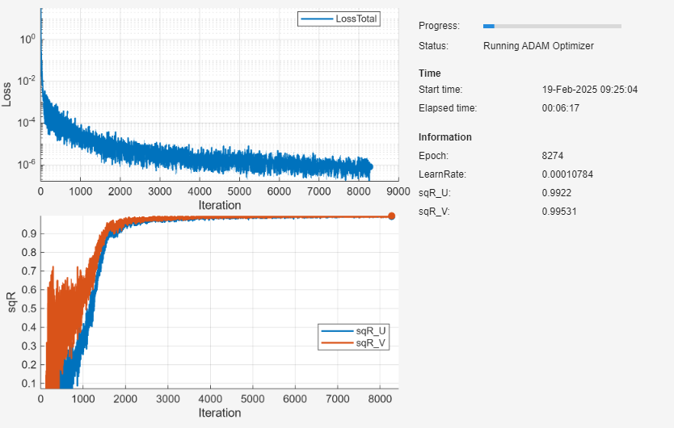
*First successful single-batch run: FE-residual loss and R² of $u_x$ and $u_y$ against FEM.*

We later added z-score input normalization, output scaling ($u/u_{\text{scale}}$ with $u_{\text{scale}} = \rho |g| L^2 / E$), a cosine-annealed learning rate ($10^{-3} \to 10^{-6}$), 3-member ensembles, and a selectable LayerNorm/BatchNorm option. The GIFs below show the MGN deformed mesh (colored by $|u|$) converging onto the FEM solution (black dashed) on the 25-node cantilever plate under gravity, together with the loss and $1 - R^2$ curves.

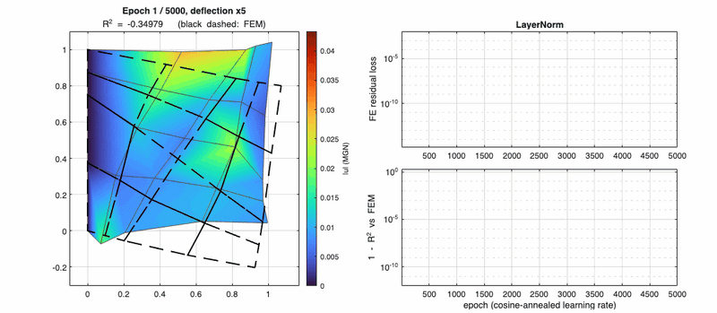
*LayerNorm, normalized inputs: the MGN converges onto FEM, with $1 - R^2$ falling below $10^{-10}$.*

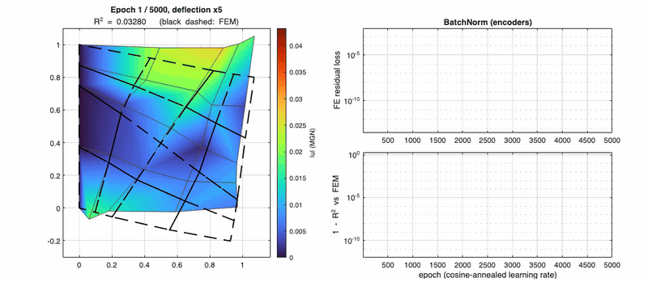
*BatchNorm in the encoders: converges, but more slowly and less reliably across ensemble members.*

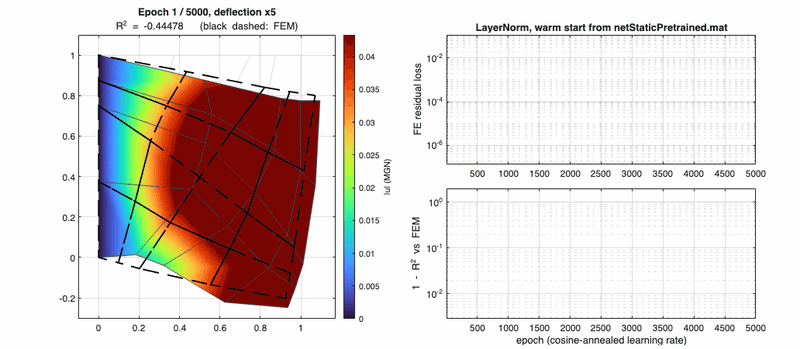
*Warm start from a network pretrained on different node features: it plateaus, which makes it a poor initializer.*

| Run (5,000 epochs, 25-node plate) | Ensemble error vs FEM | Notes |
| :-- | :--: | :-- |
| LayerNorm, normalized inputs, 3 members | **0.029%** | members 0.000 / 0.049 / 0.037% |
| BatchNorm (encoders), 3 members | 0.15% | one member stalls at 0.42% |
| LayerNorm, raw inputs, 1 member | 0.001% | input normalization doesn't matter at this size |
| LayerNorm, warm start from a pretrained net | 5.4% | pretrained on different node features |

---

## 4. Transient PI-MGN

We extended the FEM with a consistent mass matrix $\mathbf{M}$ and **Newmark-β time integration** (trapezoidal rule, β = 1/4, γ = 1/2) for a gravity-loaded cantilever plate released from rest. We tried four physics losses:

1. Backward Euler on $u$.
2. A velocity-based loss.
3. A two-term Newmark loss with an interpolation-consistency term.
4. The final version: the MGN predicts the acceleration $\mathbf{a}_{n+1}$, the displacement and velocity follow from trapezoidal integration, and the loss is the semi-discrete equation of motion

$$\mathcal{L} = \big\| \mathbf{M}\mathbf{a}_{n+1} + \mathbf{K}\mathbf{u}_{n+1} - \mathbf{F} \big\|^2 .$$

The network is trained **autoregressively**: the predicted $u$ and $v$ are fed back as node features, step by step, for 300 steps with dt = 1 ms (0.3 s). At test time we roll it out to **0.9 s, three times the training horizon**, on three meshes: a coarse square plate, a fine square plate (337 nodes), and a coarse tapered **triangular plate** with vertices (0,0), (1,0.5), and (0,1), meshed with quads in Gmsh. In the GIFs below, red is the MGN prediction and black dashed is Newmark FEM.

  <figure style="margin:0; flex:1 1 30%; min-width:200px; text-align:center;">
    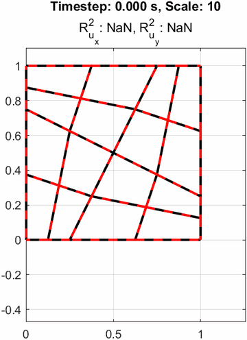
    <figcaption><em>Coarse square plate</em></figcaption>
  </figure>
  <figure style="margin:0; flex:1 1 30%; min-width:200px; text-align:center;">
    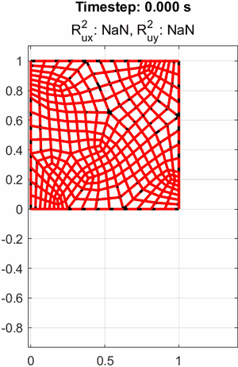
    <figcaption><em>Fine square plate (337 nodes)</em></figcaption>
  </figure>
  <figure style="margin:0; flex:1 1 30%; min-width:200px; text-align:center;">
    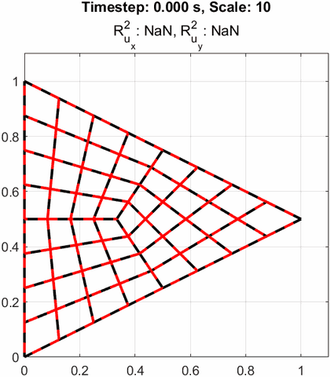
    <figcaption><em>Coarse triangular plate</em></figcaption>
  </figure>

*Transient PI-MGN rollouts from 0 to 0.9 s (deflection ×10). Red is the MGN, black dashed is FEM, and the title shows the running R².*

The GIFs below replay the same trained network on each mesh with the deformed shape colored by $|u|$, the $R^2(t)$ curves, and the right-edge tip deflection against FEM. Everything after the 0.3 s training cut-off is extrapolation.

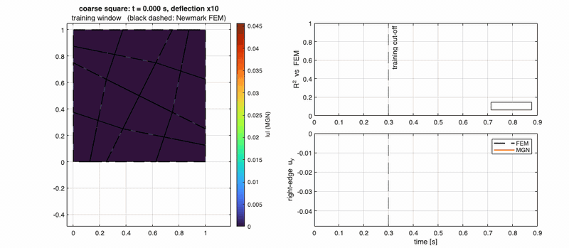
*Coarse square plate.*

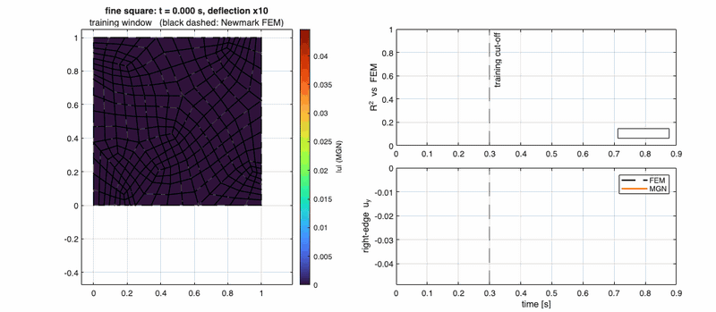
*Fine square plate.*

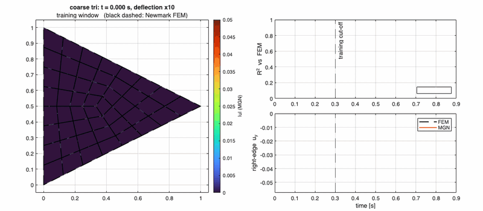
*Coarse triangular plate: the tip-deflection trace tracks FEM well past the training window.*

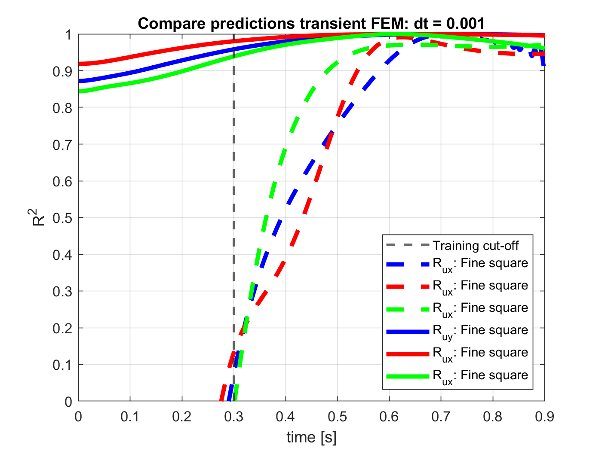
*$R^2$ vs. time for all three meshes. Solid lines are $u_y$ and dashed lines are $u_x$; red is the coarse square, blue the fine square, and green the triangular plate. Early $R^2(u_x)$ isn't meaningful because $u_x \approx 0$, and it becomes predictive after about 0.5 s.*

| Mesh | $R^2(u_y)$, training window 0–0.3 s (mean) | $R^2(u_y)$, extrapolation 0.3–0.9 s (mean / final) | $R^2(u_x)$, extrapolation (mean / final) |
| :-- | :--: | :--: | :--: |
| Coarse square | 0.949 | 0.996 / 0.996 | 0.774 / 0.946 |
| Fine square | 0.912 | 0.991 / 0.996 | 0.792 / 0.917 |
| Coarse triangular plate | 0.885 | 0.981 / 0.961 | 0.847 / 0.970 |

Training ran for 421k iterations (about 10.5 hours) with a curriculum over the physical time horizon. The replay below shows the loss, the $R^2$ values, and how far in time the network had been trained:

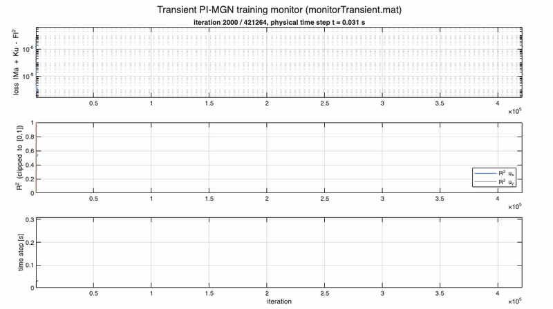
*Transient training monitor: $\|\mathbf{M}\mathbf{a} + \mathbf{K}\mathbf{u} - \mathbf{F}\|^2$ loss, $R^2$, and the physical time step reached.*

We also animated the displacement field of the plate on an unstructured triangular mesh:

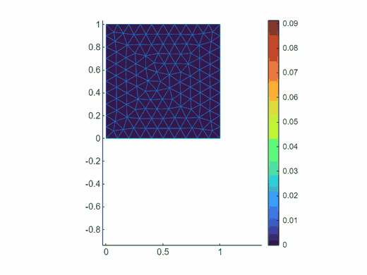
*Animated plate motion, colored by displacement magnitude.*

---

## 5. PINN benchmark against FEA (PyTorch)

To benchmark the PINNs we wrote a vectorized **Q4 FEA baseline** in Python. Against the exact Timoshenko solution, its relative $L_2$ error falls from 2.9% to 0.73%, 0.18%, and 0.046% on 16×4, 32×8, 64×16, and 128×32 meshes, the expected $O(h^2)$ convergence.

**PINN setup**

+ **Network:** a 4 × 64 tanh MLP. Inputs are normalized to $[-1, 1]$ over the bounding box, and outputs are scaled by a characteristic displacement per component.
+ **Boundary conditions:** Dirichlet conditions are hard-enforced as $\mathbf{u} = \mathbf{g}(\mathbf{x}) + \phi(\mathbf{x})\, s\, N_\theta(\hat{\mathbf{x}})$.
+ **Collocation:** 12,000 interior points plus 1,000 per boundary edge (15k–17k total), drawn from a scrambled Sobol sequence.
+ **Strong-form loss:** equilibrium plus traction residuals, non-dimensionalized by the applied stress. Trained with Adam (3,000 steps, cosine-annealed from $10^{-3}$ to $10^{-5}$), then 3,000 L-BFGS iterations.
+ **Energy loss (Deep Energy Method):** minimizes the total potential energy $\Pi = \int_\Omega \tfrac12 \boldsymbol{\sigma}:\boldsymbol{\varepsilon}\, d\Omega - \int_\Omega \mathbf{f}\cdot\mathbf{u}\, d\Omega - \int_{\Gamma_t} \bar{\mathbf{t}}\cdot\mathbf{u}\, d\Gamma$ with Adam only, re-drawing the quadrature points every 500 steps.
+ **Ensembles:** three independently seeded PINNs per case, with the mean as the prediction.

| Case | Geometry / BC / load | Loss | Ensemble error vs FEA | Ensemble spread |
| :-- | :-- | :--: | :--: | :--: |
| Timoshenko beam (L = 48, D = 12) | exact displacement at x = 0; parabolic end shear | strong | **1.04%** (0.30% vs analytic) | 0.16% |
| Cantilever, uniform pressure (L/D = 5) | fully clamped; top pressure | energy | **0.72%** | 0.29% |
| Plate with central hole, uniaxial | quarter model; symmetry BCs; $\sigma_x$ far field | strong | **1.30%** | 0.44% |
| Plate with central hole, biaxial | quarter model; symmetry BCs; $\sigma_x = \sigma_y$ | strong | **0.14%** | 0.11% |
| Square plate under gravity | clamped left edge; body force | energy | **0.68%** | 0.21% |

On the Timoshenko beam the PINN is closer to the analytic solution (0.30%) than the 32×8 FEA reference is (0.73%).

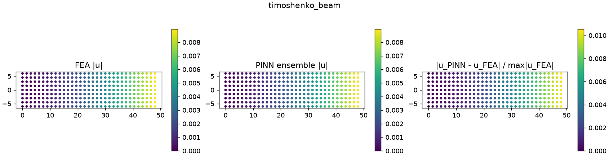
*Timoshenko beam: FEA, PINN ensemble, and pointwise error.*

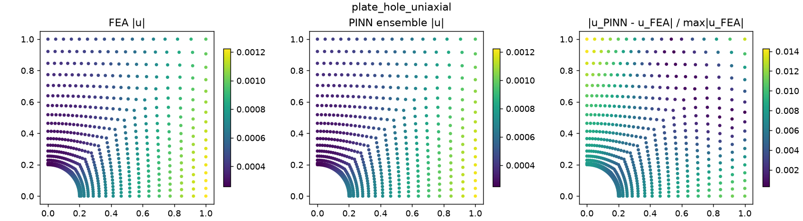
*Plate with a central hole, uniaxial tension (quarter model).*

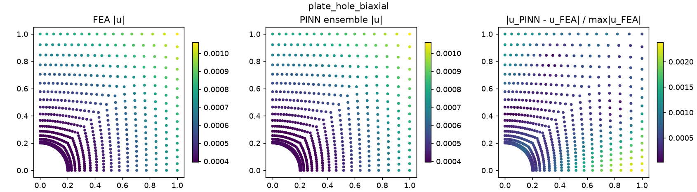
*Plate with a central hole, biaxial tension.*

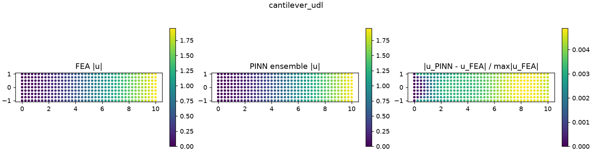
*Clamped cantilever under uniform pressure (energy loss).*

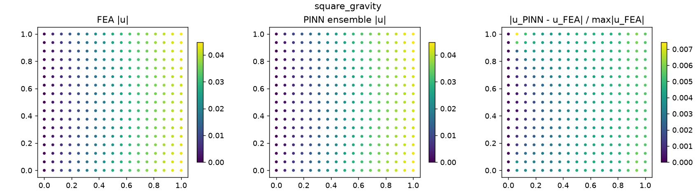
*Square plate under gravity, the same problem as the MATLAB PI-MGN (energy loss).*

**Problems we had to solve along the way**

+ **Residual scaling:** scaling the residual by $EU/L^2$ left the Timoshenko beam at 8% error even though the loss was tiny. Scaling by the applied stress fixed it.
+ **Clamped-corner singularities:** with the strong form, fully clamped cases collapsed to a near-zero field (101% error). Where a clamped edge meets a traction-free edge, the stress is singular, so the *correct* solution has a higher strong-form loss (≈ 247) than the wrong one (≈ 0.33). The energy formulation fixes this.
+ **L-BFGS on a fixed energy quadrature** exploits the gaps between collocation points, raising the error on the gravity square from 0.44% to 36%. Using Adam alone with resampled quadrature fixes it.
+ **Quadrature noise:** uniform Monte-Carlo points biased the energy integral by 7.5%, and Sobol points reduced the bias to 0.9%.

---

## 6. MeshGraphNet surrogate on a training pool

A PINN is solved for one problem. To get a single network that works across many problems, we ported the MATLAB MGN to PyTorch and trained it on a **pool of 192 FEA-labelled meshes**: 64 cantilever beams (8 aspect ratios; end shear, pressure, gravity, axial load), 80 plates with a central hole (5 radii × 8 far-field load ratios × 2 meshes), and 48 rectangular plates. Each sample carries its graph, its sparse stiffness system (for the physics loss), the FEA displacement, and a metadata dictionary (geometry, BCs, load, node and element counts, mesh size statistics, and FEA timings) that drives curriculum sampling.

+ **Model:** 12 message-passing blocks with residual connections, hidden size 64, SiLU activations, and LayerNorm or BatchNorm after each MLP.
+ **Normalization:** online z-score normalizers on the node and edge features. The network predicts an RMS-normalized displacement *pattern* plus a pooled head for the dimensionless log-amplitude $\log_{10}(\mathrm{rms}(u)\,E/\Sigma|F|)$.
+ **Loss:** pattern MSE + amplitude MSE + $0.01\,\|\mathbf{K}\mathbf{u} - \mathbf{F}\|^2/\|\mathbf{F}\|^2$, trained with Adam and cosine annealing for 300 epochs, as a 3-seed ensemble.

**Global load descriptors broadcast to every node were essential.** Without them, loads live on a handful of boundary nodes that 12 message-passing hops can't carry across a 30–70-element mesh, and even the *training* error sat at 25–74%.

| Held-out case (unseen parameter) | Nodes | Ensemble error |
| :-- | :--: | :--: |
| Plate with hole, a = 0.25, uniaxial (unseen radius) | 435 | **1.9%** |
| Plate with hole, a = 0.25, biaxial, finer mesh | 861 | **3.5%** |
| Plate with hole, a = 0.2, $\sigma_y/\sigma_x = 0.5$ (unseen load ratio) | 703 | **3.0%** |
| Plate 1×1, lateral body load | 441 | 6.2% |
| Timoshenko beam, L/D = 4 (unseen), finer mesh | 637 | 6.1% |
| Plate 1.5×1, gravity | 247 | 6.5% |
| Beam, L/D = 7 (unseen), uniform pressure | 513 | 27.5% |
| Beam, L/D = 7 (unseen), end shear | 781 | 38.7% |
| **Median over held-out cases** | | **6.2%** |

The model stays under 5% on every unseen plate-with-hole case but generalizes poorly to long, slender beams. Beam deflection scales like $(L/D)^3$ and spans 50–70 elements, beyond the 12-hop receptive field. In the ablations, LayerNorm clearly beats BatchNorm (6.2% vs 19.5% held-out median), since BatchNorm statistics mix nodes from different graphs and mesh sizes. A coarse-to-fine curriculum warm start made things *worse* (10.1%).

**Timing vs FEA.** A 3-member ensemble on the GPU runs 20–34% faster than a sparse direct FEA solve (a single model about 50% faster), but only on meshes with 6.6k–51k DOFs, 4–60× larger than anything in the training pool, where the error climbs to 16–88%. On the meshes where the MGN is accurate (≤ 1.7k DOFs), a direct solve takes only 4–11 ms and is faster than the network. Keeping accuracy at the sizes where the network is faster will take multi-scale (hierarchical) message passing and training on larger meshes.

---

## 7. Differentiable GNN solver for fluid–solid interaction

Toward the FSI goal, we built a "fin in a channel" problem: **steady Stokes flow** in a 4 × 1 channel with parabolic inflow past an **elastic flap** clamped to the channel floor.

+ **Fluid:** Q1–Q1 velocity/pressure with Brezzi–Pitkäranta stabilization, so every unknown lives on a node, which suits a GNN.
+ **Solid:** Q4 plane stress.
+ **Coupling:** a sparse traction operator $\mathbf{F}_s = \mathbf{C}\,\mathbf{x}_f$ built from $\boldsymbol{\sigma} = -p\mathbf{I} + \mu(\nabla\mathbf{v} + \nabla\mathbf{v}^\top)$ on the flap surface.
+ **Validation:** the upstream pressure gradient is −11.9 (Poiseuille theory: −12), and the peak velocity in the constriction is 2.9 (≈ 3 expected).

One MeshGraphNet on the joint fluid + solid graph (1.1k–2.4k nodes) predicts $[v_x, v_y, p, u_x, u_y]$ at every node. The loss combines supervised field errors with $\log(1 + r)$ of both discrete residuals. The solid residual $\|\mathbf{K}_s\mathbf{u} - \mathbf{C}\mathbf{x}_f\|^2$ uses the *predicted* fluid state, so gradients flow back through the coupling operator into the fluid prediction and the whole pipeline is end-to-end differentiable. Training used a **fluid-only warm start**: the first 30% of epochs train only the fluid branch, and then fully coupled training begins.

| Test flap (not in the training pool) | Velocity | Pressure | Flap displacement |
| :-- | :--: | :--: | :--: |
| h = 0.45, x₀ = 1.25 | 4.5% | 3.8% | 4.8% |
| h = 0.55, x₀ = 1.0, finer unseen mesh | 6.8% | 6.7% | 3.8% |
| h = 0.35, x₀ = 1.2, wider flap | 2.1% | 4.3% | 5.2% |
| *Same tests, trained without the warm start* | 2.3–8.7% | 6.2–10.9% | **7.4–32%** |

The warm start matters most for the solid. The flap load is the traction of the *predicted* flow, so fluid error propagates straight into the flap amplitude, and securing the fluid first cuts the flap error from as much as 32% down to 3.8–5.2%. The current scope is one-way coupling with small deformations at Re → 0.

---

## Training curves

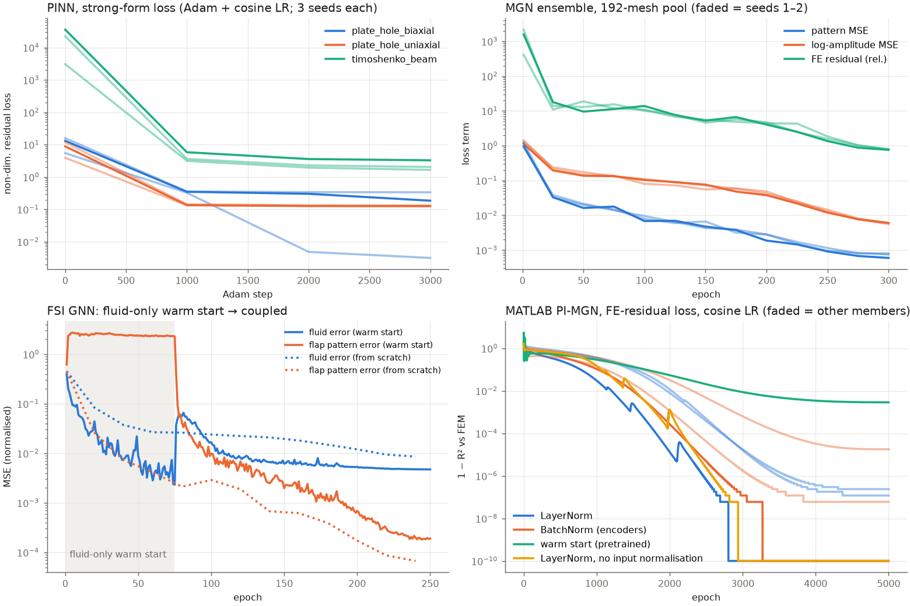
*Top left: PINN strong-form loss (Adam + cosine LR, 3 seeds per case). Top right: MGN ensemble loss terms on the 192-mesh pool. Bottom left: FSI GNN, where the shaded region is the fluid-only warm start. Training from scratch reaches a lower flap-pattern error but a higher fluid error. Bottom right: MATLAB PI-MGN $1 - R^2$ vs FEM for LayerNorm, BatchNorm, warm start, and raw-input variants.*

---

## 8. Review: Gen-FVGN

We presented a review (June 2025) of *Gen-FVGN*, a fully differentiable, unsupervised GNN-based **finite-volume** solver for Poisson and Navier–Stokes problems on unstructured meshes. It shaped several of the design choices above:

+ **Method:** a differentiable FVM with weighted least-squares gradient reconstruction, vertex-centred variables, and cell-centred PDE losses.
+ **Architecture:** an encoder, a GN-block processor (edge → cell → vertex aggregation, 2 × 128 SiLU MLPs with LayerNorm), and a decoder with an equation-type mask.
+ **Training:** one-step iterative training from a **training pool of meshes carrying metadata** (vertices, edges, cells, current state, BCs, and a PDE tag), with random mesh resets for BC and source diversity.

---

## Next steps

+ **Complex geometries:** generate shapes automatically and compute boundary normals for traction and strong-form residuals. We plan to generalize over shapes, Dirichlet sets, and loads, with node inputs $[x, y, \text{Dirichlet flags}, t_x, t_y, f]$.
+ **Mesh quality:** use Jacobian-based element validity checks to suppress "jagged" MGN outputs.
+ **Toward full FSI:** move from one-way steady Stokes to two-way coupling with a moving fluid mesh and higher Reynolds numbers.
+ **Scalability:** use multi-scale message passing so the MGN stays accurate on the large meshes where it is already faster than FEA.
